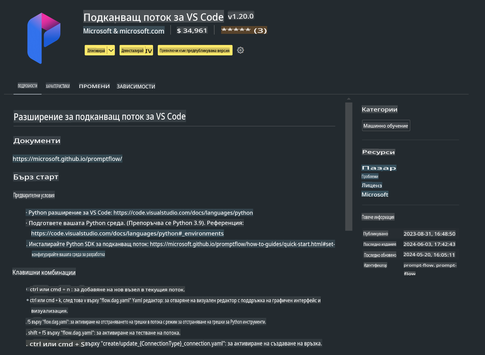

# **Лаборатория 0 - Инсталация**

Когато влезем в лабораторията, трябва да конфигурираме съответната среда:


### **1. Python 3.11+**

Препоръчително е да използвате miniforge за конфигуриране на вашата Python среда.

За да конфигурирате miniforge, моля, посетете [https://github.com/conda-forge/miniforge](https://github.com/conda-forge/miniforge)

След като конфигурирате miniforge, изпълнете следната команда в Power Shell:

```bash

conda create -n pyenv python==3.11.8 -y

conda activate pyenv

```


### **2. Инсталиране на Prompt flow SDK**

В Лаборатория 1 ще използваме Prompt flow, затова трябва да конфигурирате Prompt flow SDK.

```bash

pip install promptflow --upgrade

```

Можете да проверите promptflow SDK с тази команда:


```bash

pf --version

```

### **3. Инсталиране на разширението Prompt flow за Visual Studio Code**



### **4. MLX Framework на Apple**

MLX е фреймуърк за машинно обучение, създаден за изследвания върху Apple silicon, разработен от екипа за машинно обучение на Apple. Можете да използвате **Apple MLX framework**, за да ускорите LLM / SLM на Apple Silicon. Ако искате да научите повече, можете да прочетете [https://github.com/microsoft/PhiCookBook/blob/main/md/01.Introduction/03/MLX_Inference.md](https://github.com/microsoft/PhiCookBook/blob/main/md/01.Introduction/03/MLX_Inference.md).

Инсталирайте библиотеката на MLX framework в bash:


```bash

pip install mlx-lm

```


### **5. Други Python библиотеки**

Създайте файл requirements.txt и добавете следното съдържание:

```txt

notebook
numpy 
scipy 
scikit-learn 
matplotlib 
pandas 
pillow 
graphviz

```


### **6. Инсталиране на NVM**

Инсталирайте nvm в Powershell:


```bash

brew install nvm

```

Инсталирайте nodejs версия 18.20:


```bash

nvm install 18.20.0

nvm use 18.20.0

```

### **7. Инсталиране на поддръжка за разработка във Visual Studio Code**


```bash

npm install --global yo generator-code

```

Поздравления! Успешно конфигурирахте SDK. Следващата стъпка е да преминете към практическите упражнения.

**Отказ от отговорност**:  
Този документ е преведен с помощта на автоматизирани AI услуги за превод. Въпреки че се стремим към точност, моля, имайте предвид, че автоматизираните преводи може да съдържат грешки или неточности. Оригиналният документ на неговия изходен език трябва да се счита за авторитетен източник. За критична информация се препоръчва професионален превод от човек. Не носим отговорност за недоразумения или погрешни интерпретации, произтичащи от използването на този превод.