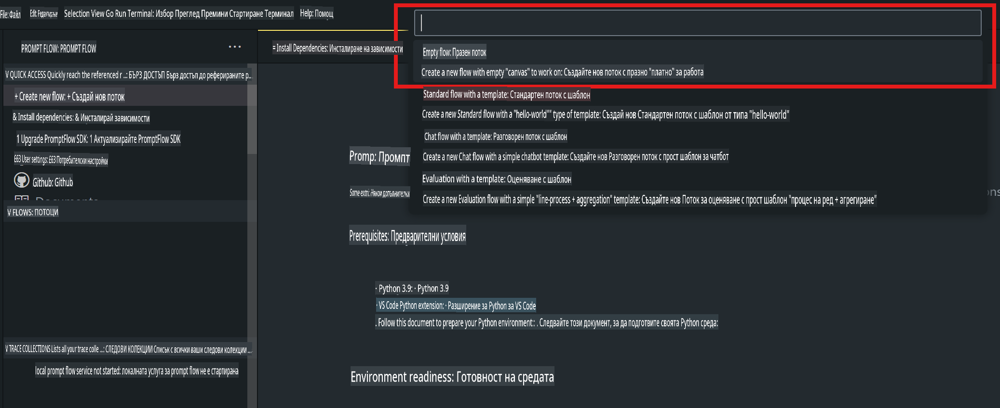
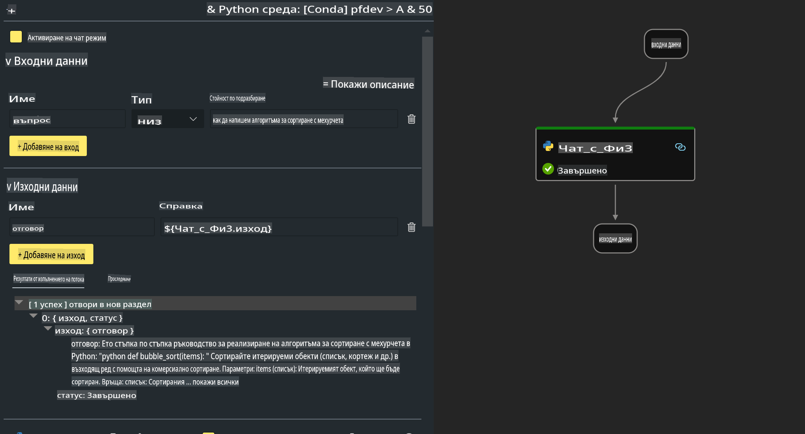

# **Лаборатория 2 - Изпълнение на Prompt flow с Phi-3-mini в AIPC**

## **Какво е Prompt flow**

Prompt flow е набор от инструменти за разработка, създадени да улеснят целия цикъл на разработка на AI приложения, базирани на LLM – от генериране на идеи, прототипиране, тестване, оценка до внедряване в производство и мониторинг. Той прави инженерството на подканите много по-лесно и ви позволява да създавате приложения с LLM с качество за производство.

С Prompt flow ще можете:

- Да създавате потоци, които свързват LLM, подканите, Python код и други инструменти в изпълним работен процес.

- Лесно да отстранявате грешки и да подобрявате вашите потоци, особено взаимодействието с LLM.

- Да оценявате вашите потоци, като изчислявате показатели за качество и производителност с по-големи набори от данни.

- Да интегрирате тестването и оценката във вашата CI/CD система, за да гарантирате качеството на потока.

- Да внедрявате вашите потоци в избраната от вас платформа за обслужване или лесно да ги интегрирате в базата код на вашето приложение.

- (Опционално, но силно препоръчително) Да си сътрудничите с вашия екип, като използвате облачната версия на Prompt flow в Azure AI.


## **Създаване на потоци за генериране на код на Apple Silicon**

***Забележка***: Ако не сте завършили инсталирането на средата, моля, посетете [Лаборатория 0 - Инсталации](./01.Installations.md)

1. Отворете разширението Prompt flow в Visual Studio Code и създайте празен проект за поток.



2. Добавете параметри за вход и изход и добавете Python код като нов поток.




Можете да се позовете на тази структура (flow.dag.yaml), за да създадете вашия поток:

```yaml

inputs:
  prompt:
    type: string
    default: Write python code for Fibonacci serie. Please use markdown as output
outputs:
  result:
    type: string
    reference: ${gen_code_by_phi3.output}
nodes:
- name: gen_code_by_phi3
  type: python
  source:
    type: code
    path: gen_code_by_phi3.py
  inputs:
    prompt: ${inputs.prompt}


```

3. Квантувайте phi-3-mini

Ние се стремим да изпълняваме SLM по-ефективно на локални устройства. Обикновено квантуваме модела (INT4, FP16, FP32).


```bash

python -m mlx_lm.convert --hf-path microsoft/Phi-3-mini-4k-instruct

```

**Забележка:** По подразбиране папката е mlx_model 

4. Добавете код в ***Chat_With_Phi3.py***


```python


from promptflow import tool

from mlx_lm import load, generate


# The inputs section will change based on the arguments of the tool function, after you save the code
# Adding type to arguments and return value will help the system show the types properly
# Please update the function name/signature per need
@tool
def my_python_tool(prompt: str) -> str:

    model_id = './mlx_model_phi3_mini'

    model, tokenizer = load(model_id)

    # <|user|>\nWrite python code for Fibonacci serie. Please use markdown as output<|end|>\n<|assistant|>

    response = generate(model, tokenizer, prompt="<|user|>\n" + prompt  + "<|end|>\n<|assistant|>", max_tokens=2048, verbose=True)

    return response


```

4. Можете да тествате потока чрез Debug или Run, за да проверите дали генерирането на код е успешно.


5. Изпълнете потока като API за разработка в терминала.

```

pf flow serve --source ./ --port 8080 --host localhost   

```

Можете да го тествате в Postman / Thunder Client.


### **Забележка**

1. Първото стартиране отнема дълго време. Препоръчително е да изтеглите модела phi-3 от Hugging Face CLI.

2. С оглед на ограничената изчислителна мощност на Intel NPU, препоръчително е да използвате Phi-3-mini-4k-instruct.

3. Използваме ускорение на Intel NPU за конвертиране в INT4, но ако стартирате услугата отново, трябва да изтриете кеша и папките nc_workshop.


## **Ресурси**

1. Научете повече за Promptflow [https://microsoft.github.io/promptflow/](https://microsoft.github.io/promptflow/)

2. Научете повече за Intel NPU Acceleration [https://github.com/intel/intel-npu-acceleration-library](https://github.com/intel/intel-npu-acceleration-library)

3. Примерен код, изтеглете [Примерен код за локален NPU агент](../../../../../../../../../code/07.Lab/01/AIPC/local-npu-agent)

**Отказ от отговорност**:  
Този документ е преведен с помощта на машинни AI услуги за превод. Въпреки че се стремим към точност, моля, имайте предвид, че автоматичните преводи може да съдържат грешки или неточности. Оригиналният документ на неговия оригинален език трябва да се счита за авторитетен източник. За критична информация се препоръчва професионален човешки превод. Не носим отговорност за каквито и да било недоразумения или погрешни интерпретации, произтичащи от използването на този превод.