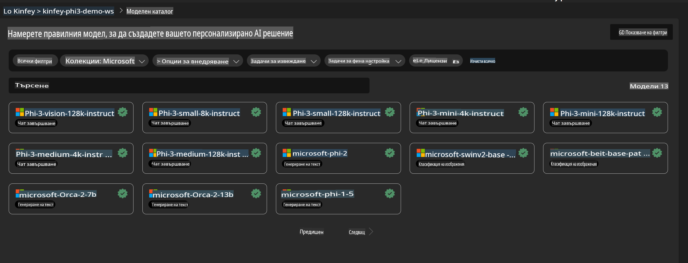
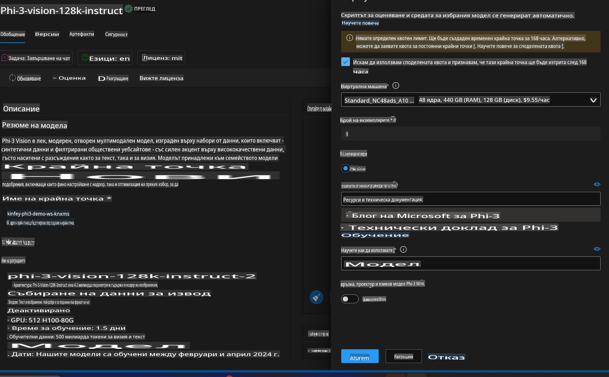
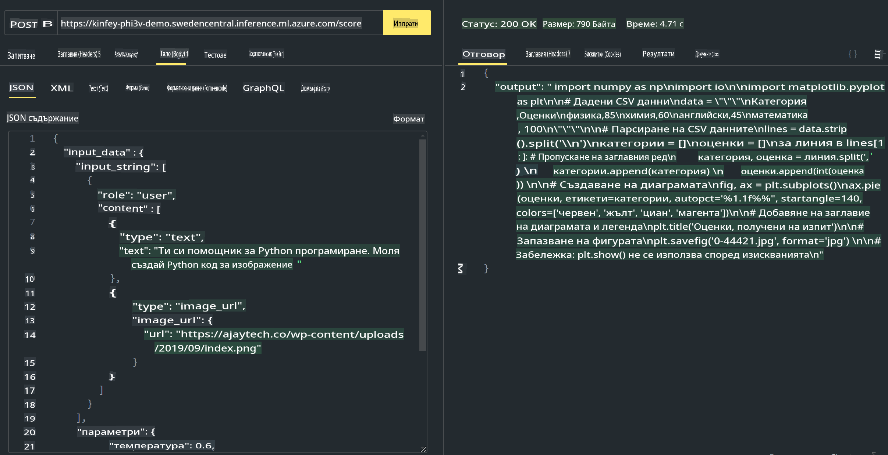

# **Лабораторно упражнение 3 - Деплой на Phi-3-Vision в Azure Machine Learning Service**

Използваме NPU, за да завършим продукционния деплой на локален код, а след това искаме да въведем възможността за използване на PHI-3-VISION, за да постигнем генериране на код от изображения.

В това въведение ще изградим бързо услуга Model As Service Phi-3 Vision в Azure Machine Learning Service.

***Забележка***: Phi-3 Vision изисква изчислителна мощност, за да генерира съдържание с по-бърза скорост. Нуждаем се от облачна изчислителна мощност, за да постигнем това.


### **1. Създаване на Azure Machine Learning Service**

Трябва да създадем Azure Machine Learning Service в Azure Portal. Ако искате да научите как, моля, посетете този линк: [https://learn.microsoft.com/azure/machine-learning/quickstart-create-resources?view=azureml-api-2](https://learn.microsoft.com/azure/machine-learning/quickstart-create-resources?view=azureml-api-2)


### **2. Избор на Phi-3 Vision в Azure Machine Learning Service**




### **3. Деплой на Phi-3-Vision в Azure**




### **4. Тест на Endpoint в Postman**




***Забележка***

1. Параметрите, които трябва да бъдат предадени, трябва да включват Authorization, azureml-model-deployment и Content-Type. Трябва да проверите информацията за деплоя, за да ги получите.

2. За да предадете параметри, Phi-3-Vision изисква предаване на линк към изображение. Моля, вижте метода на GPT-4-Vision за предаване на параметри, например:

```json

{
  "input_data":{
    "input_string":[
      {
        "role":"user",
        "content":[ 
          {
            "type": "text",
            "text": "You are a Python coding assistant.Please create Python code for image "
          },
          {
              "type": "image_url",
              "image_url": {
                "url": "https://ajaytech.co/wp-content/uploads/2019/09/index.png"
              }
          }
        ]
      }
    ],
    "parameters":{
          "temperature": 0.6,
          "top_p": 0.9,
          "do_sample": false,
          "max_new_tokens": 2048
    }
  }
}

```

3. Извикване на **/score** чрез Post метода.

**Поздравления**! Завършихте бързия деплой на PHI-3-VISION и изпробвахте как да използвате изображения за генериране на код. Следващата стъпка е да изградим приложения в комбинация с NPU и облака.

**Отказ от отговорност**:  
Този документ е преведен с помощта на машинни AI услуги за превод. Въпреки че се стремим към точност, моля, имайте предвид, че автоматичните преводи могат да съдържат грешки или неточности. Оригиналният документ на неговия изходен език трябва да се счита за авторитетен източник. За критична информация се препоръчва професионален човешки превод. Ние не носим отговорност за каквито и да е недоразумения или погрешни интерпретации, произтичащи от използването на този превод.