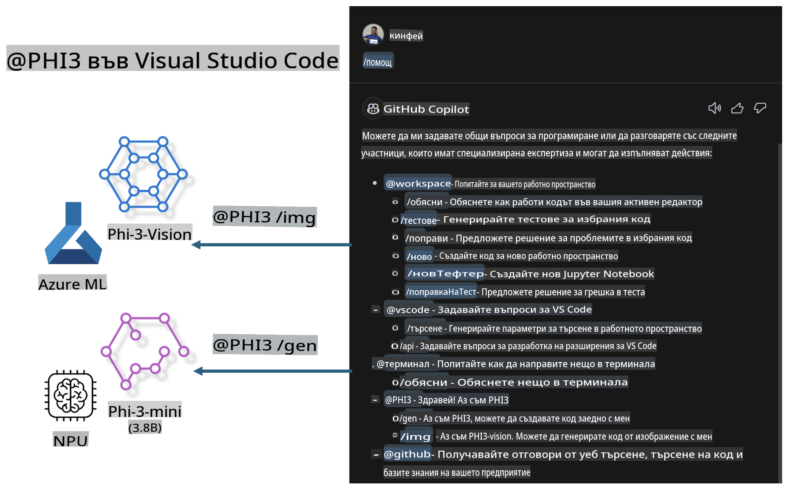

# **Създайте свой собствен Visual Studio Code GitHub Copilot Chat с Microsoft Phi-3 Family**

Използвали ли сте workspace агента в GitHub Copilot Chat? Искате ли да създадете агент за код за вашия екип? Тази практическа лаборатория цели да комбинира отворения код модел, за да създаде корпоративен агент за работа с код.

## **Основи**

### **Защо да изберем Microsoft Phi-3**

Phi-3 е семейство от модели, включващи phi-3-mini, phi-3-small и phi-3-medium, базирани на различни параметри за обучение за генериране на текст, завършване на диалози и генериране на код. Съществува също phi-3-vision, базиран на Vision. Подходящ е за предприятия или различни екипи, които искат да създадат офлайн решения за генеративен AI.

Препоръчително е да прочетете тази връзка [https://github.com/microsoft/PhiCookBook/blob/main/md/01.Introduction/01/01.PhiFamily.md](https://github.com/microsoft/PhiCookBook/blob/main/md/01.Introduction/01/01.PhiFamily.md)

### **Microsoft GitHub Copilot Chat**

Разширението GitHub Copilot Chat предоставя интерфейс за чат, който ви позволява да взаимодействате с GitHub Copilot и да получавате отговори на въпроси, свързани с програмиране, директно във VS Code, без да се налага да преглеждате документация или да търсите във форуми онлайн.

Copilot Chat може да използва синтактично оцветяване, отстъп и други форматиращи функции, за да направи отговора по-ясен. В зависимост от типа въпрос от потребителя, резултатът може да съдържа връзки към контекста, който Copilot е използвал за генериране на отговор, като изходни кодове или документация, или бутони за достъп до функционалностите на VS Code.

- Copilot Chat се интегрира в работния процес на разработчика и предоставя помощ там, където е необходима:

- Започнете чат директно от редактора или терминала за помощ, докато програмирате

- Използвайте изгледа за чат, за да имате AI асистент на разположение по всяко време

- Стартирайте Quick Chat, за да зададете бърз въпрос и да се върнете към работата си

Можете да използвате GitHub Copilot Chat в различни сценарии, като например:

- Отговаряне на въпроси за най-добрия начин за решаване на даден проблем

- Обясняване на чужд код и предлагане на подобрения

- Предлагане на поправки в кода

- Генериране на тестови случаи за единични модули

- Генериране на документация за кода

Препоръчително е да прочетете тази връзка [https://code.visualstudio.com/docs/copilot/copilot-chat](https://code.visualstudio.com/docs/copilot/copilot-chat?WT.mc_id=aiml-137032-kinfeylo)

###  **Microsoft GitHub Copilot Chat @workspace**

Използването на **@workspace** в Copilot Chat ви позволява да задавате въпроси относно цялата си база код. Въз основа на въпроса Copilot интелигентно извлича съответните файлове и символи, които след това използва в отговора си като връзки и примери за код.

За да отговори на вашия въпрос, **@workspace** търси в същите източници, които разработчик би използвал при навигация в база код във VS Code:

- Всички файлове в работната област, с изключение на тези, които са игнорирани от .gitignore файл

- Структурата на директориите с вложени папки и имена на файлове

- Индекса за търсене на код на GitHub, ако работната област е GitHub репозитория и е индексирана за търсене на код

- Символи и дефиниции в работната област

- Текущо избран текст или видим текст в активния редактор

Забележка: .gitignore се заобикаля, ако имате отворен файл или сте избрали текст в игнориран файл.

Препоръчително е да прочетете тази връзка [[https://code.visualstudio.com/docs/copilot/copilot-chat](https://code.visualstudio.com/docs/copilot/workspace-context?WT.mc_id=aiml-137032-kinfeylo)]

## **Научете повече за тази лаборатория**

GitHub Copilot значително подобри ефективността на програмиране в предприятията, а всяко предприятие се стреми да персонализира съответните функции на GitHub Copilot. Много предприятия са създали разширения, подобни на GitHub Copilot, въз основа на своите бизнес сценарии и модели с отворен код. За предприятията персонализираните разширения са по-лесни за контрол, но това също така влияе на потребителското изживяване. Все пак GitHub Copilot има по-силни функции при работа с общи сценарии и професионализъм. Ако изживяването може да остане последователно, би било по-добре да се персонализира разширението на предприятието. GitHub Copilot Chat предоставя съответните API за предприятията, за да разширят изживяването с чата. Поддържането на последователно изживяване и наличието на персонализирани функции води до по-добро потребителско изживяване.

Тази лаборатория основно използва модела Phi-3, комбиниран с локален NPU и хибриден Azure, за да създаде персонализиран агент в GitHub Copilot Chat ***@PHI3***, който да помага на корпоративните разработчици при генериране на код ***(@PHI3 /gen)*** и генериране на код на базата на изображения ***(@PHI3 /img)***.

### ***Забележка:*** 

Тази лаборатория в момента е реализирана в AIPC на Intel CPU и Apple Silicon. Ще продължим да актуализираме версията за NPU на Qualcomm.

## **Лаборатория**

| Име | Описание | AIPC | Apple |
| ------------ | ----------- | -------- |-------- |
| Lab0 - Инсталации(✅) | Конфигуриране и инсталиране на съответните среди и инструменти | [Go](./HOL/AIPC/01.Installations.md) |[Go](./HOL/Apple/01.Installations.md) |
| Lab1 - Стартиране на Prompt flow с Phi-3-mini (✅) | Комбинация с AIPC / Apple Silicon, използвайки локален NPU за създаване на код чрез Phi-3-mini | [Go](./HOL/AIPC/02.PromptflowWithNPU.md) |  [Go](./HOL/Apple/02.PromptflowWithMLX.md) |
| Lab2 - Разгръщане на Phi-3-vision в Azure Machine Learning Service(✅) | Генериране на код чрез разгръщане на Model Catalog на Azure Machine Learning Service - Phi-3-vision изображение | [Go](./HOL/AIPC/03.DeployPhi3VisionOnAzure.md) |[Go](./HOL/Apple/03.DeployPhi3VisionOnAzure.md) |
| Lab3 - Създаване на @phi-3 агент в GitHub Copilot Chat(✅)  | Създаване на персонализиран агент Phi-3 в GitHub Copilot Chat за завършване на генериране на код, генериране на графики, RAG и др. | [Go](./HOL/AIPC/04.CreatePhi3AgentInVSCode.md) | [Go](./HOL/Apple/04.CreatePhi3AgentInVSCode.md) |
| Примерен код (✅)  | Изтегляне на примерен код | [Go](../../../../../../../code/07.Lab/01/AIPC) | [Go](../../../../../../../code/07.Lab/01/Apple) |

## **Ресурси**

1. Phi-3 Cookbook [https://github.com/microsoft/Phi-3CookBook](https://github.com/microsoft/Phi-3CookBook)

2. Научете повече за GitHub Copilot [https://learn.microsoft.com/training/paths/copilot/](https://learn.microsoft.com/training/paths/copilot/?WT.mc_id=aiml-137032-kinfeylo)

3. Научете повече за GitHub Copilot Chat [https://learn.microsoft.com/training/paths/accelerate-app-development-using-github-copilot/](https://learn.microsoft.com/training/paths/accelerate-app-development-using-github-copilot/?WT.mc_id=aiml-137032-kinfeylo)

4. Научете повече за GitHub Copilot Chat API [https://code.visualstudio.com/api/extension-guides/chat](https://code.visualstudio.com/api/extension-guides/chat?WT.mc_id=aiml-137032-kinfeylo)

5. Научете повече за Azure AI Foundry [https://learn.microsoft.com/training/paths/create-custom-copilots-ai-studio/](https://learn.microsoft.com/training/paths/create-custom-copilots-ai-studio/?WT.mc_id=aiml-137032-kinfeylo)

6. Научете повече за Model Catalog на Azure AI Foundry [https://learn.microsoft.com/azure/ai-studio/how-to/model-catalog-overview](https://learn.microsoft.com/azure/ai-studio/how-to/model-catalog-overview)

**Отказ от отговорност**:  
Този документ е преведен с помощта на машинни AI услуги за превод. Въпреки че се стремим към точност, моля, имайте предвид, че автоматизираните преводи могат да съдържат грешки или неточности. Оригиналният документ на неговия оригинален език трябва да се счита за авторитетен източник. За критична информация се препоръчва професионален човешки превод. Не носим отговорност за каквито и да е недоразумения или погрешни интерпретации, произтичащи от използването на този превод.