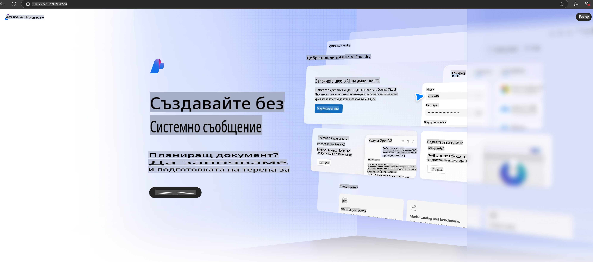

# **Използване на Phi-3 в Azure AI Foundry**

С развитието на Генеративния изкуствен интелект се стремим да използваме унифицирана платформа за управление на различни LLM и SLM, интеграция на данни в предприятията, операции по фино настройване/RAG и оценка на различни бизнес процеси след интеграция на LLM и SLM, така че генериращият изкуствен интелект да може да бъде по-добре внедрен в интелигентни приложения. [Azure AI Foundry](https://ai.azure.com) е платформа за генериращи AI приложения на корпоративно ниво.

С Azure AI Foundry можете да оценявате отговорите на големи езикови модели (LLM) и да организирате компоненти на приложенията с помощта на prompt flow за по-добра производителност. Платформата улеснява мащабирането от прототипи до пълноценни производствени решения с лекота. Непрекъснатият мониторинг и усъвършенстване осигуряват дългосрочен успех.

Можем бързо да внедрим модела Phi-3 в Azure AI Foundry чрез прости стъпки и след това да използваме Azure AI Foundry за извършване на свързани с Phi-3 дейности като Playground/Chat, фино настройване, оценка и други.

## **1. Подготовка**

Ако вече сте инсталирали [Azure Developer CLI](https://learn.microsoft.com/azure/developer/azure-developer-cli/overview?WT.mc_id=aiml-138114-kinfeylo) на вашата машина, използването на този шаблон е толкова лесно, колкото изпълнението на тази команда в нова директория.

## Ръчно създаване

Създаването на проект и хъб в Microsoft Azure AI Foundry е чудесен начин да организирате и управлявате вашата AI работа. Ето стъпка по стъпка ръководство, за да започнете:

### Създаване на проект в Azure AI Foundry

1. **Отворете Azure AI Foundry**: Влезте в портала на Azure AI Foundry.
2. **Създайте проект**:
   - Ако вече сте в проект, изберете "Azure AI Foundry" в горния ляв ъгъл на страницата, за да се върнете към началната страница.
   - Изберете "+ Create project".
   - Въведете име за проекта.
   - Ако имате хъб, той ще бъде избран по подразбиране. Ако имате достъп до повече от един хъб, можете да изберете друг от падащото меню. Ако искате да създадете нов хъб, изберете "Create new hub" и въведете име.
   - Изберете "Create".

### Създаване на хъб в Azure AI Foundry

1. **Отворете Azure AI Foundry**: Влезте с вашия Azure акаунт.
2. **Създайте хъб**:
   - Изберете Център за управление (Management center) от лявото меню.
   - Изберете "All resources", след това стрелката до "+ New project" и изберете "+ New hub".
   - В диалога "Create a new hub" въведете име за вашия хъб (например contoso-hub) и модифицирайте другите полета според желанието си.
   - Изберете "Next", прегледайте информацията и след това изберете "Create".

За по-подробни инструкции можете да се обърнете към официалната [документация на Microsoft](https://learn.microsoft.com/azure/ai-studio/how-to/create-projects).

След успешно създаване можете да получите достъп до студиото, което сте създали, чрез [ai.azure.com](https://ai.azure.com/)

Един AI Foundry може да съдържа множество проекти. Създайте проект в AI Foundry, за да подготвите средата.

Създайте Azure AI Foundry [QuickStarts](https://learn.microsoft.com/azure/ai-studio/quickstarts/get-started-code)

## **2. Внедряване на Phi модел в Azure AI Foundry**

Кликнете върху опцията Explore на проекта, за да влезете в каталога на моделите и изберете Phi-3.

Изберете Phi-3-mini-4k-instruct.

Кликнете върху 'Deploy', за да внедрите модела Phi-3-mini-4k-instruct.

> [!NOTE]
>
> Можете да изберете изчислителна мощност при внедряването.

## **3. Playground Chat Phi в Azure AI Foundry**

Отидете на страницата за внедряване, изберете Playground и започнете чат с Phi-3 в Azure AI Foundry.

## **4. Внедряване на модела от Azure AI Foundry**

За да внедрите модел от каталога на Azure Model, можете да следвате тези стъпки:

- Влезте в Azure AI Foundry.
- Изберете модела, който искате да внедрите, от каталога на Azure AI Foundry.
- На страницата с подробности за модела изберете Deploy, след което изберете Serverless API с Azure AI Content Safety.
- Изберете проекта, в който искате да внедрите вашите модели. За да използвате Serverless API, вашето работно пространство трябва да принадлежи към регионите East US 2 или Sweden Central. Можете да персонализирате името на внедряването.
- В съветника за внедряване изберете Pricing and terms, за да се запознаете с цените и условията за използване.
- Изберете Deploy. Изчакайте внедряването да бъде готово и да бъдете пренасочени към страницата Deployments.
- Изберете Open in playground, за да започнете взаимодействие с модела.
- Можете да се върнете на страницата Deployments, да изберете внедряването и да отбележите Target URL на крайния пункт и Secret Key, които можете да използвате за извикване на внедряването и генериране на резултати.
- Винаги можете да намерите подробности за крайния пункт, URL и ключове за достъп, като навигирате до таба Build и изберете Deployments от секцията Components.

> [!NOTE]
> Обърнете внимание, че вашият акаунт трябва да има разрешения за ролята Azure AI Developer на Resource Group, за да изпълнява тези стъпки.

## **5. Използване на Phi API в Azure AI Foundry**

Можете да получите достъп до https://{Your project name}.region.inference.ml.azure.com/swagger.json чрез Postman GET и да го комбинирате с Key, за да се запознаете с предоставените интерфейси.

Можете много удобно да получите параметрите за заявка, както и параметрите за отговор.

**Отказ от отговорност**:  
Този документ е преведен с помощта на услуги за машинен превод, базирани на изкуствен интелект. Въпреки че се стремим към точност, моля, имайте предвид, че автоматизираните преводи може да съдържат грешки или неточности. Оригиналният документ на неговия оригинален език трябва да се счита за авторитетен източник. За критична информация се препоръчва професионален превод от човек. Ние не носим отговорност за каквито и да било недоразумения или погрешни интерпретации, произтичащи от използването на този превод.