# Фина настройка на Phi-3 с Azure AI Foundry

Нека разгледаме как да направим фина настройка на езиковия модел Phi-3 Mini на Microsoft с помощта на Azure AI Foundry. Фината настройка позволява адаптиране на Phi-3 Mini за специфични задачи, правейки го още по-мощен и контекстуално осведомен.

## Съображения

- **Възможности:** Кои модели могат да бъдат фино настроени? Какво може базовият модел да постигне след настройка?
- **Разходи:** Какъв е моделът на ценообразуване за фина настройка?
- **Персонализация:** До каква степен мога да модифицирам базовия модел и по какъв начин?
- **Удобство:** Как се извършва фината настройка – необходимо ли е да пиша персонализиран код? Трябва ли да осигуря собствена изчислителна мощност?
- **Безопасност:** Фино настроените модели могат да носят рискове за безопасността – има ли мерки за предотвратяване на нежелани последици?

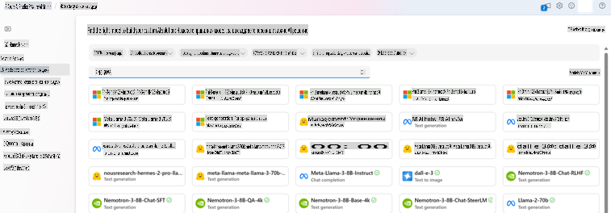

## Подготовка за фина настройка

### Предварителни изисквания

> [!NOTE]
> За моделите от семейството Phi-3, предлагането на фина настройка на принципа "плащай за това, което използваш" е налично само за хъбове, създадени в регионите **East US 2**.

- Абонамент за Azure. Ако нямате абонамент за Azure, създайте [платен акаунт в Azure](https://azure.microsoft.com/pricing/purchase-options/pay-as-you-go), за да започнете.

- [Проект в AI Foundry](https://ai.azure.com?WT.mc_id=aiml-138114-kinfeylo).
- Контроли за достъп, базирани на роли в Azure (Azure RBAC), се използват за предоставяне на достъп до операции в Azure AI Foundry. За да изпълните стъпките в тази статия, вашият потребителски акаунт трябва да бъде с роля __Azure AI Developer__ върху групата ресурси.

### Регистрация на доставчик на абонамент

Уверете се, че абонаментът е регистриран за доставчика на ресурси `Microsoft.Network`.

1. Влезте в [портала на Azure](https://portal.azure.com).
1. Изберете **Subscriptions** от лявото меню.
1. Изберете абонамента, който искате да използвате.
1. Изберете **AI project settings** > **Resource providers** от лявото меню.
1. Уверете се, че **Microsoft.Network** е в списъка с доставчици на ресурси. Ако не е, добавете го.

### Подготовка на данните

Подгответе своите тренировъчни и валидиращи данни, за да направите фина настройка на модела. Вашите тренировъчни и валидиращи набори от данни трябва да съдържат входни и изходни примери за това как искате моделът да работи.

Уверете се, че всички примери за обучение следват очаквания формат за извеждане. За ефективна фина настройка осигурете балансиран и разнообразен набор от данни.

Това включва поддържане на баланс в данните, включване на различни сценарии и периодично прецизиране на тренировъчните данни, за да се съобразят с реалните очаквания, което води до по-точни и балансирани отговори на модела.

Различните типове модели изискват различен формат на тренировъчните данни.

### Завършване на чат

Тренировъчните и валидиращите данни **трябва** да бъдат форматирани като JSON Lines (JSONL) документ. За `Phi-3-mini-128k-instruct` наборът от данни за фина настройка трябва да бъде във формат за разговори, използван от Chat completions API.

### Примерен файлов формат

```json
    {"messages": [{"role": "system", "content": "You are an Xbox customer support agent whose primary goal is to help users with issues they are experiencing with their Xbox devices. You are friendly and concise. You only provide factual answers to queries, and do not provide answers that are not related to Xbox."}, {"role": "user", "content": "Is Xbox better than PlayStation?"}, {"role": "assistant", "content": "I apologize, but I cannot provide personal opinions. My primary job is to assist you with any issues related to your Xbox device. Do you have any Xbox-related issues that need addressing?"}]}
    {"messages": [{"role": "system", "content": "You are an Xbox customer support agent whose primary goal is to help users with issues they are experiencing with their Xbox devices. You are friendly and concise. You only provide factual answers to queries, and do not provide answers that are not related to Xbox."}, {"role": "user", "content": "Can I play PC games on my Xbox?"}, {"role": "assistant", "content": "While Xbox consoles don't natively support PC games, they can play an array of Xbox games, many of which are also available on PC. Can I assist you with finding games compatible with your Xbox device?"}]}
    {"messages": [{"role": "system", "content": "You are an Xbox customer support agent whose primary goal is to help users with issues they are experiencing with their Xbox devices. You are friendly and concise. You only provide factual answers to queries, and do not provide answers that are not related to Xbox."}, {"role": "user", "content": "I'm having trouble connecting my Xbox to the Wi-Fi."}, {"role": "assistant", "content": "No worries, let's go through the network settings on your Xbox. Can you please tell me what happens when you try to connect it to the Wi-Fi?"}]}
```

Поддържаният файлов формат е JSON Lines. Файловете се качват в стандартното хранилище и се правят достъпни във вашия проект.

## Фина настройка на Phi-3 с Azure AI Foundry

Azure AI Foundry ви позволява да адаптирате големи езикови модели към вашите собствени набори от данни чрез процес, известен като фина настройка. Фината настройка предоставя значителна стойност чрез персонализация и оптимизация за специфични задачи и приложения. Това води до подобрена производителност, ефективност на разходите, намалена латентност и персонализирани резултати.

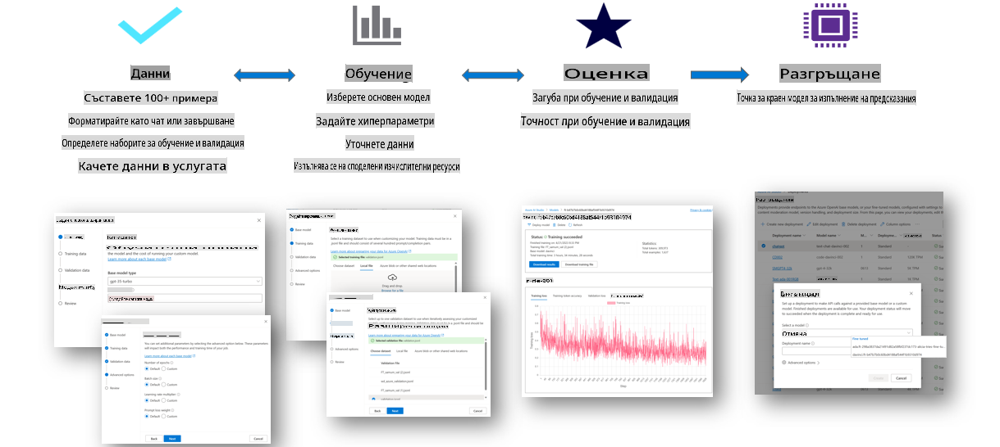

### Създаване на нов проект

1. Влезте в [Azure AI Foundry](https://ai.azure.com).

1. Изберете **+New project**, за да създадете нов проект в Azure AI Foundry.

    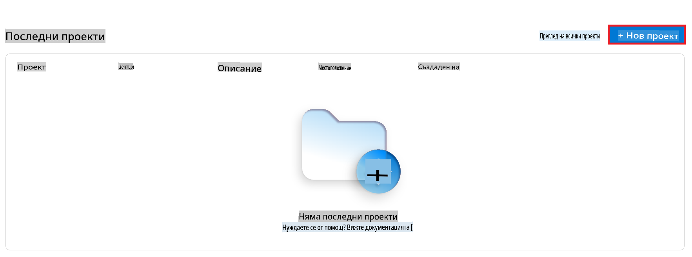

1. Изпълнете следните задачи:

    - Въведете **Hub name**. Трябва да бъде уникална стойност.
    - Изберете **Hub**, който да използвате (създайте нов, ако е необходимо).

    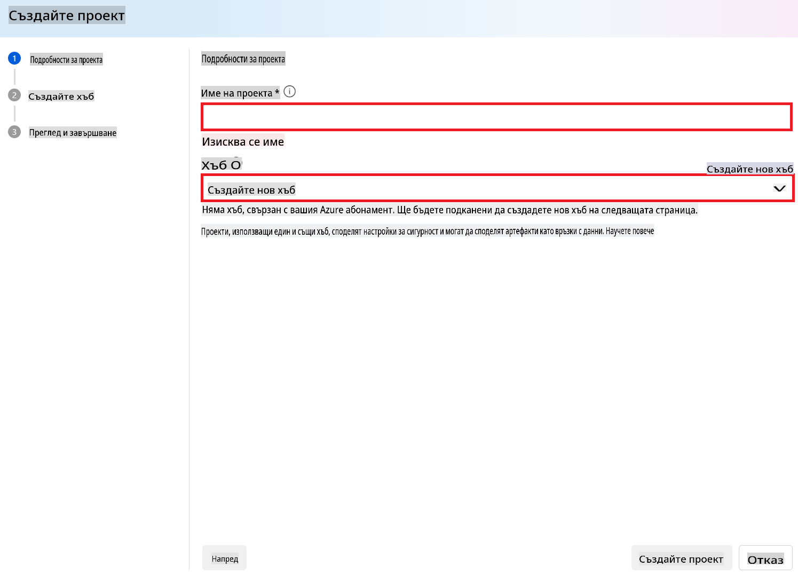

1. Изпълнете следните задачи, за да създадете нов хъб:

    - Въведете **Hub name**. Трябва да бъде уникална стойност.
    - Изберете вашия Azure **Subscription**.
    - Изберете **Resource group**, която да използвате (създайте нова, ако е необходимо).
    - Изберете **Location**, който искате да използвате.
    - Изберете **Connect Azure AI Services**, които да използвате (създайте нови, ако е необходимо).
    - Изберете **Connect Azure AI Search**, за да изберете **Skip connecting**.

    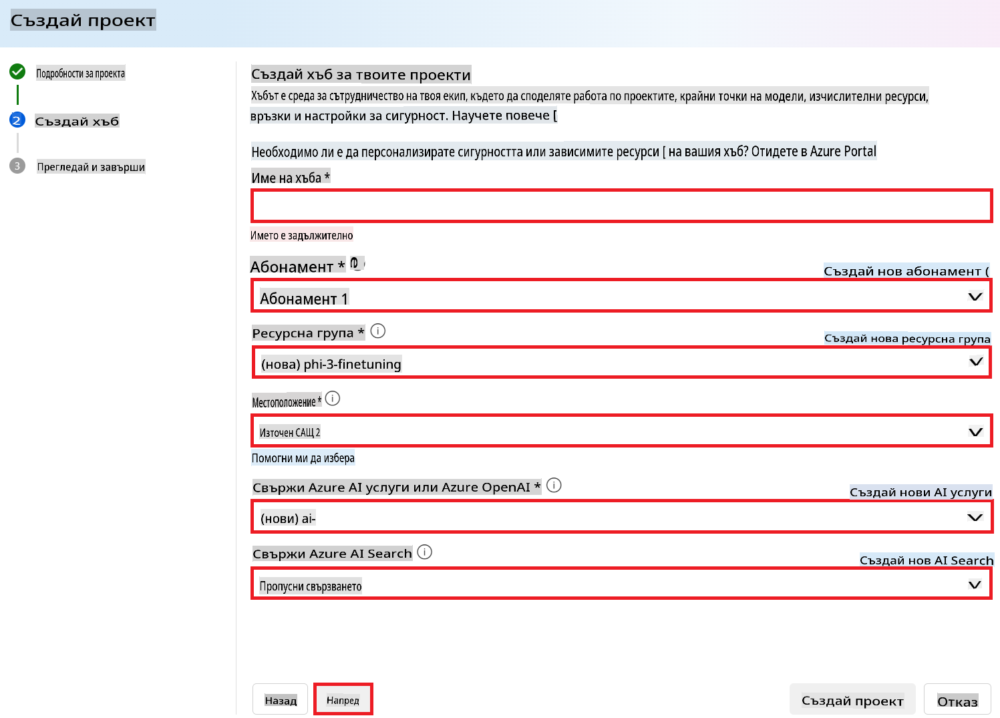

1. Изберете **Next**.
1. Изберете **Create a project**.

### Подготовка на данни

Преди фината настройка съберете или създайте набор от данни, релевантен за вашата задача, като например инструкции за чат, въпроси и отговори или друг подходящ текст. Почистете и предварително обработете тези данни, като премахнете шум, управлявате липсващи стойности и токенизирате текста.

### Фина настройка на Phi-3 модели в Azure AI Foundry

> [!NOTE]
> Фината настройка на Phi-3 модели в момента се поддържа в проекти, разположени в East US 2.

1. Изберете **Model catalog** от лявото меню.

1. Въведете *phi-3* в **търсачката** и изберете модела phi-3, който искате да използвате.

    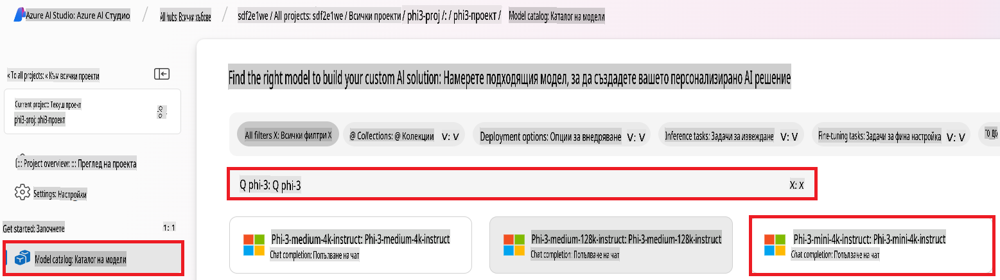

1. Изберете **Fine-tune**.

    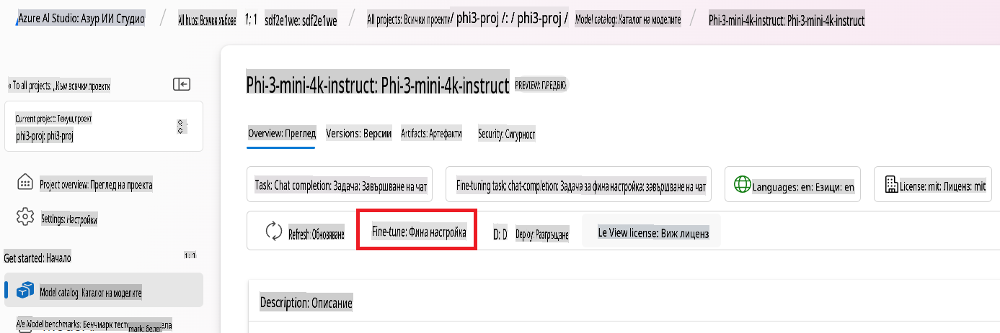

1. Въведете **Fine-tuned model name**.

    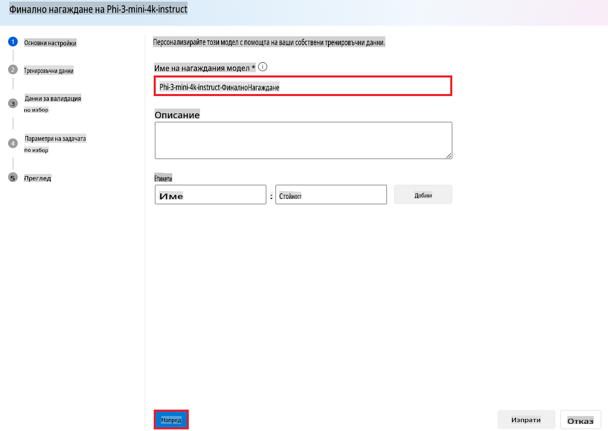

1. Изберете **Next**.

1. Изпълнете следните задачи:

    - Изберете **task type** като **Chat completion**.
    - Изберете **Training data**, които искате да използвате. Можете да ги качите чрез данни от Azure AI Foundry или от вашата локална среда.

    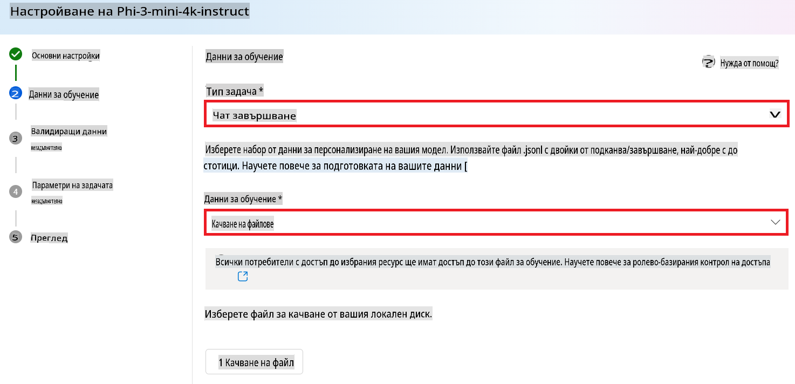

1. Изберете **Next**.

1. Качете **Validation data**, които искате да използвате, или изберете **Automatic split of training data**.

    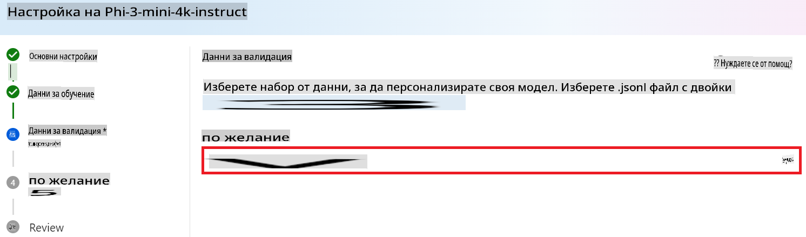

1. Изберете **Next**.

1. Изпълнете следните задачи:

    - Изберете **Batch size multiplier**, който искате да използвате.
    - Изберете **Learning rate**, който искате да използвате.
    - Изберете **Epochs**, които искате да използвате.

    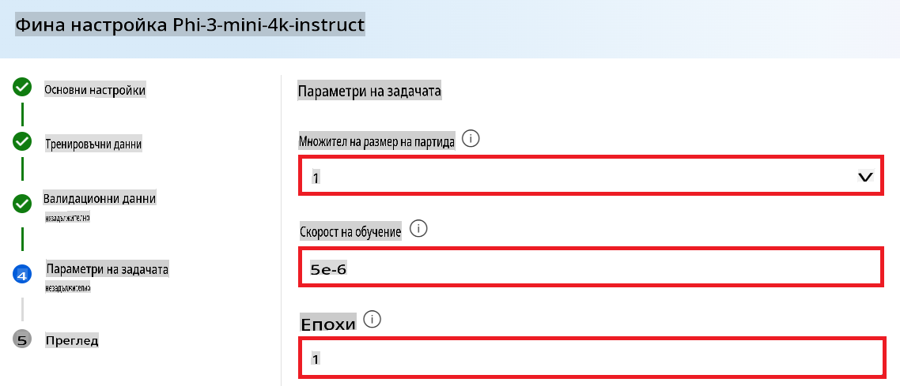

1. Изберете **Submit**, за да стартирате процеса на фина настройка.

    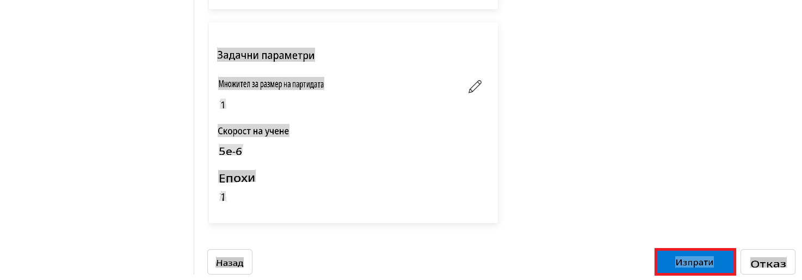

1. След като моделът ви бъде фино настроен, статусът ще бъде показан като **Completed**, както е показано на изображението по-долу. Сега можете да разположите модела и да го използвате във вашето приложение, в playground или в prompt flow. За повече информация вижте [Как да разположите Phi-3 модели с Azure AI Foundry](https://learn.microsoft.com/azure/ai-studio/how-to/deploy-models-phi-3?tabs=phi-3-5&pivots=programming-language-python).

    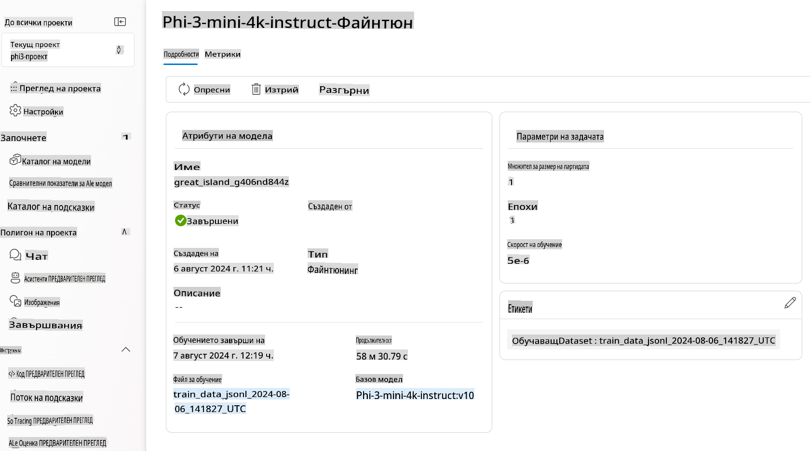

> [!NOTE]
> За по-подробна информация относно фината настройка на Phi-3, посетете [Fine-tune Phi-3 models in Azure AI Foundry](https://learn.microsoft.com/azure/ai-studio/how-to/fine-tune-phi-3?tabs=phi-3-mini).

## Изчистване на фино настроените модели

Можете да изтриете фино настроен модел от списъка с модели за фина настройка в [Azure AI Foundry](https://ai.azure.com) или от страницата с детайли за модела. Изберете фино настроения модел, който искате да изтриете от страницата за фина настройка, и след това изберете бутона Delete, за да го изтриете.

> [!NOTE]
> Не можете да изтриете персонализиран модел, ако има съществуващо разгръщане. Първо трябва да изтриете разгръщането на модела, преди да можете да изтриете персонализирания модел.

## Разходи и квоти

### Съображения за разходи и квоти за Phi-3 модели, фино настроени като услуга

Phi моделите, фино настроени като услуга, се предлагат от Microsoft и са интегрирани с Azure AI Foundry за употреба. Можете да намерите ценовата информация при [разгръщане](https://learn.microsoft.com/azure/ai-studio/how-to/deploy-models-phi-3?tabs=phi-3-5&pivots=programming-language-python) или фина настройка на моделите под раздела Pricing and terms в съветника за разгръщане.

## Филтриране на съдържание

Моделите, разположени като услуга с принцип "плащай за това, което използваш", са защитени от Azure AI Content Safety. Когато са разположени на реални крайни точки, можете да се откажете от тази функция. С активирана защита на съдържанието на Azure AI, както заявката, така и отговорът преминават през ансамбъл от класификационни модели, насочени към откриване и предотвратяване на изхода на вредно съдържание. Системата за филтриране на съдържание открива и предприема действия спрямо конкретни категории потенциално вредно съдържание както в заявките, така и в отговорите. Научете повече за [Azure AI Content Safety](https://learn.microsoft.com/azure/ai-studio/concepts/content-filtering).

**Конфигурация на фина настройка**

Хиперпараметри: Дефинирайте хиперпараметри като скорост на обучение, размер на партидата и брой тренировъчни епохи.

**Функция за загуба**

Изберете подходяща функция за загуба за вашата задача (напр. cross-entropy).

**Оптимизатор**

Изберете оптимизатор (напр. Adam) за актуализации на градиента по време на обучение.

**Процес на фина настройка**

- Заредете предварително обучен модел: Заредете чекпойнта на Phi-3 Mini.
- Добавете персонализирани слоеве: Добавете слоеве, специфични за задачата (напр. глава за класификация за инструкции за чат).

**Обучение на модела**
Фино настройте модела, използвайки подготвения си набор от данни. Наблюдавайте прогреса на обучението и коригирайте хиперпараметрите при нужда.

**Оценка и валидация**

Валидиращ набор: Разделете данните си на тренировъчни и валидиращи набори.

**Оценете производителността**

Използвайте метрики като точност, F1-score или perplexity, за да оцените производителността на модела.

## Запазване на фино настроения модел

**Чекпойнт**
Запазете чекпойнта на фино настроения модел за бъдеща употреба.

## Разгръщане

- Разгръщане като уеб услуга: Разположете фино настроения си модел като уеб услуга в Azure AI Foundry.
- Тествайте крайната точка: Изпратете тестови заявки до разположената крайна точка, за да проверите функционалността ѝ.

## Итериране и подобряване

Итерация: Ако производителността не е задоволителна, направете итерации чрез коригиране на хиперпараметрите, добавяне на повече данни или фина настройка за допълнителни епохи.

## Наблюдение и прецизиране

Непрекъснато наблюдавайте поведението на модела и го прецизирайте при нужда.

## Персонализация и разширяване

Персонализирани задачи: Phi-3 Mini може да бъде фино настроен за различни задачи извън инструкциите за чат. Изследвайте други случаи на употреба!
Експериментирайте: Пробвайте различни архитектури, комбинации от слоеве и техники за подобряване на производителността.

> [!NOTE]
> Фината настройка е итеративен процес. Експериментирайте, учете и адаптирайте модела си, за да постигнете най-добрите резултати за вашата специфична задача!

**Отказ от отговорност**:  
Този документ е преведен с помощта на автоматизирани AI услуги за превод. Въпреки че се стремим към точност, моля, имайте предвид, че автоматизираните преводи може да съдържат грешки или неточности. Оригиналният документ на неговия изходен език трябва да се счита за авторитетен източник. За критична информация се препоръчва професионален превод от човек. Не носим отговорност за каквито и да било недоразумения или погрешни тълкувания, възникнали от използването на този превод.