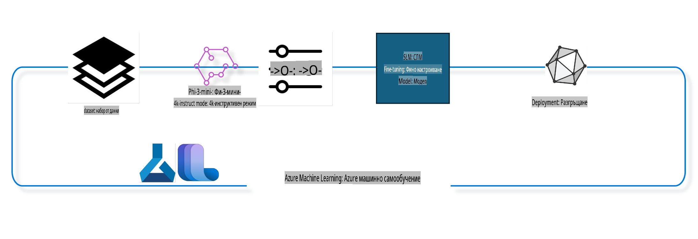

## Как да използвате компоненти за завършване на чат от системния регистър на Azure ML за фина настройка на модел

В този пример ще извършим фина настройка на модела Phi-3-mini-4k-instruct, за да завършим разговор между двама души, използвайки набора от данни ultrachat_200k.



Примерът ще покаже как да извършите фина настройка с помощта на Azure ML SDK и Python и след това да разположите финално настроения модел в онлайн крайна точка за инференция в реално време.

### Данни за обучение

Ще използваме набора от данни ultrachat_200k. Това е силно филтрирана версия на набора от данни UltraChat, който е използван за обучение на Zephyr-7B-β, водещ модел за чат с 7 милиарда параметъра.

### Модел

Ще използваме модела Phi-3-mini-4k-instruct, за да покажем как потребител може да настрои модел за задача по завършване на чат. Ако сте отворили този бележник от конкретна карта на модел, не забравяйте да замените името на модела с правилното.

### Задачи

- Изберете модел за фина настройка.
- Изберете и разгледайте данните за обучение.
- Конфигурирайте работата по фината настройка.
- Стартирайте работата по фината настройка.
- Прегледайте метриките за обучение и оценка.
- Регистрирайте финално настроения модел.
- Разположете финално настроения модел за инференция в реално време.
- Освободете ресурсите.

## 1. Настройка на предварителни изисквания

- Инсталирайте зависимости.
- Свържете се с работно пространство на AzureML. Научете повече в настройка на SDK автентикация. Заменете <WORKSPACE_NAME>, <RESOURCE_GROUP> и <SUBSCRIPTION_ID> по-долу.
- Свържете се със системния регистър на AzureML.
- Задайте незадължително име на експеримент.
- Проверете или създайте изчислителен ресурс.

> [!NOTE]
> Изисквания: един GPU възел може да има няколко GPU карти. Например, в един възел от Standard_NC24rs_v3 има 4 NVIDIA V100 GPU, докато в Standard_NC12s_v3 има 2 NVIDIA V100 GPU. Вижте документацията за тази информация. Броят GPU карти на възел е зададен в параметъра gpus_per_node по-долу. Задаването на тази стойност правилно ще гарантира използването на всички GPU в възела. Препоръчителните GPU конфигурации могат да бъдат намерени тук и тук.

### Python библиотеки

Инсталирайте зависимостите, като стартирате клетката по-долу. Това не е незадължителна стъпка, ако работите в нова среда.

```bash
pip install azure-ai-ml
pip install azure-identity
pip install datasets==2.9.0
pip install mlflow
pip install azureml-mlflow
```

### Работа с Azure ML

1. Този Python скрипт се използва за работа с услугата Azure Machine Learning (Azure ML). Ето какво прави:

    - Импортира необходимите модули от azure.ai.ml, azure.identity и azure.ai.ml.entities. Също така импортира модула time.

    - Опитва се да се автентикира с DefaultAzureCredential(), който предоставя опростен начин за автентикация в Azure. Ако това не успее, преминава към InteractiveBrowserCredential(), който предоставя интерактивен прозорец за вход.

    - Опитва се да създаде MLClient екземпляр, използвайки метода from_config, който чете конфигурацията от файла config.json. Ако това не успее, създава MLClient екземпляр, като ръчно предоставя subscription_id, resource_group_name и workspace_name.

    - Създава друг MLClient екземпляр за системния регистър на Azure ML с име "azureml". Този регистър съдържа модели, пайплайни за фина настройка и среди.

    - Задава experiment_name на "chat_completion_Phi-3-mini-4k-instruct".

    - Генерира уникален времеви маркер, който може да се използва за създаване на уникални имена и версии.

    ```python
    # Import necessary modules from Azure ML and Azure Identity
    from azure.ai.ml import MLClient
    from azure.identity import (
        DefaultAzureCredential,
        InteractiveBrowserCredential,
    )
    from azure.ai.ml.entities import AmlCompute
    import time  # Import time module
    
    # Try to authenticate using DefaultAzureCredential
    try:
        credential = DefaultAzureCredential()
        credential.get_token("https://management.azure.com/.default")
    except Exception as ex:  # If DefaultAzureCredential fails, use InteractiveBrowserCredential
        credential = InteractiveBrowserCredential()
    
    # Try to create an MLClient instance using the default config file
    try:
        workspace_ml_client = MLClient.from_config(credential=credential)
    except:  # If that fails, create an MLClient instance by manually providing the details
        workspace_ml_client = MLClient(
            credential,
            subscription_id="<SUBSCRIPTION_ID>",
            resource_group_name="<RESOURCE_GROUP>",
            workspace_name="<WORKSPACE_NAME>",
        )
    
    # Create another MLClient instance for the Azure ML registry named "azureml"
    # This registry is where models, fine-tuning pipelines, and environments are stored
    registry_ml_client = MLClient(credential, registry_name="azureml")
    
    # Set the experiment name
    experiment_name = "chat_completion_Phi-3-mini-4k-instruct"
    
    # Generate a unique timestamp that can be used for names and versions that need to be unique
    timestamp = str(int(time.time()))
    ```

## 2. Изберете базов модел за фина настройка

1. Phi-3-mini-4k-instruct е лек модел с 3.8 милиарда параметъра, базиран на набори от данни, използвани за Phi-2. Моделът принадлежи към семейството Phi-3, а версията Mini се предлага в два варианта: 4K и 128K, които представляват дължината на контекста (в токени), който може да поддържа. Необходимо е да настроим модела за нашата специфична цел, за да го използваме. Можете да разгледате тези модели в каталога на модели в AzureML Studio, като филтрирате по задача "chat-completion". В този пример използваме модела Phi-3-mini-4k-instruct. Ако сте отворили този бележник за друг модел, заменете името и версията на модела съответно.

    > [!NOTE]
    > Свойството model id на модела. Това ще бъде предадено като вход за работата по фината настройка. Също така е налично като поле Asset ID в страницата с детайли за модела в каталога на модели на AzureML Studio.

2. Този Python скрипт работи с услугата Azure Machine Learning (Azure ML). Ето какво прави:

    - Задава model_name на "Phi-3-mini-4k-instruct".

    - Използва метода get на свойството models на обекта registry_ml_client, за да извлече последната версия на модела със зададеното име от системния регистър на Azure ML. Методът get се извиква с два аргумента: името на модела и етикет, указващ, че трябва да се извлече последната версия на модела.

    - Отпечатва съобщение в конзолата, указващо името, версията и id на модела, който ще се използва за фина настройка. Методът format на низа се използва за вмъкване на името, версията и id на модела в съобщението. Името, версията и id на модела се достъпват като свойства на обекта foundation_model.

    ```python
    # Set the model name
    model_name = "Phi-3-mini-4k-instruct"
    
    # Get the latest version of the model from the Azure ML registry
    foundation_model = registry_ml_client.models.get(model_name, label="latest")
    
    # Print the model name, version, and id
    # This information is useful for tracking and debugging
    print(
        "\n\nUsing model name: {0}, version: {1}, id: {2} for fine tuning".format(
            foundation_model.name, foundation_model.version, foundation_model.id
        )
    )
    ```

## 3. Създайте изчислителен ресурс за използване с работата

Работата по фината настройка РАБОТИ САМО с GPU изчислителен ресурс. Размерът на изчислителния ресурс зависи от големината на модела и в повечето случаи е трудно да се определи правилният изчислителен ресурс за задачата. В тази клетка ще насочим потребителя как да избере правилния изчислителен ресурс.

> [!NOTE]
> Изчислителните ресурси, изброени по-долу, работят с най-оптимизирана конфигурация. Всяка промяна в конфигурацията може да доведе до грешка "Cuda Out Of Memory". В такива случаи опитайте да надградите изчислителния ресурс до по-голям размер.

> [!NOTE]
> При избора на compute_cluster_size по-долу, уверете се, че изчислителният ресурс е наличен във вашата ресурсна група. Ако определен ресурс не е наличен, можете да направите заявка за достъп до него.

### Проверка на поддръжката за фина настройка на модела

1. Този Python скрипт работи с модел в Azure Machine Learning (Azure ML). Ето какво прави:

    - Импортира модула ast, който предоставя функции за обработка на дървета на абстрактната синтактична граматика на Python.

    - Проверява дали обектът foundation_model (който представлява модел в Azure ML) има етикет с име finetune_compute_allow_list. Етикетите в Azure ML са двойки ключ-стойност, които можете да създавате и използвате за филтриране и сортиране на модели.

    - Ако етикетът finetune_compute_allow_list е наличен, използва функцията ast.literal_eval, за да преобразува стойността на етикета (низ) в списък на Python. Този списък след това се присвоява на променливата computes_allow_list. След това отпечатва съобщение, указващо, че трябва да се създаде изчислителен ресурс от списъка.

    - Ако етикетът finetune_compute_allow_list не е наличен, задава computes_allow_list на None и отпечатва съобщение, указващо, че етикетът не е част от метаданните на модела.

    - В обобщение, този скрипт проверява за специфичен етикет в метаданните на модела, преобразува стойността на етикета в списък, ако съществува, и предоставя обратна връзка на потребителя.

    ```python
    # Import the ast module, which provides functions to process trees of the Python abstract syntax grammar
    import ast
    
    # Check if the 'finetune_compute_allow_list' tag is present in the model's tags
    if "finetune_compute_allow_list" in foundation_model.tags:
        # If the tag is present, use ast.literal_eval to safely parse the tag's value (a string) into a Python list
        computes_allow_list = ast.literal_eval(
            foundation_model.tags["finetune_compute_allow_list"]
        )  # convert string to python list
        # Print a message indicating that a compute should be created from the list
        print(f"Please create a compute from the above list - {computes_allow_list}")
    else:
        # If the tag is not present, set computes_allow_list to None
        computes_allow_list = None
        # Print a message indicating that the 'finetune_compute_allow_list' tag is not part of the model's tags
        print("`finetune_compute_allow_list` is not part of model tags")
    ```

### Проверка на изчислителния ресурс

1. Този Python скрипт работи с услугата Azure Machine Learning (Azure ML) и извършва няколко проверки на изчислителен ресурс. Ето какво прави:

    - Опитва се да извлече изчислителния ресурс с име, съхранено в compute_cluster, от работното пространство на Azure ML. Ако състоянието на осигуряване на ресурса е "failed", хвърля ValueError.

    - Проверява дали computes_allow_list не е None. Ако не е, преобразува всички размери на ресурси в списъка в малки букви и проверява дали размерът на текущия ресурс е в списъка. Ако не е, хвърля ValueError.

    - Ако computes_allow_list е None, проверява дали размерът на ресурса е в списък с неподдържани GPU VM размери. Ако е, хвърля ValueError.

    - Извлича списък на всички налични размери на ресурси в работното пространство. След това преминава през този списък и за всеки размер проверява дали името му съответства на размера на текущия ресурс. Ако да, извлича броя на GPU картите за този размер и задава gpu_count_found на True.

    - Ако gpu_count_found е True, отпечатва броя на GPU картите в ресурса. Ако gpu_count_found е False, хвърля ValueError.

    - В обобщение, този скрипт извършва няколко проверки на изчислителен ресурс в работното пространство на Azure ML, включително проверка на състоянието му на осигуряване, размера му спрямо списък с позволени или забранени размери и броя на наличните GPU карти.

    ```python
    # Print the exception message
    print(e)
    # Raise a ValueError if the compute size is not available in the workspace
    raise ValueError(
        f"WARNING! Compute size {compute_cluster_size} not available in workspace"
    )
    
    # Retrieve the compute instance from the Azure ML workspace
    compute = workspace_ml_client.compute.get(compute_cluster)
    # Check if the provisioning state of the compute instance is "failed"
    if compute.provisioning_state.lower() == "failed":
        # Raise a ValueError if the provisioning state is "failed"
        raise ValueError(
            f"Provisioning failed, Compute '{compute_cluster}' is in failed state. "
            f"please try creating a different compute"
        )
    
    # Check if computes_allow_list is not None
    if computes_allow_list is not None:
        # Convert all compute sizes in computes_allow_list to lowercase
        computes_allow_list_lower_case = [x.lower() for x in computes_allow_list]
        # Check if the size of the compute instance is in computes_allow_list_lower_case
        if compute.size.lower() not in computes_allow_list_lower_case:
            # Raise a ValueError if the size of the compute instance is not in computes_allow_list_lower_case
            raise ValueError(
                f"VM size {compute.size} is not in the allow-listed computes for finetuning"
            )
    else:
        # Define a list of unsupported GPU VM sizes
        unsupported_gpu_vm_list = [
            "standard_nc6",
            "standard_nc12",
            "standard_nc24",
            "standard_nc24r",
        ]
        # Check if the size of the compute instance is in unsupported_gpu_vm_list
        if compute.size.lower() in unsupported_gpu_vm_list:
            # Raise a ValueError if the size of the compute instance is in unsupported_gpu_vm_list
            raise ValueError(
                f"VM size {compute.size} is currently not supported for finetuning"
            )
    
    # Initialize a flag to check if the number of GPUs in the compute instance has been found
    gpu_count_found = False
    # Retrieve a list of all available compute sizes in the workspace
    workspace_compute_sku_list = workspace_ml_client.compute.list_sizes()
    available_sku_sizes = []
    # Iterate over the list of available compute sizes
    for compute_sku in workspace_compute_sku_list:
        available_sku_sizes.append(compute_sku.name)
        # Check if the name of the compute size matches the size of the compute instance
        if compute_sku.name.lower() == compute.size.lower():
            # If it does, retrieve the number of GPUs for that compute size and set gpu_count_found to True
            gpus_per_node = compute_sku.gpus
            gpu_count_found = True
    # If gpu_count_found is True, print the number of GPUs in the compute instance
    if gpu_count_found:
        print(f"Number of GPU's in compute {compute.size}: {gpus_per_node}")
    else:
        # If gpu_count_found is False, raise a ValueError
        raise ValueError(
            f"Number of GPU's in compute {compute.size} not found. Available skus are: {available_sku_sizes}."
            f"This should not happen. Please check the selected compute cluster: {compute_cluster} and try again."
        )
    ```

## 4. Изберете набор от данни за фина настройка на модела

1. Използваме набора от данни ultrachat_200k. Наборът от данни има четири разклонения, подходящи за Supervised fine-tuning (sft). 
Generation ranking (gen). Броят примери на разклонение е показан по-долу:

    ```bash
    train_sft test_sft  train_gen  test_gen
    207865  23110  256032  28304
    ```

1. Следващите няколко клетки показват основна подготовка на данните за фина настройка:

### Визуализиране на някои редове от данни

Искаме този пример да работи бързо, затова запазваме train_sft, test_sft файлове, съдържащи 5% от вече подрязаните редове. Това означава, че финално настроеният модел ще има по-ниска точност, поради което не трябва да се използва за реална употреба. 
Скриптът download-dataset.py се използва за изтегляне на набора от данни ultrachat_200k и преобразуването му във формат, който компонентът за фина настройка може да използва. Тъй като наборът от данни е голям, тук използваме само част от него.

1. Стартирането на скрипта по-долу изтегля само 5% от данните. Това може да бъде увеличено, като се промени параметърът dataset_split_pc на желан процент.

    > [!NOTE]
    > Някои езикови модели имат различни езикови кодове, поради което имената на колоните в набора от данни трябва да отразяват това.

1. Ето пример за това как трябва да изглеждат данните: 
Наборът от данни за завършване на чат се съхранява във формат parquet, като всяко вписване използва следната схема:

    - Това е JSON (JavaScript Object Notation) документ, който е популярен формат за обмен на данни. Ето структурата му:

    - "prompt": Този ключ съдържа текстов низ, който представлява задача или въпрос, зададен на AI асистент.

    - "messages": Този ключ съдържа масив от обекти. Всеки обект представлява съобщение в разговор между потребител и AI асистент. Всеки обект на съобщение има два ключа:

    - "content": Този ключ съдържа текстов низ, представляващ съдържанието на съобщението.
    - "role": Този ключ съдържа текстов низ, представляващ ролята на изпращача на съобщението. Тя може да бъде "user" или "assistant".
    - "prompt_id": Този ключ съдържа текстов низ, представляващ уникален идентификатор за подсказката.

1. В този конкретен JSON документ е представен разговор, в който потребител моли AI асистент да създаде герой за дистопична история. Асистентът отговаря, а потребителят след това иска повече подробности. Асистентът се съгласява да предостави повече подробности. Целият разговор е свързан със специфичен prompt_id.

    ```python
    {
        // The task or question posed to an AI assistant
        "prompt": "Create a fully-developed protagonist who is challenged to survive within a dystopian society under the rule of a tyrant. ...",
        
        // An array of objects, each representing a message in a conversation between a user and an AI assistant
        "messages":[
            {
                // The content of the user's message
                "content": "Create a fully-developed protagonist who is challenged to survive within a dystopian society under the rule of a tyrant. ...",
                // The role of the entity that sent the message
                "role": "user"
            },
            {
                // The content of the assistant's message
                "content": "Name: Ava\n\n Ava was just 16 years old when the world as she knew it came crashing down. The government had collapsed, leaving behind a chaotic and lawless society. ...",
                // The role of the entity that sent the message
                "role": "assistant"
            },
            {
                // The content of the user's message
                "content": "Wow, Ava's story is so intense and inspiring! Can you provide me with more details.  ...",
                // The role of the entity that sent the message
                "role": "user"
            }, 
            {
                // The content of the assistant's message
                "content": "Certainly! ....",
                // The role of the entity that sent the message
                "role": "assistant"
            }
        ],
        
        // A unique identifier for the prompt
        "prompt_id": "d938b65dfe31f05f80eb8572964c6673eddbd68eff3db6bd234d7f1e3b86c2af"
    }
    ```

### Изтегляне на данни

1. Този Python скрипт се използва за изтегляне на набор от данни с помощта на помощен скрипт download-dataset.py. Ето какво прави:

    - Импортира модула os, който предоставя преносим начин за използване на функционалност, зависеща от операционната система.

    - Използва функцията os.system, за да стартира скрипта download-dataset.py в шел с конкретни аргументи на командния ред. Аргументите указват набора от данни за изтегляне (HuggingFaceH4/ultrachat_200k), директорията, в която да се изтегли (ultrachat_200k_dataset), и процента на набора от данни за разделяне (5). Функцията os.system връща статус на изхода на изпълнената команда; този статус се съхранява в променливата exit_status.

    - Проверява дали exit_status не е 0. В Unix-подобни операционни системи статус на изход 0 обикновено означава, че командата е успешна, докато всяко друго число означава грешка. Ако exit_status не е 0, хвърля Exception с съобщение, указващо, че е възникнала грешка при изтеглянето на набора от данни.

    - В обобщение, този скрипт стартира команда за изтегляне на набор от данни с помощта на помощен скрипт и хвърля изключение, ако командата не успее.

    ```python
    # Import the os module, which provides a way of using operating system dependent functionality
    import os
    
    # Use the os.system function to run the download-dataset.py script in the shell with specific command-line arguments
    # The arguments specify the dataset to download (HuggingFaceH4/ultrachat_200k), the directory to download it to (ultrachat_200k_dataset), and the percentage of the dataset to split (5)
    # The os.system function returns the exit status of the command it executed; this status is stored in the exit_status variable
    exit_status = os.system(
        "python ./download-dataset.py --dataset HuggingFaceH4/ultrachat_200k --download_dir ultrachat_200k_dataset --dataset_split_pc 5"
    )
    
    # Check if exit_status is not 0
    # In Unix-like operating systems, an exit status of 0 usually indicates that a command has succeeded, while any other number indicates an error
    # If exit_status is not 0, raise an Exception with a message indicating that there was an error downloading the dataset
    if exit_status != 0:
        raise Exception("Error downloading dataset")
    ```

### Зареждане на данни в DataFrame

1. Този Python скрипт зарежда JSON Lines файл в pandas DataFrame и показва първите 5 реда. Ето какво прави:

    - Импортира библиотеката pandas, която е мощна библиотека за манипулация и анализ на данни.

    - Задава максималната ширина на колоните за опциите за показване на pandas на 0. Това означава, че пълният текст на всяка колона ще бъде показан без съкращение, когато DataFrame бъде отпечатан.

    - Използва функцията pd.read_json, за да зареди файла train_sft.jsonl от директорията ultrachat_200k_dataset в DataFrame. Аргументът lines=True указва, че файлът е във формат JSON Lines, където всеки ред е отделен JSON обект.

    - Използва метода head, за да покаже първите 5 реда на DataFrame. Ако DataFrame има по-малко от 5 реда, ще покаже всички тях.

    - В обобщение, този скрипт зарежда JSON Lines файл в DataFrame и показва първите 5 реда с пълния текст на колоните.

    ```python
    # Import the pandas library, which is a powerful data manipulation and analysis library
    import pandas as pd
    
    # Set the maximum column width for pandas' display options to 0
    # This means that the full text of each column will be displayed without truncation when the DataFrame is printed
    pd.set_option("display.max_colwidth", 0)
    
    # Use the pd.read_json function to load the train_sft.jsonl file from the ultrachat_200k_dataset directory into a DataFrame
    # The lines=True argument indicates that the file is in JSON Lines format, where each line is a separate JSON object
    df = pd.read_json("./ultrachat_200k_dataset/train_sft.jsonl", lines=True)
    
    # Use the head method to display the first 5 rows of the DataFrame
    # If the DataFrame has less than 5 rows, it will display all of them
    df.head()
    ```

## 5. Подайте работа за фина настройка, използвайки модела и данните като входни параметри

Създайте работа, която използва компонента за пайплайн за завършване на чат. Научете повече за всички параметри, поддържани за фина настройка.

### Дефиниране на параметри за фина настройка

1. Параметрите за фина настройка могат да бъдат групирани в 2 категории - параметри за обучение, параметри за
### Конфигуриране на Pipeline

Този Python скрипт дефинира и конфигурира машинно обучителен pipeline, използвайки Azure Machine Learning SDK. Ето какво прави:

1. Импортира необходимите модули от Azure AI ML SDK.
2. Извлича pipeline компонент с име "chat_completion_pipeline" от регистъра.
3. Дефинира pipeline задача, използвайки `@pipeline` decorator and the function `create_pipeline`. The name of the pipeline is set to `pipeline_display_name`.

1. Inside the `create_pipeline` function, it initializes the fetched pipeline component with various parameters, including the model path, compute clusters for different stages, dataset splits for training and testing, the number of GPUs to use for fine-tuning, and other fine-tuning parameters.

1. It maps the output of the fine-tuning job to the output of the pipeline job. This is done so that the fine-tuned model can be easily registered, which is required to deploy the model to an online or batch endpoint.

1. It creates an instance of the pipeline by calling the `create_pipeline` function.

1. It sets the `force_rerun` setting of the pipeline to `True`, meaning that cached results from previous jobs will not be used.

1. It sets the `continue_on_step_failure` setting of the pipeline to `False`, което означава, че pipeline ще спре, ако някоя стъпка се провали.
4. В обобщение, този скрипт дефинира и конфигурира машинно обучителен pipeline за задача за завършване на чат, използвайки Azure Machine Learning SDK.

```python
    # Import necessary modules from the Azure AI ML SDK
    from azure.ai.ml.dsl import pipeline
    from azure.ai.ml import Input
    
    # Fetch the pipeline component named "chat_completion_pipeline" from the registry
    pipeline_component_func = registry_ml_client.components.get(
        name="chat_completion_pipeline", label="latest"
    )
    
    # Define the pipeline job using the @pipeline decorator and the function create_pipeline
    # The name of the pipeline is set to pipeline_display_name
    @pipeline(name=pipeline_display_name)
    def create_pipeline():
        # Initialize the fetched pipeline component with various parameters
        # These include the model path, compute clusters for different stages, dataset splits for training and testing, the number of GPUs to use for fine-tuning, and other fine-tuning parameters
        chat_completion_pipeline = pipeline_component_func(
            mlflow_model_path=foundation_model.id,
            compute_model_import=compute_cluster,
            compute_preprocess=compute_cluster,
            compute_finetune=compute_cluster,
            compute_model_evaluation=compute_cluster,
            # Map the dataset splits to parameters
            train_file_path=Input(
                type="uri_file", path="./ultrachat_200k_dataset/train_sft.jsonl"
            ),
            test_file_path=Input(
                type="uri_file", path="./ultrachat_200k_dataset/test_sft.jsonl"
            ),
            # Training settings
            number_of_gpu_to_use_finetuning=gpus_per_node,  # Set to the number of GPUs available in the compute
            **finetune_parameters
        )
        return {
            # Map the output of the fine tuning job to the output of pipeline job
            # This is done so that we can easily register the fine tuned model
            # Registering the model is required to deploy the model to an online or batch endpoint
            "trained_model": chat_completion_pipeline.outputs.mlflow_model_folder
        }
    
    # Create an instance of the pipeline by calling the create_pipeline function
    pipeline_object = create_pipeline()
    
    # Don't use cached results from previous jobs
    pipeline_object.settings.force_rerun = True
    
    # Set continue on step failure to False
    # This means that the pipeline will stop if any step fails
    pipeline_object.settings.continue_on_step_failure = False
    ```

### Изпращане на Задачата

1. Този Python скрипт изпраща задача за машинно обучителен pipeline към работно пространство в Azure Machine Learning и изчаква задачата да завърши. Ето какво прави:

   - Използва метода `create_or_update` на обекта `jobs` в `workspace_ml_client`, за да изпрати pipeline задачата. Pipeline, който трябва да се изпълни, е зададен чрез `pipeline_object`, а експериментът, под който се изпълнява задачата, е зададен чрез `experiment_name`.
   - След това използва метода `stream` на обекта `jobs` в `workspace_ml_client`, за да изчака завършването на pipeline задачата. Задачата за изчакване е зададена чрез атрибута `name` на обекта `pipeline_job`.
   - В обобщение, този скрипт изпраща задача за машинно обучителен pipeline към работно пространство в Azure Machine Learning и изчаква задачата да завърши.

```python
    # Submit the pipeline job to the Azure Machine Learning workspace
    # The pipeline to be run is specified by pipeline_object
    # The experiment under which the job is run is specified by experiment_name
    pipeline_job = workspace_ml_client.jobs.create_or_update(
        pipeline_object, experiment_name=experiment_name
    )
    
    # Wait for the pipeline job to complete
    # The job to wait for is specified by the name attribute of the pipeline_job object
    workspace_ml_client.jobs.stream(pipeline_job.name)
    ```

## 6. Регистриране на фино настроения модел в работното пространство

Ще регистрираме модела от изхода на задачата за фина настройка. Това ще проследи връзката между фино настроения модел и задачата за фина настройка. Задачата за фина настройка допълнително проследява връзката с основния модел, данните и тренировъчния код.

### Регистриране на ML Модела

1. Този Python скрипт регистрира машинно обучителен модел, който е бил обучен в pipeline в Azure Machine Learning. Ето какво прави:

   - Импортира необходимите модули от Azure AI ML SDK.
   - Проверява дали изходът `trained_model` е наличен от pipeline задачата, като използва метода `get` на обекта `jobs` в `workspace_ml_client` и достъпва атрибута `outputs`.
   - Конструира път към обучителния модел, като форматира низ с името на pipeline задачата и името на изхода ("trained_model").
   - Дефинира име за фино настроения модел, като добавя "-ultrachat-200k" към оригиналното име на модела и заменя наклонените черти с тирета.
   - Подготвя се за регистриране на модела, като създава обект `Model` с различни параметри, включително пътя към модела, типа на модела (MLflow модел), името и версията на модела и описание на модела.
   - Регистрира модела, като използва метода `create_or_update` на обекта `models` в `workspace_ml_client` с обекта `Model` като аргумент.
   - Принтира регистрирания модел.

1. В обобщение, този скрипт регистрира машинно обучителен модел, който е бил обучен в pipeline в Azure Machine Learning.

```python
    # Import necessary modules from the Azure AI ML SDK
    from azure.ai.ml.entities import Model
    from azure.ai.ml.constants import AssetTypes
    
    # Check if the `trained_model` output is available from the pipeline job
    print("pipeline job outputs: ", workspace_ml_client.jobs.get(pipeline_job.name).outputs)
    
    # Construct a path to the trained model by formatting a string with the name of the pipeline job and the name of the output ("trained_model")
    model_path_from_job = "azureml://jobs/{0}/outputs/{1}".format(
        pipeline_job.name, "trained_model"
    )
    
    # Define a name for the fine-tuned model by appending "-ultrachat-200k" to the original model name and replacing any slashes with hyphens
    finetuned_model_name = model_name + "-ultrachat-200k"
    finetuned_model_name = finetuned_model_name.replace("/", "-")
    
    print("path to register model: ", model_path_from_job)
    
    # Prepare to register the model by creating a Model object with various parameters
    # These include the path to the model, the type of the model (MLflow model), the name and version of the model, and a description of the model
    prepare_to_register_model = Model(
        path=model_path_from_job,
        type=AssetTypes.MLFLOW_MODEL,
        name=finetuned_model_name,
        version=timestamp,  # Use timestamp as version to avoid version conflict
        description=model_name + " fine tuned model for ultrachat 200k chat-completion",
    )
    
    print("prepare to register model: \n", prepare_to_register_model)
    
    # Register the model by calling the create_or_update method of the models object in the workspace_ml_client with the Model object as the argument
    registered_model = workspace_ml_client.models.create_or_update(
        prepare_to_register_model
    )
    
    # Print the registered model
    print("registered model: \n", registered_model)
    ```

## 7. Деплой на фино настроения модел към онлайн крайна точка

Онлайн крайните точки предоставят устойчив REST API, който може да се използва за интеграция с приложения, които трябва да използват модела.

### Управление на Крайна Точка

1. Този Python скрипт създава управлявана онлайн крайна точка в Azure Machine Learning за регистриран модел. Ето какво прави:

   - Импортира необходимите модули от Azure AI ML SDK.
   - Дефинира уникално име за онлайн крайната точка, като добавя времеви маркер към низа "ultrachat-completion-".
   - Подготвя се за създаване на онлайн крайна точка, като създава обект `ManagedOnlineEndpoint` с различни параметри, включително името на крайната точка, описание на крайната точка и режим на автентикация ("key").
   - Създава онлайн крайната точка, като използва метода `begin_create_or_update` на `workspace_ml_client` с обекта `ManagedOnlineEndpoint` като аргумент. След това изчаква завършването на операцията по създаване, като използва метода `wait`.

1. В обобщение, този скрипт създава управлявана онлайн крайна точка в Azure Machine Learning за регистриран модел.

```python
    # Import necessary modules from the Azure AI ML SDK
    from azure.ai.ml.entities import (
        ManagedOnlineEndpoint,
        ManagedOnlineDeployment,
        ProbeSettings,
        OnlineRequestSettings,
    )
    
    # Define a unique name for the online endpoint by appending a timestamp to the string "ultrachat-completion-"
    online_endpoint_name = "ultrachat-completion-" + timestamp
    
    # Prepare to create the online endpoint by creating a ManagedOnlineEndpoint object with various parameters
    # These include the name of the endpoint, a description of the endpoint, and the authentication mode ("key")
    endpoint = ManagedOnlineEndpoint(
        name=online_endpoint_name,
        description="Online endpoint for "
        + registered_model.name
        + ", fine tuned model for ultrachat-200k-chat-completion",
        auth_mode="key",
    )
    
    # Create the online endpoint by calling the begin_create_or_update method of the workspace_ml_client with the ManagedOnlineEndpoint object as the argument
    # Then wait for the creation operation to complete by calling the wait method
    workspace_ml_client.begin_create_or_update(endpoint).wait()
    ```

> [!NOTE]  
> Можете да намерите списък с поддържаните SKU за деплой тук - [Managed online endpoints SKU list](https://learn.microsoft.com/azure/machine-learning/reference-managed-online-endpoints-vm-sku-list)

### Деплой на ML Модел

1. Този Python скрипт деплойва регистриран машинно обучителен модел към управлявана онлайн крайна точка в Azure Machine Learning. Ето какво прави:

   - Импортира модула `ast`, който предоставя функции за обработка на дървета на абстрактната синтактична граматика на Python.
   - Задава типа на инстанцията за деплой на "Standard_NC6s_v3".
   - Проверява дали тагът `inference_compute_allow_list` присъства в основния модел. Ако е така, преобразува стойността на тага от низ в Python списък и я присвоява на `inference_computes_allow_list`. Ако не, задава `inference_computes_allow_list` на None.
   - Проверява дали зададеният тип инстанция е в позволения списък. Ако не е, принтира съобщение с молба към потребителя да избере тип инстанция от позволения списък.
   - Подготвя се за създаване на деплой, като създава обект `ManagedOnlineDeployment` с различни параметри, включително име на деплоя, име на крайната точка, ID на модела, тип и брой инстанции, настройки за проверка на живост и настройки за заявките.
   - Създава деплоя, като използва метода `begin_create_or_update` на `workspace_ml_client` с обекта `ManagedOnlineDeployment` като аргумент. След това изчаква завършването на операцията по създаване, като използва метода `wait`.
   - Задава трафика на крайната точка да насочва 100% от трафика към деплоя "demo".
   - Актуализира крайната точка, като използва метода `begin_create_or_update` на `workspace_ml_client` с обекта `endpoint` като аргумент. След това изчаква завършването на операцията по актуализация, като използва метода `result`.

1. В обобщение, този скрипт деплойва регистриран машинно обучителен модел към управлявана онлайн крайна точка в Azure Machine Learning.

```python
    # Import the ast module, which provides functions to process trees of the Python abstract syntax grammar
    import ast
    
    # Set the instance type for the deployment
    instance_type = "Standard_NC6s_v3"
    
    # Check if the `inference_compute_allow_list` tag is present in the foundation model
    if "inference_compute_allow_list" in foundation_model.tags:
        # If it is, convert the tag value from a string to a Python list and assign it to `inference_computes_allow_list`
        inference_computes_allow_list = ast.literal_eval(
            foundation_model.tags["inference_compute_allow_list"]
        )
        print(f"Please create a compute from the above list - {computes_allow_list}")
    else:
        # If it's not, set `inference_computes_allow_list` to `None`
        inference_computes_allow_list = None
        print("`inference_compute_allow_list` is not part of model tags")
    
    # Check if the specified instance type is in the allow list
    if (
        inference_computes_allow_list is not None
        and instance_type not in inference_computes_allow_list
    ):
        print(
            f"`instance_type` is not in the allow listed compute. Please select a value from {inference_computes_allow_list}"
        )
    
    # Prepare to create the deployment by creating a `ManagedOnlineDeployment` object with various parameters
    demo_deployment = ManagedOnlineDeployment(
        name="demo",
        endpoint_name=online_endpoint_name,
        model=registered_model.id,
        instance_type=instance_type,
        instance_count=1,
        liveness_probe=ProbeSettings(initial_delay=600),
        request_settings=OnlineRequestSettings(request_timeout_ms=90000),
    )
    
    # Create the deployment by calling the `begin_create_or_update` method of the `workspace_ml_client` with the `ManagedOnlineDeployment` object as the argument
    # Then wait for the creation operation to complete by calling the `wait` method
    workspace_ml_client.online_deployments.begin_create_or_update(demo_deployment).wait()
    
    # Set the traffic of the endpoint to direct 100% of the traffic to the "demo" deployment
    endpoint.traffic = {"demo": 100}
    
    # Update the endpoint by calling the `begin_create_or_update` method of the `workspace_ml_client` with the `endpoint` object as the argument
    # Then wait for the update operation to complete by calling the `result` method
    workspace_ml_client.begin_create_or_update(endpoint).result()
    ```

## 8. Тестване на крайната точка с примерни данни

Ще извлечем някои примерни данни от тестовия набор и ще ги подадем към онлайн крайната точка за предсказания. След това ще покажем предсказаните етикети заедно с истинските етикети.

### Четене на резултатите

1. Този Python скрипт чете JSON Lines файл в pandas DataFrame, взема случайна извадка и нулира индекса. Ето какво прави:

   - Чете файла `./ultrachat_200k_dataset/test_gen.jsonl` в pandas DataFrame. Функцията `read_json` се използва с аргумента `lines=True`, тъй като файлът е във формат JSON Lines, където всяка линия е отделен JSON обект.
   - Взема случайна извадка от 1 ред от DataFrame. Функцията `sample` се използва с аргумента `n=1`, за да се уточни броят на случайно избраните редове.
   - Нулира индекса на DataFrame. Функцията `reset_index` се използва с аргумента `drop=True`, за да се премахне оригиналният индекс и да се замени с нов индекс от стойности по подразбиране.
   - Показва първите 2 реда от DataFrame, използвайки функцията `head` с аргумент 2. Въпреки това, тъй като DataFrame съдържа само един ред след извадката, ще бъде показан само този ред.

1. В обобщение, този скрипт чете JSON Lines файл в pandas DataFrame, взема случайна извадка от 1 ред, нулира индекса и показва първия ред.

```python
    # Import pandas library
    import pandas as pd
    
    # Read the JSON Lines file './ultrachat_200k_dataset/test_gen.jsonl' into a pandas DataFrame
    # The 'lines=True' argument indicates that the file is in JSON Lines format, where each line is a separate JSON object
    test_df = pd.read_json("./ultrachat_200k_dataset/test_gen.jsonl", lines=True)
    
    # Take a random sample of 1 row from the DataFrame
    # The 'n=1' argument specifies the number of random rows to select
    test_df = test_df.sample(n=1)
    
    # Reset the index of the DataFrame
    # The 'drop=True' argument indicates that the original index should be dropped and replaced with a new index of default integer values
    # The 'inplace=True' argument indicates that the DataFrame should be modified in place (without creating a new object)
    test_df.reset_index(drop=True, inplace=True)
    
    # Display the first 2 rows of the DataFrame
    # However, since the DataFrame only contains one row after the sampling, this will only display that one row
    test_df.head(2)
    ```

### Създаване на JSON Обект

1. Този Python скрипт създава JSON обект със специфични параметри и го записва във файл. Ето какво прави:

   - Импортира модула `json`, който предоставя функции за работа с JSON данни.
   - Създава речник `parameters` с ключове и стойности, които представляват параметри за машинно обучителен модел. Ключовете са "temperature", "top_p", "do_sample" и "max_new_tokens", а съответните им стойности са 0.6, 0.9, True и 200.
   - Създава друг речник `test_json` с два ключа: "input_data" и "params". Стойността на "input_data" е друг речник с ключове "input_string" и "parameters". Стойността на "input_string" е списък, съдържащ първото съобщение от DataFrame `test_df`. Стойността на "parameters" е речникът `parameters`, създаден по-рано. Стойността на "params" е празен речник.
   - Отваря файл с име `sample_score.json`.

```python
    # Import the json module, which provides functions to work with JSON data
    import json
    
    # Create a dictionary `parameters` with keys and values that represent parameters for a machine learning model
    # The keys are "temperature", "top_p", "do_sample", and "max_new_tokens", and their corresponding values are 0.6, 0.9, True, and 200 respectively
    parameters = {
        "temperature": 0.6,
        "top_p": 0.9,
        "do_sample": True,
        "max_new_tokens": 200,
    }
    
    # Create another dictionary `test_json` with two keys: "input_data" and "params"
    # The value of "input_data" is another dictionary with keys "input_string" and "parameters"
    # The value of "input_string" is a list containing the first message from the `test_df` DataFrame
    # The value of "parameters" is the `parameters` dictionary created earlier
    # The value of "params" is an empty dictionary
    test_json = {
        "input_data": {
            "input_string": [test_df["messages"][0]],
            "parameters": parameters,
        },
        "params": {},
    }
    
    # Open a file named `sample_score.json` in the `./ultrachat_200k_dataset` directory in write mode
    with open("./ultrachat_200k_dataset/sample_score.json", "w") as f:
        # Write the `test_json` dictionary to the file in JSON format using the `json.dump` function
        json.dump(test_json, f)
    ```

### Извикване на Крайната Точка

1. Този Python скрипт извиква онлайн крайна точка в Azure Machine Learning, за да оцени JSON файл. Ето какво прави:

   - Използва метода `invoke` на свойството `online_endpoints` на обекта `workspace_ml_client`. Този метод се използва за изпращане на заявка към онлайн крайна точка и получаване на отговор.
   - Уточнява името на крайната точка и деплоя с аргументите `endpoint_name` и `deployment_name`. В този случай името на крайната точка се съхранява в променливата `online_endpoint_name`, а името на деплоя е "demo".
   - Уточнява пътя към JSON файла, който трябва да бъде оценен, с аргумента `request_file`. В този случай файлът е `./ultrachat_200k_dataset/sample_score.json`.
   - Съхранява отговора от крайната точка в променливата `response`.
   - Принтира суровия отговор.

1. В обобщение, този скрипт извиква онлайн крайна точка в Azure Machine Learning, за да оцени JSON файл, и принтира отговора.

```python
    # Invoke the online endpoint in Azure Machine Learning to score the `sample_score.json` file
    # The `invoke` method of the `online_endpoints` property of the `workspace_ml_client` object is used to send a request to an online endpoint and get a response
    # The `endpoint_name` argument specifies the name of the endpoint, which is stored in the `online_endpoint_name` variable
    # The `deployment_name` argument specifies the name of the deployment, which is "demo"
    # The `request_file` argument specifies the path to the JSON file to be scored, which is `./ultrachat_200k_dataset/sample_score.json`
    response = workspace_ml_client.online_endpoints.invoke(
        endpoint_name=online_endpoint_name,
        deployment_name="demo",
        request_file="./ultrachat_200k_dataset/sample_score.json",
    )
    
    # Print the raw response from the endpoint
    print("raw response: \n", response, "\n")
    ```

## 9. Изтриване на онлайн крайната точка

1. Не забравяйте да изтриете онлайн крайната точка, в противен случай ще оставите брояча за разходите да работи за изчисленията, използвани от крайната точка. Тази линия Python код изтрива онлайн крайна точка в Azure Machine Learning. Ето какво прави:

   - Използва метода `begin_delete` на свойството `online_endpoints` на обекта `workspace_ml_client`. Този метод се използва за стартиране на изтриването на онлайн крайна точка.
   - Уточнява името на крайната точка, която трябва да бъде изтрита, с аргумента `name`. В този случай името на крайната точка се съхранява в променливата `online_endpoint_name`.
   - Използва метода `wait`, за да изчака завършването на операцията по изтриване. Това е блокираща операция, което означава, че ще предотврати продължаването на скрипта, докато изтриването не приключи.

1. В обобщение, тази линия код стартира изтриването на онлайн крайна точка в Azure Machine Learning и изчаква операцията да завърши.

```python
    # Delete the online endpoint in Azure Machine Learning
    # The `begin_delete` method of the `online_endpoints` property of the `workspace_ml_client` object is used to start the deletion of an online endpoint
    # The `name` argument specifies the name of the endpoint to be deleted, which is stored in the `online_endpoint_name` variable
    # The `wait` method is called to wait for the deletion operation to complete. This is a blocking operation, meaning that it will prevent the script from continuing until the deletion is finished
    workspace_ml_client.online_endpoints.begin_delete(name=online_endpoint_name).wait()
    ```

**Отказ от отговорност**:  
Този документ е преведен с помощта на машинно базирани AI услуги за превод. Въпреки че се стремим към точност, имайте предвид, че автоматичните преводи може да съдържат грешки или неточности. Оригиналният документ на неговия изходен език трябва да се счита за авторитетния източник. За критична информация се препоръчва професионален превод от човек. Ние не носим отговорност за каквито и да е недоразумения или погрешни интерпретации, произтичащи от използването на този превод.