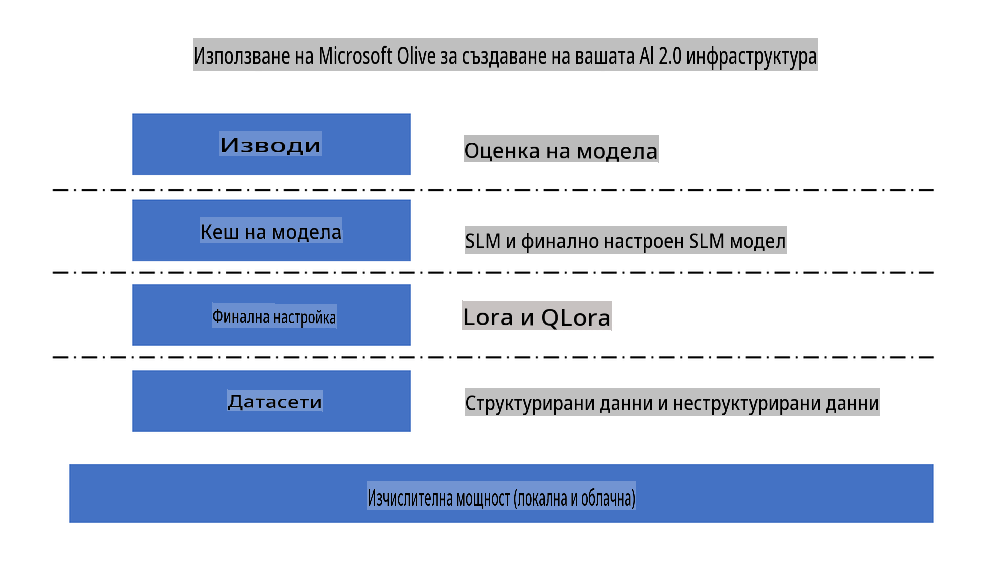
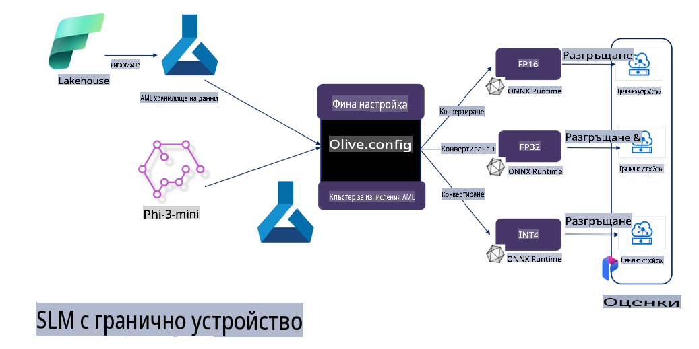

# **Финнастройка на Phi-3 с Microsoft Olive**

[Olive](https://github.com/microsoft/OLive?WT.mc_id=aiml-138114-kinfeylo) е лесен за използване инструмент за оптимизация на модели, ориентиран към хардуера, който съчетава водещи в индустрията техники за компресия, оптимизация и компилация на модели.

Той е създаден, за да улесни процеса на оптимизиране на модели за машинно обучение, като гарантира, че те използват максимално ефективно специфичните хардуерни архитектури.

Независимо дали работите върху облачни приложения или устройства на ръба, Olive ви позволява да оптимизирате своите модели лесно и ефективно.

## Основни характеристики:
- Olive обединява и автоматизира техники за оптимизация за желаните хардуерни цели.
- Няма универсална техника за оптимизация, която да пасва на всички сценарии, затова Olive позволява разширяемост, като дава възможност на експертите в индустрията да внедряват свои иновации за оптимизация.

## Намаляване на инженерните усилия:
- Разработчиците често трябва да изучават и използват множество специфични за хардуерни доставчици инструменти, за да подготвят и оптимизират обучени модели за внедряване.
- Olive опростява този процес, като автоматизира техниките за оптимизация за избрания хардуер.

## Готово за използване решение за оптимизация от край до край:

Чрез комбиниране и настройка на интегрирани техники, Olive предлага унифицирано решение за оптимизация от край до край.
Той взема предвид ограничения като точност и латентност, докато оптимизира моделите.

## Използване на Microsoft Olive за финнастройка

Microsoft Olive е изключително лесен за използване инструмент с отворен код за оптимизация на модели, който може да покрие както финнастройка, така и референтни приложения в областта на генеративния изкуствен интелект. С минимална конфигурация, комбинирана с използването на малки езикови модели с отворен код и свързани среди за изпълнение (AzureML / локален GPU, CPU, DirectML), можете автоматично да извършите финнастройка или референция на модела и да намерите най-добрия модел за внедряване в облака или на устройства на ръба. Това позволява на предприятията да изграждат свои собствени вертикални модели на място и в облака.



## Финнастройка на Phi-3 с Microsoft Olive 



## Примерен код и пример за Phi-3 Olive
В този пример ще използвате Olive, за да:

- Фино настроите LoRA адаптер за класификация на фрази в Sad, Joy, Fear, Surprise.
- Слеете теглата на адаптера с базовия модел.
- Оптимизирате и квантувате модела до int4.

[Примерен код](../../code/03.Finetuning/olive-ort-example/README.md)

### Инсталиране на Microsoft Olive

Инсталацията на Microsoft Olive е много лесна и може да бъде извършена за CPU, GPU, DirectML и Azure ML.

```bash
pip install olive-ai
```

Ако искате да стартирате ONNX модел с CPU, можете да използвате

```bash
pip install olive-ai[cpu]
```

Ако искате да стартирате ONNX модел с GPU, можете да използвате

```python
pip install olive-ai[gpu]
```

Ако искате да използвате Azure ML, използвайте

```python
pip install git+https://github.com/microsoft/Olive#egg=olive-ai[azureml]
```

**Забележка**  
Изисквания за операционна система: Ubuntu 20.04 / 22.04 

### **Config.json на Microsoft Olive**

След инсталацията можете да конфигурирате различни специфични за модела настройки чрез конфигурационния файл, включително данни, изчисления, обучение, внедряване и генериране на модели.

**1. Данни**

В Microsoft Olive се поддържа обучение както с локални данни, така и с данни в облака, които могат да бъдат конфигурирани в настройките.

*Настройки за локални данни*

Можете лесно да зададете набора от данни, който трябва да бъде използван за финнастройка, обикновено във формат json, и да го адаптирате с шаблона за данни. Това трябва да бъде настроено спрямо изискванията на модела (например адаптиране към формата, изискван от Microsoft Phi-3-mini. Ако имате други модели, моля, обърнете се към изискваните формати за финнастройка на съответните модели).

```json

    "data_configs": [
        {
            "name": "dataset_default_train",
            "type": "HuggingfaceContainer",
            "load_dataset_config": {
                "params": {
                    "data_name": "json", 
                    "data_files":"dataset/dataset-classification.json",
                    "split": "train"
                }
            },
            "pre_process_data_config": {
                "params": {
                    "dataset_type": "corpus",
                    "text_cols": [
                            "phrase",
                            "tone"
                    ],
                    "text_template": "### Text: {phrase}\n### The tone is:\n{tone}",
                    "corpus_strategy": "join",
                    "source_max_len": 2048,
                    "pad_to_max_len": false,
                    "use_attention_mask": false
                }
            }
        }
    ],
```

**Настройки за източници на данни в облака**

Чрез свързване на хранилището на данни на Azure AI Studio/Azure Machine Learning Service с данните в облака можете да избирате различни източници на данни чрез Microsoft Fabric и Azure Data, за да поддържате финнастройката на данните.

```json

    "data_configs": [
        {
            "name": "dataset_default_train",
            "type": "HuggingfaceContainer",
            "load_dataset_config": {
                "params": {
                    "data_name": "json", 
                    "data_files": {
                        "type": "azureml_datastore",
                        "config": {
                            "azureml_client": {
                                "subscription_id": "Your Azure Subscrition ID",
                                "resource_group": "Your Azure Resource Group",
                                "workspace_name": "Your Azure ML Workspaces name"
                            },
                            "datastore_name": "workspaceblobstore",
                            "relative_path": "Your train_data.json Azure ML Location"
                        }
                    },
                    "split": "train"
                }
            },
            "pre_process_data_config": {
                "params": {
                    "dataset_type": "corpus",
                    "text_cols": [
                            "Question",
                            "Best Answer"
                    ],
                    "text_template": "<|user|>\n{Question}<|end|>\n<|assistant|>\n{Best Answer}\n<|end|>",
                    "corpus_strategy": "join",
                    "source_max_len": 2048,
                    "pad_to_max_len": false,
                    "use_attention_mask": false
                }
            }
        }
    ],
    
```

**2. Конфигурация на изчисленията**

Ако искате да работите локално, можете директно да използвате локални ресурси за данни. Ако искате да използвате ресурсите на Azure AI Studio/Azure Machine Learning Service, трябва да конфигурирате съответните Azure параметри, имена на изчислителни ресурси и други.

```json

    "systems": {
        "aml": {
            "type": "AzureML",
            "config": {
                "accelerators": ["gpu"],
                "hf_token": true,
                "aml_compute": "Your Azure AI Studio / Azure Machine Learning Service Compute Name",
                "aml_docker_config": {
                    "base_image": "Your Azure AI Studio / Azure Machine Learning Service docker",
                    "conda_file_path": "conda.yaml"
                }
            }
        },
        "azure_arc": {
            "type": "AzureML",
            "config": {
                "accelerators": ["gpu"],
                "aml_compute": "Your Azure AI Studio / Azure Machine Learning Service Compute Name",
                "aml_docker_config": {
                    "base_image": "Your Azure AI Studio / Azure Machine Learning Service docker",
                    "conda_file_path": "conda.yaml"
                }
            }
        }
    },
```

***Забележка***

Тъй като процесът се изпълнява чрез контейнер в Azure AI Studio/Azure Machine Learning Service, е необходимо да конфигурирате изискваната среда. Това се прави чрез conda.yaml файла за среда.

```yaml

name: project_environment
channels:
  - defaults
dependencies:
  - python=3.8.13
  - pip=22.3.1
  - pip:
      - einops
      - accelerate
      - azure-keyvault-secrets
      - azure-identity
      - bitsandbytes
      - datasets
      - huggingface_hub
      - peft
      - scipy
      - sentencepiece
      - torch>=2.2.0
      - transformers
      - git+https://github.com/microsoft/Olive@jiapli/mlflow_loading_fix#egg=olive-ai[gpu]
      - --extra-index-url https://aiinfra.pkgs.visualstudio.com/PublicPackages/_packaging/ORT-Nightly/pypi/simple/ 
      - ort-nightly-gpu==1.18.0.dev20240307004
      - --extra-index-url https://aiinfra.pkgs.visualstudio.com/PublicPackages/_packaging/onnxruntime-genai/pypi/simple/
      - onnxruntime-genai-cuda

    

```

**3. Избор на SLM**

Можете директно да използвате модел от Hugging Face или да го комбинирате с Model Catalog на Azure AI Studio/Azure Machine Learning, за да изберете модела, който искате да използвате. В примера по-долу ще използваме Microsoft Phi-3-mini.

Ако имате модела локално, можете да използвате този метод:

```json

    "input_model":{
        "type": "PyTorchModel",
        "config": {
            "hf_config": {
                "model_name": "model-cache/microsoft/phi-3-mini",
                "task": "text-generation",
                "model_loading_args": {
                    "trust_remote_code": true
                }
            }
        }
    },
```

Ако искате да използвате модел от Azure AI Studio/Azure Machine Learning Service, можете да използвате този метод:

```json

    "input_model":{
        "type": "PyTorchModel",
        "config": {
            "model_path": {
                "type": "azureml_registry_model",
                "config": {
                    "name": "microsoft/Phi-3-mini-4k-instruct",
                    "registry_name": "azureml-msr",
                    "version": "11"
                }
            },
             "model_file_format": "PyTorch.MLflow",
             "hf_config": {
                "model_name": "microsoft/Phi-3-mini-4k-instruct",
                "task": "text-generation",
                "from_pretrained_args": {
                    "trust_remote_code": true
                }
            }
        }
    },
```

**Забележка:**  
Необходимо е интегриране с Azure AI Studio/Azure Machine Learning Service, затова при настройване на модела, моля, обърнете внимание на версията и съответните наименования.

Всички модели в Azure трябва да бъдат настроени на PyTorch.MLflow.

Трябва да имате акаунт в Hugging Face и да свържете ключа към стойността на Key в Azure AI Studio/Azure Machine Learning.

**4. Алгоритъм**

Microsoft Olive много добре обхваща алгоритмите за финнастройка Lora и QLora. Всичко, което трябва да направите, е да конфигурирате някои съответни параметри. Тук давам пример с QLora.

```json
        "lora": {
            "type": "LoRA",
            "config": {
                "target_modules": [
                    "o_proj",
                    "qkv_proj"
                ],
                "double_quant": true,
                "lora_r": 64,
                "lora_alpha": 64,
                "lora_dropout": 0.1,
                "train_data_config": "dataset_default_train",
                "eval_dataset_size": 0.3,
                "training_args": {
                    "seed": 0,
                    "data_seed": 42,
                    "per_device_train_batch_size": 1,
                    "per_device_eval_batch_size": 1,
                    "gradient_accumulation_steps": 4,
                    "gradient_checkpointing": false,
                    "learning_rate": 0.0001,
                    "num_train_epochs": 3,
                    "max_steps": 10,
                    "logging_steps": 10,
                    "evaluation_strategy": "steps",
                    "eval_steps": 187,
                    "group_by_length": true,
                    "adam_beta2": 0.999,
                    "max_grad_norm": 0.3
                }
            }
        },
```

Ако искате квантуваща конверсия, основният клон на Microsoft Olive вече поддържа метода onnxruntime-genai. Можете да го настроите според вашите нужди:

1. Сливане на теглата на адаптера с базовия модел.
2. Конвертиране на модела в ONNX модел с изискваната прецизност чрез ModelBuilder.

Например, конвертиране в квантуван INT4:

```json

        "merge_adapter_weights": {
            "type": "MergeAdapterWeights"
        },
        "builder": {
            "type": "ModelBuilder",
            "config": {
                "precision": "int4"
            }
        }
```

**Забележка**  
- Ако използвате QLoRA, квантуващата конверсия на ONNXRuntime-genai все още не се поддържа.

- Тук е важно да отбележим, че можете да настроите горепосочените стъпки според вашите нужди. Не е необходимо да конфигурирате всички стъпки напълно. В зависимост от вашите изисквания, можете директно да използвате стъпките на алгоритъма без финнастройка. Накрая трябва да конфигурирате съответните двигатели.

```json

    "engine": {
        "log_severity_level": 0,
        "host": "aml",
        "target": "aml",
        "search_strategy": false,
        "execution_providers": ["CUDAExecutionProvider"],
        "cache_dir": "../model-cache/models/phi3-finetuned/cache",
        "output_dir" : "../model-cache/models/phi3-finetuned"
    }
```

**5. Завършване на финнастройката**

На командния ред изпълнете в директорията на olive-config.json:

```bash
olive run --config olive-config.json  
```

**Отказ от отговорност**:  
Този документ е преведен с помощта на услуги за машинен превод, базирани на изкуствен интелект. Въпреки че се стремим към точност, моля, имайте предвид, че автоматизираните преводи може да съдържат грешки или неточности. Оригиналният документ на неговия оригинален език трябва да се счита за авторитетен източник. За критична информация се препоръчва професионален човешки превод. Ние не носим отговорност за каквито и да било недоразумения или погрешни тълкувания, произтичащи от използването на този превод.