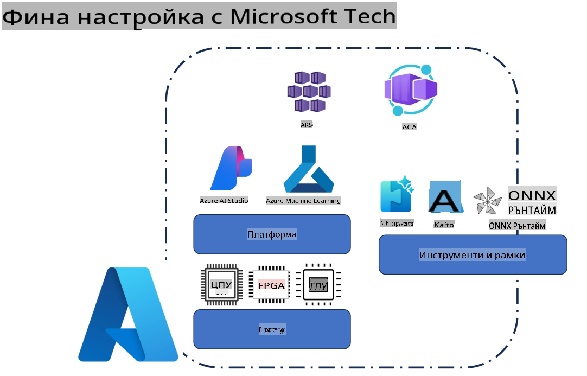
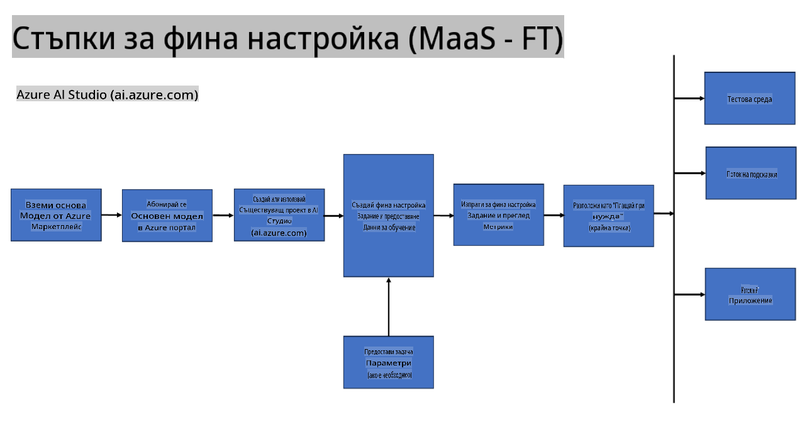
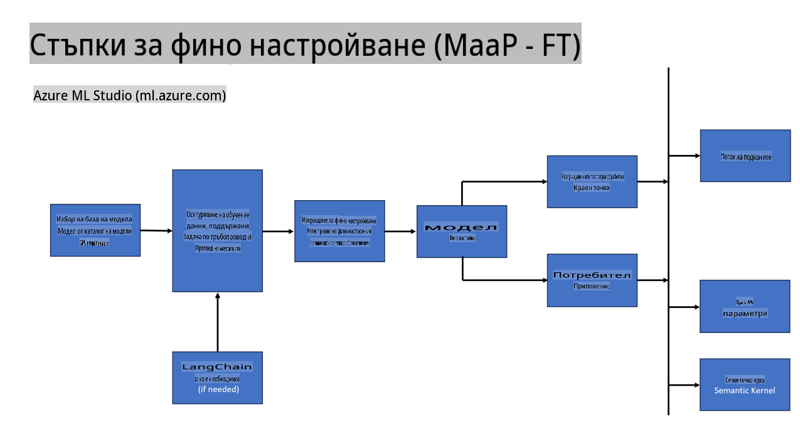
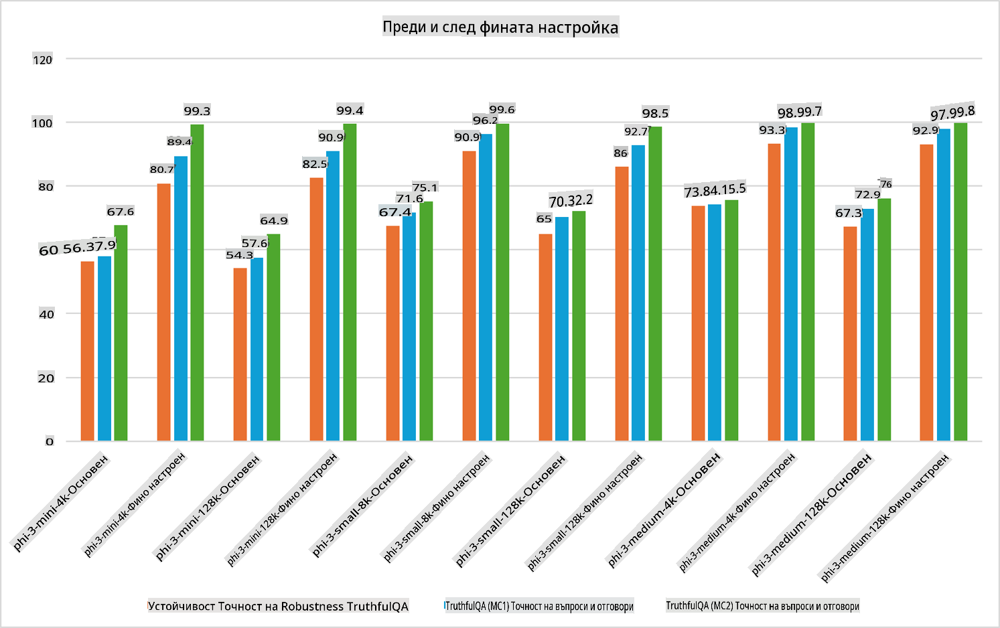

## Сценарии за донастройка

**Платформа** Това включва различни технологии като Azure AI Foundry, Azure Machine Learning, AI Tools, Kaito и ONNX Runtime.

**Инфраструктура** Това включва CPU и FPGA, които са от съществено значение за процеса на донастройка. Нека ви покажа иконите за всяка от тези технологии.

**Инструменти и рамки** Това включва ONNX Runtime и ONNX Runtime. Нека ви покажа иконите за всяка от тези технологии.  
[Добавете икони за ONNX Runtime и ONNX Runtime]

Процесът на донастройка с Microsoft технологии включва различни компоненти и инструменти. Чрез разбиране и използване на тези технологии можем ефективно да донастройваме нашите приложения и да създаваме по-добри решения.

## Модел като услуга

Донастройте модела с хоствана донастройка, без да е необходимо да създавате и управлявате изчислителна инфраструктура.

Сървърлес донастройка е налична за моделите Phi-3-mini и Phi-3-medium, което позволява на разработчиците бързо и лесно да персонализират моделите за облачни и edge сценарии, без да се налага да осигуряват изчислителна инфраструктура. Също така обявихме, че Phi-3-small вече е наличен чрез нашата услуга "Модели като услуга", което позволява на разработчиците бързо и лесно да започнат с AI разработка, без да управляват основната инфраструктура.

## Модел като платформа

Потребителите управляват собствената си изчислителна инфраструктура, за да донастройват моделите си.

[Пример за донастройка](https://github.com/Azure/azureml-examples/blob/main/sdk/python/foundation-models/system/finetune/chat-completion/chat-completion.ipynb)

## Сценарии за донастройка

| | | | | | | |
|-|-|-|-|-|-|-|
|Сценарий|LoRA|QLoRA|PEFT|DeepSpeed|ZeRO|DORA|
|Адаптиране на предварително обучени LLM към специфични задачи или домейни|Да|Да|Да|Да|Да|Да|
|Донастройка за NLP задачи като текстова класификация, разпознаване на именовани обекти и машинен превод|Да|Да|Да|Да|Да|Да|
|Донастройка за QA задачи|Да|Да|Да|Да|Да|Да|
|Донастройка за генериране на човеко-подобни отговори в чатботове|Да|Да|Да|Да|Да|Да|
|Донастройка за генериране на музика, изкуство или други форми на креативност|Да|Да|Да|Да|Да|Да|
|Намаляване на изчислителните и финансови разходи|Да|Да|Не|Да|Да|Не|
|Намаляване на използването на памет|Не|Да|Не|Да|Да|Да|
|Използване на по-малко параметри за ефективна донастройка|Не|Да|Да|Не|Не|Да|
|Паметно-ефективна форма на паралелизъм на данни, която осигурява достъп до обединената GPU памет на всички налични GPU устройства|Не|Не|Не|Да|Да|Да|

## Примери за производителност при донастройка

**Отказ от отговорност**:  
Този документ е преведен с помощта на машинни AI услуги за превод. Въпреки че се стремим към точност, моля, имайте предвид, че автоматизираните преводи може да съдържат грешки или неточности. Оригиналният документ на неговия оригинален език трябва да се счита за авторитетен източник. За критична информация се препоръчва професионален човешки превод. Ние не носим отговорност за никакви недоразумения или погрешни интерпретации, произтичащи от използването на този превод.