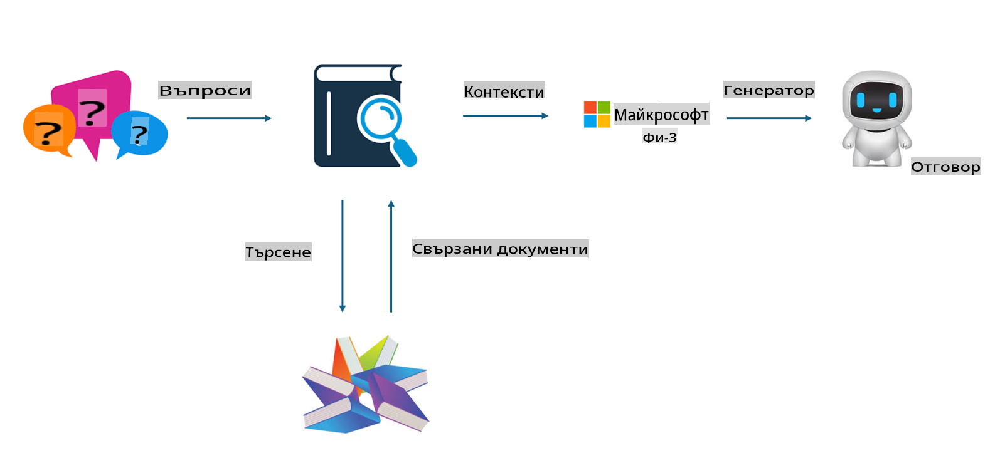

## Файнтюнинг срещу RAG

## Генериране с добавено извличане на данни (Retrieval Augmented Generation)

RAG представлява извличане на данни + генериране на текст. Структурираните и неструктурираните данни на организацията се съхраняват във векторна база данни. При търсене на съответното съдържание се намират свързани резюмета и съдържание, за да се формира контекст, като се комбинира с възможностите за довършване на текст на LLM/SLM за генериране на съдържание.

## Процес на RAG

## Файнтюнинг
Файнтюнингът се базира на подобряването на даден модел. Не е необходимо да се започва от алгоритъма на модела, но данните трябва да се натрупват непрекъснато. Ако искате по-прецизна терминология и езикови изрази за индустриални приложения, файнтюнингът е по-добрият избор. Но ако данните ви се променят често, файнтюнингът може да стане сложен.

## Как да изберем
Ако отговорът ни изисква включване на външни данни, RAG е най-добрият избор.

Ако трябва да предоставите стабилни и прецизни знания за конкретна индустрия, файнтюнингът ще бъде добър избор. RAG дава приоритет на извличането на свързано съдържание, но не винаги успява да улови специализираните нюанси.

Файнтюнингът изисква висококачествен набор от данни, и ако обхватът на данните е малък, няма да има голяма разлика. RAG е по-гъвкав.  
Файнтюнингът е като черна кутия, метафизика, и е трудно да се разбере вътрешният му механизъм. Но RAG улеснява намирането на източника на данните, което позволява ефективно коригиране на халюцинации или грешки в съдържанието и осигурява по-добра прозрачност.

**Отказ от отговорност**:  
Този документ е преведен с помощта на автоматизирани AI услуги за превод. Въпреки че се стремим към точност, моля, имайте предвид, че автоматичните преводи може да съдържат грешки или неточности. Оригиналният документ на неговия изходен език трябва да се счита за авторитетен източник. За критична информация се препоръчва професионален превод от човек. Не носим отговорност за каквито и да е недоразумения или погрешни интерпретации, произтичащи от използването на този превод.