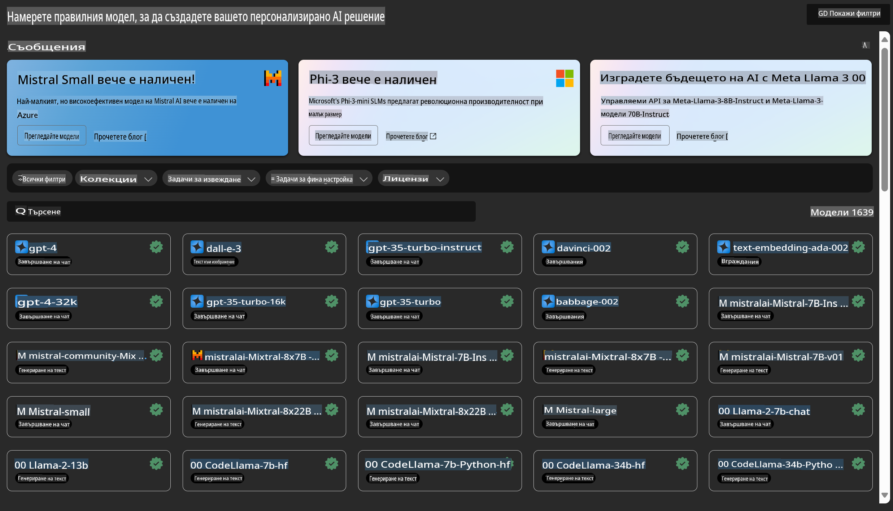

# **Представяне на услугата Azure Machine Learning**

[Azure Machine Learning](https://ml.azure.com?WT.mc_id=aiml-138114-kinfeylo) е облачна услуга за ускоряване и управление на жизнения цикъл на проекти за машинно обучение (ML).

ML професионалисти, специалисти по данни и инженери могат да я използват в ежедневната си работа, за да:

- Обучават и внедряват модели.
- Управляват операции по машинно обучение (MLOps).
- Можете да създадете модел в Azure Machine Learning или да използвате модел, създаден с платформа с отворен код, като PyTorch, TensorFlow или scikit-learn.
- Инструментите за MLOps ви помагат да наблюдавате, преобучавате и повторно внедрявате модели.

## За кого е предназначен Azure Machine Learning?

**Специалисти по данни и инженери по ML**

Те могат да използват инструменти за ускоряване и автоматизация на ежедневните си задачи.
Azure ML предоставя функции за справедливост, обяснимост, проследяване и одитируемост.

**Разработчици на приложения**

Те могат безпроблемно да интегрират модели в приложения или услуги.

**Разработчици на платформи**

Те имат достъп до надежден набор от инструменти, подкрепени от стабилни API на Azure Resource Manager.
Тези инструменти позволяват създаването на усъвършенствани инструменти за ML.

**Предприятия**

Работейки в облака Microsoft Azure, предприятията се възползват от познатата сигурност и контрол на достъпа, базиран на роли.
Настройте проекти за контрол на достъпа до защитени данни и конкретни операции.

## Продуктивност за всеки член на екипа

ML проектите често изискват екип с разнообразни умения за създаване и поддръжка.

Azure ML предоставя инструменти, които ви позволяват да:
- Сътрудничите с екипа си чрез споделени тетрадки, изчислителни ресурси, сървърно без изчисление, данни и среди.
- Разработвате модели със справедливост, обяснимост, проследяване и одитируемост, за да отговаряте на изискванията за произход и одит.
- Бързо и лесно внедрявате ML модели в голям мащаб и ги управлявате ефективно с MLOps.
- Изпълнявате задачи по машинно обучение навсякъде с вградени функции за управление, сигурност и съответствие.

## Инструменти за платформа с кръстосана съвместимост

Всеки член на екипа за ML може да използва предпочитаните от него инструменти за изпълнение на задачите.
Независимо дали провеждате бързи експерименти, настройвате хиперпараметри, изграждате тръбопроводи или управлявате изводи, можете да използвате познати интерфейси, включително:
- Azure Machine Learning Studio
- Python SDK (v2)
- Azure CLI (v2)
- REST API на Azure Resource Manager

Докато усъвършенствате модели и си сътрудничите през целия цикъл на разработка, можете да споделяте и намирате активи, ресурси и метрики в потребителския интерфейс на Azure Machine Learning Studio.

## **LLM/SLM в Azure ML**

Azure ML е добавил множество функции, свързани с LLM/SLM, комбинирайки LLMOps и SLMOps за създаване на платформа за генеративен изкуствен интелект за предприятия.

### **Каталог на модели**

Потребителите в предприятия могат да внедряват различни модели според различни бизнес сценарии чрез Каталога на модели и да предоставят услуги като Model as Service за достъп на разработчици или потребители.

Каталогът на модели в Azure Machine Learning Studio е центърът за откриване и използване на широк набор от модели, които ви позволяват да създавате приложения за генеративен изкуствен интелект. Каталогът на модели включва стотици модели от доставчици като Azure OpenAI Service, Mistral, Meta, Cohere, Nvidia, Hugging Face, включително модели, обучени от Microsoft. Модели от доставчици, различни от Microsoft, са продукти на трети страни, както е определено в Условията за продукти на Microsoft, и подлежат на условията, предоставени с модела.

### **Тръбопровод за задачи**

Сърцевината на тръбопровода за машинно обучение е разделянето на цялостната задача на машинно обучение на многоетапен работен процес. Всеки етап е управляем компонент, който може да бъде разработван, оптимизиран, конфигуриран и автоматизиран индивидуално. Етапите са свързани чрез добре дефинирани интерфейси. Услугата за тръбопроводи на Azure Machine Learning автоматично координира всички зависимости между етапите на тръбопровода.

При фино настройване на SLM / LLM можем да управляваме нашите процеси за данни, обучение и генериране чрез тръбопроводи.

### **Prompt flow**

Предимства от използването на Azure Machine Learning prompt flow:
Azure Machine Learning prompt flow предлага редица предимства, които помагат на потребителите да преминат от идея към експериментиране и в крайна сметка към готови за производство приложения, базирани на LLM:

**Гъвкавост в проектирането на prompt-и**

- Интерактивно изживяване при създаване: Azure Machine Learning prompt flow предоставя визуално представяне на структурата на flow-а, което позволява на потребителите лесно да разбират и навигират в проектите си. Освен това предлага изживяване за кодиране, подобно на тетрадка, за ефективно разработване и отстраняване на грешки.
- Варианти за настройване на prompt-и: Потребителите могат да създават и сравняват множество варианти на prompt-и, улеснявайки итеративния процес на усъвършенстване.

**Оценка**: Вградените потоци за оценка позволяват на потребителите да оценяват качеството и ефективността на своите prompt-и и flow-ове.

**Обширни ресурси**: Azure Machine Learning prompt flow включва библиотека с вградени инструменти, примери и шаблони, които служат като отправна точка за разработка, вдъхновявайки креативност и ускорявайки процеса.

**Готовност на предприятието за приложения, базирани на LLM**

- Сътрудничество: Azure Machine Learning prompt flow поддържа сътрудничество в екип, което позволява на множество потребители да работят заедно по проекти за проектиране на prompt-и, да споделят знания и да поддържат контрол на версиите.
- Универсална платформа: Azure Machine Learning prompt flow оптимизира целия процес на проектиране на prompt-и – от разработка и оценка до внедряване и мониторинг. Потребителите могат без усилие да внедряват своите flow-ове като крайни точки на Azure Machine Learning и да следят тяхното представяне в реално време, осигурявайки оптимална работа и непрекъснато усъвършенстване.

Решения за готовност на предприятието в Azure Machine Learning: Prompt flow използва стабилните решения на Azure Machine Learning за готовност на предприятието, предоставяйки сигурна, мащабируема и надеждна основа за разработка, експериментиране и внедряване на flow-ове.

С Azure Machine Learning prompt flow потребителите могат да отключат гъвкавостта си в проектирането на prompt-и, да си сътрудничат ефективно и да използват решения от корпоративен клас за успешно разработване и внедряване на приложения, базирани на LLM.

Комбинирайки изчислителната мощност, данните и различните компоненти на Azure ML, разработчиците в предприятия могат лесно да създават свои собствени приложения за изкуствен интелект.

**Отказ от отговорност**:  
Този документ е преведен с помощта на машинни AI услуги за превод. Въпреки че се стремим към точност, моля, имайте предвид, че автоматичните преводи може да съдържат грешки или неточности. Оригиналният документ на неговия оригинален език трябва да се счита за авторитетния източник. За критична информация се препоръчва професионален човешки превод. Не носим отговорност за каквито и да било недоразумения или погрешни интерпретации, произтичащи от използването на този превод.