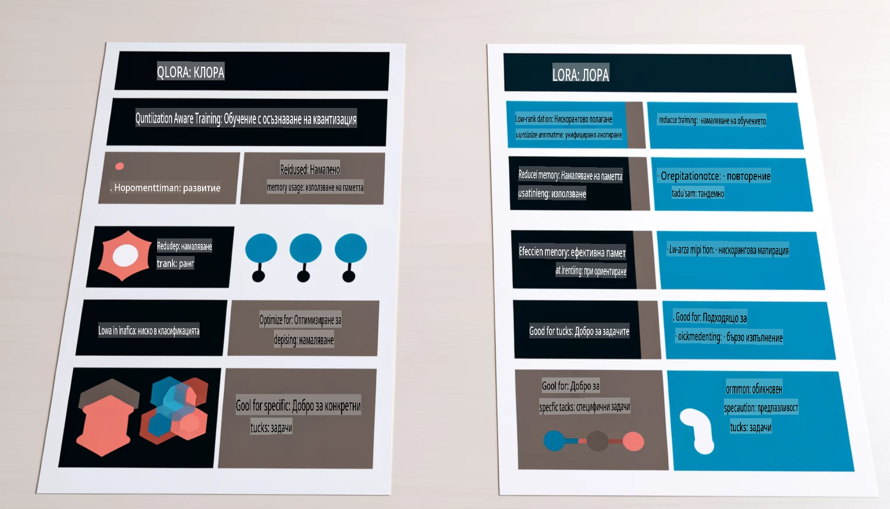

# **Нека Phi-3 стане експерт в индустрията**

За да внедрите модела Phi-3 в индустрията, е необходимо да добавите индустриални бизнес данни към него. Имаме два различни подхода: първият е RAG (Генерация с Подобрено Извличане), а вторият е Фина Настройка.

## **RAG срещу Фина Настройка**

### **Генерация с Подобрено Извличане (RAG)**

RAG комбинира извличане на данни и генериране на текст. Структурираните и неструктурираните данни на предприятието се съхраняват във векторна база данни. При търсене на релевантно съдържание се намира съответното резюме и съдържание, за да се формира контекст, който след това се комбинира със способността на LLM/SLM за допълване на текст, за да се генерира съдържание.

### **Фина Настройка**

Фината настройка се базира на подобряване на определен модел. Не е необходимо да се започва от алгоритъма на модела, но е нужно непрекъснато натрупване на данни. Ако целта е по-прецизна терминология и езиково изразяване в индустриални приложения, фината настройка е по-добрият избор. Но ако данните ви се променят често, фината настройка може да стане сложна.

### **Как да изберем**

1. Ако отговорът изисква въвеждане на външни данни, RAG е най-добрият избор.

2. Ако е необходимо да се изведе стабилно и прецизно индустриално знание, фината настройка ще бъде добър избор. RAG дава приоритет на извличането на релевантно съдържание, но не винаги улавя специализираните нюанси.

3. Фината настройка изисква висококачествен набор от данни, а ако става въпрос само за малък обхват от данни, тя няма да направи голяма разлика. RAG е по-гъвкав.

4. Фината настройка е като черна кутия – трудна за разбиране на вътрешния механизъм. Но RAG позволява по-лесно проследяване на източника на данните, което помага за коригиране на халюцинации или грешки в съдържанието и предоставя по-голяма прозрачност.

### **Сценарии**

1. Вертикални индустрии, изискващи специфична професионална терминология и изрази – ***Фината настройка*** ще бъде най-добрият избор.

2. QA система, включваща синтез на различни точки на знание – ***RAG*** ще бъде най-добрият избор.

3. Комбинация от автоматизиран бизнес поток – ***RAG + Фина настройка*** е най-добрият избор.

## **Как да използваме RAG**

Векторната база данни представлява колекция от данни, съхранявани в математическа форма. Тя улеснява машинните модели да запомнят предишни входни данни, което позволява използването на машинно обучение за поддръжка на случаи като търсене, препоръки и генериране на текст. Данните могат да бъдат идентифицирани въз основа на метрики за сходство, а не на точни съвпадения, което позволява на компютърните модели да разбират контекста на данните.

Векторната база данни е ключът към реализирането на RAG. Можем да конвертираме данни във векторно хранилище чрез векторни модели като text-embedding-3, jina-ai-embedding и други.

Научете повече за създаването на RAG приложение [https://github.com/microsoft/Phi-3CookBook](https://github.com/microsoft/Phi-3CookBook?WT.mc_id=aiml-138114-kinfeylo)

## **Как да използваме Фина Настройка**

Обичайно използваните алгоритми за Фина настройка са Lora и QLora. Как да изберем?
- [Научете повече с този примерен notebook](../../../../code/04.Finetuning/Phi_3_Inference_Finetuning.ipynb)
- [Пример за Python скрипт за Фина Настройка](../../../../code/04.Finetuning/FineTrainingScript.py)

### **Lora и QLora**

LoRA (Low-Rank Adaptation) и QLoRA (Quantized Low-Rank Adaptation) са техники за фина настройка на големи езикови модели (LLMs) чрез Параметърно Ефективна Фина Настройка (PEFT). PEFT техниките са проектирани да обучават модели по-ефективно от традиционните методи.  
LoRA е самостоятелна техника за фина настройка, която намалява използването на памет чрез прилагане на нискорангово приближение към матрицата за обновяване на теглата. Тя осигурява бързо обучение и поддържа производителност, близка до традиционните методи за фина настройка.

QLoRA е разширена версия на LoRA, която включва техники за квантизация, за да намали още повече използването на памет. QLoRA квантизира точността на параметрите на теглата в предварително обучените LLM до 4-битова точност, което е по-ефективно по отношение на паметта от LoRA. Въпреки това, обучението с QLoRA е с около 30% по-бавно от това с LoRA поради допълнителните стъпки за квантизация и деквантизация.

QLoRA използва LoRA като допълнение за коригиране на грешките, въведени по време на квантизацията. QLoRA позволява фина настройка на масивни модели с милиарди параметри на сравнително малки, широко достъпни GPU. Например, QLoRA може да фино настрои модел с 70 милиарда параметри, който обикновено изисква 36 GPU, само с 2.

**Отказ от отговорност**:  
Този документ е преведен с помощта на автоматизирани AI услуги за превод. Въпреки че се стремим към точност, моля, имайте предвид, че автоматизираните преводи може да съдържат грешки или неточности. Оригиналният документ на неговия оригинален език трябва да се счита за авторитетен източник. За критична информация се препоръчва професионален превод от човек. Ние не носим отговорност за никакви недоразумения или погрешни интерпретации, произтичащи от използването на този превод.