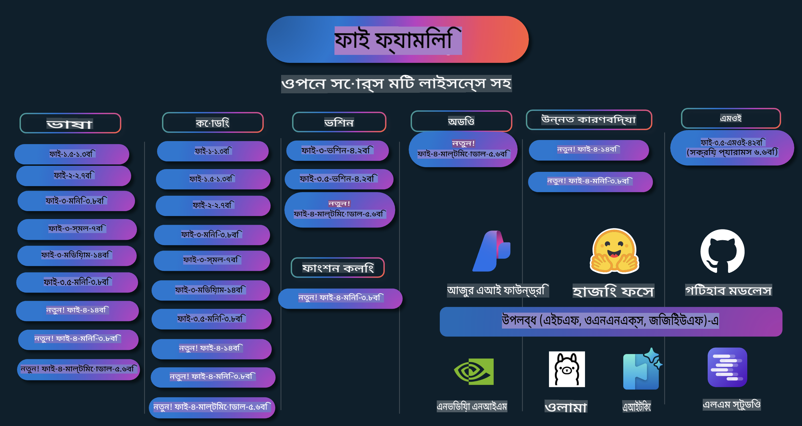

# ফাই কুকবুক: মাইক্রোসফটের ফাই মডেলগুলোর হাতে-কলমে উদাহরণ

  

  
  
  

  
  

ফাই হলো মাইক্রোসফটের তৈরি ওপেন সোর্স এআই মডেলগুলোর একটি সিরিজ।  

ফাই বর্তমানে সবচেয়ে শক্তিশালী এবং খরচ-সাশ্রয়ী ছোট ভাষা মডেল (SLM), যা মাল্টি-ল্যাঙ্গুয়েজ, যুক্তি, টেক্সট/চ্যাট জেনারেশন, কোডিং, ছবি, অডিও এবং অন্যান্য ক্ষেত্রে অসাধারণ পারফর্মেন্স দেখিয়েছে।  

আপনি ফাই মডেল ক্লাউডে বা এজ ডিভাইসে ডেপ্লয় করতে পারেন এবং সীমিত কম্পিউটিং ক্ষমতা দিয়ে সহজেই জেনারেটিভ এআই অ্যাপ্লিকেশন তৈরি করতে পারেন।  

এই রিসোর্সগুলো ব্যবহার করতে নিচের ধাপগুলো অনুসরণ করুন:  
1. **রিপোজিটরি ফর্ক করুন**: ক্লিক করুন   
2. **রিপোজিটরি ক্লোন করুন**: `git clone https://github.com/microsoft/PhiCookBook.git`  
3. [**মাইক্রোসফট AI ডিসকর্ড কমিউনিটিতে যোগ দিন এবং বিশেষজ্ঞ ও অন্যান্য ডেভেলপারদের সাথে পরিচিত হন**](https://discord.com/invite/ByRwuEEgH4?WT.mc_id=aiml-137032-kinfeylo)  

## সূচিপত্র

- ভূমিকা  
  - [ফাই পরিবারের সাথে পরিচিতি](./md/01.Introduction/01/01.PhiFamily.md)  
  - [আপনার পরিবেশ সেটআপ করুন](./md/01.Introduction/01/01.EnvironmentSetup.md)  
  - [মূল প্রযুক্তিগুলো বুঝুন](./md/01.Introduction/01/01.Understandingtech.md)  
  - [ফাই মডেলের জন্য এআই নিরাপত্তা](./md/01.Introduction/01/01.AISafety.md)  
  - [ফাই হার্ডওয়্যার সাপোর্ট](./md/01.Introduction/01/01.Hardwaresupport.md)  
  - [প্ল্যাটফর্মে ফাই মডেল ও অ্যাভেইলেবিলিটি](./md/01.Introduction/01/01.Edgeandcloud.md)  
  - [Guidance-ai এবং ফাই ব্যবহার](./md/01.Introduction/01/01.Guidance.md)  
  - [GitHub মার্কেটপ্লেস মডেল](https://github.com/marketplace/models)  
  - [Azure AI মডেল ক্যাটালগ](https://ai.azure.com)  

- বিভিন্ন পরিবেশে ফাই ইনফারেন্স  
    - [Hugging face](./md/01.Introduction/02/01.HF.md)  
    - [GitHub মডেল](./md/01.Introduction/02/02.GitHubModel.md)  
    - [Azure AI Foundry মডেল ক্যাটালগ](./md/01.Introduction/02/03.AzureAIFoundry.md)  
    - [Ollama](./md/01.Introduction/02/04.Ollama.md)  
    - [AI Toolkit VSCode (AITK)](./md/01.Introduction/02/05.AITK.md)  
    - [NVIDIA NIM](./md/01.Introduction/02/06.NVIDIA.md)  

- ফাই পরিবারের ইনফারেন্স  
    - [iOS-এ ফাই ইনফারেন্স](./md/01.Introduction/03/iOS_Inference.md)  
    - [অ্যান্ড্রয়েডে ফাই ইনফারেন্স](./md/01.Introduction/03/Android_Inference.md)  
- [জেটসনে ফাই ইনফারেন্স](./md/01.Introduction/03/Jetson_Inference.md)
    - [এআই পিসিতে ফাই ইনফারেন্স](./md/01.Introduction/03/AIPC_Inference.md)
    - [অ্যাপল এমএলএক্স ফ্রেমওয়ার্ক দিয়ে ফাই ইনফারেন্স](./md/01.Introduction/03/MLX_Inference.md)
    - [লোকাল সার্ভারে ফাই ইনফারেন্স](./md/01.Introduction/03/Local_Server_Inference.md)
    - [এআই টুলকিট ব্যবহার করে রিমোট সার্ভারে ফাই ইনফারেন্স](./md/01.Introduction/03/Remote_Interence.md)
    - [রাস্ট দিয়ে ফাই ইনফারেন্স](./md/01.Introduction/03/Rust_Inference.md)
    - [লোকাল ভিশনে ফাই--ভিশন ইনফারেন্স](./md/01.Introduction/03/Vision_Inference.md)
    - [কাইটো একেএস, অ্যাজুর কন্টেইনারস (অফিশিয়াল সাপোর্ট) দিয়ে ফাই ইনফারেন্স](./md/01.Introduction/03/Kaito_Inference.md)
- [ফাই ফ্যামিলি কোয়ান্টিফাই করা](./md/01.Introduction/04/QuantifyingPhi.md)
    - [লামা.cpp ব্যবহার করে ফাই-৩.৫ / ৪ কোয়ান্টিফাই করা](./md/01.Introduction/04/UsingLlamacppQuantifyingPhi.md)
    - [onnxruntime-এর জন্য জেনারেটিভ এআই এক্সটেনশন ব্যবহার করে ফাই-৩.৫ / ৪ কোয়ান্টিফাই করা](./md/01.Introduction/04/UsingORTGenAIQuantifyingPhi.md)
    - [ইন্টেল ওপেনভিনো ব্যবহার করে ফাই-৩.৫ / ৪ কোয়ান্টিফাই করা](./md/01.Introduction/04/UsingIntelOpenVINOQuantifyingPhi.md)
    - [অ্যাপল এমএলএক্স ফ্রেমওয়ার্ক ব্যবহার করে ফাই-৩.৫ / ৪ কোয়ান্টিফাই করা](./md/01.Introduction/04/UsingAppleMLXQuantifyingPhi.md)

- ফাই মূল্যায়ন
    - [রেসপন্সিবল এআই](./md/01.Introduction/05/ResponsibleAI.md)
    - [মূল্যায়নের জন্য অ্যাজুর এআই ফাউন্ড্রি](./md/01.Introduction/05/AIFoundry.md)
    - [মূল্যায়নের জন্য প্রম্পটফ্লো ব্যবহার করা](./md/01.Introduction/05/Promptflow.md)

- অ্যাজুর এআই সার্চ দিয়ে RAG
    - [অ্যাজুর এআই সার্চ দিয়ে ফাই-৪-মিনি এবং ফাই-৪-মাল্টিমোডাল (RAG) ব্যবহার করার উপায়](https://github.com/microsoft/PhiCookBook/blob/main/code/06.E2E/E2E_Phi-4-RAG-Azure-AI-Search.ipynb)

- ফাই অ্যাপ্লিকেশন ডেভেলপমেন্টের নমুনা
  - টেক্সট ও চ্যাট অ্যাপ্লিকেশন
    - ফাই-৪ নমুনা 🆕
      - [📓] [ফাই-৪-মিনি ONNX মডেলের সাথে চ্যাট](./md/02.Application/01.TextAndChat/Phi4/ChatWithPhi4ONNX/README.md)
      - [লোকাল ONNX মডেল .NET দিয়ে ফাই-৪-এর সাথে চ্যাট](../../md/04.HOL/dotnet/src/LabsPhi4-Chat-01OnnxRuntime)
      - [সেমান্টিক কার্নেল ব্যবহার করে ফাই-৪ ONNX-এর সাথে .NET কনসোল অ্যাপ্লিকেশন চ্যাট](../../md/04.HOL/dotnet/src/LabsPhi4-Chat-02SK)
    - ফাই-৩ / ৩.৫ নমুনা
      - [লোকাল ব্রাউজারে ফাই-৩, ONNX রন্টাইম ওয়েব এবং ওয়েবজিপিইউ ব্যবহার করে চ্যাটবট](https://github.com/microsoft/onnxruntime-inference-examples/tree/main/js/chat)
      - [ওপেনভিনো চ্যাট](./md/02.Application/01.TextAndChat/Phi3/E2E_OpenVino_Chat.md)
      - [মাল্টি মডেল - ইন্টারঅ্যাকটিভ ফাই-৩-মিনি এবং ওপেনএআই হুইসপার](./md/02.Application/01.TextAndChat/Phi3/E2E_Phi-3-mini_with_whisper.md)
      - [এমএলফ্লো - ফাই-৩-এর জন্য একটি র‍্যাপার তৈরি এবং এমএলফ্লো ব্যবহার](./md//02.Application/01.TextAndChat/Phi3/E2E_Phi-3-MLflow.md)
      - [মডেল অপটিমাইজেশন - অলিভ ব্যবহার করে ONNX রন্টাইম ওয়েবের জন্য ফাই-৩-মিনি মডেল অপটিমাইজ করার উপায়](https://github.com/microsoft/Olive/tree/main/examples/phi3)
      - [ফাই-৩-মিনি-৪কে-ইন্সট্রাক্ট-ONNX সহ WinUI3 অ্যাপ](https://github.com/microsoft/Phi3-Chat-WinUI3-Sample/)
      - [WinUI3 মাল্টি মডেল এআই চালিত নোট অ্যাপের নমুনা](https://github.com/microsoft/ai-powered-notes-winui3-sample)
      - [প্রম্পট ফ্লো দিয়ে কাস্টম ফাই-৩ মডেল ফাইন-টিউন এবং ইন্টিগ্রেট করা](./md/02.Application/01.TextAndChat/Phi3/E2E_Phi-3-FineTuning_PromptFlow_Integration.md)
      - [অ্যাজুর এআই ফাউন্ড্রিতে প্রম্পট ফ্লো দিয়ে কাস্টম ফাই-৩ মডেল ফাইন-টিউন এবং ইন্টিগ্রেট করা](./md/02.Application/01.TextAndChat/Phi3/E2E_Phi-3-FineTuning_PromptFlow_Integration_AIFoundry.md)
      - [মাইক্রোসফটের রেসপন্সিবল এআই নীতির উপর ফোকাস দিয়ে অ্যাজুর এআই ফাউন্ড্রিতে ফাইন-টিউন করা ফাই-৩ / ফাই-৩.৫ মডেলের মূল্যায়ন](./md/02.Application/01.TextAndChat/Phi3/E2E_Phi-3-Evaluation_AIFoundry.md)
- [📓] [Phi-3.5-মিনি-ইনস্ট্রাক্ট ভাষা প্রেডিকশন নমুনা (চীনা/ইংরেজি)](../../md/02.Application/01.TextAndChat/Phi3/phi3-instruct-demo.ipynb)
      - [Phi-3.5-Instruct WebGPU RAG চ্যাটবট](./md/02.Application/01.TextAndChat/Phi3/WebGPUWithPhi35Readme.md)
      - [Windows GPU ব্যবহার করে Phi-3.5-Instruct ONNX এর মাধ্যমে প্রম্পট ফ্লো সমাধান তৈরি করা](./md/02.Application/01.TextAndChat/Phi3/UsingPromptFlowWithONNX.md)
      - [Microsoft Phi-3.5 tflite ব্যবহার করে অ্যান্ড্রয়েড অ্যাপ তৈরি করা](./md/02.Application/01.TextAndChat/Phi3/UsingPhi35TFLiteCreateAndroidApp.md)
      - [স্থানীয় ONNX Phi-3 মডেল এবং Microsoft.ML.OnnxRuntime ব্যবহার করে প্রশ্নোত্তর .NET উদাহরণ](../../md/04.HOL/dotnet/src/LabsPhi301)
      - [সেমান্টিক কার্নেল এবং Phi-3 সহ কনসোল চ্যাট .NET অ্যাপ](../../md/04.HOL/dotnet/src/LabsPhi302)

  - Azure AI Inference SDK কোড ভিত্তিক নমুনা
    - Phi-4 নমুনা 🆕
      - [📓] [Phi-4-মাল্টিমোডাল ব্যবহার করে প্রজেক্ট কোড তৈরি করা](./md/02.Application/02.Code/Phi4/GenProjectCode/README.md)
    - Phi-3 / 3.5 নমুনা
      - [Microsoft Phi-3 ফ্যামিলি ব্যবহার করে আপনার নিজস্ব Visual Studio Code GitHub Copilot Chat তৈরি করুন](./md/02.Application/02.Code/Phi3/VSCodeExt/README.md)
      - [Phi-3.5 এবং GitHub মডেল ব্যবহার করে Visual Studio Code Chat Copilot Agent তৈরি করুন](/md/02.Application/02.Code/Phi3/CreateVSCodeChatAgentWithGitHubModels.md)

  - উন্নত যুক্তি নমুনা
    - Phi-4 নমুনা 🆕
      - [📓] [Phi-4-মিনি যুক্তি নমুনা](./md/02.Application/03.AdvancedReasoning/Phi4/AdvancedResoningPhi4mini/README.md)
  
  - ডেমো
      - [Hugging Face Spaces-এ হোস্ট করা Phi-4-মিনি ডেমো](https://huggingface.co/spaces/microsoft/phi-4-mini?WT.mc_id=aiml-137032-kinfeylo)
      - [Hugging Face Spaces-এ হোস্ট করা Phi-4-মাল্টিমোডাল ডেমো](https://huggingface.co/spaces/microsoft/phi-4-multimodal?WT.mc_id=aiml-137032-kinfeylo)
  - ভিশন নমুনা
    - Phi-4 নমুনা 🆕
      - [📓] [Phi-4-মাল্টিমোডাল ব্যবহার করে ছবি পড়া এবং কোড তৈরি করা](./md/02.Application/04.Vision/Phi4/CreateFrontend/README.md) 
    - Phi-3 / 3.5 নমুনা
      -  [📓][Phi-3-ভিশন-ইমেজ টেক্সট থেকে টেক্সট](../../md/02.Application/04.Vision/Phi3/E2E_Phi-3-vision-image-text-to-text-online-endpoint.ipynb)
      - [Phi-3-ভিশন-ONNX](https://onnxruntime.ai/docs/genai/tutorials/phi3-v.html)
      - [📓][Phi-3-ভিশন CLIP এমবেডিং](../../md/02.Application/04.Vision/Phi3/E2E_Phi-3-vision-image-text-to-text-online-endpoint.ipynb)
      - [ডেমো: Phi-3 রিসাইক্লিং](https://github.com/jennifermarsman/PhiRecycling/)
      - [Phi-3-ভিশন - ভিজ্যুয়াল ল্যাঙ্গুয়েজ অ্যাসিস্ট্যান্ট - Phi3-Vision এবং OpenVINO সহ](https://docs.openvino.ai/nightly/notebooks/phi-3-vision-with-output.html)
      - [Phi-3 Vision Nvidia NIM](./md/02.Application/04.Vision/Phi3/E2E_Nvidia_NIM_Vision.md)
      - [Phi-3 Vision OpenVino](./md/02.Application/04.Vision/Phi3/E2E_OpenVino_Phi3Vision.md)
      - [📓][Phi-3.5 Vision মাল্টি-ফ্রেম বা মাল্টি-ইমেজ নমুনা](../../md/02.Application/04.Vision/Phi3/phi3-vision-demo.ipynb)
      - [Microsoft.ML.OnnxRuntime .NET ব্যবহার করে Phi-3 Vision স্থানীয় ONNX মডেল](../../md/04.HOL/dotnet/src/LabsPhi303)
      - [Microsoft.ML.OnnxRuntime .NET ব্যবহার করে মেনু ভিত্তিক Phi-3 Vision স্থানীয় ONNX মডেল](../../md/04.HOL/dotnet/src/LabsPhi304)

  - অডিও নমুনা
    - Phi-4 নমুনা 🆕
      - [📓] [Phi-4-মাল্টিমোডাল ব্যবহার করে অডিও ট্রান্সক্রিপ্ট বের করা](./md/02.Application/05.Audio/Phi4/Transciption/README.md)
      - [📓] [Phi-4-মাল্টিমোডাল অডিও নমুনা](../../md/02.Application/05.Audio/Phi4/Siri/demo.ipynb)
      - [📓] [Phi-4-মাল্টিমোডাল স্পিচ অনুবাদ নমুনা](../../md/02.Application/05.Audio/Phi4/Translate/demo.ipynb)
      - [.NET কনসোল অ্যাপ্লিকেশন যা Phi-4-মাল্টিমোডাল অডিও ব্যবহার করে অডিও ফাইল বিশ্লেষণ এবং ট্রান্সক্রিপ্ট তৈরি করে](../../md/04.HOL/dotnet/src/LabsPhi4-MultiModal-02Audio)

  - MOE নমুনা
    - Phi-3 / 3.5 নমুনা
      - [📓] [Phi-3.5 মিক্সচার অফ এক্সপার্টস মডেল (MoEs) সোশ্যাল মিডিয়া নমুনা](../../md/02.Application/06.MoE/Phi3/phi3_moe_demo.ipynb)
      - [📓] [NVIDIA NIM Phi-3 MOE, Azure AI Search এবং LlamaIndex ব্যবহার করে Retrieval-Augmented Generation (RAG) পাইপলাইন তৈরি করা](../../md/02.Application/06.MoE/Phi3/azure-ai-search-nvidia-rag.ipynb)
  - ফাংশন কলিং নমুনা
    - Phi-4 নমুনা 🆕
      -  [📓] [Phi-4-মিনি দিয়ে ফাংশন কলিং ব্যবহার করা](./md/02.Application/07.FunctionCalling/Phi4/FunctionCallingBasic/README.md)
  - মাল্টিমোডাল মিক্সিং নমুনা
    - Phi-4 নমুনা 🆕
- [📓] [Phi-4-multimodal ব্যবহার করে একজন প্রযুক্তি সাংবাদিক হওয়া](../../md/02.Application/08.Multimodel/Phi4/TechJournalist/phi_4_mm_audio_text_publish_news.ipynb)
  - [.NET কনসোল অ্যাপ্লিকেশন ব্যবহার করে Phi-4-multimodal দিয়ে ছবি বিশ্লেষণ](../../md/04.HOL/dotnet/src/LabsPhi4-MultiModal-01Images)

- Phi নমুনাগুলোর ফাইন-টিউনিং
  - [ফাইন-টিউনিং পরিস্থিতি](./md/03.FineTuning/FineTuning_Scenarios.md)
  - [ফাইন-টিউনিং বনাম RAG](./md/03.FineTuning/FineTuning_vs_RAG.md)
  - [ফাইন-টিউনিং: Phi-3 কে একটি শিল্প বিশেষজ্ঞ বানানো](./md/03.FineTuning/LetPhi3gotoIndustriy.md)
  - [Phi-3 কে VS Code-এর AI Toolkit দিয়ে ফাইন-টিউনিং](./md/03.FineTuning/Finetuning_VSCodeaitoolkit.md)
  - [Azure Machine Learning Service দিয়ে Phi-3 ফাইন-টিউনিং](./md/03.FineTuning/Introduce_AzureML.md)
  - [Lora দিয়ে Phi-3 ফাইন-টিউনিং](./md/03.FineTuning/FineTuning_Lora.md)
  - [QLora দিয়ে Phi-3 ফাইন-টিউনিং](./md/03.FineTuning/FineTuning_Qlora.md)
  - [Azure AI Foundry দিয়ে Phi-3 ফাইন-টিউনিং](./md/03.FineTuning/FineTuning_AIFoundry.md)
  - [Azure ML CLI/SDK দিয়ে Phi-3 ফাইন-টিউনিং](./md/03.FineTuning/FineTuning_MLSDK.md)
  - [Microsoft Olive দিয়ে ফাইন-টিউনিং](./md/03.FineTuning/FineTuning_MicrosoftOlive.md)
  - [Microsoft Olive Hands-On Lab দিয়ে ফাইন-টিউনিং](./md/03.FineTuning/olive-lab/readme.md)
  - [Weights and Bias দিয়ে Phi-3-vision ফাইন-টিউনিং](./md/03.FineTuning/FineTuning_Phi-3-visionWandB.md)
  - [Apple MLX Framework দিয়ে Phi-3 ফাইন-টিউনিং](./md/03.FineTuning/FineTuning_MLX.md)
  - [Phi-3-vision (সরকারি সমর্থন) দিয়ে ফাইন-টিউনিং](./md/03.FineTuning/FineTuning_Vision.md)
  - [Kaito AKS, Azure Containers (সরকারি সমর্থন) দিয়ে Phi-3 ফাইন-টিউনিং](./md/03.FineTuning/FineTuning_Kaito.md)
  - [Phi-3 এবং 3.5 Vision ফাইন-টিউনিং](https://github.com/2U1/Phi3-Vision-Finetune)

- হাতে-কলমে ল্যাব
  - [কাটিং-এজ মডেলগুলো অন্বেষণ করা: LLMs, SLMs, লোকাল ডেভেলপমেন্ট এবং আরও অনেক কিছু](https://github.com/microsoft/aitour-exploring-cutting-edge-models)
  - [NLP সম্ভাবনা উন্মোচন: Microsoft Olive দিয়ে ফাইন-টিউনিং](https://github.com/azure/Ignite_FineTuning_workshop)

- একাডেমিক গবেষণা প্রবন্ধ এবং প্রকাশনা
  - [Textbooks Are All You Need II: phi-1.5 টেকনিক্যাল রিপোর্ট](https://arxiv.org/abs/2309.05463)
  - [Phi-3 টেকনিক্যাল রিপোর্ট: আপনার ফোনে একটি অত্যন্ত সক্ষম ভাষা মডেল](https://arxiv.org/abs/2404.14219)
  - [Phi-4 টেকনিক্যাল রিপোর্ট](https://arxiv.org/abs/2412.08905)
  - [ইন-ভেহিকল ফাংশন-কলিংয়ের জন্য ছোট ভাষা মডেল অপ্টিমাইজ করা](https://arxiv.org/abs/2501.02342)
  - [(WhyPHI) PHI-3 কে মাল্টিপল-চয়েস প্রশ্ন উত্তর দেওয়ার জন্য ফাইন-টিউনিং: পদ্ধতি, ফলাফল এবং চ্যালেঞ্জ](https://arxiv.org/abs/2501.01588)

## Phi মডেল ব্যবহার করা

### Azure AI Foundry-তে Phi

আপনি Microsoft Phi কীভাবে ব্যবহার করবেন এবং বিভিন্ন হার্ডওয়্যার ডিভাইসে E2E সমাধান তৈরি করবেন তা শিখতে পারেন। Phi নিজে থেকে অনুভব করতে, মডেলগুলো নিয়ে খেলা শুরু করুন এবং আপনার পরিস্থিতির জন্য Phi কাস্টমাইজ করুন [Azure AI Foundry Azure AI Model Catalog](https://aka.ms/phi3-azure-ai)-এর মাধ্যমে। আরও জানার জন্য [Azure AI Foundry](/md/02.QuickStart/AzureAIFoundry_QuickStart.md) থেকে শুরু করুন।

**প্লেগ্রাউন্ড**  
প্রত্যেক মডেলের জন্য একটি নির্দিষ্ট প্লেগ্রাউন্ড রয়েছে মডেলটি পরীক্ষা করার জন্য [Azure AI Playground](https://aka.ms/try-phi3)।

### GitHub মডেলে Phi

আপনি Microsoft Phi কীভাবে ব্যবহার করবেন এবং বিভিন্ন হার্ডওয়্যার ডিভাইসে E2E সমাধান তৈরি করবেন তা শিখতে পারেন। Phi নিজে থেকে অনুভব করতে, মডেল নিয়ে খেলা শুরু করুন এবং আপনার পরিস্থিতির জন্য Phi কাস্টমাইজ করুন [GitHub Model Catalog](https://github.com/marketplace/models?WT.mc_id=aiml-137032-kinfeylo)-এর মাধ্যমে। আরও জানার জন্য [GitHub Model Catalog](/md/02.QuickStart/GitHubModel_QuickStart.md) থেকে শুরু করুন।

**প্লেগ্রাউন্ড**  
প্রতিটি মডেলের জন্য একটি নির্দিষ্ট [প্লেগ্রাউন্ড মডেল পরীক্ষা করার জন্য](/md/02.QuickStart/GitHubModel_QuickStart.md) উপলব্ধ।

### হাগিং ফেসে ফি

আপনি মডেলটি [হাগিং ফেস](https://huggingface.co/microsoft)-এও খুঁজে পেতে পারেন।

**প্লেগ্রাউন্ড**  
[হাগিং চ্যাট প্লেগ্রাউন্ড](https://huggingface.co/chat/models/microsoft/Phi-3-mini-4k-instruct)

## দায়িত্বশীল এআই

মাইক্রোসফট আমাদের গ্রাহকদের এআই পণ্যগুলি দায়িত্বশীলভাবে ব্যবহার করতে সাহায্য করতে, আমাদের শিখনগুলো ভাগ করতে এবং বিশ্বাস-ভিত্তিক অংশীদারিত্ব গড়ে তুলতে প্রতিশ্রুতিবদ্ধ। এই লক্ষ্যে আমরা ট্রান্সপারেন্সি নোটস এবং ইমপ্যাক্ট অ্যাসেসমেন্টের মতো সরঞ্জাম প্রদান করি। এই রিসোর্সগুলোর অনেক কিছুই [https://aka.ms/RAI](https://aka.ms/RAI) এ পাওয়া যায়।  
দায়িত্বশীল এআই-এর প্রতি মাইক্রোসফটের দৃষ্টিভঙ্গি আমাদের এআই নীতিমালার উপর ভিত্তি করে তৈরি, যা হলো: ন্যায্যতা, নির্ভরযোগ্যতা এবং নিরাপত্তা, গোপনীয়তা এবং সুরক্ষা, অন্তর্ভুক্তি, স্বচ্ছতা এবং জবাবদিহিতা।

বৃহৎ পরিসরের প্রাকৃতিক ভাষা, ছবি এবং বক্তৃতা মডেল - যেমন এই নমুনায় ব্যবহৃত মডেলগুলো - কখনো কখনো অন্যায়, অবিশ্বাসযোগ্য বা আপত্তিকর আচরণ করতে পারে, যা ক্ষতির কারণ হতে পারে। এই ঝুঁকি এবং সীমাবদ্ধতা সম্পর্কে জানার জন্য দয়া করে [Azure OpenAI সার্ভিস ট্রান্সপারেন্সি নোট](https://learn.microsoft.com/legal/cognitive-services/openai/transparency-note?tabs=text) পরামর্শ করুন।

এই ঝুঁকিগুলি হ্রাস করার জন্য প্রস্তাবিত পদ্ধতি হলো আপনার আর্কিটেকচারে একটি নিরাপত্তা ব্যবস্থা অন্তর্ভুক্ত করা, যা ক্ষতিকারক আচরণ সনাক্ত এবং প্রতিরোধ করতে পারে। [Azure AI Content Safety](https://learn.microsoft.com/azure/ai-services/content-safety/overview) একটি স্বাধীন সুরক্ষা স্তর প্রদান করে, যা অ্যাপ্লিকেশন এবং পরিষেবাগুলিতে ব্যবহারকারী-উৎপন্ন এবং এআই-উৎপন্ন ক্ষতিকারক সামগ্রী সনাক্ত করতে সক্ষম। Azure AI Content Safety-তে টেক্সট এবং ইমেজ API অন্তর্ভুক্ত রয়েছে, যা ক্ষতিকারক উপাদান সনাক্ত করতে সাহায্য করে। Azure AI Foundry-তে Content Safety সার্ভিস আপনাকে বিভিন্ন মডালিটিতে ক্ষতিকারক সামগ্রী সনাক্ত করার জন্য নমুনা কোড দেখার, অন্বেষণ করার এবং চেষ্টা করার সুযোগ দেয়। এই [কুইকস্টার্ট ডকুমেন্টেশন](https://learn.microsoft.com/azure/ai-services/content-safety/quickstart-text?tabs=visual-studio%2Clinux&pivots=programming-language-rest) আপনাকে পরিষেবার জন্য অনুরোধ করার প্রক্রিয়া নির্দেশ করে।

আরেকটি গুরুত্বপূর্ণ বিষয় হলো সামগ্রিক অ্যাপ্লিকেশন কর্মক্ষমতা। মাল্টি-মোডাল এবং মাল্টি-মডেল অ্যাপ্লিকেশনের ক্ষেত্রে, কর্মক্ষমতা মানে হলো সিস্টেমটি আপনি এবং আপনার ব্যবহারকারীদের প্রত্যাশা অনুযায়ী কাজ করছে, যার মধ্যে ক্ষতিকারক আউটপুট তৈরি না করাও অন্তর্ভুক্ত। আপনার সামগ্রিক অ্যাপ্লিকেশনের কর্মক্ষমতা মূল্যায়ন করা গুরুত্বপূর্ণ, যা [পারফরম্যান্স এবং কোয়ালিটি এবং রিস্ক এবং সেফটি ইভালুয়েটরস](https://learn.microsoft.com/azure/ai-studio/concepts/evaluation-metrics-built-in) ব্যবহার করে করা যায়। আপনি [কাস্টম ইভালুয়েটরস](https://learn.microsoft.com/azure/ai-studio/how-to/develop/evaluate-sdk#custom-evaluators) তৈরি এবং মূল্যায়ন করার সুযোগও পাবেন।

আপনার ডেভেলপমেন্ট পরিবেশে [Azure AI Evaluation SDK](https://microsoft.github.io/promptflow/index.html) ব্যবহার করে আপনার এআই অ্যাপ্লিকেশন মূল্যায়ন করতে পারেন। একটি টেস্ট ডেটাসেট বা একটি লক্ষ্য প্রদান করে, আপনার জেনারেটিভ এআই অ্যাপ্লিকেশনের জেনারেশনগুলো বিল্ট-ইন ইভালুয়েটর বা আপনার পছন্দের কাস্টম ইভালুয়েটর দিয়ে পরিমাণগতভাবে পরিমাপ করা হয়। আপনার সিস্টেম মূল্যায়ন করার জন্য Azure AI Evaluation SDK দিয়ে শুরু করতে, আপনি এই [কুইকস্টার্ট গাইড](https://learn.microsoft.com/azure/ai-studio/how-to/develop/flow-evaluate-sdk) অনুসরণ করতে পারেন। একবার আপনি একটি মূল্যায়ন রান সম্পন্ন করলে, আপনি [Azure AI Foundry-তে ফলাফল ভিজুয়ালাইজ করতে পারেন](https://learn.microsoft.com/azure/ai-studio/how-to/evaluate-flow-results)।

## ট্রেডমার্ক

এই প্রকল্পে প্রকল্প, পণ্য বা পরিষেবার ট্রেডমার্ক বা লোগো থাকতে পারে। মাইক্রোসফটের ট্রেডমার্ক বা লোগো ব্যবহারের অনুমোদিত ব্যবহার [মাইক্রোসফটের ট্রেডমার্ক ও ব্র্যান্ড নির্দেশিকা](https://www.microsoft.com/en-us/legal/intellectualproperty/trademarks)-এর অধীনে হতে হবে এবং তা অনুসরণ করতে হবে।  
এই প্রকল্পের পরিবর্তিত সংস্করণে মাইক্রোসফটের ট্রেডমার্ক বা লোগো ব্যবহার এমন কোনো বিভ্রান্তি সৃষ্টি করতে পারবে না বা মাইক্রোসফট স্পনসরশিপ বোঝাতে পারবে না। তৃতীয় পক্ষের ট্রেডমার্ক বা লোগো ব্যবহারের ক্ষেত্রে সেই তৃতীয় পক্ষের নীতিমালা প্রযোজ্য।

**অস্বীকৃতি**:  
এই নথিটি মেশিন-ভিত্তিক এআই অনুবাদ পরিষেবার মাধ্যমে অনুবাদ করা হয়েছে। আমরা যথাসাধ্য সঠিক অনুবাদ প্রদানের চেষ্টা করি, তবে অনুগ্রহ করে মনে রাখবেন যে স্বয়ংক্রিয় অনুবাদে ভুল বা অসঙ্গতি থাকতে পারে। নথিটির মূল ভাষায় থাকা সংস্করণটিকে প্রামাণিক উৎস হিসেবে বিবেচনা করা উচিত। গুরুত্বপূর্ণ তথ্যের জন্য পেশাদার মানব অনুবাদ গ্রহণ করার পরামর্শ দেওয়া হচ্ছে। এই অনুবাদ ব্যবহারের ফলে কোনো ভুল বোঝাবুঝি বা ভুল ব্যাখ্যার জন্য আমরা দায়ী থাকব না।