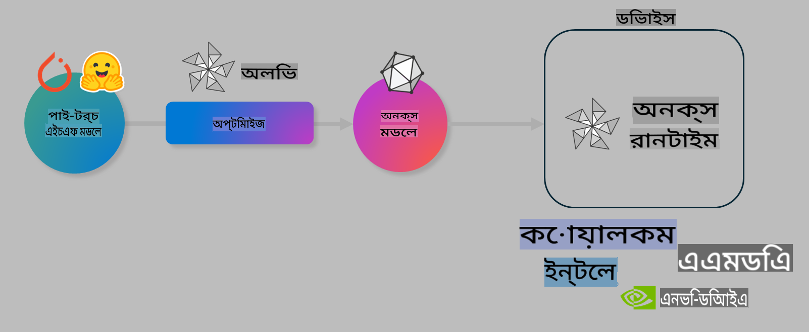

# ল্যাব: অন-ডিভাইস ইনফারেন্সের জন্য AI মডেল অপটিমাইজ করুন

## ভূমিকা

> [!IMPORTANT]
> এই ল্যাবটি সম্পন্ন করার জন্য একটি **Nvidia A10 বা A100 GPU** প্রয়োজন, যার সাথে সংশ্লিষ্ট ড্রাইভার এবং CUDA টুলকিট (সংস্করণ ১২+) ইনস্টল করা থাকতে হবে।

> [!NOTE]
> এটি একটি **৩৫-মিনিটের** ল্যাব যা আপনাকে OLIVE ব্যবহার করে অন-ডিভাইস ইনফারেন্সের জন্য মডেল অপটিমাইজেশনের মূল ধারণাগুলোর হাতে-কলমে পরিচয় দেবে।

## শিক্ষার উদ্দেশ্য

এই ল্যাব শেষে, আপনি OLIVE ব্যবহার করে নিম্নলিখিত কাজগুলো করতে পারবেন:

- AWQ কোয়ান্টাইজেশন পদ্ধতি ব্যবহার করে একটি AI মডেল কোয়ান্টাইজ করা।
- একটি নির্দিষ্ট কাজের জন্য একটি AI মডেল ফাইন-টিউন করা।
- ONNX Runtime-এ কার্যকরী অন-ডিভাইস ইনফারেন্সের জন্য LoRA অ্যাডাপ্টার (ফাইন-টিউনড মডেল) তৈরি করা।

### Olive কী

Olive (*O*NNX *live*) একটি মডেল অপটিমাইজেশন টুলকিট এবং CLI যা আপনাকে ONNX runtime +++https://onnxruntime.ai+++ এর জন্য মডেল সরবরাহ করতে সক্ষম করে।



Olive-এর ইনপুট সাধারণত একটি PyTorch বা Hugging Face মডেল হয় এবং আউটপুট হয় একটি অপটিমাইজড ONNX মডেল, যা একটি ডিভাইস (ডিপ্লয়মেন্ট টার্গেট) চালায় যেখানে ONNX runtime চলে। Olive মডেলটিকে হার্ডওয়্যার ভেন্ডর যেমন Qualcomm, AMD, Nvidia বা Intel দ্বারা সরবরাহকৃত ডিপ্লয়মেন্ট টার্গেটের AI অ্যাক্সিলারেটরের (NPU, GPU, CPU) জন্য অপটিমাইজ করে।

Olive একটি *ওয়ার্কফ্লো* সম্পাদন করে, যা একক মডেল অপটিমাইজেশন টাস্কের একটি সুশৃঙ্খল ক্রম যা *পাস* নামে পরিচিত - যেমন মডেল কম্প্রেশন, গ্রাফ ক্যাপচার, কোয়ান্টাইজেশন, গ্রাফ অপটিমাইজেশন। প্রতিটি পাসের একটি সেট প্যারামিটার থাকে যা সেরা মেট্রিক্স (যেমন একিউরেসি এবং লেটেন্সি) অর্জনের জন্য টিউন করা যায়। Olive একটি সার্চ অ্যালগরিদম ব্যবহার করে একক পাস বা একাধিক পাস একসঙ্গে অটো-টিউন করতে একটি সার্চ স্ট্র্যাটেজি প্রয়োগ করে।

#### Olive-এর সুবিধা

- গ্রাফ অপটিমাইজেশন, কম্প্রেশন এবং কোয়ান্টাইজেশনের জন্য বিভিন্ন কৌশল নিয়ে ট্রায়াল-এন্ড-এররের মাধ্যমে সময় এবং হতাশা কমায়। আপনার গুণগত এবং কার্যক্ষমতার সীমাবদ্ধতা নির্ধারণ করুন এবং Olive স্বয়ংক্রিয়ভাবে আপনার জন্য সেরা মডেল খুঁজে দেবে।
- **৪০+ বিল্ট-ইন মডেল অপটিমাইজেশন উপাদান** যা কোয়ান্টাইজেশন, কম্প্রেশন, গ্রাফ অপটিমাইজেশন এবং ফাইনটিউনিংয়ে আধুনিক কৌশলগুলো কভার করে।
- **সহজ-ব্যবহারযোগ্য CLI** সাধারণ মডেল অপটিমাইজেশন কাজের জন্য। উদাহরণস্বরূপ, olive quantize, olive auto-opt, olive finetune।
- মডেল প্যাকেজিং এবং ডিপ্লয়মেন্ট অন্তর্ভুক্ত।
- **মাল্টি LoRA সার্ভিং** এর জন্য মডেল জেনারেশন সাপোর্ট করে।
- YAML/JSON ব্যবহার করে মডেল অপটিমাইজেশন এবং ডিপ্লয়মেন্ট টাস্ক অর্কেস্ট্রেট করার জন্য ওয়ার্কফ্লো নির্মাণ।
- **Hugging Face** এবং **Azure AI** ইন্টিগ্রেশন।
- **ক্যাশিং** মেকানিজম অন্তর্ভুক্ত যা **খরচ বাঁচায়**।

## ল্যাব নির্দেশাবলী
> [!NOTE]
> নিশ্চিত করুন যে আপনি আপনার Azure AI Hub এবং Project প্রভিশন করেছেন এবং Lab 1 অনুসারে আপনার A100 কম্পিউট সেটআপ করেছেন।

### ধাপ ০: Azure AI Compute-এ সংযুক্ত হোন

আপনার **VS Code**-এর রিমোট ফিচার ব্যবহার করে Azure AI Compute-এ সংযুক্ত হোন।

1. আপনার **VS Code** ডেস্কটপ অ্যাপ্লিকেশন খুলুন:
1. **Shift+Ctrl+P** ব্যবহার করে **কমান্ড প্যালেট** খুলুন।
1. কমান্ড প্যালেটে **AzureML - remote: Connect to compute instance in New Window** অনুসন্ধান করুন।
1. সংযুক্ত হতে স্ক্রিনে প্রদর্শিত নির্দেশাবলী অনুসরণ করুন। এর মধ্যে থাকবে আপনার Azure Subscription, Resource Group, Project এবং Compute নাম নির্বাচন করা যা আপনি Lab 1-এ সেটআপ করেছেন।
1. একবার সংযুক্ত হলে, **Visual Code-এর নিচের বাম কোণে** এটি প্রদর্শিত হবে `><Azure ML: Compute Name`

### ধাপ ১: এই রিপো ক্লোন করুন

VS Code-এ, **Ctrl+J** ব্যবহার করে একটি নতুন টার্মিনাল খুলুন এবং এই রিপো ক্লোন করুন:

টার্মিনালে আপনি এই প্রম্পট দেখতে পাবেন:

```
azureuser@computername:~/cloudfiles/code$ 
```
সলিউশন ক্লোন করুন 

```bash
cd ~/localfiles
git clone https://github.com/microsoft/phi-3cookbook.git
```

### ধাপ ২: VS Code-এ ফোল্ডার খুলুন

প্রাসঙ্গিক ফোল্ডারে VS Code খুলতে টার্মিনালে নিম্নলিখিত কমান্ডটি চালান, যা একটি নতুন উইন্ডো খুলবে:

```bash
code phi-3cookbook/code/04.Finetuning/Olive-lab
```

অথবা, আপনি **File** > **Open Folder** নির্বাচন করে ফোল্ডারটি খুলতে পারেন।

### ধাপ ৩: নির্ভরশীলতা

Azure AI Compute Instance-এ VS Code-এ একটি টার্মিনাল উইন্ডো খুলুন (টিপ: **Ctrl+J**) এবং নির্ভরশীলতাগুলো ইনস্টল করতে নিম্নলিখিত কমান্ডগুলো চালান:

```bash
conda create -n olive-ai python=3.11 -y
conda activate olive-ai
pip install -r requirements.txt
az extension remove -n azure-cli-ml
az extension add -n ml
```

> [!NOTE]
> সমস্ত নির্ভরশীলতা ইনস্টল করতে ~৫ মিনিট সময় লাগবে।

এই ল্যাবে আপনি মডেল ডাউনলোড এবং আপলোড করবেন Azure AI Model ক্যাটালগে। মডেল ক্যাটালগ অ্যাক্সেস করার জন্য, আপনাকে Azure-এ লগইন করতে হবে:

```bash
az login
```

> [!NOTE]
> লগইনের সময় আপনাকে আপনার সাবস্ক্রিপশন নির্বাচন করতে বলা হবে। নিশ্চিত করুন যে আপনি এই ল্যাবের জন্য সরবরাহিত সাবস্ক্রিপশনটি সেট করেছেন।

### ধাপ ৪: Olive কমান্ডগুলো চালান

Azure AI Compute Instance-এ VS Code-এ একটি টার্মিনাল উইন্ডো খুলুন (টিপ: **Ctrl+J**) এবং নিশ্চিত করুন যে `olive-ai` কন্ডা এনভায়রনমেন্ট অ্যাক্টিভেট করা আছে:

```bash
conda activate olive-ai
```

এরপর, নিচের Olive কমান্ডগুলো কমান্ড লাইনে চালান।

1. **ডেটা পরিদর্শন করুন:** এই উদাহরণে, আপনি Phi-3.5-Mini মডেলটি ফাইন-টিউন করবেন যাতে এটি ভ্রমণ সম্পর্কিত প্রশ্নের উত্তর দিতে বিশেষায়িত হয়। নিচের কোডটি ডেটাসেটের প্রথম কয়েকটি রেকর্ড প্রদর্শন করে, যা JSON লাইন ফরম্যাটে রয়েছে:

    ```bash
    head data/data_sample_travel.jsonl
    ```
1. **মডেল কোয়ান্টাইজ করুন:** মডেল প্রশিক্ষণের আগে, নিচের কমান্ডটি ব্যবহার করে একটি পদ্ধতি Active Aware Quantization (AWQ) +++https://arxiv.org/abs/2306.00978+++ দিয়ে কোয়ান্টাইজ করুন। AWQ একটি মডেলের ওজন কোয়ান্টাইজ করে ইনফারেন্স চলাকালীন উৎপন্ন অ্যাক্টিভেশন বিবেচনা করে। এর মানে কোয়ান্টাইজেশন প্রক্রিয়া অ্যাক্টিভেশনে প্রকৃত ডেটা ডিস্ট্রিবিউশন বিবেচনা করে, যা ঐতিহ্যবাহী ওজন কোয়ান্টাইজেশন পদ্ধতির তুলনায় মডেলের সঠিকতা আরও ভালোভাবে সংরক্ষণ করে।

    ```bash
    olive quantize \
       --model_name_or_path microsoft/Phi-3.5-mini-instruct \
       --trust_remote_code \
       --algorithm awq \
       --output_path models/phi/awq \
       --log_level 1
    ```
    
    **AWQ কোয়ান্টাইজেশন সম্পন্ন করতে ~৮ মিনিট** সময় লাগে, যা **মডেলের আকার ~৭.৫GB থেকে ~২.৫GB-এ কমিয়ে আনে**।
   
   এই ল্যাবে, আমরা আপনাকে Hugging Face থেকে মডেল ইনপুট করার পদ্ধতি দেখাচ্ছি (যেমন: `microsoft/Phi-3.5-mini-instruct`). However, Olive also allows you to input models from the Azure AI catalog by updating the `model_name_or_path` argument to an Azure AI asset ID (for example:  `azureml://registries/azureml/models/Phi-3.5-mini-instruct/versions/4`). 

1. **Train the model:** Next, the `olive finetune` কমান্ড কোয়ান্টাইজড মডেলটি ফাইন-টিউন করে। কোয়ান্টাইজেশনের পরে ফাইন-টিউন করার পরিবর্তে আগে কোয়ান্টাইজ করা হলে আরও ভালো সঠিকতা পাওয়া যায় কারণ ফাইন-টিউন প্রক্রিয়া কোয়ান্টাইজেশন থেকে কিছু ক্ষতি পুনরুদ্ধার করে।

    ```bash
    olive finetune \
        --method lora \
        --model_name_or_path models/phi/awq \
        --data_files "data/data_sample_travel.jsonl" \
        --data_name "json" \
        --text_template "<|user|>\n{prompt}<|end|>\n<|assistant|>\n{response}<|end|>" \
        --max_steps 100 \
        --output_path ./models/phi/ft \
        --log_level 1
    ```
    
    **ফাইন-টিউন সম্পন্ন করতে (১০০ ধাপে) ~৬ মিনিট** সময় লাগে।

1. **অপটিমাইজ করুন:** মডেল প্রশিক্ষণ শেষ হলে, এখন Olive-এর `auto-opt` command, which will capture the ONNX graph and automatically perform a number of optimizations to improve the model performance for CPU by compressing the model and doing fusions. It should be noted, that you can also optimize for other devices such as NPU or GPU by just updating the `--device` and `--provider` আর্গুমেন্ট ব্যবহার করে মডেল অপটিমাইজ করুন - তবে এই ল্যাবের জন্য আমরা CPU ব্যবহার করব।

    ```bash
    olive auto-opt \
       --model_name_or_path models/phi/ft/model \
       --adapter_path models/phi/ft/adapter \
       --device cpu \
       --provider CPUExecutionProvider \
       --use_ort_genai \
       --output_path models/phi/onnx-ao \
       --log_level 1
    ```
    
    **অপটিমাইজেশন সম্পন্ন করতে ~৫ মিনিট** সময় লাগে।

### ধাপ ৫: মডেলের ইনফারেন্স দ্রুত পরীক্ষা

মডেলের ইনফারেন্স পরীক্ষা করতে, আপনার ফোল্ডারে **app.py** নামে একটি পাইথন ফাইল তৈরি করুন এবং নিচের কোডটি কপি-পেস্ট করুন:

```python
import onnxruntime_genai as og
import numpy as np

print("loading model and adapters...", end="", flush=True)
model = og.Model("models/phi/onnx-ao/model")
adapters = og.Adapters(model)
adapters.load("models/phi/onnx-ao/model/adapter_weights.onnx_adapter", "travel")
print("DONE!")

tokenizer = og.Tokenizer(model)
tokenizer_stream = tokenizer.create_stream()

params = og.GeneratorParams(model)
params.set_search_options(max_length=100, past_present_share_buffer=False)
user_input = "what is the best thing to see in chicago"
params.input_ids = tokenizer.encode(f"<|user|>\n{user_input}<|end|>\n<|assistant|>\n")

generator = og.Generator(model, params)

generator.set_active_adapter(adapters, "travel")

print(f"{user_input}")

while not generator.is_done():
    generator.compute_logits()
    generator.generate_next_token()

    new_token = generator.get_next_tokens()[0]
    print(tokenizer_stream.decode(new_token), end='', flush=True)

print("\n")
```

কোডটি চালান:

```bash
python app.py
```

### ধাপ ৬: মডেলটি Azure AI-এ আপলোড করুন

মডেলটি Azure AI মডেল রিপোজিটরিতে আপলোড করলে এটি আপনার ডেভেলপমেন্ট টিমের অন্যান্য সদস্যদের সাথে শেয়ার করা যায় এবং মডেলের ভার্সন কন্ট্রোলও পরিচালনা করা যায়। মডেল আপলোড করতে নিচের কমান্ডটি চালান:

> [!NOTE]
> `{}` placeholders with the name of your resource group and Azure AI Project Name. 

To find your resource group `"resourceGroup" এবং Azure AI Project name আপডেট করুন এবং নিম্নলিখিত কমান্ড চালান 

```
az ml workspace show
```

অথবা +++ai.azure.com+++ এ গিয়ে **management center**, **project**, এবং **overview** নির্বাচন করুন।

`{}` প্লেসহোল্ডারগুলো আপনার রিসোর্স গ্রুপ এবং Azure AI Project Name দিয়ে আপডেট করুন।

```bash
az ml model create \
    --name ft-for-travel \
    --version 1 \
    --path ./models/phi/onnx-ao \
    --resource-group {RESOURCE_GROUP_NAME} \
    --workspace-name {PROJECT_NAME}
```
এরপর আপনি আপনার আপলোড করা মডেল দেখতে পারবেন এবং https://ml.azure.com/model/list থেকে মডেলটি ডিপ্লয় করতে পারবেন।

**অস্বীকৃতি**:  
এই নথিটি মেশিন-ভিত্তিক এআই অনুবাদ পরিষেবাগুলির মাধ্যমে অনুবাদ করা হয়েছে। আমরা যথাসম্ভব সঠিক অনুবাদের চেষ্টা করি, তবে দয়া করে মনে রাখবেন যে স্বয়ংক্রিয় অনুবাদে ভুল বা অসংগতি থাকতে পারে। মূল ভাষায় থাকা নথিটিকেই প্রামাণিক উৎস হিসেবে বিবেচনা করা উচিত। গুরুত্বপূর্ণ তথ্যের জন্য, পেশাদার মানব অনুবাদ প্রস্তাবিত। এই অনুবাদ ব্যবহারের ফলে সৃষ্ট যে কোনো ভুল বোঝাবুঝি বা ভুল ব্যাখ্যার জন্য আমরা দায়ী নই।