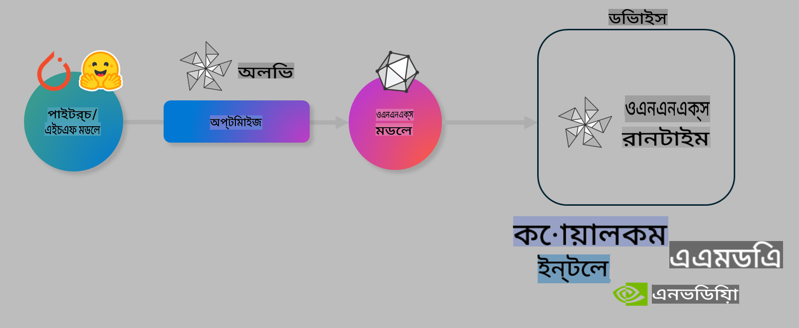

# ল্যাব। অন-ডিভাইস ইনফারেন্সের জন্য AI মডেল অপটিমাইজ করুন

## ভূমিকা

> [!IMPORTANT]
> এই ল্যাবের জন্য **Nvidia A10 বা A100 GPU** প্রয়োজন, যার সাথে সংশ্লিষ্ট ড্রাইভার এবং CUDA টুলকিট (সংস্করণ ১২+) ইনস্টল করা থাকতে হবে।

> [!NOTE]
> এটি একটি **৩৫-মিনিটের** ল্যাব যা আপনাকে OLIVE ব্যবহার করে অন-ডিভাইস ইনফারেন্সের জন্য মডেল অপটিমাইজেশনের মূল ধারণাগুলোর সাথে পরিচয় করাবে।

## শিক্ষার উদ্দেশ্য

এই ল্যাব শেষ করার পর, আপনি OLIVE ব্যবহার করে নিম্নলিখিত কাজগুলো করতে পারবেন:

- AWQ কোয়ান্টাইজেশন পদ্ধতি ব্যবহার করে একটি AI মডেল কোয়ান্টাইজ করা।
- একটি নির্দিষ্ট কাজের জন্য একটি AI মডেল ফাইন-টিউন করা।
- ONNX Runtime-এ দক্ষ অন-ডিভাইস ইনফারেন্সের জন্য LoRA অ্যাডাপ্টার তৈরি করা।

### Olive কী

Olive (*O*NNX *live*) একটি মডেল অপটিমাইজেশন টুলকিট এবং এর সাথে থাকা CLI, যা আপনাকে ONNX runtime +++https://onnxruntime.ai+++ এর জন্য মডেল সরবরাহ করতে সক্ষম করে।



Olive-এর ইনপুট সাধারণত একটি PyTorch বা Hugging Face মডেল হয় এবং আউটপুট হয় একটি অপটিমাইজ করা ONNX মডেল, যা ONNX runtime চালানো একটি ডিভাইসে (ডিপ্লয়মেন্ট টার্গেট) কার্যকর হয়। Olive মডেলটিকে ডিপ্লয়মেন্ট টার্গেটের AI অ্যাক্সিলারেটর (NPU, GPU, CPU)-এর জন্য অপটিমাইজ করবে, যা Qualcomm, AMD, Nvidia বা Intel-এর মতো হার্ডওয়্যার ভেন্ডর দ্বারা সরবরাহ করা হয়।

Olive একটি *ওয়ার্কফ্লো* সম্পাদন করে, যা একাধিক মডেল অপটিমাইজেশন টাস্কের একটি ক্রমানুসারে সংকলিত তালিকা (*passes*)। উদাহরণস্বরূপ: মডেল কম্প্রেশন, গ্রাফ ক্যাপচার, কোয়ান্টাইজেশন, গ্রাফ অপটিমাইজেশন। প্রতিটি পাসের একটি নির্দিষ্ট প্যারামিটার সেট থাকে যা সেরা মেট্রিক্স (যেমন: সঠিকতা এবং লেটেন্সি) অর্জনের জন্য টিউন করা যায়, যা সংশ্লিষ্ট ইভ্যালুয়েটর দ্বারা মূল্যায়ন করা হয়। Olive একটি সার্চ অ্যালগরিদম ব্যবহার করে প্রতিটি পাস এককভাবে বা একাধিক পাস একত্রে অটো-টিউন করে।

#### Olive-এর সুবিধা

- গ্রাফ অপটিমাইজেশন, কম্প্রেশন এবং কোয়ান্টাইজেশনের বিভিন্ন কৌশল নিয়ে ট্রায়াল-অ্যান্ড-এররের ঝামেলা এবং সময় কমিয়ে দেয়। আপনার মান ও পারফরম্যান্সের সীমা নির্ধারণ করুন এবং Olive স্বয়ংক্রিয়ভাবে আপনার জন্য সেরা মডেল খুঁজে দেবে।
- **৪০+ বিল্ট-ইন মডেল অপটিমাইজেশন উপাদান** যা কোয়ান্টাইজেশন, কম্প্রেশন, গ্রাফ অপটিমাইজেশন এবং ফাইনটিউনিং-এর সর্বাধুনিক কৌশলসমূহ কভার করে।
- সাধারণ মডেল অপটিমাইজেশন টাস্কের জন্য **সহজ-ব্যবহারযোগ্য CLI**। যেমন: olive quantize, olive auto-opt, olive finetune।
- মডেল প্যাকেজিং এবং ডিপ্লয়মেন্ট অন্তর্ভুক্ত।
- **মাল্টি LoRA সার্ভিং** এর জন্য মডেল তৈরি সমর্থন করে।
- YAML/JSON ব্যবহার করে মডেল অপটিমাইজেশন এবং ডিপ্লয়মেন্ট টাস্ক অর্কেস্ট্রেট করার জন্য ওয়ার্কফ্লো তৈরি করা।
- **Hugging Face** এবং **Azure AI** ইন্টিগ্রেশন।
- **ক্যাশিং** মেকানিজম অন্তর্ভুক্ত, যা **খরচ বাঁচায়**।

## ল্যাব নির্দেশনা
> [!NOTE]
> নিশ্চিত করুন যে আপনি আপনার Azure AI Hub এবং প্রজেক্ট প্রভিশন করেছেন এবং ল্যাব ১ অনুযায়ী আপনার A100 কম্পিউট সেটআপ করেছেন।

### ধাপ ০: Azure AI Compute-এ সংযোগ করুন

আপনি **VS Code**-এর রিমোট ফিচার ব্যবহার করে Azure AI Compute-এ সংযোগ করবেন।

1. আপনার **VS Code** ডেস্কটপ অ্যাপ্লিকেশনটি খুলুন:
1. **Shift+Ctrl+P** ব্যবহার করে **কমান্ড প্যালেট** খুলুন।
1. কমান্ড প্যালেটে **AzureML - remote: Connect to compute instance in New Window** অনুসন্ধান করুন।
1. স্ক্রিনে প্রদর্শিত নির্দেশনা অনুসরণ করে Compute-এ সংযোগ করুন। এতে আপনার Azure Subscription, Resource Group, Project এবং Compute নাম নির্বাচন করা অন্তর্ভুক্ত থাকবে, যা আপনি ল্যাব ১-এ সেটআপ করেছেন।
1. একবার আপনি Azure ML Compute নোডে সংযুক্ত হলে, এটি **Visual Code-এর নিচের বাম কোণে** প্রদর্শিত হবে `><Azure ML: Compute Name`

### ধাপ ১: এই রিপো ক্লোন করুন

VS Code-এ, **Ctrl+J** ব্যবহার করে একটি নতুন টার্মিনাল খুলুন এবং এই রিপো ক্লোন করুন:

টার্মিনালে আপনি নিম্নলিখিত প্রম্পট দেখতে পাবেন:

```
azureuser@computername:~/cloudfiles/code$ 
```
রিপো ক্লোন করুন

```bash
cd ~/localfiles
git clone https://github.com/microsoft/phi-3cookbook.git
```

### ধাপ ২: VS Code-এ ফোল্ডার খুলুন

প্রাসঙ্গিক ফোল্ডারে VS Code খুলতে, টার্মিনালে নিম্নলিখিত কমান্ডটি চালান, যা একটি নতুন উইন্ডো খুলবে:

```bash
code phi-3cookbook/code/04.Finetuning/Olive-lab
```

অথবা, আপনি **File** > **Open Folder** নির্বাচন করে ফোল্ডার খুলতে পারেন।

### ধাপ ৩: নির্ভরশীলতাসমূহ

Azure AI Compute Instance-এ (টিপ: **Ctrl+J**) VS Code-এ একটি টার্মিনাল উইন্ডো খুলুন এবং নির্ভরশীলতাসমূহ ইনস্টল করতে নিম্নলিখিত কমান্ডগুলো চালান:

```bash
conda create -n olive-ai python=3.11 -y
conda activate olive-ai
pip install -r requirements.txt
az extension remove -n azure-cli-ml
az extension add -n ml
```

> [!NOTE]
> সমস্ত নির্ভরশীলতা ইনস্টল হতে ~৫ মিনিট সময় লাগবে।

এই ল্যাবে আপনি মডেল ডাউনলোড এবং Azure AI Model ক্যাটালগে আপলোড করবেন। মডেল ক্যাটালগ অ্যাক্সেস করতে, আপনাকে Azure-এ লগইন করতে হবে:

```bash
az login
```

> [!NOTE]
> লগইন করার সময় আপনাকে আপনার সাবস্ক্রিপশন নির্বাচন করতে বলা হবে। নিশ্চিত করুন যে আপনি এই ল্যাবের জন্য প্রদত্ত সাবস্ক্রিপশনটি সেট করেছেন।

### ধাপ ৪: Olive কমান্ডগুলো চালান

Azure AI Compute Instance-এ (টিপ: **Ctrl+J**) একটি টার্মিনাল উইন্ডো খুলুন এবং নিশ্চিত করুন যে `olive-ai` কন্ডা এনভায়রনমেন্ট অ্যাক্টিভেট করা আছে:

```bash
conda activate olive-ai
```

এরপর, কমান্ড লাইনে নিম্নলিখিত Olive কমান্ডগুলো চালান।

1. **ডেটা পরিদর্শন করুন:** এই উদাহরণে, আপনি Phi-3.5-Mini মডেল ফাইন-টিউন করবেন যাতে এটি ভ্রমণ-সম্পর্কিত প্রশ্নের উত্তর দিতে বিশেষায়িত হয়। নিচের কোডটি ডেটাসেটের প্রথম কয়েকটি রেকর্ড দেখায়, যা JSON লাইন ফরম্যাটে রয়েছে:
   
    ```bash
    head data/data_sample_travel.jsonl
    ```
1. **মডেল কোয়ান্টাইজ করুন:** মডেল প্রশিক্ষণের আগে, নিম্নলিখিত কমান্ড ব্যবহার করে একটি Active Aware Quantization (AWQ) +++https://arxiv.org/abs/2306.00978+++ পদ্ধতি দিয়ে কোয়ান্টাইজ করুন। AWQ মডেলের ওজন কোয়ান্টাইজ করে ইনফারেন্সের সময় প্রাপ্ত অ্যাক্টিভেশন বিবেচনা করে। এর ফলে, ঐতিহ্যবাহী ওজন কোয়ান্টাইজেশন পদ্ধতির তুলনায় মডেলের সঠিকতা আরও ভালোভাবে সংরক্ষিত হয়।

    ```bash
    olive quantize \
       --model_name_or_path microsoft/Phi-3.5-mini-instruct \
       --trust_remote_code \
       --algorithm awq \
       --output_path models/phi/awq \
       --log_level 1
    ```
    
    AWQ কোয়ান্টাইজেশন সম্পন্ন হতে **~৮ মিনিট** সময় লাগে, যা **মডেলের আকার ~৭.৫GB থেকে ~২.৫GB**-এ কমিয়ে আনে।
   
   এই ল্যাবে, আমরা আপনাকে দেখাচ্ছি কিভাবে Hugging Face থেকে মডেল ইনপুট করতে হয় (যেমন: `microsoft/Phi-3.5-mini-instruct`). However, Olive also allows you to input models from the Azure AI catalog by updating the `model_name_or_path` argument to an Azure AI asset ID (for example:  `azureml://registries/azureml/models/Phi-3.5-mini-instruct/versions/4`). 

1. **Train the model:** Next, the `olive finetune` কমান্ড কোয়ান্টাইজ করা মডেল ফাইন-টিউন করে। কোয়ান্টাইজেশনের পরে ফাইন-টিউন করার পরিবর্তে আগে কোয়ান্টাইজ করা হলে সঠিকতা উন্নত হয় কারণ ফাইন-টিউন প্রক্রিয়া কোয়ান্টাইজেশনের কিছু ক্ষতি পুনরুদ্ধার করে।

    ```bash
    olive finetune \
        --method lora \
        --model_name_or_path models/phi/awq \
        --data_files "data/data_sample_travel.jsonl" \
        --data_name "json" \
        --text_template "<|user|>\n{prompt}<|end|>\n<|assistant|>\n{response}<|end|>" \
        --max_steps 100 \
        --output_path ./models/phi/ft \
        --log_level 1
    ```
    
    ফাইন-টিউনিং সম্পন্ন হতে (১০০ ধাপ সহ) **~৬ মিনিট** সময় লাগে।

1. **অপটিমাইজ করুন:** মডেল প্রশিক্ষণ শেষ হলে, এখন Olive-এর `auto-opt` command, which will capture the ONNX graph and automatically perform a number of optimizations to improve the model performance for CPU by compressing the model and doing fusions. It should be noted, that you can also optimize for other devices such as NPU or GPU by just updating the `--device` and `--provider` আর্গুমেন্ট ব্যবহার করে মডেল অপটিমাইজ করুন - তবে এই ল্যাবের জন্য আমরা CPU ব্যবহার করব।

    ```bash
    olive auto-opt \
       --model_name_or_path models/phi/ft/model \
       --adapter_path models/phi/ft/adapter \
       --device cpu \
       --provider CPUExecutionProvider \
       --use_ort_genai \
       --output_path models/phi/onnx-ao \
       --log_level 1
    ```
    
    অপটিমাইজেশন সম্পন্ন হতে **~৫ মিনিট** সময় লাগে।

### ধাপ ৫: মডেল ইনফারেন্স দ্রুত পরীক্ষা

মডেল ইনফারেন্স পরীক্ষা করতে, আপনার ফোল্ডারে **app.py** নামে একটি পাইটন ফাইল তৈরি করুন এবং নিচের কোডটি কপি-পেস্ট করুন:

```python
import onnxruntime_genai as og
import numpy as np

print("loading model and adapters...", end="", flush=True)
model = og.Model("models/phi/onnx-ao/model")
adapters = og.Adapters(model)
adapters.load("models/phi/onnx-ao/model/adapter_weights.onnx_adapter", "travel")
print("DONE!")

tokenizer = og.Tokenizer(model)
tokenizer_stream = tokenizer.create_stream()

params = og.GeneratorParams(model)
params.set_search_options(max_length=100, past_present_share_buffer=False)
user_input = "what is the best thing to see in chicago"
params.input_ids = tokenizer.encode(f"<|user|>\n{user_input}<|end|>\n<|assistant|>\n")

generator = og.Generator(model, params)

generator.set_active_adapter(adapters, "travel")

print(f"{user_input}")

while not generator.is_done():
    generator.compute_logits()
    generator.generate_next_token()

    new_token = generator.get_next_tokens()[0]
    print(tokenizer_stream.decode(new_token), end='', flush=True)

print("\n")
```

কোডটি চালানোর জন্য ব্যবহার করুন:

```bash
python app.py
```

### ধাপ ৬: মডেল Azure AI-তে আপলোড করুন

মডেলটি Azure AI মডেল রিপোজিটরিতে আপলোড করলে এটি আপনার ডেভেলপমেন্ট টিমের অন্যান্য সদস্যদের সাথে শেয়ারযোগ্য হয় এবং মডেলের ভার্সন কন্ট্রোলও পরিচালিত হয়। মডেল আপলোড করতে নিম্নলিখিত কমান্ডটি চালান:

> [!NOTE]
> `{}` placeholders with the name of your resource group and Azure AI Project Name. 

To find your resource group `"resourceGroup" এবং Azure AI Project নাম আপডেট করে, নিচের কমান্ডটি চালান 

```
az ml workspace show
```

অথবা +++ai.azure.com+++ এ গিয়ে **management center** > **project** > **overview** নির্বাচন করুন।

`{}` প্লেসহোল্ডারগুলো আপনার রিসোর্স গ্রুপ এবং Azure AI প্রজেক্ট নাম দিয়ে আপডেট করুন।

```bash
az ml model create \
    --name ft-for-travel \
    --version 1 \
    --path ./models/phi/onnx-ao \
    --resource-group {RESOURCE_GROUP_NAME} \
    --workspace-name {PROJECT_NAME}
```
এরপর আপনি আপনার আপলোড করা মডেলটি দেখতে পারবেন এবং https://ml.azure.com/model/list এ মডেলটি ডিপ্লয় করতে পারবেন।

**অস্বীকৃতি**:  
এই নথি মেশিন-ভিত্তিক কৃত্রিম বুদ্ধিমত্তা অনুবাদ পরিষেবা ব্যবহার করে অনুবাদ করা হয়েছে। আমরা যথাসাধ্য সঠিকতার জন্য চেষ্টা করি, তবে দয়া করে মনে রাখবেন যে স্বয়ংক্রিয় অনুবাদে ত্রুটি বা অসঙ্গতি থাকতে পারে। নথিটির মূল ভাষায় লেখা আসল সংস্করণটিকেই প্রামাণিক উৎস হিসেবে বিবেচনা করা উচিত। গুরুত্বপূর্ণ তথ্যের জন্য পেশাদার মানব অনুবাদ প্রস্তাবিত। এই অনুবাদ ব্যবহারের ফলে উদ্ভূত যে কোনো ভুল বোঝাবুঝি বা ভুল ব্যাখ্যার জন্য আমরা দায়ী নই।