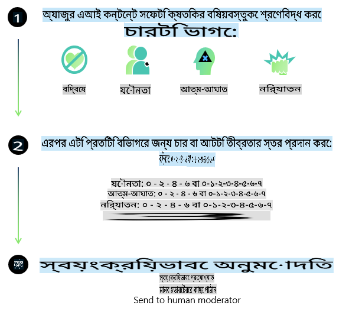
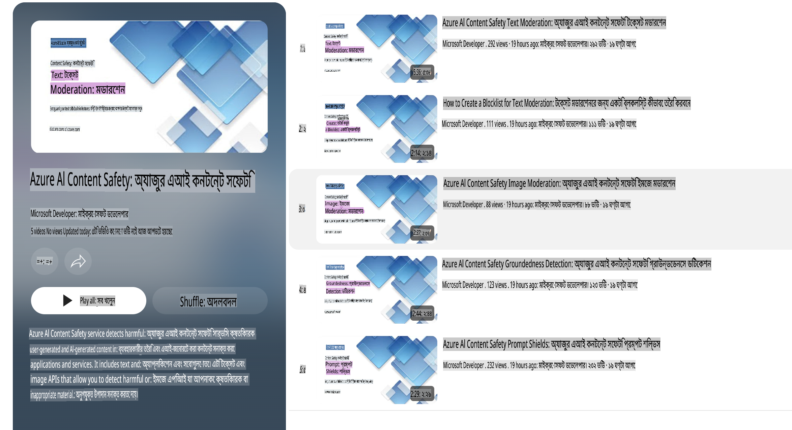

# ফাই মডেলের জন্য এআই নিরাপত্তা
ফাই পরিবারের মডেলগুলো [Microsoft Responsible AI Standard](https://query.prod.cms.rt.microsoft.com/cms/api/am/binary/RE5cmFl) অনুসারে তৈরি করা হয়েছে, যা নিম্নলিখিত ছয়টি নীতির উপর ভিত্তি করে কোম্পানি-ব্যাপী একটি প্রয়োজনীয়তার সেট: জবাবদিহিতা, স্বচ্ছতা, ন্যায্যতা, নির্ভরযোগ্যতা এবং নিরাপত্তা, গোপনীয়তা এবং সুরক্ষা, এবং অন্তর্ভুক্তি, যা [Microsoft-এর Responsible AI নীতিমালা](https://www.microsoft.com/ai/responsible-ai)-এর অংশ। 

পূর্ববর্তী ফাই মডেলগুলোর মতো, এই রিলিজের বহু-ভাষাগত সক্ষমতাগুলোর জন্য অতিরিক্ত ব্যবস্থা গ্রহণসহ একটি বহুমুখী নিরাপত্তা মূল্যায়ন এবং নিরাপত্তা-পরবর্তী প্রশিক্ষণ পদ্ধতি গ্রহণ করা হয়েছিল। আমাদের নিরাপত্তা প্রশিক্ষণ এবং মূল্যায়নের পদ্ধতি, যার মধ্যে একাধিক ভাষা এবং ঝুঁকির বিভাগে পরীক্ষা অন্তর্ভুক্ত, [Phi Safety Post-Training Paper](https://arxiv.org/abs/2407.13833)-এ বিস্তারিতভাবে তুলে ধরা হয়েছে। ফাই মডেলগুলো এই পদ্ধতির সুবিধা পেলেও, ডেভেলপারদের উচিত দায়িত্বশীল এআই-এর সেরা অনুশীলন প্রয়োগ করা, যার মধ্যে তাদের নির্দিষ্ট ব্যবহারের ক্ষেত্র এবং সাংস্কৃতিক ও ভাষাগত প্রেক্ষাপটের সাথে সম্পর্কিত ঝুঁকিগুলো চিহ্নিত, পরিমাপ এবং প্রশমিত করা অন্তর্ভুক্ত।

## সেরা অনুশীলন

অন্যান্য মডেলের মতো, ফাই পরিবারের মডেলগুলো এমন আচরণ করতে পারে যা অন্যায্য, অবিশ্বস্ত, বা আক্রমণাত্মক হতে পারে।

SLM এবং LLM-এর কিছু সীমাবদ্ধ আচরণ সম্পর্কে আপনাকে সচেতন থাকতে হবে, যেমন:

- **সেবার মান:** ফাই মডেলগুলো মূলত ইংরেজি পাঠ্য ডেটার উপর প্রশিক্ষিত। ইংরেজি ছাড়া অন্যান্য ভাষায় কর্মক্ষমতা কম হতে পারে। প্রশিক্ষণ ডেটায় কম প্রতিনিধিত্বকারী ইংরেজি ভাষার ভিন্নতাগুলো স্ট্যান্ডার্ড আমেরিকান ইংরেজির তুলনায় খারাপ কর্মক্ষমতা প্রদর্শন করতে পারে।
- **ক্ষতির প্রতিনিধিত্ব এবং স্টেরিওটাইপের পুনরাবৃত্তি:** এই মডেলগুলো কিছু গোষ্ঠীর প্রতিনিধিত্ব বেশি বা কম করতে পারে, কিছু গোষ্ঠীর প্রতিনিধিত্ব মুছে ফেলতে পারে, বা অপমানজনক বা নেতিবাচক স্টেরিওটাইপকে শক্তিশালী করতে পারে। নিরাপত্তা-পরবর্তী প্রশিক্ষণ সত্ত্বেও, বিভিন্ন গোষ্ঠীর প্রতিনিধিত্বের স্তর বা প্রশিক্ষণ ডেটায় নেতিবাচক স্টেরিওটাইপের উদাহরণের প্রাচুর্যের কারণে এই সীমাবদ্ধতাগুলো রয়ে যেতে পারে, যা বাস্তব জীবনের ধরণ এবং সামাজিক পক্ষপাতকে প্রতিফলিত করে।
- **অনুপযুক্ত বা আক্রমণাত্মক বিষয়বস্তু:** এই মডেলগুলো অন্যান্য ধরনের অনুপযুক্ত বা আক্রমণাত্মক বিষয়বস্তু তৈরি করতে পারে, যা নির্দিষ্ট ব্যবহারের ক্ষেত্রে অতিরিক্ত প্রশমন ব্যবস্থা ছাড়া সংবেদনশীল প্রেক্ষাপটে মোতায়েনের জন্য অনুপযুক্ত হতে পারে।  
- **তথ্যের নির্ভরযোগ্যতা:** ভাষাগত মডেলগুলো অর্থহীন বিষয়বস্তু তৈরি করতে পারে বা এমন বিষয়বস্তু তৈরি করতে পারে যা যুক্তিসঙ্গত শোনায় কিন্তু অযথার্থ বা পুরানো।  
- **কোডের সীমিত ক্ষেত্র:** ফাই-৩ এর বেশিরভাগ প্রশিক্ষণ ডেটা পাইথন এবং সাধারণ প্যাকেজ যেমন "typing, math, random, collections, datetime, itertools"-এর উপর ভিত্তি করে। যদি মডেল এমন পাইথন স্ক্রিপ্ট তৈরি করে যা অন্যান্য প্যাকেজ বা অন্যান্য ভাষার স্ক্রিপ্ট ব্যবহার করে, আমরা দৃঢ়ভাবে সুপারিশ করি যে ব্যবহারকারীরা ম্যানুয়ালি সমস্ত API ব্যবহার যাচাই করেন।

ডেভেলপারদের উচিত দায়িত্বশীল এআই-এর সেরা অনুশীলন প্রয়োগ করা এবং নিশ্চিত করা যে একটি নির্দিষ্ট ব্যবহারের ক্ষেত্র প্রাসঙ্গিক আইন এবং বিধিবিধানের সাথে সামঞ্জস্যপূর্ণ (যেমন গোপনীয়তা, বাণিজ্য, ইত্যাদি)।

## দায়িত্বশীল এআই বিবেচনা

অন্যান্য ভাষাগত মডেলের মতো, ফাই সিরিজের মডেলগুলো এমন আচরণ করতে পারে যা অন্যায্য, অবিশ্বস্ত, বা আক্রমণাত্মক হতে পারে। কিছু সীমাবদ্ধ আচরণ সম্পর্কে সচেতন থাকা গুরুত্বপূর্ণ:

**সেবার মান:** ফাই মডেলগুলো মূলত ইংরেজি পাঠ্য ডেটার উপর প্রশিক্ষিত। ইংরেজি ছাড়া অন্যান্য ভাষায় কর্মক্ষমতা কম হতে পারে। প্রশিক্ষণ ডেটায় কম প্রতিনিধিত্বকারী ইংরেজি ভাষার ভিন্নতাগুলো স্ট্যান্ডার্ড আমেরিকান ইংরেজির তুলনায় খারাপ কর্মক্ষমতা প্রদর্শন করতে পারে।

**ক্ষতির প্রতিনিধিত্ব এবং স্টেরিওটাইপের পুনরাবৃত্তি:** এই মডেলগুলো কিছু গোষ্ঠীর প্রতিনিধিত্ব বেশি বা কম করতে পারে, কিছু গোষ্ঠীর প্রতিনিধিত্ব মুছে ফেলতে পারে, বা অপমানজনক বা নেতিবাচক স্টেরিওটাইপকে শক্তিশালী করতে পারে। নিরাপত্তা-পরবর্তী প্রশিক্ষণ সত্ত্বেও, বিভিন্ন গোষ্ঠীর প্রতিনিধিত্বের স্তর বা প্রশিক্ষণ ডেটায় নেতিবাচক স্টেরিওটাইপের উদাহরণের প্রাচুর্যের কারণে এই সীমাবদ্ধতাগুলো রয়ে যেতে পারে, যা বাস্তব জীবনের ধরণ এবং সামাজিক পক্ষপাতকে প্রতিফলিত করে।

**অনুপযুক্ত বা আক্রমণাত্মক বিষয়বস্তু:** এই মডেলগুলো অন্যান্য ধরনের অনুপযুক্ত বা আক্রমণাত্মক বিষয়বস্তু তৈরি করতে পারে, যা নির্দিষ্ট ব্যবহারের ক্ষেত্রে অতিরিক্ত প্রশমন ব্যবস্থা ছাড়া সংবেদনশীল প্রেক্ষাপটে মোতায়েনের জন্য অনুপযুক্ত হতে পারে।  
তথ্যের নির্ভরযোগ্যতা: ভাষাগত মডেলগুলো অর্থহীন বিষয়বস্তু তৈরি করতে পারে বা এমন বিষয়বস্তু তৈরি করতে পারে যা যুক্তিসঙ্গত শোনায় কিন্তু অযথার্থ বা পুরানো।

**কোডের সীমিত ক্ষেত্র:** ফাই-৩ এর বেশিরভাগ প্রশিক্ষণ ডেটা পাইথন এবং সাধারণ প্যাকেজ যেমন "typing, math, random, collections, datetime, itertools"-এর উপর ভিত্তি করে। যদি মডেল এমন পাইথন স্ক্রিপ্ট তৈরি করে যা অন্যান্য প্যাকেজ বা অন্যান্য ভাষার স্ক্রিপ্ট ব্যবহার করে, আমরা দৃঢ়ভাবে সুপারিশ করি যে ব্যবহারকারীরা ম্যানুয়ালি সমস্ত API ব্যবহার যাচাই করেন।

ডেভেলপারদের উচিত দায়িত্বশীল এআই-এর সেরা অনুশীলন প্রয়োগ করা এবং নিশ্চিত করা যে একটি নির্দিষ্ট ব্যবহারের ক্ষেত্র প্রাসঙ্গিক আইন এবং বিধিবিধানের সাথে সামঞ্জস্যপূর্ণ (যেমন গোপনীয়তা, বাণিজ্য, ইত্যাদি)। গুরুত্বপূর্ণ বিবেচনার ক্ষেত্রগুলো অন্তর্ভুক্ত:

**বরাদ্দ:** মডেলগুলো এমন পরিস্থিতিতে উপযুক্ত নাও হতে পারে যেখানে আইনি অবস্থা বা সম্পদ বা জীবনের সুযোগের বরাদ্দের উপর গুরুত্বপূর্ণ প্রভাব থাকতে পারে (যেমন: বাসস্থান, কর্মসংস্থান, ঋণ, ইত্যাদি) অতিরিক্ত মূল্যায়ন এবং ডিবায়াসিং কৌশল ছাড়া।

**উচ্চ-ঝুঁকিপূর্ণ পরিস্থিতি:** ডেভেলপারদের উচিত উচ্চ-ঝুঁকিপূর্ণ পরিস্থিতিতে মডেল ব্যবহারের উপযুক্ততা মূল্যায়ন করা, যেখানে অন্যায্য, অবিশ্বস্ত, বা আক্রমণাত্মক আউটপুট অত্যন্ত ব্যয়বহুল হতে পারে বা ক্ষতির কারণ হতে পারে। এতে এমন ডোমেইনে পরামর্শ প্রদান অন্তর্ভুক্ত যেখানে নির্ভুলতা এবং নির্ভরযোগ্যতা অত্যন্ত গুরুত্বপূর্ণ (যেমন: আইনি বা স্বাস্থ্য পরামর্শ)। মোতায়েন প্রেক্ষাপট অনুযায়ী অ্যাপ্লিকেশন স্তরে অতিরিক্ত সুরক্ষা ব্যবস্থা প্রয়োগ করা উচিত।

**ভুল তথ্য:** মডেলগুলো ভুল তথ্য তৈরি করতে পারে। ডেভেলপারদের উচিত স্বচ্ছতার সেরা অনুশীলন অনুসরণ করা এবং শেষ ব্যবহারকারীদের জানানো যে তারা একটি এআই সিস্টেমের সাথে যোগাযোগ করছে। অ্যাপ্লিকেশন স্তরে, ডেভেলপাররা প্রতিক্রিয়াগুলো নির্দিষ্ট ব্যবহারের ক্ষেত্রে প্রাসঙ্গিক তথ্যের সাথে সংযুক্ত করার জন্য প্রতিক্রিয়া প্রক্রিয়া এবং পাইপলাইন তৈরি করতে পারে, যা Retrieval Augmented Generation (RAG) নামে পরিচিত একটি কৌশল।

**ক্ষতিকারক বিষয়বস্তু তৈরি:** ডেভেলপারদের উচিত আউটপুটগুলো তাদের প্রেক্ষাপট অনুযায়ী মূল্যায়ন করা এবং তাদের ব্যবহারের ক্ষেত্রে উপলব্ধ নিরাপত্তা শ্রেণীবিন্যাসকারী বা কাস্টম সমাধান ব্যবহার করা।

**অপব্যবহার:** প্রতারণা, স্প্যাম, বা ম্যালওয়্যার তৈরির মতো অপব্যবহারের অন্যান্য ফর্ম সম্ভব হতে পারে, এবং ডেভেলপারদের নিশ্চিত করা উচিত যে তাদের অ্যাপ্লিকেশন প্রযোজ্য আইন এবং বিধিবিধান লঙ্ঘন করছে না।

### ফাইনটিউনিং এবং এআই বিষয়বস্তু নিরাপত্তা

একটি মডেল ফাইনটিউন করার পরে, আমরা অত্যন্ত সুপারিশ করি [Azure AI Content Safety](https://learn.microsoft.com/azure/ai-services/content-safety/overview) ব্যবস্থাগুলো ব্যবহার করে মডেলগুলো দ্বারা তৈরি বিষয়বস্তু পর্যবেক্ষণ করা, সম্ভাব্য ঝুঁকি, হুমকি এবং গুণগত সমস্যাগুলো চিহ্নিত করা এবং ব্লক করা।

[Azure AI Content Safety](https://learn.microsoft.com/azure/ai-services/content-safety/overview) টেক্সট এবং ইমেজ বিষয়বস্তু উভয়কেই সমর্থন করে। এটি ক্লাউড, ডিসকানেক্টেড কন্টেইনার এবং এজ/এম্বেডেড ডিভাইসগুলোতে মোতায়েন করা যেতে পারে।

## Azure AI Content Safety-এর ওভারভিউ

Azure AI Content Safety একটি একক সমাধান নয়; এটি ব্যবসার নির্দিষ্ট নীতিগুলোর সাথে সামঞ্জস্য করতে কাস্টমাইজ করা যেতে পারে। এছাড়াও, এর বহুভাষিক মডেলগুলো একাধিক ভাষা একসঙ্গে বুঝতে সক্ষম।

- **Azure AI Content Safety**
- **Microsoft Developer**
- **৫টি ভিডিও**

Azure AI Content Safety সার্ভিস অ্যাপ্লিকেশন এবং পরিষেবাগুলোর মধ্যে ক্ষতিকারক ব্যবহারকারী-তৈরি এবং এআই-তৈরি বিষয়বস্তু সনাক্ত করে। এটি টেক্সট এবং ইমেজ API অন্তর্ভুক্ত করে যা ক্ষতিকারক বা অনুপযুক্ত বিষয়বস্তু সনাক্ত করতে সাহায্য করে।

[AI Content Safety Playlist](https://www.youtube.com/playlist?list=PLlrxD0HtieHjaQ9bJjyp1T7FeCbmVcPkQ)

**অস্বীকৃতি**:  
এই নথি মেশিন-ভিত্তিক কৃত্রিম বুদ্ধিমত্তা অনুবাদ পরিষেবা ব্যবহার করে অনুবাদ করা হয়েছে। আমরা যথাসম্ভব সঠিক অনুবাদের জন্য চেষ্টা করি, তবে অনুগ্রহ করে মনে রাখবেন যে স্বয়ংক্রিয় অনুবাদে ত্রুটি বা অসঙ্গতি থাকতে পারে। মূল ভাষায় থাকা নথিটিকে সর্বাধিক নির্ভরযোগ্য সূত্র হিসেবে বিবেচনা করা উচিত। গুরুত্বপূর্ণ তথ্যের ক্ষেত্রে পেশাদার মানব অনুবাদ গ্রহণ করার পরামর্শ দেওয়া হচ্ছে। এই অনুবাদ ব্যবহারের ফলে সৃষ্ট কোনো ভুল বোঝাবুঝি বা ভুল ব্যাখ্যার জন্য আমরা দায়ী থাকব না।