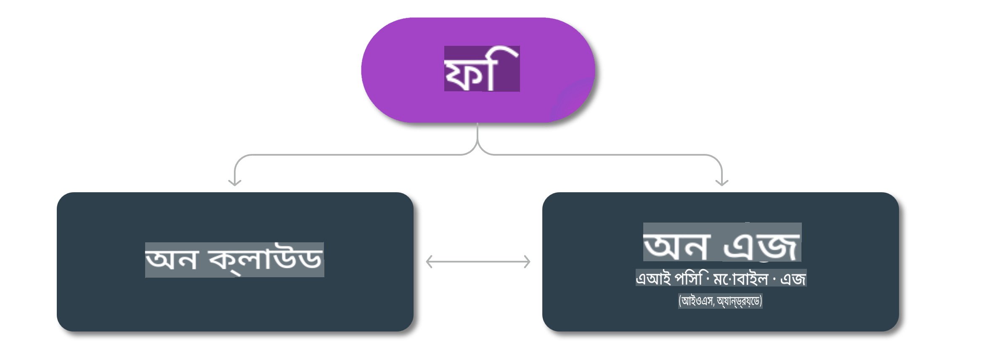

# ফাই মডেল এবং বিভিন্ন প্ল্যাটফর্মে প্রাপ্যতা

## এজ এবং ক্লাউড পরিস্থিতি

## মডেল প্রাপ্যতা এবং রিসোর্স

| | | | | | | | | |
|-|-|-|-|-|-|-|-|-|
|মডেল|ইনপুট|কনটেন্ট দৈর্ঘ্য|Azure AI (MaaS)|Azure ML (MaaP)|ONNX|Hugging Face|Ollama|Nvidia NIM|
|Phi-3-vision-128k-instruct|টেক্সট+ইমেজ|128k|[Playground & Deployment](https://ai.azure.com/explore/models/Phi-3-vision-128k-instruct/version/2/registry/azureml)|[Playground, Deployment & Finetuning](https://ml.azure.com/registries/azureml/models/Phi-3-vision-128k-instruct/version/2)|[CUDA](https://huggingface.co/microsoft/Phi-3-vision-128k-instruct-onnx-cuda/tree/main),[CPU](https://huggingface.co/microsoft/Phi-3-vision-128k-instruct-onnx-cpu/tree/main), [DirectML](https://huggingface.co/microsoft/Phi-3-vision-128k-instruct-onnx-directml/tree/main)|[ডাউনলোড](https://huggingface.co/microsoft/Phi-3-vision-128k-instruct)|-NA-|[NIM APIs](https://build.nvidia.com/microsoft/phi-3-vision-128k-instruct)|
|Phi-3-mini-4k-instruct|টেক্সট|4k|[Playground & Deployment](https://aka.ms/phi3-mini-4k-azure-ml)|[Playground, Deployment](https://aka.ms/phi3-mini-4k-azure-ml) & Finetuning|[CUDA](https://huggingface.co/microsoft/Phi-3-mini-4k-instruct-onnx), [Web](https://huggingface.co/microsoft/Phi-3-mini-4k-instruct-onnx)|[Playground & ডাউনলোড](https://huggingface.co/chat/models/microsoft/Phi-3-mini-4k-instruct)|[GGUF](https://huggingface.co/microsoft/Phi-3-mini-4k-instruct-gguf)|[NIM APIs](https://build.nvidia.com/microsoft/phi-3-mini-4k)|
|Phi-3-mini-128k-instruct|টেক্সট|128k|[Playground & Deployment](https://ai.azure.com/explore/models/Phi-3-mini-128k-instruct/version/9/registry/azureml)|[Playground, Deployment](https://ai.azure.com/explore/models/Phi-3-mini-128k-instruct/version/9/registry/azureml) & Finetuning|[CUDA](https://huggingface.co/microsoft/Phi-3-mini-128k-instruct-onnx)|[ডাউনলোড](https://huggingface.co/microsoft/Phi-3-mini-128k-instruct-onnx)|-NA-|[NIM APIs](https://build.nvidia.com/microsoft/phi-3-mini)|
|Phi-3-small-8k-instruct|টেক্সট|8k|[Playground & Deployment](https://ml.azure.com/registries/azureml/models/Phi-3-small-8k-instruct/version/2)|[Playground, Deployment](https://ai.azure.com/explore/models/Phi-3-small-8k-instruct/version/2/registry/azureml) & Finetuning|[CUDA](https://huggingface.co/microsoft/Phi-3-small-8k-instruct-onnx-cuda)|[ডাউনলোড](https://huggingface.co/microsoft/Phi-3-small-8k-instruct-onnx-cuda)|-NA-|[NIM APIs](https://build.nvidia.com/microsoft/phi-3-small-8k-instruct?docker=false)|
|Phi-3-small-128k-instruct|টেক্সট|128k|[Playground & Deployment](https://ai.azure.com/explore/models/Phi-3-small-128k-instruct/version/2/registry/azureml)|[Playground, Deployment](https://ml.azure.com/registries/azureml/models/Phi-3-small-128k-instruct/version/2) & Finetuning|[CUDA](https://huggingface.co/microsoft/Phi-3-medium-128k-instruct-onnx-cuda)|[ডাউনলোড](https://huggingface.co/microsoft/Phi-3-small-128k-instruct)|-NA-|[NIM APIs](https://build.nvidia.com/microsoft/phi-3-small-128k-instruct?docker=false)|
|Phi-3-medium-4k-instruct|লেখা|4k|[Playground & Deployment](https://huggingface.co/microsoft/Phi-3-medium-4k-instruct)|[Playground, Deployment](https://ml.azure.com/registries/azureml/models/Phi-3-medium-4k-instruct/version/2) এবং Finetuning|[CUDA](https://huggingface.co/microsoft/Phi-3-medium-4k-instruct-onnx-cuda/tree/main), [CPU](https://huggingface.co/microsoft/Phi-3-medium-4k-instruct-onnx-cpu/tree/main), [DirectML](https://huggingface.co/microsoft/Phi-3-medium-4k-instruct-onnx-directml/tree/main)|[ডাউনলোড](https://huggingface.co/microsoft/Phi-3-medium-4k-instruct)|-NA-|[NIM APIs](https://build.nvidia.com/microsoft/phi-3-medium-4k-instruct?docker=false)|
|Phi-3-medium-128k-instruct|লেখা|128k|[Playground & Deployment](https://ai.azure.com/explore/models/Phi-3-medium-128k-instruct/version/2)|[Playground, Deployment](https://ml.azure.com/registries/azureml/models/Phi-3-medium-128k-instruct/version/2) এবং Finetuning|[CUDA](https://huggingface.co/microsoft/Phi-3-medium-128k-instruct-onnx-cuda/tree/main), [CPU](https://huggingface.co/microsoft/Phi-3-medium-128k-instruct-onnx-cpu/tree/main), [DirectML](https://huggingface.co/microsoft/Phi-3-medium-128k-instruct-onnx-directml/tree/main)|[ডাউনলোড](https://huggingface.co/microsoft/Phi-3-medium-128k-instruct)|-NA-|-NA-|

**অস্বীকৃতি**:  
এই নথিটি মেশিন-ভিত্তিক এআই অনুবাদ পরিষেবার মাধ্যমে অনুবাদ করা হয়েছে। আমরা যথাসাধ্য সঠিকতা নিশ্চিত করার চেষ্টা করি, তবে অনুগ্রহ করে মনে রাখবেন যে স্বয়ংক্রিয় অনুবাদে ত্রুটি বা অসঙ্গতি থাকতে পারে। এর মূল ভাষায় থাকা নথিটিকেই প্রামাণিক উৎস হিসেবে বিবেচনা করা উচিত। গুরুত্বপূর্ণ তথ্যের ক্ষেত্রে পেশাদার মানব অনুবাদের পরামর্শ দেওয়া হয়। এই অনুবাদ ব্যবহার থেকে উদ্ভূত কোনো ভুল বোঝাবুঝি বা ভুল ব্যাখ্যার জন্য আমরা দায়ী নই।