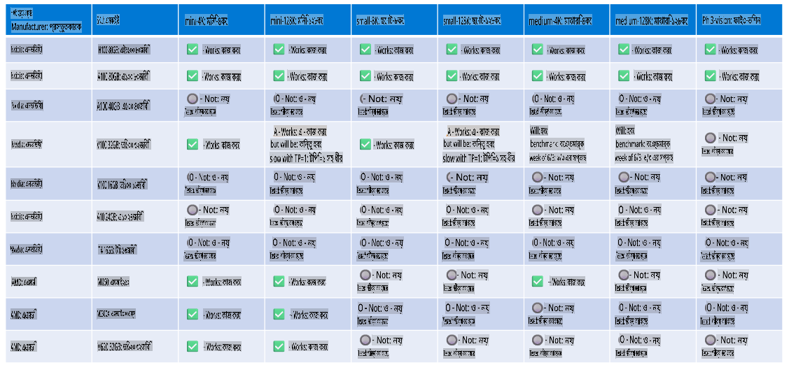

# ফাই হার্ডওয়্যার সাপোর্ট

Microsoft Phi-কে ONNX Runtime-এর জন্য অপ্টিমাইজ করা হয়েছে এবং এটি Windows DirectML সাপোর্ট করে। এটি বিভিন্ন ধরনের হার্ডওয়্যারে ভালোভাবে কাজ করে, যেমন GPU, CPU এবং এমনকি মোবাইল ডিভাইসেও।

## ডিভাইস হার্ডওয়্যার
বিশেষত, নিম্নলিখিত হার্ডওয়্যার সাপোর্ট করে:

- GPU SKU: RTX 4090 (DirectML)
- GPU SKU: 1 A100 80GB (CUDA)
- CPU SKU: Standard F64s v2 (64 vCPUs, 128 GiB মেমোরি)

## মোবাইল SKU

- অ্যান্ড্রয়েড - Samsung Galaxy S21
- অ্যাপল iPhone 14 বা তার উপরের A16/A17 প্রসেসর

## ফাই হার্ডওয়্যার স্পেসিফিকেশন

- ন্যূনতম কনফিগারেশন প্রয়োজন।
- Windows: DirectX 12 সমর্থনকারী GPU এবং ন্যূনতম 4GB সম্মিলিত RAM

CUDA: NVIDIA GPU যার Compute Capability >= 7.02



## একাধিক GPU-তে onnxruntime চালানো

বর্তমানে উপলব্ধ Phi ONNX মডেলগুলো শুধুমাত্র ১টি GPU-এর জন্য। Phi মডেলের জন্য মাল্টি-GPU সাপোর্ট সম্ভব, তবে ORT-কে ২টি GPU-তে চালালে এটি ২টি ORT ইনস্ট্যান্সের তুলনায় বেশি থ্রুপুট দেবে, এমন গ্যারান্টি নেই। সর্বশেষ আপডেটের জন্য [ONNX Runtime](https://onnxruntime.ai/) দেখুন।

[Build 2024 the GenAI ONNX Team](https://youtu.be/WLW4SE8M9i8?si=EtG04UwDvcjunyfC)-এ ঘোষণা করেছে যে তারা Phi মডেলগুলোর জন্য মাল্টি-গিপিইউ এর পরিবর্তে মাল্টি-ইনস্ট্যান্স সক্রিয় করেছে।

বর্তমানে এটি আপনাকে নিম্নলিখিতভাবে CUDA_VISIBLE_DEVICES পরিবেশ ভেরিয়েবলের মাধ্যমে একটি onnxruntime বা onnxruntime-genai ইনস্ট্যান্স চালানোর সুযোগ দেয়।

```Python
CUDA_VISIBLE_DEVICES=0 python infer.py
CUDA_VISIBLE_DEVICES=1 python infer.py
```

[Azure AI Foundry](https://ai.azure.com)-এ আরও ফাই অন্বেষণ করতে পারেন।

**অস্বীকৃতি**:  
এই নথিটি মেশিন-ভিত্তিক এআই অনুবাদ পরিষেবা ব্যবহার করে অনুবাদ করা হয়েছে। আমরা যথাসম্ভব সঠিক অনুবাদের চেষ্টা করি, তবে দয়া করে মনে রাখবেন যে স্বয়ংক্রিয় অনুবাদে ত্রুটি বা অসঙ্গতি থাকতে পারে। এর মূল ভাষায় থাকা নথিটিকে প্রামাণিক উৎস হিসাবে বিবেচনা করা উচিত। গুরুত্বপূর্ণ তথ্যের জন্য, পেশাদার মানব অনুবাদ ব্যবহার করার পরামর্শ দেওয়া হয়। এই অনুবাদ ব্যবহারের ফলে কোনো ভুল বোঝাবুঝি বা ভুল ব্যাখ্যার জন্য আমরা দায়ী নই।