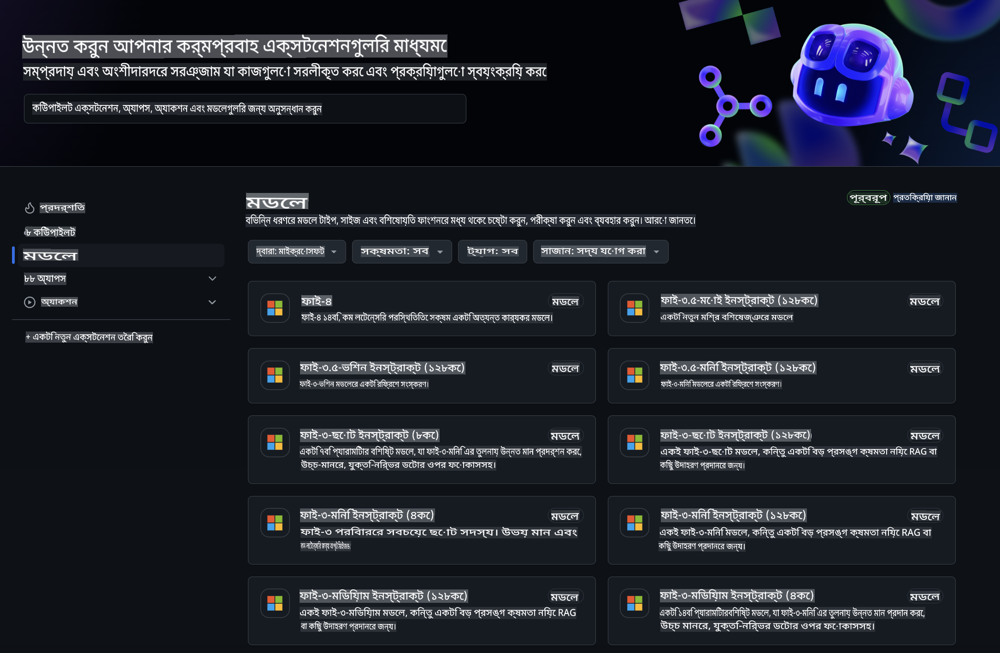
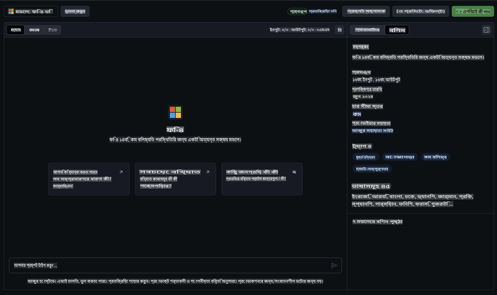
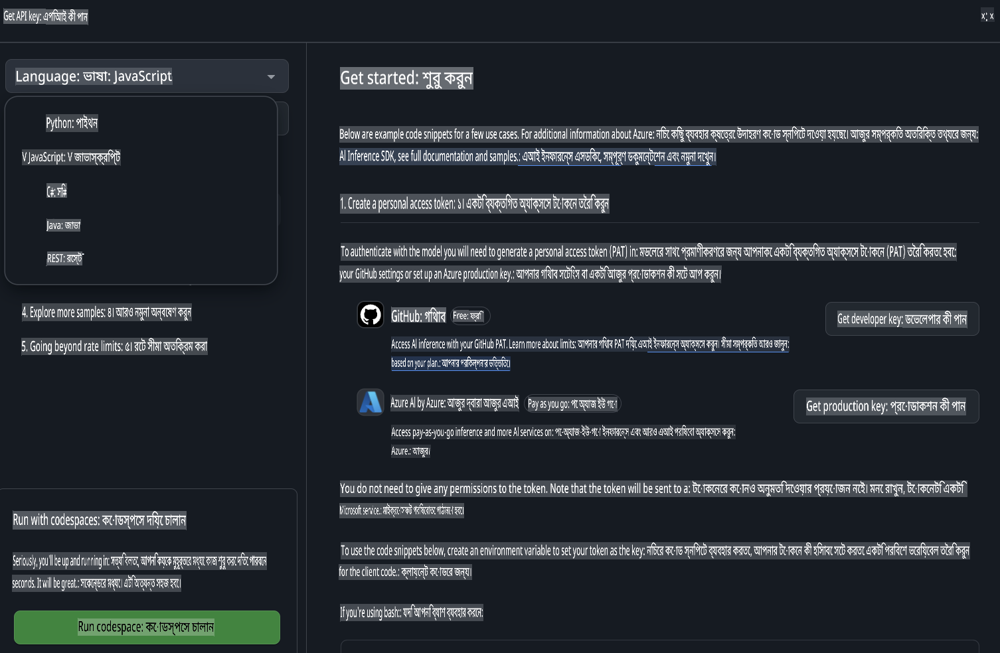
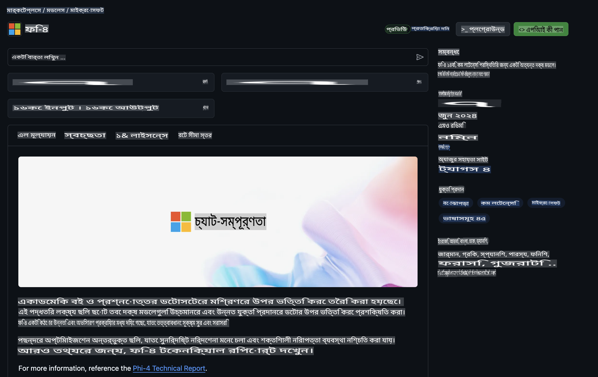

## গিটহাব মডেলগুলিতে ফাই পরিবার

[গিটহাব মডেলস](https://github.com/marketplace/models) এ স্বাগতম! আমরা সবকিছু প্রস্তুত করে রেখেছি, যাতে আপনি Azure AI-তে হোস্ট করা AI মডেলগুলো অন্বেষণ করতে পারেন।



গিটহাব মডেলস-এ উপলব্ধ মডেলগুলির সম্পর্কে আরও জানতে, [গিটহাব মডেল মার্কেটপ্লেস](https://github.com/marketplace/models) দেখুন।

## উপলব্ধ মডেল

প্রতিটি মডেলের জন্য একটি নির্দিষ্ট প্লেগ্রাউন্ড এবং নমুনা কোড রয়েছে।



### গিটহাব মডেল ক্যাটালগে ফাই পরিবার

- [Phi-4](https://github.com/marketplace/models/azureml/Phi-4)

- [Phi-3.5-MoE instruct (128k)](https://github.com/marketplace/models/azureml/Phi-3-5-MoE-instruct)

- [Phi-3.5-vision instruct (128k)](https://github.com/marketplace/models/azureml/Phi-3-5-vision-instruct)

- [Phi-3.5-mini instruct (128k)](https://github.com/marketplace/models/azureml/Phi-3-5-mini-instruct)

- [Phi-3-Medium-128k-Instruct](https://github.com/marketplace/models/azureml/Phi-3-medium-128k-instruct)

- [Phi-3-medium-4k-instruct](https://github.com/marketplace/models/azureml/Phi-3-medium-4k-instruct)

- [Phi-3-mini-128k-instruct](https://github.com/marketplace/models/azureml/Phi-3-mini-128k-instruct)

- [Phi-3-mini-4k-instruct](https://github.com/marketplace/models/azureml/Phi-3-mini-4k-instruct)

- [Phi-3-small-128k-instruct](https://github.com/marketplace/models/azureml/Phi-3-small-128k-instruct)

- [Phi-3-small-8k-instruct](https://github.com/marketplace/models/azureml/Phi-3-small-8k-instruct)

## শুরু করা

কিছু মৌলিক উদাহরণ প্রস্তুত রয়েছে যা আপনি চালাতে পারেন। সেগুলো নমুনা ডিরেক্টরিতে পাবেন। যদি আপনি সরাসরি আপনার প্রিয় প্রোগ্রামিং ভাষায় যেতে চান, তবে নিম্নলিখিত ভাষাগুলিতে উদাহরণগুলি খুঁজে পেতে পারেন:

- পাইথন  
- জাভাস্ক্রিপ্ট  
- সি#  
- জাভা  
- cURL  

নমুনা এবং মডেল চালানোর জন্য একটি নির্দিষ্ট কোডস্পেস এনভায়রনমেন্টও রয়েছে।  



## নমুনা কোড

নিচে কয়েকটি ব্যবহারক্ষেত্রের জন্য উদাহরণ কোড স্নিপেট দেওয়া হয়েছে। Azure AI Inference SDK সম্পর্কে আরও তথ্যের জন্য সম্পূর্ণ ডকুমেন্টেশন এবং নমুনাগুলি দেখুন।

## সেটআপ

1. একটি ব্যক্তিগত অ্যাক্সেস টোকেন তৈরি করুন  
টোকেনের জন্য কোনো অনুমতি দেওয়ার প্রয়োজন নেই। মনে রাখবেন, টোকেনটি একটি মাইক্রোসফট পরিষেবাতে পাঠানো হবে।

নিচের কোড স্নিপেটগুলি ব্যবহার করতে, আপনার টোকেনটি ক্লায়েন্ট কোডের জন্য কী হিসেবে সেট করতে একটি এনভায়রনমেন্ট ভেরিয়েবল তৈরি করুন।

যদি আপনি bash ব্যবহার করেন:  
```
export GITHUB_TOKEN="<your-github-token-goes-here>"
```  
যদি আপনি powershell-এ থাকেন:  

```
$Env:GITHUB_TOKEN="<your-github-token-goes-here>"
```  

যদি আপনি Windows command prompt ব্যবহার করেন:  

```
set GITHUB_TOKEN=<your-github-token-goes-here>
```  

## পাইথন নমুনা

### নির্ভরতাগুলি ইনস্টল করুন  
পাইপ ব্যবহার করে Azure AI Inference SDK ইনস্টল করুন (প্রয়োজন: Python >=3.8):  

```
pip install azure-ai-inference
```  

### একটি মৌলিক কোড নমুনা চালান  

এই নমুনাটি chat completion API-তে একটি মৌলিক কল প্রদর্শন করে। এটি GitHub AI মডেল ইনফারেন্স এন্ডপয়েন্ট এবং আপনার গিটহাব টোকেন ব্যবহার করছে। কলটি সিঙ্ক্রোনাস।  

```python
import os
from azure.ai.inference import ChatCompletionsClient
from azure.ai.inference.models import SystemMessage, UserMessage
from azure.core.credentials import AzureKeyCredential

endpoint = "https://models.inference.ai.azure.com"
model_name = "Phi-4"
token = os.environ["GITHUB_TOKEN"]

client = ChatCompletionsClient(
    endpoint=endpoint,
    credential=AzureKeyCredential(token),
)

response = client.complete(
    messages=[
        UserMessage(content="I have $20,000 in my savings account, where I receive a 4% profit per year and payments twice a year. Can you please tell me how long it will take for me to become a millionaire? Also, can you please explain the math step by step as if you were explaining it to an uneducated person?"),
    ],
    temperature=0.4,
    top_p=1.0,
    max_tokens=2048,
    model=model_name
)

print(response.choices[0].message.content)
```  

### একটি বহু-পর্বের কথোপকথন চালান  

এই নমুনাটি chat completion API-র মাধ্যমে একটি বহু-পর্বের কথোপকথন প্রদর্শন করে। একটি চ্যাট অ্যাপ্লিকেশনের জন্য মডেল ব্যবহার করার সময়, আপনাকে কথোপকথনের ইতিহাস পরিচালনা করতে হবে এবং সর্বশেষ বার্তাগুলি মডেলে পাঠাতে হবে।  

```
import os
from azure.ai.inference import ChatCompletionsClient
from azure.ai.inference.models import AssistantMessage, SystemMessage, UserMessage
from azure.core.credentials import AzureKeyCredential

token = os.environ["GITHUB_TOKEN"]
endpoint = "https://models.inference.ai.azure.com"
# Replace Model_Name
model_name = "Phi-4"

client = ChatCompletionsClient(
    endpoint=endpoint,
    credential=AzureKeyCredential(token),
)

messages = [
    SystemMessage(content="You are a helpful assistant."),
    UserMessage(content="What is the capital of France?"),
    AssistantMessage(content="The capital of France is Paris."),
    UserMessage(content="What about Spain?"),
]

response = client.complete(messages=messages, model=model_name)

print(response.choices[0].message.content)
```  

### আউটপুট স্ট্রিম করুন  

ভাল ব্যবহারকারীর অভিজ্ঞতার জন্য, আপনি মডেলের প্রতিক্রিয়া স্ট্রিম করতে চাইবেন যাতে প্রথম টোকেনটি তাড়াতাড়ি দেখা যায় এবং দীর্ঘ প্রতিক্রিয়ার জন্য অপেক্ষা না করতে হয়।  

```
import os
from azure.ai.inference import ChatCompletionsClient
from azure.ai.inference.models import SystemMessage, UserMessage
from azure.core.credentials import AzureKeyCredential

token = os.environ["GITHUB_TOKEN"]
endpoint = "https://models.inference.ai.azure.com"
# Replace Model_Name
model_name = "Phi-4"

client = ChatCompletionsClient(
    endpoint=endpoint,
    credential=AzureKeyCredential(token),
)

response = client.complete(
    stream=True,
    messages=[
        SystemMessage(content="You are a helpful assistant."),
        UserMessage(content="Give me 5 good reasons why I should exercise every day."),
    ],
    model=model_name,
)

for update in response:
    if update.choices:
        print(update.choices[0].delta.content or "", end="")

client.close()
```  

## গিটহাব মডেলের জন্য ফ্রি ব্যবহার এবং রেট সীমা  

  

[প্লেগ্রাউন্ড এবং ফ্রি API ব্যবহারের রেট সীমা](https://docs.github.com/en/github-models/prototyping-with-ai-models#rate-limits) মডেলগুলির সাথে পরীক্ষা এবং আপনার AI অ্যাপ্লিকেশন প্রোটোটাইপ করার জন্য ডিজাইন করা হয়েছে। এই সীমার বাইরে ব্যবহার এবং আপনার অ্যাপ্লিকেশন স্কেল করতে, আপনাকে একটি Azure অ্যাকাউন্ট থেকে রিসোর্স প্রভিশন করতে হবে এবং সেখান থেকে প্রমাণীকরণ করতে হবে, আপনার গিটহাব ব্যক্তিগত অ্যাক্সেস টোকেনের পরিবর্তে। আপনার কোডে অন্য কিছু পরিবর্তন করার প্রয়োজন নেই। Azure AI-তে ফ্রি টিয়ার সীমার বাইরে যাওয়ার উপায় জানতে এই লিঙ্কটি ব্যবহার করুন।  

### প্রকাশনা

মডেলের সাথে ইন্টারঅ্যাক্ট করার সময় মনে রাখবেন আপনি AI-এর সাথে পরীক্ষা করছেন, তাই কন্টেন্টে ভুল হতে পারে।  

এই ফিচারটি বিভিন্ন সীমার (যেমন প্রতি মিনিটে অনুরোধ, প্রতিদিনের অনুরোধ, প্রতি অনুরোধে টোকেন এবং সমসাময়িক অনুরোধ) অধীন এবং প্রোডাকশন ব্যবহারের জন্য ডিজাইন করা নয়।  

গিটহাব মডেল Azure AI কন্টেন্ট সেফটি ব্যবহার করে। গিটহাব মডেলস অভিজ্ঞতার অংশ হিসেবে এই ফিল্টারগুলো বন্ধ করা যাবে না। আপনি যদি একটি পেইড সার্ভিসের মাধ্যমে মডেল ব্যবহার করার সিদ্ধান্ত নেন, দয়া করে আপনার কন্টেন্ট ফিল্টারগুলি আপনার প্রয়োজনীয়তা অনুযায়ী কনফিগার করুন।  

এই পরিষেবাটি গিটহাবের প্রি-রিলিজ শর্তাবলীর অধীনে রয়েছে।  

**অস্বীকৃতি**:  
এই নথিটি মেশিন-ভিত্তিক এআই অনুবাদ পরিষেবার মাধ্যমে অনুবাদ করা হয়েছে। আমরা যথাসম্ভব সঠিক অনুবাদের জন্য চেষ্টা করি, তবে অনুগ্রহ করে মনে রাখবেন যে স্বয়ংক্রিয় অনুবাদে ভুল বা অসংগতি থাকতে পারে। মূল ভাষায় রচিত মূল নথিটিকেই প্রামাণিক উৎস হিসেবে বিবেচনা করা উচিত। গুরুত্বপূর্ণ তথ্যের জন্য পেশাদার মানব অনুবাদ সুপারিশ করা হয়। এই অনুবাদ ব্যবহারের ফলে সৃষ্ট কোনো ভুল বোঝাবুঝি বা ভুল ব্যাখ্যার জন্য আমরা দায়ী থাকব না।