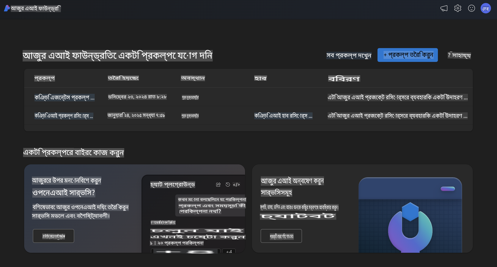
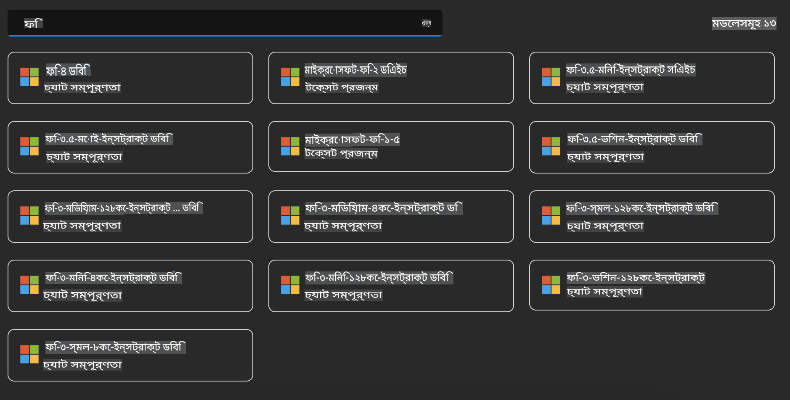
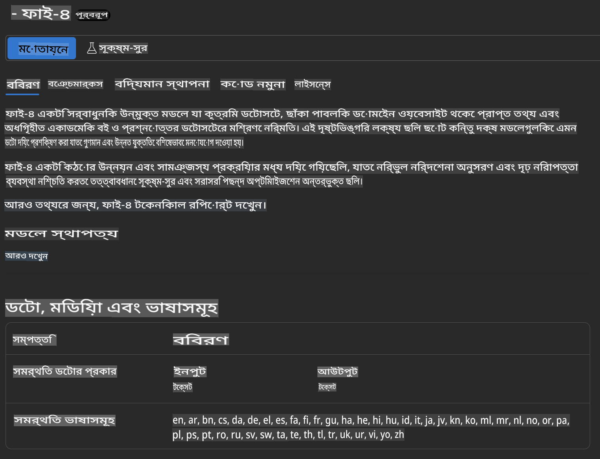
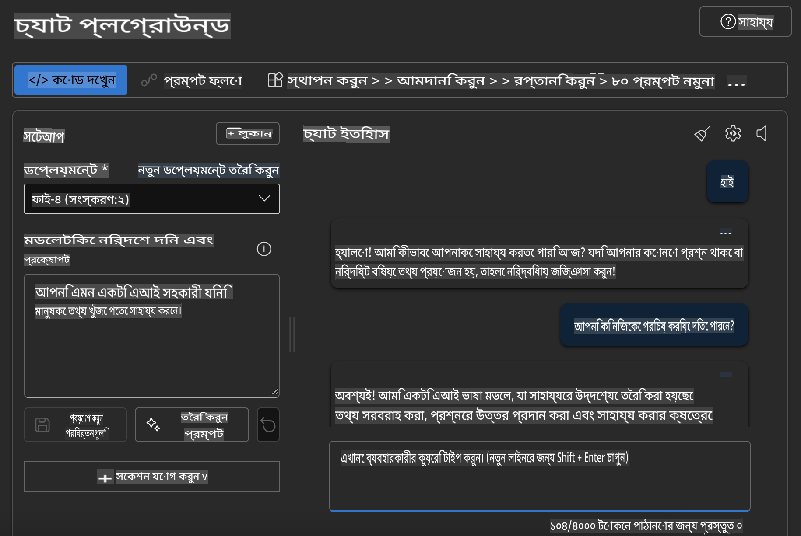

## Azure AI Foundry-তে Phi Family

[Azure AI Foundry](https://ai.azure.com) একটি নির্ভরযোগ্য প্ল্যাটফর্ম যা ডেভেলপারদের নিরাপদ, সুরক্ষিত এবং দায়িত্বশীল উপায়ে AI-এর মাধ্যমে উদ্ভাবন চালাতে এবং ভবিষ্যৎ গড়তে সক্ষম করে।  

[Azure AI Foundry](https://ai.azure.com) তৈরি করা হয়েছে ডেভেলপারদের জন্য, যাতে তারা:

- এন্টারপ্রাইজ-গ্রেড প্ল্যাটফর্মে জেনারেটিভ AI অ্যাপ্লিকেশন তৈরি করতে পারে।  
- অত্যাধুনিক AI টুল এবং ML মডেল ব্যবহার করে অনুসন্ধান, তৈরি, পরীক্ষা এবং স্থাপন করতে পারে, যা দায়িত্বশীল AI অনুশীলনের উপর ভিত্তি করে।  
- অ্যাপ্লিকেশন ডেভেলপমেন্টের পুরো জীবনচক্রে একটি টিমের সঙ্গে সহযোগিতা করতে পারে।  

Azure AI Foundry-র মাধ্যমে, আপনি বিভিন্ন মডেল, পরিষেবা এবং সক্ষমতা অন্বেষণ করতে পারবেন এবং আপনার লক্ষ্যের জন্য সেরা AI অ্যাপ্লিকেশন তৈরি করতে পারবেন। Azure AI Foundry প্ল্যাটফর্ম প্রুফ অফ কনসেপ্ট থেকে সম্পূর্ণ উৎপাদন অ্যাপ্লিকেশনে রূপান্তরের জন্য সহজে স্কেল করার সুবিধা দেয়। দীর্ঘমেয়াদী সফলতার জন্য ধারাবাহিক পর্যবেক্ষণ এবং পরিমার্জনের সুবিধাও রয়েছে।  



Azure AI Foundry-তে Azure AOAI Service ব্যবহারের পাশাপাশি, আপনি Azure AI Foundry Model Catalog-এ তৃতীয় পক্ষের মডেলও ব্যবহার করতে পারেন। যদি আপনি Azure AI Foundry-কে আপনার AI সমাধান প্ল্যাটফর্ম হিসেবে ব্যবহার করতে চান, তবে এটি একটি ভালো বিকল্প।  

আমরা Azure AI Foundry-র Model Catalog-এর মাধ্যমে দ্রুত Phi Family Models স্থাপন করতে পারি।  



### **Azure AI Foundry-তে Phi-4 স্থাপন করা**



### **Azure AI Foundry Playground-এ Phi-4 পরীক্ষা করা**



### **Azure AI Foundry Phi-4 কল করতে Python কোড চালানো**

```python

import os  
import base64
from openai import AzureOpenAI  
from azure.identity import DefaultAzureCredential, get_bearer_token_provider  
        
endpoint = os.getenv("ENDPOINT_URL", "Your Azure AOAI Service Endpoint")  
deployment = os.getenv("DEPLOYMENT_NAME", "Phi-4")  
      
token_provider = get_bearer_token_provider(  
    DefaultAzureCredential(),  
    "https://cognitiveservices.azure.com/.default"  
)  
  
client = AzureOpenAI(  
    azure_endpoint=endpoint,  
    azure_ad_token_provider=token_provider,  
    api_version="2024-05-01-preview",  
)  
  

chat_prompt = [
    {
        "role": "system",
        "content": "You are an AI assistant that helps people find information."
    },
    {
        "role": "user",
        "content": "can you introduce yourself"
    }
] 
    
# Include speech result if speech is enabled  
messages = chat_prompt 

completion = client.chat.completions.create(  
    model=deployment,  
    messages=messages,
    max_tokens=800,  
    temperature=0.7,  
    top_p=0.95,  
    frequency_penalty=0,  
    presence_penalty=0,
    stop=None,  
    stream=False  
)  
  
print(completion.to_json())  

```

**অস্বীকৃতি**:  
এই নথিটি মেশিন-ভিত্তিক এআই অনুবাদ পরিষেবার মাধ্যমে অনুবাদ করা হয়েছে। আমরা যথাসাধ্য নির্ভুলতার জন্য চেষ্টা করি, তবে অনুগ্রহ করে মনে রাখবেন যে স্বয়ংক্রিয় অনুবাদে ত্রুটি বা অসংগতি থাকতে পারে। নথিটির মূল ভাষায় লেখা সংস্করণটিকেই প্রামাণিক উৎস হিসাবে বিবেচনা করা উচিত। গুরুত্বপূর্ণ তথ্যের ক্ষেত্রে, পেশাদার মানব অনুবাদের সুপারিশ করা হয়। এই অনুবাদ ব্যবহার থেকে উদ্ভূত কোনো ভুল বোঝাবুঝি বা ভুল ব্যাখ্যার জন্য আমরা দায়ী নই।