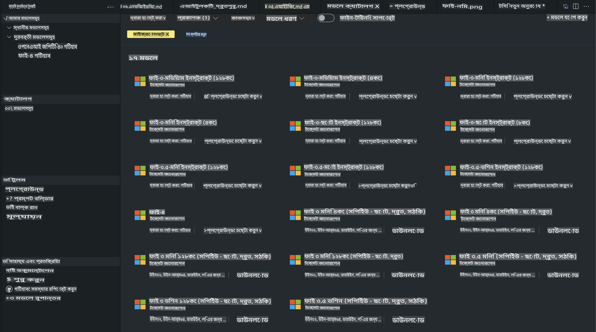
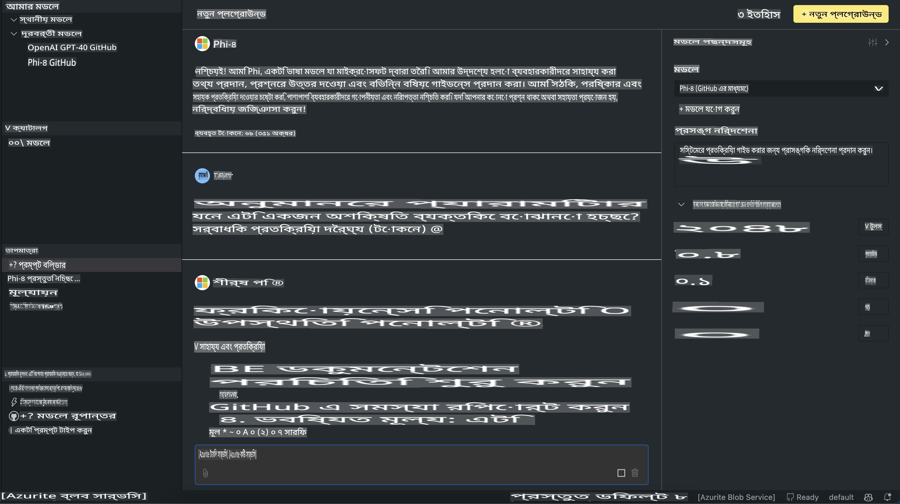

# AITK-এ Phi Family

[VS Code-এর জন্য AI Toolkit](https://marketplace.visualstudio.com/items?itemName=ms-windows-ai-studio.windows-ai-studio) জেনারেটিভ AI অ্যাপ ডেভেলপমেন্টকে সহজ করে তোলে। এটি Azure AI Foundry Catalog এবং Hugging Face-এর মতো অন্যান্য ক্যাটালগ থেকে উন্নত AI ডেভেলপমেন্ট টুল এবং মডেলগুলো একত্রিত করে। আপনি GitHub Models এবং Azure AI Foundry Model Catalog-এর মাধ্যমে চালিত AI মডেল ক্যাটালগ ব্রাউজ করতে পারবেন, মডেলগুলো লোকালি বা রিমোট ডাউনলোড করতে পারবেন, ফাইন-টিউন, টেস্ট এবং আপনার অ্যাপ্লিকেশনে ব্যবহার করতে পারবেন।

AI Toolkit প্রিভিউ লোকালি রান করবে। লোকাল ইনফারেন্স বা ফাইন-টিউন, আপনি যে মডেলটি নির্বাচন করবেন তার উপর নির্ভর করে, আপনার একটি GPU (যেমন NVIDIA CUDA GPU) প্রয়োজন হতে পারে। আপনি AITK ব্যবহার করে সরাসরি GitHub Models চালাতে পারবেন।

## শুরু করার উপায়

[Windows subsystem for Linux ইনস্টল করার বিস্তারিত জানুন](https://learn.microsoft.com/windows/wsl/install?WT.mc_id=aiml-137032-kinfeylo)

এবং [ডিফল্ট ডিস্ট্রিবিউশন পরিবর্তন করার নিয়ম](https://learn.microsoft.com/windows/wsl/install#change-the-default-linux-distribution-installed)।

[AI Toolkit GitHub রিপোজিটরি](https://github.com/microsoft/vscode-ai-toolkit/)

- Windows, Linux, macOS
  
- Windows এবং Linux-এ ফাইন-টিউন করার জন্য আপনার একটি Nvidia GPU প্রয়োজন। এর পাশাপাশি, **Windows**-এ Ubuntu ডিস্ট্রো 18.4 বা তার বেশি ভার্সন সহ Linux subsystem প্রয়োজন। [Windows subsystem for Linux ইনস্টল করার বিস্তারিত জানুন](https://learn.microsoft.com/windows/wsl/install) এবং [ডিফল্ট ডিস্ট্রিবিউশন পরিবর্তন করার নিয়ম](https://learn.microsoft.com/windows/wsl/install#change-the-default-linux-distribution-installed)।

### AI Toolkit ইনস্টল করা

AI Toolkit একটি [Visual Studio Code Extension](https://code.visualstudio.com/docs/setup/additional-components#_vs-code-extensions) হিসেবে সরবরাহ করা হয়। তাই আপনাকে প্রথমে [VS Code](https://code.visualstudio.com/docs/setup/windows?WT.mc_id=aiml-137032-kinfeylo) ইনস্টল করতে হবে এবং [VS Marketplace](https://marketplace.visualstudio.com/items?itemName=ms-windows-ai-studio.windows-ai-studio) থেকে AI Toolkit ডাউনলোড করতে হবে।  
[AI Toolkit Visual Studio Marketplace-এ উপলব্ধ](https://marketplace.visualstudio.com/items?itemName=ms-windows-ai-studio.windows-ai-studio) এবং এটি অন্য যেকোনো VS Code এক্সটেনশনের মতোই ইনস্টল করা যায়।

যদি আপনি VS Code এক্সটেনশন ইনস্টল করার নিয়ম জানেন না, তাহলে নিচের ধাপগুলো অনুসরণ করুন:

### সাইন ইন

1. VS Code-এর অ্যাক্টিভিটি বারে **Extensions** সিলেক্ট করুন।  
1. এক্সটেনশন সার্চ বারে "AI Toolkit" লিখুন।  
1. "AI Toolkit for Visual Studio Code" সিলেক্ট করুন।  
1. **Install** সিলেক্ট করুন।  

এখন আপনি এক্সটেনশনটি ব্যবহার করতে প্রস্তুত!

আপনাকে GitHub-এ সাইন ইন করার জন্য অনুরোধ করা হবে, তাই "Allow" ক্লিক করুন। এরপর আপনাকে GitHub সাইন ইন পৃষ্ঠায় নিয়ে যাওয়া হবে।

সাইন ইন করুন এবং প্রক্রিয়ার ধাপগুলো অনুসরণ করুন। সফলভাবে সম্পন্ন হলে, আপনাকে আবার VS Code-এ রিডিরেক্ট করা হবে।

একবার এক্সটেনশন ইনস্টল হয়ে গেলে, আপনি অ্যাক্টিভিটি বারে AI Toolkit আইকন দেখতে পাবেন।

এখন চলুন উপলব্ধ কার্যক্রমগুলো এক্সপ্লোর করি!

### উপলব্ধ কার্যক্রম

AI Toolkit-এর প্রাথমিক সাইডবারটি নিম্নলিখিত বিভাগে সাজানো রয়েছে:

- **Models**
- **Resources**
- **Playground**  
- **Fine-tuning**
- **Evaluation**

Resources সেকশনে এগুলো উপলব্ধ। শুরু করতে **Model Catalog** সিলেক্ট করুন।

### ক্যাটালগ থেকে একটি মডেল ডাউনলোড করা

VS Code সাইডবার থেকে AI Toolkit চালু করার পর, আপনি নিম্নলিখিত অপশনগুলো থেকে বেছে নিতে পারবেন:



- **Model Catalog** থেকে একটি সমর্থিত মডেল খুঁজে লোকালি ডাউনলোড করুন।  
- **Model Playground**-এ মডেল ইনফারেন্স টেস্ট করুন।  
- **Model Fine-tuning**-এ লোকালি বা রিমোট ফাইন-টিউন করুন।  
- AI Toolkit-এর কমান্ড প্যালেট ব্যবহার করে ক্লাউডে ফাইন-টিউন করা মডেল ডিপ্লয় করুন।  
- মডেল ইভ্যালুয়েশন করুন।  

> [!NOTE]
>
> **GPU বনাম CPU**
>
> আপনি লক্ষ্য করবেন যে মডেল কার্ডগুলো মডেলের সাইজ, প্ল্যাটফর্ম এবং অ্যাক্সিলারেটর টাইপ (CPU, GPU) দেখায়। **Windows ডিভাইস যেগুলোতে অন্তত একটি GPU আছে**, তাদের জন্য শুধুমাত্র Windows টার্গেট করে এমন মডেল ভার্সনগুলো সিলেক্ট করুন।  
>
> এটি নিশ্চিত করে যে আপনি DirectML অ্যাক্সিলারেটরের জন্য অপ্টিমাইজড একটি মডেল পাচ্ছেন।  
>
> মডেল নামগুলো এই ফরম্যাটে থাকবে:
>
> - `{model_name}-{accelerator}-{quantization}-{format}`।
>
> আপনার Windows ডিভাইসে GPU আছে কিনা তা যাচাই করতে, **Task Manager** খুলুন এবং **Performance** ট্যাব সিলেক্ট করুন। যদি GPU থাকে, তাহলে সেগুলো "GPU 0" বা "GPU 1" এর মতো নামের অধীনে তালিকাভুক্ত থাকবে।

### প্লেগ্রাউন্ডে মডেল চালানো

সব প্যারামিটার সেট করার পর, **Generate Project** ক্লিক করুন।

একবার মডেলটি ডাউনলোড হয়ে গেলে, ক্যাটালগের মডেল কার্ডে **Load in Playground** সিলেক্ট করুন:

- মডেল ডাউনলোড শুরু করুন।  
- সব প্রয়োজনীয় প্রাক-প্রশিক্ষণ এবং নির্ভরশীলতা ইনস্টল করুন।  
- একটি VS Code ওয়ার্কস্পেস তৈরি করুন।  



### আপনার অ্যাপ্লিকেশনে REST API ব্যবহার করা

AI Toolkit একটি লোকাল REST API ওয়েব সার্ভার **পোর্ট 5272**-এ সরবরাহ করে যা [OpenAI চ্যাট কমপ্লিশন ফরম্যাট](https://platform.openai.com/docs/api-reference/chat/create) ব্যবহার করে।

এটি আপনাকে ক্লাউড AI মডেল পরিষেবার উপর নির্ভর না করেই আপনার অ্যাপ্লিকেশন লোকালি টেস্ট করার সুযোগ দেয়। উদাহরণস্বরূপ, নিম্নলিখিত JSON ফাইলটি অনুরোধের বডি কনফিগার করার উপায় দেখায়:

```json
{
    "model": "Phi-4",
    "messages": [
        {
            "role": "user",
            "content": "what is the golden ratio?"
        }
    ],
    "temperature": 0.7,
    "top_p": 1,
    "top_k": 10,
    "max_tokens": 100,
    "stream": true
}
```

আপনি (উদাহরণস্বরূপ) [Postman](https://www.postman.com/) বা CURL (Client URL) ইউটিলিটি ব্যবহার করে REST API টেস্ট করতে পারেন:

```bash
curl -vX POST http://127.0.0.1:5272/v1/chat/completions -H 'Content-Type: application/json' -d @body.json
```

### Python-এর জন্য OpenAI ক্লায়েন্ট লাইব্রেরি ব্যবহার করা

```python
from openai import OpenAI

client = OpenAI(
    base_url="http://127.0.0.1:5272/v1/", 
    api_key="x" # required for the API but not used
)

chat_completion = client.chat.completions.create(
    messages=[
        {
            "role": "user",
            "content": "what is the golden ratio?",
        }
    ],
    model="Phi-4",
)

print(chat_completion.choices[0].message.content)
```

### .NET-এর জন্য Azure OpenAI ক্লায়েন্ট লাইব্রেরি ব্যবহার করা

NuGet ব্যবহার করে আপনার প্রজেক্টে [Azure OpenAI ক্লায়েন্ট লাইব্রেরি for .NET](https://www.nuget.org/packages/Azure.AI.OpenAI/) যোগ করুন:

```bash
dotnet add {project_name} package Azure.AI.OpenAI --version 1.0.0-beta.17
```

আপনার প্রজেক্টে **OverridePolicy.cs** নামে একটি C# ফাইল যোগ করুন এবং নিম্নলিখিত কোড পেস্ট করুন:

```csharp
// OverridePolicy.cs
using Azure.Core.Pipeline;
using Azure.Core;

internal partial class OverrideRequestUriPolicy(Uri overrideUri)
    : HttpPipelineSynchronousPolicy
{
    private readonly Uri _overrideUri = overrideUri;

    public override void OnSendingRequest(HttpMessage message)
    {
        message.Request.Uri.Reset(_overrideUri);
    }
}
```

পরবর্তী ধাপে, আপনার **Program.cs** ফাইলে নিম্নলিখিত কোড পেস্ট করুন:

```csharp
// Program.cs
using Azure.AI.OpenAI;

Uri localhostUri = new("http://localhost:5272/v1/chat/completions");

OpenAIClientOptions clientOptions = new();
clientOptions.AddPolicy(
    new OverrideRequestUriPolicy(localhostUri),
    Azure.Core.HttpPipelinePosition.BeforeTransport);
OpenAIClient client = new(openAIApiKey: "unused", clientOptions);

ChatCompletionsOptions options = new()
{
    DeploymentName = "Phi-4",
    Messages =
    {
        new ChatRequestSystemMessage("You are a helpful assistant. Be brief and succinct."),
        new ChatRequestUserMessage("What is the golden ratio?"),
    }
};

StreamingResponse<StreamingChatCompletionsUpdate> streamingChatResponse
    = await client.GetChatCompletionsStreamingAsync(options);

await foreach (StreamingChatCompletionsUpdate chatChunk in streamingChatResponse)
{
    Console.Write(chatChunk.ContentUpdate);
}
```

## AI Toolkit দিয়ে ফাইন-টিউনিং

- মডেল ডিসকভারি এবং প্লেগ্রাউন্ড দিয়ে শুরু করুন।  
- লোকাল কম্পিউটিং রিসোর্স ব্যবহার করে মডেল ফাইন-টিউন এবং ইনফারেন্স।  
- Azure রিসোর্স ব্যবহার করে রিমোট ফাইন-টিউন এবং ইনফারেন্স।  

[AI Toolkit দিয়ে ফাইন-টিউনিং](../../03.FineTuning/Finetuning_VSCodeaitoolkit.md)

## AI Toolkit Q&A রিসোর্স

সবচেয়ে সাধারণ সমস্যা এবং সমাধানের জন্য আমাদের [Q&A পৃষ্ঠা](https://github.com/microsoft/vscode-ai-toolkit/blob/main/archive/QA.md) দেখুন।  

**অস্বীকৃতি**:  
এই নথিটি মেশিন-ভিত্তিক এআই অনুবাদ পরিষেবার মাধ্যমে অনুবাদ করা হয়েছে। আমরা যথাসাধ্য নির্ভুলতা বজায় রাখার চেষ্টা করি, তবে অনুগ্রহ করে মনে রাখবেন যে স্বয়ংক্রিয় অনুবাদে ভুল বা অসঙ্গতি থাকতে পারে। এর মূল ভাষায় থাকা আসল নথিকেই প্রামাণিক উৎস হিসেবে বিবেচনা করা উচিত। গুরুত্বপূর্ণ তথ্যের জন্য, পেশাদার মানব অনুবাদের পরামর্শ দেওয়া হয়। এই অনুবাদ ব্যবহারের ফলে সৃষ্ট কোনো ভুল বোঝাবুঝি বা ভুল ব্যাখ্যার জন্য আমরা দায়ী থাকব না।