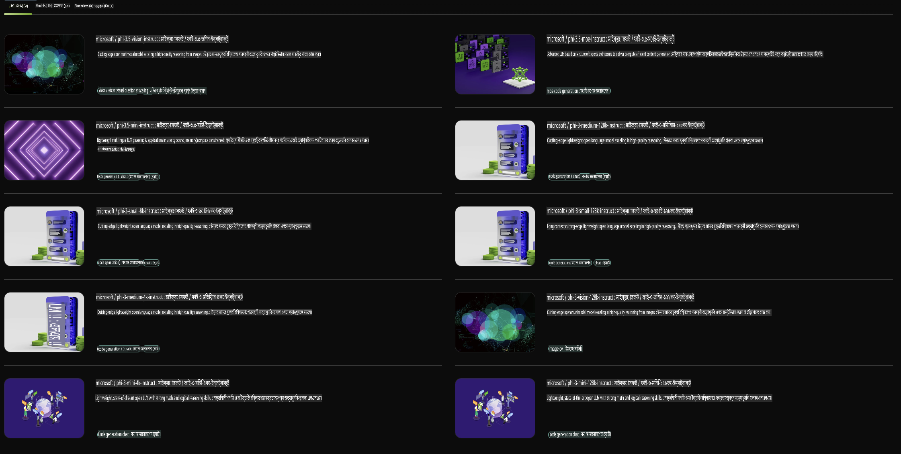

## NVIDIA NIM-এ Phi পরিবার

NVIDIA NIM হলো সহজে ব্যবহারযোগ্য মাইক্রোসার্ভিসের একটি সেট, যা জেনারেটিভ এআই মডেলগুলোর ক্লাউড, ডেটা সেন্টার এবং ওয়ার্কস্টেশনের মধ্যে ডিপ্লয়মেন্টকে দ্রুততর করে। NIM মডেল পরিবারের ভিত্তিতে এবং প্রতিটি মডেলের জন্য আলাদাভাবে শ্রেণীবদ্ধ। উদাহরণস্বরূপ, বড় ভাষা মডেলগুলোর (LLMs) জন্য NVIDIA NIM এন্টারপ্রাইজ অ্যাপ্লিকেশনগুলোর জন্য সর্বাধুনিক LLM-এর শক্তি নিয়ে আসে, যা অতুলনীয় প্রাকৃতিক ভাষা প্রক্রিয়াকরণ এবং বোঝার ক্ষমতা প্রদান করে।

NIM আইটি এবং ডেভঅপস টিমগুলোর জন্য তাদের নিজস্ব পরিচালিত পরিবেশে বড় ভাষা মডেল (LLMs) স্ব-হোস্ট করা সহজ করে তোলে, একইসঙ্গে ডেভেলপারদের জন্য ইন্ডাস্ট্রি স্ট্যান্ডার্ড API সরবরাহ করে, যা শক্তিশালী কো-পাইলট, চ্যাটবট এবং এআই অ্যাসিস্ট্যান্ট তৈরি করতে সহায়তা করে, যা তাদের ব্যবসাকে রূপান্তর করতে পারে। NVIDIA-এর অত্যাধুনিক GPU অ্যাক্সিলারেশন এবং স্কেলযোগ্য ডিপ্লয়মেন্ট ব্যবহার করে, NIM অতুলনীয় পারফরম্যান্সের সাথে ইনফারেন্সের দ্রুততম পথ সরবরাহ করে।

আপনি Phi পরিবার মডেলগুলোর ইনফারেন্সের জন্য NVIDIA NIM ব্যবহার করতে পারেন।



### **নমুনা - NVIDIA NIM-এ Phi-3-Vision**

ধরুন আপনার কাছে একটি ছবি (`demo.png`) আছে এবং আপনি এমন একটি পাইথন কোড তৈরি করতে চান যা এই ছবিটি প্রক্রিয়াকরণ করে এবং তার একটি নতুন সংস্করণ সংরক্ষণ করে (`phi-3-vision.jpg`)।

উপরের কোডটি এই প্রক্রিয়াটি স্বয়ংক্রিয়ভাবে সম্পন্ন করে:

1. পরিবেশ এবং প্রয়োজনীয় কনফিগারেশন সেটআপ করা।
2. এমন একটি প্রম্পট তৈরি করা যা মডেলকে প্রয়োজনীয় পাইথন কোড জেনারেট করার নির্দেশ দেয়।
3. প্রম্পটটি মডেলে পাঠানো এবং জেনারেট করা কোড সংগ্রহ করা।
4. জেনারেট করা কোডটি বের করা এবং চালানো।
5. মূল এবং প্রক্রিয়াকৃত ছবিগুলো প্রদর্শন করা।

এই পদ্ধতিটি এআই-এর শক্তি ব্যবহার করে ছবির প্রক্রিয়াকরণ কাজগুলো স্বয়ংক্রিয় করে, যা আপনার লক্ষ্য অর্জনকে সহজ ও দ্রুততর করে তোলে।

[নমুনা কোড সমাধান](../../../../../code/06.E2E/E2E_Nvidia_NIM_Phi3_Vision.ipynb)

এখন পুরো কোডটি ধাপে ধাপে ব্যাখ্যা করা যাক:

1. **প্রয়োজনীয় প্যাকেজ ইনস্টল করুন**:
    ```python
    !pip install langchain_nvidia_ai_endpoints -U
    ```
    এই কমান্ডটি `langchain_nvidia_ai_endpoints` প্যাকেজটি ইনস্টল করে এবং নিশ্চিত করে যে এটি সর্বশেষ সংস্করণ।

2. **প্রয়োজনীয় মডিউল আমদানি করুন**:
    ```python
    from langchain_nvidia_ai_endpoints import ChatNVIDIA
    import getpass
    import os
    import base64
    ```
    এই আমদানিগুলো NVIDIA AI এন্ডপয়েন্টগুলোর সাথে ইন্টারঅ্যাক্ট করা, পাসওয়ার্ড সুরক্ষিতভাবে হ্যান্ডেল করা, অপারেটিং সিস্টেমের সাথে ইন্টারঅ্যাক্ট করা এবং বেস64 ফরম্যাটে ডেটা এনকোড/ডিকোড করার জন্য প্রয়োজনীয় মডিউলগুলো নিয়ে আসে।

3. **এপিআই কী সেট আপ করুন**:
    ```python
    if not os.getenv("NVIDIA_API_KEY"):
        os.environ["NVIDIA_API_KEY"] = getpass.getpass("Enter your NVIDIA API key: ")
    ```
    এই কোডটি পরীক্ষা করে যে `NVIDIA_API_KEY` পরিবেশ ভেরিয়েবলটি সেট করা হয়েছে কিনা। যদি না হয়, এটি ব্যবহারকারীকে তাদের এপিআই কী সুরক্ষিতভাবে প্রবেশ করাতে বলে।

4. **মডেল এবং ইমেজ পাথ নির্ধারণ করুন**:
    ```python
    model = 'microsoft/phi-3-vision-128k-instruct'
    chat = ChatNVIDIA(model=model)
    img_path = './imgs/demo.png'
    ```
    এটি ব্যবহৃত মডেল নির্ধারণ করে, নির্দিষ্ট মডেলের সাথে `ChatNVIDIA`-এর একটি ইনস্ট্যান্স তৈরি করে এবং ইমেজ ফাইলের পথ নির্ধারণ করে।

5. **টেক্সট প্রম্পট তৈরি করুন**:
    ```python
    text = "Please create Python code for image, and use plt to save the new picture under imgs/ and name it phi-3-vision.jpg."
    ```
    এটি একটি টেক্সট প্রম্পট সংজ্ঞায়িত করে, যা মডেলকে একটি ছবি প্রক্রিয়াকরণের জন্য পাইথন কোড তৈরি করতে নির্দেশ দেয়।

6. **ইমেজ বেস64-এ এনকোড করুন**:
    ```python
    with open(img_path, "rb") as f:
        image_b64 = base64.b64encode(f.read()).decode()
    image = f''
    ```
    এই কোডটি ইমেজ ফাইলটি পড়ে, এটিকে বেস64-এ এনকোড করে এবং এনকোড করা ডেটা দিয়ে একটি HTML ইমেজ ট্যাগ তৈরি করে।

7. **টেক্সট এবং ইমেজ প্রম্পটে একত্রিত করুন**:
    ```python
    prompt = f"{text} {image}"
    ```
    এটি টেক্সট প্রম্পট এবং HTML ইমেজ ট্যাগকে একত্রিত করে একটি একক স্ট্রিং তৈরি করে।

8. **ChatNVIDIA ব্যবহার করে কোড জেনারেট করুন**:
    ```python
    code = ""
    for chunk in chat.stream(prompt):
        print(chunk.content, end="")
        code += chunk.content
    ```
    এই কোডটি প্রম্পটটি `ChatNVIDIA` model and collects the generated code in chunks, printing and appending each chunk to the `code` স্ট্রিংয়ে পাঠায়।

9. **জেনারেট করা কনটেন্ট থেকে পাইথন কোড বের করুন**:
    ```python
    begin = code.index('```python') + 9
    code = code[begin:]
    end = code.index('```')
    code = code[:end]
    ```
    এটি জেনারেট করা কনটেন্ট থেকে আসল পাইথন কোড বের করে, মার্কডাউন ফরম্যাটিং সরিয়ে।

10. **জেনারেট করা কোড চালান**:
    ```python
    import subprocess
    result = subprocess.run(["python", "-c", code], capture_output=True)
    ```
    এটি একটি সাবপ্রসেস হিসেবে বের করা পাইথন কোড চালায় এবং এর আউটপুট ক্যাপচার করে।

11. **ইমেজগুলো প্রদর্শন করুন**:
    ```python
    from IPython.display import Image, display
    display(Image(filename='./imgs/phi-3-vision.jpg'))
    display(Image(filename='./imgs/demo.png'))
    ```
    এই লাইনগুলো `IPython.display` মডিউল ব্যবহার করে ইমেজগুলো প্রদর্শন করে।

**অস্বীকৃতি**:  
এই নথি মেশিন-ভিত্তিক এআই অনুবাদ পরিষেবার মাধ্যমে অনূদিত হয়েছে। আমরা যথাসাধ্য সঠিক অনুবাদ প্রদানের চেষ্টা করি, তবে দয়া করে মনে রাখবেন যে স্বয়ংক্রিয় অনুবাদে ত্রুটি বা অসঙ্গতি থাকতে পারে। মূল ভাষায় লেখা নথিটিকেই প্রামাণিক উৎস হিসেবে বিবেচনা করা উচিত। গুরুত্বপূর্ণ তথ্যের জন্য পেশাদার মানব অনুবাদের পরামর্শ দেওয়া হয়। এই অনুবাদ ব্যবহারের ফলে সৃষ্ট কোনো ভুল বোঝাবুঝি বা ভুল ব্যাখ্যার জন্য আমরা দায়ী নই।