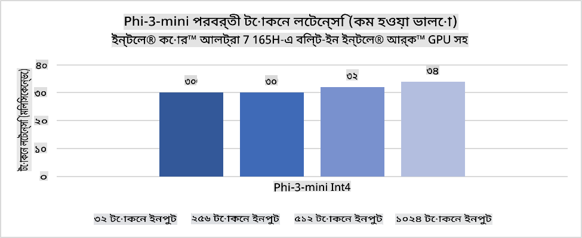
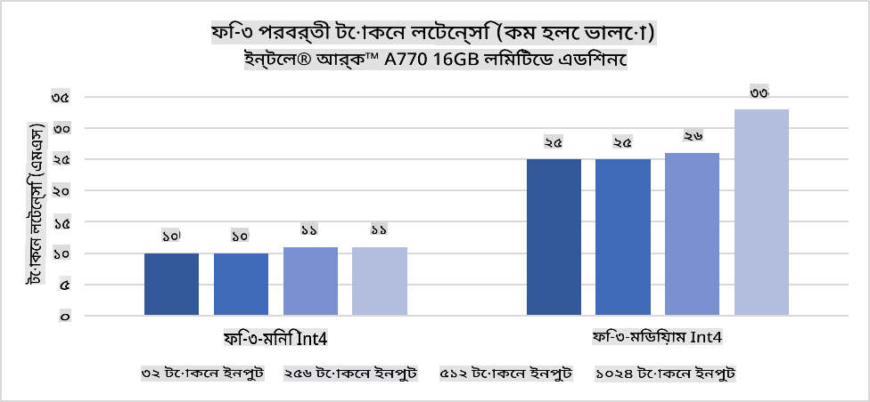
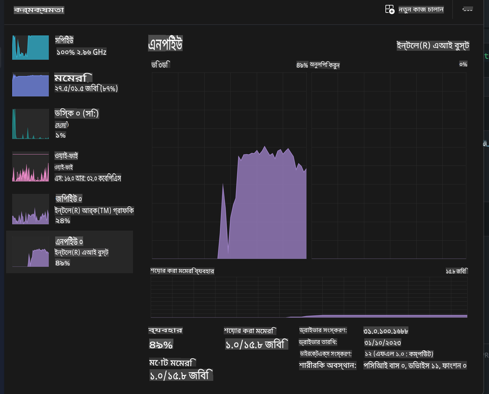
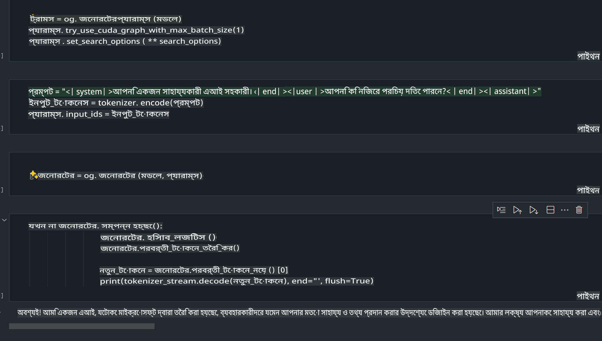
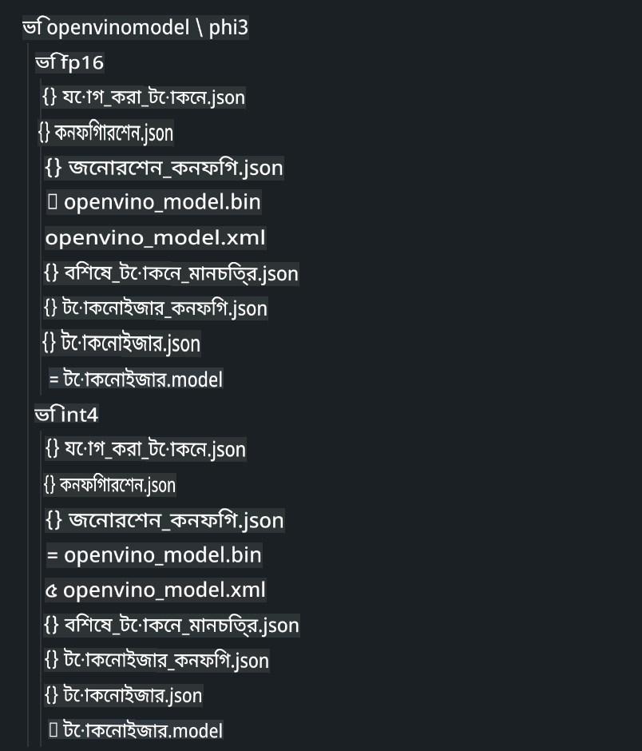
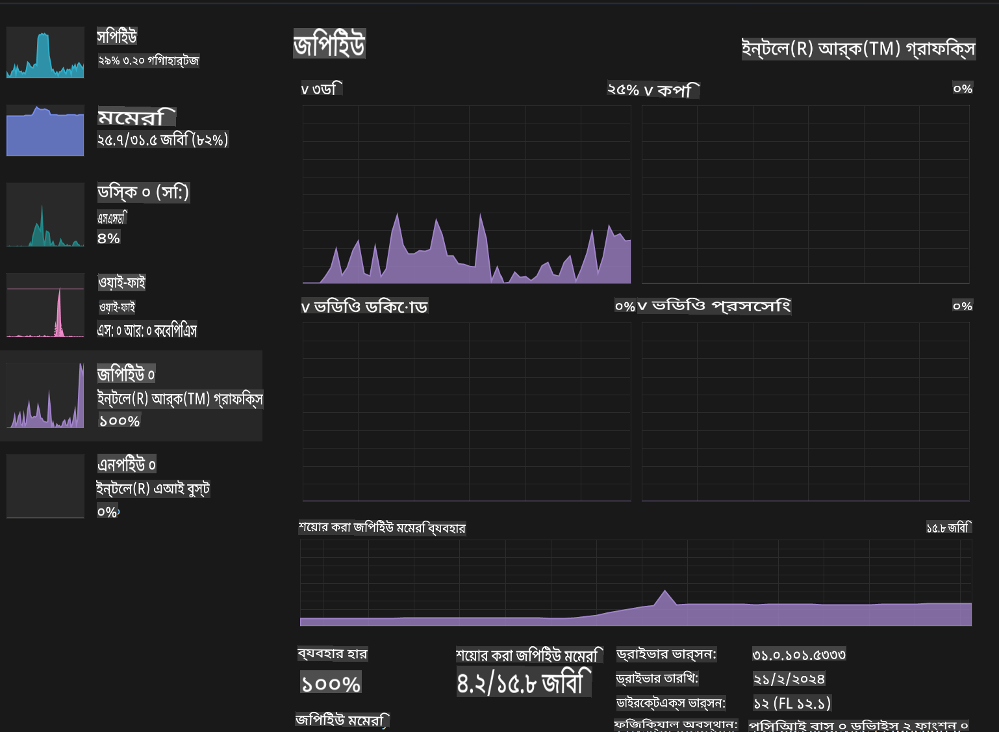

# **AI PC-তে Phi-3 ইনফারেন্স**

জেনারেটিভ এআইয়ের উন্নয়ন এবং এজ ডিভাইসের হার্ডওয়্যার সক্ষমতার অগ্রগতির সাথে, এখন ব্যবহারকারীদের Bring Your Own Device (BYOD) ডিভাইসে আরও বেশি সংখ্যক জেনারেটিভ এআই মডেল সংযুক্ত করা সম্ভব। AI PC-গুলো এর মধ্যে অন্যতম। ২০২৪ সাল থেকে Intel, AMD এবং Qualcomm PC নির্মাতাদের সাথে অংশীদারিত্ব করে AI PC চালু করছে, যা হার্ডওয়্যার পরিবর্তনের মাধ্যমে লোকালাইজড জেনারেটিভ এআই মডেলগুলোর ডিপ্লয়মেন্ট সহজতর করে। এই আলোচনায় আমরা Intel AI PC-র উপর ফোকাস করব এবং Intel AI PC-তে Phi-3 কীভাবে ডিপ্লয় করা যায় তা অন্বেষণ করব।

### NPU কী

একটি NPU (Neural Processing Unit) একটি নির্দিষ্ট প্রসেসর বা প্রসেসিং ইউনিট যা বৃহত্তর SoC-এর মধ্যে অন্তর্ভুক্ত, যা বিশেষভাবে নিউরাল নেটওয়ার্ক অপারেশন এবং এআই কাজগুলোর গতি বাড়ানোর জন্য ডিজাইন করা হয়েছে। সাধারণ উদ্দেশ্যপ্রণোদিত CPU এবং GPU-এর বিপরীতে, NPU-গুলো ডেটা-চালিত প্যারালাল কম্পিউটিংয়ের জন্য অপ্টিমাইজড, যা ভিডিও ও ছবি প্রক্রিয়াকরণ এবং নিউরাল নেটওয়ার্কের জন্য ডেটা প্রক্রিয়াকরণে অত্যন্ত কার্যকর। এটি বিশেষত এআই সম্পর্কিত কাজগুলো, যেমন স্পিচ রিকগনিশন, ভিডিও কলের ব্যাকগ্রাউন্ড ব্লারিং, এবং অবজেক্ট ডিটেকশনের মতো ছবি বা ভিডিও এডিটিং প্রক্রিয়াগুলোর জন্য পারদর্শী।

## NPU বনাম GPU

অনেক এআই এবং মেশিন লার্নিং ওয়ার্কলোড GPU-তে চললেও, GPU এবং NPU-এর মধ্যে একটি গুরুত্বপূর্ণ পার্থক্য রয়েছে।  
GPU-গুলো তাদের প্যারালাল কম্পিউটিং ক্ষমতার জন্য পরিচিত, তবে সব GPU-ই গ্রাফিক্স প্রসেসিং ছাড়াও সমান কার্যকর নয়। অন্যদিকে, NPU-গুলো নিউরাল নেটওয়ার্ক অপারেশনের জটিল গণনার জন্য বিশেষভাবে তৈরি, যা এআই কাজগুলোর জন্য অত্যন্ত কার্যকর।  

সংক্ষেপে, NPU-গুলো হলো গণনার জাদুকর, যা এআই কম্পিউটেশনের গতি বাড়ায় এবং এআই PC-র উদীয়মান যুগে একটি গুরুত্বপূর্ণ ভূমিকা পালন করে!

***এই উদাহরণটি Intel-এর সর্বশেষ Intel Core Ultra Processor-এর উপর ভিত্তি করে তৈরি।***

## **১. Intel NPU ব্যবহার করে Phi-3 মডেল চালানো**

Intel® NPU ডিভাইস একটি AI ইনফারেন্স অ্যাক্সিলারেটর, যা Intel ক্লায়েন্ট CPU-তে সংযুক্ত, শুরু হয়েছে Intel® Core™ Ultra প্রজন্মের CPU (আগে Meteor Lake নামে পরিচিত) থেকে। এটি কৃত্রিম নিউরাল নেটওয়ার্ক কাজগুলোর শক্তি-দক্ষ বাস্তবায়ন সক্ষম করে।





**Intel NPU Acceleration Library**

Intel NPU Acceleration Library [https://github.com/intel/intel-npu-acceleration-library](https://github.com/intel/intel-npu-acceleration-library) একটি Python লাইব্রেরি, যা Intel Neural Processing Unit (NPU)-এর শক্তি ব্যবহার করে উপযুক্ত হার্ডওয়্যারে দ্রুত গণনা সম্পাদন করে আপনার অ্যাপ্লিকেশনগুলোর দক্ষতা বাড়ানোর জন্য ডিজাইন করা হয়েছে।  

Intel® Core™ Ultra প্রসেসর দ্বারা চালিত AI PC-তে Phi-3-mini-এর উদাহরণ।  


Python লাইব্রেরি pip দিয়ে ইনস্টল করুন

```bash

   pip install intel-npu-acceleration-library

```

***Note*** প্রকল্পটি এখনও উন্নয়নের অধীনে রয়েছে, তবে রেফারেন্স মডেলটি ইতিমধ্যেই বেশ সম্পূর্ণ।

### **Intel NPU Acceleration Library ব্যবহার করে Phi-3 চালানো**

Intel NPU অ্যাক্সিলারেশন ব্যবহার করে, এই লাইব্রেরিটি ঐতিহ্যবাহী এনকোডিং প্রক্রিয়াকে প্রভাবিত করে না। আপনাকে শুধুমাত্র এই লাইব্রেরি ব্যবহার করে মূল Phi-3 মডেলটি যেমন FP16, INT8, INT4-এর মতো কোয়ান্টাইজ করতে হবে।  

```python
from transformers import AutoTokenizer, pipeline,TextStreamer
from intel_npu_acceleration_library import NPUModelForCausalLM, int4
from intel_npu_acceleration_library.compiler import CompilerConfig
import warnings

model_id = "microsoft/Phi-3-mini-4k-instruct"

compiler_conf = CompilerConfig(dtype=int4)
model = NPUModelForCausalLM.from_pretrained(
    model_id, use_cache=True, config=compiler_conf, attn_implementation="sdpa"
).eval()

tokenizer = AutoTokenizer.from_pretrained(model_id)

text_streamer = TextStreamer(tokenizer, skip_prompt=True)
```

কোয়ান্টিফিকেশন সফল হলে, Phi-3 মডেলটি চালানোর জন্য NPU কল করতে কোড এক্সিকিউশন চালিয়ে যান।

```python
generation_args = {
   "max_new_tokens": 1024,
   "return_full_text": False,
   "temperature": 0.3,
   "do_sample": False,
   "streamer": text_streamer,
}

pipe = pipeline(
   "text-generation",
   model=model,
   tokenizer=tokenizer,
)

query = "<|system|>You are a helpful AI assistant.<|end|><|user|>Can you introduce yourself?<|end|><|assistant|>"

with warnings.catch_warnings():
    warnings.simplefilter("ignore")
    pipe(query, **generation_args)
```

কোড চালানোর সময়, Task Manager ব্যবহার করে NPU-এর রানিং স্ট্যাটাস দেখা যেতে পারে।  



***Samples*** : [AIPC_NPU_DEMO.ipynb](../../../../../code/03.Inference/AIPC/AIPC_NPU_DEMO.ipynb)

## **২. DirectML + ONNX Runtime ব্যবহার করে Phi-3 মডেল চালানো**

### **DirectML কী**

[DirectML](https://github.com/microsoft/DirectML) হলো DirectX 12-এর জন্য একটি উচ্চ-পারফরম্যান্স, হার্ডওয়্যার-অ্যাক্সিলারেটেড লাইব্রেরি, যা মেশিন লার্নিংয়ের জন্য ব্যবহৃত হয়। DirectML বিভিন্ন হার্ডওয়্যার এবং ড্রাইভার জুড়ে সাধারণ মেশিন লার্নিং কাজগুলোর জন্য GPU অ্যাক্সিলারেশন প্রদান করে। এটি AMD, Intel, NVIDIA এবং Qualcomm-এর মতো বিক্রেতাদের সমস্ত DirectX 12-সক্ষম GPU সমর্থন করে।  

***Note*** : সর্বশেষ DirectML ইতিমধ্যেই NPU সমর্থন করে (https://devblogs.microsoft.com/directx/introducing-neural-processor-unit-npu-support-in-directml-developer-preview/)  

### DirectML এবং CUDA-র ক্ষমতা ও পারফরম্যান্সের তুলনা:

**DirectML** Microsoft দ্বারা উন্নত একটি মেশিন লার্নিং লাইব্রেরি। এটি Windows ডিভাইসগুলোতে মেশিন লার্নিং কাজগুলোকে ত্বরান্বিত করার জন্য ডিজাইন করা হয়েছে।  
- DX12-ভিত্তিক: DirectML DirectX 12 (DX12)-এর উপর নির্মিত, যা GPU জুড়ে বিস্তৃত হার্ডওয়্যার সমর্থন প্রদান করে।  
- বিস্তৃত সমর্থন: DX12 ব্যবহারের কারণে, DirectML যেকোনো DX12-সক্ষম GPU-এর সাথে কাজ করতে পারে।  
- ইমেজ প্রসেসিং: DirectML নিউরাল নেটওয়ার্ক ব্যবহার করে ছবি এবং অন্যান্য ডেটা প্রক্রিয়া করে।  
- সেটআপ সহজ: DirectML সেটআপ করা সহজ এবং এটি GPU নির্মাতাদের নির্দিষ্ট SDK বা লাইব্রেরি প্রয়োজন করে না।  
- পারফরম্যান্স: নির্দিষ্ট ক্ষেত্রে DirectML দ্রুত হতে পারে।  
- সীমাবদ্ধতা: তবে, কিছু ক্ষেত্রে এটি ধীর হতে পারে।  

**CUDA** NVIDIA-এর প্যারালাল কম্পিউটিং প্ল্যাটফর্ম। এটি NVIDIA GPU-র শক্তি ব্যবহার করে মেশিন লার্নিং এবং বৈজ্ঞানিক সিমুলেশনের জন্য ডিজাইন করা হয়েছে।  
- NVIDIA-নির্দিষ্ট: CUDA NVIDIA GPU-এর সাথে সংযুক্ত।  
- অত্যন্ত অপ্টিমাইজড: NVIDIA GPU ব্যবহার করে কাজগুলোর জন্য এটি চমৎকার পারফরম্যান্স প্রদান করে।  
- ব্যাপকভাবে ব্যবহৃত: অনেক মেশিন লার্নিং ফ্রেমওয়ার্ক এবং লাইব্রেরি CUDA সমর্থন করে।  
- কাস্টমাইজেশন: CUDA নির্দিষ্ট কাজের জন্য অপ্টিমাইজ করা যায়।  
- সীমাবদ্ধতা: NVIDIA হার্ডওয়্যার নির্ভরশীল।  

### DirectML এবং CUDA-এর মধ্যে পছন্দ করা

আপনার নির্দিষ্ট ব্যবহার এবং হার্ডওয়্যার উপলব্ধতার উপর ভিত্তি করে DirectML বা CUDA বেছে নিন। DirectML সহজ সেটআপের জন্য ভালো, তবে NVIDIA GPU থাকলে CUDA উচ্চতর পারফরম্যান্স দেয়।  

### **ONNX Runtime-এর সাথে জেনারেটিভ এআই**

জেনারেটিভ এআইয়ের যুগে AI মডেলের পোর্টেবিলিটি খুবই গুরুত্বপূর্ণ। ONNX Runtime ট্রেইনড মডেলগুলো সহজেই বিভিন্ন ডিভাইসে ডিপ্লয় করতে পারে।  

[Sample Code](https://github.com/Azure-Samples/Phi-3MiniSamples/tree/main/onnx)

***ONNX Runtime লাইব্রেরি কম্পাইল করুন***

```bash

winget install --id=Kitware.CMake  -e

git clone https://github.com/microsoft/onnxruntime.git

cd .\onnxruntime\

./build.bat --build_shared_lib --skip_tests --parallel --use_dml --config Release

cd ../

git clone https://github.com/microsoft/onnxruntime-genai.git

cd .\onnxruntime-genai\

mkdir ort

cd ort

mkdir include

mkdir lib

copy ..\onnxruntime\include\onnxruntime\core\providers\dml\dml_provider_factory.h ort\include

copy ..\onnxruntime\include\onnxruntime\core\session\onnxruntime_c_api.h ort\include

copy ..\onnxruntime\build\Windows\Release\Release\*.dll ort\lib

copy ..\onnxruntime\build\Windows\Release\Release\onnxruntime.lib ort\lib

python build.py --use_dml


```

**লাইব্রেরি ইনস্টল করুন**

```bash

pip install .\onnxruntime_genai_directml-0.3.0.dev0-cp310-cp310-win_amd64.whl

```

এই হলো রানিং রেজাল্ট  



***Samples*** : [AIPC_DirectML_DEMO.ipynb](../../../../../code/03.Inference/AIPC/AIPC_DirectML_DEMO.ipynb)

## **৩. Intel OpenVINO ব্যবহার করে Phi-3 মডেল চালানো**

### **OpenVINO কী**

[OpenVINO](https://github.com/openvinotoolkit/openvino) একটি ওপেন-সোর্স টুলকিট, যা ডিপ লার্নিং মডেলগুলোকে অপ্টিমাইজ এবং ডিপ্লয় করতে ব্যবহৃত হয়। এটি TensorFlow, PyTorch-এর মতো জনপ্রিয় ফ্রেমওয়ার্ক থেকে ভিশন, অডিও এবং ভাষার মডেলগুলোর জন্য পারফরম্যান্স উন্নত করে।  

***Note***: বর্তমানে OpenVINO NPU সমর্থন করে না।

### **OpenVINO লাইব্রেরি ইনস্টল করুন**

```bash

 pip install git+https://github.com/huggingface/optimum-intel.git

 pip install git+https://github.com/openvinotoolkit/nncf.git

 pip install openvino-nightly

```

### **OpenVINO দিয়ে Phi-3 চালানো**

NPU-র মতো, OpenVINO কোয়ান্টাইজড মডেল চালানোর মাধ্যমে জেনারেটিভ এআই মডেলের কল সম্পন্ন করে।  

**INT4**

```bash

optimum-cli export openvino --model "microsoft/Phi-3-mini-4k-instruct" --task text-generation-with-past --weight-format int4 --group-size 128 --ratio 0.6  --sym  --trust-remote-code ./openvinomodel/phi3/int4

```

**FP16**

```bash

optimum-cli export openvino --model "microsoft/Phi-3-mini-4k-instruct" --task text-generation-with-past --weight-format fp16 --trust-remote-code ./openvinomodel/phi3/fp16

```

রূপান্তরিত ফরম্যাট এরকম দেখতে হবে  



OVModelForCausalLM ব্যবহার করে মডেল পাথ, কনফিগারেশন এবং হার্ডওয়্যার-অ্যাক্সিলারেটেড ডিভাইস লোড করুন।  

```python

ov_model = OVModelForCausalLM.from_pretrained(
     model_dir,
     device='GPU.0',
     ov_config=ov_config,
     config=AutoConfig.from_pretrained(model_dir, trust_remote_code=True),
     trust_remote_code=True,
)

```

কোড চালানোর সময়, Task Manager ব্যবহার করে GPU-এর রানিং স্ট্যাটাস দেখা যেতে পারে।  



***Samples*** : [AIPC_OpenVino_Demo.ipynb](../../../../../code/03.Inference/AIPC/AIPC_OpenVino_Demo.ipynb)

### ***Note*** : উপরোক্ত তিনটি পদ্ধতির প্রত্যেকটির নিজস্ব সুবিধা রয়েছে, তবে AI PC ইনফারেন্সের জন্য NPU অ্যাক্সিলারেশন ব্যবহারের সুপারিশ করা হয়।

**অস্বীকৃতি**:  
এই নথিটি মেশিন-ভিত্তিক এআই অনুবাদ পরিষেবাগুলির মাধ্যমে অনুবাদ করা হয়েছে। আমরা যথাসাধ্য সঠিকতার জন্য চেষ্টা করি, তবে অনুগ্রহ করে মনে রাখবেন যে স্বয়ংক্রিয় অনুবাদে ত্রুটি বা অসঙ্গতি থাকতে পারে। মূল ভাষায় লেখা মূল নথিটিকেই প্রামাণিক উৎস হিসেবে বিবেচনা করা উচিত। গুরুত্বপূর্ণ তথ্যের জন্য পেশাদার মানব অনুবাদ সুপারিশ করা হয়। এই অনুবাদের ব্যবহারের ফলে কোনো ভুল বোঝাবুঝি বা ভুল ব্যাখ্যা হলে আমরা দায়ী থাকব না।