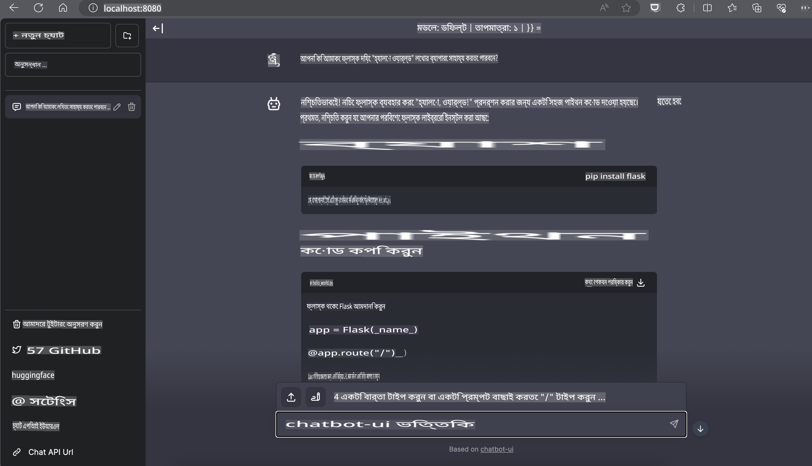

# **Nvidia Jetson-এ Phi-3 ইনফারেন্স**

Nvidia Jetson হল Nvidia-এর একটি এমবেডেড কম্পিউটিং বোর্ডের সিরিজ। Jetson TK1, TX1 এবং TX2 মডেলগুলোতে Nvidia-এর Tegra প্রসেসর (বা SoC) থাকে, যা একটি ARM আর্কিটেকচার সেন্ট্রাল প্রসেসিং ইউনিট (CPU) সংযুক্ত করে। Jetson একটি কম-শক্তি ব্যবহারকারী সিস্টেম এবং মেশিন লার্নিং অ্যাপ্লিকেশনকে ত্বরান্বিত করার জন্য ডিজাইন করা হয়েছে। Nvidia Jetson পেশাদার ডেভেলপারদের দ্বারা বিভিন্ন শিল্পে উদ্ভাবনী AI পণ্য তৈরির জন্য এবং শিক্ষার্থী ও উৎসাহীদের দ্বারা হাতে-কলমে AI শেখা এবং অসাধারণ প্রকল্প তৈরির জন্য ব্যবহৃত হয়। SLM, Jetson-এর মতো এজ ডিভাইসগুলোতে মোতায়েন করা হয়, যা শিল্পক্ষেত্রে জেনারেটিভ AI অ্যাপ্লিকেশনগুলোর আরও ভালো বাস্তবায়ন সক্ষম করে।

## NVIDIA Jetson-এ মোতায়েন:
স্বয়ংক্রিয় রোবোটিক্স এবং এমবেডেড ডিভাইসে কাজ করা ডেভেলপাররা Phi-3 Mini ব্যবহার করতে পারেন। Phi-3-এর তুলনামূলক ছোট আকার এটিকে এজ মোতায়েনের জন্য আদর্শ করে তোলে। প্রশিক্ষণের সময় প্যারামিটারগুলো অত্যন্ত যত্ন সহকারে টিউন করা হয়েছে, যা প্রতিক্রিয়াগুলোর উচ্চ নির্ভুলতা নিশ্চিত করে।

### TensorRT-LLM অপ্টিমাইজেশন:
NVIDIA-র [TensorRT-LLM লাইব্রেরি](https://github.com/NVIDIA/TensorRT-LLM?WT.mc_id=aiml-138114-kinfeylo) বড় ভাষা মডেলের ইনফারেন্স অপ্টিমাইজ করে। এটি Phi-3 Mini-এর দীর্ঘ কন্টেক্সট উইন্ডোকে সমর্থন করে, যা থ্রুপুট এবং ল্যাটেন্সি উভয়ই উন্নত করে। অপ্টিমাইজেশনে LongRoPE, FP8 এবং ইনফ্লাইট ব্যাচিং-এর মতো কৌশল অন্তর্ভুক্ত রয়েছে।

### প্রাপ্যতা এবং মোতায়েন:
ডেভেলপাররা [NVIDIA's AI](https://www.nvidia.com/en-us/ai-data-science/generative-ai/) থেকে 128K কন্টেক্সট উইন্ডো সহ Phi-3 Mini অন্বেষণ করতে পারেন। এটি একটি NVIDIA NIM হিসেবে প্যাকেজ করা হয়েছে, একটি মাইক্রোসার্ভিস যার একটি স্ট্যান্ডার্ড API রয়েছে যা যেকোনো স্থানে মোতায়েন করা যায়। এছাড়াও, [GitHub-এ TensorRT-LLM বাস্তবায়ন](https://github.com/NVIDIA/TensorRT-LLM) উপলব্ধ।

## **1. প্রস্তুতি**

a. Jetson Orin NX / Jetson NX

b. JetPack 5.1.2+

c. Cuda 11.8

d. Python 3.8+

## **2. Jetson-এ Phi-3 চালানো**

আমরা [Ollama](https://ollama.com) বা [LlamaEdge](https://llamaedge.com) বেছে নিতে পারি।

যদি আপনি একই সময়ে ক্লাউড এবং এজ ডিভাইসে gguf ব্যবহার করতে চান, LlamaEdge-কে WasmEdge হিসেবে বোঝা যেতে পারে (WasmEdge হলো একটি হালকা, উচ্চ-প্রদর্শনক্ষম, স্কেলেবল WebAssembly রানটাইম যা ক্লাউড নেটিভ, এজ এবং বিকেন্দ্রীকৃত অ্যাপ্লিকেশনের জন্য উপযুক্ত। এটি সার্ভারলেস অ্যাপ্লিকেশন, এমবেডেড ফাংশন, মাইক্রোসার্ভিস, স্মার্ট কন্ট্রাক্ট এবং IoT ডিভাইসকে সমর্থন করে। LlamaEdge-এর মাধ্যমে আপনি gguf-এর পরিমাণগত মডেল এজ ডিভাইস এবং ক্লাউডে মোতায়েন করতে পারেন)।


ব্যবহারের ধাপগুলো নিম্নরূপ:

1. প্রাসঙ্গিক লাইব্রেরি এবং ফাইল ডাউনলোড এবং ইনস্টল করুন

```bash

curl -sSf https://raw.githubusercontent.com/WasmEdge/WasmEdge/master/utils/install.sh | bash -s -- --plugin wasi_nn-ggml

curl -LO https://github.com/LlamaEdge/LlamaEdge/releases/latest/download/llama-api-server.wasm

curl -LO https://github.com/LlamaEdge/chatbot-ui/releases/latest/download/chatbot-ui.tar.gz

tar xzf chatbot-ui.tar.gz

```

**নোট**: llama-api-server.wasm এবং chatbot-ui একই ডিরেক্টরিতে থাকা প্রয়োজন।

2. টার্মিনালে স্ক্রিপ্ট চালান

```bash

wasmedge --dir .:. --nn-preload default:GGML:AUTO:{Your gguf path} llama-api-server.wasm -p phi-3-chat

```

এখানে রানিং ফলাফল:



***নমুনা কোড*** [Phi-3 Mini WASM Notebook Sample](https://github.com/Azure-Samples/Phi-3MiniSamples/tree/main/wasm)

সংক্ষেপে, Phi-3 Mini ভাষা মডেলিংয়ে এক ধাপ এগিয়ে নিয়ে যায়, যা দক্ষতা, প্রাসঙ্গিকতা বোঝা এবং NVIDIA-র অপ্টিমাইজেশনের দক্ষতাকে একত্রিত করে। আপনি রোবট তৈরি করুন বা এজ অ্যাপ্লিকেশন, Phi-3 Mini এমন একটি শক্তিশালী টুল যা আপনার জানা থাকা উচিত।

**অস্বীকৃতি**:  
এই নথিটি মেশিন-ভিত্তিক এআই অনুবাদ সেবা ব্যবহার করে অনুবাদ করা হয়েছে। আমরা যথাসাধ্য সঠিকতা নিশ্চিত করার চেষ্টা করি, তবে অনুগ্রহ করে মনে রাখবেন যে স্বয়ংক্রিয় অনুবাদে ত্রুটি বা অসঙ্গতি থাকতে পারে। এর মূল ভাষায় থাকা নথিটিকেই প্রামাণিক উৎস হিসেবে বিবেচনা করা উচিত। গুরুত্বপূর্ণ তথ্যের ক্ষেত্রে পেশাদার মানব অনুবাদের সুপারিশ করা হয়। এই অনুবাদ ব্যবহারের ফলে কোনো ভুল বোঝাবুঝি বা ভুল ব্যাখ্যার জন্য আমরা দায়ী থাকব না।