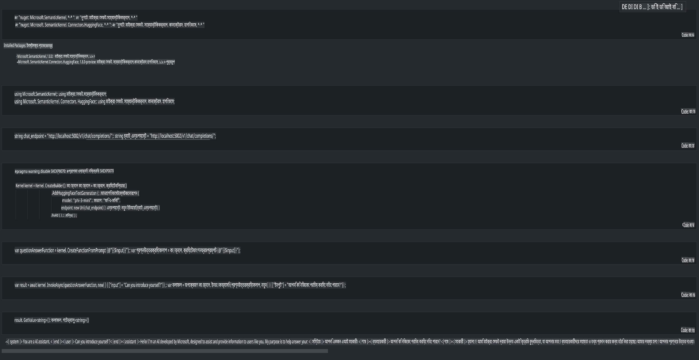

# **লোকাল সার্ভারে Phi-3 ইনফারেন্স**

আমরা Phi-3 একটি লোকাল সার্ভারে ডিপ্লয় করতে পারি। ব্যবহারকারীরা [Ollama](https://ollama.com) বা [LM Studio](https://llamaedge.com) সমাধান বেছে নিতে পারেন, অথবা নিজেদের কোড লিখতে পারেন। আপনি [Semantic Kernel](https://github.com/microsoft/semantic-kernel?WT.mc_id=aiml-138114-kinfeylo) বা [Langchain](https://www.langchain.com/) এর মাধ্যমে Phi-3 এর লোকাল সার্ভিসের সাথে সংযোগ স্থাপন করে কপাইলট অ্যাপ্লিকেশন তৈরি করতে পারেন।

## **Semantic Kernel ব্যবহার করে Phi-3-mini অ্যাক্সেস করুন**

কপাইলট অ্যাপ্লিকেশনে, আমরা Semantic Kernel / LangChain এর মাধ্যমে অ্যাপ্লিকেশন তৈরি করি। এই ধরনের অ্যাপ্লিকেশন ফ্রেমওয়ার্ক সাধারণত Azure OpenAI Service / OpenAI মডেলের সাথে সামঞ্জস্যপূর্ণ এবং Hugging Face এর ওপেন সোর্স মডেল এবং লোকাল মডেলগুলোকেও সমর্থন করতে পারে। যদি আমরা Phi-3-mini অ্যাক্সেস করতে Semantic Kernel ব্যবহার করতে চাই, তাহলে কী করতে হবে? .NET এর একটি উদাহরণ হিসেবে, আমরা এটি Semantic Kernel এ Hugging Face Connector এর সাথে একত্রিত করতে পারি। ডিফল্টভাবে, এটি Hugging Face এর মডেল আইডির সাথে সঙ্গতিপূর্ণ হয় (প্রথমবার ব্যবহারের সময়, মডেলটি Hugging Face থেকে ডাউনলোড হবে, যা অনেক সময় নিতে পারে)। আপনি লোকাল সার্ভিসেও সংযোগ স্থাপন করতে পারেন। এই দুইয়ের তুলনায়, আমরা দ্বিতীয়টি ব্যবহার করার পরামর্শ দিই কারণ এটি আরও বেশি স্বায়ত্তশাসন প্রদান করে, বিশেষ করে এন্টারপ্রাইজ অ্যাপ্লিকেশনে।

ছবিতে দেখানো হয়েছে, Semantic Kernel এর মাধ্যমে লোকাল সার্ভিসে অ্যাক্সেস করে সহজেই নিজের তৈরি Phi-3-mini মডেল সার্ভারের সাথে সংযোগ স্থাপন করা যায়। নিচে এর রানিং রেজাল্ট দেওয়া হলো।

***উদাহরণ কোড*** https://github.com/kinfey/Phi3MiniSamples/tree/main/semantickernel

**অস্বীকৃতি**:  
এই নথিটি মেশিন-ভিত্তিক এআই অনুবাদ পরিষেবাগুলি ব্যবহার করে অনুবাদ করা হয়েছে। আমরা যথাসাধ্য সঠিক অনুবাদের চেষ্টা করি, তবে অনুগ্রহ করে মনে রাখবেন যে স্বয়ংক্রিয় অনুবাদে ত্রুটি বা অসঙ্গতি থাকতে পারে। মূল ভাষায় থাকা নথিটিকে প্রামাণিক উৎস হিসেবে গণ্য করা উচিত। গুরুত্বপূর্ণ তথ্যের ক্ষেত্রে, পেশাদার মানব অনুবাদ ব্যবহার করার পরামর্শ দেওয়া হয়। এই অনুবাদ ব্যবহার থেকে উদ্ভূত যেকোনো ভুল বোঝাবুঝি বা ভুল ব্যাখ্যার জন্য আমরা দায়ী নই।