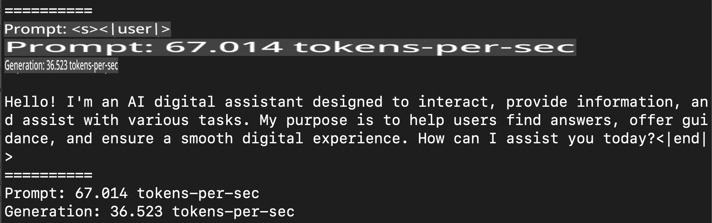
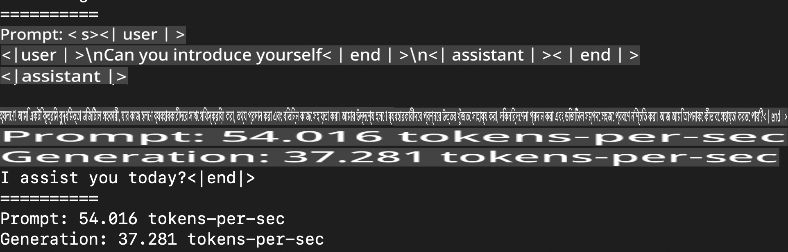
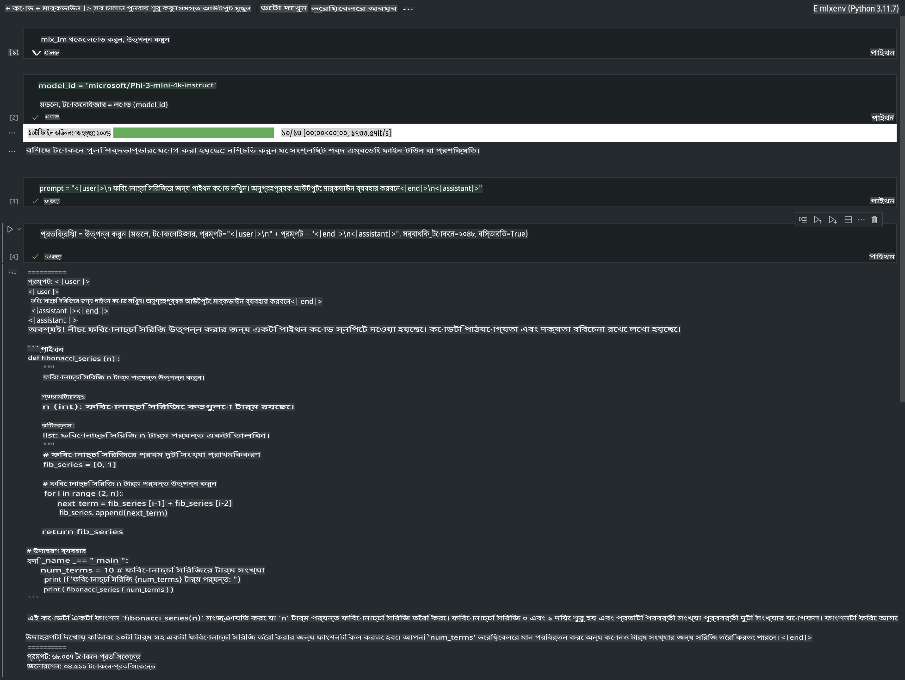

# **Apple MLX ফ্রেমওয়ার্ক দিয়ে Phi-3 ইনফারেন্স করা**

## **MLX ফ্রেমওয়ার্ক কী**

MLX হলো অ্যাপল সিলিকন ভিত্তিক মেশিন লার্নিং গবেষণার জন্য একটি অ্যারে ফ্রেমওয়ার্ক, যা অ্যাপল মেশিন লার্নিং গবেষণা বিভাগ দ্বারা তৈরি।

MLX মেশিন লার্নিং গবেষকদের জন্য তৈরি, এবং এটি সহজে ব্যবহারযোগ্য হলেও মডেল প্রশিক্ষণ ও স্থাপনের জন্য কার্যকর। ফ্রেমওয়ার্কটির নকশা নিজেই ধারণাগতভাবে সহজ। আমরা গবেষকদের জন্য নতুন ধারণা দ্রুত পরীক্ষা করার উদ্দেশ্যে MLX সম্প্রসারণ ও উন্নত করা সহজ করতে চাই।

LLM-গুলো Apple Silicon ডিভাইসে MLX এর মাধ্যমে দ্রুততর করা যায়, এবং মডেলগুলো খুব সহজেই স্থানীয়ভাবে চালানো সম্ভব।

## **MLX ব্যবহার করে Phi-3-mini ইনফারেন্স করা**

### **১. আপনার MLX পরিবেশ সেটআপ করুন**

1. Python 3.11.x
2. MLX লাইব্রেরি ইনস্টল করুন

```bash

pip install mlx-lm

```

### **২. টার্মিনালে MLX দিয়ে Phi-3-mini চালানো**

```bash

python -m mlx_lm.generate --model microsoft/Phi-3-mini-4k-instruct --max-token 2048 --prompt  "<|user|>\nCan you introduce yourself<|end|>\n<|assistant|>"

```

ফলাফল (আমার পরিবেশ: Apple M1 Max, 64GB) হলো



### **৩. টার্মিনালে MLX দিয়ে Phi-3-mini কোয়ান্টাইজ করা**

```bash

python -m mlx_lm.convert --hf-path microsoft/Phi-3-mini-4k-instruct

```

***নোট:*** মডেলটি mlx_lm.convert এর মাধ্যমে কোয়ান্টাইজ করা যায়, এবং ডিফল্ট কোয়ান্টাইজেশন হলো INT4। এই উদাহরণে Phi-3-mini কে INT4 এ কোয়ান্টাইজ করা হয়েছে।

mlx_lm.convert এর মাধ্যমে মডেলটি কোয়ান্টাইজ করা যায়, এবং ডিফল্ট কোয়ান্টাইজেশন হলো INT4। এই উদাহরণে Phi-3-mini কে INT4 এ কোয়ান্টাইজ করা হয়েছে। কোয়ান্টাইজ করার পরে এটি ডিফল্ট ডিরেক্টরি ./mlx_model এ সংরক্ষিত হবে।

আমরা টার্মিনাল থেকে MLX দিয়ে কোয়ান্টাইজ করা মডেল পরীক্ষা করতে পারি।

```bash

python -m mlx_lm.generate --model ./mlx_model/ --max-token 2048 --prompt  "<|user|>\nCan you introduce yourself<|end|>\n<|assistant|>"

```

ফলাফল হলো



### **৪. Jupyter Notebook দিয়ে MLX এর মাধ্যমে Phi-3-mini চালানো**



***নোট:*** দয়া করে এই নমুনাটি পড়ুন [এই লিঙ্কে ক্লিক করুন](../../../../../code/03.Inference/MLX/MLX_DEMO.ipynb)

## **রিসোর্সসমূহ**

1. Apple MLX Framework সম্পর্কে জানুন [https://ml-explore.github.io](https://ml-explore.github.io/mlx/build/html/index.html)

2. Apple MLX GitHub Repo [https://github.com/ml-explore](https://github.com/ml-explore)

**অস্বীকৃতি**:  
এই নথিটি মেশিন-ভিত্তিক কৃত্রিম বুদ্ধিমত্তা অনুবাদ পরিষেবা ব্যবহার করে অনুবাদ করা হয়েছে। আমরা যথাসম্ভব সঠিক অনুবাদের চেষ্টা করি, তবে দয়া করে মনে রাখবেন যে স্বয়ংক্রিয় অনুবাদে ত্রুটি বা অসংগতি থাকতে পারে। নথির মূল ভাষায় রচিত আসল সংস্করণটিকেই প্রামাণিক উৎস হিসেবে বিবেচনা করা উচিত। গুরুত্বপূর্ণ তথ্যের জন্য, পেশাদার মানব অনুবাদের সুপারিশ করা হয়। এই অনুবাদ ব্যবহারের ফলে সৃষ্ট কোনো ভুল বোঝাবুঝি বা ভুল ব্যাখ্যার জন্য আমরা দায়ী নই।