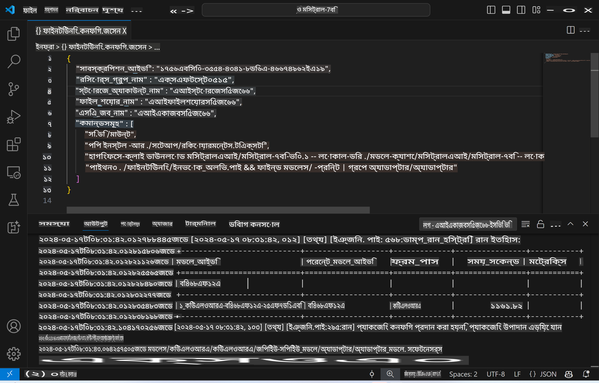
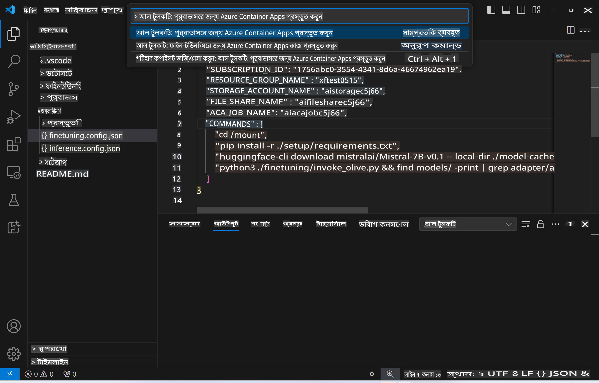
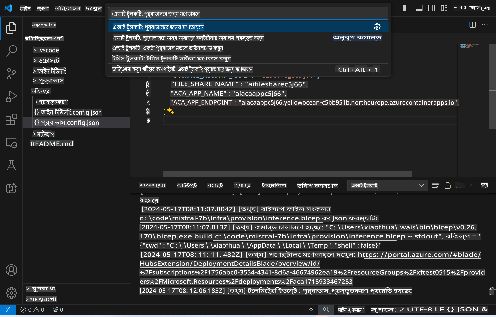
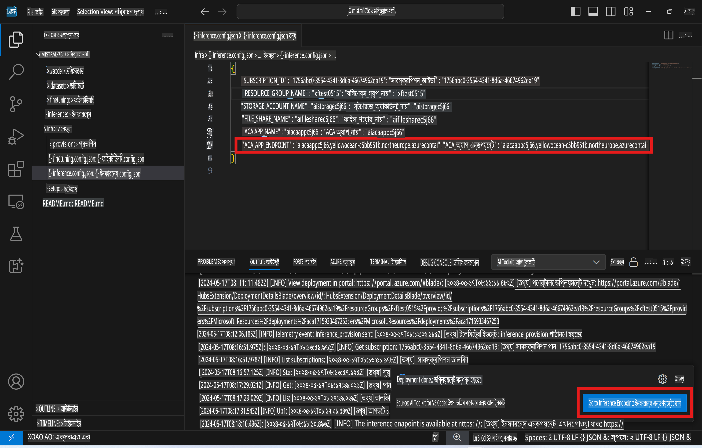

# ফাইন-টিউনড মডেল দিয়ে রিমোট ইনফারেন্স  

রিমোট পরিবেশে অ্যাডাপ্টারগুলো ট্রেনিং করার পর, একটি সহজ গ্রাডিও অ্যাপ্লিকেশন ব্যবহার করে মডেলের সাথে ইন্টারঅ্যাক্ট করুন।  

  

### আজুর রিসোর্স প্রভিশন করুন  
রিমোট ইনফারেন্সের জন্য আজুর রিসোর্স সেটআপ করতে, কমান্ড প্যালেট থেকে `AI Toolkit: Provision Azure Container Apps for inference` চালান। এই সেটআপের সময় আপনাকে আপনার আজুর সাবস্ক্রিপশন এবং রিসোর্স গ্রুপ সিলেক্ট করতে বলা হবে।  
  

ডিফল্ট হিসেবে, ইনফারেন্সের জন্য সাবস্ক্রিপশন এবং রিসোর্স গ্রুপটি ফাইন-টিউনিংয়ে ব্যবহৃত সাবস্ক্রিপশন এবং রিসোর্স গ্রুপের সাথে মিলবে। ইনফারেন্স একই আজুর কন্টেইনার অ্যাপ এনভায়রনমেন্ট ব্যবহার করবে এবং ফাইন-টিউনিং ধাপে আজুর ফাইলসে সংরক্ষিত মডেল এবং মডেল অ্যাডাপ্টার অ্যাক্সেস করবে।  

## এআই টুলকিট ব্যবহার  

### ইনফারেন্সের জন্য ডিপ্লয়মেন্ট  
ইনফারেন্স কোড আপডেট করতে বা ইনফারেন্স মডেল রিলোড করতে চাইলে `AI Toolkit: Deploy for inference` কমান্ডটি চালান। এটি আপনার সর্বশেষ কোড ACA-এর সাথে সিঙ্ক করবে এবং রিপ্লিকাটি পুনরায় চালু করবে।  

  

ডিপ্লয়মেন্ট সফলভাবে সম্পন্ন হওয়ার পর, এই এন্ডপয়েন্ট ব্যবহার করে মডেলটি এখন মূল্যায়নের জন্য প্রস্তুত।  

### ইনফারেন্স এপিআই অ্যাক্সেস করা  

VSCode নোটিফিকেশনে প্রদর্শিত "*Go to Inference Endpoint*" বোতামে ক্লিক করে ইনফারেন্স এপিআই অ্যাক্সেস করতে পারেন। বিকল্পভাবে, `ACA_APP_ENDPOINT`-এ `./infra/inference.config.json` এবং আউটপুট প্যানেলে ওয়েব এপিআই এন্ডপয়েন্টটি পাওয়া যাবে।  

  

> **নোট:** ইনফারেন্স এন্ডপয়েন্ট সম্পূর্ণরূপে কার্যকর হতে কয়েক মিনিট সময় লাগতে পারে।  

## টেমপ্লেটে অন্তর্ভুক্ত ইনফারেন্স উপাদানসমূহ  

| ফোল্ডার | বিষয়বস্তু |  
| ------- | ---------- |  
| `infra` | রিমোট অপারেশনের জন্য প্রয়োজনীয় সব কনফিগারেশন ধারণ করে। |  
| `infra/provision/inference.parameters.json` | বাইসেপ টেমপ্লেটের জন্য প্যারামিটার ধারণ করে, যা আজুর রিসোর্স প্রভিশনের জন্য ব্যবহৃত হয়। |  
| `infra/provision/inference.bicep` | আজুর রিসোর্স প্রভিশনের জন্য টেমপ্লেট ধারণ করে। |  
| `infra/inference.config.json` | কনফিগারেশন ফাইল, `AI Toolkit: Provision Azure Container Apps for inference` কমান্ড দ্বারা তৈরি। এটি অন্যান্য রিমোট কমান্ড প্যালেটের জন্য ইনপুট হিসেবে ব্যবহৃত হয়। |  

### এআই টুলকিট ব্যবহার করে আজুর রিসোর্স প্রভিশন কনফিগার করা  
[AI Toolkit](https://marketplace.visualstudio.com/items?itemName=ms-windows-ai-studio.windows-ai-studio) কনফিগার করুন  

ইনফারেন্সের জন্য আজুর কন্টেইনার অ্যাপ প্রভিশন করুন ` command.

You can find configuration parameters in `। `./infra/provision/inference.parameters.json`` file. Here are the details:
| Parameter | Description |
| --------- |------------ |
| ` ডিফল্ট কমান্ড` | This is the commands to initiate a web API. |
| ` ম্যাক্সিমাম ইনস্ট্যান্স কাউন্ট` | This parameter sets the maximum capacity of GPU instances. |
| ` লোকেশন` | This is the location where Azure resources are provisioned. The default value is the same as the chosen resource group's location. |
| ` স্টোরেজ অ্যাকাউন্ট নাম`, ` ফাইল শেয়ার নাম` ` ACA এনভায়রনমেন্ট নাম`, ` ACA এনভায়রনমেন্ট স্টোরেজ নাম`, ` ACA অ্যাপ নাম`,  ` ACA লগ অ্যানালিটিক্স নাম` | These parameters are used to name the Azure resources for provision. By default, they will be same to the fine-tuning resource name. You can input a new, unused resource name to create your own custom-named resources, or you can input the name of an already existing Azure resource if you'd prefer to use that. For details, refer to the section [Using existing Azure Resources](../../../../../md/01.Introduction/03). |

### Using Existing Azure Resources

By default, the inference provision use the same Azure Container App Environment, Storage Account, Azure File Share, and Azure Log Analytics that were used for fine-tuning. A separate Azure Container App is created solely for the inference API. 

If you have customized the Azure resources during the fine-tuning step or want to use your own existing Azure resources for inference, specify their names in the `।  

এরপর `AI Toolkit: Provision Azure Container Apps for inference` কমান্ডটি কমান্ড প্যালেট থেকে চালান। এটি নির্দিষ্ট রিসোর্স আপডেট করবে এবং অনুপস্থিত রিসোর্স তৈরি করবে।  

উদাহরণস্বরূপ, যদি আপনার একটি বিদ্যমান আজুর কন্টেইনার এনভায়রনমেন্ট থাকে, তাহলে আপনার `./infra/finetuning.parameters.json` এই রকম হবে:  

```json
{
    "$schema": "https://schema.management.azure.com/schemas/2019-04-01/deploymentParameters.json#",
    "contentVersion": "1.0.0.0",
    "parameters": {
      ...
      "acaEnvironmentName": {
        "value": "<your-aca-env-name>"
      },
      "acaEnvironmentStorageName": {
        "value": null
      },
      ...
    }
  }
```  

### ম্যানুয়াল প্রভিশন  
যদি আপনি আজুর রিসোর্সগুলো ম্যানুয়ালি কনফিগার করতে চান, তাহলে `./infra/provision` folders. If you have already set up and configured all the Azure resources without using the AI Toolkit command palette, you can simply enter the resource names in the `inference.config.json` ফাইলের মধ্যে প্রদত্ত বাইসেপ ফাইলগুলো ব্যবহার করতে পারেন।  

উদাহরণস্বরূপ:  

```json
{
  "SUBSCRIPTION_ID": "<your-subscription-id>",
  "RESOURCE_GROUP_NAME": "<your-resource-group-name>",
  "STORAGE_ACCOUNT_NAME": "<your-storage-account-name>",
  "FILE_SHARE_NAME": "<your-file-share-name>",
  "ACA_APP_NAME": "<your-aca-name>",
  "ACA_APP_ENDPOINT": "<your-aca-endpoint>"
}
```  

**অস্বীকৃতি**:  
এই নথিটি মেশিন-ভিত্তিক এআই অনুবাদ পরিষেবার মাধ্যমে অনুবাদ করা হয়েছে। আমরা যথাসম্ভব সঠিক অনুবাদের জন্য চেষ্টা করি, তবে অনুগ্রহ করে মনে রাখবেন যে স্বয়ংক্রিয় অনুবাদে ত্রুটি বা অসঙ্গতি থাকতে পারে। মূল ভাষায় থাকা নথিটিকে প্রামাণিক উৎস হিসেবে বিবেচনা করা উচিত। গুরুত্বপূর্ণ তথ্যের জন্য পেশাদার মানব অনুবাদ সুপারিশ করা হয়। এই অনুবাদ ব্যবহারের ফলে সৃষ্ট কোনো ভুল বোঝাবুঝি বা ভুল ব্যাখ্যার জন্য আমরা দায়ী নই।