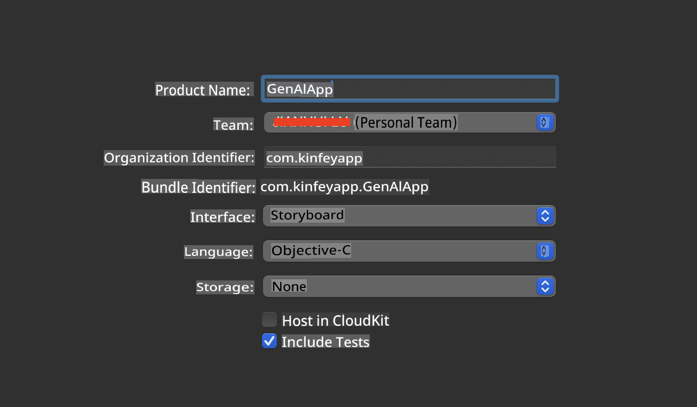
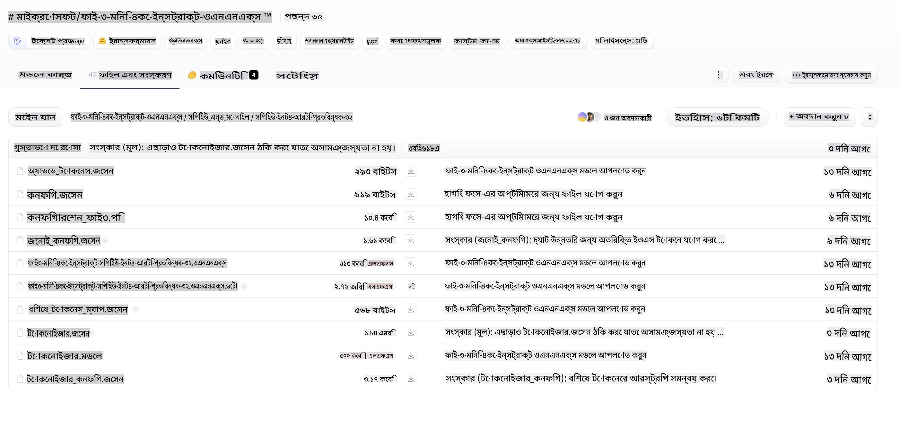
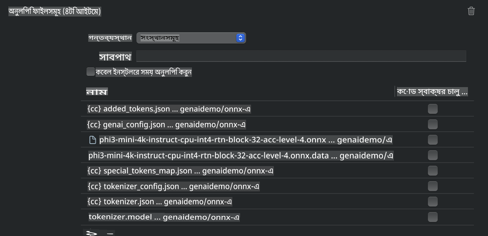
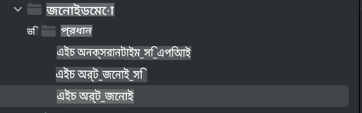
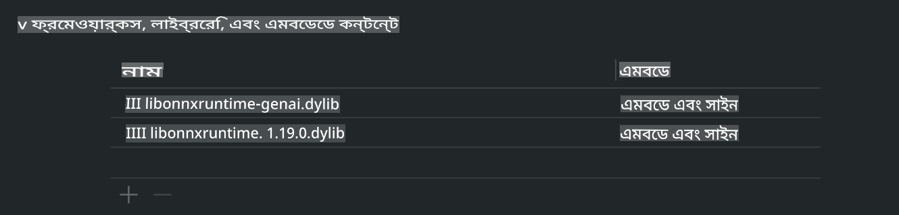
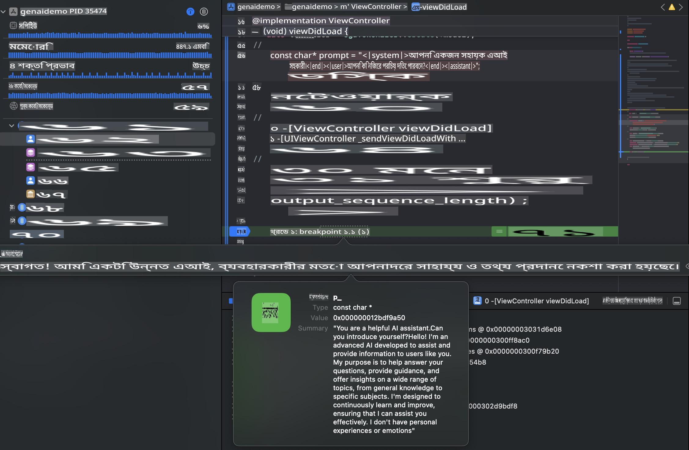

# **iOS-এ Phi-3 ইনফারেন্স**

Phi-3-mini হলো মাইক্রোসফটের নতুন একটি মডেল সিরিজ, যা বড় ভাষার মডেল (LLMs) এজ ডিভাইস এবং IoT ডিভাইসগুলোতে মোতায়েন করতে সক্ষম। Phi-3-mini iOS, Android এবং Edge Device-এ মোতায়েনের জন্য উপলব্ধ, যা BYOD পরিবেশে জেনারেটিভ AI মোতায়েনের সুযোগ দেয়। নিচের উদাহরণটি iOS-এ Phi-3-mini মোতায়েন করার প্রক্রিয়া দেখায়।

## **১. প্রস্তুতি**

- **ক.** macOS 14+  
- **খ.** Xcode 15+  
- **গ.** iOS SDK 17.x (iPhone 14 A16 বা তার বেশি)  
- **ঘ.** Python 3.10+ ইনস্টল করুন (Conda সুপারিশ করা হয়)  
- **ঙ.** Python লাইব্রেরি ইনস্টল করুন: `python-flatbuffers`  
- **চ.** CMake ইনস্টল করুন  

### Semantic Kernel এবং ইনফারেন্স

Semantic Kernel একটি অ্যাপ্লিকেশন ফ্রেমওয়ার্ক, যা Azure OpenAI Service, OpenAI মডেল এবং এমনকি লোকাল মডেলের সাথে সামঞ্জস্যপূর্ণ অ্যাপ্লিকেশন তৈরি করতে সহায়তা করে। Semantic Kernel ব্যবহার করে আপনার স্ব-হোস্ট করা Phi-3-mini মডেল সার্ভারের সাথে সহজেই লোকাল পরিষেবাগুলো ইন্টিগ্রেট করা সম্ভব।

### Ollama বা LlamaEdge দিয়ে কোয়ান্টাইজড মডেল চালানো

অনেক ব্যবহারকারী স্থানীয়ভাবে মডেল চালানোর জন্য কোয়ান্টাইজড মডেল ব্যবহার করতে পছন্দ করেন। [Ollama](https://ollama.com) এবং [LlamaEdge](https://llamaedge.com) ব্যবহারকারীদের বিভিন্ন কোয়ান্টাইজড মডেল চালানোর সুযোগ দেয়:

#### **Ollama**

আপনি `ollama run phi3` সরাসরি চালাতে পারেন অথবা অফলাইনে কনফিগার করতে পারেন। `gguf` ফাইলের পথ উল্লেখ করে একটি Modelfile তৈরি করুন। Phi-3-mini কোয়ান্টাইজড মডেল চালানোর নমুনা কোড:

```gguf
FROM {Add your gguf file path}
TEMPLATE \"\"\"<|user|> .Prompt<|end|> <|assistant|>\"\"\"
PARAMETER stop <|end|>
PARAMETER num_ctx 4096
```

#### **LlamaEdge**

যদি আপনি `gguf` ক্লাউড এবং এজ ডিভাইস উভয় ক্ষেত্রেই একসাথে ব্যবহার করতে চান, তাহলে LlamaEdge একটি চমৎকার অপশন।

## **২. iOS-এর জন্য ONNX Runtime কম্পাইল করা**

```bash

git clone https://github.com/microsoft/onnxruntime.git

cd onnxruntime

./build.sh --build_shared_lib --ios --skip_tests --parallel --build_dir ./build_ios --ios --apple_sysroot iphoneos --osx_arch arm64 --apple_deploy_target 17.5 --cmake_generator Xcode --config Release

cd ../

```

### **নোটিশ**

- **ক.** কম্পাইল করার আগে নিশ্চিত করুন যে Xcode সঠিকভাবে কনফিগার করা আছে এবং টার্মিনালে এটিকে সক্রিয় ডেভেলপার ডিরেক্টরি হিসেবে সেট করুন:

    ```bash
    sudo xcode-select -switch /Applications/Xcode.app/Contents/Developer
    ```

- **খ.** বিভিন্ন প্ল্যাটফর্মের জন্য ONNX Runtime কম্পাইল করা প্রয়োজন। iOS-এর জন্য `arm64` or `x86_64`-এ কম্পাইল করতে পারেন।  

- **গ.** সর্বশেষ iOS SDK ব্যবহার করে কম্পাইল করার সুপারিশ করা হয়। তবে, পূর্ববর্তী SDK-গুলোর সাথে সামঞ্জস্য রাখতে চাইলে পুরনো সংস্করণও ব্যবহার করতে পারেন।  

## **৩. iOS-এর জন্য ONNX Runtime দিয়ে জেনারেটিভ AI কম্পাইল করা**

> **নোট:** যেহেতু ONNX Runtime দিয়ে জেনারেটিভ AI এখন প্রিভিউ পর্যায়ে রয়েছে, তাই সম্ভাব্য পরিবর্তনের বিষয়ে সচেতন থাকুন।  

```bash

git clone https://github.com/microsoft/onnxruntime-genai
 
cd onnxruntime-genai
 
mkdir ort
 
cd ort
 
mkdir include
 
mkdir lib
 
cd ../
 
cp ../onnxruntime/include/onnxruntime/core/session/onnxruntime_c_api.h ort/include
 
cp ../onnxruntime/build_ios/Release/Release-iphoneos/libonnxruntime*.dylib* ort/lib
 
export OPENCV_SKIP_XCODEBUILD_FORCE_TRYCOMPILE_DEBUG=1
 
python3 build.py --parallel --build_dir ./build_ios --ios --ios_sysroot iphoneos --ios_arch arm64 --ios_deployment_target 17.5 --cmake_generator Xcode --cmake_extra_defines CMAKE_XCODE_ATTRIBUTE_CODE_SIGNING_ALLOWED=NO

```

## **৪. Xcode-এ একটি অ্যাপ্লিকেশন তৈরি করা**

আমি Objective-C-কে অ্যাপ ডেভেলপমেন্ট পদ্ধতি হিসেবে বেছে নিয়েছি, কারণ ONNX Runtime C++ API-র মাধ্যমে জেনারেটিভ AI ব্যবহারে Objective-C আরও ভালো সামঞ্জস্যপূর্ণ। অবশ্যই, আপনি Swift ব্রিজিংয়ের মাধ্যমে সম্পর্কিত কলগুলো সম্পন্ন করতে পারেন।



## **৫. ONNX কোয়ান্টাইজড INT4 মডেলকে অ্যাপ্লিকেশন প্রজেক্টে কপি করা**

আমাদের ONNX ফরম্যাটে INT4 কোয়ান্টাইজেশন মডেল ইমপোর্ট করতে হবে, যা প্রথমে ডাউনলোড করতে হবে।  



ডাউনলোড করার পরে, এটি Xcode-এর প্রজেক্টের Resources ডিরেক্টরিতে যুক্ত করতে হবে।  



## **৬. ViewControllers-এ C++ API যোগ করা**

> **নোটিশ:**  

- **ক.** প্রজেক্টে সংশ্লিষ্ট C++ হেডার ফাইলগুলো যোগ করুন।  

  

- **খ.** `onnxruntime-genai` dynamic library in Xcode.

  

- **c.** Use the C Samples code for testing. You can also add additional features like ChatUI for more functionality.

- **d.** Since you need to use C++ in your project, rename `ViewController.m` to `ViewController.mm` যোগ করে Objective-C++ সাপোর্ট সক্রিয় করুন।  

```objc

    NSString *llmPath = [[NSBundle mainBundle] resourcePath];
    char const *modelPath = llmPath.cString;

    auto model =  OgaModel::Create(modelPath);

    auto tokenizer = OgaTokenizer::Create(*model);

    const char* prompt = "<|system|>You are a helpful AI assistant.<|end|><|user|>Can you introduce yourself?<|end|><|assistant|>";

    auto sequences = OgaSequences::Create();
    tokenizer->Encode(prompt, *sequences);

    auto params = OgaGeneratorParams::Create(*model);
    params->SetSearchOption("max_length", 100);
    params->SetInputSequences(*sequences);

    auto output_sequences = model->Generate(*params);
    const auto output_sequence_length = output_sequences->SequenceCount(0);
    const auto* output_sequence_data = output_sequences->SequenceData(0);
    auto out_string = tokenizer->Decode(output_sequence_data, output_sequence_length);
    
    auto tmp = out_string;

```

## **৭. অ্যাপ্লিকেশন চালানো**

সেটআপ সম্পন্ন হওয়ার পরে, Phi-3-mini মডেলের ইনফারেন্সের ফলাফল দেখতে অ্যাপ্লিকেশন চালাতে পারেন।  



আরও নমুনা কোড এবং বিস্তারিত নির্দেশনার জন্য, [Phi-3 Mini Samples repository](https://github.com/Azure-Samples/Phi-3MiniSamples/tree/main/ios) ভিজিট করুন।  

**অস্বীকৃতি**:  
এই নথি মেশিন-ভিত্তিক এআই অনুবাদ পরিষেবার মাধ্যমে অনুবাদ করা হয়েছে। আমরা যথাসাধ্য সঠিকতার জন্য চেষ্টা করি, তবে দয়া করে মনে রাখবেন যে স্বয়ংক্রিয় অনুবাদে ত্রুটি বা অসঙ্গতি থাকতে পারে। নথির মূল ভাষায় রচিত সংস্করণটিকেই চূড়ান্ত ও প্রামাণিক হিসেবে বিবেচনা করা উচিত। গুরুত্বপূর্ণ তথ্যের জন্য, পেশাদার মানব অনুবাদ সুপারিশ করা হয়। এই অনুবাদ ব্যবহার থেকে উদ্ভূত কোনো ভুল বোঝাবুঝি বা ভুল ব্যাখ্যার জন্য আমরা দায়ী থাকব না।