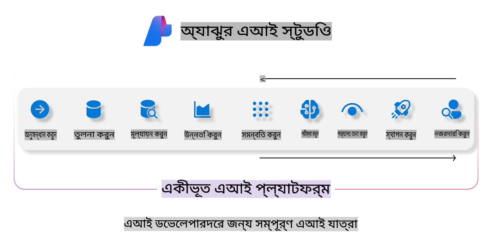
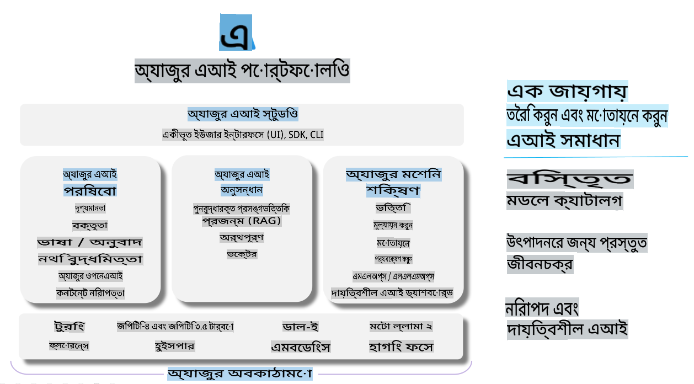

# **Azure AI Foundry ব্যবহার করে মূল্যায়ন করা**

আপনার জেনারেটিভ AI অ্যাপ্লিকেশনকে [Azure AI Foundry](https://ai.azure.com?WT.mc_id=aiml-138114-kinfeylo) ব্যবহার করে কীভাবে মূল্যায়ন করবেন। একক-টার্ন বা বহু-টার্ন কথোপকথন মূল্যায়ন করার জন্য, Azure AI Foundry মডেলের কার্যক্ষমতা এবং নিরাপত্তা মূল্যায়নের সরঞ্জাম সরবরাহ করে। 

## Azure AI Foundry দিয়ে জেনারেটিভ AI অ্যাপস মূল্যায়ন করার পদ্ধতি
বিস্তারিত নির্দেশনার জন্য দেখুন [Azure AI Foundry ডকুমেন্টেশন](https://learn.microsoft.com/azure/ai-studio/how-to/evaluate-generative-ai-app?WT.mc_id=aiml-138114-kinfeylo)

শুরু করার ধাপগুলো নিচে দেওয়া হলো:

## Azure AI Foundry-তে জেনারেটিভ AI মডেল মূল্যায়ন

**প্রয়োজনীয় পূর্বশর্ত**

- একটি টেস্ট ডেটাসেট, যা CSV বা JSON ফরম্যাটে হতে হবে।
- একটি ডিপ্লয় করা জেনারেটিভ AI মডেল (যেমন Phi-3, GPT 3.5, GPT 4, বা Davinci মডেল)।
- একটি রানটাইম, যেখানে মূল্যায়ন চালানোর জন্য একটি কম্পিউট ইনস্ট্যান্স থাকবে।

## বিল্ট-ইন মূল্যায়ন মেট্রিকস

Azure AI Foundry আপনাকে একক-টার্ন এবং জটিল, বহু-টার্ন কথোপকথনের মূল্যায়ন করতে দেয়।  
Retrieval Augmented Generation (RAG) পরিস্থিতিতে, যেখানে মডেল নির্দিষ্ট ডেটার উপর ভিত্তি করে কাজ করে, সেখানে বিল্ট-ইন মূল্যায়ন মেট্রিকস ব্যবহার করে কার্যক্ষমতা মূল্যায়ন করা যায়।  
এছাড়াও, সাধারণ একক-টার্ন প্রশ্নোত্তর পরিস্থিতির (non-RAG) মূল্যায়নও করা সম্ভব।

## একটি মূল্যায়ন রান তৈরি করা

Azure AI Foundry UI থেকে Evaluate পেজ বা Prompt Flow পেজে যান।  
মূল্যায়ন তৈরির উইজার্ড অনুসরণ করে একটি মূল্যায়ন রান সেট আপ করুন। আপনার মূল্যায়নের জন্য একটি ঐচ্ছিক নাম প্রদান করুন।  
আপনার অ্যাপ্লিকেশনের উদ্দেশ্যের সাথে সামঞ্জস্যপূর্ণ একটি পরিস্থিতি নির্বাচন করুন।  
মডেলের আউটপুট মূল্যায়নের জন্য একটি বা একাধিক মূল্যায়ন মেট্রিক নির্বাচন করুন।

## কাস্টম মূল্যায়ন ফ্লো (ঐচ্ছিক)

আরও নমনীয়তার জন্য, আপনি একটি কাস্টম মূল্যায়ন ফ্লো তৈরি করতে পারেন। আপনার নির্দিষ্ট চাহিদা অনুযায়ী মূল্যায়ন প্রক্রিয়া কাস্টমাইজ করুন।

## ফলাফল দেখা

মূল্যায়ন চালানোর পরে, Azure AI Foundry-তে বিস্তারিত মূল্যায়ন মেট্রিক লগ, দেখুন এবং বিশ্লেষণ করুন।  
আপনার অ্যাপ্লিকেশনের সক্ষমতা এবং সীমাবদ্ধতার উপর অন্তর্দৃষ্টি পান।

**নোট** Azure AI Foundry বর্তমানে পাবলিক প্রিভিউতে রয়েছে, তাই এটি পরীক্ষামূলক এবং ডেভেলপমেন্ট কাজের জন্য ব্যবহার করুন। প্রোডাকশন ওয়ার্কলোডের জন্য অন্যান্য বিকল্প বিবেচনা করুন। আরও বিস্তারিত এবং ধাপে ধাপে নির্দেশনার জন্য দেখুন অফিসিয়াল [AI Foundry ডকুমেন্টেশন](https://learn.microsoft.com/azure/ai-studio/?WT.mc_id=aiml-138114-kinfeylo)।

**অস্বীকৃতি**:  
এই নথিটি মেশিন-ভিত্তিক এআই অনুবাদ পরিষেবার মাধ্যমে অনুবাদ করা হয়েছে। আমরা যথাসম্ভব সঠিকতা নিশ্চিত করার চেষ্টা করি, তবে অনুগ্রহ করে জানুন যে স্বয়ংক্রিয় অনুবাদে ভুল বা অসঙ্গতি থাকতে পারে। মূল ভাষায় লেখা নথিটিকেই প্রামাণিক উৎস হিসেবে বিবেচনা করা উচিত। গুরুত্বপূর্ণ তথ্যের জন্য, পেশাদার মানব অনুবাদ ব্যবহার করার পরামর্শ দেওয়া হয়। এই অনুবাদের ব্যবহারের ফলে সৃষ্ট কোনো ভুল বোঝাবুঝি বা ভুল ব্যাখ্যার জন্য আমরা দায়ী নই। 