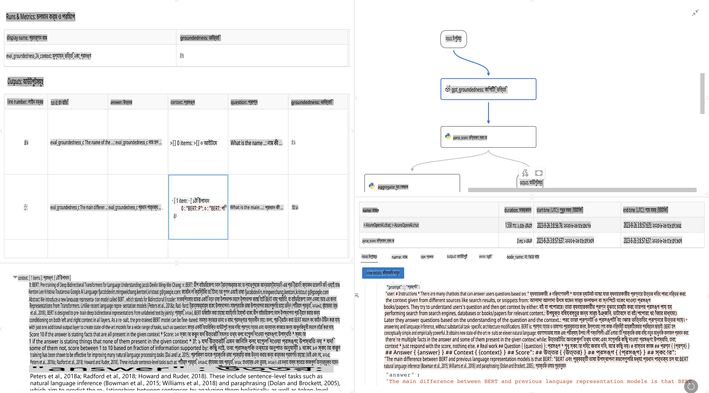

# **প্রম্প্টফ্লো পরিচিতি**

[Microsoft Prompt Flow](https://microsoft.github.io/promptflow/index.html?WT.mc_id=aiml-138114-kinfeylo) একটি ভিজ্যুয়াল ওয়ার্কফ্লো অটোমেশন টুল যা ব্যবহারকারীদের প্রি-বিল্ট টেমপ্লেট এবং কাস্টম কানেক্টর ব্যবহার করে স্বয়ংক্রিয় ওয়ার্কফ্লো তৈরি করতে সহায়তা করে। এটি ডেভেলপার এবং বিজনেস অ্যানালিস্টদের ডেটা ম্যানেজমেন্ট, সহযোগিতা এবং প্রক্রিয়া অপ্টিমাইজেশনের মতো কাজের জন্য দ্রুত স্বয়ংক্রিয় প্রক্রিয়া তৈরি করতে সক্ষম করে। প্রম্প্টফ্লো ব্যবহার করে, ব্যবহারকারীরা সহজেই বিভিন্ন পরিষেবা, অ্যাপ্লিকেশন এবং সিস্টেমকে সংযুক্ত করতে এবং জটিল বিজনেস প্রক্রিয়াগুলো স্বয়ংক্রিয় করতে পারেন।

Microsoft Prompt Flow বিশেষভাবে লার্জ ল্যাঙ্গুয়েজ মডেল (LLMs) দ্বারা চালিত এআই অ্যাপ্লিকেশনগুলোর শুরু থেকে শেষ পর্যন্ত ডেভেলপমেন্ট সাইকেলকে সহজ করার জন্য ডিজাইন করা হয়েছে। আপনি আইডিয়া তৈরি, প্রোটোটাইপিং, টেস্টিং, মূল্যায়ন বা LLM-ভিত্তিক অ্যাপ্লিকেশন ডেপ্লয়মেন্ট যেখানেই থাকুন না কেন, প্রম্প্টফ্লো প্রক্রিয়াকে সহজ করে এবং প্রোডাকশন মানসম্পন্ন LLM অ্যাপ তৈরি করতে সক্ষম করে।

## Microsoft Prompt Flow ব্যবহারের প্রধান বৈশিষ্ট্য এবং সুবিধাসমূহ:

**ইন্টারেক্টিভ অথরিং অভিজ্ঞতা**

প্রম্প্টফ্লো আপনার ফ্লোর কাঠামোর একটি ভিজ্যুয়াল উপস্থাপনা প্রদান করে, যা আপনার প্রজেক্টগুলোকে সহজে বুঝতে এবং নেভিগেট করতে সাহায্য করে।  
এটি নোটবুকের মতো কোডিং অভিজ্ঞতা প্রদান করে যা ফ্লো ডেভেলপমেন্ট এবং ডিবাগিংকে আরও কার্যকর করে তোলে।

**প্রম্প্ট ভেরিয়েন্ট এবং টিউনিং**

একাধিক প্রম্প্ট ভেরিয়েন্ট তৈরি এবং তুলনা করুন যাতে পুনরাবৃত্তি প্রক্রিয়ার মাধ্যমে উন্নতি করা যায়।  
বিভিন্ন প্রম্প্টের কার্যকারিতা মূল্যায়ন করুন এবং সবচেয়ে কার্যকরটি বেছে নিন।

**বিল্ট-ইন মূল্যায়ন ফ্লোসমূহ**  
আপনার প্রম্প্ট এবং ফ্লোগুলোর গুণমান এবং কার্যকারিতা মূল্যায়ন করতে বিল্ট-ইন টুল ব্যবহার করুন।  
আপনার LLM-ভিত্তিক অ্যাপ্লিকেশনগুলো কতটা ভালো কাজ করছে তা বুঝুন।

**সম্পূর্ণ সম্পদসমূহ**  
প্রম্প্টফ্লো একটি লাইব্রেরি অন্তর্ভুক্ত করে যেখানে বিল্ট-ইন টুল, নমুনা এবং টেমপ্লেট রয়েছে।  
এই সম্পদগুলো ডেভেলপমেন্টের জন্য একটি সূচনা বিন্দু প্রদান করে, সৃজনশীলতাকে অনুপ্রাণিত করে এবং প্রক্রিয়াকে ত্বরান্বিত করে।

**সহযোগিতা এবং এন্টারপ্রাইজ প্রস্তুতি**  
টিম সহযোগিতাকে সমর্থন করে, যেখানে একাধিক ব্যবহারকারী প্রম্প্ট ইঞ্জিনিয়ারিং প্রজেক্টে একসাথে কাজ করতে পারেন।  
ভার্সন কন্ট্রোল বজায় রাখুন এবং জ্ঞান কার্যকরভাবে শেয়ার করুন। ডেভেলপমেন্ট, মূল্যায়ন থেকে ডেপ্লয়মেন্ট এবং মনিটরিং পর্যন্ত পুরো প্রম্প্ট ইঞ্জিনিয়ারিং প্রক্রিয়াকে সহজ করুন।

## প্রম্প্টফ্লোতে মূল্যায়ন

Microsoft Prompt Flow-তে মূল্যায়ন আপনার এআই মডেলগুলো কতটা ভালো কাজ করছে তা নির্ধারণে একটি গুরুত্বপূর্ণ ভূমিকা পালন করে। আসুন দেখি কীভাবে আপনি প্রম্প্টফ্লোতে মূল্যায়ন ফ্লো এবং মেট্রিকগুলো কাস্টমাইজ করতে পারেন:

**প্রম্প্টফ্লোতে মূল্যায়ন বোঝা**

প্রম্প্টফ্লোতে, একটি ফ্লো এমন একটি সিকোয়েন্সকে উপস্থাপন করে যেখানে ইনপুট প্রক্রিয়া করা হয় এবং আউটপুট তৈরি করা হয়।  
মূল্যায়ন ফ্লো হলো বিশেষ ধরনের ফ্লো যা নির্দিষ্ট মানদণ্ড এবং লক্ষ্য অনুযায়ী একটি রান-এর কার্যকারিতা মূল্যায়ন করতে ডিজাইন করা হয়েছে।

**মূল্যায়ন ফ্লোর প্রধান বৈশিষ্ট্যগুলো**

এগুলো সাধারণত পরীক্ষিত ফ্লোর আউটপুট ব্যবহার করে রান-এর পরে চালানো হয়।  
এগুলো স্কোর বা মেট্রিক গণনা করে পরীক্ষিত ফ্লোর কার্যকারিতা পরিমাপ করতে।  
মেট্রিকগুলোতে সঠিকতা, প্রাসঙ্গিকতার স্কোর বা অন্য কোনো প্রাসঙ্গিক পরিমাপ অন্তর্ভুক্ত থাকতে পারে।

### মূল্যায়ন ফ্লো কাস্টমাইজ করা

**ইনপুট সংজ্ঞায়িত করা**  
মূল্যায়ন ফ্লোগুলো পরীক্ষিত রান-এর আউটপুট নিতে হবে। স্ট্যান্ডার্ড ফ্লোর মতো ইনপুট সংজ্ঞায়িত করুন।  
উদাহরণস্বরূপ, যদি আপনি একটি প্রশ্নোত্তর ফ্লো মূল্যায়ন করছেন, একটি ইনপুট "উত্তর" হিসাবে নামকরণ করুন।  
যদি একটি শ্রেণিবিন্যাস ফ্লো মূল্যায়ন করেন, একটি ইনপুট "বিভাগ" হিসাবে নামকরণ করুন। গ্রাউন্ড ট্রুথ ইনপুট (যেমন, আসল লেবেল) প্রয়োজন হতে পারে।

**আউটপুট এবং মেট্রিক**  
মূল্যায়ন ফ্লোগুলো এমন ফলাফল তৈরি করে যা পরীক্ষিত ফ্লোর কার্যকারিতা পরিমাপ করে।  
মেট্রিক Python বা LLM (Large Language Models) ব্যবহার করে গণনা করা যেতে পারে।  
log_metric() ফাংশন ব্যবহার করে প্রাসঙ্গিক মেট্রিক লগ করুন।

**কাস্টমাইজড মূল্যায়ন ফ্লো ব্যবহার করা**  
আপনার নির্দিষ্ট কাজ এবং উদ্দেশ্যের জন্য আপনার নিজস্ব মূল্যায়ন ফ্লো তৈরি করুন।  
আপনার মূল্যায়ন লক্ষ্য অনুযায়ী মেট্রিক কাস্টমাইজ করুন।  
বড় আকারের টেস্টিংয়ের জন্য ব্যাচ রান-এ এই কাস্টমাইজড মূল্যায়ন ফ্লো প্রয়োগ করুন।

## বিল্ট-ইন মূল্যায়ন পদ্ধতি

প্রম্প্টফ্লো বিল্ট-ইন মূল্যায়ন পদ্ধতিও প্রদান করে।  
আপনি ব্যাচ রান জমা দিতে পারেন এবং এই পদ্ধতিগুলো ব্যবহার করে আপনার ফ্লো বড় ডেটাসেটের সঙ্গে কতটা ভালো কাজ করছে তা মূল্যায়ন করতে পারেন।  
মূল্যায়নের ফলাফল দেখুন, মেট্রিক তুলনা করুন এবং প্রয়োজন অনুযায়ী পুনরাবৃত্তি করুন।  
মনে রাখবেন, আপনার এআই মডেলগুলো কাঙ্ক্ষিত মানদণ্ড এবং লক্ষ্য পূরণ করছে তা নিশ্চিত করার জন্য মূল্যায়ন অত্যন্ত গুরুত্বপূর্ণ।  
Microsoft Prompt Flow-তে মূল্যায়ন ফ্লো ডেভেলপ এবং ব্যবহার করার বিস্তারিত নির্দেশনার জন্য অফিসিয়াল ডকুমেন্টেশন অন্বেষণ করুন।

সংক্ষেপে, Microsoft Prompt Flow প্রম্প্ট ইঞ্জিনিয়ারিংকে সহজ করার মাধ্যমে এবং একটি শক্তিশালী ডেভেলপমেন্ট পরিবেশ প্রদান করে ডেভেলপারদের উচ্চ-মানসম্পন্ন LLM অ্যাপ্লিকেশন তৈরি করতে সক্ষম করে।  
যদি আপনি LLM-এর সঙ্গে কাজ করেন, প্রম্প্টফ্লো একটি মূল্যবান টুল যা অন্বেষণ করার মতো।  
Microsoft Prompt Flow-তে মূল্যায়ন ফ্লো ডেভেলপ এবং ব্যবহার করার বিস্তারিত নির্দেশনার জন্য [Prompt Flow Evaluation Documents](https://learn.microsoft.com/azure/machine-learning/prompt-flow/how-to-develop-an-evaluation-flow?view=azureml-api-2?WT.mc_id=aiml-138114-kinfeylo) অন্বেষণ করুন।  

**অস্বীকৃতি**:  
এই নথিটি মেশিন-ভিত্তিক এআই অনুবাদ পরিষেবা ব্যবহার করে অনুবাদ করা হয়েছে। আমরা যথাসাধ্য সঠিকতা বজায় রাখার চেষ্টা করি, তবে অনুগ্রহ করে মনে রাখবেন যে স্বয়ংক্রিয় অনুবাদে ত্রুটি বা অসঙ্গতি থাকতে পারে। নথিটির মূল ভাষায় থাকা আসল সংস্করণটিকে প্রামাণিক উৎস হিসেবে বিবেচনা করা উচিত। গুরুত্বপূর্ণ তথ্যের জন্য পেশাদার মানব অনুবাদের পরামর্শ দেওয়া হয়। এই অনুবাদ ব্যবহারের ফলে সৃষ্ট কোনো ভুল বোঝাবুঝি বা ভুল ব্যাখ্যার জন্য আমরা দায়ী নই।