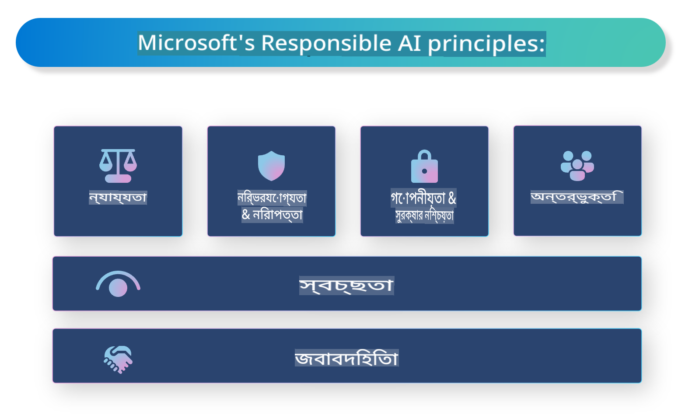

# **দায়িত্বশীল এআই-এর পরিচিতি**

[Microsoft Responsible AI](https://www.microsoft.com/ai/responsible-ai?WT.mc_id=aiml-138114-kinfeylo) একটি উদ্যোগ যা ডেভেলপার এবং প্রতিষ্ঠানগুলোকে স্বচ্ছ, বিশ্বাসযোগ্য এবং দায়িত্বশীল এআই সিস্টেম তৈরি করতে সাহায্য করে। এই উদ্যোগটি নৈতিক নীতিমালা যেমন গোপনীয়তা, ন্যায্যতা এবং স্বচ্ছতার সাথে সামঞ্জস্য রেখে দায়িত্বশীল এআই সমাধান বিকাশের জন্য নির্দেশিকা এবং সম্পদ প্রদান করে। আমরা দায়িত্বশীল এআই সিস্টেম তৈরির সাথে সম্পর্কিত কিছু চ্যালেঞ্জ এবং সেরা অনুশীলন নিয়েও আলোচনা করব।

## Microsoft Responsible AI-এর ওভারভিউ

**নৈতিক নীতিমালা**

Microsoft Responsible AI গোপনীয়তা, ন্যায্যতা, স্বচ্ছতা, দায়িত্বশীলতা এবং নিরাপত্তার মতো নৈতিক নীতিমালার উপর ভিত্তি করে পরিচালিত হয়। এই নীতিগুলো নিশ্চিত করে যে এআই সিস্টেম নৈতিক এবং দায়িত্বশীল উপায়ে বিকশিত হচ্ছে।

**স্বচ্ছ এআই**

Microsoft Responsible AI এআই সিস্টেমের স্বচ্ছতার উপর জোর দেয়। এর মধ্যে রয়েছে এআই মডেল কীভাবে কাজ করে তার স্পষ্ট ব্যাখ্যা প্রদান করা, এবং ডেটার উৎস এবং অ্যালগরিদমগুলোকে সর্বসাধারণের জন্য উন্মুক্ত রাখা।

**দায়িত্বশীল এআই**

[Microsoft Responsible AI](https://www.microsoft.com/ai/responsible-ai?WT.mc_id=aiml-138114-kinfeylo) দায়িত্বশীল এআই সিস্টেম তৈরির প্রচার করে, যা এআই মডেলগুলো কীভাবে সিদ্ধান্ত নেয় তা সম্পর্কে অন্তর্দৃষ্টি প্রদান করতে পারে। এটি ব্যবহারকারীদের এআই সিস্টেমের আউটপুট বুঝতে এবং বিশ্বাস করতে সাহায্য করে।

**অন্তর্ভুক্তিমূলকতা**

এআই সিস্টেমগুলো সবার উপকারে আসার জন্য ডিজাইন করা উচিত। Microsoft এমন অন্তর্ভুক্তিমূলক এআই তৈরি করতে চায় যা বিভিন্ন দৃষ্টিভঙ্গি বিবেচনা করে এবং পক্ষপাত বা বৈষম্য এড়ায়।

**বিশ্বাসযোগ্যতা এবং নিরাপত্তা**

এআই সিস্টেমের বিশ্বাসযোগ্যতা এবং নিরাপত্তা নিশ্চিত করা অত্যন্ত গুরুত্বপূর্ণ। Microsoft শক্তিশালী মডেল তৈরি করার উপর মনোযোগ দেয় যা ধারাবাহিকভাবে কাজ করে এবং ক্ষতিকর ফলাফল এড়ায়।

**এআই-তে ন্যায্যতা**

Microsoft Responsible AI স্বীকার করে যে পক্ষপাতযুক্ত ডেটা বা অ্যালগরিদমে প্রশিক্ষিত হলে এআই সিস্টেমগুলো পক্ষপাতকে ধরে রাখতে পারে। এই উদ্যোগ ন্যায্য এআই সিস্টেম তৈরি করার জন্য নির্দেশিকা প্রদান করে যা জাতি, লিঙ্গ বা বয়সের মতো কারণের ভিত্তিতে বৈষম্য করে না।

**গোপনীয়তা এবং নিরাপত্তা**

Microsoft Responsible AI এআই সিস্টেমে ব্যবহারকারীর গোপনীয়তা এবং ডেটা সুরক্ষা রক্ষার গুরুত্বের উপর জোর দেয়। এর মধ্যে রয়েছে শক্তিশালী ডেটা এনক্রিপশন এবং অ্যাক্সেস নিয়ন্ত্রণ প্রয়োগ করা, পাশাপাশি নিয়মিতভাবে এআই সিস্টেমের দুর্বলতাগুলো পরীক্ষা করা।

**দায়িত্ব এবং জবাবদিহিতা**

Microsoft Responsible AI এআই বিকাশ এবং স্থাপনার ক্ষেত্রে দায়িত্ব এবং জবাবদিহিতা প্রচার করে। এর মধ্যে রয়েছে ডেভেলপার এবং প্রতিষ্ঠানগুলোকে এআই সিস্টেমের সাথে সম্পর্কিত সম্ভাব্য ঝুঁকিগুলো সম্পর্কে সচেতন করা এবং সেই ঝুঁকিগুলো হ্রাস করার পদক্ষেপ নেওয়া।

## দায়িত্বশীল এআই সিস্টেম তৈরির সেরা অনুশীলন

**বিভিন্ন ডেটাসেট ব্যবহার করে এআই মডেল তৈরি করুন**

এআই সিস্টেমে পক্ষপাত এড়ানোর জন্য বিভিন্ন দৃষ্টিভঙ্গি এবং অভিজ্ঞতা উপস্থাপন করে এমন ডেটাসেট ব্যবহার করা গুরুত্বপূর্ণ।

**ব্যাখ্যাযোগ্য এআই কৌশল ব্যবহার করুন**

ব্যাখ্যাযোগ্য এআই কৌশল ব্যবহারকারীদের এআই মডেল কীভাবে সিদ্ধান্ত নেয় তা বুঝতে সাহায্য করতে পারে, যা সিস্টেমের প্রতি বিশ্বাস বাড়াতে পারে।

**নিয়মিত এআই সিস্টেমের দুর্বলতা পরীক্ষা করুন**

এআই সিস্টেমের নিয়মিত অডিট ঝুঁকি এবং দুর্বলতা সনাক্ত করতে সাহায্য করতে পারে যা সমাধান করা প্রয়োজন।

**শক্তিশালী ডেটা এনক্রিপশন এবং অ্যাক্সেস নিয়ন্ত্রণ প্রয়োগ করুন**

ডেটা এনক্রিপশন এবং অ্যাক্সেস নিয়ন্ত্রণ এআই সিস্টেমে ব্যবহারকারীর গোপনীয়তা এবং নিরাপত্তা রক্ষায় সাহায্য করতে পারে।

**এআই বিকাশে নৈতিক নীতিমালা অনুসরণ করুন**

ন্যায্যতা, স্বচ্ছতা এবং দায়িত্বশীলতার মতো নৈতিক নীতিমালা অনুসরণ এআই সিস্টেমে বিশ্বাস তৈরি করতে এবং তা দায়িত্বশীল উপায়ে বিকাশ নিশ্চিত করতে সাহায্য করতে পারে।

## দায়িত্বশীল এআই-এর জন্য AI Foundry ব্যবহার

[Azure AI Foundry](https://ai.azure.com?WT.mc_id=aiml-138114-kinfeylo) একটি শক্তিশালী প্ল্যাটফর্ম যা ডেভেলপার এবং প্রতিষ্ঠানগুলোকে দ্রুত বুদ্ধিমান, সর্বাধুনিক, বাজার-প্রস্তুত এবং দায়িত্বশীল অ্যাপ্লিকেশন তৈরি করতে দেয়। Azure AI Foundry-এর কিছু প্রধান বৈশিষ্ট্য এবং সক্ষমতা নিচে দেওয়া হলো:

**প্রি-বিল্ট এপিআই এবং মডেল**

Azure AI Foundry পূর্বনির্মিত এবং কাস্টমাইজযোগ্য এপিআই এবং মডেল সরবরাহ করে। এগুলো এআই কাজের বিস্তৃত ক্ষেত্র কভার করে, যেমন জেনারেটিভ এআই, কথোপকথনের জন্য প্রাকৃতিক ভাষা প্রক্রিয়াকরণ, অনুসন্ধান, মনিটরিং, অনুবাদ, বক্তৃতা, ভিশন এবং সিদ্ধান্ত গ্রহণ।

**প্রম্পট ফ্লো**

Azure AI Foundry-তে প্রম্পট ফ্লো আপনাকে কথোপকথনমূলক এআই অভিজ্ঞতা তৈরি করতে সক্ষম করে। এটি আপনাকে কথোপকথনের প্রবাহ ডিজাইন এবং পরিচালনা করতে দেয়, যা চ্যাটবট, ভার্চুয়াল অ্যাসিস্ট্যান্ট এবং অন্যান্য ইন্টারেক্টিভ অ্যাপ্লিকেশন তৈরি করা সহজ করে তোলে।

**রিট্রিভাল অগমেন্টেড জেনারেশন (RAG)**

RAG একটি কৌশল যা রিট্রিভাল-ভিত্তিক এবং জেনারেটিভ-ভিত্তিক পদ্ধতির সংমিশ্রণ করে। এটি বিদ্যমান জ্ঞান (রিট্রিভাল) এবং সৃজনশীল প্রজন্ম (জেনারেশন) উভয়ই ব্যবহার করে উৎপন্ন প্রতিক্রিয়ার মান উন্নত করে।

**জেনারেটিভ এআই-এর জন্য মূল্যায়ন এবং মনিটরিং মেট্রিক্স**

Azure AI Foundry জেনারেটিভ এআই মডেল মূল্যায়ন এবং মনিটর করার জন্য সরঞ্জাম সরবরাহ করে। আপনি তাদের কার্যকারিতা, ন্যায্যতা এবং অন্যান্য গুরুত্বপূর্ণ মেট্রিক্স মূল্যায়ন করতে পারেন দায়িত্বশীল স্থাপন নিশ্চিত করার জন্য। এছাড়াও, যদি আপনি একটি ড্যাশবোর্ড তৈরি করে থাকেন, তাহলে আপনি Azure Machine Learning Studio-তে নো-কোড UI ব্যবহার করে Responsible AI Dashboard এবং সংশ্লিষ্ট স্কোরকার্ড তৈরি এবং কাস্টমাইজ করতে পারেন, যা [Responsible AI Toolbox](https://responsibleaitoolbox.ai/?WT.mc_id=aiml-138114-kinfeylo) পাইথন লাইব্রেরির উপর ভিত্তি করে। এই স্কোরকার্ড আপনাকে ন্যায্যতা, ফিচারের গুরুত্ব এবং অন্যান্য দায়িত্বশীল স্থাপনার বিষয়গুলো সম্পর্কিত গুরুত্বপূর্ণ অন্তর্দৃষ্টি প্রযুক্তিগত এবং অ-প্রযুক্তিগত উভয় স্টেকহোল্ডারের সাথে শেয়ার করতে সাহায্য করে।

দায়িত্বশীল এআই-এর জন্য AI Foundry ব্যবহার করতে, আপনি নিম্নলিখিত সেরা অনুশীলনগুলো অনুসরণ করতে পারেন:

**আপনার এআই সিস্টেমের সমস্যা এবং উদ্দেশ্য নির্ধারণ করুন**

বিকাশ প্রক্রিয়া শুরু করার আগে, আপনার এআই সিস্টেম কোন সমস্যা সমাধান করতে চায় বা কোন উদ্দেশ্য পূরণ করতে চায় তা স্পষ্টভাবে নির্ধারণ করা গুরুত্বপূর্ণ। এটি আপনাকে কার্যকর মডেল তৈরি করতে প্রয়োজনীয় ডেটা, অ্যালগরিদম এবং সম্পদ চিহ্নিত করতে সাহায্য করবে।

**প্রাসঙ্গিক ডেটা সংগ্রহ এবং প্রিপ্রসেস করুন**

এআই সিস্টেমের প্রশিক্ষণে ব্যবহৃত ডেটার গুণমান এবং পরিমাণ এর কার্যকারিতার উপর উল্লেখযোগ্য প্রভাব ফেলে। তাই প্রাসঙ্গিক ডেটা সংগ্রহ, পরিষ্কার করা, প্রিপ্রসেস করা এবং তা আপনার সমাধান করতে চাওয়া সমস্যা বা জনসংখ্যার প্রতিনিধিত্ব করছে তা নিশ্চিত করা গুরুত্বপূর্ণ।

**উপযুক্ত মূল্যায়ন নির্বাচন করুন**

বিভিন্ন মূল্যায়ন অ্যালগরিদম উপলব্ধ রয়েছে। আপনার ডেটা এবং সমস্যার ভিত্তিতে সবচেয়ে উপযুক্ত অ্যালগরিদম নির্বাচন করা গুরুত্বপূর্ণ।

**মডেল মূল্যায়ন এবং ব্যাখ্যা করুন**

একটি এআই মডেল তৈরি করার পরে, এর কার্যকারিতা উপযুক্ত মেট্রিক্স ব্যবহার করে মূল্যায়ন করা এবং ফলাফল স্বচ্ছভাবে ব্যাখ্যা করা গুরুত্বপূর্ণ। এটি আপনাকে মডেলের যেকোনো পক্ষপাত বা সীমাবদ্ধতা চিহ্নিত করতে এবং যেখানে প্রয়োজন সেখানে উন্নতি করতে সাহায্য করবে।

**স্বচ্ছতা এবং ব্যাখ্যাযোগ্যতা নিশ্চিত করুন**

এআই সিস্টেম স্বচ্ছ এবং ব্যাখ্যাযোগ্য হওয়া উচিত যাতে ব্যবহারকারীরা বুঝতে পারেন এটি কীভাবে কাজ করে এবং কীভাবে সিদ্ধান্ত নেয়। এটি বিশেষভাবে গুরুত্বপূর্ণ সেই অ্যাপ্লিকেশনের জন্য যা মানুষের জীবনে গুরুত্বপূর্ণ প্রভাব ফেলে, যেমন স্বাস্থ্যসেবা, আর্থিক এবং আইনগত সিস্টেম।

**মডেল পর্যবেক্ষণ এবং আপডেট করুন**

এআই সিস্টেমগুলোকে সঠিক এবং কার্যকর রাখতে নিয়মিত পর্যবেক্ষণ এবং আপডেট করা উচিত। এর জন্য চলমান রক্ষণাবেক্ষণ, পরীক্ষা এবং মডেলের পুনঃপ্রশিক্ষণ প্রয়োজন।

সংক্ষেপে, Microsoft Responsible AI একটি উদ্যোগ যা ডেভেলপার এবং প্রতিষ্ঠানগুলোকে স্বচ্ছ, বিশ্বাসযোগ্য এবং দায়িত্বশীল এআই সিস্টেম তৈরি করতে সাহায্য করে। মনে রাখবেন যে দায়িত্বশীল এআই বাস্তবায়ন অত্যন্ত গুরুত্বপূর্ণ, এবং Azure AI Foundry এটি প্রতিষ্ঠানের জন্য ব্যবহারিক করে তুলতে চায়। নৈতিক নীতিমালা এবং সেরা অনুশীলন অনুসরণ করে, আমরা নিশ্চিত করতে পারি যে এআই সিস্টেমগুলো দায়িত্বশীল উপায়ে বিকশিত এবং স্থাপন করা হয়েছে যা পুরো সমাজের জন্য উপকারী।

**অস্বীকৃতি**:  
এই নথিটি মেশিন-ভিত্তিক এআই অনুবাদ পরিষেবা ব্যবহার করে অনুবাদ করা হয়েছে। আমরা যথাসাধ্য সঠিকতা বজায় রাখার চেষ্টা করি, তবে অনুগ্রহ করে মনে রাখবেন যে স্বয়ংক্রিয় অনুবাদে ভুল বা অসঙ্গতি থাকতে পারে। নথিটির মূল ভাষায় থাকা সংস্করণটিকে প্রামাণিক উৎস হিসেবে বিবেচনা করা উচিত। গুরুত্বপূর্ণ তথ্যের জন্য, পেশাদার মানব অনুবাদ সুপারিশ করা হয়। এই অনুবাদের ব্যবহারের ফলে সৃষ্ট কোনো ভুল বোঝাবুঝি বা ভুল ব্যাখ্যার জন্য আমরা দায়ী থাকব না।