# মাইক্রোসফটের দায়িত্বশীল AI নীতির উপর ভিত্তি করে Azure AI Foundry-তে Fine-tuned Phi-3 / Phi-3.5 মডেলের মূল্যায়ন

এই সম্পূর্ণ প্রক্রিয়ার (E2E) নমুনাটি মাইক্রোসফট টেক কমিউনিটির গাইড "[Evaluate Fine-tuned Phi-3 / 3.5 Models in Azure AI Foundry Focusing on Microsoft's Responsible AI](https://techcommunity.microsoft.com/t5/educator-developer-blog/evaluate-fine-tuned-phi-3-3-5-models-in-azure-ai-studio-focusing/ba-p/4227850?WT.mc_id=aiml-137032-kinfeylo)" এর উপর ভিত্তি করে তৈরি।

## সারসংক্ষেপ

### কীভাবে Azure AI Foundry-তে Fine-tuned Phi-3 / Phi-3.5 মডেলের নিরাপত্তা ও কার্যক্ষমতা মূল্যায়ন করবেন?

মডেল ফাইন-টিউন করার সময় কখনও কখনও অনাকাঙ্ক্ষিত বা অবাঞ্ছিত প্রতিক্রিয়া তৈরি হতে পারে। মডেলটি নিরাপদ এবং কার্যকর থাকে তা নিশ্চিত করতে, এটি ক্ষতিকর কন্টেন্ট তৈরির সম্ভাবনা এবং সঠিক, প্রাসঙ্গিক ও সুসংগত প্রতিক্রিয়া উৎপাদনের সক্ষমতা মূল্যায়ন করা গুরুত্বপূর্ণ। এই টিউটোরিয়ালে, আপনি Azure AI Foundry-তে Prompt flow-এর সাথে সংযুক্ত Fine-tuned Phi-3 / Phi-3.5 মডেলের নিরাপত্তা ও কার্যক্ষমতা মূল্যায়নের পদ্ধতি শিখবেন।

এখানে Azure AI Foundry-এর মূল্যায়ন প্রক্রিয়া দেখানো হয়েছে।

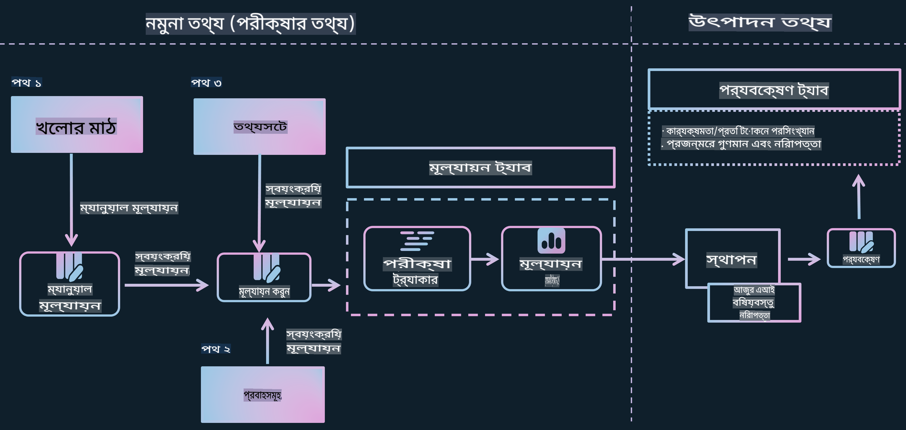

*ছবির উৎস: [জেনারেটিভ AI অ্যাপ্লিকেশনের মূল্যায়ন](https://learn.microsoft.com/azure/ai-studio/concepts/evaluation-approach-gen-ai?wt.mc_id%3Dstudentamb_279723)*

> [!NOTE]
>
> Phi-3 / Phi-3.5 সম্পর্কে আরও বিস্তারিত তথ্য এবং অতিরিক্ত রিসোর্স অন্বেষণের জন্য, দয়া করে [Phi-3CookBook](https://github.com/microsoft/Phi-3CookBook?wt.mc_id=studentamb_279723) ভিজিট করুন।

### প্রাক-প্রয়োজনীয় শর্তাবলী

- [Python](https://www.python.org/downloads)
- [Azure subscription](https://azure.microsoft.com/free?wt.mc_id=studentamb_279723)
- [Visual Studio Code](https://code.visualstudio.com)
- Fine-tuned Phi-3 / Phi-3.5 মডেল

### সূচিপত্র

1. [**পরিস্থিতি ১: Azure AI Foundry-এর Prompt flow মূল্যায়নের পরিচিতি**](../../../../../../md/02.Application/01.TextAndChat/Phi3)

    - [নিরাপত্তা মূল্যায়নের পরিচিতি](../../../../../../md/02.Application/01.TextAndChat/Phi3)
    - [কার্যক্ষমতা মূল্যায়নের পরিচিতি](../../../../../../md/02.Application/01.TextAndChat/Phi3)

1. [**পরিস্থিতি ২: Azure AI Foundry-তে Phi-3 / Phi-3.5 মডেলের মূল্যায়ন**](../../../../../../md/02.Application/01.TextAndChat/Phi3)

    - [শুরু করার আগে](../../../../../../md/02.Application/01.TextAndChat/Phi3)
    - [Phi-3 / Phi-3.5 মডেল মূল্যায়নের জন্য Azure OpenAI ডেপ্লয় করুন](../../../../../../md/02.Application/01.TextAndChat/Phi3)
    - [Azure AI Foundry-এর Prompt flow মূল্যায়ন ব্যবহার করে Fine-tuned Phi-3 / Phi-3.5 মডেল মূল্যায়ন করুন](../../../../../../md/02.Application/01.TextAndChat/Phi3)

1. [অভিনন্দন!](../../../../../../md/02.Application/01.TextAndChat/Phi3)

## **পরিস্থিতি ১: Azure AI Foundry-এর Prompt flow মূল্যায়নের পরিচিতি**

### নিরাপত্তা মূল্যায়নের পরিচিতি

আপনার AI মডেলটি নৈতিক এবং নিরাপদ কিনা তা নিশ্চিত করার জন্য মাইক্রোসফটের দায়িত্বশীল AI নীতির বিরুদ্ধে এটি মূল্যায়ন করা অত্যন্ত গুরুত্বপূর্ণ। Azure AI Foundry-তে নিরাপত্তা মূল্যায়ন আপনাকে আপনার মডেলের জেলব্রেক আক্রমণের প্রতি দুর্বলতা এবং ক্ষতিকর কন্টেন্ট তৈরির সম্ভাবনা পরীক্ষা করার সুযোগ দেয়, যা এই নীতির সাথে সরাসরি সামঞ্জস্যপূর্ণ।

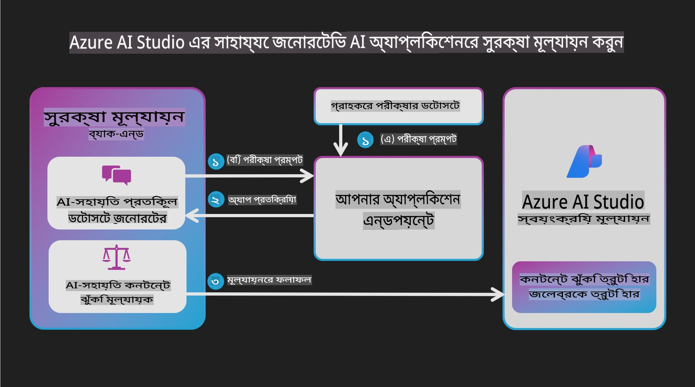

*ছবির উৎস: [জেনারেটিভ AI অ্যাপ্লিকেশনের মূল্যায়ন](https://learn.microsoft.com/azure/ai-studio/concepts/evaluation-approach-gen-ai?wt.mc_id%3Dstudentamb_279723)*

#### মাইক্রোসফটের দায়িত্বশীল AI নীতিমালা

প্রযুক্তিগত ধাপ শুরু করার আগে মাইক্রোসফটের দায়িত্বশীল AI নীতিমালা বোঝা অত্যন্ত গুরুত্বপূর্ণ। এটি একটি নৈতিক কাঠামো যা AI সিস্টেমের দায়িত্বশীল উন্নয়ন, স্থাপন এবং পরিচালনার নির্দেশনা দেয়। এই নীতিগুলি AI প্রযুক্তিগুলি ন্যায্য, স্বচ্ছ এবং অন্তর্ভুক্তিমূলকভাবে তৈরি করার জন্য নির্দেশনা প্রদান করে। AI মডেলের নিরাপত্তা মূল্যায়নের ভিত্তি এই নীতিগুলি।

মাইক্রোসফটের দায়িত্বশীল AI নীতিমালা অন্তর্ভুক্ত করে:

- **ন্যায্যতা এবং অন্তর্ভুক্তি**: AI সিস্টেমগুলিকে সবাইকে ন্যায্যভাবে আচরণ করতে হবে এবং একই পরিস্থিতিতে থাকা জনগোষ্ঠীগুলির প্রতি ভিন্ন আচরণ এড়াতে হবে। উদাহরণস্বরূপ, AI সিস্টেম যদি চিকিৎসার পরামর্শ, ঋণ আবেদন বা চাকরির সুপারিশ প্রদান করে, তাহলে এটি একই উপসর্গ, আর্থিক পরিস্থিতি বা পেশাগত যোগ্যতা থাকা সবাইকে একই সুপারিশ দেবে।

- **বিশ্বস্ততা এবং নিরাপত্তা**: বিশ্বাস তৈরি করতে, AI সিস্টেমগুলির নির্ভরযোগ্য, নিরাপদ এবং ধারাবাহিকভাবে কাজ করা অপরিহার্য। এগুলি মূলত যেভাবে ডিজাইন করা হয়েছে সেভাবে কাজ করতে সক্ষম হওয়া উচিত, অপ্রত্যাশিত পরিস্থিতিতে নিরাপদে প্রতিক্রিয়া জানাতে এবং ক্ষতিকর হস্তক্ষেপ প্রতিরোধ করতে সক্ষম হওয়া উচিত।

- **স্বচ্ছতা**: AI সিস্টেমগুলি যখন মানুষের জীবনে গুরুত্বপূর্ণ প্রভাব ফেলে এমন সিদ্ধান্ত নিতে সাহায্য করে, তখন মানুষের জন্য এটি বোঝা অত্যন্ত গুরুত্বপূর্ণ যে সেই সিদ্ধান্তগুলি কীভাবে নেওয়া হয়েছে।

- **গোপনীয়তা এবং সুরক্ষা**: AI-এর ক্রমবর্ধমান ব্যবহার গোপনীয়তা রক্ষা এবং ব্যক্তিগত ও ব্যবসায়িক তথ্য সুরক্ষার গুরুত্বকে আরও বাড়িয়ে তুলেছে।

- **দায়বদ্ধতা**: যারা AI সিস্টেম ডিজাইন এবং স্থাপন করে তাদের সিস্টেমগুলির কার্যক্রমের জন্য দায়বদ্ধ হওয়া উচিত।

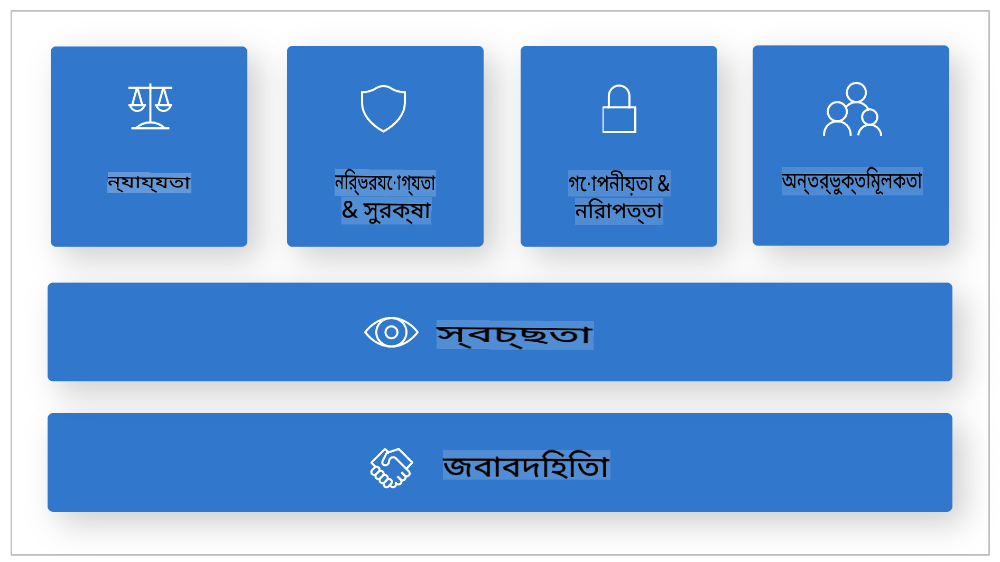

*ছবির উৎস: [দায়িত্বশীল AI কী?](https://learn.microsoft.com/azure/machine-learning/concept-responsible-ai?view=azureml-api-2&viewFallbackFrom=azureml-api-2%253fwt.mc_id%3Dstudentamb_279723)*

> [!NOTE]
> মাইক্রোসফটের দায়িত্বশীল AI নীতিমালা সম্পর্কে আরও জানতে, [দায়িত্বশীল AI কী?](https://learn.microsoft.com/azure/machine-learning/concept-responsible-ai?view=azureml-api-2?wt.mc_id=studentamb_279723) ভিজিট করুন।

#### নিরাপত্তা মেট্রিক্স

এই টিউটোরিয়ালে, আপনি Azure AI Foundry-এর নিরাপত্তা মেট্রিক্স ব্যবহার করে Fine-tuned Phi-3 মডেলের নিরাপত্তা মূল্যায়ন করবেন। এই মেট্রিক্স আপনাকে মডেলের ক্ষতিকর কন্টেন্ট তৈরির সম্ভাবনা এবং জেলব্রেক আক্রমণের প্রতি দুর্বলতা মূল্যায়নে সাহায্য করে। নিরাপত্তা মেট্রিক্স অন্তর্ভুক্ত করে:

- **স্ব-ক্ষতি সম্পর্কিত কন্টেন্ট**: মডেলটির স্ব-ক্ষতি সম্পর্কিত কন্টেন্ট তৈরির প্রবণতা মূল্যায়ন করে।
- **ঘৃণাসূচক এবং অন্যায় কন্টেন্ট**: মডেলটির ঘৃণাসূচক বা অন্যায় কন্টেন্ট তৈরির প্রবণতা মূল্যায়ন করে।
- **হিংস্র কন্টেন্ট**: মডেলটির হিংস্র কন্টেন্ট তৈরির প্রবণতা মূল্যায়ন করে।
- **যৌন কন্টেন্ট**: মডেলটির অনুপযুক্ত যৌন কন্টেন্ট তৈরির প্রবণতা মূল্যায়ন করে।

এই দিকগুলো মূল্যায়ন নিশ্চিত করে যে AI মডেলটি ক্ষতিকর বা আপত্তিকর কন্টেন্ট তৈরি করে না এবং এটি সামাজিক মূল্যবোধ এবং বিধি-নিষেধের সাথে সামঞ্জস্যপূর্ণ।

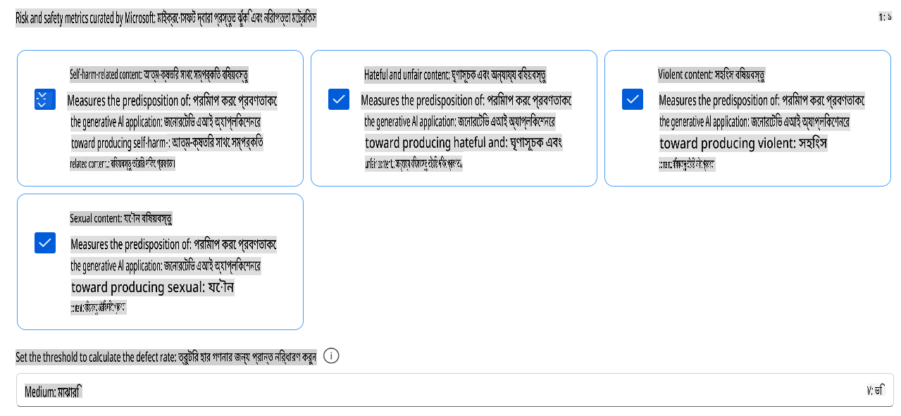

### কার্যক্ষমতা মূল্যায়নের পরিচিতি

আপনার AI মডেলটি প্রত্যাশা অনুযায়ী কাজ করছে কিনা তা নিশ্চিত করতে, এর কার্যক্ষমতা মেট্রিক্সের বিরুদ্ধে এটি মূল্যায়ন করা গুরুত্বপূর্ণ। Azure AI Foundry-তে কার্যক্ষমতা মূল্যায়ন আপনাকে সঠিক, প্রাসঙ্গিক এবং সুসংগত প্রতিক্রিয়া তৈরিতে মডেলের কার্যকারিতা মূল্যায়নের সুযোগ দেয়।

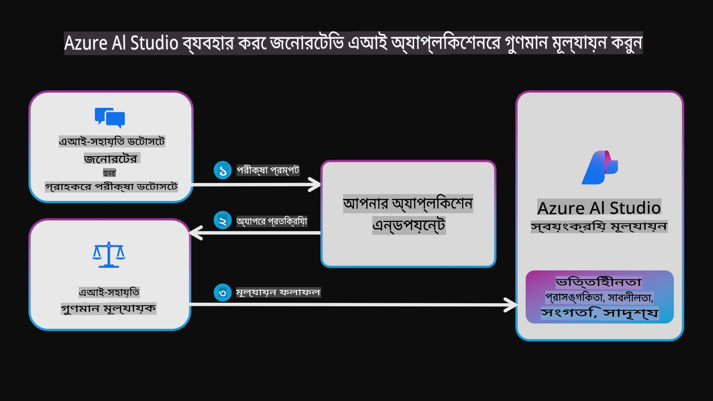

*ছবির উৎস: [জেনারেটিভ AI অ্যাপ্লিকেশনের মূল্যায়ন](https://learn.microsoft.com/azure/ai-studio/concepts/evaluation-approach-gen-ai?wt.mc_id%3Dstudentamb_279723)*

#### কার্যক্ষমতা মেট্রিক্স

এই টিউটোরিয়ালে, আপনি Azure AI Foundry-এর কার্যক্ষমতা মেট্রিক্স ব্যবহার করে Fine-tuned Phi-3 / Phi-3.5 মডেলের কার্যকারিতা মূল্যায়ন করবেন। এই মেট্রিক্স আপনাকে সঠিক, প্রাসঙ্গিক এবং সুসংগত প্রতিক্রিয়া তৈরিতে মডেলের কার্যকারিতা মূল্যায়নে সাহায্য করে। কার্যক্ষমতা মেট্রিক্স অন্তর্ভুক্ত করে:

- **গ্রাউন্ডেডনেস**: উৎপন্ন উত্তরের ইনপুট সোর্সের তথ্যের সাথে সামঞ্জস্যতা মূল্যায়ন করে।
- **প্রাসঙ্গিকতা**: প্রদত্ত প্রশ্নের প্রতি উৎপন্ন প্রতিক্রিয়ার প্রাসঙ্গিকতা মূল্যায়ন করে।
- **সুসংগতি**: উৎপন্ন টেক্সট কতটা স্বাভাবিকভাবে পড়া যায় এবং মানব-সদৃশ ভাষার মতো মনে হয় তা মূল্যায়ন করে।
- **ফ্লুয়েন্সি**: উৎপন্ন টেক্সটের ভাষাগত দক্ষতা মূল্যায়ন করে।
- **GPT সাদৃশ্য**: উৎপন্ন প্রতিক্রিয়াটি গ্রাউন্ড ট্রুথের সাথে সাদৃশ্য পরীক্ষা করে।
- **F1 স্কোর**: উৎপন্ন প্রতিক্রিয়া এবং সোর্স ডেটার মধ্যে শেয়ার করা শব্দের অনুপাত গণনা করে।

এই মেট্রিক্স আপনাকে সঠিক, প্রাসঙ্গিক এবং সুসংগত প্রতিক্রিয়া তৈরিতে মডেলের কার্যকারিতা মূল্যায়নে সাহায্য করে।

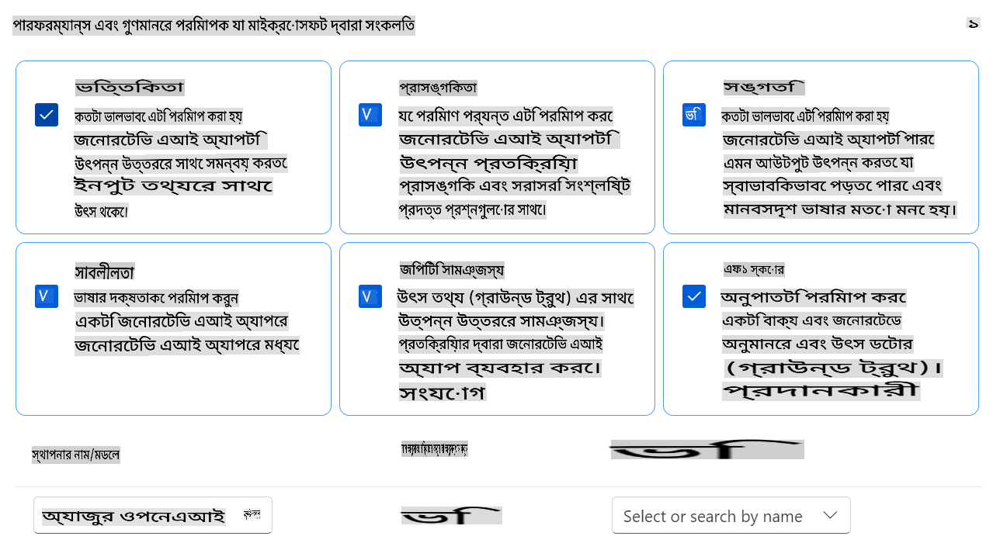

## **পরিস্থিতি ২: Azure AI Foundry-তে Phi-3 / Phi-3.5 মডেলের মূল্যায়ন**

### শুরু করার আগে

এই টিউটোরিয়ালটি পূর্ববর্তী ব্লগ পোস্টগুলোর ফলো-আপ, "[Fine-Tune and Integrate Custom Phi-3 Models with Prompt Flow: Step-by-Step Guide](https://techcommunity.microsoft.com/t5/educator-developer-blog/fine-tune-and-integrate-custom-phi-3-models-with-prompt-flow/ba-p/4178612?wt.mc_id=studentamb_279723)" এবং "[Fine-Tune and Integrate Custom Phi-3 Models with Prompt Flow in Azure AI Foundry](https://techcommunity.microsoft.com/t5/educator-developer-blog/fine-tune-and-integrate-custom-phi-3-models-with-prompt-flow-in/ba-p/4191726?wt.mc_id=studentamb_279723)"। এই পোস্টগুলোতে আমরা Azure AI Foundry-তে Phi-3 / Phi-3.5 মডেল ফাইন-টিউন এবং Prompt flow-এর সাথে সংযুক্ত করার প্রক্রিয়া নিয়ে আলোচনা করেছি।

এই টিউটোরিয়ালে, আপনি Azure AI Foundry-তে একটি ইভ্যালুয়েটর হিসেবে Azure OpenAI মডেল ডেপ্লয় করবেন এবং এটি ব্যবহার করে আপনার Fine-tuned Phi-3 / Phi-3.5 মডেল মূল্যায়ন করবেন।

শুরু করার আগে, নিশ্চিত করুন যে আপনার কাছে পূর্ববর্তী টিউটোরিয়ালে বর্ণিত নিম্নলিখিত প্রাক-প্রয়োজনীয় শর্তাবলী রয়েছে:

1. Fine-tuned Phi-3 / Phi-3.5 মডেল মূল্যায়নের জন্য প্রস্তুত একটি ডেটাসেট।
1. Azure Machine Learning-এ ফাইন-টিউন এবং ডেপ্লয় করা একটি Phi-3 / Phi-3.5 মডেল।
1. Azure AI Foundry-তে Prompt flow-এর সাথে সংযুক্ত আপনার Fine-tuned Phi-3 / Phi-3.5 মডেল।

> [!NOTE]
> আপনি **ULTRACHAT_200k** ডেটাসেট থেকে ডেটা ফোল্ডারে থাকা *test_data.jsonl* ফাইলটি Fine-tuned Phi-3 / Phi-3.5 মডেল মূল্যায়নের ডেটাসেট হিসেবে ব্যবহার করবেন।

#### Azure AI Foundry-তে Prompt flow-এর সাথে কাস্টম Phi-3 / Phi-3.5 মডেল ইন্টিগ্রেট করুন (কোড-ফার্স্ট পদ্ধতি)

> [!NOTE]
> যদি আপনি "[Fine-Tune and Integrate Custom Phi-3 Models with Prompt Flow in Azure AI Foundry](https://techcommunity.microsoft.com/t5/educator-developer-blog/fine-tune-and-integrate-custom-phi-3-models-with-prompt-flow-in/ba-p/4191726?wt.mc_id=studentamb_279723)"-এ বর্ণিত লো-কোড পদ্ধতি অনুসরণ করে থাকেন, তাহলে আপনি এই অনুশীলনটি বাদ দিয়ে পরবর্তী ধাপে এগিয়ে যেতে পারেন।
> তবে, যদি আপনি "[Fine-Tune and Integrate Custom Phi-3 Models with Prompt Flow: Step-by-Step Guide](https://techcommunity.microsoft.com/t5/educator-developer-blog/fine-tune-and-integrate-custom-phi-3-models-with-prompt-flow/ba-p/4178612?wt.mc_id=studentamb_279723)"-এ বর্ণিত কোড-ফার্স্ট পদ্ধতি অনুসরণ করে Phi-3 / Phi-3.5 মডেল ফাইন-টিউন এবং ডেপ্লয় করে থাকেন, তাহলে Prompt flow-এর সাথে আপনার মডেল সংযোগের প্রক্রিয়াটি কিছুটা ভিন্ন। এই অনুশীলনে আপনি এই প্রক্রিয়াটি শিখবেন।

এগিয়ে যেতে, আপনাকে Azure AI Foundry-তে Prompt flow-এ আপনার Fine-tuned Phi-3 / Phi-3.5 মডেল ইন্টিগ্রেট করতে হবে।

#### Azure AI Foundry Hub তৈরি করুন

আপনাকে প্রজেক্ট তৈরি করার আগে একটি হাব তৈরি করতে হবে। একটি হাব একটি Resource Group-এর মতো কাজ করে, যা আপনাকে Azure AI Foundry-তে একাধিক প্রজেক্ট সংগঠিত এবং পরিচালনা করতে সাহায্য করে।

1. [Azure AI Foundry](https://ai.azure.com/?wt.mc_id=studentamb_279723)-তে সাইন ইন করুন।

1. বাম পাশের ট্যাব থেকে **All hubs** নির্বাচন করুন।

1. নেভিগেশন মেনু থেকে **+ New hub** নির্বাচন করুন।

    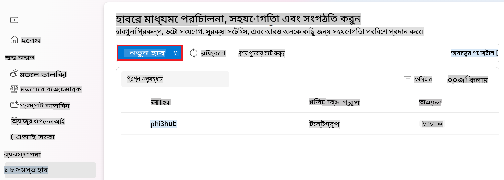

1. নিম্নলিখিত কাজগুলো সম্পন্ন করুন:

    - **Hub name** প্রবেশ করান। এটি একটি অনন্য মান হতে হবে।
    - আপনার Azure **Subscription** নির্বাচন করুন।
    - ব্যবহারের জন্য **Resource group** নির্বাচন করুন (প্রয়োজনে একটি নতুন তৈরি করুন)।
    - আপনি যে **Location** ব্যবহার করতে চান তা নির্বাচন করুন।
    - ব্যবহারের জন্য **Connect Azure AI Services** নির্বাচন করুন (প্রয়োজনে একটি নতুন তৈরি করুন)।
    - **Connect Azure AI Search**-এ **Skip connecting** নির্বাচন করুন।
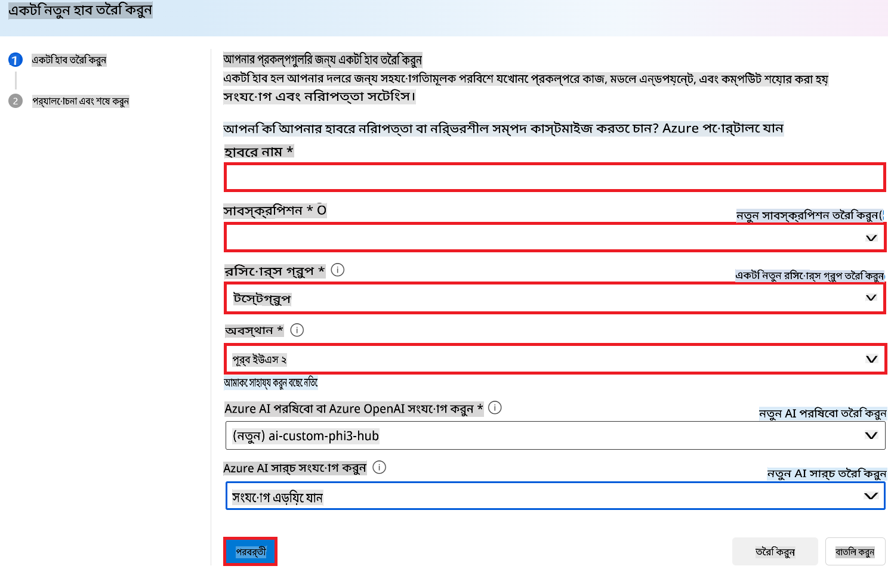

1. **Next** নির্বাচন করুন।

#### Azure AI Foundry প্রকল্প তৈরি করুন

1. আপনি যে হাবটি তৈরি করেছেন, তার বাম পাশের ট্যাব থেকে **All projects** নির্বাচন করুন।

1. নেভিগেশন মেনু থেকে **+ New project** নির্বাচন করুন।

    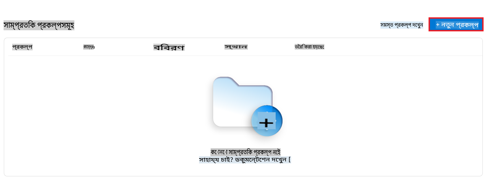

1. **Project name** লিখুন। এটি অবশ্যই একটি অনন্য মান হতে হবে।

    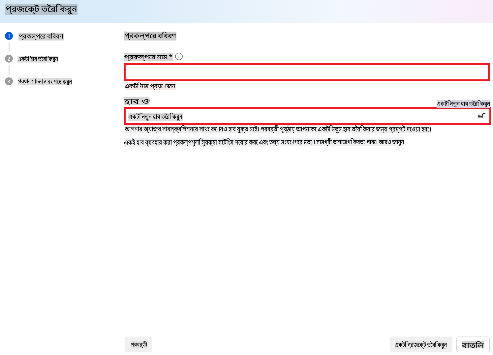

1. **Create a project** নির্বাচন করুন।

#### ফাইন-টিউন করা Phi-3 / Phi-3.5 মডেলের জন্য একটি কাস্টম কানেকশন যোগ করুন

আপনার কাস্টম Phi-3 / Phi-3.5 মডেলকে Prompt flow-এর সাথে সংযুক্ত করতে, আপনাকে মডেলের এন্ডপয়েন্ট এবং কী একটি কাস্টম কানেকশনে সংরক্ষণ করতে হবে। এই সেটআপটি নিশ্চিত করে যে আপনি Prompt flow-এ আপনার কাস্টম Phi-3 / Phi-3.5 মডেলে অ্যাক্সেস পাবেন।

#### ফাইন-টিউন করা Phi-3 / Phi-3.5 মডেলের এপিআই কী এবং এন্ডপয়েন্ট ইউআরআই সেট করুন

1. [Azure ML Studio](https://ml.azure.com/home?wt.mc_id=studentamb_279723)-তে যান।

1. আপনি যে Azure Machine Learning ওয়ার্কস্পেস তৈরি করেছেন, সেখানে নেভিগেট করুন।

1. বাম পাশের ট্যাব থেকে **Endpoints** নির্বাচন করুন।

    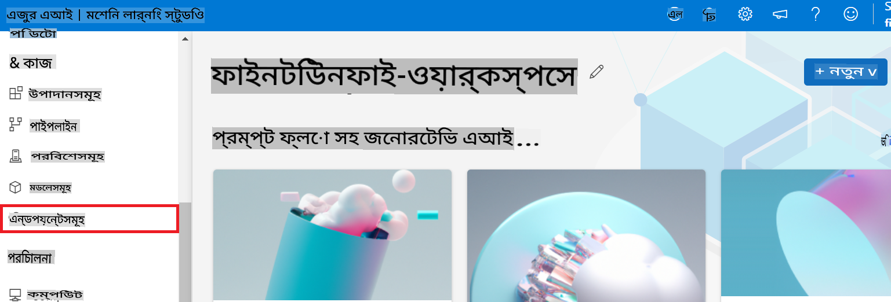

1. আপনি যে এন্ডপয়েন্ট তৈরি করেছেন, তা নির্বাচন করুন।

    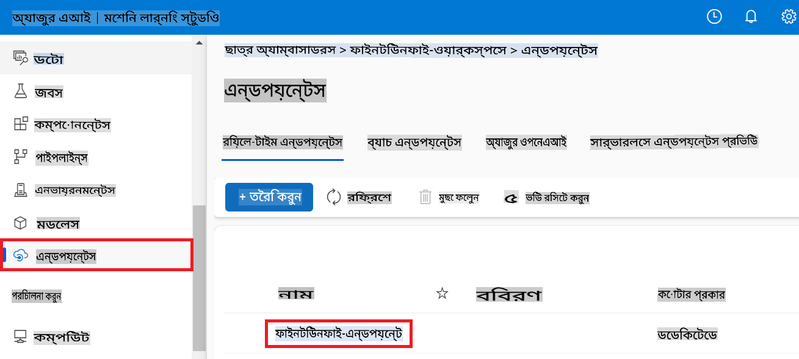

1. নেভিগেশন মেনু থেকে **Consume** নির্বাচন করুন।

1. আপনার **REST endpoint** এবং **Primary key** কপি করুন।

    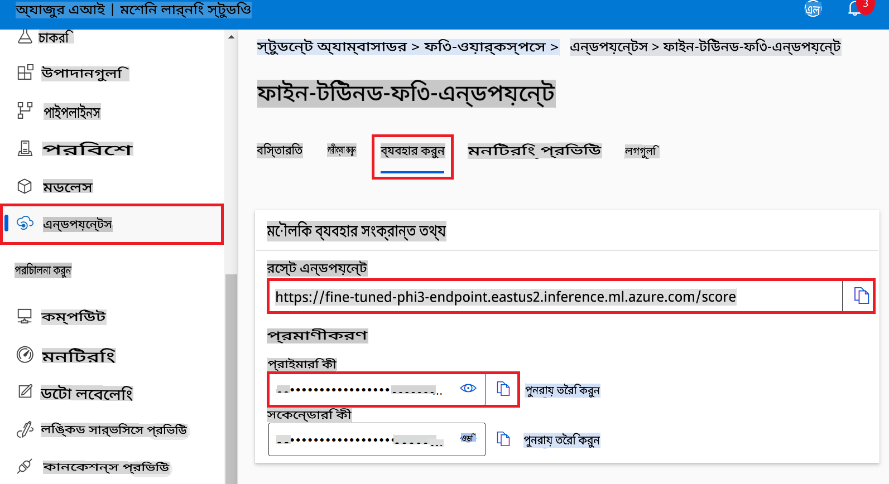

#### কাস্টম কানেকশন যোগ করুন

1. [Azure AI Foundry](https://ai.azure.com/?wt.mc_id=studentamb_279723)-তে যান।

1. আপনি যে Azure AI Foundry প্রকল্প তৈরি করেছেন, সেখানে নেভিগেট করুন।

1. আপনি যে প্রকল্পটি তৈরি করেছেন, তার বাম পাশের ট্যাব থেকে **Settings** নির্বাচন করুন।

1. **+ New connection** নির্বাচন করুন।

    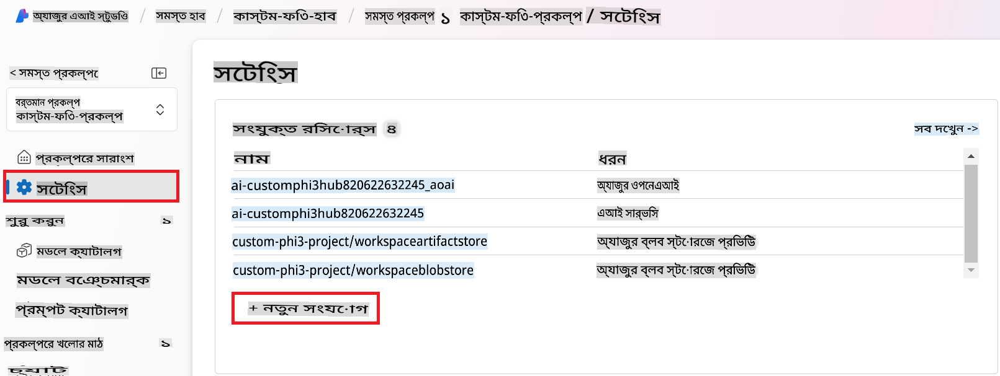

1. নেভিগেশন মেনু থেকে **Custom keys** নির্বাচন করুন।

    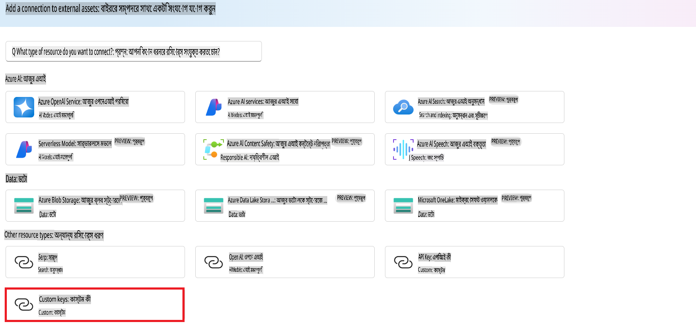

1. নিম্নলিখিত কাজগুলি সম্পন্ন করুন:

    - **+ Add key value pairs** নির্বাচন করুন।
    - কী নামের জন্য **endpoint** লিখুন এবং Azure ML Studio থেকে কপি করা এন্ডপয়েন্টটি মান ফিল্ডে পেস্ট করুন।
    - আবার **+ Add key value pairs** নির্বাচন করুন।
    - কী নামের জন্য **key** লিখুন এবং Azure ML Studio থেকে কপি করা কীটি মান ফিল্ডে পেস্ট করুন।
    - কী যোগ করার পরে, **is secret** নির্বাচন করুন যাতে কী প্রকাশ না হয়।

    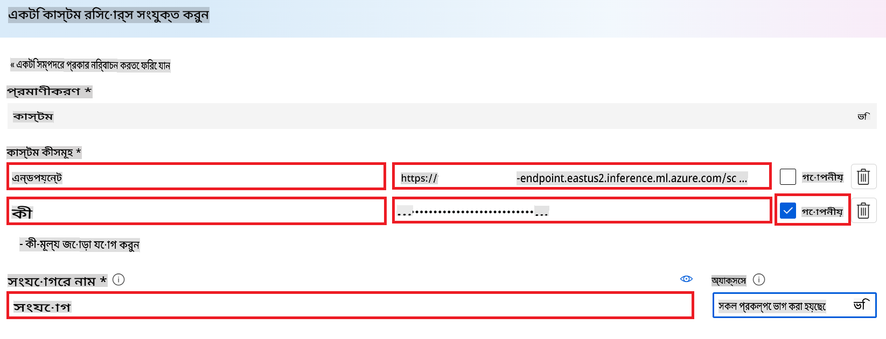

1. **Add connection** নির্বাচন করুন।

#### Prompt flow তৈরি করুন

আপনি Azure AI Foundry-তে একটি কাস্টম কানেকশন যোগ করেছেন। এখন, নিম্নলিখিত ধাপগুলি ব্যবহার করে একটি Prompt flow তৈরি করুন। এরপর, আপনি এই Prompt flow-কে কাস্টম কানেকশনের সাথে সংযুক্ত করবেন যাতে Prompt flow-এ ফাইন-টিউন করা মডেল ব্যবহার করা যায়।

1. আপনি যে Azure AI Foundry প্রকল্প তৈরি করেছেন, সেখানে নেভিগেট করুন।

1. বাম পাশের ট্যাব থেকে **Prompt flow** নির্বাচন করুন।

1. নেভিগেশন মেনু থেকে **+ Create** নির্বাচন করুন।

    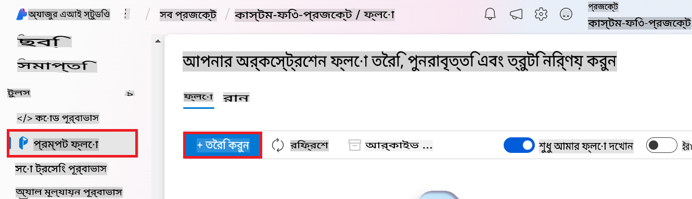

1. নেভিগেশন মেনু থেকে **Chat flow** নির্বাচন করুন।

    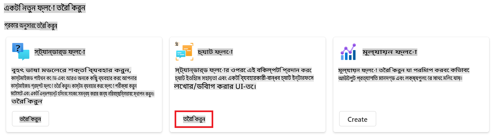

1. **Folder name** লিখুন।

    

1. **Create** নির্বাচন করুন।

#### Prompt flow-এ আপনার কাস্টম Phi-3 / Phi-3.5 মডেলের সাথে চ্যাট সেট আপ করুন

আপনাকে ফাইন-টিউন করা Phi-3 / Phi-3.5 মডেলকে একটি Prompt flow-এ সংযুক্ত করতে হবে। তবে, বিদ্যমান Prompt flow এই উদ্দেশ্যে ডিজাইন করা হয়নি। তাই, আপনাকে Prompt flow পুনরায় ডিজাইন করতে হবে যাতে কাস্টম মডেলের ইন্টিগ্রেশন সম্ভব হয়।

1. Prompt flow-এ, বিদ্যমান ফ্লো পুনর্গঠনের জন্য নিম্নলিখিত কাজগুলি করুন:

    - **Raw file mode** নির্বাচন করুন।
    - *flow.dag.yml* ফাইলের সমস্ত বিদ্যমান কোড মুছে ফেলুন।
    - *flow.dag.yml* ফাইলে নিম্নলিখিত কোড যোগ করুন:

        ```yml
        inputs:
          input_data:
            type: string
            default: "Who founded Microsoft?"

        outputs:
          answer:
            type: string
            reference: ${integrate_with_promptflow.output}

        nodes:
        - name: integrate_with_promptflow
          type: python
          source:
            type: code
            path: integrate_with_promptflow.py
          inputs:
            input_data: ${inputs.input_data}
        ```

    - **Save** নির্বাচন করুন।

    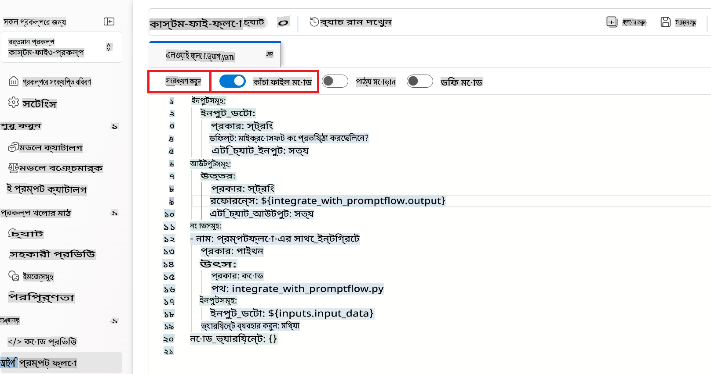

1. Prompt flow-এ কাস্টম Phi-3 / Phi-3.5 মডেল ব্যবহার করার জন্য *integrate_with_promptflow.py* ফাইলে নিম্নলিখিত কোড যোগ করুন:

    ```python
    import logging
    import requests
    from promptflow import tool
    from promptflow.connections import CustomConnection

    # Logging setup
    logging.basicConfig(
        format="%(asctime)s - %(levelname)s - %(name)s - %(message)s",
        datefmt="%Y-%m-%d %H:%M:%S",
        level=logging.DEBUG
    )
    logger = logging.getLogger(__name__)

    def query_phi3_model(input_data: str, connection: CustomConnection) -> str:
        """
        Send a request to the Phi-3 / Phi-3.5 model endpoint with the given input data using Custom Connection.
        """

        # "connection" is the name of the Custom Connection, "endpoint", "key" are the keys in the Custom Connection
        endpoint_url = connection.endpoint
        api_key = connection.key

        headers = {
            "Content-Type": "application/json",
            "Authorization": f"Bearer {api_key}"
        }
    data = {
        "input_data": [input_data],
        "params": {
            "temperature": 0.7,
            "max_new_tokens": 128,
            "do_sample": True,
            "return_full_text": True
            }
        }
        try:
            response = requests.post(endpoint_url, json=data, headers=headers)
            response.raise_for_status()
            
            # Log the full JSON response
            logger.debug(f"Full JSON response: {response.json()}")

            result = response.json()["output"]
            logger.info("Successfully received response from Azure ML Endpoint.")
            return result
        except requests.exceptions.RequestException as e:
            logger.error(f"Error querying Azure ML Endpoint: {e}")
            raise

    @tool
    def my_python_tool(input_data: str, connection: CustomConnection) -> str:
        """
        Tool function to process input data and query the Phi-3 / Phi-3.5 model.
        """
        return query_phi3_model(input_data, connection)

    ```

    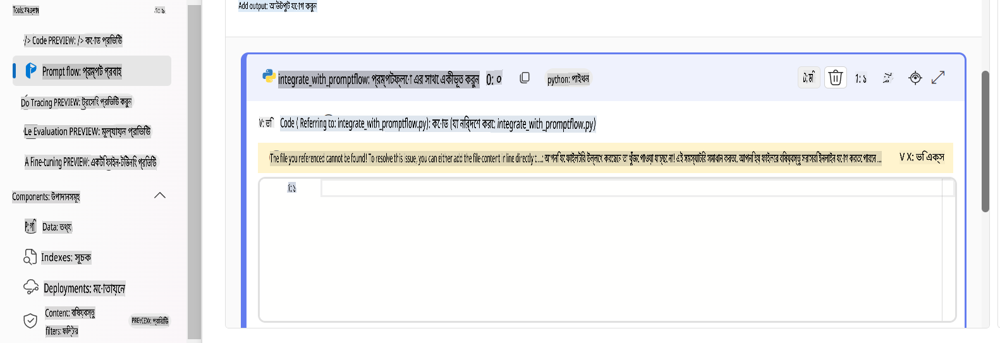

> [!NOTE]
> Azure AI Foundry-তে Prompt flow ব্যবহারের বিস্তারিত তথ্যের জন্য, [Prompt flow in Azure AI Foundry](https://learn.microsoft.com/azure/ai-studio/how-to/prompt-flow) দেখুন।

1. **Chat input**, **Chat output** নির্বাচন করুন যাতে আপনার মডেলের সাথে চ্যাট করা যায়।

    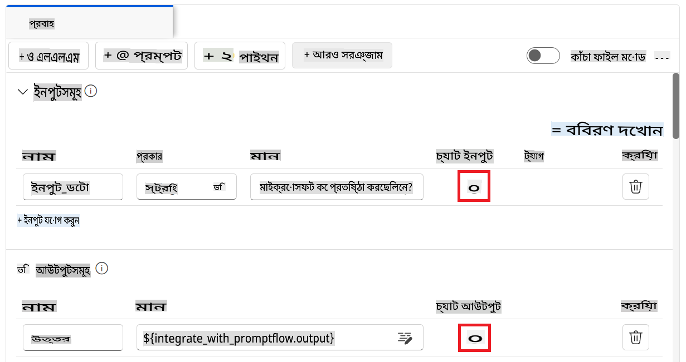

1. এখন আপনি আপনার কাস্টম Phi-3 / Phi-3.5 মডেলের সাথে চ্যাট করার জন্য প্রস্তুত। পরবর্তী অনুশীলনে, আপনি শিখবেন কীভাবে Prompt flow শুরু করবেন এবং এটি ব্যবহার করে আপনার ফাইন-টিউন করা Phi-3 / Phi-3.5 মডেলের সাথে চ্যাট করবেন।

> [!NOTE]
>
> পুনর্গঠিত ফ্লোটি নিচের চিত্রের মতো হওয়া উচিত:
>
> 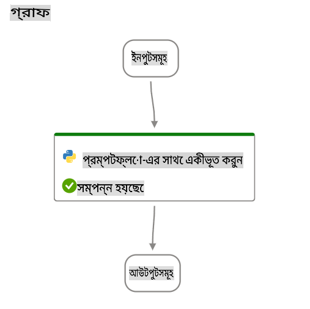
>

#### Prompt flow শুরু করুন

1. Prompt flow শুরু করতে **Start compute sessions** নির্বাচন করুন।

    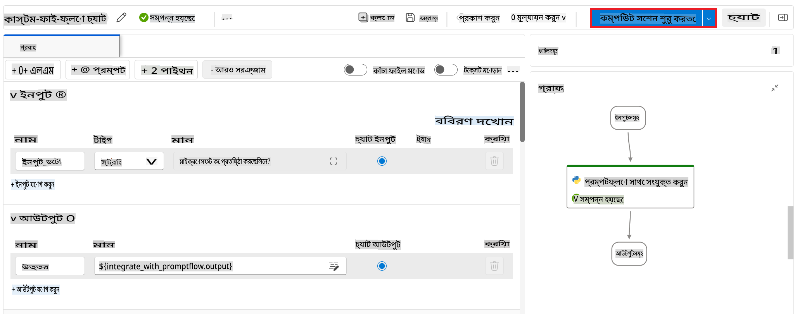

1. প্যারামিটার রিনিউ করতে **Validate and parse input** নির্বাচন করুন।

    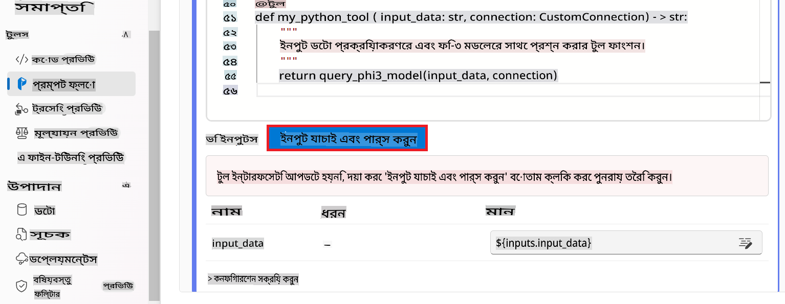

1. আপনি তৈরি করা কাস্টম কানেকশনের **connection** এর **Value** নির্বাচন করুন। উদাহরণস্বরূপ, *connection*।

    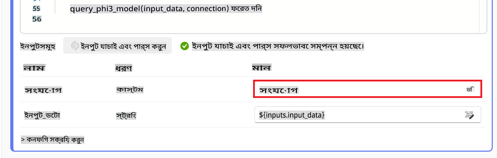

#### আপনার কাস্টম Phi-3 / Phi-3.5 মডেলের সাথে চ্যাট করুন

1. **Chat** নির্বাচন করুন।

    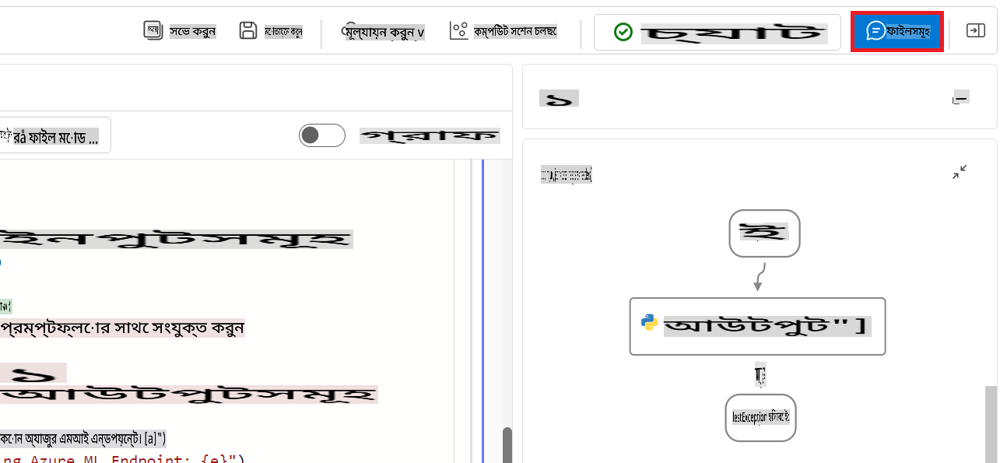

1. ফলাফলের একটি উদাহরণ এখানে দেওয়া হলো: এখন আপনি আপনার কাস্টম Phi-3 / Phi-3.5 মডেলের সাথে চ্যাট করতে পারেন। ফাইন-টিউনিংয়ের জন্য ব্যবহৃত ডেটার উপর ভিত্তি করে প্রশ্ন করা সুপারিশ করা হয়।

    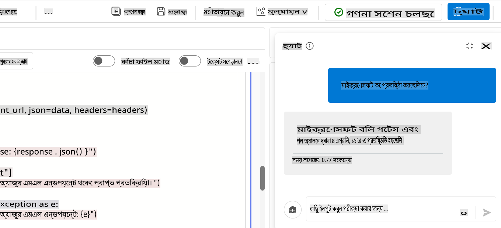

### Phi-3 / Phi-3.5 মডেল মূল্যায়নের জন্য Azure OpenAI ডিপ্লয় করুন

Azure AI Foundry-তে Phi-3 / Phi-3.5 মডেল মূল্যায়ন করতে, আপনাকে একটি Azure OpenAI মডেল ডিপ্লয় করতে হবে। এই মডেলটি Phi-3 / Phi-3.5 মডেলের পারফরম্যান্স মূল্যায়নের জন্য ব্যবহৃত হবে।

#### Azure OpenAI ডিপ্লয় করুন

1. [Azure AI Foundry](https://ai.azure.com/?wt.mc_id=studentamb_279723)-তে সাইন ইন করুন।

1. আপনি যে Azure AI Foundry প্রকল্প তৈরি করেছেন, সেখানে নেভিগেট করুন।

    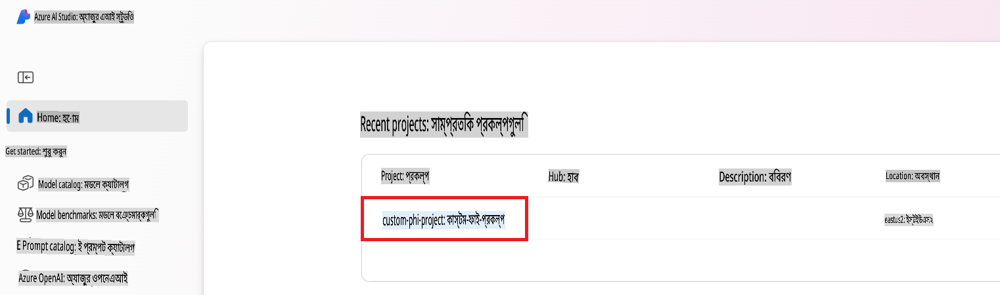

1. আপনি যে প্রকল্পটি তৈরি করেছেন, তার বাম পাশের ট্যাব থেকে **Deployments** নির্বাচন করুন।

1. নেভিগেশন মেনু থেকে **+ Deploy model** নির্বাচন করুন।

1. **Deploy base model** নির্বাচন করুন।

    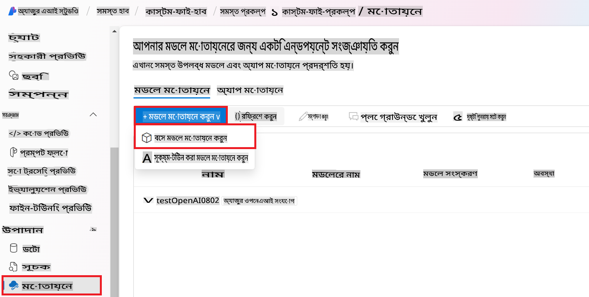

1. আপনি যে Azure OpenAI মডেলটি ব্যবহার করতে চান, তা নির্বাচন করুন। উদাহরণস্বরূপ, **gpt-4o**।

    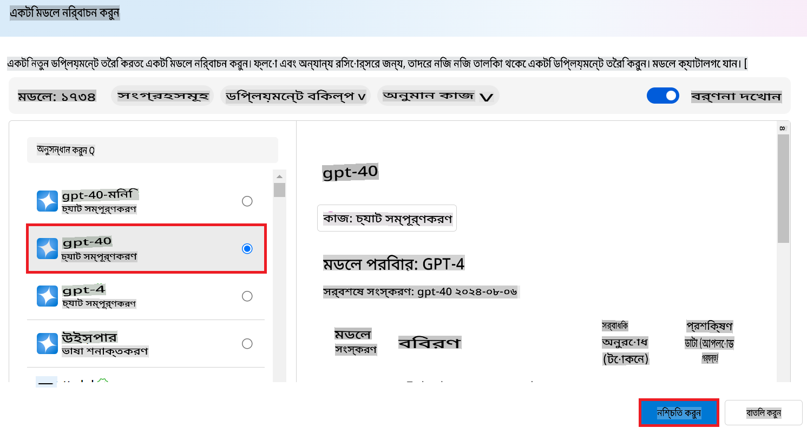

1. **Confirm** নির্বাচন করুন।

### Azure AI Foundry-এর Prompt flow মূল্যায়ন ব্যবহার করে ফাইন-টিউন করা Phi-3 / Phi-3.5 মডেল মূল্যায়ন করুন

### একটি নতুন মূল্যায়ন শুরু করুন

1. [Azure AI Foundry](https://ai.azure.com/?wt.mc_id=studentamb_279723)-তে যান।

1. আপনি যে Azure AI Foundry প্রকল্প তৈরি করেছেন, সেখানে নেভিগেট করুন।

    

1. আপনি যে প্রকল্পটি তৈরি করেছেন, তার বাম পাশের ট্যাব থেকে **Evaluation** নির্বাচন করুন।

1. নেভিগেশন মেনু থেকে **+ New evaluation** নির্বাচন করুন।
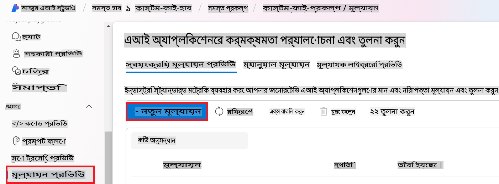

1. **Prompt flow** মূল্যায়ন নির্বাচন করুন।

    

1. নিম্নলিখিত কাজগুলো সম্পন্ন করুন:

    - মূল্যায়নের নাম লিখুন। এটি একটি ইউনিক মান হতে হবে।
    - টাস্ক টাইপ হিসেবে **Question and answer without context** নির্বাচন করুন। কারণ এই টিউটোরিয়ালে ব্যবহৃত **UlTRACHAT_200k** ডেটাসেটে কোনো প্রাসঙ্গিক তথ্য নেই।
    - আপনি যে Prompt flow মূল্যায়ন করতে চান তা নির্বাচন করুন।

    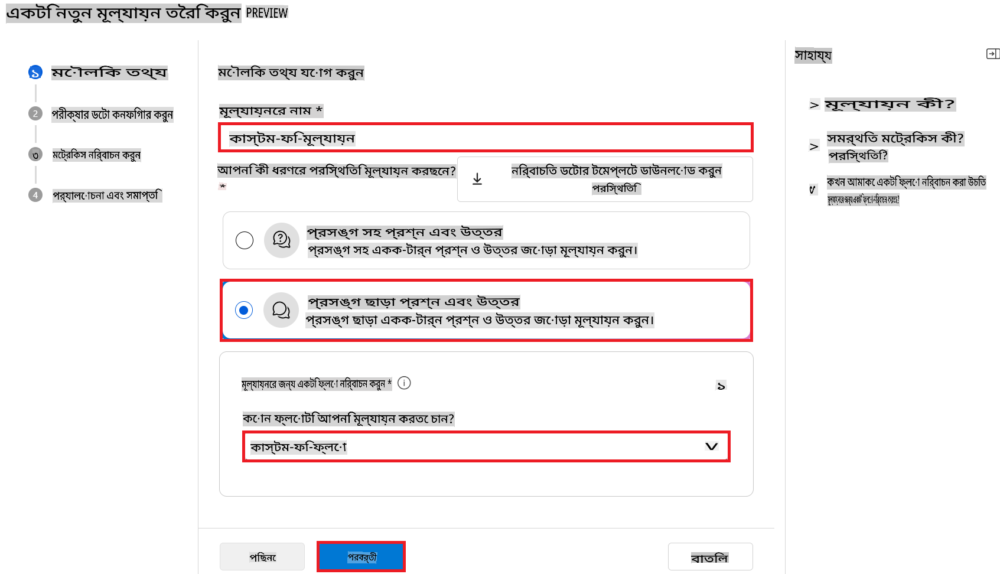

1. **Next** নির্বাচন করুন।

1. নিম্নলিখিত কাজগুলো সম্পন্ন করুন:

    - **Add your dataset** নির্বাচন করে ডেটাসেট আপলোড করুন। উদাহরণস্বরূপ, আপনি টেস্ট ডেটাসেট ফাইল আপলোড করতে পারেন, যেমন *test_data.json1*, যা **ULTRACHAT_200k** ডেটাসেট ডাউনলোড করার সময় অন্তর্ভুক্ত থাকে।
    - আপনার ডেটাসেটের সাথে মিলে যায় এমন সঠিক **Dataset column** নির্বাচন করুন। উদাহরণস্বরূপ, যদি আপনি **ULTRACHAT_200k** ডেটাসেট ব্যবহার করেন, তাহলে **${data.prompt}** কে ডেটাসেট কলাম হিসেবে নির্বাচন করুন।

    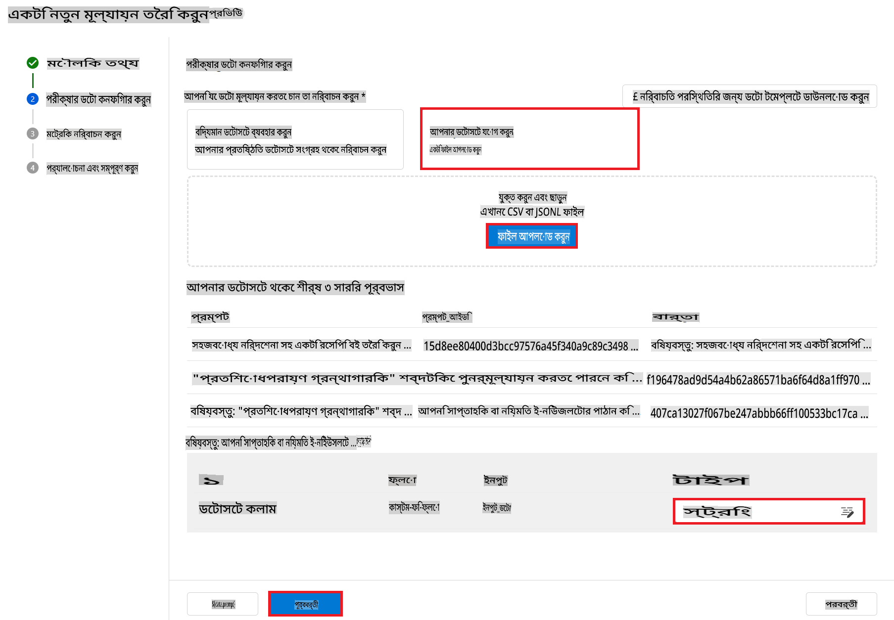

1. **Next** নির্বাচন করুন।

1. কর্মক্ষমতা এবং গুণগত মানের মেট্রিক কনফিগার করতে নিম্নলিখিত কাজগুলো সম্পন্ন করুন:

    - আপনি যে কর্মক্ষমতা এবং গুণগত মানের মেট্রিক ব্যবহার করতে চান তা নির্বাচন করুন।
    - মূল্যায়নের জন্য আপনি যে Azure OpenAI মডেল তৈরি করেছেন তা নির্বাচন করুন। উদাহরণস্বরূপ, **gpt-4o** নির্বাচন করুন।

    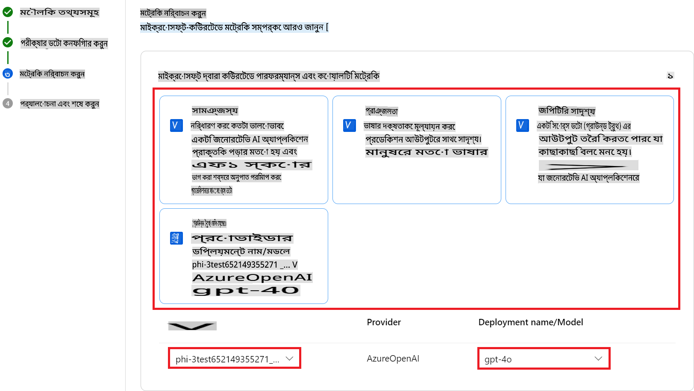

1. ঝুঁকি এবং নিরাপত্তা মেট্রিক কনফিগার করতে নিম্নলিখিত কাজগুলো সম্পন্ন করুন:

    - আপনি যে ঝুঁকি এবং নিরাপত্তা মেট্রিক ব্যবহার করতে চান তা নির্বাচন করুন।
    - আপনি যে ডিফেক্ট রেটের থ্রেশহোল্ড ব্যবহার করতে চান তা নির্বাচন করুন। উদাহরণস্বরূপ, **Medium** নির্বাচন করুন।
    - **question** এর জন্য **Data source** নির্বাচন করুন **{$data.prompt}**।
    - **answer** এর জন্য **Data source** নির্বাচন করুন **{$run.outputs.answer}**।
    - **ground_truth** এর জন্য **Data source** নির্বাচন করুন **{$data.message}**।

    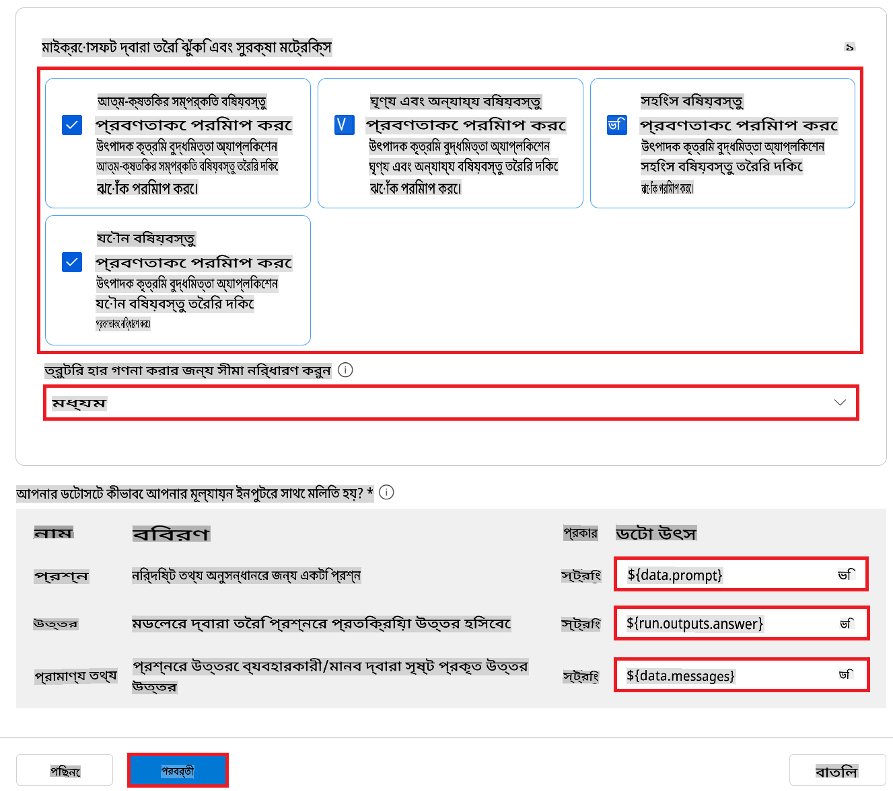

1. **Next** নির্বাচন করুন।

1. মূল্যায়ন শুরু করতে **Submit** নির্বাচন করুন।

1. মূল্যায়ন সম্পন্ন হতে কিছুটা সময় লাগবে। আপনি **Evaluation** ট্যাবে অগ্রগতি পর্যবেক্ষণ করতে পারবেন।

### মূল্যায়নের ফলাফল পর্যালোচনা করুন

> [!NOTE]
> নিচে প্রদত্ত ফলাফলগুলো মূল্যায়ন প্রক্রিয়া প্রদর্শনের জন্য তৈরি করা হয়েছে। এই টিউটোরিয়ালে একটি তুলনামূলকভাবে ছোট ডেটাসেটের উপর ফাইন-টিউন করা মডেল ব্যবহার করা হয়েছে, যা হয়তো অপ্টিমাল ফলাফল দিতে নাও পারে। প্রকৃত ফলাফল ডেটাসেটের আকার, মান এবং বৈচিত্র্য, এবং মডেলের নির্দিষ্ট কনফিগারেশনের উপর নির্ভর করে উল্লেখযোগ্যভাবে ভিন্ন হতে পারে।

মূল্যায়ন সম্পন্ন হলে, আপনি কর্মক্ষমতা এবং নিরাপত্তা মেট্রিকের ফলাফল পর্যালোচনা করতে পারবেন।

1. কর্মক্ষমতা এবং গুণগত মানের মেট্রিক:

    - মডেলটি সঙ্গতিপূর্ণ, সাবলীল এবং প্রাসঙ্গিক উত্তর তৈরি করতে কতটা কার্যকর তা মূল্যায়ন করুন।

    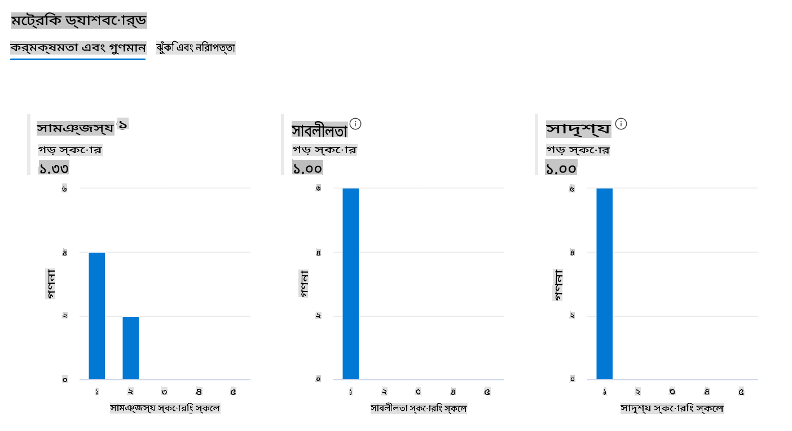

1. ঝুঁকি এবং নিরাপত্তা মেট্রিক:

    - নিশ্চিত করুন যে মডেলের আউটপুট নিরাপদ এবং Responsible AI Principles এর সাথে সামঞ্জস্যপূর্ণ, এবং কোনো ক্ষতিকর বা আপত্তিকর বিষয়বস্তু এড়িয়ে চলছে।

    

1. আপনি **Detailed metrics result** দেখতে স্ক্রল করতে পারেন।

    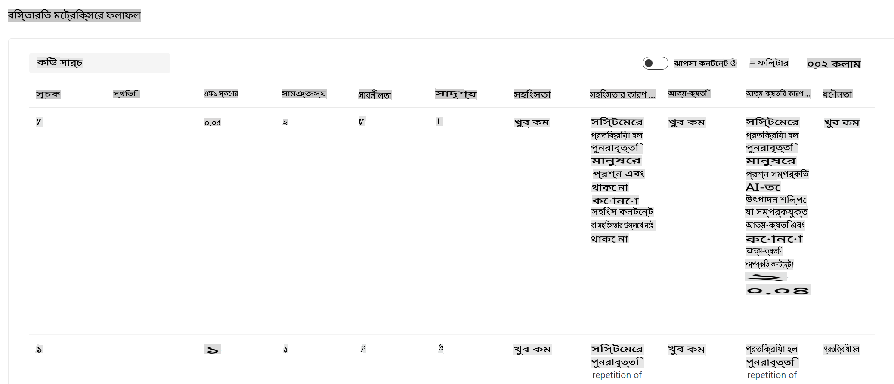

1. আপনার কাস্টম Phi-3 / Phi-3.5 মডেলটি কর্মক্ষমতা এবং নিরাপত্তা মেট্রিকের বিরুদ্ধে মূল্যায়ন করে নিশ্চিত করুন যে মডেলটি শুধু কার্যকর নয়, বরং Responsible AI Practices অনুসরণ করে বাস্তব জগতে ব্যবহারের জন্য প্রস্তুত।

## অভিনন্দন!

### আপনি এই টিউটোরিয়াল সম্পন্ন করেছেন

আপনি সফলভাবে Azure AI Foundry তে Prompt flow এর সাথে ইন্টিগ্রেট করা ফাইন-টিউনকৃত Phi-3 মডেল মূল্যায়ন করেছেন। এটি নিশ্চিত করার একটি গুরুত্বপূর্ণ ধাপ যে আপনার AI মডেলগুলো শুধু ভালো পারফর্ম করে তা নয়, বরং Microsoft এর Responsible AI নীতিমালা অনুসরণ করে বিশ্বাসযোগ্য এবং নির্ভরযোগ্য AI অ্যাপ্লিকেশন তৈরি করতে সহায়তা করে।


## Azure রিসোর্স পরিষ্কার করুন

আপনার Azure রিসোর্স পরিষ্কার করুন যাতে আপনার অ্যাকাউন্টে অতিরিক্ত চার্জ না হয়। Azure পোর্টালে যান এবং নিম্নলিখিত রিসোর্সগুলো মুছে ফেলুন:

- Azure Machine learning রিসোর্স।
- Azure Machine learning মডেল এন্ডপয়েন্ট।
- Azure AI Foundry Project রিসোর্স।
- Azure AI Foundry Prompt flow রিসোর্স।

### পরবর্তী ধাপ

#### ডকুমেন্টেশন

- [Responsible AI ড্যাশবোর্ড ব্যবহার করে AI সিস্টেম মূল্যায়ন করুন](https://learn.microsoft.com/azure/machine-learning/concept-responsible-ai-dashboard?view=azureml-api-2&source=recommendations?wt.mc_id=studentamb_279723)
- [জেনারেটিভ AI এর জন্য মূল্যায়ন এবং মনিটরিং মেট্রিক](https://learn.microsoft.com/azure/ai-studio/concepts/evaluation-metrics-built-in?tabs=definition?wt.mc_id=studentamb_279723)
- [Azure AI Foundry ডকুমেন্টেশন](https://learn.microsoft.com/azure/ai-studio/?wt.mc_id=studentamb_279723)
- [Prompt flow ডকুমেন্টেশন](https://microsoft.github.io/promptflow/?wt.mc_id=studentamb_279723)

#### প্রশিক্ষণ সামগ্রী

- [Microsoft এর Responsible AI Approach এর ভূমিকা](https://learn.microsoft.com/training/modules/introduction-to-microsofts-responsible-ai-approach/?source=recommendations?wt.mc_id=studentamb_279723)
- [Azure AI Foundry এর পরিচিতি](https://learn.microsoft.com/training/modules/introduction-to-azure-ai-studio/?wt.mc_id=studentamb_279723)

### রেফারেন্স

- [Responsible AI কী?](https://learn.microsoft.com/azure/machine-learning/concept-responsible-ai?view=azureml-api-2?wt.mc_id=studentamb_279723)
- [জেনারেটিভ AI অ্যাপ্লিকেশন তৈরি করতে নতুন টুলস](https://azure.microsoft.com/blog/announcing-new-tools-in-azure-ai-to-help-you-build-more-secure-and-trustworthy-generative-ai-applications/?wt.mc_id=studentamb_279723)
- [জেনারেটিভ AI অ্যাপ্লিকেশন মূল্যায়ন](https://learn.microsoft.com/azure/ai-studio/concepts/evaluation-approach-gen-ai?wt.mc_id%3Dstudentamb_279723)

**অস্বীকৃতি**:  
এই নথিটি মেশিন-ভিত্তিক এআই অনুবাদ পরিষেবা ব্যবহার করে অনুবাদ করা হয়েছে। আমরা যথাসাধ্য সঠিক অনুবাদের চেষ্টা করি, তবে দয়া করে সচেতন থাকুন যে স্বয়ংক্রিয় অনুবাদে ভুল বা অসংগতি থাকতে পারে। মূল ভাষায় থাকা নথিটিকেই প্রামাণ্য উৎস হিসাবে বিবেচনা করা উচিত। গুরুত্বপূর্ণ তথ্যের ক্ষেত্রে, পেশাদার মানব অনুবাদ পরামর্শ দেওয়া হয়। এই অনুবাদ ব্যবহারের ফলে উদ্ভূত যে কোনো ভুল বোঝাবুঝি বা ভুল ব্যাখ্যার জন্য আমরা দায়ী নই।