# ফাইন-টিউন এবং কাস্টম Phi-3 মডেল Prompt flow এর সাথে ইন্টিগ্রেট করুন

এই সম্পূর্ণ (E2E) নমুনাটি Microsoft Tech Community এর গাইড "[Fine-Tune and Integrate Custom Phi-3 Models with Prompt Flow: Step-by-Step Guide](https://techcommunity.microsoft.com/t5/educator-developer-blog/fine-tune-and-integrate-custom-phi-3-models-with-prompt-flow/ba-p/4178612?WT.mc_id=aiml-137032-kinfeylo)" এর উপর ভিত্তি করে তৈরি। এটি কাস্টম Phi-3 মডেলের ফাইন-টিউনিং, ডিপ্লয়মেন্ট এবং Prompt flow এর সাথে ইন্টিগ্রেশনের প্রক্রিয়া উপস্থাপন করে।

## সংক্ষিপ্ত বিবরণ

এই E2E নমুনায়, আপনি শিখবেন কীভাবে Phi-3 মডেলটি ফাইন-টিউন করতে হয় এবং এটি Prompt flow এর সাথে ইন্টিগ্রেট করতে হয়। Azure Machine Learning এবং Prompt flow ব্যবহার করে, আপনি কাস্টম AI মডেল ডিপ্লয় এবং ব্যবহারের জন্য একটি ওয়ার্কফ্লো প্রতিষ্ঠা করবেন। এই E2E নমুনাটি তিনটি দৃশ্যে বিভক্ত:

**দৃশ্য ১: Azure রিসোর্স সেট আপ করুন এবং ফাইন-টিউনিংয়ের জন্য প্রস্তুতি নিন**

**দৃশ্য ২: Phi-3 মডেল ফাইন-টিউন করুন এবং Azure Machine Learning Studio তে ডিপ্লয় করুন**

**দৃশ্য ৩: Prompt flow এর সাথে ইন্টিগ্রেট করুন এবং আপনার কাস্টম মডেলের সাথে চ্যাট করুন**

এখানে এই E2E নমুনার একটি সংক্ষিপ্ত বিবরণ দেওয়া হলো।

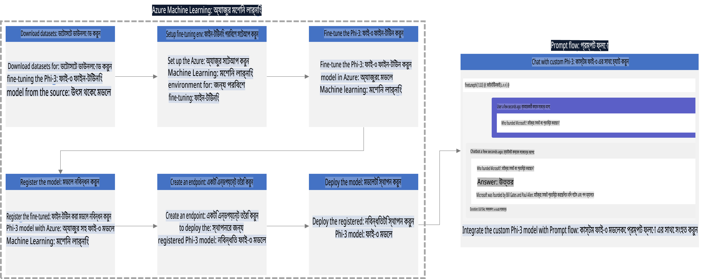

### বিষয়বস্তুর সূচি

1. **[দৃশ্য ১: Azure রিসোর্স সেট আপ করুন এবং ফাইন-টিউনিংয়ের জন্য প্রস্তুতি নিন](../../../../../../md/02.Application/01.TextAndChat/Phi3)**
    - [Azure Machine Learning Workspace তৈরি করুন](../../../../../../md/02.Application/01.TextAndChat/Phi3)
    - [Azure Subscription এ GPU কোটা অনুরোধ করুন](../../../../../../md/02.Application/01.TextAndChat/Phi3)
    - [রোল অ্যাসাইনমেন্ট যোগ করুন](../../../../../../md/02.Application/01.TextAndChat/Phi3)
    - [প্রকল্প সেট আপ করুন](../../../../../../md/02.Application/01.TextAndChat/Phi3)
    - [ফাইন-টিউনিংয়ের জন্য ডেটাসেট প্রস্তুত করুন](../../../../../../md/02.Application/01.TextAndChat/Phi3)

1. **[দৃশ্য ২: Phi-3 মডেল ফাইন-টিউন করুন এবং Azure Machine Learning Studio তে ডিপ্লয় করুন](../../../../../../md/02.Application/01.TextAndChat/Phi3)**
    - [Azure CLI সেট আপ করুন](../../../../../../md/02.Application/01.TextAndChat/Phi3)
    - [Phi-3 মডেল ফাইন-টিউন করুন](../../../../../../md/02.Application/01.TextAndChat/Phi3)
    - [ফাইন-টিউন করা মডেল ডিপ্লয় করুন](../../../../../../md/02.Application/01.TextAndChat/Phi3)

1. **[দৃশ্য ৩: Prompt flow এর সাথে ইন্টিগ্রেট করুন এবং আপনার কাস্টম মডেলের সাথে চ্যাট করুন](../../../../../../md/02.Application/01.TextAndChat/Phi3)**
    - [কাস্টম Phi-3 মডেল Prompt flow এর সাথে ইন্টিগ্রেট করুন](../../../../../../md/02.Application/01.TextAndChat/Phi3)
    - [আপনার কাস্টম মডেলের সাথে চ্যাট করুন](../../../../../../md/02.Application/01.TextAndChat/Phi3)

## দৃশ্য ১: Azure রিসোর্স সেট আপ করুন এবং ফাইন-টিউনিংয়ের জন্য প্রস্তুতি নিন

### Azure Machine Learning Workspace তৈরি করুন

1. পোর্টাল পৃষ্ঠার উপরের **সার্চ বার** এ *azure machine learning* টাইপ করুন এবং প্রদর্শিত বিকল্পগুলির মধ্যে থেকে **Azure Machine Learning** নির্বাচন করুন।

    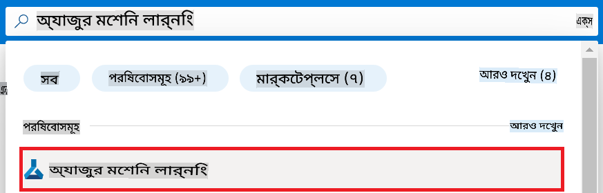

1. নেভিগেশন মেনু থেকে **+ Create** নির্বাচন করুন।

1. নেভিগেশন মেনু থেকে **New workspace** নির্বাচন করুন।

    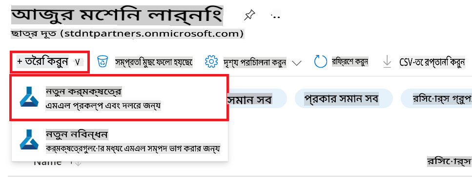

1. নিম্নলিখিত কাজগুলো সম্পন্ন করুন:

    - আপনার Azure **Subscription** নির্বাচন করুন।
    - ব্যবহারের জন্য **Resource group** নির্বাচন করুন (প্রয়োজন হলে একটি নতুন তৈরি করুন)।
    - **Workspace Name** প্রবেশ করান। এটি একটি অনন্য মান হতে হবে।
    - ব্যবহারের জন্য **Region** নির্বাচন করুন।
    - ব্যবহারের জন্য **Storage account** নির্বাচন করুন (প্রয়োজন হলে একটি নতুন তৈরি করুন)।
    - ব্যবহারের জন্য **Key vault** নির্বাচন করুন (প্রয়োজন হলে একটি নতুন তৈরি করুন)।
    - ব্যবহারের জন্য **Application insights** নির্বাচন করুন (প্রয়োজন হলে একটি নতুন তৈরি করুন)।
    - ব্যবহারের জন্য **Container registry** নির্বাচন করুন (প্রয়োজন হলে একটি নতুন তৈরি করুন)।

    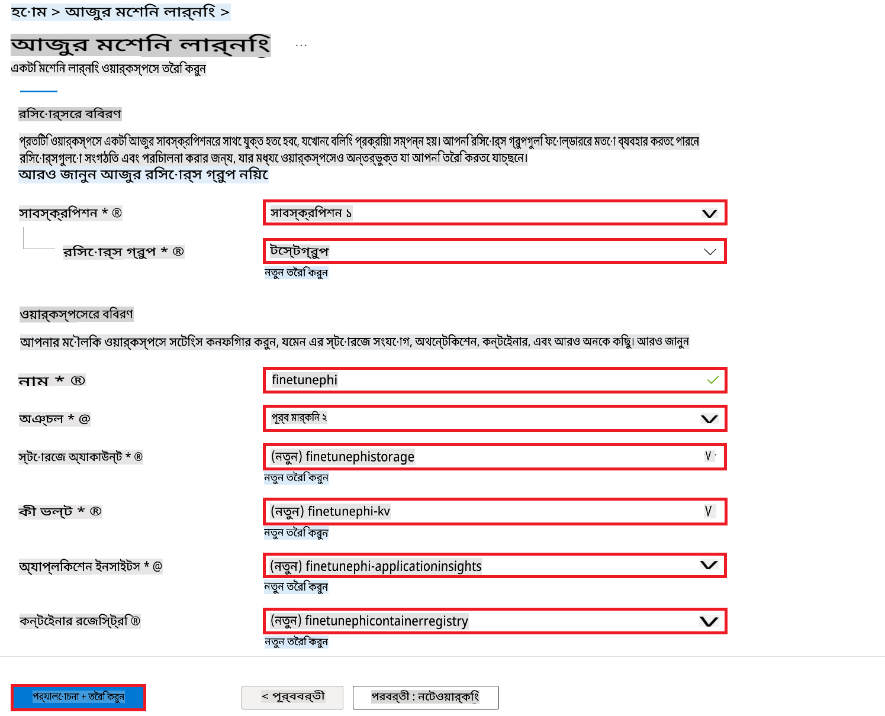

1. **Review + Create** নির্বাচন করুন।

1. **Create** নির্বাচন করুন।

### Azure Subscription এ GPU কোটা অনুরোধ করুন

এই E2E নমুনায়, ফাইন-টিউনিংয়ের জন্য *Standard_NC24ads_A100_v4 GPU* ব্যবহার করা হবে, যা কোটা অনুরোধ প্রয়োজন এবং ডিপ্লয়মেন্টের জন্য *Standard_E4s_v3* CPU ব্যবহার করা হবে, যা কোটা অনুরোধ প্রয়োজন হয় না।

> [!NOTE]
>
> শুধুমাত্র Pay-As-You-Go সাবস্ক্রিপশন (স্ট্যান্ডার্ড সাবস্ক্রিপশন টাইপ) GPU বরাদ্দের জন্য যোগ্য; বেনিফিট সাবস্ক্রিপশন বর্তমানে সমর্থিত নয়।
>
> যারা বেনিফিট সাবস্ক্রিপশন (যেমন Visual Studio Enterprise Subscription) ব্যবহার করছেন বা যারা দ্রুত ফাইন-টিউনিং এবং ডিপ্লয়মেন্ট প্রক্রিয়া পরীক্ষা করতে চান, তাদের জন্য এই টিউটোরিয়াল একটি ছোট ডেটাসেট ব্যবহার করে CPU দিয়ে ফাইন-টিউনিংয়ের নির্দেশিকাও প্রদান করে। তবে, এটি মনে রাখা গুরুত্বপূর্ণ যে GPU ব্যবহার করে বড় ডেটাসেট দিয়ে ফাইন-টিউনিংয়ের ফলাফল উল্লেখযোগ্যভাবে ভালো হয়।

1. [Azure ML Studio](https://ml.azure.com/home?wt.mc_id=studentamb_279723) পরিদর্শন করুন।

1. *Standard NCADSA100v4 Family* কোটা অনুরোধ করতে নিম্নলিখিত কাজগুলো সম্পন্ন করুন:

    - বাম পাশের ট্যাব থেকে **Quota** নির্বাচন করুন।
    - ব্যবহারের জন্য **Virtual machine family** নির্বাচন করুন। উদাহরণস্বরূপ, **Standard NCADSA100v4 Family Cluster Dedicated vCPUs** নির্বাচন করুন, যেখানে *Standard_NC24ads_A100_v4* GPU অন্তর্ভুক্ত।
    - নেভিগেশন মেনু থেকে **Request quota** নির্বাচন করুন।

        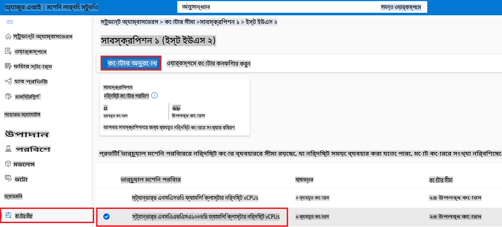

    - Request quota পৃষ্ঠায়, ব্যবহারের জন্য **New cores limit** প্রবেশ করান। উদাহরণস্বরূপ, ২৪।
    - Request quota পৃষ্ঠায়, GPU কোটা অনুরোধ করতে **Submit** নির্বাচন করুন।

> [!NOTE]
> আপনার প্রয়োজন অনুযায়ী উপযুক্ত GPU বা CPU নির্বাচন করতে, [Sizes for Virtual Machines in Azure](https://learn.microsoft.com/azure/virtual-machines/sizes/overview?tabs=breakdownseries%2Cgeneralsizelist%2Ccomputesizelist%2Cmemorysizelist%2Cstoragesizelist%2Cgpusizelist%2Cfpgasizelist%2Chpcsizelist) ডকুমেন্টটি দেখুন।

### রোল অ্যাসাইনমেন্ট যোগ করুন

আপনার মডেল ফাইন-টিউন এবং ডিপ্লয় করার জন্য, প্রথমে একটি User Assigned Managed Identity (UAI) তৈরি করতে হবে এবং এটি উপযুক্ত অনুমতিগুলি অ্যাসাইন করতে হবে। এই UAI ডিপ্লয়মেন্টের সময় প্রমাণীকরণের জন্য ব্যবহৃত হবে।

#### User Assigned Managed Identity(UAI) তৈরি করুন

1. পোর্টাল পৃষ্ঠার উপরের **সার্চ বার** এ *managed identities* টাইপ করুন এবং প্রদর্শিত বিকল্পগুলির মধ্যে থেকে **Managed Identities** নির্বাচন করুন।

    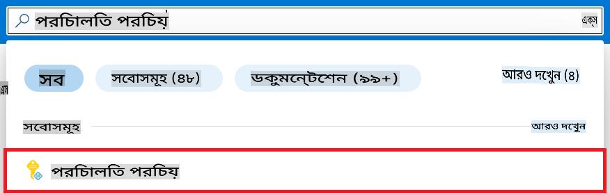

1. **+ Create** নির্বাচন করুন।

    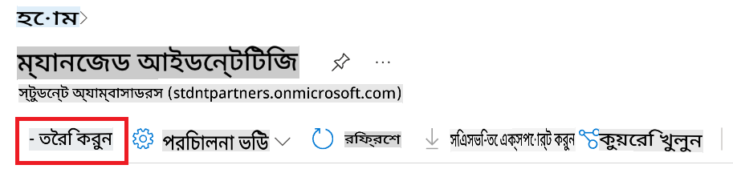

1. নিম্নলিখিত কাজগুলো সম্পন্ন করুন:

    - আপনার Azure **Subscription** নির্বাচন করুন।
    - ব্যবহারের জন্য **Resource group** নির্বাচন করুন (প্রয়োজন হলে একটি নতুন তৈরি করুন)।
    - ব্যবহারের জন্য **Region** নির্বাচন করুন।
    - **Name** প্রবেশ করান। এটি একটি অনন্য মান হতে হবে।

1. **Review + create** নির্বাচন করুন।

1. **+ Create** নির্বাচন করুন।

#### Managed Identity-তে Contributor রোল অ্যাসাইনমেন্ট যোগ করুন

1. আপনি যে Managed Identity তৈরি করেছেন তার রিসোর্সে যান।

1. বাম পাশের ট্যাব থেকে **Azure role assignments** নির্বাচন করুন।

1. নেভিগেশন মেনু থেকে **+Add role assignment** নির্বাচন করুন।

1. Add role assignment পৃষ্ঠায়, নিম্নলিখিত কাজগুলো সম্পন্ন করুন:
    - **Scope** কে **Resource group** এ সেট করুন।
    - আপনার Azure **Subscription** নির্বাচন করুন।
    - ব্যবহারের জন্য **Resource group** নির্বাচন করুন।
    - **Role** কে **Contributor** এ সেট করুন।

    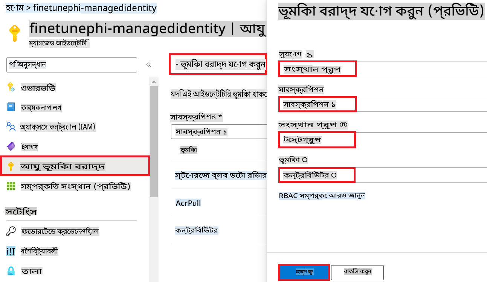

1. **Save** নির্বাচন করুন। 

#### Storage Blob Data Reader রোল অ্যাসাইনমেন্ট যোগ করুন

1. পোর্টাল পৃষ্ঠার উপরের **সার্চ বার** এ *storage accounts* টাইপ করুন এবং প্রদর্শিত বিকল্পগুলির মধ্যে থেকে **Storage accounts** নির্বাচন করুন।

    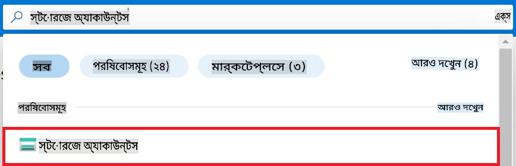

1. আপনি যে Azure Machine Learning workspace এর সাথে সংযুক্ত স্টোরেজ অ্যাকাউন্ট তৈরি করেছেন তা নির্বাচন করুন। উদাহরণস্বরূপ, *finetunephistorage*।

1. Add role assignment পৃষ্ঠায় যান:

    - তৈরি করা স্টোরেজ অ্যাকাউন্টে যান।
    - বাম পাশের ট্যাব থেকে **Access Control (IAM)** নির্বাচন করুন।
    - নেভিগেশন মেনু থেকে **+ Add** নির্বাচন করুন।
    - নেভিগেশন মেনু থেকে **Add role assignment** নির্বাচন করুন।

    

1. Add role assignment পৃষ্ঠায়, নিম্নলিখিত কাজগুলো সম্পন্ন করুন:

    - **Role** পৃষ্ঠায়, **Storage Blob Data Reader** টাইপ করুন এবং প্রদর্শিত বিকল্পগুলির মধ্যে থেকে **Storage Blob Data Reader** নির্বাচন করুন।
    - **Role** পৃষ্ঠায় **Next** নির্বাচন করুন।
    - **Members** পৃষ্ঠায়, **Assign access to** **Managed identity** নির্বাচন করুন।
    - **Members** পৃষ্ঠায়, **+ Select members** নির্বাচন করুন।
    - **Select managed identities** পৃষ্ঠায়, আপনার Azure **Subscription** নির্বাচন করুন।
    - **Select managed identities** পৃষ্ঠায়, **Managed identity** নির্বাচন করুন।
    - **Select managed identities** পৃষ্ঠায়, আপনি যে Managed Identity তৈরি করেছেন তা নির্বাচন করুন। উদাহরণস্বরূপ, *finetunephi-managedidentity*।
    - **Select managed identities** পৃষ্ঠায় **Select** নির্বাচন করুন।

    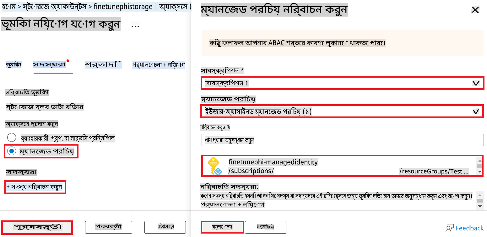

1. **Review + assign** নির্বাচন করুন। 

#### AcrPull রোল অ্যাসাইনমেন্ট যোগ করুন

1. পোর্টাল পৃষ্ঠার উপরের **সার্চ বার** এ *container registries* টাইপ করুন এবং প্রদর্শিত বিকল্পগুলির মধ্যে থেকে **Container registries** নির্বাচন করুন।

    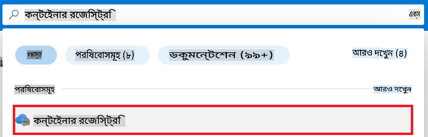

1. যে Container registry Azure Machine Learning workspace এর সাথে সংযুক্ত তা নির্বাচন করুন। উদাহরণস্বরূপ, *finetunephicontainerregistries*।

1. Add role assignment পৃষ্ঠায় যান:

    - বাম পাশের ট্যাব থেকে **Access Control (IAM)** নির্বাচন করুন।
    - নেভিগেশন মেনু থেকে **+ Add** নির্বাচন করুন।
    - নেভিগেশন মেনু থেকে **Add role assignment** নির্বাচন করুন।

1. Add role assignment পৃষ্ঠায়, নিম্নলিখিত কাজগুলো সম্পন্ন করুন:

    - **Role** পৃষ্ঠায়, **AcrPull** টাইপ করুন এবং প্রদর্শিত বিকল্পগুলির মধ্যে থেকে **AcrPull** নির্বাচন করুন।
    - **Role** পৃষ্ঠায় **Next** নির্বাচন করুন।
    - **Members** পৃষ্ঠায়, **Assign access to** **Managed identity** নির্বাচন করুন।
    - **Members** পৃষ্ঠায়, **+ Select members** নির্বাচন করুন।
    - **Select managed identities** পৃষ্ঠায়, আপনার Azure **Subscription** নির্বাচন করুন।
    - **Select managed identities** পৃষ্ঠায়, **Managed identity** নির্বাচন করুন।
    - **Select managed identities** পৃষ্ঠায়, আপনি যে Managed Identity তৈরি করেছেন তা নির্বাচন করুন। উদাহরণস্বরূপ, *finetunephi-managedidentity*।
    - **Select managed identities** পৃষ্ঠায় **Select** নির্বাচন করুন।
    - **Review + assign** নির্বাচন করুন।

### প্রকল্প সেট আপ করুন

এখন, আপনি একটি ফোল্ডার তৈরি করবেন যেখানে কাজ করবেন এবং একটি ভার্চুয়াল এনভায়রনমেন্ট সেট আপ করবেন যা একটি প্রোগ্রাম তৈরি করতে সাহায্য করবে, যা ব্যবহারকারীদের সাথে যোগাযোগ করবে এবং Azure Cosmos DB তে সংরক্ষিত চ্যাট ইতিহাস ব্যবহার করে তার উত্তর প্রদান করবে।

#### কাজের জন্য একটি ফোল্ডার তৈরি করুন

1. একটি টার্মিনাল উইন্ডো খুলুন এবং ডিফল্ট পাথে *finetune-phi* নামে একটি ফোল্ডার তৈরি করতে নিম্নলিখিত কমান্ড টাইপ করুন।

    ```console
    mkdir finetune-phi
    ```

1. তৈরি করা *finetune-phi* ফোল্ডারে নেভিগেট করতে আপনার টার্মিনালে নিম্নলিখিত কমান্ড টাইপ করুন।

    ```console
    cd finetune-phi
    ```

#### একটি ভার্চুয়াল এনভায়রনমেন্ট তৈরি করুন

1. আপনার টার্মিনালে নিম্নলিখিত কমান্ড টাইপ করে *.venv* নামে একটি ভার্চুয়াল এনভায়রনমেন্ট তৈরি করুন।

    ```console
    python -m venv .venv
    ```

1. ভার্চুয়াল এনভায়রনমেন্ট সক্রিয় করতে আপনার টার্মিনালে নিম্নলিখিত কমান্ড টাইপ করুন।

    ```console
    .venv\Scripts\activate.bat
    ```

> [!NOTE]
>
> যদি এটি সফল হয়, তবে আপনি কমান্ড প্রম্পটের আগে *(.venv)* দেখতে পাবেন।

#### প্রয়োজনীয় প্যাকেজ ইনস্টল করুন

1. আপনার টার্মিনালে নিম্নলিখিত কমান্ড টাইপ করে প্রয়োজনীয় প্যাকেজ ইনস্টল করুন।

    ```console
    pip install datasets==2.19.1
    pip install transformers==4.41.1
    pip install azure-ai-ml==1.16.0
    pip install torch==2.3.1
    pip install trl==0.9.4
    pip install promptflow==1.12.0
    ```

#### প্রকল্প ফাইল তৈরি করুন

এই এক্সারসাইজে, আপনি আমাদের প্রকল্পের জন্য প্রয়োজনীয় ফাইল তৈরি করবেন। এই ফাইলগুলোর মধ্যে রয়েছে ডেটাসেট ডাউনলোড করার জন্য স্ক্রিপ্ট, Azure Machine Learning পরিবেশ সেট আপ করা, Phi-3 মডেল ফাইন-টিউন করা, এবং ফাইন-টিউন করা মডেল ডিপ্লয় করা। এছাড়াও, একটি *conda.yml* ফাইল তৈরি করবেন যা ফাইন-টিউনিং পরিবেশ সেট আপ করবে।

এই এক্সারসাইজে, আপনি করবেন:

- ডেটাসেট ডাউনলোড করার জন্য একটি *download_dataset.py* ফাইল তৈরি করুন।
- Azure Machine Learning পরিবেশ সেট আপ করার জন্য একটি *setup_ml.py* ফাইল তৈরি করুন।
- ডেটাসেট ব্যবহার করে Phi-3 মডেল ফাইন-টিউন করার জন্য *finetuning_dir* ফোল্ডারে একটি *fine_tune.py* ফাইল তৈরি করুন।
- ফাইন-টিউনিং পরিবেশ সেট আপ করার জন্য একটি *conda.yml* ফাইল তৈরি করুন।
- ফাইন-টিউন করা মডেল ডিপ্লয় করার জন্য একটি *deploy_model.py* ফাইল তৈরি করুন।
- ফাইন-টিউন করা মডেল Prompt flow এর সাথে ইন্টিগ্রেট করার এবং এটি চালানোর জন্য একটি *integrate_with_promptflow.py* ফাইল তৈরি করুন।
- Prompt flow এর জন্য ওয়ার্কফ্লো স্ট্রাকচার সেট আপ করার জন্য একটি *flow.dag.yml* ফাইল তৈরি করুন।
- Azure তথ্য প্রবেশ করার জন্য একটি *config.py* ফাইল তৈরি করুন।

> [!NOTE]
>
> সম্পূর্ণ ফোল্ডার স্ট্রাকচার:
>
> ```text
> └── YourUserName
> .    └── finetune-phi
> .        ├── finetuning_dir
> .        │      └── fine_tune.py
> .        ├── conda.yml
> .        ├── config.py
> .        ├── deploy_model.py
> .        ├── download_dataset.py
> .        ├── flow.dag.yml
> .        ├── integrate_with_promptflow.py
> .        └── setup_ml.py
> ```

1. **Visual Studio Code** খুলুন।

1. মেনু বার থেকে **File** নির্বাচন করুন।

1. **Open Folder** নির্বাচন করুন।

1. আপনি যে *finetune-phi* ফোল্ডারটি তৈরি করেছেন তা নির্বাচন করুন, যা *C:\Users\yourUserName\finetune-phi* এ অবস্থিত।

    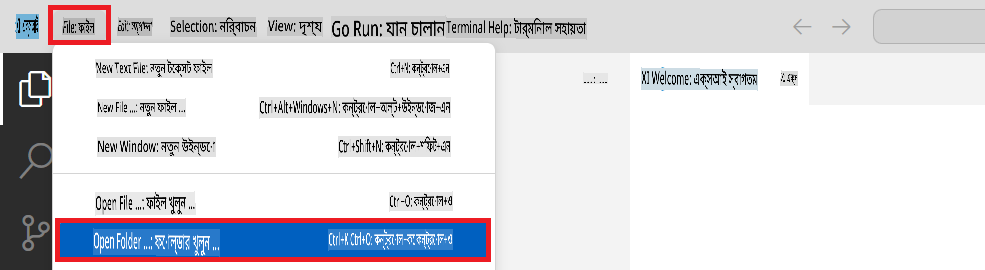

1. Visual Studio Code এর বাম প্যানেলে ডান-ক্লিক করুন এবং **New File** নির্বাচন করুন, এবং *download_dataset.py* নামে একটি নতুন ফাইল তৈরি করুন।

1. Visual Studio Code এর বাম প্যানেলে ডান-ক্লিক করুন এবং **New File** নির্বাচন করুন, এবং *setup_ml.py* নামে একটি নতুন ফাইল তৈরি করুন।


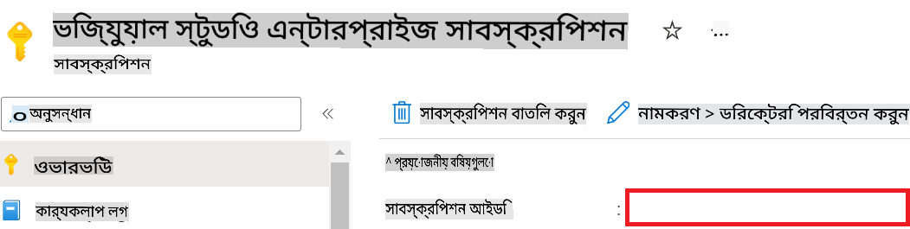

1. Azure Workspace Name যোগ করার জন্য নিম্নলিখিত কাজগুলো সম্পাদন করুন:

    - আপনি তৈরি করা Azure Machine Learning রিসোর্সে যান।
    - আপনার অ্যাকাউন্টের নাম কপি করুন এবং *config.py* ফাইলে পেস্ট করুন।

    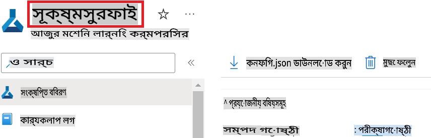

1. Azure Resource Group Name যোগ করার জন্য নিম্নলিখিত কাজগুলো সম্পাদন করুন:

    - আপনি তৈরি করা Azure Machine Learning রিসোর্সে যান।
    - আপনার Azure Resource Group Name কপি করুন এবং *config.py* ফাইলে পেস্ট করুন।

    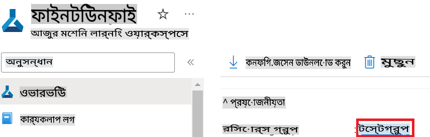

2. Azure Managed Identity নাম যোগ করার জন্য নিম্নলিখিত কাজগুলো সম্পাদন করুন:

    - আপনি তৈরি করা Managed Identities রিসোর্সে যান।
    - আপনার Azure Managed Identity নাম কপি করুন এবং *config.py* ফাইলে পেস্ট করুন।

    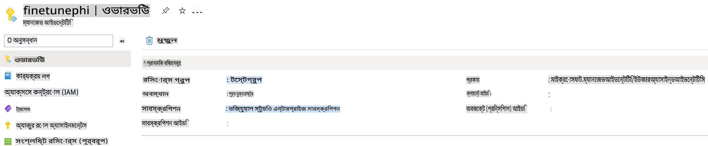

### ফাইন-টিউনিংয়ের জন্য ডেটাসেট প্রস্তুত করুন

এই এক্সারসাইজে, আপনি *download_dataset.py* ফাইলটি চালিয়ে *ULTRACHAT_200k* ডেটাসেটগুলো আপনার লোকাল এনভায়রনমেন্টে ডাউনলোড করবেন। এরপর এই ডেটাসেটগুলো ব্যবহার করে Azure Machine Learning-এ Phi-3 মডেলটি ফাইন-টিউন করবেন।

#### *download_dataset.py* ব্যবহার করে আপনার ডেটাসেট ডাউনলোড করুন

1. Visual Studio Code-এ *download_dataset.py* ফাইলটি খুলুন।

1. *download_dataset.py* ফাইলে নিম্নলিখিত কোড যোগ করুন।

    ```python
    import json
    import os
    from datasets import load_dataset
    from config import (
        TRAIN_DATA_PATH,
        TEST_DATA_PATH)

    def load_and_split_dataset(dataset_name, config_name, split_ratio):
        """
        Load and split a dataset.
        """
        # Load the dataset with the specified name, configuration, and split ratio
        dataset = load_dataset(dataset_name, config_name, split=split_ratio)
        print(f"Original dataset size: {len(dataset)}")
        
        # Split the dataset into train and test sets (80% train, 20% test)
        split_dataset = dataset.train_test_split(test_size=0.2)
        print(f"Train dataset size: {len(split_dataset['train'])}")
        print(f"Test dataset size: {len(split_dataset['test'])}")
        
        return split_dataset

    def save_dataset_to_jsonl(dataset, filepath):
        """
        Save a dataset to a JSONL file.
        """
        # Create the directory if it does not exist
        os.makedirs(os.path.dirname(filepath), exist_ok=True)
        
        # Open the file in write mode
        with open(filepath, 'w', encoding='utf-8') as f:
            # Iterate over each record in the dataset
            for record in dataset:
                # Dump the record as a JSON object and write it to the file
                json.dump(record, f)
                # Write a newline character to separate records
                f.write('\n')
        
        print(f"Dataset saved to {filepath}")

    def main():
        """
        Main function to load, split, and save the dataset.
        """
        # Load and split the ULTRACHAT_200k dataset with a specific configuration and split ratio
        dataset = load_and_split_dataset("HuggingFaceH4/ultrachat_200k", 'default', 'train_sft[:1%]')
        
        # Extract the train and test datasets from the split
        train_dataset = dataset['train']
        test_dataset = dataset['test']

        # Save the train dataset to a JSONL file
        save_dataset_to_jsonl(train_dataset, TRAIN_DATA_PATH)
        
        # Save the test dataset to a separate JSONL file
        save_dataset_to_jsonl(test_dataset, TEST_DATA_PATH)

    if __name__ == "__main__":
        main()

    ```

> [!TIP]
>
> **সিপিইউ ব্যবহার করে একটি ছোট ডেটাসেট দিয়ে ফাইন-টিউনিংয়ের নির্দেশনা**
>
> যদি আপনি ফাইন-টিউনিংয়ের জন্য সিপিইউ ব্যবহার করতে চান, তাহলে এই পদ্ধতি Visual Studio Enterprise Subscription-এর মতো সুবিধাসম্পন্ন সাবস্ক্রিপশনধারীদের জন্য উপযুক্ত বা ফাইন-টিউনিং এবং ডিপ্লয়মেন্ট প্রক্রিয়া দ্রুত পরীক্ষা করার জন্য আদর্শ।
>
> `dataset = load_and_split_dataset("HuggingFaceH4/ultrachat_200k", 'default', 'train_sft[:1%]')` with `dataset = load_and_split_dataset("HuggingFaceH4/ultrachat_200k", 'default', 'train_sft[:10]')` প্রতিস্থাপন করুন।
>

1. আপনার টার্মিনালে নিম্নলিখিত কমান্ড টাইপ করে স্ক্রিপ্টটি চালান এবং ডেটাসেটটি আপনার লোকাল এনভায়রনমেন্টে ডাউনলোড করুন।

    ```console
    python download_data.py
    ```

1. যাচাই করুন যে ডেটাসেটগুলো সফলভাবে আপনার লোকাল *finetune-phi/data* ডিরেক্টরিতে সংরক্ষিত হয়েছে।

> [!NOTE]
>
> **ডেটাসেটের আকার এবং ফাইন-টিউনিংয়ের সময়**
>
> এই E2E নমুনায়, আপনি শুধুমাত্র ১% ডেটাসেট ব্যবহার করবেন (`train_sft[:1%]`)। এটি ডেটার পরিমাণ উল্লেখযোগ্যভাবে কমিয়ে দেয়, যার ফলে আপলোড এবং ফাইন-টিউনিং প্রক্রিয়া দ্রুত হয়। আপনি ট্রেনিংয়ের সময় এবং মডেলের পারফরম্যান্সের মধ্যে সঠিক ভারসাম্য খুঁজে পেতে শতাংশটি সমন্বয় করতে পারেন। একটি ছোট সাবসেট ব্যবহার করলে ফাইন-টিউনিংয়ের সময় কমে যায় এবং E2E নমুনার জন্য এটি আরও ব্যবস্থাপনা-যোগ্য হয়।

## দৃশ্যপট ২: Phi-3 মডেল ফাইন-টিউন এবং Azure Machine Learning Studio-তে ডিপ্লয়

### Azure CLI সেট আপ করুন

আপনার এনভায়রনমেন্ট প্রমাণীকরণের জন্য Azure CLI সেট আপ করতে হবে। Azure CLI আপনাকে কমান্ড লাইনের মাধ্যমে Azure রিসোর্স ম্যানেজ করতে দেয় এবং Azure Machine Learning-কে এই রিসোর্সগুলোতে অ্যাক্সেস করার জন্য প্রয়োজনীয় ক্রিডেনশিয়াল সরবরাহ করে। শুরু করতে [Azure CLI](https://learn.microsoft.com/cli/azure/install-azure-cli) ইন্সটল করুন।

1. একটি টার্মিনাল উইন্ডো খুলুন এবং আপনার Azure অ্যাকাউন্টে লগইন করতে নিম্নলিখিত কমান্ড টাইপ করুন।

    ```console
    az login
    ```

1. আপনার ব্যবহারের জন্য Azure অ্যাকাউন্ট নির্বাচন করুন।

1. আপনার ব্যবহারের জন্য Azure সাবস্ক্রিপশন নির্বাচন করুন।

    

> [!TIP]
>
> যদি Azure-এ সাইন ইন করতে সমস্যা হয়, তাহলে একটি ডিভাইস কোড ব্যবহার করে চেষ্টা করুন। একটি টার্মিনাল উইন্ডো খুলুন এবং আপনার Azure অ্যাকাউন্টে সাইন ইন করতে নিম্নলিখিত কমান্ড টাইপ করুন:
>
> ```console
> az login --use-device-code
> ```
>

### Phi-3 মডেল ফাইন-টিউন করুন

এই এক্সারসাইজে, আপনি প্রদত্ত ডেটাসেট ব্যবহার করে Phi-3 মডেল ফাইন-টিউন করবেন। প্রথমে, আপনি *fine_tune.py* ফাইলে ফাইন-টিউনিং প্রক্রিয়া সংজ্ঞায়িত করবেন। এরপর, Azure Machine Learning এনভায়রনমেন্ট কনফিগার করে *setup_ml.py* ফাইলটি চালিয়ে ফাইন-টিউনিং প্রক্রিয়া শুরু করবেন। এই স্ক্রিপ্টটি নিশ্চিত করে যে ফাইন-টিউনিং Azure Machine Learning এনভায়রনমেন্টে সম্পন্ন হয়।

*setup_ml.py* চালিয়ে, আপনি Azure Machine Learning এনভায়রনমেন্টে ফাইন-টিউনিং প্রক্রিয়া চালাবেন।

#### *fine_tune.py* ফাইলে কোড যোগ করুন

1. *finetuning_dir* ফোল্ডারে যান এবং Visual Studio Code-এ *fine_tune.py* ফাইলটি খুলুন।

1. *fine_tune.py* ফাইলে নিম্নলিখিত কোড যোগ করুন।

    ```python
    import argparse
    import sys
    import logging
    import os
    from datasets import load_dataset
    import torch
    import mlflow
    from transformers import AutoModelForCausalLM, AutoTokenizer, TrainingArguments
    from trl import SFTTrainer

    # To avoid the INVALID_PARAMETER_VALUE error in MLflow, disable MLflow integration
    os.environ["DISABLE_MLFLOW_INTEGRATION"] = "True"

    # Logging setup
    logging.basicConfig(
        format="%(asctime)s - %(levelname)s - %(name)s - %(message)s",
        datefmt="%Y-%m-%d %H:%M:%S",
        handlers=[logging.StreamHandler(sys.stdout)],
        level=logging.WARNING
    )
    logger = logging.getLogger(__name__)

    def initialize_model_and_tokenizer(model_name, model_kwargs):
        """
        Initialize the model and tokenizer with the given pretrained model name and arguments.
        """
        model = AutoModelForCausalLM.from_pretrained(model_name, **model_kwargs)
        tokenizer = AutoTokenizer.from_pretrained(model_name)
        tokenizer.model_max_length = 2048
        tokenizer.pad_token = tokenizer.unk_token
        tokenizer.pad_token_id = tokenizer.convert_tokens_to_ids(tokenizer.pad_token)
        tokenizer.padding_side = 'right'
        return model, tokenizer

    def apply_chat_template(example, tokenizer):
        """
        Apply a chat template to tokenize messages in the example.
        """
        messages = example["messages"]
        if messages[0]["role"] != "system":
            messages.insert(0, {"role": "system", "content": ""})
        example["text"] = tokenizer.apply_chat_template(
            messages, tokenize=False, add_generation_prompt=False
        )
        return example

    def load_and_preprocess_data(train_filepath, test_filepath, tokenizer):
        """
        Load and preprocess the dataset.
        """
        train_dataset = load_dataset('json', data_files=train_filepath, split='train')
        test_dataset = load_dataset('json', data_files=test_filepath, split='train')
        column_names = list(train_dataset.features)

        train_dataset = train_dataset.map(
            apply_chat_template,
            fn_kwargs={"tokenizer": tokenizer},
            num_proc=10,
            remove_columns=column_names,
            desc="Applying chat template to train dataset",
        )

        test_dataset = test_dataset.map(
            apply_chat_template,
            fn_kwargs={"tokenizer": tokenizer},
            num_proc=10,
            remove_columns=column_names,
            desc="Applying chat template to test dataset",
        )

        return train_dataset, test_dataset

    def train_and_evaluate_model(train_dataset, test_dataset, model, tokenizer, output_dir):
        """
        Train and evaluate the model.
        """
        training_args = TrainingArguments(
            bf16=True,
            do_eval=True,
            output_dir=output_dir,
            eval_strategy="epoch",
            learning_rate=5.0e-06,
            logging_steps=20,
            lr_scheduler_type="cosine",
            num_train_epochs=3,
            overwrite_output_dir=True,
            per_device_eval_batch_size=4,
            per_device_train_batch_size=4,
            remove_unused_columns=True,
            save_steps=500,
            seed=0,
            gradient_checkpointing=True,
            gradient_accumulation_steps=1,
            warmup_ratio=0.2,
        )

        trainer = SFTTrainer(
            model=model,
            args=training_args,
            train_dataset=train_dataset,
            eval_dataset=test_dataset,
            max_seq_length=2048,
            dataset_text_field="text",
            tokenizer=tokenizer,
            packing=True
        )

        train_result = trainer.train()
        trainer.log_metrics("train", train_result.metrics)

        mlflow.transformers.log_model(
            transformers_model={"model": trainer.model, "tokenizer": tokenizer},
            artifact_path=output_dir,
        )

        tokenizer.padding_side = 'left'
        eval_metrics = trainer.evaluate()
        eval_metrics["eval_samples"] = len(test_dataset)
        trainer.log_metrics("eval", eval_metrics)

    def main(train_file, eval_file, model_output_dir):
        """
        Main function to fine-tune the model.
        """
        model_kwargs = {
            "use_cache": False,
            "trust_remote_code": True,
            "torch_dtype": torch.bfloat16,
            "device_map": None,
            "attn_implementation": "eager"
        }

        # pretrained_model_name = "microsoft/Phi-3-mini-4k-instruct"
        pretrained_model_name = "microsoft/Phi-3.5-mini-instruct"

        with mlflow.start_run():
            model, tokenizer = initialize_model_and_tokenizer(pretrained_model_name, model_kwargs)
            train_dataset, test_dataset = load_and_preprocess_data(train_file, eval_file, tokenizer)
            train_and_evaluate_model(train_dataset, test_dataset, model, tokenizer, model_output_dir)

    if __name__ == "__main__":
        parser = argparse.ArgumentParser()
        parser.add_argument("--train-file", type=str, required=True, help="Path to the training data")
        parser.add_argument("--eval-file", type=str, required=True, help="Path to the evaluation data")
        parser.add_argument("--model_output_dir", type=str, required=True, help="Directory to save the fine-tuned model")
        args = parser.parse_args()
        main(args.train_file, args.eval_file, args.model_output_dir)

    ```

1. *fine_tune.py* ফাইলটি সেভ করুন এবং বন্ধ করুন।

> [!TIP]
> **আপনি Phi-3.5 মডেল ফাইন-টিউন করতে পারেন**
>
> *fine_tune.py* ফাইলে, আপনি `pretrained_model_name` from `"microsoft/Phi-3-mini-4k-instruct"` to any model you want to fine-tune. For example, if you change it to `"microsoft/Phi-3.5-mini-instruct"`, you'll be using the Phi-3.5-mini-instruct model for fine-tuning. To find and use the model name you prefer, visit [Hugging Face](https://huggingface.co/), search for the model you're interested in, and then copy and paste its name into the `pretrained_model_name` ফিল্ডটি পরিবর্তন করতে পারেন।
>
> :::image type="content" source="../../imgs/03/FineTuning-PromptFlow/finetunephi3.5.png" alt-text="Phi-3.5 মডেল ফাইন-টিউন করুন।":::
>

#### *setup_ml.py* ফাইলে কোড যোগ করুন

1. Visual Studio Code-এ *setup_ml.py* ফাইলটি খুলুন।

1. *setup_ml.py* ফাইলে নিম্নলিখিত কোড যোগ করুন।

    ```python
    import logging
    from azure.ai.ml import MLClient, command, Input
    from azure.ai.ml.entities import Environment, AmlCompute
    from azure.identity import AzureCliCredential
    from config import (
        AZURE_SUBSCRIPTION_ID,
        AZURE_RESOURCE_GROUP_NAME,
        AZURE_ML_WORKSPACE_NAME,
        TRAIN_DATA_PATH,
        TEST_DATA_PATH
    )

    # Constants

    # Uncomment the following lines to use a CPU instance for training
    # COMPUTE_INSTANCE_TYPE = "Standard_E16s_v3" # cpu
    # COMPUTE_NAME = "cpu-e16s-v3"
    # DOCKER_IMAGE_NAME = "mcr.microsoft.com/azureml/openmpi4.1.0-ubuntu20.04:latest"

    # Uncomment the following lines to use a GPU instance for training
    COMPUTE_INSTANCE_TYPE = "Standard_NC24ads_A100_v4"
    COMPUTE_NAME = "gpu-nc24s-a100-v4"
    DOCKER_IMAGE_NAME = "mcr.microsoft.com/azureml/curated/acft-hf-nlp-gpu:59"

    CONDA_FILE = "conda.yml"
    LOCATION = "eastus2" # Replace with the location of your compute cluster
    FINETUNING_DIR = "./finetuning_dir" # Path to the fine-tuning script
    TRAINING_ENV_NAME = "phi-3-training-environment" # Name of the training environment
    MODEL_OUTPUT_DIR = "./model_output" # Path to the model output directory in azure ml

    # Logging setup to track the process
    logger = logging.getLogger(__name__)
    logging.basicConfig(
        format="%(asctime)s - %(levelname)s - %(name)s - %(message)s",
        datefmt="%Y-%m-%d %H:%M:%S",
        level=logging.WARNING
    )

    def get_ml_client():
        """
        Initialize the ML Client using Azure CLI credentials.
        """
        credential = AzureCliCredential()
        return MLClient(credential, AZURE_SUBSCRIPTION_ID, AZURE_RESOURCE_GROUP_NAME, AZURE_ML_WORKSPACE_NAME)

    def create_or_get_environment(ml_client):
        """
        Create or update the training environment in Azure ML.
        """
        env = Environment(
            image=DOCKER_IMAGE_NAME,  # Docker image for the environment
            conda_file=CONDA_FILE,  # Conda environment file
            name=TRAINING_ENV_NAME,  # Name of the environment
        )
        return ml_client.environments.create_or_update(env)

    def create_or_get_compute_cluster(ml_client, compute_name, COMPUTE_INSTANCE_TYPE, location):
        """
        Create or update the compute cluster in Azure ML.
        """
        try:
            compute_cluster = ml_client.compute.get(compute_name)
            logger.info(f"Compute cluster '{compute_name}' already exists. Reusing it for the current run.")
        except Exception:
            logger.info(f"Compute cluster '{compute_name}' does not exist. Creating a new one with size {COMPUTE_INSTANCE_TYPE}.")
            compute_cluster = AmlCompute(
                name=compute_name,
                size=COMPUTE_INSTANCE_TYPE,
                location=location,
                tier="Dedicated",  # Tier of the compute cluster
                min_instances=0,  # Minimum number of instances
                max_instances=1  # Maximum number of instances
            )
            ml_client.compute.begin_create_or_update(compute_cluster).wait()  # Wait for the cluster to be created
        return compute_cluster

    def create_fine_tuning_job(env, compute_name):
        """
        Set up the fine-tuning job in Azure ML.
        """
        return command(
            code=FINETUNING_DIR,  # Path to fine_tune.py
            command=(
                "python fine_tune.py "
                "--train-file ${{inputs.train_file}} "
                "--eval-file ${{inputs.eval_file}} "
                "--model_output_dir ${{inputs.model_output}}"
            ),
            environment=env,  # Training environment
            compute=compute_name,  # Compute cluster to use
            inputs={
                "train_file": Input(type="uri_file", path=TRAIN_DATA_PATH),  # Path to the training data file
                "eval_file": Input(type="uri_file", path=TEST_DATA_PATH),  # Path to the evaluation data file
                "model_output": MODEL_OUTPUT_DIR
            }
        )

    def main():
        """
        Main function to set up and run the fine-tuning job in Azure ML.
        """
        # Initialize ML Client
        ml_client = get_ml_client()

        # Create Environment
        env = create_or_get_environment(ml_client)
        
        # Create or get existing compute cluster
        create_or_get_compute_cluster(ml_client, COMPUTE_NAME, COMPUTE_INSTANCE_TYPE, LOCATION)

        # Create and Submit Fine-Tuning Job
        job = create_fine_tuning_job(env, COMPUTE_NAME)
        returned_job = ml_client.jobs.create_or_update(job)  # Submit the job
        ml_client.jobs.stream(returned_job.name)  # Stream the job logs
        
        # Capture the job name
        job_name = returned_job.name
        print(f"Job name: {job_name}")

    if __name__ == "__main__":
        main()

    ```

1. আপনার নির্দিষ্ট বিবরণ দিয়ে `COMPUTE_INSTANCE_TYPE`, `COMPUTE_NAME`, and `LOCATION` প্রতিস্থাপন করুন।

    ```python
   # Uncomment the following lines to use a GPU instance for training
    COMPUTE_INSTANCE_TYPE = "Standard_NC24ads_A100_v4"
    COMPUTE_NAME = "gpu-nc24s-a100-v4"
    ...
    LOCATION = "eastus2" # Replace with the location of your compute cluster
    ```

> [!TIP]
>
> **সিপিইউ ব্যবহার করে একটি ছোট ডেটাসেট দিয়ে ফাইন-টিউনিংয়ের নির্দেশনা**
>
> যদি আপনি সিপিইউ ব্যবহার করতে চান, তাহলে এই পদ্ধতি Visual Studio Enterprise Subscription-এর মতো সুবিধাসম্পন্ন সাবস্ক্রিপশনধারীদের জন্য উপযুক্ত।
>
> 1. *setup_ml* ফাইলটি খুলুন।
> 1. আপনার নির্দিষ্ট বিবরণ দিয়ে `COMPUTE_INSTANCE_TYPE`, `COMPUTE_NAME`, and `DOCKER_IMAGE_NAME` with the following. If you do not have access to *Standard_E16s_v3*, you can use an equivalent CPU instance or request a new quota.
> 1. Replace `LOCATION` প্রতিস্থাপন করুন।
>
>    ```python
>    # Uncomment the following lines to use a CPU instance for training
>    COMPUTE_INSTANCE_TYPE = "Standard_E16s_v3" # cpu
>    COMPUTE_NAME = "cpu-e16s-v3"
>    DOCKER_IMAGE_NAME = "mcr.microsoft.com/azureml/openmpi4.1.0-ubuntu20.04:latest"
>    LOCATION = "eastus2" # Replace with the location of your compute cluster
>    ```
>

1. *setup_ml.py* স্ক্রিপ্টটি চালিয়ে Azure Machine Learning-এ ফাইন-টিউনিং প্রক্রিয়া শুরু করতে নিম্নলিখিত কমান্ড টাইপ করুন।

    ```python
    python setup_ml.py
    ```

1. এই এক্সারসাইজে, আপনি Azure Machine Learning ব্যবহার করে সফলভাবে Phi-3 মডেল ফাইন-টিউন করেছেন। *setup_ml.py* স্ক্রিপ্ট চালিয়ে, আপনি Azure Machine Learning এনভায়রনমেন্ট সেট আপ করেছেন এবং *fine_tune.py* ফাইলে সংজ্ঞায়িত ফাইন-টিউনিং প্রক্রিয়া শুরু করেছেন। মনে রাখবেন, ফাইন-টিউনিং প্রক্রিয়া সম্পন্ন হতে উল্লেখযোগ্য সময় লাগতে পারে। `python setup_ml.py` command, you need to wait for the process to complete. You can monitor the status of the fine-tuning job by following the link provided in the terminal to the Azure Machine Learning portal.

    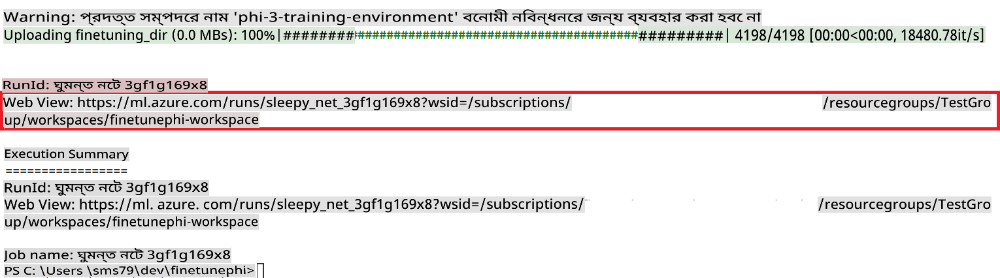

### Deploy the fine-tuned model

To integrate the fine-tuned Phi-3 model with Prompt Flow, you need to deploy the model to make it accessible for real-time inference. This process involves registering the model, creating an online endpoint, and deploying the model.

#### Set the model name, endpoint name, and deployment name for deployment

1. Open *config.py* file.

1. Replace `AZURE_MODEL_NAME = "your_fine_tuned_model_name"` with the desired name for your model.

1. Replace `AZURE_ENDPOINT_NAME = "your_fine_tuned_model_endpoint_name"` with the desired name for your endpoint.

1. Replace `AZURE_DEPLOYMENT_NAME = "your_fine_tuned_model_deployment_name"` চালিয়ে আপনার ডিপ্লয়মেন্টের জন্য পছন্দমতো নাম দিন।

#### *deploy_model.py* ফাইলে কোড যোগ করুন

*deploy_model.py* ফাইল চালালে পুরো ডিপ্লয়মেন্ট প্রক্রিয়া স্বয়ংক্রিয় হয়ে যায়। এটি মডেল রেজিস্টার করে, একটি এন্ডপয়েন্ট তৈরি করে এবং *config.py* ফাইলে নির্ধারিত সেটিংস অনুযায়ী ডিপ্লয়মেন্ট সম্পন্ন করে, যার মধ্যে মডেল নাম, এন্ডপয়েন্ট নাম এবং ডিপ্লয়মেন্ট নাম অন্তর্ভুক্ত।

1. Visual Studio Code-এ *deploy_model.py* ফাইলটি খুলুন।

1. *deploy_model.py* ফাইলে নিম্নলিখিত কোড যোগ করুন।

    ```python
    import logging
    from azure.identity import AzureCliCredential
    from azure.ai.ml import MLClient
    from azure.ai.ml.entities import Model, ProbeSettings, ManagedOnlineEndpoint, ManagedOnlineDeployment, IdentityConfiguration, ManagedIdentityConfiguration, OnlineRequestSettings
    from azure.ai.ml.constants import AssetTypes

    # Configuration imports
    from config import (
        AZURE_SUBSCRIPTION_ID,
        AZURE_RESOURCE_GROUP_NAME,
        AZURE_ML_WORKSPACE_NAME,
        AZURE_MANAGED_IDENTITY_RESOURCE_ID,
        AZURE_MANAGED_IDENTITY_CLIENT_ID,
        AZURE_MODEL_NAME,
        AZURE_ENDPOINT_NAME,
        AZURE_DEPLOYMENT_NAME
    )

    # Constants
    JOB_NAME = "your-job-name"
    COMPUTE_INSTANCE_TYPE = "Standard_E4s_v3"

    deployment_env_vars = {
        "SUBSCRIPTION_ID": AZURE_SUBSCRIPTION_ID,
        "RESOURCE_GROUP_NAME": AZURE_RESOURCE_GROUP_NAME,
        "UAI_CLIENT_ID": AZURE_MANAGED_IDENTITY_CLIENT_ID,
    }

    # Logging setup
    logging.basicConfig(
        format="%(asctime)s - %(levelname)s - %(name)s - %(message)s",
        datefmt="%Y-%m-%d %H:%M:%S",
        level=logging.DEBUG
    )
    logger = logging.getLogger(__name__)

    def get_ml_client():
        """Initialize and return the ML Client."""
        credential = AzureCliCredential()
        return MLClient(credential, AZURE_SUBSCRIPTION_ID, AZURE_RESOURCE_GROUP_NAME, AZURE_ML_WORKSPACE_NAME)

    def register_model(ml_client, model_name, job_name):
        """Register a new model."""
        model_path = f"azureml://jobs/{job_name}/outputs/artifacts/paths/model_output"
        logger.info(f"Registering model {model_name} from job {job_name} at path {model_path}.")
        run_model = Model(
            path=model_path,
            name=model_name,
            description="Model created from run.",
            type=AssetTypes.MLFLOW_MODEL,
        )
        model = ml_client.models.create_or_update(run_model)
        logger.info(f"Registered model ID: {model.id}")
        return model

    def delete_existing_endpoint(ml_client, endpoint_name):
        """Delete existing endpoint if it exists."""
        try:
            endpoint_result = ml_client.online_endpoints.get(name=endpoint_name)
            logger.info(f"Deleting existing endpoint {endpoint_name}.")
            ml_client.online_endpoints.begin_delete(name=endpoint_name).result()
            logger.info(f"Deleted existing endpoint {endpoint_name}.")
        except Exception as e:
            logger.info(f"No existing endpoint {endpoint_name} found to delete: {e}")

    def create_or_update_endpoint(ml_client, endpoint_name, description=""):
        """Create or update an endpoint."""
        delete_existing_endpoint(ml_client, endpoint_name)
        logger.info(f"Creating new endpoint {endpoint_name}.")
        endpoint = ManagedOnlineEndpoint(
            name=endpoint_name,
            description=description,
            identity=IdentityConfiguration(
                type="user_assigned",
                user_assigned_identities=[ManagedIdentityConfiguration(resource_id=AZURE_MANAGED_IDENTITY_RESOURCE_ID)]
            )
        )
        endpoint_result = ml_client.online_endpoints.begin_create_or_update(endpoint).result()
        logger.info(f"Created new endpoint {endpoint_name}.")
        return endpoint_result

    def create_or_update_deployment(ml_client, endpoint_name, deployment_name, model):
        """Create or update a deployment."""

        logger.info(f"Creating deployment {deployment_name} for endpoint {endpoint_name}.")
        deployment = ManagedOnlineDeployment(
            name=deployment_name,
            endpoint_name=endpoint_name,
            model=model.id,
            instance_type=COMPUTE_INSTANCE_TYPE,
            instance_count=1,
            environment_variables=deployment_env_vars,
            request_settings=OnlineRequestSettings(
                max_concurrent_requests_per_instance=3,
                request_timeout_ms=180000,
                max_queue_wait_ms=120000
            ),
            liveness_probe=ProbeSettings(
                failure_threshold=30,
                success_threshold=1,
                period=100,
                initial_delay=500,
            ),
            readiness_probe=ProbeSettings(
                failure_threshold=30,
                success_threshold=1,
                period=100,
                initial_delay=500,
            ),
        )
        deployment_result = ml_client.online_deployments.begin_create_or_update(deployment).result()
        logger.info(f"Created deployment {deployment.name} for endpoint {endpoint_name}.")
        return deployment_result

    def set_traffic_to_deployment(ml_client, endpoint_name, deployment_name):
        """Set traffic to the specified deployment."""
        try:
            # Fetch the current endpoint details
            endpoint = ml_client.online_endpoints.get(name=endpoint_name)
            
            # Log the current traffic allocation for debugging
            logger.info(f"Current traffic allocation: {endpoint.traffic}")
            
            # Set the traffic allocation for the deployment
            endpoint.traffic = {deployment_name: 100}
            
            # Update the endpoint with the new traffic allocation
            endpoint_poller = ml_client.online_endpoints.begin_create_or_update(endpoint)
            updated_endpoint = endpoint_poller.result()
            
            # Log the updated traffic allocation for debugging
            logger.info(f"Updated traffic allocation: {updated_endpoint.traffic}")
            logger.info(f"Set traffic to deployment {deployment_name} at endpoint {endpoint_name}.")
            return updated_endpoint
        except Exception as e:
            # Log any errors that occur during the process
            logger.error(f"Failed to set traffic to deployment: {e}")
            raise


    def main():
        ml_client = get_ml_client()

        registered_model = register_model(ml_client, AZURE_MODEL_NAME, JOB_NAME)
        logger.info(f"Registered model ID: {registered_model.id}")

        endpoint = create_or_update_endpoint(ml_client, AZURE_ENDPOINT_NAME, "Endpoint for finetuned Phi-3 model")
        logger.info(f"Endpoint {AZURE_ENDPOINT_NAME} is ready.")

        try:
            deployment = create_or_update_deployment(ml_client, AZURE_ENDPOINT_NAME, AZURE_DEPLOYMENT_NAME, registered_model)
            logger.info(f"Deployment {AZURE_DEPLOYMENT_NAME} is created for endpoint {AZURE_ENDPOINT_NAME}.")

            set_traffic_to_deployment(ml_client, AZURE_ENDPOINT_NAME, AZURE_DEPLOYMENT_NAME)
            logger.info(f"Traffic is set to deployment {AZURE_DEPLOYMENT_NAME} at endpoint {AZURE_ENDPOINT_NAME}.")
        except Exception as e:
            logger.error(f"Failed to create or update deployment: {e}")

    if __name__ == "__main__":
        main()

    ```

1. `JOB_NAME`:

    - Navigate to Azure Machine Learning resource that you created.
    - Select **Studio web URL** to open the Azure Machine Learning workspace.
    - Select **Jobs** from the left side tab.
    - Select the experiment for fine-tuning. For example, *finetunephi*.
    - Select the job that you created.
    - Copy and paste your job Name into the `JOB_NAME = "your-job-name"` in *deploy_model.py* file.

1. Replace `COMPUTE_INSTANCE_TYPE` আপনার নির্দিষ্ট বিবরণ দিয়ে প্রতিস্থাপন করুন।

1. *deploy_model.py* স্ক্রিপ্টটি চালিয়ে Azure Machine Learning-এ ডিপ্লয়মেন্ট প্রক্রিয়া শুরু করতে নিম্নলিখিত কমান্ড টাইপ করুন।

    ```python
    python deploy_model.py
    ```

> [!WARNING]
> আপনার অ্যাকাউন্টে অতিরিক্ত চার্জ এড়াতে, Azure Machine Learning workspace-এ তৈরি করা এন্ডপয়েন্ট মুছে ফেলতে ভুলবেন না।
>

#### Azure Machine Learning Workspace-এ ডিপ্লয়মেন্ট স্ট্যাটাস পরীক্ষা করুন

1. [Azure ML Studio](https://ml.azure.com/home?wt.mc_id=studentamb_279723) পরিদর্শন করুন।

1. আপনি তৈরি করা Azure Machine Learning workspace-এ যান।

1. **Studio web URL** নির্বাচন করে Azure Machine Learning workspace খুলুন।

1. বাম দিকের ট্যাব থেকে **Endpoints** নির্বাচন করুন।

    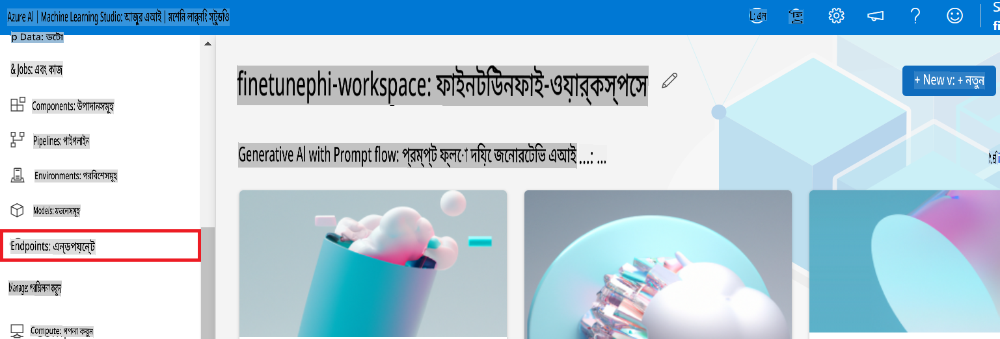

2. আপনি তৈরি করা এন্ডপয়েন্ট নির্বাচন করুন।

    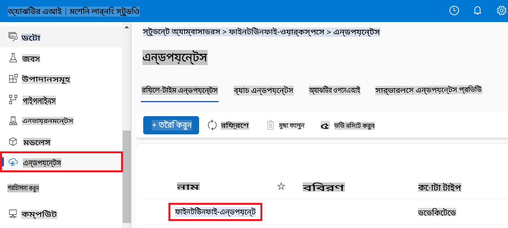

3. এই পৃষ্ঠায়, আপনি ডিপ্লয়মেন্ট প্রক্রিয়ার সময় তৈরি করা এন্ডপয়েন্টগুলো ম্যানেজ করতে পারবেন।

## দৃশ্যপট ৩: Prompt flow-এর সাথে ইন্টিগ্রেট করুন এবং আপনার কাস্টম মডেলের সাথে চ্যাট করুন

### কাস্টম Phi-3 মডেল Prompt flow-এর সাথে ইন্টিগ্রেট করুন

সফলভাবে আপনার ফাইন-টিউন করা মডেল ডিপ্লয় করার পর, আপনি এখন এটি Prompt flow-এর সাথে ইন্টিগ্রেট করতে পারবেন। এটি আপনাকে আপনার কাস্টম Phi-3 মডেলটি রিয়েল-টাইম অ্যাপ্লিকেশনে ব্যবহার করতে দেবে এবং বিভিন্ন ইন্টারেক্টিভ কাজ সম্পাদন করার সুযোগ দেবে।

#### ফাইন-টিউন করা Phi-3 মডেলের এপিআই কী এবং এন্ডপয়েন্ট ইউআরআই সেট করুন

1. আপনি তৈরি করা Azure Machine Learning workspace-এ যান।
1. বাম দিকের ট্যাব থেকে **Endpoints** নির্বাচন করুন।
1. আপনি তৈরি করা এন্ডপয়েন্ট নির্বাচন করুন।
1. নেভিগেশন মেনু থেকে **Consume** নির্বাচন করুন।
1. আপনার **REST endpoint** কপি করুন এবং *config.py* ফাইলে `AZURE_ML_ENDPOINT = "your_fine_tuned_model_endpoint_uri"` with your **REST endpoint**.
1. Copy and paste your **Primary key** into the *config.py* file, replacing `AZURE_ML_API_KEY = "your_fine_tuned_model_api_key"` এর স্থলে **Primary key** সহ পেস্ট করুন।

    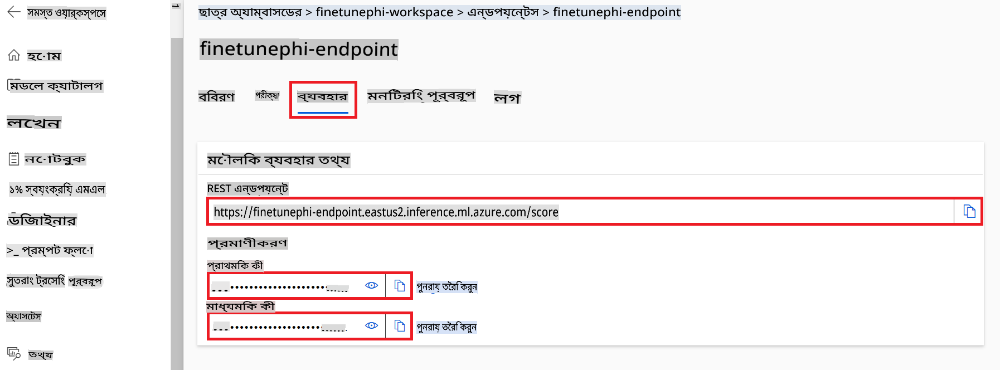

#### *flow.dag.yml* ফাইলে কোড যোগ করুন

1. Visual Studio Code-এ *flow.dag.yml* ফাইলটি খুলুন।

1. *flow.dag.yml* ফাইলে নিম্নলিখিত কোড যোগ করুন।

    ```yml
    inputs:
      input_data:
        type: string
        default: "Who founded Microsoft?"

    outputs:
      answer:
        type: string
        reference: ${integrate_with_promptflow.output}

    nodes:
    - name: integrate_with_promptflow
      type: python
      source:
        type: code
        path: integrate_with_promptflow.py
      inputs:
        input_data: ${inputs.input_data}
    ```

#### *integrate_with_promptflow.py* ফাইলে কোড যোগ করুন

1. Visual Studio Code-এ *integrate_with_promptflow.py* ফাইলটি খুলুন।

1. *integrate_with_promptflow.py* ফাইলে নিম্নলিখিত কোড যোগ করুন।

    ```python
    import logging
    import requests
    from promptflow.core import tool
    import asyncio
    import platform
    from config import (
        AZURE_ML_ENDPOINT,
        AZURE_ML_API_KEY
    )

    # Logging setup
    logging.basicConfig(
        format="%(asctime)s - %(levelname)s - %(name)s - %(message)s",
        datefmt="%Y-%m-%d %H:%M:%S",
        level=logging.DEBUG
    )
    logger = logging.getLogger(__name__)

    def query_azml_endpoint(input_data: list, endpoint_url: str, api_key: str) -> str:
        """
        Send a request to the Azure ML endpoint with the given input data.
        """
        headers = {
            "Content-Type": "application/json",
            "Authorization": f"Bearer {api_key}"
        }
        data = {
            "input_data": [input_data],
            "params": {
                "temperature": 0.7,
                "max_new_tokens": 128,
                "do_sample": True,
                "return_full_text": True
            }
        }
        try:
            response = requests.post(endpoint_url, json=data, headers=headers)
            response.raise_for_status()
            result = response.json()[0]
            logger.info("Successfully received response from Azure ML Endpoint.")
            return result
        except requests.exceptions.RequestException as e:
            logger.error(f"Error querying Azure ML Endpoint: {e}")
            raise

    def setup_asyncio_policy():
        """
        Setup asyncio event loop policy for Windows.
        """
        if platform.system() == 'Windows':
            asyncio.set_event_loop_policy(asyncio.WindowsSelectorEventLoopPolicy())
            logger.info("Set Windows asyncio event loop policy.")

    @tool
    def my_python_tool(input_data: str) -> str:
        """
        Tool function to process input data and query the Azure ML endpoint.
        """
        setup_asyncio_policy()
        return query_azml_endpoint(input_data, AZURE_ML_ENDPOINT, AZURE_ML_API_KEY)

    ```

### আপনার কাস্টম মডেলের সাথে চ্যাট করুন

1. *deploy_model.py* স্ক্রিপ্ট চালিয়ে Azure Machine Learning-এ ডিপ্লয়মেন্ট প্রক্রিয়া শুরু করতে নিম্নলিখিত কমান্ড টাইপ করুন।

    ```python
    pf flow serve --source ./ --port 8080 --host localhost
    ```

1. উদাহরণস্বরূপ ফলাফল: এখন আপনি আপনার কাস্টম Phi-3 মডেলের সাথে চ্যাট করতে পারবেন। ফাইন-টিউনিংয়ের জন্য ব্যবহৃত ডেটার উপর ভিত্তি করে প্রশ্ন জিজ্ঞাসা করার পরামর্শ দেওয়া হচ্ছে।

    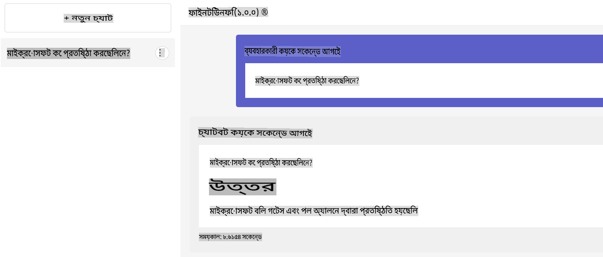

**অস্বীকৃতি**:  
এই নথিটি মেশিন-ভিত্তিক এআই অনুবাদ পরিষেবার মাধ্যমে অনুবাদ করা হয়েছে। আমরা যথাসাধ্য নির্ভুলতার জন্য চেষ্টা করি, তবে অনুগ্রহ করে মনে রাখবেন যে স্বয়ংক্রিয় অনুবাদে ত্রুটি বা অসঙ্গতি থাকতে পারে। এর মূল ভাষায় থাকা নথিটিকেই প্রামাণিক উৎস হিসেবে বিবেচনা করা উচিত। গুরুত্বপূর্ণ তথ্যের জন্য পেশাদার মানব অনুবাদের পরামর্শ দেওয়া হয়। এই অনুবাদ ব্যবহারের ফলে কোনো ভুল বোঝাবুঝি বা ভুল ব্যাখ্যা হলে আমরা দায়ী থাকব না।