# ফাইন-টিউন এবং Azure AI Foundry-তে Prompt Flow এর সাথে কাস্টম Phi-3 মডেল সংযুক্ত করা

এই এন্ড-টু-এন্ড (E2E) নমুনাটি Microsoft Tech Community-এর গাইড "[Fine-Tune and Integrate Custom Phi-3 Models with Prompt Flow in Azure AI Foundry](https://techcommunity.microsoft.com/t5/educator-developer-blog/fine-tune-and-integrate-custom-phi-3-models-with-prompt-flow-in/ba-p/4191726?WT.mc_id=aiml-137032-kinfeylo)" উপর ভিত্তি করে তৈরি। এটি Azure AI Foundry-তে Prompt Flow এর সাথে কাস্টম Phi-3 মডেল ফাইন-টিউন, ডিপ্লয় এবং ইন্টিগ্রেট করার প্রক্রিয়া উপস্থাপন করে।  
E2E নমুনা "[Fine-Tune and Integrate Custom Phi-3 Models with Prompt Flow](./E2E_Phi-3-FineTuning_PromptFlow_Integration.md)" যেখানে কোড লোকালভাবে চালানো হয়েছে, এই টিউটোরিয়ালটি সম্পূর্ণরূপে Azure AI / ML Studio এর ভিতরে মডেল ফাইন-টিউন এবং ইন্টিগ্রেশনে ফোকাস করে।

## ওভারভিউ

এই E2E নমুনাতে, আপনি শিখবেন কিভাবে Phi-3 মডেল ফাইন-টিউন এবং Azure AI Foundry-তে Prompt Flow এর সাথে সংযুক্ত করবেন। Azure AI / ML Studio ব্যবহার করে, আপনি কাস্টম AI মডেল ডিপ্লয় এবং ব্যবহার করার জন্য একটি ওয়ার্কফ্লো তৈরি করবেন। এই E2E নমুনাটি তিনটি পরিস্থিতিতে বিভক্ত:

**পরিস্থিতি ১: Azure রিসোর্স সেট আপ এবং ফাইন-টিউনিংয়ের জন্য প্রস্তুতি নেওয়া**

**পরিস্থিতি ২: Phi-3 মডেল ফাইন-টিউন এবং Azure Machine Learning Studio-তে ডিপ্লয় করা**

**পরিস্থিতি ৩: Prompt Flow এর সাথে ইন্টিগ্রেট এবং Azure AI Foundry-তে আপনার কাস্টম মডেলের সাথে চ্যাট করা**

এখানে এই E2E নমুনার একটি ওভারভিউ দেওয়া হলো।

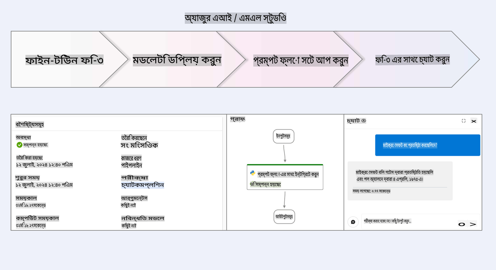

### বিষয়বস্তু সূচি

1. **[পরিস্থিতি ১: Azure রিসোর্স সেট আপ এবং ফাইন-টিউনিংয়ের জন্য প্রস্তুতি নেওয়া](../../../../../../md/02.Application/01.TextAndChat/Phi3)**  
    - [Azure Machine Learning Workspace তৈরি করুন](../../../../../../md/02.Application/01.TextAndChat/Phi3)  
    - [Azure Subscription-এ GPU কোটা অনুরোধ করুন](../../../../../../md/02.Application/01.TextAndChat/Phi3)  
    - [রোল অ্যাসাইনমেন্ট যোগ করুন](../../../../../../md/02.Application/01.TextAndChat/Phi3)  
    - [প্রজেক্ট সেট আপ করুন](../../../../../../md/02.Application/01.TextAndChat/Phi3)  
    - [ফাইন-টিউনিংয়ের জন্য ডেটাসেট প্রস্তুত করুন](../../../../../../md/02.Application/01.TextAndChat/Phi3)  

2. **[পরিস্থিতি ২: Phi-3 মডেল ফাইন-টিউন এবং Azure Machine Learning Studio-তে ডিপ্লয় করা](../../../../../../md/02.Application/01.TextAndChat/Phi3)**  
    - [Phi-3 মডেল ফাইন-টিউন করা](../../../../../../md/02.Application/01.TextAndChat/Phi3)  
    - [ফাইন-টিউন করা Phi-3 মডেল ডিপ্লয় করা](../../../../../../md/02.Application/01.TextAndChat/Phi3)  

3. **[পরিস্থিতি ৩: Prompt Flow এর সাথে ইন্টিগ্রেট এবং Azure AI Foundry-তে আপনার কাস্টম মডেলের সাথে চ্যাট করা](../../../../../../md/02.Application/01.TextAndChat/Phi3)**  
    - [Prompt Flow এর সাথে কাস্টম Phi-3 মডেল ইন্টিগ্রেট করা](../../../../../../md/02.Application/01.TextAndChat/Phi3)  
    - [আপনার কাস্টম Phi-3 মডেলের সাথে চ্যাট করুন](../../../../../../md/02.Application/01.TextAndChat/Phi3)  

## পরিস্থিতি ১: Azure রিসোর্স সেট আপ এবং ফাইন-টিউনিংয়ের জন্য প্রস্তুতি নেওয়া

### Azure Machine Learning Workspace তৈরি করুন

1. পোর্টাল পৃষ্ঠার উপরের **সার্চ বার**-এ *azure machine learning* টাইপ করুন এবং প্রদর্শিত অপশন থেকে **Azure Machine Learning** নির্বাচন করুন।

    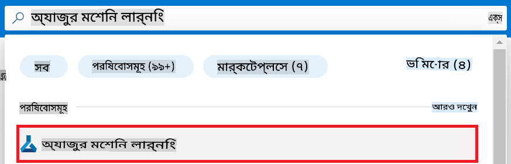

2. নেভিগেশন মেনু থেকে **+ Create** নির্বাচন করুন।  

3. নেভিগেশন মেনু থেকে **New workspace** নির্বাচন করুন।  

    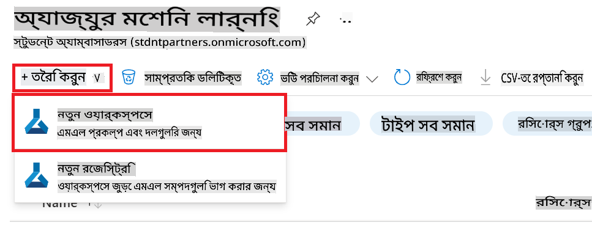

4. নিম্নলিখিত কাজগুলো সম্পন্ন করুন:  

    - আপনার Azure **Subscription** নির্বাচন করুন।  
    - ব্যবহার করতে **Resource group** নির্বাচন করুন (প্রয়োজন হলে একটি নতুন তৈরি করুন)।  
    - **Workspace Name** লিখুন। এটি একটি ইউনিক মান হতে হবে।  
    - ব্যবহার করতে চান এমন **Region** নির্বাচন করুন।  
    - ব্যবহার করতে **Storage account** নির্বাচন করুন (প্রয়োজন হলে একটি নতুন তৈরি করুন)।  
    - ব্যবহার করতে **Key vault** নির্বাচন করুন (প্রয়োজন হলে একটি নতুন তৈরি করুন)।  
    - ব্যবহার করতে **Application insights** নির্বাচন করুন (প্রয়োজন হলে একটি নতুন তৈরি করুন)।  
    - ব্যবহার করতে **Container registry** নির্বাচন করুন (প্রয়োজন হলে একটি নতুন তৈরি করুন)।  

    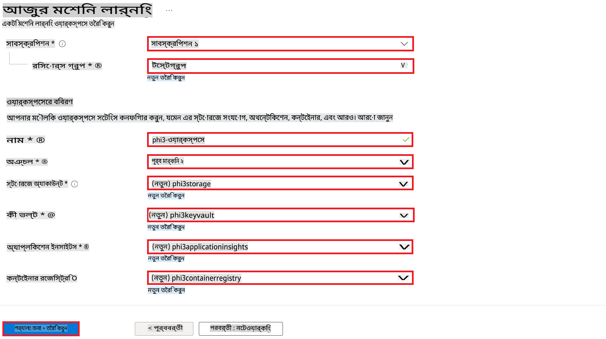

5. **Review + Create** নির্বাচন করুন।  

6. **Create** নির্বাচন করুন।  

### Azure Subscription-এ GPU কোটা অনুরোধ করুন

এই টিউটোরিয়ালে, আপনি GPU ব্যবহার করে একটি Phi-3 মডেল ফাইন-টিউন এবং ডিপ্লয় করবেন। ফাইন-টিউনিংয়ের জন্য, আপনি *Standard_NC24ads_A100_v4* GPU ব্যবহার করবেন, যা একটি কোটা অনুরোধ প্রয়োজন। ডিপ্লয়মেন্টের জন্য, আপনি *Standard_NC6s_v3* GPU ব্যবহার করবেন, যা কোটা অনুরোধও প্রয়োজন।  

> [!NOTE]  
>  
> শুধুমাত্র Pay-As-You-Go সাবস্ক্রিপশন (স্ট্যান্ডার্ড সাবস্ক্রিপশন টাইপ) GPU বরাদ্দের জন্য যোগ্য; বেনিফিট সাবস্ক্রিপশন বর্তমানে সমর্থিত নয়।  
>

1. [Azure ML Studio](https://ml.azure.com/home?wt.mc_id=studentamb_279723) ভিজিট করুন।  

1. *Standard NCADSA100v4 Family* কোটা অনুরোধ করতে নিম্নলিখিত কাজগুলো সম্পন্ন করুন:  

    - বাম পাশের ট্যাব থেকে **Quota** নির্বাচন করুন।  
    - ব্যবহার করতে **Virtual machine family** নির্বাচন করুন। উদাহরণস্বরূপ, **Standard NCADSA100v4 Family Cluster Dedicated vCPUs** নির্বাচন করুন, যা *Standard_NC24ads_A100_v4* GPU অন্তর্ভুক্ত করে।  
    - নেভিগেশন মেনু থেকে **Request quota** নির্বাচন করুন।  

        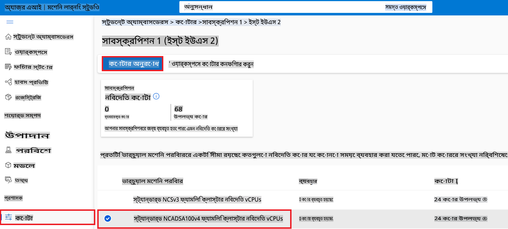

    - Request quota পৃষ্ঠায়, ব্যবহার করতে চান এমন **New cores limit** লিখুন। উদাহরণস্বরূপ, ২৪।  
    - Request quota পৃষ্ঠায়, GPU কোটা অনুরোধ করতে **Submit** নির্বাচন করুন।  

1. *Standard NCSv3 Family* কোটা অনুরোধ করতে নিম্নলিখিত কাজগুলো সম্পন্ন করুন:  

    - বাম পাশের ট্যাব থেকে **Quota** নির্বাচন করুন।  
    - ব্যবহার করতে **Virtual machine family** নির্বাচন করুন। উদাহরণস্বরূপ, **Standard NCSv3 Family Cluster Dedicated vCPUs** নির্বাচন করুন, যা *Standard_NC6s_v3* GPU অন্তর্ভুক্ত করে।  
    - নেভিগেশন মেনু থেকে **Request quota** নির্বাচন করুন।  
    - Request quota পৃষ্ঠায়, ব্যবহার করতে চান এমন **New cores limit** লিখুন। উদাহরণস্বরূপ, ২৪।  
    - Request quota পৃষ্ঠায়, GPU কোটা অনুরোধ করতে **Submit** নির্বাচন করুন।  

### রোল অ্যাসাইনমেন্ট যোগ করুন

আপনার মডেল ফাইন-টিউন এবং ডিপ্লয় করতে, প্রথমে আপনাকে একটি User Assigned Managed Identity (UAI) তৈরি করতে হবে এবং এটি সঠিক অনুমতিগুলি দিতে হবে। এই UAI ডিপ্লয়মেন্টের সময় প্রমাণীকরণের জন্য ব্যবহৃত হবে।  

#### User Assigned Managed Identity (UAI) তৈরি করুন

1. পোর্টাল পৃষ্ঠার উপরের **সার্চ বার**-এ *managed identities* টাইপ করুন এবং প্রদর্শিত অপশন থেকে **Managed Identities** নির্বাচন করুন।  

    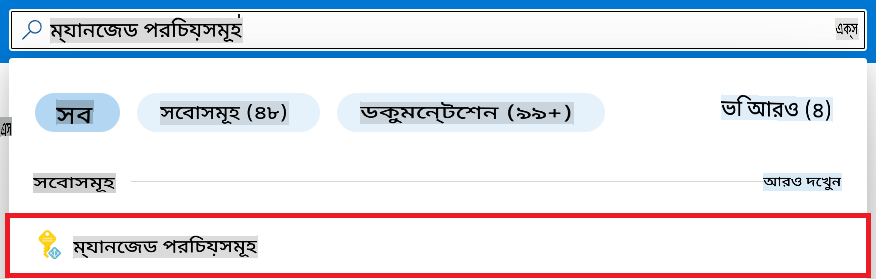

1. **+ Create** নির্বাচন করুন।  

    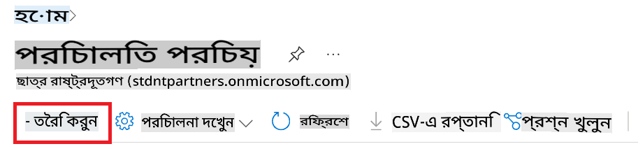

1. নিম্নলিখিত কাজগুলো সম্পন্ন করুন:  

    - আপনার Azure **Subscription** নির্বাচন করুন।  
    - ব্যবহার করতে **Resource group** নির্বাচন করুন (প্রয়োজন হলে একটি নতুন তৈরি করুন)।  
    - ব্যবহার করতে চান এমন **Region** নির্বাচন করুন।  
    - **Name** লিখুন। এটি একটি ইউনিক মান হতে হবে।  

    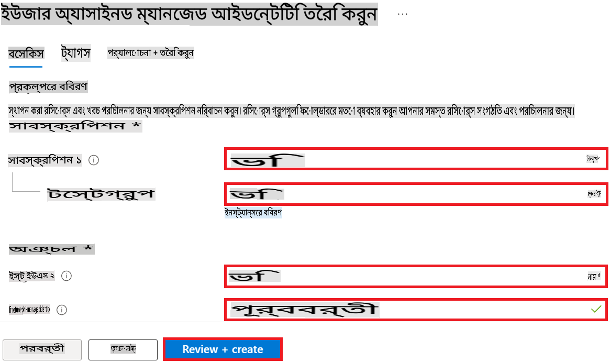

1. **Review + create** নির্বাচন করুন।  

1. **+ Create** নির্বাচন করুন।  

#### Managed Identity-তে Contributor রোল অ্যাসাইনমেন্ট যোগ করুন

1. আপনি তৈরি করা Managed Identity রিসোর্সে যান।  

1. বাম পাশের ট্যাব থেকে **Azure role assignments** নির্বাচন করুন।  

1. নেভিগেশন মেনু থেকে **+Add role assignment** নির্বাচন করুন।  

1. Add role assignment পৃষ্ঠায়, নিম্নলিখিত কাজগুলো সম্পন্ন করুন:  
    - **Scope** কে **Resource group** এ সেট করুন।  
    - আপনার Azure **Subscription** নির্বাচন করুন।  
    - ব্যবহার করতে **Resource group** নির্বাচন করুন।  
    - **Role** কে **Contributor** এ সেট করুন।  

    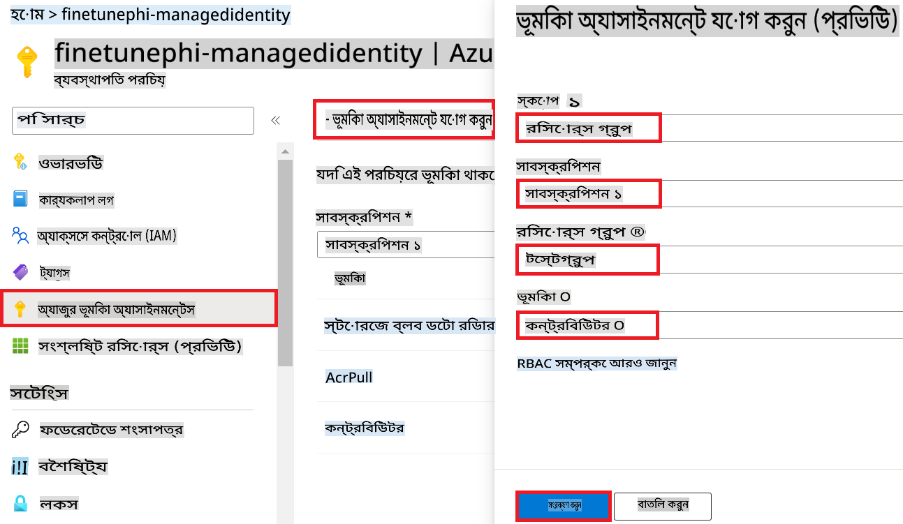

2. **Save** নির্বাচন করুন।  

#### Managed Identity-তে Storage Blob Data Reader রোল অ্যাসাইনমেন্ট যোগ করুন

1. পোর্টাল পৃষ্ঠার উপরের **সার্চ বার**-এ *storage accounts* টাইপ করুন এবং প্রদর্শিত অপশন থেকে **Storage accounts** নির্বাচন করুন।  

    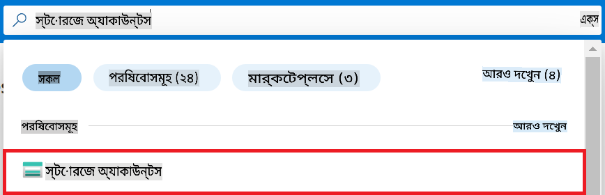

1. আপনি তৈরি করা Azure Machine Learning workspace এর সাথে যুক্ত স্টোরেজ অ্যাকাউন্ট নির্বাচন করুন। উদাহরণস্বরূপ, *finetunephistorage*।  

1. Add role assignment পৃষ্ঠায় যেতে নিম্নলিখিত কাজগুলো সম্পন্ন করুন:  

    - তৈরি করা Azure Storage অ্যাকাউন্টে যান।  
    - বাম পাশের ট্যাব থেকে **Access Control (IAM)** নির্বাচন করুন।  
    - নেভিগেশন মেনু থেকে **+ Add** নির্বাচন করুন।  
    - নেভিগেশন মেনু থেকে **Add role assignment** নির্বাচন করুন।  

    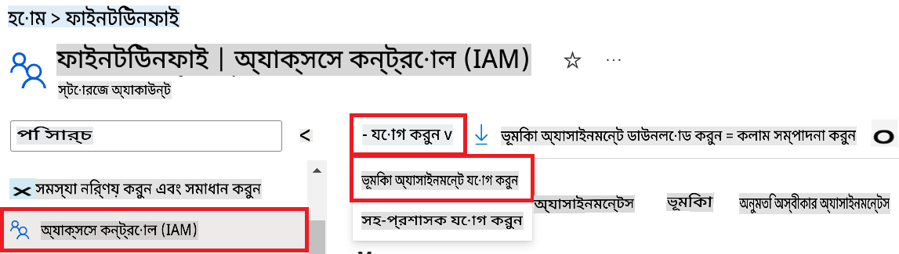

1. Add role assignment পৃষ্ঠায়, নিম্নলিখিত কাজগুলো সম্পন্ন করুন:  

    - Role পৃষ্ঠায়, **Storage Blob Data Reader** টাইপ করুন এবং প্রদর্শিত অপশন থেকে **Storage Blob Data Reader** নির্বাচন করুন।  
    - Role পৃষ্ঠায়, **Next** নির্বাচন করুন।  
    - Members পৃষ্ঠায়, **Assign access to** কে **Managed identity** এ সেট করুন।  
    - Members পৃষ্ঠায়, **+ Select members** নির্বাচন করুন।  
    - Select managed identities পৃষ্ঠায়, আপনার Azure **Subscription** নির্বাচন করুন।  
    - Select managed identities পৃষ্ঠায়, **Managed identity** কে **Manage Identity** এ সেট করুন।  
    - Select managed identities পৃষ্ঠায়, আপনি তৈরি করা Managed Identity নির্বাচন করুন। উদাহরণস্বরূপ, *finetunephi-managedidentity*।  
    - Select managed identities পৃষ্ঠায়, **Select** নির্বাচন করুন।  

    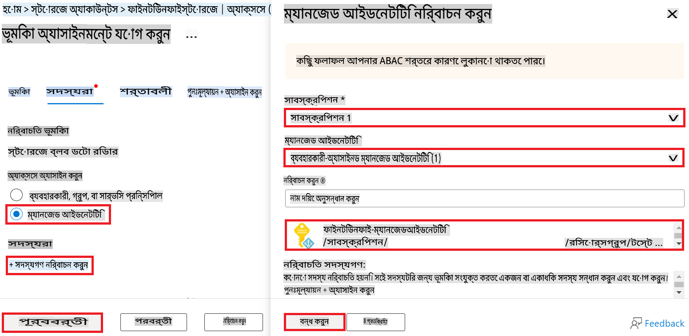

1. **Review + assign** নির্বাচন করুন।  

#### Managed Identity-তে AcrPull রোল অ্যাসাইনমেন্ট যোগ করুন

1. পোর্টাল পৃষ্ঠার উপরের **সার্চ বার**-এ *container registries* টাইপ করুন এবং প্রদর্শিত অপশন থেকে **Container registries** নির্বাচন করুন।  

    

1. Azure Machine Learning workspace এর সাথে যুক্ত কন্টেইনার রেজিস্ট্রি নির্বাচন করুন। উদাহরণস্বরূপ, *finetunephicontainerregistry*।  

1. Add role assignment পৃষ্ঠায় যেতে নিম্নলিখিত কাজগুলো সম্পন্ন করুন:  

    - বাম পাশের ট্যাব থেকে **Access Control (IAM)** নির্বাচন করুন।  
    - নেভিগেশন মেনু থেকে **+ Add** নির্বাচন করুন।  
    - নেভিগেশন মেনু থেকে **Add role assignment** নির্বাচন করুন।  

1. Add role assignment পৃষ্ঠায়, নিম্নলিখিত কাজগুলো সম্পন্ন করুন:  

    - Role পৃষ্ঠায়, **AcrPull** টাইপ করুন এবং প্রদর্শিত অপশন থেকে **AcrPull** নির্বাচন করুন।  
    - Role পৃষ্ঠায়, **Next** নির্বাচন করুন।  
    - Members পৃষ্ঠায়, **Assign access to** কে **Managed identity** এ সেট করুন।  
    - Members পৃষ্ঠায়, **+ Select members** নির্বাচন করুন।  
    - Select managed identities পৃষ্ঠায়, আপনার Azure **Subscription** নির্বাচন করুন।  
    - Select managed identities পৃষ্ঠায়, **Managed identity** কে **Manage Identity** এ সেট করুন।  
    - Select managed identities পৃষ্ঠায়, আপনি তৈরি করা Managed Identity নির্বাচন করুন। উদাহরণস্বরূপ, *finetunephi-managedidentity*।  
    - Select managed identities পৃষ্ঠায়, **Select** নির্বাচন করুন।  
    - **Review + assign** নির্বাচন করুন।  

### প্রজেক্ট সেট আপ করুন

ফাইন-টিউনিংয়ের জন্য প্রয়োজনীয় ডেটাসেট ডাউনলোড করতে, আপনি একটি লোকাল পরিবেশ সেট আপ করবেন।  

এই অনুশীলনে, আপনি:  

- কাজ করার জন্য একটি ফোল্ডার তৈরি করবেন।  
- একটি ভার্চুয়াল এনভায়রনমেন্ট তৈরি করবেন।  
- প্রয়োজনীয় প্যাকেজগুলো ইনস্টল করবেন।  
- ডেটাসেট ডাউনলোড করার জন্য একটি *download_dataset.py* ফাইল তৈরি করবেন।  

#### কাজ করার জন্য একটি ফোল্ডার তৈরি করুন

1. একটি টার্মিনাল উইন্ডো খুলুন এবং *finetune-phi* নামে একটি ফোল্ডার তৈরি করতে নিম্নলিখিত কমান্ড টাইপ করুন।  

    ```console
    mkdir finetune-phi
    ```  

2. তৈরি করা *finetune-phi* ফোল্ডারে নেভিগেট করতে নিম্নলিখিত কমান্ড টাইপ করুন।  

    ```console
    cd finetune-phi
    ```  

#### ভার্চুয়াল এনভায়রনমেন্ট তৈরি করুন

1. *.venv* নামে একটি ভার্চুয়াল এনভায়রনমেন্ট তৈরি করতে নিম্নলিখিত কমান্ড টাইপ করুন।  

    ```console
    python -m venv .venv
    ```  

2. ভার্চুয়াল এনভায়রনমেন্ট অ্যাক্টিভেট করতে নিম্নলিখিত কমান্ড টাইপ করুন।  

    ```console
    .venv\Scripts\activate.bat
    ```  

> [!NOTE]  
> যদি এটি কাজ করে, তাহলে আপনি কমান্ড প্রম্পটের আগে *(.venv)* দেখতে পাবেন।  

#### প্রয়োজনীয় প্যাকেজগুলো ইনস্টল করুন

1. প্রয়োজনীয় প্যাকেজগুলো ইনস্টল করতে নিম্নলিখিত কমান্ডগুলো টাইপ করুন।  

    ```console
    pip install datasets==2.19.1
    ```  

#### `download_dataset.py` তৈরি করুন

> [!NOTE]  
> সম্পূর্ণ ফোল্ডার স্ট্রাকচার:  
>  
> ```text
> └── YourUserName
> .    └── finetune-phi
> .        └── download_dataset.py
> ```  

1. **Visual Studio Code** খুলুন।  

1. মেনু বার থেকে **File** নির্বাচন করুন।  

1. **Open Folder** নির্বাচন করুন।  

1. তৈরি করা *finetune-phi* ফোল্ডারটি নির্বাচন করুন, যা *C:\Users\yourUserName\finetune-phi* এ অবস্থিত।  

    

1. Visual Studio Code-এর বাম প্যানেলে ডান-ক্লিক করুন এবং **New File** নির্বাচন করে *download_dataset.py* নামে একটি নতুন ফাইল তৈরি করুন।  

    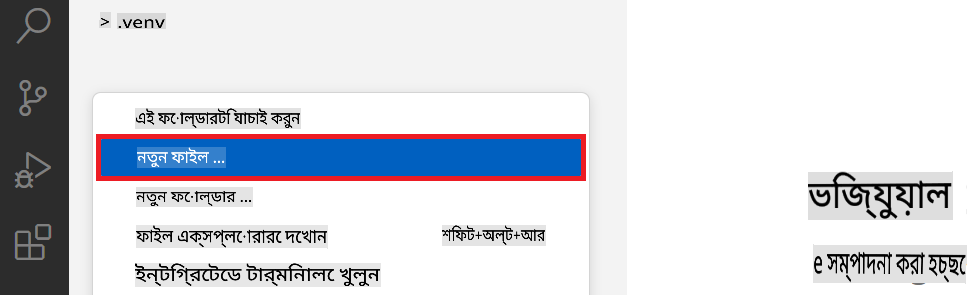

### ফাইন-টিউনিংয়ের জন্য ডেটাসেট প্রস্তুত করুন

এই অনুশীলনে, আপনি *download_dataset.py* ফাইল চালিয়ে *ultrachat_200k* ডেটাসেটগুলো আপনার লোকাল পরিবেশে ডাউনলোড করবেন। পরে, এই ডেটাসেটগুলো Phi-3 মডেল ফাইন-টিউন করার জন্য ব্যবহার করবেন।  

এই অনুশীলনে, আপনি:  

- ডেটাস
1. [Azure ML Studio](https://ml.azure.com/home?wt.mc_id=studentamb_279723) ভিজিট করুন।

1. বাম পাশের ট্যাব থেকে **Compute** নির্বাচন করুন।

1. নেভিগেশন মেনু থেকে **Compute clusters** নির্বাচন করুন।

1. **+ New** নির্বাচন করুন।

    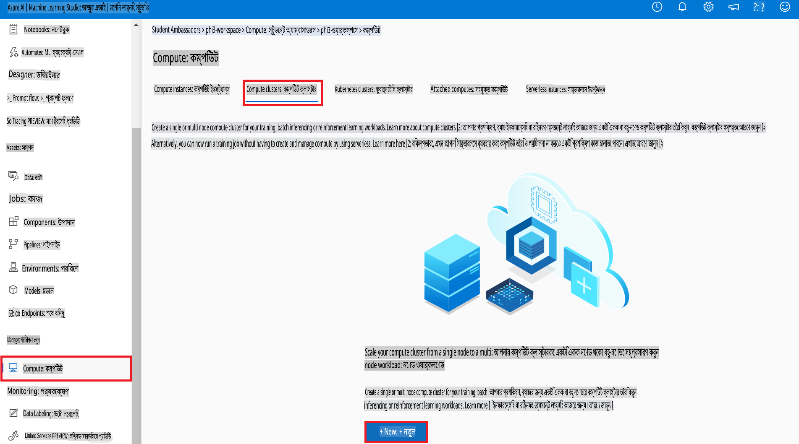

1. নিচের কাজগুলো সম্পন্ন করুন:

    - আপনি যে **Region** ব্যবহার করতে চান তা নির্বাচন করুন।
    - **Virtual machine tier** **Dedicated** এ নির্বাচন করুন।
    - **Virtual machine type** **GPU** এ নির্বাচন করুন।
    - **Virtual machine size** ফিল্টার **Select from all options** এ সেট করুন।
    - **Virtual machine size** **Standard_NC24ads_A100_v4** এ নির্বাচন করুন।

    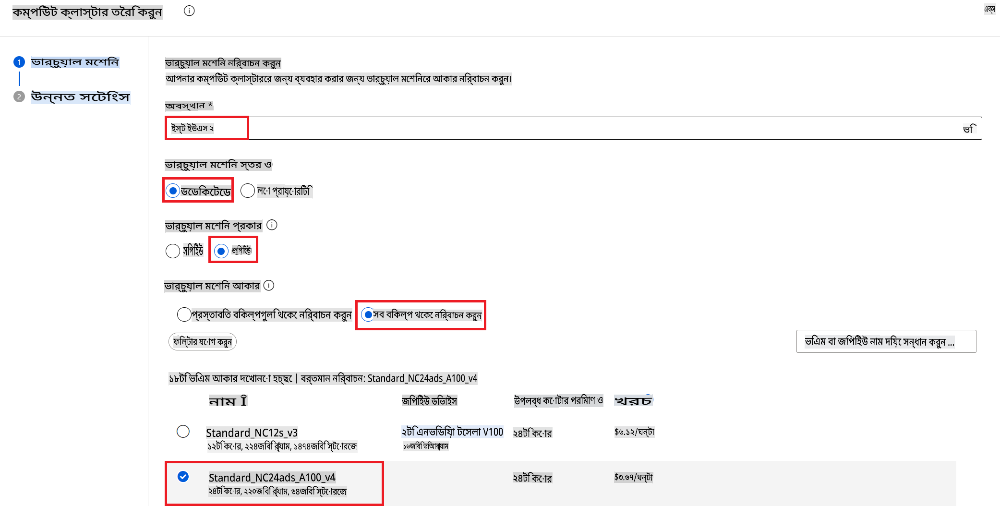

1. **Next** নির্বাচন করুন।

1. নিচের কাজগুলো সম্পন্ন করুন:

    - **Compute name** লিখুন। এটি একটি ইউনিক মান হতে হবে।
    - **Minimum number of nodes** **0** এ সেট করুন।
    - **Maximum number of nodes** **1** এ সেট করুন।
    - **Idle seconds before scale down** **120** এ সেট করুন।

    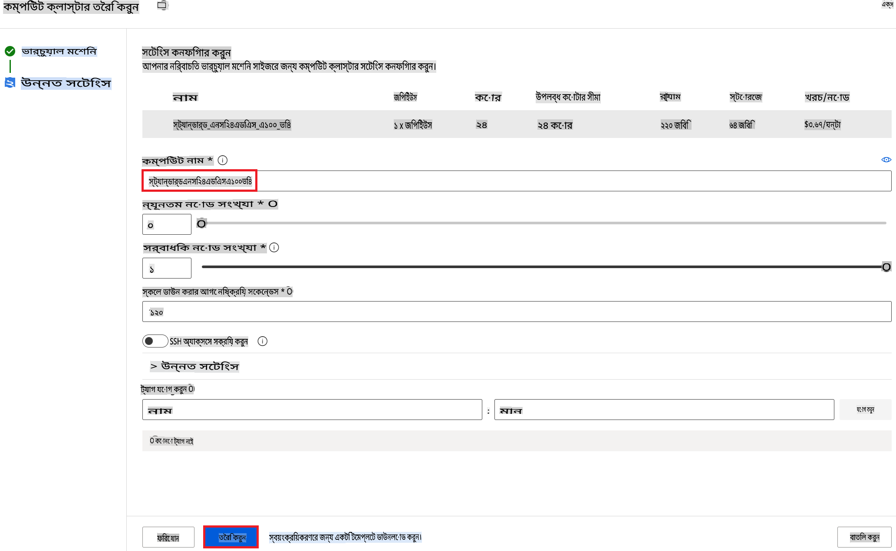

1. **Create** নির্বাচন করুন।

#### Phi-3 মডেল ফাইন-টিউন করুন

1. [Azure ML Studio](https://ml.azure.com/home?wt.mc_id=studentamb_279723) ভিজিট করুন।

1. আপনি তৈরি করা Azure Machine Learning workspace নির্বাচন করুন।

    

1. নিচের কাজগুলো সম্পন্ন করুন:

    - বাম পাশের ট্যাব থেকে **Model catalog** নির্বাচন করুন।
    - **search bar**-এ *phi-3-mini-4k* টাইপ করুন এবং প্রদর্শিত অপশন থেকে **Phi-3-mini-4k-instruct** নির্বাচন করুন।

    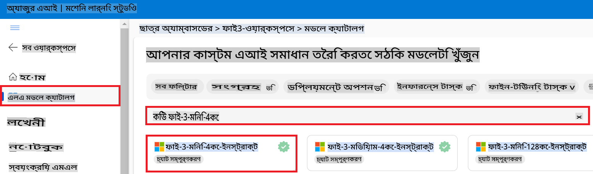

1. নেভিগেশন মেনু থেকে **Fine-tune** নির্বাচন করুন।

    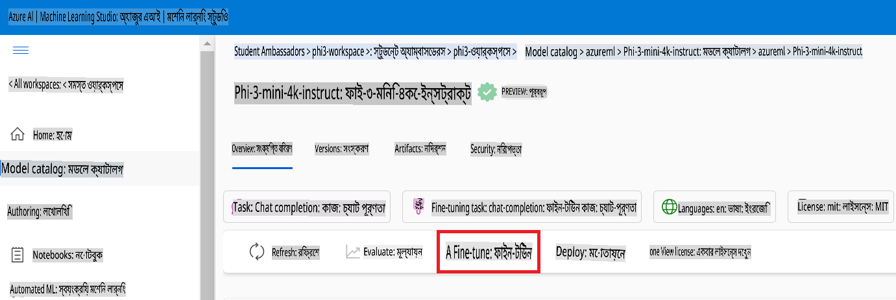

1. নিচের কাজগুলো সম্পন্ন করুন:

    - **Select task type** **Chat completion** এ নির্বাচন করুন।
    - **+ Select data** নির্বাচন করে **Training data** আপলোড করুন।
    - Validation data আপলোডের ধরন **Provide different validation data** এ সেট করুন।
    - **+ Select data** নির্বাচন করে **Validation data** আপলোড করুন।

    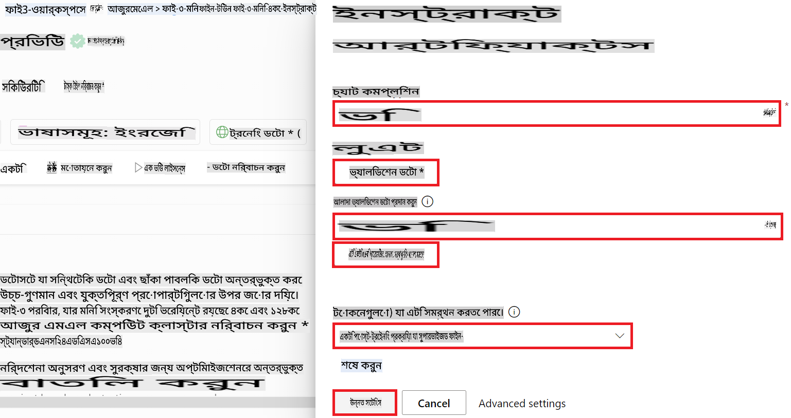

    > [!TIP]
    >
    > আপনি **Advanced settings** নির্বাচন করে **learning_rate** এবং **lr_scheduler_type** এর মতো কনফিগারেশন কাস্টমাইজ করতে পারেন, যা ফাইন-টিউনিং প্রক্রিয়াকে আপনার নির্দিষ্ট চাহিদার সাথে মানানসই করবে।

1. **Finish** নির্বাচন করুন।

1. এই অনুশীলনে, আপনি Azure Machine Learning ব্যবহার করে সফলভাবে Phi-3 মডেলটি ফাইন-টিউন করেছেন। দয়া করে মনে রাখবেন যে ফাইন-টিউনিং প্রক্রিয়া সম্পন্ন হতে যথেষ্ট সময় লাগতে পারে। ফাইন-টিউনিং কাজ সম্পন্ন হওয়ার জন্য আপনাকে অপেক্ষা করতে হবে। আপনি Azure Machine Learning Workspace-এর বাম পাশের **Jobs** ট্যাবে গিয়ে ফাইন-টিউনিং কাজের স্থিতি পর্যবেক্ষণ করতে পারেন। পরবর্তী সিরিজে, আপনি ফাইন-টিউন করা মডেলটি ডেপ্লয় করবেন এবং এটি Prompt flow-এর সাথে সংযুক্ত করবেন।

    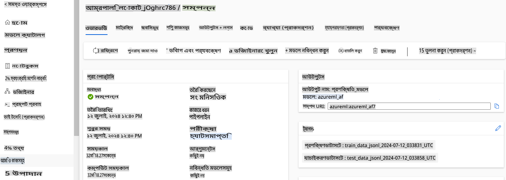

### ফাইন-টিউন করা Phi-3 মডেল ডেপ্লয় করুন

Prompt flow-এর সাথে ফাইন-টিউন করা Phi-3 মডেল ইন্টিগ্রেট করতে, আপনাকে মডেলটি ডেপ্লয় করতে হবে যাতে এটি রিয়েল-টাইম ইনফারেন্সের জন্য অ্যাক্সেসযোগ্য হয়। এই প্রক্রিয়ার মধ্যে মডেল রেজিস্ট্রেশন, একটি অনলাইন এন্ডপয়েন্ট তৈরি এবং মডেল ডেপ্লয়মেন্ট অন্তর্ভুক্ত।

এই অনুশীলনে, আপনি:

- Azure Machine Learning workspace-এ ফাইন-টিউন করা মডেল রেজিস্টার করবেন।
- একটি অনলাইন এন্ডপয়েন্ট তৈরি করবেন।
- রেজিস্টার করা ফাইন-টিউন করা Phi-3 মডেল ডেপ্লয় করবেন।

#### ফাইন-টিউন করা মডেল রেজিস্টার করুন

1. [Azure ML Studio](https://ml.azure.com/home?wt.mc_id=studentamb_279723) ভিজিট করুন।

1. আপনি তৈরি করা Azure Machine Learning workspace নির্বাচন করুন।

    

1. বাম পাশের ট্যাব থেকে **Models** নির্বাচন করুন।
1. **+ Register** নির্বাচন করুন।
1. **From a job output** নির্বাচন করুন।

    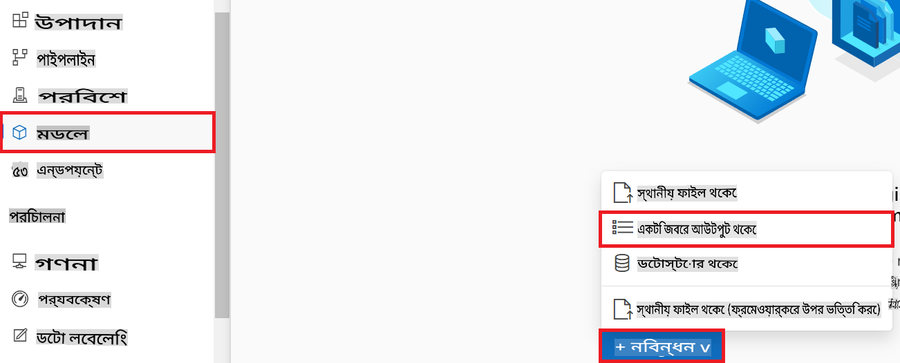

1. আপনি তৈরি করা কাজটি নির্বাচন করুন।

    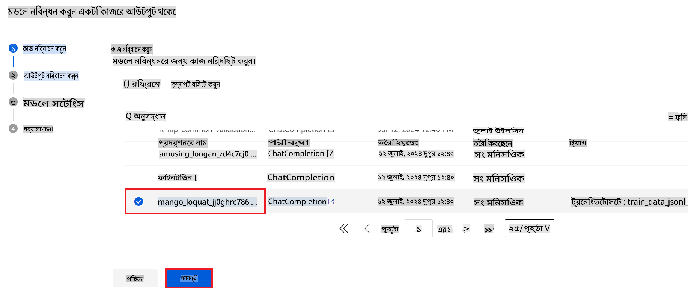

1. **Next** নির্বাচন করুন।

1. **Model type** **MLflow** এ নির্বাচন করুন।

1. নিশ্চিত করুন যে **Job output** নির্বাচিত রয়েছে; এটি স্বয়ংক্রিয়ভাবে নির্বাচিত হওয়া উচিত।

    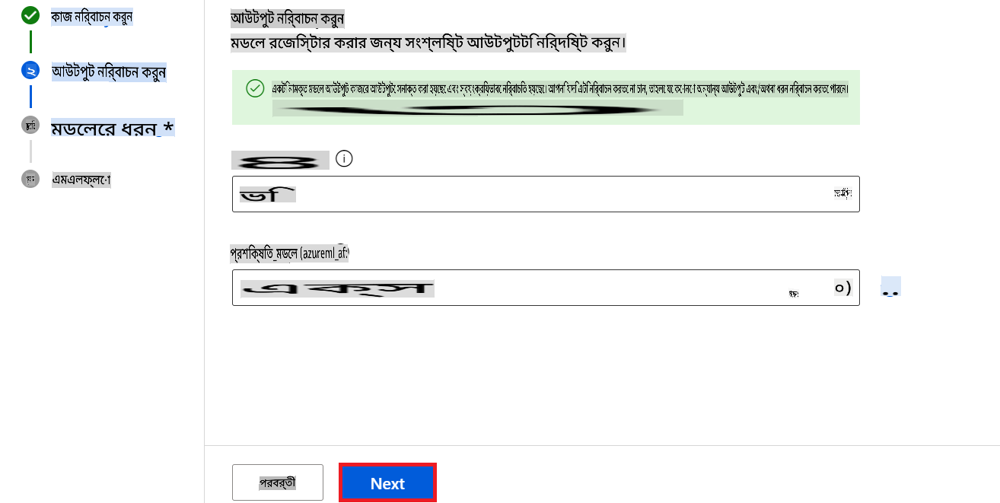

2. **Next** নির্বাচন করুন।

3. **Register** নির্বাচন করুন।

    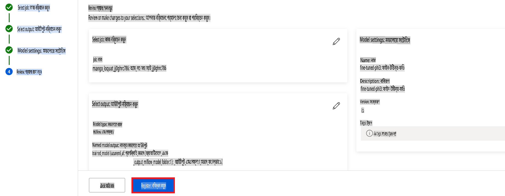

4. বাম পাশের ট্যাব থেকে **Models** মেনুতে গিয়ে আপনি আপনার রেজিস্টার করা মডেল দেখতে পারবেন।

    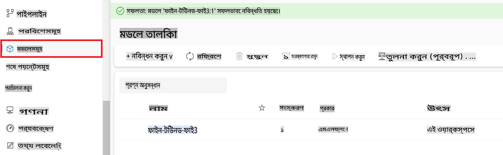

#### ফাইন-টিউন করা মডেল ডেপ্লয় করুন

1. আপনি তৈরি করা Azure Machine Learning workspace-এ যান।

1. বাম পাশের ট্যাব থেকে **Endpoints** নির্বাচন করুন।

1. নেভিগেশন মেনু থেকে **Real-time endpoints** নির্বাচন করুন।

    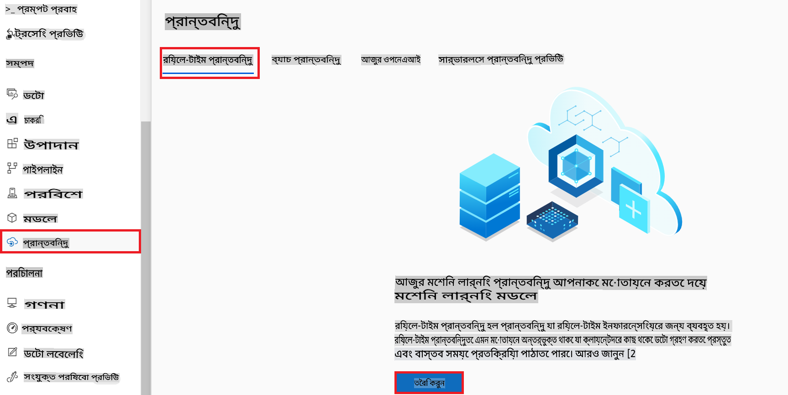

1. **Create** নির্বাচন করুন।

1. আপনি রেজিস্টার করা মডেলটি নির্বাচন করুন।

    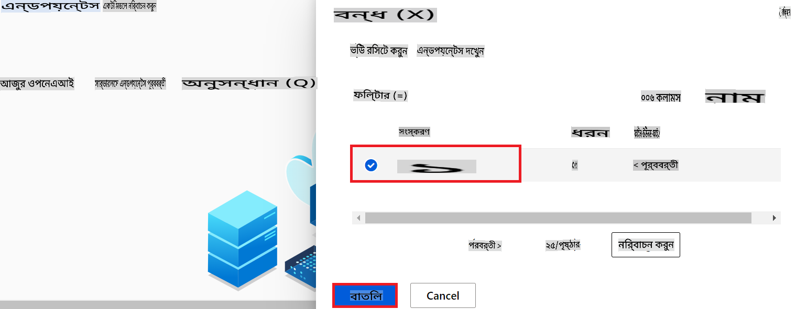

1. **Select** নির্বাচন করুন।

1. নিচের কাজগুলো সম্পন্ন করুন:

    - **Virtual machine** *Standard_NC6s_v3* এ নির্বাচন করুন।
    - আপনি যে **Instance count** ব্যবহার করতে চান তা নির্বাচন করুন। উদাহরণস্বরূপ, *1*।
    - **Endpoint** **New** এ নির্বাচন করুন একটি নতুন এন্ডপয়েন্ট তৈরি করতে।
    - **Endpoint name** লিখুন। এটি একটি ইউনিক মান হতে হবে।
    - **Deployment name** লিখুন। এটি একটি ইউনিক মান হতে হবে।

    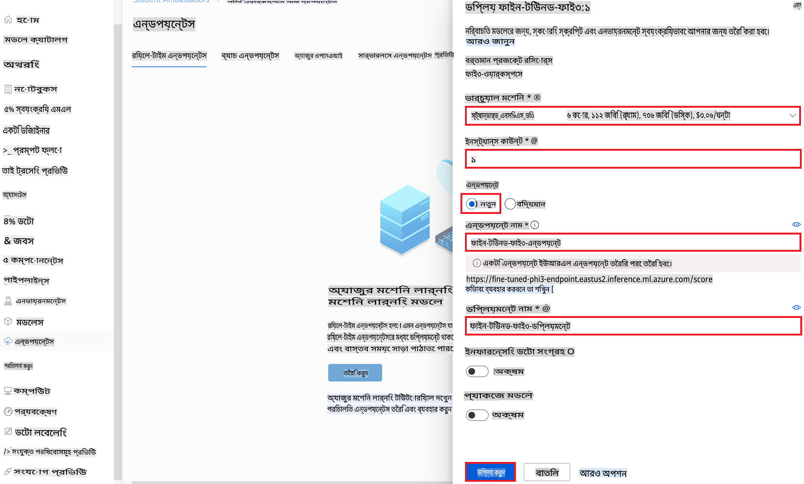

1. **Deploy** নির্বাচন করুন।

> [!WARNING]
> আপনার অ্যাকাউন্টে অতিরিক্ত চার্জ এড়ানোর জন্য, নিশ্চিত করুন যে Azure Machine Learning workspace-এ তৈরি করা এন্ডপয়েন্টটি মুছে ফেলা হয়েছে।
>

#### Azure Machine Learning Workspace-এ ডেপ্লয়মেন্ট স্থিতি পরীক্ষা করুন

1. আপনি তৈরি করা Azure Machine Learning workspace-এ যান।

1. বাম পাশের ট্যাব থেকে **Endpoints** নির্বাচন করুন।

1. আপনি তৈরি করা এন্ডপয়েন্টটি নির্বাচন করুন।

    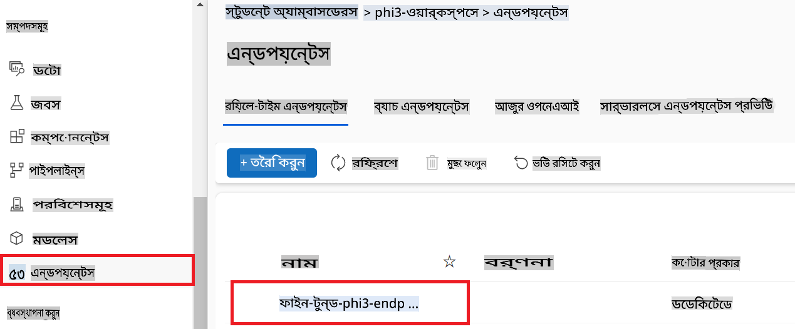

1. এই পৃষ্ঠায়, আপনি ডেপ্লয়মেন্ট প্রক্রিয়া চলাকালীন এন্ডপয়েন্টগুলি পরিচালনা করতে পারবেন।

> [!NOTE]
> একবার ডেপ্লয়মেন্ট সম্পন্ন হলে নিশ্চিত করুন যে **Live traffic** **100%** এ সেট করা হয়েছে। যদি না হয়, **Update traffic** নির্বাচন করে ট্রাফিক সেটিংস সামঞ্জস্য করুন। মনে রাখবেন, যদি ট্রাফিক **0%** এ সেট করা থাকে তবে আপনি মডেল পরীক্ষা করতে পারবেন না।
>
> 
>
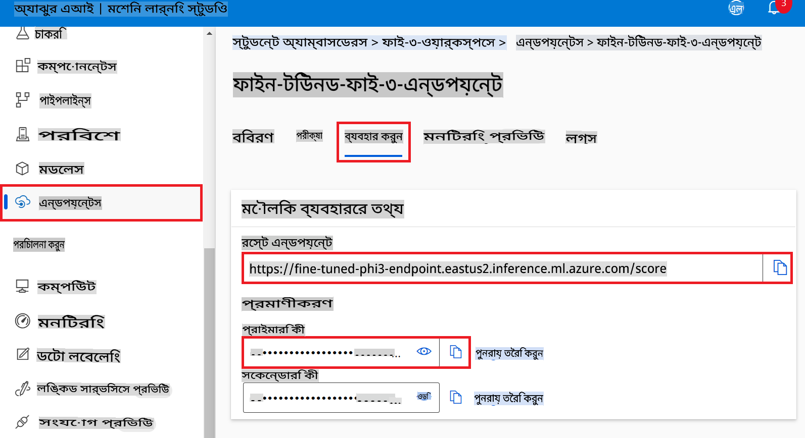

#### কাস্টম কানেকশন যোগ করুন

1. [Azure AI Foundry](https://ai.azure.com/?WT.mc_id=aiml-137032-kinfeylo) এ যান।

1. আপনি যে Azure AI Foundry প্রকল্পটি তৈরি করেছেন, সেটিতে নেভিগেট করুন।

1. আপনার তৈরি প্রকল্পে, বাম পাশের ট্যাব থেকে **Settings** নির্বাচন করুন।

1. **+ New connection** নির্বাচন করুন।

    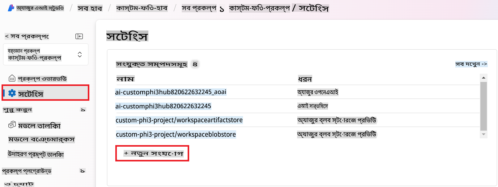

1. নেভিগেশন মেনু থেকে **Custom keys** নির্বাচন করুন।

    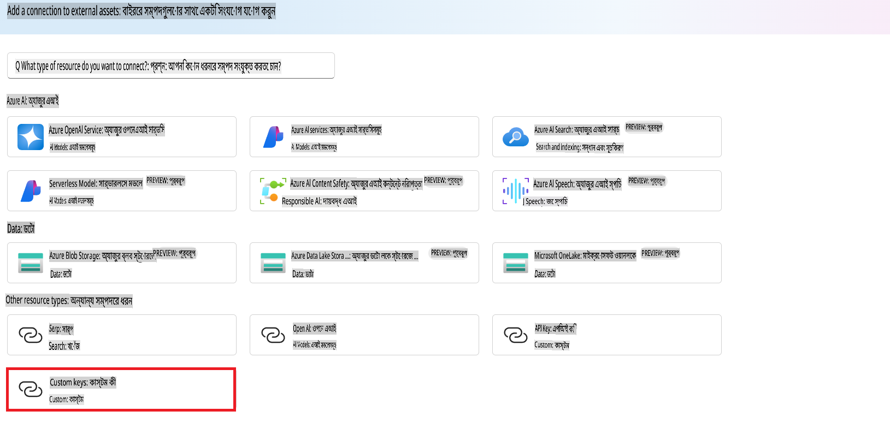

1. নিম্নলিখিত কাজগুলো সম্পন্ন করুন:

    - **+ Add key value pairs** নির্বাচন করুন।
    - কী নামের জন্য **endpoint** লিখুন এবং Azure ML Studio থেকে কপি করা এন্ডপয়েন্টটি মান ফিল্ডে পেস্ট করুন।
    - আবার **+ Add key value pairs** নির্বাচন করুন।
    - কী নামের জন্য **key** লিখুন এবং Azure ML Studio থেকে কপি করা কীটি মান ফিল্ডে পেস্ট করুন।
    - কী যোগ করার পর, **is secret** নির্বাচন করুন যাতে কীটি প্রকাশ না হয়।

    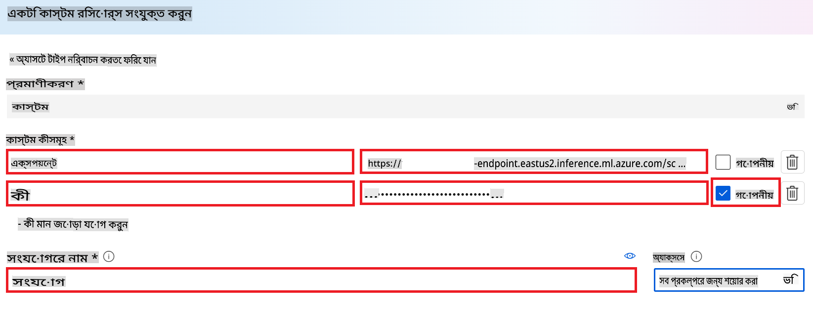

1. **Add connection** নির্বাচন করুন।

#### প্রম্পট ফ্লো তৈরি করুন

আপনি Azure AI Foundry-তে একটি কাস্টম কানেকশন যোগ করেছেন। এবার, নিচের ধাপগুলো অনুসরণ করে একটি প্রম্পট ফ্লো তৈরি করুন। এরপর, এই প্রম্পট ফ্লোকে কাস্টম কানেকশনের সাথে সংযুক্ত করুন যাতে আপনি প্রম্পট ফ্লো-এর মধ্যে ফাইন-টিউনড মডেলটি ব্যবহার করতে পারেন।

1. আপনি যে Azure AI Foundry প্রকল্পটি তৈরি করেছেন, সেটিতে নেভিগেট করুন।

1. বাম পাশের ট্যাব থেকে **Prompt flow** নির্বাচন করুন।

1. নেভিগেশন মেনু থেকে **+ Create** নির্বাচন করুন।

    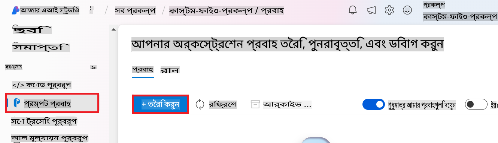

1. নেভিগেশন মেনু থেকে **Chat flow** নির্বাচন করুন।

    

1. **Folder name** লিখুন।

    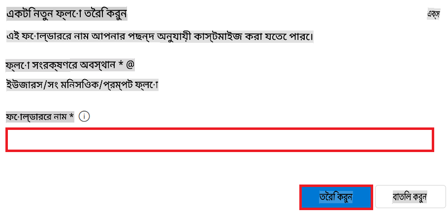

2. **Create** নির্বাচন করুন।

#### আপনার কাস্টম Phi-3 মডেলের সাথে চ্যাট করার জন্য প্রম্পট ফ্লো সেটআপ করুন

আপনাকে ফাইন-টিউনড Phi-3 মডেলটিকে একটি প্রম্পট ফ্লো-তে ইন্টিগ্রেট করতে হবে। তবে, বিদ্যমান প্রম্পট ফ্লো এই কাজের জন্য ডিজাইন করা হয়নি। তাই আপনাকে প্রম্পট ফ্লোটি পুনরায় ডিজাইন করতে হবে যাতে কাস্টম মডেলটি ইন্টিগ্রেট করা যায়।

1. প্রম্পট ফ্লোতে, নিচের কাজগুলো করুন বিদ্যমান ফ্লোটি পুনর্গঠনের জন্য:

    - **Raw file mode** নির্বাচন করুন।
    - *flow.dag.yml* ফাইলের সমস্ত বিদ্যমান কোড মুছে ফেলুন।
    - নিচের কোডটি *flow.dag.yml* ফাইলে যোগ করুন।

        ```yml
        inputs:
          input_data:
            type: string
            default: "Who founded Microsoft?"

        outputs:
          answer:
            type: string
            reference: ${integrate_with_promptflow.output}

        nodes:
        - name: integrate_with_promptflow
          type: python
          source:
            type: code
            path: integrate_with_promptflow.py
          inputs:
            input_data: ${inputs.input_data}
        ```

    - **Save** নির্বাচন করুন।

    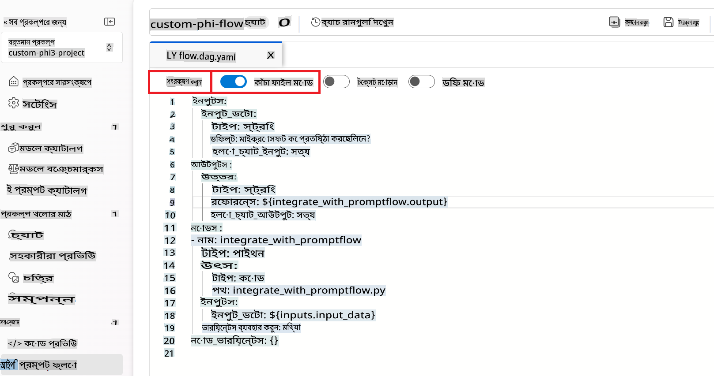

1. কাস্টম Phi-3 মডেলটি প্রম্পট ফ্লোতে ব্যবহার করার জন্য *integrate_with_promptflow.py* ফাইলে নিচের কোডটি যোগ করুন।

    ```python
    import logging
    import requests
    from promptflow import tool
    from promptflow.connections import CustomConnection

    # Logging setup
    logging.basicConfig(
        format="%(asctime)s - %(levelname)s - %(name)s - %(message)s",
        datefmt="%Y-%m-%d %H:%M:%S",
        level=logging.DEBUG
    )
    logger = logging.getLogger(__name__)

    def query_phi3_model(input_data: str, connection: CustomConnection) -> str:
        """
        Send a request to the Phi-3 model endpoint with the given input data using Custom Connection.
        """

        # "connection" is the name of the Custom Connection, "endpoint", "key" are the keys in the Custom Connection
        endpoint_url = connection.endpoint
        api_key = connection.key

        headers = {
            "Content-Type": "application/json",
            "Authorization": f"Bearer {api_key}"
        }
        data = {
            "input_data": {
                "input_string": [
                    {"role": "user", "content": input_data}
                ],
                "parameters": {
                    "temperature": 0.7,
                    "max_new_tokens": 128
                }
            }
        }
        try:
            response = requests.post(endpoint_url, json=data, headers=headers)
            response.raise_for_status()
            
            # Log the full JSON response
            logger.debug(f"Full JSON response: {response.json()}")

            result = response.json()["output"]
            logger.info("Successfully received response from Azure ML Endpoint.")
            return result
        except requests.exceptions.RequestException as e:
            logger.error(f"Error querying Azure ML Endpoint: {e}")
            raise

    @tool
    def my_python_tool(input_data: str, connection: CustomConnection) -> str:
        """
        Tool function to process input data and query the Phi-3 model.
        """
        return query_phi3_model(input_data, connection)

    ```

    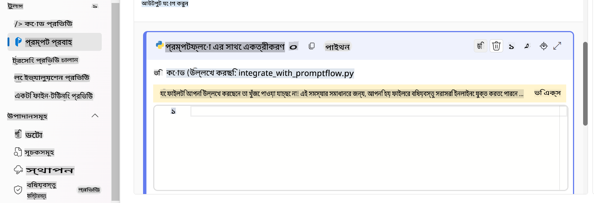

> [!NOTE]
> Azure AI Foundry-তে প্রম্পট ফ্লো ব্যবহারের বিষয়ে আরও বিস্তারিত তথ্যের জন্য [Prompt flow in Azure AI Foundry](https://learn.microsoft.com/azure/ai-studio/how-to/prompt-flow) দেখুন।

1. **Chat input**, **Chat output** নির্বাচন করুন আপনার মডেলের সাথে চ্যাট সক্রিয় করতে।

    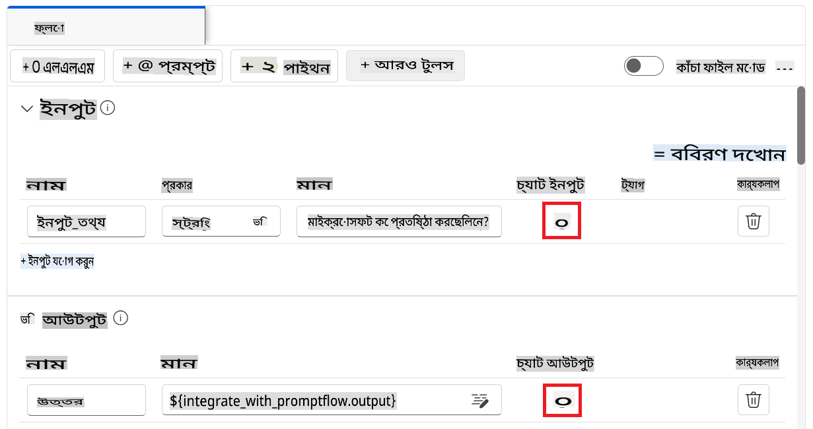

1. এখন আপনি আপনার কাস্টম Phi-3 মডেলের সাথে চ্যাট করতে প্রস্তুত। পরবর্তী অনুশীলনে, আপনি শিখবেন কীভাবে প্রম্পট ফ্লো শুরু করবেন এবং এটি ব্যবহার করে ফাইন-টিউনড Phi-3 মডেলের সাথে চ্যাট করবেন।

> [!NOTE]
>
> পুনর্গঠিত ফ্লোটি নিচের ছবির মতো হওয়া উচিত:
>
> 
>

### আপনার কাস্টম Phi-3 মডেলের সাথে চ্যাট করুন

এখন যেহেতু আপনি আপনার কাস্টম Phi-3 মডেলটিকে ফাইন-টিউন এবং প্রম্পট ফ্লো-এর সাথে ইন্টিগ্রেট করেছেন, আপনি এটি ব্যবহার শুরু করতে প্রস্তুত। এই অনুশীলনটি আপনাকে আপনার মডেলের সাথে চ্যাট সেটআপ এবং শুরু করার প্রক্রিয়া দেখাবে। ধাপগুলো অনুসরণ করে, আপনি আপনার ফাইন-টিউনড Phi-3 মডেলের ক্ষমতাগুলো বিভিন্ন কাজ এবং কথোপকথনের জন্য সম্পূর্ণরূপে ব্যবহার করতে পারবেন।

- প্রম্পট ফ্লো ব্যবহার করে আপনার কাস্টম Phi-3 মডেলের সাথে চ্যাট করুন।

#### প্রম্পট ফ্লো শুরু করুন

1. প্রম্পট ফ্লো শুরু করতে **Start compute sessions** নির্বাচন করুন।

    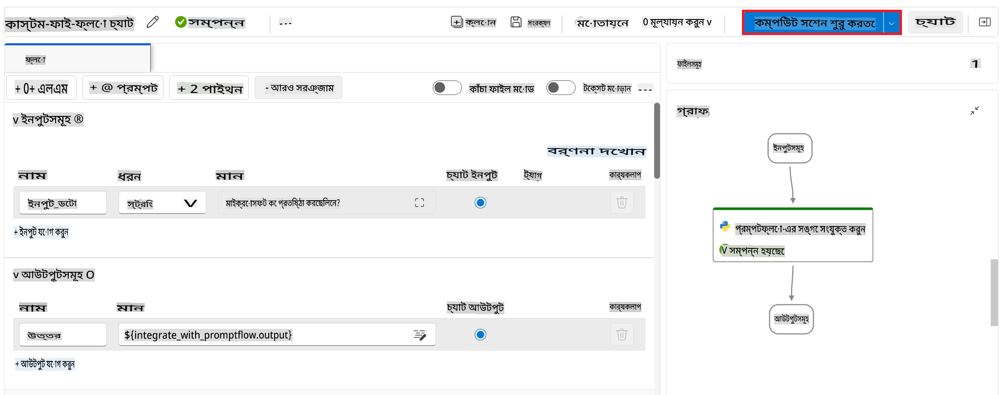

1. প্যারামিটার রিনিউ করতে **Validate and parse input** নির্বাচন করুন।

    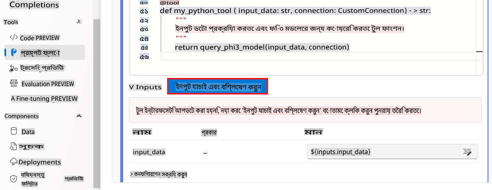

1. **connection**-এর **Value**-টি সেই কাস্টম কানেকশনের সাথে নির্বাচন করুন যা আপনি তৈরি করেছেন। উদাহরণস্বরূপ, *connection*।

    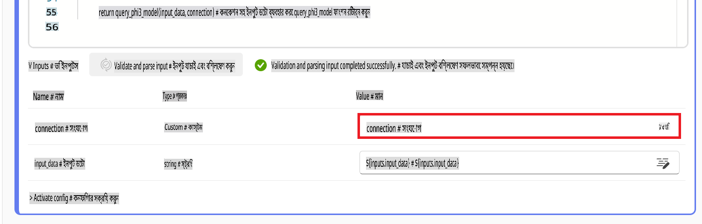

#### আপনার কাস্টম মডেলের সাথে চ্যাট করুন

1. **Chat** নির্বাচন করুন।

    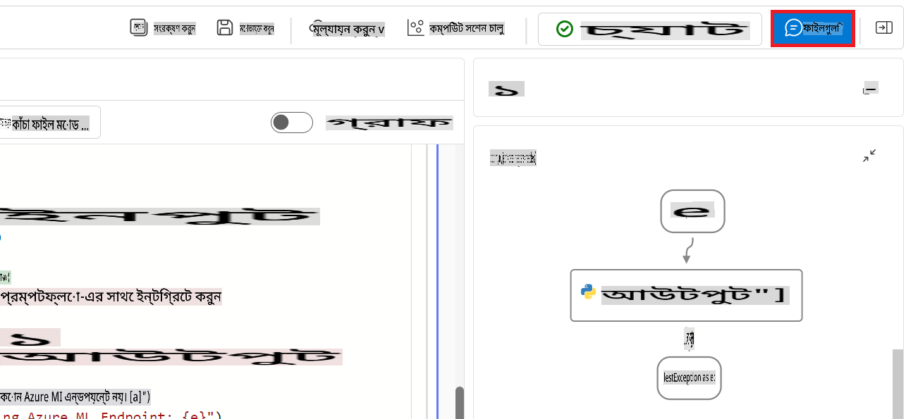

1. এখানে একটি উদাহরণ ফলাফল: এখন আপনি আপনার কাস্টম Phi-3 মডেলের সাথে চ্যাট করতে পারবেন। ফাইন-টিউনিংয়ের জন্য ব্যবহৃত ডেটার উপর ভিত্তি করে প্রশ্ন জিজ্ঞাসা করার পরামর্শ দেওয়া হয়।

    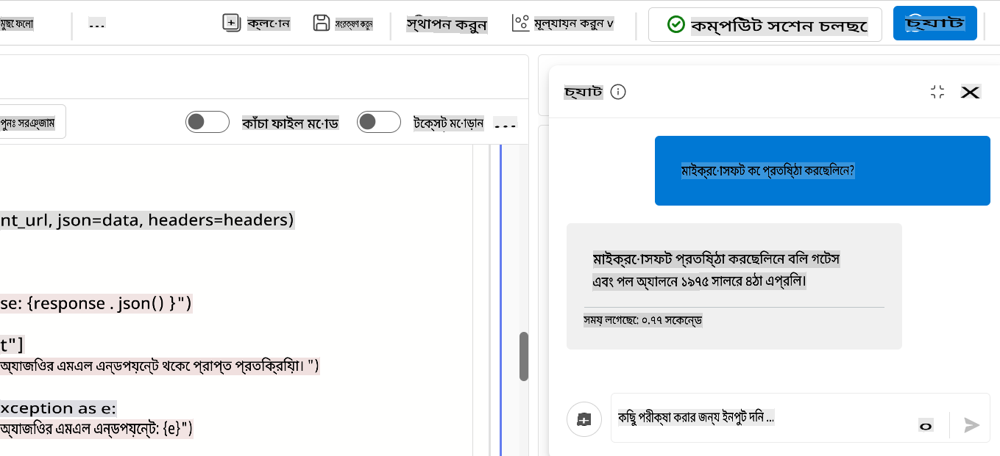

**অস্বীকৃতি**:  
এই নথি মেশিন-ভিত্তিক এআই অনুবাদ সেবা ব্যবহার করে অনুবাদ করা হয়েছে। আমরা যথাসাধ্য সঠিক অনুবাদের চেষ্টা করি, তবে দয়া করে মনে রাখবেন যে স্বয়ংক্রিয় অনুবাদে ভুল বা অসংগতি থাকতে পারে। নথির মূল ভাষায় থাকা সংস্করণটিকে প্রামাণিক উৎস হিসেবে বিবেচনা করা উচিত। গুরুত্বপূর্ণ তথ্যের জন্য, পেশাদার মানব অনুবাদ ব্যবহার করার পরামর্শ দেওয়া হয়। এই অনুবাদ ব্যবহার থেকে উদ্ভূত কোনো ভুল বোঝাবুঝি বা ভুল ব্যাখ্যার জন্য আমরা দায়ী নই।