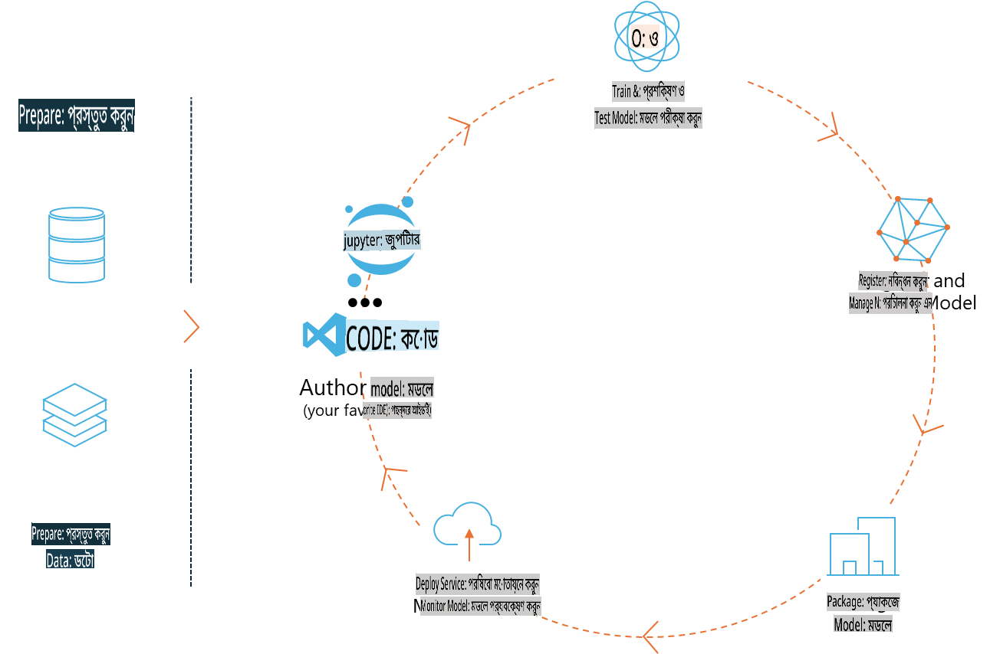
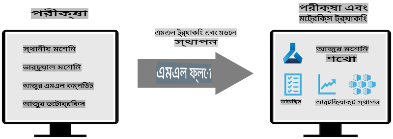
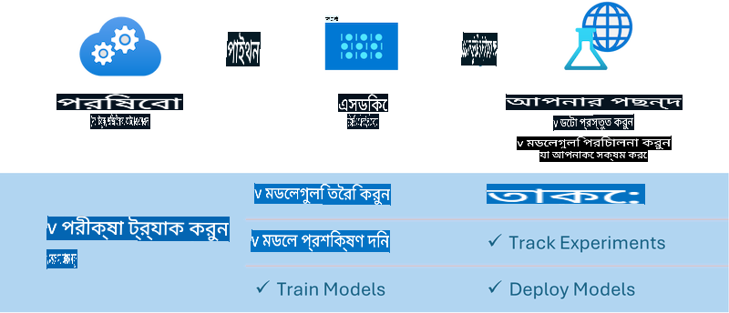

# এমএলফ্লো

[এমএলফ্লো](https://mlflow.org/) হলো একটি ওপেন-সোর্স প্ল্যাটফর্ম, যা মেশিন লার্নিং লাইফসাইকেল ব্যবস্থাপনা করার জন্য ডিজাইন করা হয়েছে।



এমএলফ্লো মেশিন লার্নিং লাইফসাইকেল ব্যবস্থাপনা করতে ব্যবহৃত হয়, যার মধ্যে রয়েছে পরীক্ষানিরীক্ষা, পুনরুৎপাদনযোগ্যতা, ডেপ্লয়মেন্ট এবং একটি কেন্দ্রীয় মডেল রেজিস্ট্রি। বর্তমানে এমএলফ্লো চারটি উপাদান প্রদান করে:

- **এমএলফ্লো ট্র্যাকিং:** পরীক্ষাগুলি, কোড, ডেটা কনফিগারেশন এবং ফলাফল রেকর্ড এবং অনুসন্ধান করুন।
- **এমএলফ্লো প্রজেক্টস:** ডেটা সায়েন্স কোডকে এমন একটি ফরম্যাটে প্যাকেজ করুন, যা যেকোনো প্ল্যাটফর্মে রান পুনরুৎপাদন করতে সক্ষম।
- **এমএলফ্লো মডেলস:** বিভিন্ন পরিবেশে মেশিন লার্নিং মডেল ডেপ্লয় করুন।
- **মডেল রেজিস্ট্রি:** একটি কেন্দ্রীয় রিপোজিটরিতে মডেল সংরক্ষণ, টীকা এবং ব্যবস্থাপনা করুন।

এটি পরীক্ষাগুলি ট্র্যাক করার, কোডকে পুনরুৎপাদনযোগ্য রান-এ প্যাকেজ করার, এবং মডেল শেয়ার ও ডেপ্লয় করার ক্ষমতা অন্তর্ভুক্ত করে। এমএলফ্লো ডাটাব্রিকসের সাথে ইন্টিগ্রেটেড এবং বিভিন্ন এমএল লাইব্রেরি সমর্থন করে, এটি লাইব্রেরি-অজ্ঞাত (library-agnostic)। এটি যেকোনো মেশিন লার্নিং লাইব্রেরি এবং যেকোনো প্রোগ্রামিং ভাষার সাথে ব্যবহার করা যেতে পারে, কারণ এটি ব্যবহারকারীর সুবিধার জন্য একটি REST API এবং CLI প্রদান করে।



এমএলফ্লোর মূল বৈশিষ্ট্যগুলো হলো:

- **পরীক্ষা ট্র্যাকিং:** প্যারামিটার এবং ফলাফল রেকর্ড ও তুলনা করুন।
- **মডেল ব্যবস্থাপনা:** বিভিন্ন পরিবেশে মডেল ডেপ্লয় করুন।
- **মডেল রেজিস্ট্রি:** এমএলফ্লো মডেলের লাইফসাইকেল যৌথভাবে পরিচালনা করুন, যার মধ্যে রয়েছে ভার্সনিং এবং টীকা।
- **প্রজেক্টস:** এমএল কোড শেয়ার বা প্রোডাকশন ব্যবহারের জন্য প্যাকেজ করুন।  
এমএলফ্লো এমএলঅপস লুপকেও সমর্থন করে, যার মধ্যে রয়েছে ডেটা প্রস্তুত করা, মডেল রেজিস্টার ও ব্যবস্থাপনা, মডেল প্যাকেজ করা, পরিষেবা ডেপ্লয় করা এবং মডেল মনিটর করা। এটি প্রোটোটাইপ থেকে প্রোডাকশন ওয়ার্কফ্লোতে যাওয়ার প্রক্রিয়াকে সহজতর করার লক্ষ্য রাখে, বিশেষ করে ক্লাউড এবং এজ পরিবেশে।

## এন্ড-টু-এন্ড দৃশ্যপট - একটি র‍্যাপার তৈরি করা এবং এমএলফ্লো মডেল হিসেবে ফাই-৩ ব্যবহার করা

এই এন্ড-টু-এন্ড নমুনায়, আমরা ফাই-৩ ছোট ভাষা মডেলের (SLM) চারপাশে একটি র‍্যাপার তৈরি করার দুটি ভিন্ন পদ্ধতি প্রদর্শন করব এবং এটি স্থানীয়ভাবে বা ক্লাউডে, যেমন অ্যাজুর মেশিন লার্নিং ওয়ার্কস্পেসে, এমএলফ্লো মডেল হিসেবে চালাব।



| প্রজেক্ট | বর্ণনা | অবস্থান |
| ------------ | ----------- | -------- |
| ট্রান্সফর্মার পাইপলাইন | যদি আপনি এমএলফ্লোর পরীক্ষামূলক ট্রান্সফর্মার ফ্লেভার ব্যবহার করে হাগিংফেস মডেল ব্যবহার করতে চান, তবে ট্রান্সফর্মার পাইপলাইন একটি র‍্যাপার তৈরি করার সহজতম বিকল্প। | [**TransformerPipeline.ipynb**](../../../../../../code/06.E2E/E2E_Phi-3-MLflow_TransformerPipeline.ipynb) |
| কাস্টম পাইথন র‍্যাপার | লেখার সময়, ট্রান্সফর্মার পাইপলাইন এমএলফ্লো র‍্যাপার তৈরি করার জন্য হাগিংফেস মডেলগুলোর জন্য ONNX ফরম্যাট সমর্থন করেনি, এমনকি পরীক্ষামূলক অপ্টিমাম পাইথন প্যাকেজ দিয়েও। এই ধরনের ক্ষেত্রে, আপনি এমএলফ্লো মডের জন্য কাস্টম পাইথন র‍্যাপার তৈরি করতে পারেন। | [**CustomPythonWrapper.ipynb**](../../../../../../code/06.E2E/E2E_Phi-3-MLflow_CustomPythonWrapper.ipynb) |

## প্রজেক্ট: ট্রান্সফর্মার পাইপলাইন

1. এমএলফ্লো এবং হাগিংফেস থেকে প্রাসঙ্গিক পাইথন প্যাকেজগুলো প্রয়োজন হবে:

    ``` Python
    import mlflow
    import transformers
    ```

2. এরপর, আপনাকে হাগিংফেস রেজিস্ট্রিতে টার্গেট ফাই-৩ মডেল উল্লেখ করে একটি ট্রান্সফর্মার পাইপলাইন শুরু করতে হবে। _Phi-3-mini-4k-instruct_ মডেলের কার্ড থেকে দেখা যায়, এর কাজ হলো "টেক্সট জেনারেশন" টাইপের:

    ``` Python
    pipeline = transformers.pipeline(
        task = "text-generation",
        model = "microsoft/Phi-3-mini-4k-instruct"
    )
    ```

3. এখন আপনি আপনার ফাই-৩ মডেলের ট্রান্সফর্মার পাইপলাইনকে এমএলফ্লো ফরম্যাটে সংরক্ষণ করতে পারেন এবং অতিরিক্ত তথ্য যেমন টার্গেট আর্টিফ্যাক্ট পাথ, নির্দিষ্ট মডেল কনফিগারেশন সেটিংস এবং ইনফারেন্স API টাইপ সরবরাহ করতে পারেন:

    ``` Python
    model_info = mlflow.transformers.log_model(
        transformers_model = pipeline,
        artifact_path = "phi3-mlflow-model",
        model_config = model_config,
        task = "llm/v1/chat"
    )
    ```

## প্রজেক্ট: কাস্টম পাইথন র‍্যাপার

1. এখানে আমরা মাইক্রোসফটের [ONNX Runtime generate() API](https://github.com/microsoft/onnxruntime-genai) ব্যবহার করতে পারি ONNX মডেলের ইনফারেন্স এবং টোকেন এনকোডিং/ডিকোডিংয়ের জন্য। আপনার টার্গেট কম্পিউটের জন্য _onnxruntime_genai_ প্যাকেজ বেছে নিতে হবে, যেখানে নিচের উদাহরণটি CPU টার্গেট করে:

    ``` Python
    import mlflow
    from mlflow.models import infer_signature
    import onnxruntime_genai as og
    ```

1. আমাদের কাস্টম ক্লাস দুটি মেথড বাস্তবায়ন করে: _load_context()_ মেথডটি ফাই-৩ মিনি ৪কে ইনস্ট্রাক্টের **ONNX মডেল**, **জেনারেটর প্যারামিটার** এবং **টোকেনাইজার** ইনিশিয়ালাইজ করে; এবং _predict()_ মেথডটি প্রদত্ত প্রম্পটের জন্য আউটপুট টোকেন তৈরি করে:

    ``` Python
    class Phi3Model(mlflow.pyfunc.PythonModel):
        def load_context(self, context):
            # Retrieving model from the artifacts
            model_path = context.artifacts["phi3-mini-onnx"]
            model_options = {
                 "max_length": 300,
                 "temperature": 0.2,         
            }
        
            # Defining the model
            self.phi3_model = og.Model(model_path)
            self.params = og.GeneratorParams(self.phi3_model)
            self.params.set_search_options(**model_options)
            
            # Defining the tokenizer
            self.tokenizer = og.Tokenizer(self.phi3_model)
    
        def predict(self, context, model_input):
            # Retrieving prompt from the input
            prompt = model_input["prompt"][0]
            self.params.input_ids = self.tokenizer.encode(prompt)
    
            # Generating the model's response
            response = self.phi3_model.generate(self.params)
    
            return self.tokenizer.decode(response[0][len(self.params.input_ids):])
    ```

1. এখন আপনি _mlflow.pyfunc.log_model()_ ফাংশন ব্যবহার করে ফাই-৩ মডেলের জন্য একটি কাস্টম পাইথন র‍্যাপার (পিকল ফরম্যাটে), মূল ONNX মডেল এবং প্রয়োজনীয় ডিপেনডেন্সিসহ তৈরি করতে পারেন:

    ``` Python
    model_info = mlflow.pyfunc.log_model(
        artifact_path = artifact_path,
        python_model = Phi3Model(),
        artifacts = {
            "phi3-mini-onnx": "cpu_and_mobile/cpu-int4-rtn-block-32-acc-level-4",
        },
        input_example = input_example,
        signature = infer_signature(input_example, ["Run"]),
        extra_pip_requirements = ["torch", "onnxruntime_genai", "numpy"],
    )
    ```

## এমএলফ্লো মডেলগুলোর তৈরি সিগনেচার

1. উপরের ট্রান্সফর্মার পাইপলাইন প্রজেক্টের ধাপ ৩-এ, আমরা এমএলফ্লো মডেলের কাজকে “_llm/v1/chat_” এ সেট করেছি। এই নির্দেশনাটি একটি মডেলের API র‍্যাপার তৈরি করে, যা OpenAI-এর চ্যাট API-এর সাথে সামঞ্জস্যপূর্ণ, যেমন নিচে দেখানো হয়েছে:

    ``` Python
    {inputs: 
      ['messages': Array({content: string (required), name: string (optional), role: string (required)}) (required), 'temperature': double (optional), 'max_tokens': long (optional), 'stop': Array(string) (optional), 'n': long (optional), 'stream': boolean (optional)],
    outputs: 
      ['id': string (required), 'object': string (required), 'created': long (required), 'model': string (required), 'choices': Array({finish_reason: string (required), index: long (required), message: {content: string (required), name: string (optional), role: string (required)} (required)}) (required), 'usage': {completion_tokens: long (required), prompt_tokens: long (required), total_tokens: long (required)} (required)],
    params: 
      None}
    ```

1. এর ফলে, আপনি নিচের ফরম্যাটে আপনার প্রম্পট জমা দিতে পারেন:

    ``` Python
    messages = [{"role": "user", "content": "What is the capital of Spain?"}]
    ```

1. তারপর, OpenAI API-সামঞ্জস্যপূর্ণ পোস্ট-প্রসেসিং ব্যবহার করুন, যেমন _response[0][‘choices’][0][‘message’][‘content’]_ , আপনার আউটপুটকে সুন্দর করে এমন কিছুতে রূপান্তর করতে:

    ``` JSON
    Question: What is the capital of Spain?
    
    Answer: The capital of Spain is Madrid. It is the largest city in Spain and serves as the political, economic, and cultural center of the country. Madrid is located in the center of the Iberian Peninsula and is known for its rich history, art, and architecture, including the Royal Palace, the Prado Museum, and the Plaza Mayor.
    
    Usage: {'prompt_tokens': 11, 'completion_tokens': 73, 'total_tokens': 84}
    ```

1. উপরের কাস্টম পাইথন র‍্যাপার প্রজেক্টের ধাপ ৩-এ, আমরা একটি প্রদত্ত ইনপুট উদাহরণ থেকে মডেলের সিগনেচার তৈরি করার জন্য এমএলফ্লো প্যাকেজকে অনুমতি দিই। আমাদের এমএলফ্লো র‍্যাপারের সিগনেচারটি এরকম দেখাবে:

    ``` Python
    {inputs: 
      ['prompt': string (required)],
    outputs: 
      [string (required)],
    params: 
      None}
    ```

1. সুতরাং, আমাদের প্রম্পটে "prompt" ডিকশনারি কী থাকতে হবে, যেমন:

    ``` Python
    {"prompt": "<|system|>You are a stand-up comedian.<|end|><|user|>Tell me a joke about atom<|end|><|assistant|>",}
    ```

1. মডেলের আউটপুট তারপর স্ট্রিং ফরম্যাটে প্রদান করা হবে:

    ``` JSON
    Alright, here's a little atom-related joke for you!
    
    Why don't electrons ever play hide and seek with protons?
    
    Because good luck finding them when they're always "sharing" their electrons!
    
    Remember, this is all in good fun, and we're just having a little atomic-level humor!
    ```

**অস্বীকৃতি**:  
এই নথিটি মেশিন-ভিত্তিক এআই অনুবাদ পরিষেবার মাধ্যমে অনুবাদ করা হয়েছে। আমরা যথাসম্ভব সঠিক অনুবাদের চেষ্টা করি, তবে দয়া করে মনে রাখবেন যে স্বয়ংক্রিয় অনুবাদে ত্রুটি বা অসংগতি থাকতে পারে। মূল ভাষায় থাকা নথিটিকেই নির্ভরযোগ্য উৎস হিসেবে বিবেচনা করা উচিত। গুরুত্বপূর্ণ তথ্যের জন্য, পেশাদার মানব অনুবাদ সুপারিশ করা হয়। এই অনুবাদ ব্যবহারের ফলে কোনো ভুল বোঝাবুঝি বা ভুল ব্যাখ্যা হলে আমরা দায়ী থাকব না। 