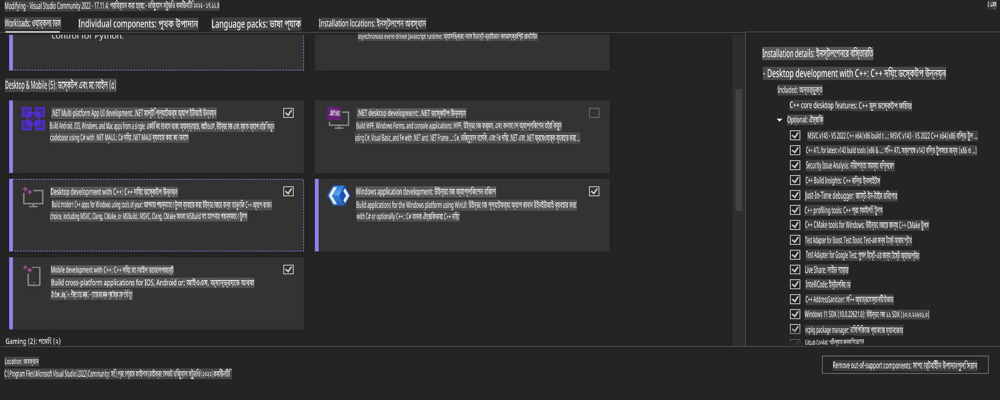
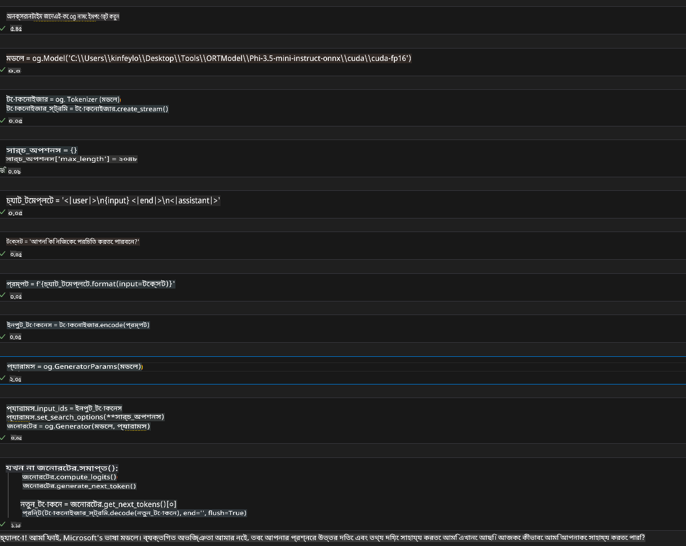
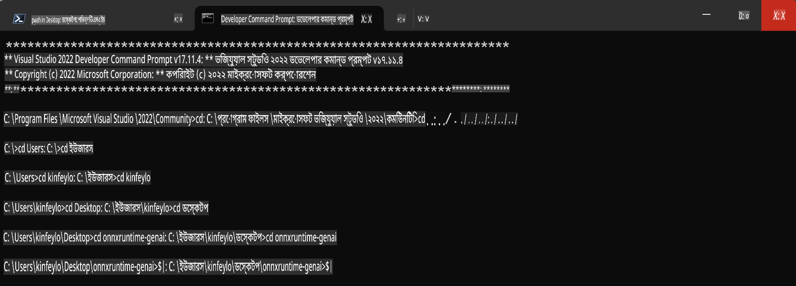

# **OnnxRuntime GenAI Windows GPU এর জন্য নির্দেশিকা**

এই নির্দেশিকাটি Windows-এ GPU সহ ONNX Runtime (ORT) সেটআপ এবং ব্যবহারের ধাপগুলি সরবরাহ করে। এটি আপনার মডেলগুলির জন্য GPU অ্যাক্সিলারেশন কাজে লাগাতে সাহায্য করবে, যা কর্মক্ষমতা এবং দক্ষতা উন্নত করবে।

এই ডকুমেন্টে আলোচনা করা হয়েছে:

- পরিবেশ সেটআপ: CUDA, cuDNN এবং ONNX Runtime-এর মতো প্রয়োজনীয় ডিপেনডেন্সি ইনস্টল করার নির্দেশনা।
- কনফিগারেশন: GPU রিসোর্স কার্যকরভাবে ব্যবহার করতে পরিবেশ এবং ONNX Runtime কনফিগার করার পদ্ধতি।
- অপ্টিমাইজেশন টিপস: সর্বোচ্চ কর্মক্ষমতার জন্য GPU সেটিংস ফাইন-টিউন করার পরামর্শ।

### **১. Python 3.10.x /3.11.8**

   ***নোট*** আপনার Python পরিবেশ হিসেবে [miniforge](https://github.com/conda-forge/miniforge/releases/latest/download/Miniforge3-Windows-x86_64.exe) ব্যবহার করার পরামর্শ দেওয়া হয়।

   ```bash

   conda create -n pydev python==3.11.8

   conda activate pydev

   ```

   ***স্মরণ করিয়ে দেওয়া হচ্ছে*** যদি আপনি ইতিমধ্যে কোনো Python ONNX লাইব্রেরি ইনস্টল করে থাকেন, তাহলে দয়া করে এটি আনইনস্টল করুন।

### **২. winget দিয়ে CMake ইনস্টল করুন**

   ```bash

   winget install -e --id Kitware.CMake

   ```

### **৩. Visual Studio 2022 - Desktop Development with C++ ইনস্টল করুন**

   ***নোট*** যদি আপনি কম্পাইল করতে না চান তবে এই ধাপটি এড়িয়ে যেতে পারেন।



### **৪. NVIDIA ড্রাইভার ইনস্টল করুন**

1. **NVIDIA GPU ড্রাইভার**  [https://www.nvidia.com/en-us/drivers/](https://www.nvidia.com/en-us/drivers/)

2. **NVIDIA CUDA 12.4** [https://developer.nvidia.com/cuda-12-4-0-download-archive](https://developer.nvidia.com/cuda-12-4-0-download-archive)

3. **NVIDIA CUDNN 9.4**  [https://developer.nvidia.com/cudnn-downloads](https://developer.nvidia.com/cudnn-downloads)

***স্মরণ করিয়ে দেওয়া হচ্ছে*** ইনস্টলেশনের সময় ডিফল্ট সেটিংস ব্যবহার করুন।

### **৫. NVIDIA পরিবেশ সেট করুন**

NVIDIA CUDNN 9.4 এর lib, bin, include ফাইলগুলো NVIDIA CUDA 12.4 এর lib, bin, include ফোল্ডারে কপি করুন।

- *'C:\Program Files\NVIDIA\CUDNN\v9.4\bin\12.6'* ফাইলগুলো *'C:\Program Files\NVIDIA GPU Computing Toolkit\CUDA\v12.4\bin'* ফোল্ডারে কপি করুন।

- *'C:\Program Files\NVIDIA\CUDNN\v9.4\include\12.6'* ফাইলগুলো *'C:\Program Files\NVIDIA GPU Computing Toolkit\CUDA\v12.4\include'* ফোল্ডারে কপি করুন।

- *'C:\Program Files\NVIDIA\CUDNN\v9.4\lib\12.6'* ফাইলগুলো *'C:\Program Files\NVIDIA GPU Computing Toolkit\CUDA\v12.4\lib\x64'* ফোল্ডারে কপি করুন।

### **৬. Phi-3.5-mini-instruct-onnx ডাউনলোড করুন**

   ```bash

   winget install -e --id Git.Git

   winget install -e --id GitHub.GitLFS

   git lfs install

   git clone https://huggingface.co/microsoft/Phi-3.5-mini-instruct-onnx

   ```

### **৭. InferencePhi35Instruct.ipynb চালান**

   [Notebook](../../../../../../code/09.UpdateSamples/Aug/ortgpu-phi35-instruct.ipynb) খুলুন এবং এক্সিকিউট করুন।



### **৮. ORT GenAI GPU কম্পাইল করুন**

   ***নোট*** 
   
   ১. প্রথমে সমস্ত ONNX, ONNXRuntime এবং ONNXRuntime-GenAI সম্পর্কিত কিছু থাকলে আনইনস্টল করুন।

   ```bash

   pip list 
   
   ```

   তারপর সমস্ত ONNXRuntime লাইব্রেরি আনইনস্টল করুন, যেমন:

   ```bash

   pip uninstall onnxruntime

   pip uninstall onnxruntime-genai

   pip uninstall onnxruntume-genai-cuda
   
   ```

   ২. Visual Studio এক্সটেনশন সাপোর্ট পরীক্ষা করুন।

   *C:\Program Files\NVIDIA GPU Computing Toolkit\CUDA\v12.4\extras* ফোল্ডারে যান এবং নিশ্চিত করুন যে *C:\Program Files\NVIDIA GPU Computing Toolkit\CUDA\v12.4\extras\visual_studio_integration* পাওয়া যাচ্ছে। 

   যদি না পাওয়া যায়, তবে অন্যান্য CUDA টুলকিট ড্রাইভার ফোল্ডার পরীক্ষা করুন এবং *visual_studio_integration* ফোল্ডার ও এর কন্টেন্ট কপি করে *C:\Program Files\NVIDIA GPU Computing Toolkit\CUDA\v12.4\extras\visual_studio_integration* এ পেস্ট করুন।

   - যদি আপনি কম্পাইল করতে না চান তবে এই ধাপটি এড়িয়ে যেতে পারেন।

   ```bash

   git clone https://github.com/microsoft/onnxruntime-genai

   ```

   - ডাউনলোড করুন [https://github.com/microsoft/onnxruntime/releases/download/v1.19.2/onnxruntime-win-x64-gpu-1.19.2.zip](https://github.com/microsoft/onnxruntime/releases/download/v1.19.2/onnxruntime-win-x64-gpu-1.19.2.zip)

   - *onnxruntime-win-x64-gpu-1.19.2.zip* আনজিপ করুন, এবং এর নাম পরিবর্তন করে **ort** রাখুন। তারপর **ort** ফোল্ডারটিকে *onnxruntime-genai* এ কপি করুন।

   - Windows Terminal ব্যবহার করে, VS 2022 এর Developer Command Prompt এ যান এবং *onnxruntime-genai* ফোল্ডারে যান।



   - আপনার Python পরিবেশ ব্যবহার করে এটি কম্পাইল করুন।

   ```bash

   cd onnxruntime-genai

   python build.py --use_cuda  --cuda_home "C:\Program Files\NVIDIA GPU Computing Toolkit\CUDA\v12.4" --config Release
 

   cd build/Windows/Release/Wheel

   pip install .whl

   ```

**অস্বীকৃতি**:  
এই নথি মেশিন-ভিত্তিক এআই অনুবাদ পরিষেবা ব্যবহার করে অনুবাদ করা হয়েছে। আমরা যথাসম্ভব সঠিক অনুবাদের জন্য চেষ্টা করি, তবে দয়া করে সচেতন থাকুন যে স্বয়ংক্রিয় অনুবাদে ভুল বা অসঙ্গতি থাকতে পারে। নথিটির মূল ভাষায় রচিত সংস্করণকেই প্রামাণিক উৎস হিসেবে বিবেচনা করা উচিত। গুরুত্বপূর্ণ তথ্যের ক্ষেত্রে পেশাদার মানব অনুবাদের পরামর্শ দেওয়া হয়। এই অনুবাদ ব্যবহার থেকে উদ্ভূত কোনো ভুল বোঝাবুঝি বা ভুল ব্যাখ্যার জন্য আমরা দায়ী নই।