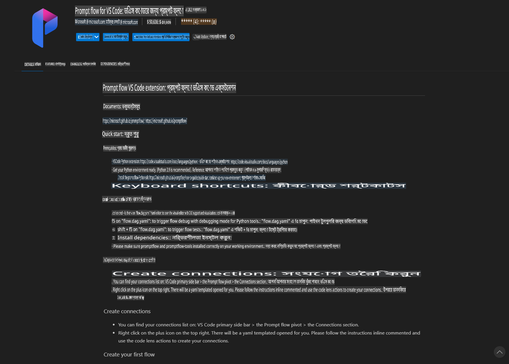
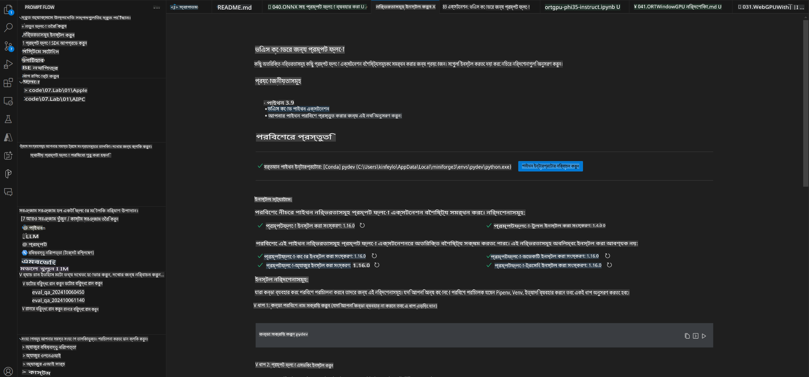
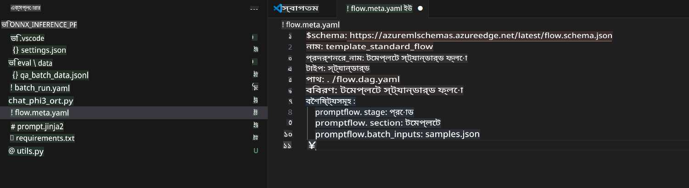
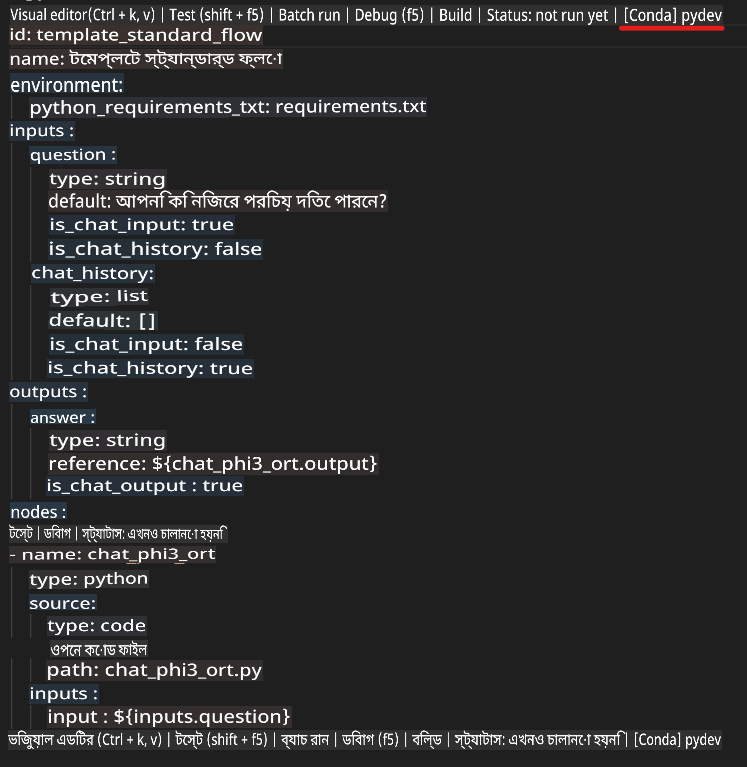
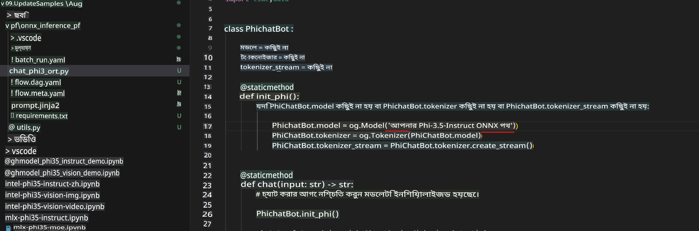
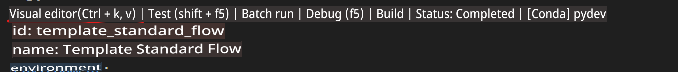
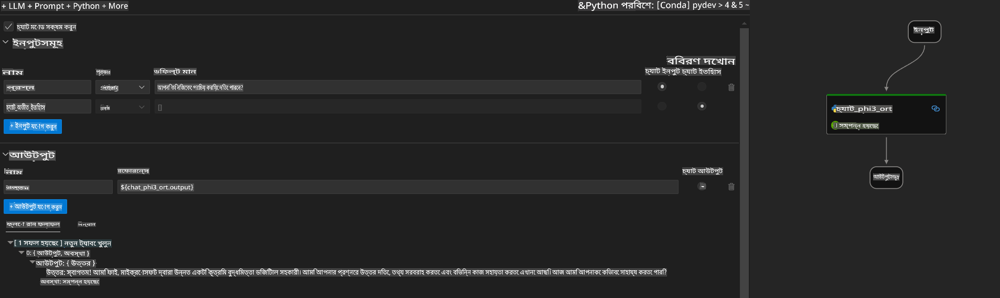
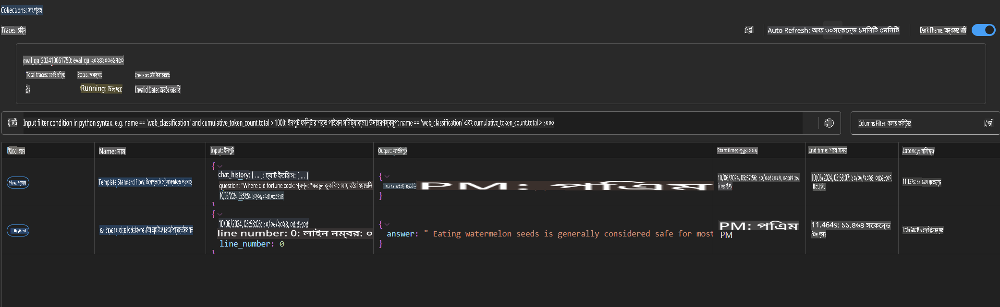

# উইন্ডোজ GPU ব্যবহার করে Phi-3.5-Instruct ONNX দিয়ে প্রম্প্ট ফ্লো সলিউশন তৈরি করা

নিচের ডকুমেন্টটি একটি উদাহরণ যেখানে দেখানো হয়েছে কিভাবে PromptFlow এবং ONNX (Open Neural Network Exchange) ব্যবহার করে Phi-3 মডেলের উপর ভিত্তি করে AI অ্যাপ্লিকেশন তৈরি করা যায়।

PromptFlow হলো একটি ডেভেলপমেন্ট টুলের সংকলন যা LLM-ভিত্তিক (Large Language Model) AI অ্যাপ্লিকেশনগুলোর আইডিয়া তৈরি থেকে শুরু করে প্রোটোটাইপিং, টেস্টিং এবং মূল্যায়ন পর্যন্ত সম্পূর্ণ ডেভেলপমেন্ট প্রক্রিয়াকে সহজতর করে।

PromptFlow এবং ONNX একত্রিত করে ডেভেলপাররা করতে পারেন:

- **মডেলের পারফরম্যান্স অপ্টিমাইজ**: ONNX ব্যবহার করে মডেলের ইনফারেন্স এবং ডিপ্লয়মেন্ট আরও কার্যকর করা।
- **ডেভেলপমেন্ট সহজ করা**: PromptFlow ব্যবহার করে ওয়ার্কফ্লো পরিচালনা এবং পুনরাবৃত্তিমূলক কাজগুলো স্বয়ংক্রিয় করা।
- **সহযোগিতা বৃদ্ধি করা**: একটি একক ডেভেলপমেন্ট পরিবেশ প্রদান করে দলের সদস্যদের মধ্যে আরও ভালো সহযোগিতা নিশ্চিত করা।

**Prompt flow** একটি ডেভেলপমেন্ট টুলের সংকলন যা LLM-ভিত্তিক AI অ্যাপ্লিকেশনগুলোর আইডিয়া তৈরি, প্রোটোটাইপিং, টেস্টিং, মূল্যায়ন থেকে শুরু করে প্রোডাকশন ডিপ্লয়মেন্ট এবং মনিটরিং পর্যন্ত সম্পূর্ণ প্রক্রিয়াকে সহজতর করে। এটি প্রম্প্ট ইঞ্জিনিয়ারিংকে অনেক সহজ করে তোলে এবং প্রোডাকশন মানের LLM অ্যাপ তৈরি করতে সহায়তা করে।

Prompt flow OpenAI, Azure OpenAI Service, এবং কাস্টমাইজেবল মডেল (Huggingface, local LLM/SLM)-এর সাথে সংযুক্ত হতে পারে। আমরা Phi-3.5-এর কোয়ান্টাইজড ONNX মডেলকে লোকাল অ্যাপ্লিকেশনে ডিপ্লয় করতে চাই। Prompt flow আমাদের ব্যবসার পরিকল্পনা আরও ভালোভাবে করতে এবং Phi-3.5 ভিত্তিক লোকাল সলিউশন সম্পন্ন করতে সহায়তা করতে পারে। এই উদাহরণে, আমরা ONNX Runtime GenAI Library এর সাথে সংযোগ করব এবং উইন্ডোজ GPU ভিত্তিক Prompt flow সলিউশন সম্পন্ন করব।

## **ইনস্টলেশন**

### **উইন্ডোজ GPU এর জন্য ONNX Runtime GenAI**

উইন্ডোজ GPU এর জন্য ONNX Runtime GenAI সেটআপ করার নির্দেশনা পড়ুন [এখানে ক্লিক করুন](./ORTWindowGPUGuideline.md)

### **VSCode-এ Prompt flow সেটআপ করা**

1. Prompt flow VS Code এক্সটেনশন ইনস্টল করুন



2. Prompt flow VS Code এক্সটেনশন ইনস্টল করার পরে, এক্সটেনশনটিতে ক্লিক করুন এবং **Installation dependencies** নির্বাচন করুন। এই নির্দেশিকা অনুসরণ করে আপনার পরিবেশে Prompt flow SDK ইনস্টল করুন।



3. [স্যাম্পল কোড](../../../../../../code/09.UpdateSamples/Aug/pf/onnx_inference_pf) ডাউনলোড করুন এবং VS Code দিয়ে এই স্যাম্পলটি খুলুন।



4. **flow.dag.yaml** ফাইলটি খুলুন এবং আপনার Python পরিবেশ নির্বাচন করুন।



   **chat_phi3_ort.py** ফাইলটি খুলুন এবং আপনার Phi-3.5-instruct ONNX মডেলের অবস্থান পরিবর্তন করুন।



5. আপনার প্রম্প্ট ফ্লো চালিয়ে টেস্ট করুন।

**flow.dag.yaml** ফাইল খুলুন এবং ভিজ্যুয়াল এডিটরে ক্লিক করুন।



এইটিতে ক্লিক করার পরে চালান এবং টেস্ট করুন।



1. টার্মিনালে ব্যাচ রান করুন এবং আরও ফলাফল দেখুন।

```bash

pf run create --file batch_run.yaml --stream --name 'Your eval qa name'    

```

আপনার ডিফল্ট ব্রাউজারে ফলাফল দেখতে পারবেন।



**অস্বীকৃতি**:  
এই নথিটি মেশিন-ভিত্তিক এআই অনুবাদ পরিষেবাগুলি ব্যবহার করে অনুবাদ করা হয়েছে। আমরা যথাসম্ভব সঠিক অনুবাদের জন্য চেষ্টা করি, তবে দয়া করে মনে রাখবেন যে স্বয়ংক্রিয় অনুবাদে ত্রুটি বা অসংগতি থাকতে পারে। মূল ভাষায় থাকা নথিটিকেই প্রামাণিক উৎস হিসেবে বিবেচনা করা উচিত। গুরুত্বপূর্ণ তথ্যের জন্য পেশাদার মানব অনুবাদের পরামর্শ দেওয়া হয়। এই অনুবাদ ব্যবহারের ফলে সৃষ্ট যে কোনো ভুল বোঝাবুঝি বা ভুল ব্যাখ্যার জন্য আমরা দায়ী নই। 