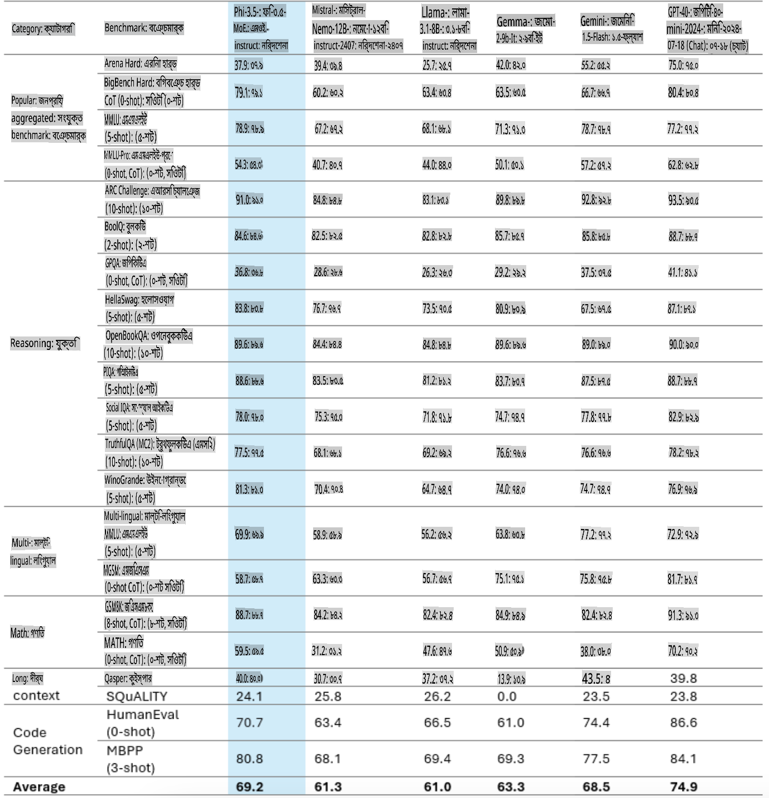
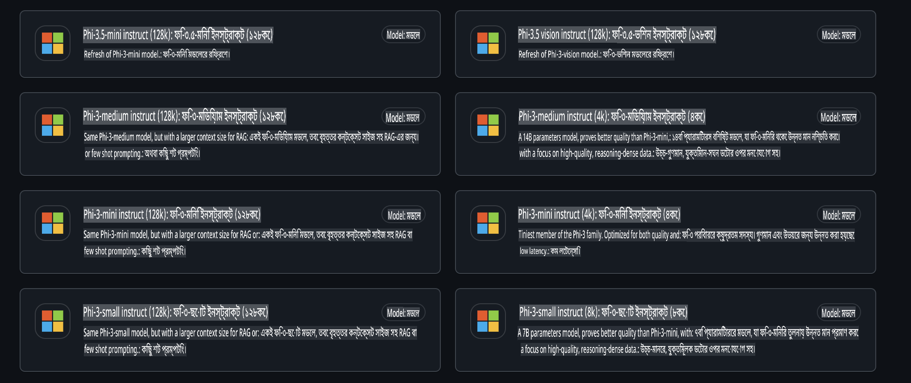
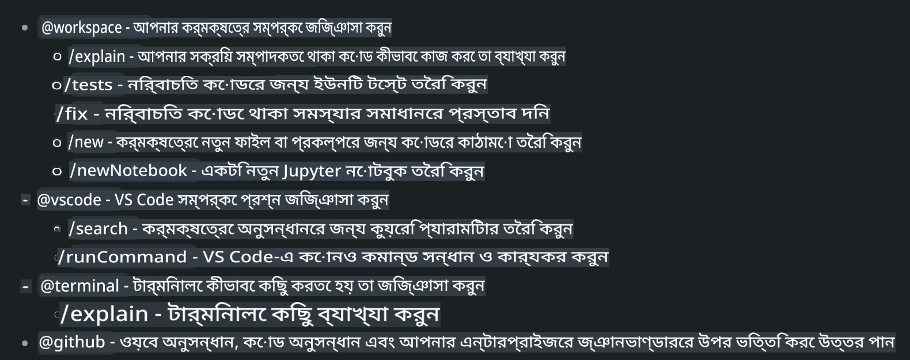
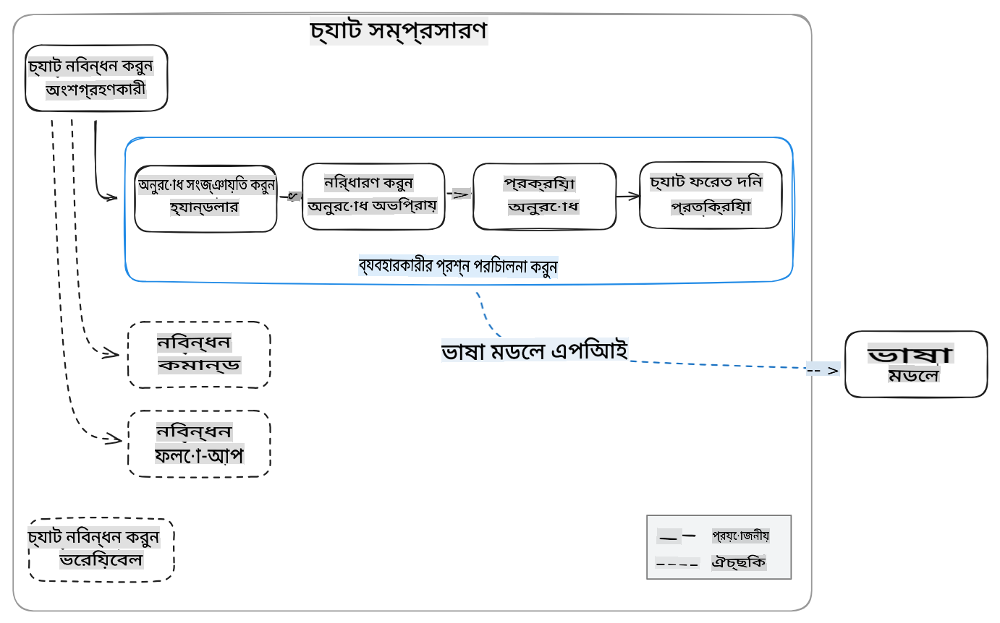
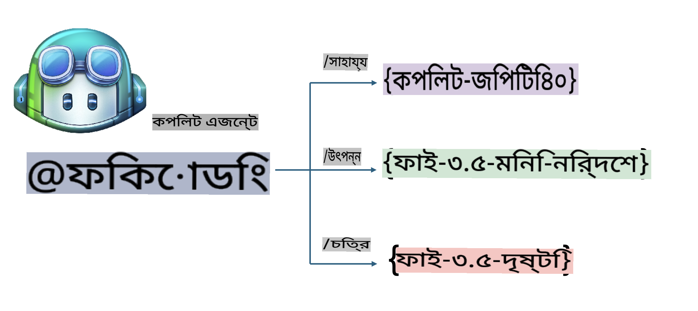
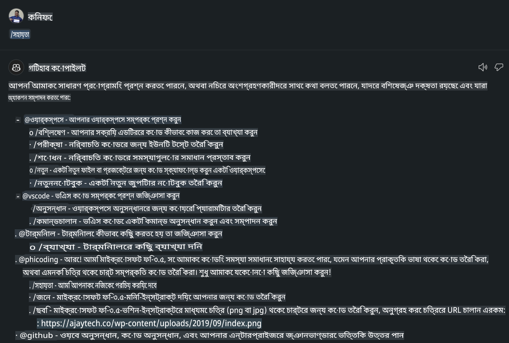
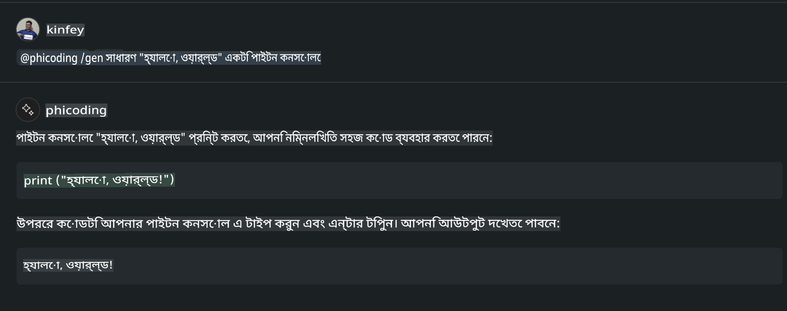
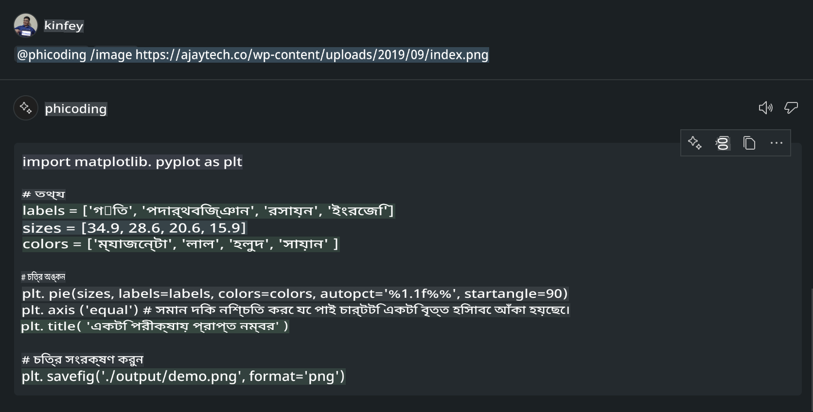

# **আপনার নিজস্ব Visual Studio Code Chat Copilot Agent তৈরি করুন Phi-3.5 এবং GitHub Models ব্যবহার করে**

আপনি কি Visual Studio Code Copilot ব্যবহার করছেন? বিশেষত Chat-এ, আপনি বিভিন্ন এজেন্ট ব্যবহার করতে পারেন Visual Studio Code-এ প্রজেক্ট তৈরি, লেখা এবং রক্ষণাবেক্ষণের ক্ষমতা উন্নত করতে। Visual Studio Code এমন একটি API সরবরাহ করে যা কোম্পানি এবং ব্যক্তিদের তাদের ব্যবসার উপর ভিত্তি করে বিভিন্ন এজেন্ট তৈরি করতে এবং বিভিন্ন বিশেষায়িত ক্ষেত্রে তাদের ক্ষমতা বাড়াতে সাহায্য করে। এই প্রবন্ধে, আমরা GitHub Models-এর **Phi-3.5-mini-instruct (128k)** এবং **Phi-3.5-vision-instruct (128k)** মডেলের উপর ফোকাস করব আপনার নিজস্ব Visual Studio Code Agent তৈরির জন্য।

## **GitHub Models-এ Phi-3.5 সম্পর্কে**

আমরা জানি যে Phi-3/3.5-mini-instruct মডেলের কোড বোঝা এবং জেনারেশনের ক্ষেত্রে শক্তিশালী ক্ষমতা রয়েছে এবং এটি Gemma-2-9b এবং Mistral-Nemo-12B-instruct-2407 এর তুলনায় সুবিধাজনক।



সবচেয়ে নতুন GitHub Models ইতিমধ্যেই Phi-3.5-mini-instruct (128k) এবং Phi-3.5-vision-instruct (128k) মডেলের অ্যাক্সেস প্রদান করছে। ডেভেলপাররা এগুলো OpenAI SDK, Azure AI Inference SDK, এবং REST API-এর মাধ্যমে ব্যবহার করতে পারেন।



***নোট:*** এখানে Azure AI Inference SDK ব্যবহার করার সুপারিশ করা হয়, কারণ এটি প্রোডাকশন পরিবেশে Azure Model Catalog-এর সাথে আরও ভালোভাবে সুইচ করতে পারে।

নিচে **Phi-3.5-mini-instruct (128k)** এবং **Phi-3.5-vision-instruct (128k)** মডেলের কোড জেনারেশন সিচুয়েশনে GitHub Models-এর সাথে সংযোগের পর ফলাফল দেওয়া হয়েছে, যা পরবর্তী উদাহরণগুলির জন্য প্রস্তুতি।

**ডেমো: GitHub Models Phi-3.5-mini-instruct (128k) প্রম্পট থেকে কোড তৈরি করছে** ([এই লিঙ্কে ক্লিক করুন](../../../../../../code/09.UpdateSamples/Aug/ghmodel_phi35_instruct_demo.ipynb))

**ডেমো: GitHub Models Phi-3.5-vision-instruct (128k) ইমেজ থেকে কোড তৈরি করছে** ([এই লিঙ্কে ক্লিক করুন](../../../../../../code/09.UpdateSamples/Aug/ghmodel_phi35_vision_demo.ipynb))

## **GitHub Copilot Chat Agent সম্পর্কে**

GitHub Copilot Chat Agent বিভিন্ন প্রজেক্ট সিচুয়েশনে কোডের উপর ভিত্তি করে বিভিন্ন কাজ সম্পন্ন করতে পারে। সিস্টেমে চারটি এজেন্ট রয়েছে: workspace, github, terminal, vscode।



এজেন্টের নামের সাথে ‘@’ যোগ করার মাধ্যমে আপনি দ্রুত সংশ্লিষ্ট কাজ সম্পন্ন করতে পারেন। এন্টারপ্রাইজের জন্য, যদি আপনি আপনার নিজস্ব ব্যবসায়িক বিষয়বস্তু যেমন প্রয়োজনীয়তা, কোডিং, টেস্ট স্পেসিফিকেশন এবং রিলিজ যোগ করেন, তাহলে আপনি GitHub Copilot-এর উপর ভিত্তি করে আরও শক্তিশালী এন্টারপ্রাইজ প্রাইভেট ফাংশন পেতে পারেন।

Visual Studio Code Chat Agent এখন অফিসিয়ালি তার API প্রকাশ করেছে, যা এন্টারপ্রাইজ বা এন্টারপ্রাইজ ডেভেলপারদের বিভিন্ন সফটওয়্যার ব্যবসায়িক ইকোসিস্টেমের উপর ভিত্তি করে এজেন্ট তৈরি করতে দেয়। Visual Studio Code Extension Development পদ্ধতির উপর ভিত্তি করে আপনি সহজেই Visual Studio Code Chat Agent API-এর ইন্টারফেস অ্যাক্সেস করতে পারেন। আমরা এই প্রক্রিয়ার উপর ভিত্তি করে ডেভেলপ করতে পারি।



ডেভেলপমেন্ট সিচুয়েশন তৃতীয় পক্ষের মডেল API-তে (যেমন GitHub Models, Azure Model Catalog, এবং ওপেন সোর্স মডেলের উপর ভিত্তি করে স্বনির্মিত পরিষেবা) অ্যাক্সেস সমর্থন করতে পারে এবং GitHub Copilot দ্বারা প্রদত্ত gpt-35-turbo, gpt-4, এবং gpt-4o মডেলগুলিও ব্যবহার করতে পারে।

## **Phi-3.5 ভিত্তিক একটি এজেন্ট @phicoding যোগ করুন**

আমরা Phi-3.5-এর প্রোগ্রামিং ক্ষমতাকে একত্রিত করার চেষ্টা করি কোড লেখা, ইমেজ জেনারেশন কোড এবং অন্যান্য কাজ সম্পন্ন করতে। Phi-3.5-এর উপর ভিত্তি করে তৈরি একটি এজেন্ট - @PHI, এর কিছু ফাংশন নিচে দেওয়া হলো:

1. **@phicoding /help** কমান্ডের মাধ্যমে GitHub Copilot দ্বারা প্রদত্ত GPT-4o ভিত্তিক একটি স্ব-পরিচিতি তৈরি করুন।

2. **@phicoding /gen** কমান্ডের মাধ্যমে **Phi-3.5-mini-instruct (128k)** ভিত্তিক বিভিন্ন প্রোগ্রামিং ভাষার জন্য কোড তৈরি করুন।

3. **@phicoding /image** কমান্ডের মাধ্যমে **Phi-3.5-vision-instruct (128k)** এবং ইমেজ কমপ্লিশন ভিত্তিক কোড তৈরি করুন।



## **সম্পর্কিত ধাপসমূহ**

1. npm ব্যবহার করে Visual Studio Code Extension ডেভেলপমেন্ট সাপোর্ট ইনস্টল করুন।

```bash

npm install --global yo generator-code 

```

2. একটি Visual Studio Code Extension প্লাগইন তৈরি করুন (Typescript ডেভেলপমেন্ট মোড ব্যবহার করে, নাম phiext)।

```bash

yo code 

```

3. তৈরি করা প্রজেক্টটি খুলুন এবং package.json সংশোধন করুন। এখানে সংশ্লিষ্ট নির্দেশনা এবং কনফিগারেশন, পাশাপাশি GitHub Models-এর কনফিগারেশন দেওয়া হয়েছে। এখানে আপনাকে আপনার GitHub Models টোকেন যোগ করতে হবে।

```json

{
  "name": "phiext",
  "displayName": "phiext",
  "description": "",
  "version": "0.0.1",
  "engines": {
    "vscode": "^1.93.0"
  },
  "categories": [
    "AI",
    "Chat"
  ],
  "activationEvents": [],
  "enabledApiProposals": [
      "chatVariableResolver"
  ],
  "main": "./dist/extension.js",
  "contributes": {
    "chatParticipants": [
        {
            "id": "chat.phicoding",
            "name": "phicoding",
            "description": "Hey! I am Microsoft Phi-3.5, She can help me with coding problems, such as generation code with your natural language, or even generation code about chart from images. Just ask me anything!",
            "isSticky": true,
            "commands": [
                {
                    "name": "help",
                    "description": "Introduce myself to you"
                },
                {
                    "name": "gen",
                    "description": "Generate code for you with Microsoft Phi-3.5-mini-instruct"
                },
                {
                    "name": "image",
                    "description": "Generate code for chart from image(png or jpg) with Microsoft Phi-3.5-vision-instruct, please add image url like this : https://ajaytech.co/wp-content/uploads/2019/09/index.png"
                }
            ]
        }
    ],
    "commands": [
        {
            "command": "phicoding.namesInEditor",
            "title": "Use Microsoft Phi 3.5 in Editor"
        }
    ],
    "configuration": {
      "type": "object",
      "title": "githubmodels",
      "properties": {
        "githubmodels.endpoint": {
          "type": "string",
          "default": "https://models.inference.ai.azure.com",
          "description": "Your GitHub Models Endpoint",
          "order": 0
        },
        "githubmodels.api_key": {
          "type": "string",
          "default": "Your GitHub Models Token",
          "description": "Your GitHub Models Token",
          "order": 1
        },
        "githubmodels.phi35instruct": {
          "type": "string",
          "default": "Phi-3.5-mini-instruct",
          "description": "Your Phi-35-Instruct Model",
          "order": 2
        },
        "githubmodels.phi35vision": {
          "type": "string",
          "default": "Phi-3.5-vision-instruct",
          "description": "Your Phi-35-Vision Model",
          "order": 3
        }
      }
    }
  },
  "scripts": {
    "vscode:prepublish": "npm run package",
    "compile": "webpack",
    "watch": "webpack --watch",
    "package": "webpack --mode production --devtool hidden-source-map",
    "compile-tests": "tsc -p . --outDir out",
    "watch-tests": "tsc -p . -w --outDir out",
    "pretest": "npm run compile-tests && npm run compile && npm run lint",
    "lint": "eslint src",
    "test": "vscode-test"
  },
  "devDependencies": {
    "@types/vscode": "^1.93.0",
    "@types/mocha": "^10.0.7",
    "@types/node": "20.x",
    "@typescript-eslint/eslint-plugin": "^8.3.0",
    "@typescript-eslint/parser": "^8.3.0",
    "eslint": "^9.9.1",
    "typescript": "^5.5.4",
    "ts-loader": "^9.5.1",
    "webpack": "^5.94.0",
    "webpack-cli": "^5.1.4",
    "@vscode/test-cli": "^0.0.10",
    "@vscode/test-electron": "^2.4.1"
  },
  "dependencies": {
    "@types/node-fetch": "^2.6.11",
    "node-fetch": "^3.3.2",
    "@azure-rest/ai-inference": "latest",
    "@azure/core-auth": "latest",
    "@azure/core-sse": "latest"
  }
}


```

4. src/extension.ts সংশোধন করুন।

```typescript

// The module 'vscode' contains the VS Code extensibility API
// Import the module and reference it with the alias vscode in your code below
import * as vscode from 'vscode';
import ModelClient from "@azure-rest/ai-inference";
import { AzureKeyCredential } from "@azure/core-auth";


interface IPhiChatResult extends vscode.ChatResult {
    metadata: {
        command: string;
    };
}


const MODEL_SELECTOR: vscode.LanguageModelChatSelector = { vendor: 'copilot', family: 'gpt-4o' };

function isValidImageUrl(url: string): boolean {
    const regex = /^(https?:\/\/.*\.(?:png|jpg))$/i;
    return regex.test(url);
}
  

// This method is called when your extension is activated
// Your extension is activated the very first time the command is executed
export function activate(context: vscode.ExtensionContext) {

    const codinghandler: vscode.ChatRequestHandler = async (request: vscode.ChatRequest, context: vscode.ChatContext, stream: vscode.ChatResponseStream, token: vscode.CancellationToken): Promise<IPhiChatResult> => {


        const config : any = vscode.workspace.getConfiguration('githubmodels');
        const endPoint: string = config.get('endpoint');
        const apiKey: string = config.get('api_key');
        const phi35instruct: string = config.get('phi35instruct');
        const phi35vision: string = config.get('phi35vision');
        
        if (request.command === 'help') {

            const content = "Welcome to Coding assistant with Microsoft Phi-3.5"; 
            stream.progress(content);


            try {
                const [model] = await vscode.lm.selectChatModels(MODEL_SELECTOR);
                if (model) {
                    const messages = [
                        vscode.LanguageModelChatMessage.User("Please help me express this content in a humorous way: I am a programming assistant who can help you convert natural language into code and generate code based on the charts in the images. output format like this : Hey I am Phi ......")
                    ];
                    const chatResponse = await model.sendRequest(messages, {}, token);
                    for await (const fragment of chatResponse.text) {
                        stream.markdown(fragment);
                    }
                }
            } catch(err) {
                console.log(err);
            }


            return { metadata: { command: 'help' } };

        }

        
        if (request.command === 'gen') {

            const content = "Welcome to use phi-3.5 to generate code";

            stream.progress(content);

            const client = new ModelClient(endPoint, new AzureKeyCredential(apiKey));

            const response = await client.path("/chat/completions").post({
              body: {
                messages: [
                  { role:"system", content: "You are a coding assistant.Help answer all code generation questions." },
                  { role:"user", content: request.prompt }
                ],
                model: phi35instruct,
                temperature: 0.4,
                max_tokens: 1000,
                top_p: 1.
              }
            });

            stream.markdown(response.body.choices[0].message.content);

            return { metadata: { command: 'gen' } };

        }


        
        if (request.command === 'image') {


            const content = "Welcome to use phi-3.5 to generate code from image(png or jpg),image url like this:https://ajaytech.co/wp-content/uploads/2019/09/index.png";

            stream.progress(content);

            if (!isValidImageUrl(request.prompt)) {
                stream.markdown('Please provide a valid image URL');
                return { metadata: { command: 'image' } };
            }
            else
            {

                const client = new ModelClient(endPoint, new AzureKeyCredential(apiKey));
    
                const response = await client.path("/chat/completions").post({
                    body: {
                      messages: [
                        { role: "system", content: "You are a helpful assistant that describes images in details." },
                        { role: "user", content: [
                            { type: "text", text: "Please generate code according to the chart in the picture according to the following requirements\n1. Keep all information in the chart, including data and text\n2. Do not generate additional information that is not included in the chart\n3. Please extract data from the picture, do not generate it from csv\n4. Please save the regenerated chart as a chart and save it to ./output/demo.png"},
                            { type: "image_url", image_url: {url: request.prompt}
                            }
                          ]
                        }
                      ],
                      model: phi35vision,
                      temperature: 0.4,
                      max_tokens: 2048,
                      top_p: 1.
                    }
                  });
    
                
                stream.markdown(response.body.choices[0].message.content);
    
                return { metadata: { command: 'image' } };
            }


        }


        return { metadata: { command: '' } };
    };


    const phi_ext = vscode.chat.createChatParticipant("chat.phicoding", codinghandler);

    phi_ext.iconPath = new vscode.ThemeIcon('sparkle');


    phi_ext.followupProvider = {
        provideFollowups(result: IPhiChatResult, context: vscode.ChatContext, token: vscode.CancellationToken) {
            return [{
                prompt: 'Let us coding with Phi-3.5 😋😋😋😋',
                label: vscode.l10n.t('Enjoy coding with Phi-3.5'),
                command: 'help'
            } satisfies vscode.ChatFollowup];
        }
    };

    context.subscriptions.push(phi_ext);
}

// This method is called when your extension is deactivated
export function deactivate() {}


```

6. চালান।

***/help***



***@phicoding /help***


***@phicoding /gen***



***@phicoding /image***



আপনি নমুনা কোড ডাউনলোড করতে পারেন: [ক্লিক করুন](../../../../../../code/09.UpdateSamples/Aug/vscode)

## **উপকরণ**

1. GitHub Models সাইন আপ করুন [https://gh.io/models](https://gh.io/models)

2. Visual Studio Code Extension Development শিখুন [https://code.visualstudio.com/api/get-started/your-first-extension](https://code.visualstudio.com/api/get-started/your-first-extension)

3. Visual Studio Code Coilot Chat API সম্পর্কে জানুন [https://code.visualstudio.com/api/extension-guides/chat](https://code.visualstudio.com/api/extension-guides/chat)

**অস্বীকৃতি**:  
এই নথিটি মেশিন-ভিত্তিক এআই অনুবাদ সেবার মাধ্যমে অনূদিত হয়েছে। আমরা যথাসাধ্য নির্ভুলতার জন্য চেষ্টা করি, তবে অনুগ্রহ করে মনে রাখবেন যে স্বয়ংক্রিয় অনুবাদে ভুল বা অসংগতি থাকতে পারে। এর মূল ভাষায় থাকা আসল নথিটিকে প্রামাণ্য সূত্র হিসেবে বিবেচনা করা উচিত। গুরুত্বপূর্ণ তথ্যের ক্ষেত্রে, পেশাদার মানব অনুবাদ গ্রহণ করার পরামর্শ দেওয়া হচ্ছে। এই অনুবাদ ব্যবহারের ফলে কোনো ভুল বোঝাবুঝি বা ভুল ব্যাখ্যার জন্য আমরা দায়ী থাকব না। 