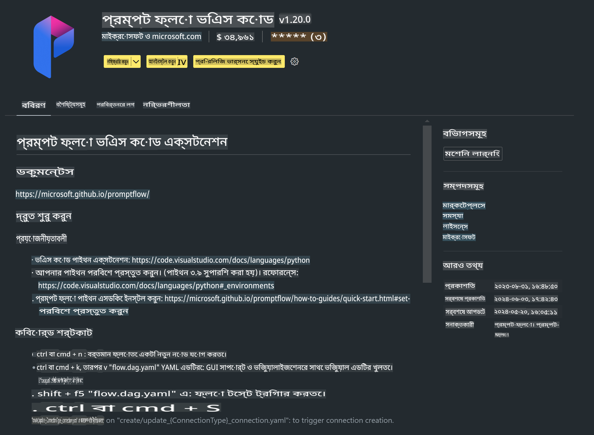

# **ল্যাব ০ - ইনস্টলেশন**

যখন আমরা ল্যাবে প্রবেশ করি, তখন আমাদের প্রাসঙ্গিক পরিবেশ কনফিগার করতে হবে:

### **১. পাইথন ৩.১১+**

পাইথন পরিবেশ কনফিগার করার জন্য miniforge ব্যবহার করার পরামর্শ দেওয়া হয়।

miniforge কনফিগার করার জন্য, দয়া করে দেখুন [https://github.com/conda-forge/miniforge](https://github.com/conda-forge/miniforge)

miniforge কনফিগার করার পরে, Power Shell-এ নিম্নলিখিত কমান্ডটি চালান:

```bash

conda create -n pyenv python==3.11.8 -y

conda activate pyenv

```

### **২. প্রম্পট ফ্লো SDK ইনস্টল করুন**

ল্যাব ১-এ, আমরা প্রম্পট ফ্লো ব্যবহার করব, তাই আপনাকে প্রম্পট ফ্লো SDK কনফিগার করতে হবে।

```bash

pip install promptflow --upgrade

```

এই কমান্ড দিয়ে আপনি প্রম্পট ফ্লো SDK পরীক্ষা করতে পারেন:

```bash

pf --version

```

### **৩. ভিজ্যুয়াল স্টুডিও কোড প্রম্পট ফ্লো এক্সটেনশন ইনস্টল করুন**



### **৪. ইন্টেল NPU অ্যাক্সিলারেশন লাইব্রেরি**

ইন্টেলের নতুন প্রজন্মের প্রসেসরগুলো NPU সমর্থন করে। আপনি যদি NPU ব্যবহার করে LLMs / SLMs লোকালভাবে চালাতে চান, তাহলে আপনি ***ইন্টেল NPU অ্যাক্সিলারেশন লাইব্রেরি*** ব্যবহার করতে পারেন। আরও জানতে চাইলে পড়ুন [https://github.com/microsoft/PhiCookBook/blob/main/md/01.Introduction/03/AIPC_Inference.md](https://github.com/microsoft/PhiCookBook/blob/main/md/01.Introduction/03/AIPC_Inference.md)।

bash-এ ইন্টেল NPU অ্যাক্সিলারেশন লাইব্রেরি ইনস্টল করুন:

```bash

pip install intel-npu-acceleration-library

```

***নোট***: দয়া করে মনে রাখবেন যে এই লাইব্রেরি ***৪.৪০.২*** ভার্সনের transformers সমর্থন করে, দয়া করে ভার্সনটি নিশ্চিত করুন।

### **৫. অন্যান্য পাইথন লাইব্রেরি**

requirements.txt তৈরি করুন এবং এই কন্টেন্টটি যোগ করুন:

```txt

notebook
numpy 
scipy 
scikit-learn 
matplotlib 
pandas 
pillow 
graphviz

```

### **৬. NVM ইনস্টল করুন**

Powershell-এ nvm ইনস্টল করুন:

```bash

winget install -e --id CoreyButler.NVMforWindows

```

nodejs ১৮.২০ ইনস্টল করুন:

```bash

nvm install 18.20.0

nvm use 18.20.0

```

### **৭. ভিজ্যুয়াল স্টুডিও কোড ডেভেলপমেন্ট সাপোর্ট ইনস্টল করুন**

```bash

npm install --global yo generator-code

```

অভিনন্দন! আপনি সফলভাবে SDK কনফিগার করেছেন। এবার হাতে-কলমে কাজের ধাপগুলোতে এগিয়ে যান।

**অস্বীকৃতি**:  
এই নথিটি মেশিন-ভিত্তিক এআই অনুবাদ পরিষেবার মাধ্যমে অনুবাদ করা হয়েছে। আমরা যথাসাধ্য সঠিকতা বজায় রাখার চেষ্টা করি, তবে অনুগ্রহ করে মনে রাখবেন যে স্বয়ংক্রিয় অনুবাদে ভুল বা অসঙ্গতি থাকতে পারে। নথিটির মূল ভাষায় রচিত আসল সংস্করণকেই প্রামাণিক উৎস হিসেবে বিবেচনা করা উচিত। গুরুত্বপূর্ণ তথ্যের জন্য, পেশাদার মানব অনুবাদ গ্রহণ করার পরামর্শ দেওয়া হচ্ছে। এই অনুবাদের ব্যবহারের কারণে সৃষ্ট কোনো ভুল বোঝাবুঝি বা ভুল ব্যাখ্যার জন্য আমরা দায়ী থাকব না।