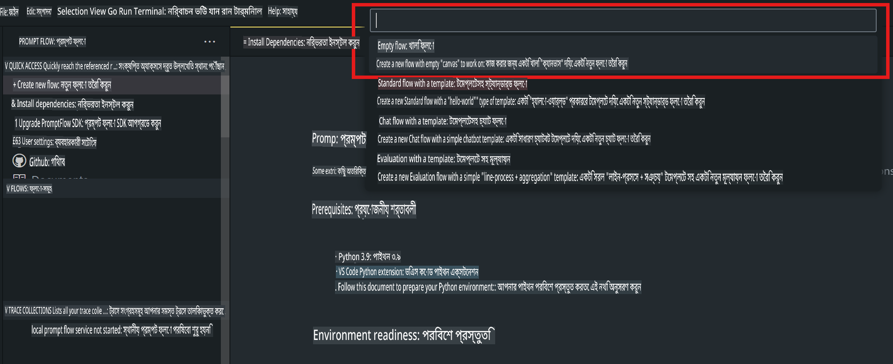
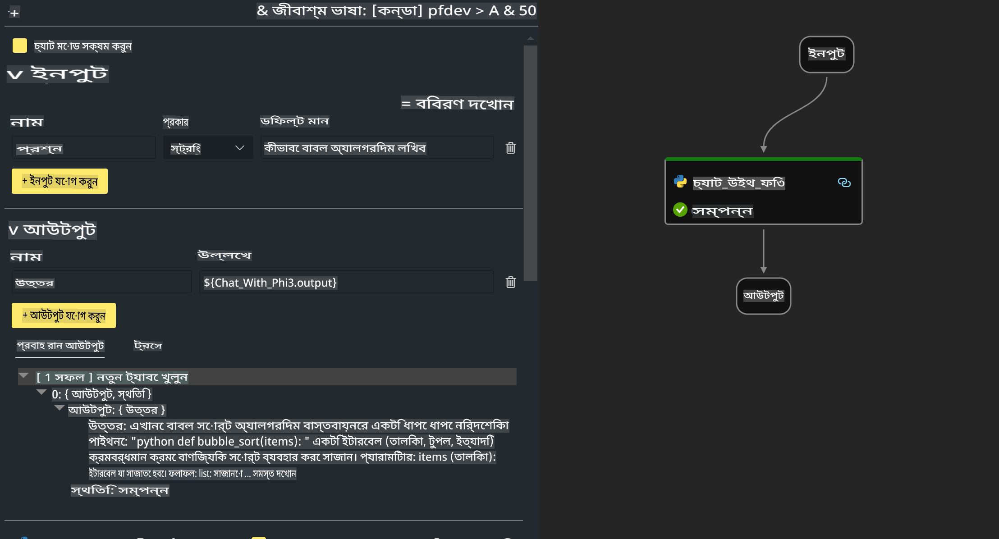

# **ল্যাব ২ - AIPC-তে Phi-3-mini ব্যবহার করে প্রম্প্ট ফ্লো চালানো**

## **প্রম্প্ট ফ্লো কী?**

প্রম্প্ট ফ্লো হলো একটি ডেভেলপমেন্ট টুলের সমন্বয় যা LLM-ভিত্তিক এআই অ্যাপ্লিকেশনের আইডিয়া থেকে শুরু করে প্রোটোটাইপিং, টেস্টিং, মূল্যায়ন, প্রোডাকশন ডিপ্লয়মেন্ট এবং মনিটরিং পর্যন্ত পুরো ডেভেলপমেন্ট সাইকেলকে সহজ করে তোলে। এটি প্রম্প্ট ইঞ্জিনিয়ারিংকে অনেক সহজ করে এবং আপনাকে প্রোডাকশন কোয়ালিটির LLM অ্যাপ তৈরি করতে সহায়তা করে।

প্রম্প্ট ফ্লো ব্যবহার করে আপনি করতে পারবেন:

- LLM, প্রম্প্ট, পাইথন কোড এবং অন্যান্য টুলগুলোকে সংযুক্ত করে একটি কার্যকর ওয়ার্কফ্লো তৈরি।

- সহজেই আপনার ফ্লোগুলো ডিবাগ এবং পুনরাবৃত্তি করা, বিশেষ করে LLM-এর সঙ্গে ইন্টারঅ্যাকশন।

- বড় ডেটাসেটের মাধ্যমে আপনার ফ্লো মূল্যায়ন এবং কোয়ালিটি ও পারফরম্যান্স মেট্রিক্স গণনা।

- CI/CD সিস্টেমে টেস্টিং এবং মূল্যায়ন ইন্টিগ্রেট করে ফ্লোর কোয়ালিটি নিশ্চিত করা।

- আপনার পছন্দের সার্ভিং প্ল্যাটফর্মে ফ্লো ডিপ্লয় করা বা সহজেই অ্যাপ কোডবেসে ইন্টিগ্রেট করা।

- (ঐচ্ছিক তবে অত্যন্ত সুপারিশকৃত) Azure AI-তে প্রম্প্ট ফ্লোর ক্লাউড ভার্সন ব্যবহার করে আপনার টিমের সঙ্গে সহযোগিতা করা। 


## **Apple Silicon-এ জেনারেশন কোড ফ্লো তৈরি করা**

***নোট*** ：যদি আপনি পরিবেশ সেটআপ সম্পন্ন না করে থাকেন, দয়া করে [ল্যাব ০ - ইনস্টলেশন](./01.Installations.md) পরিদর্শন করুন।

1. Visual Studio Code-এ প্রম্প্ট ফ্লো এক্সটেনশন খুলুন এবং একটি খালি ফ্লো প্রজেক্ট তৈরি করুন।



2. ইনপুট এবং আউটপুট প্যারামিটার যোগ করুন এবং নতুন ফ্লো হিসেবে পাইথন কোড যোগ করুন।



আপনার ফ্লো তৈরি করতে এই কাঠামো (flow.dag.yaml) অনুসরণ করতে পারেন।

```yaml

inputs:
  prompt:
    type: string
    default: Write python code for Fibonacci serie. Please use markdown as output
outputs:
  result:
    type: string
    reference: ${gen_code_by_phi3.output}
nodes:
- name: gen_code_by_phi3
  type: python
  source:
    type: code
    path: gen_code_by_phi3.py
  inputs:
    prompt: ${inputs.prompt}


```

3. phi-3-mini কোয়ান্টাইজ করুন।

আমরা চাই SLM লোকাল ডিভাইসে আরও ভালোভাবে চলুক। সাধারণত, আমরা মডেলটি কোয়ান্টাইজ করি (INT4, FP16, FP32)।

```bash

python -m mlx_lm.convert --hf-path microsoft/Phi-3-mini-4k-instruct

```

**নোট:** ডিফল্ট ফোল্ডার হলো mlx_model। 

4. ***Chat_With_Phi3.py***-এ কোড যোগ করুন।

```python


from promptflow import tool

from mlx_lm import load, generate


# The inputs section will change based on the arguments of the tool function, after you save the code
# Adding type to arguments and return value will help the system show the types properly
# Please update the function name/signature per need
@tool
def my_python_tool(prompt: str) -> str:

    model_id = './mlx_model_phi3_mini'

    model, tokenizer = load(model_id)

    # <|user|>\nWrite python code for Fibonacci serie. Please use markdown as output<|end|>\n<|assistant|>

    response = generate(model, tokenizer, prompt="<|user|>\n" + prompt  + "<|end|>\n<|assistant|>", max_tokens=2048, verbose=True)

    return response


```

4. আপনি ডিবাগ বা রান থেকে ফ্লো পরীক্ষা করতে পারেন এবং নিশ্চিত করতে পারেন যে জেনারেশন কোড ঠিকমতো কাজ করছে কিনা।


5. টার্মিনালে ডেভেলপমেন্ট API হিসেবে ফ্লো চালান।

```

pf flow serve --source ./ --port 8080 --host localhost   

```

আপনি এটি Postman / Thunder Client-এ পরীক্ষা করতে পারেন। 


### **নোট**

1. প্রথমবার চালানো অনেক সময় নেয়। Hugging Face CLI থেকে phi-3 মডেল ডাউনলোড করার সুপারিশ করা হচ্ছে।

2. Intel NPU-এর সীমিত কম্পিউটিং ক্ষমতা বিবেচনা করে, Phi-3-mini-4k-instruct ব্যবহার করার সুপারিশ করা হচ্ছে।

3. আমরা INT4 কনভার্সন কোয়ান্টাইজ করতে Intel NPU Acceleration ব্যবহার করি, তবে যদি সার্ভিস পুনরায় চালু করেন, তাহলে ক্যাশ এবং nc_workshop ফোল্ডারগুলো মুছে ফেলতে হবে। 


## **রিসোর্স**

1. প্রম্প্ট ফ্লো শিখুন [https://microsoft.github.io/promptflow/](https://microsoft.github.io/promptflow/)

2. Intel NPU Acceleration শিখুন [https://github.com/intel/intel-npu-acceleration-library](https://github.com/intel/intel-npu-acceleration-library)

3. স্যাম্পল কোড ডাউনলোড করুন [Local NPU Agent Sample Code](../../../../../../../../../code/07.Lab/01/AIPC/local-npu-agent)

**অস্বীকৃতি**:  
এই নথিটি মেশিন-ভিত্তিক এআই অনুবাদ পরিষেবা ব্যবহার করে অনুবাদ করা হয়েছে। আমরা যথাসম্ভব সঠিক অনুবাদের জন্য চেষ্টা করি, তবে অনুগ্রহ করে জেনে রাখুন যে স্বয়ংক্রিয় অনুবাদে ত্রুটি বা অসঙ্গতি থাকতে পারে। মূল ভাষায় থাকা নথিটিকে প্রকৃত উৎস হিসাবে বিবেচনা করা উচিত। গুরুত্বপূর্ণ তথ্যের জন্য পেশাদার মানব অনুবাদের পরামর্শ দেওয়া হয়। এই অনুবাদ ব্যবহারের ফলে সৃষ্ট যে কোনও ভুল বোঝাবুঝি বা ভুল ব্যাখ্যার জন্য আমরা দায়ী নই।