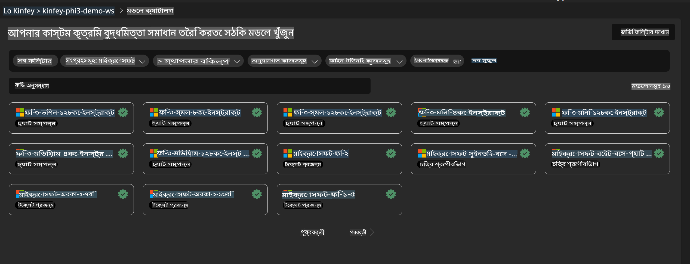
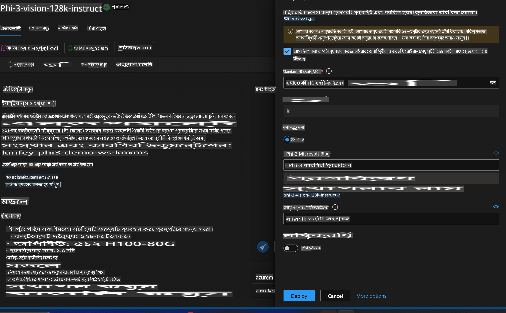
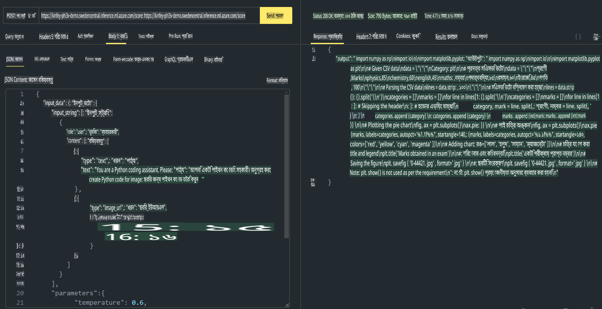

# **ল্যাব ৩ - Azure Machine Learning Service-এ Phi-3-Vision মোতায়েন করুন**

আমরা NPU ব্যবহার করে স্থানীয় কোডের প্রোডাকশন ডিপ্লয়মেন্ট সম্পন্ন করি এবং তারপর আমরা এর মাধ্যমে PHI-3-VISION পরিচয় করিয়ে দেওয়ার ক্ষমতা যুক্ত করতে চাই, যাতে ছবি থেকে কোড তৈরি করা যায়।

এই পরিচিতির মাধ্যমে, আমরা দ্রুত Azure Machine Learning Service-এ একটি Model As Service Phi-3 Vision সার্ভিস তৈরি করতে পারি।

***Note***: Phi-3 Vision দ্রুত কন্টেন্ট তৈরি করতে কম্পিউটিং শক্তি প্রয়োজন। এটি অর্জনের জন্য আমাদের ক্লাউড কম্পিউটিং শক্তির প্রয়োজন।

### **১. Azure Machine Learning Service তৈরি করুন**

আমাদের Azure পোর্টালে একটি Azure Machine Learning Service তৈরি করতে হবে। যদি আপনি এটি কীভাবে করবেন জানতে চান, তবে এই লিঙ্কটি দেখুন [https://learn.microsoft.com/azure/machine-learning/quickstart-create-resources?view=azureml-api-2](https://learn.microsoft.com/azure/machine-learning/quickstart-create-resources?view=azureml-api-2)

### **২. Azure Machine Learning Service-এ Phi-3 Vision নির্বাচন করুন**



### **৩. Azure-এ Phi-3-Vision মোতায়েন করুন**



### **৪. Postman-এ এন্ডপয়েন্ট পরীক্ষা করুন**



***Note***

1. প্রেরণযোগ্য প্যারামিটারে Authorization, azureml-model-deployment, এবং Content-Type অন্তর্ভুক্ত থাকতে হবে। এটি পেতে আপনাকে ডিপ্লয়মেন্ট তথ্য পরীক্ষা করতে হবে।

2. প্যারামিটার প্রেরণের জন্য, Phi-3-Vision-কে একটি ইমেজ লিঙ্ক প্রেরণ করতে হবে। প্যারামিটার প্রেরণের জন্য GPT-4-Vision পদ্ধতিটি অনুসরণ করুন, যেমন:

```json

{
  "input_data":{
    "input_string":[
      {
        "role":"user",
        "content":[ 
          {
            "type": "text",
            "text": "You are a Python coding assistant.Please create Python code for image "
          },
          {
              "type": "image_url",
              "image_url": {
                "url": "https://ajaytech.co/wp-content/uploads/2019/09/index.png"
              }
          }
        ]
      }
    ],
    "parameters":{
          "temperature": 0.6,
          "top_p": 0.9,
          "do_sample": false,
          "max_new_tokens": 2048
    }
  }
}

```

3. Post পদ্ধতি ব্যবহার করে **/score** কল করুন।

**অভিনন্দন**! আপনি দ্রুত PHI-3-VISION মোতায়েন সম্পন্ন করেছেন এবং কীভাবে ছবি থেকে কোড তৈরি করা যায় তা চেষ্টা করেছেন। পরবর্তী ধাপে, আমরা NPU এবং ক্লাউডের সংমিশ্রণে অ্যাপ্লিকেশন তৈরি করতে পারি।

**অস্বীকৃতি**:  
এই নথিটি মেশিন-ভিত্তিক কৃত্রিম বুদ্ধিমত্তা অনুবাদ পরিষেবা ব্যবহার করে অনুবাদ করা হয়েছে। আমরা যথাসম্ভব সঠিক অনুবাদের চেষ্টা করি, তবে অনুগ্রহ করে মনে রাখবেন যে স্বয়ংক্রিয় অনুবাদে ভুল বা অসঙ্গতি থাকতে পারে। মূল ভাষায় থাকা নথিটিকেই প্রামাণিক উৎস হিসেবে বিবেচনা করা উচিত। গুরুত্বপূর্ণ তথ্যের জন্য, পেশাদার মানব অনুবাদ নেওয়ার পরামর্শ দেওয়া হয়। এই অনুবাদ ব্যবহারের ফলে কোনো ভুল বোঝাবুঝি বা ব্যাখ্যার জন্য আমরা দায়ী থাকব না।