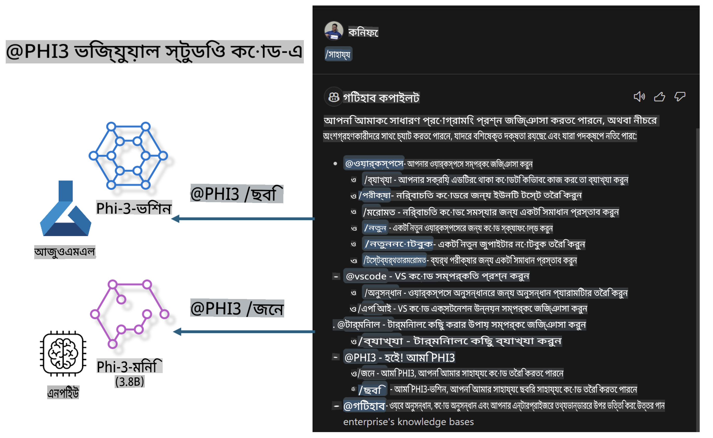

# **আপনার নিজস্ব Visual Studio Code GitHub Copilot Chat তৈরি করুন Microsoft Phi-3 Family ব্যবহার করে**

আপনি কি GitHub Copilot Chat-এ ওয়ার্কস্পেস এজেন্ট ব্যবহার করেছেন? আপনি কি আপনার দলের জন্য নিজস্ব কোড এজেন্ট তৈরি করতে চান? এই হ্যান্ডস-অন ল্যাবটি একটি ওপেন সোর্স মডেলের সাথে মিলিত হয়ে একটি এন্টারপ্রাইজ-লেভেলের কোড বিজনেস এজেন্ট তৈরি করার চেষ্টা করে।

## **ভিত্তি**

### **কেন Microsoft Phi-3 বেছে নেবেন**

Phi-3 একটি ফ্যামিলি সিরিজ, যা বিভিন্ন ট্রেনিং প্যারামিটারের ওপর ভিত্তি করে টেক্সট জেনারেশন, ডায়ালগ কমপ্লিশন এবং কোড জেনারেশনের জন্য phi-3-mini, phi-3-small এবং phi-3-medium অন্তর্ভুক্ত করে। এছাড়াও Vision ভিত্তিক phi-3-vision রয়েছে। এটি এন্টারপ্রাইজ বা বিভিন্ন দলের জন্য অফলাইন জেনারেটিভ AI সল্যুশন তৈরি করার জন্য উপযুক্ত।

এই লিঙ্কটি পড়ার জন্য সুপারিশ করা হলো [https://github.com/microsoft/PhiCookBook/blob/main/md/01.Introduction/01/01.PhiFamily.md](https://github.com/microsoft/PhiCookBook/blob/main/md/01.Introduction/01/01.PhiFamily.md)

### **Microsoft GitHub Copilot Chat**

GitHub Copilot Chat এক্সটেনশন আপনাকে একটি চ্যাট ইন্টারফেস দেয়, যা আপনাকে GitHub Copilot এর সাথে ইন্টারঅ্যাক্ট করতে এবং কোডিং-সম্পর্কিত প্রশ্নের উত্তর সরাসরি VS Code এর মধ্যে পেতে সাহায্য করে, ডকুমেন্টেশনের মধ্যে খোঁজা বা অনলাইন ফোরামে সার্চ করার প্রয়োজন ছাড়াই।

Copilot Chat সিনট্যাক্স হাইলাইটিং, ইনডেন্টেশন এবং অন্যান্য ফরম্যাটিং ফিচার ব্যবহার করতে পারে, যা জেনারেটেড রেসপন্সকে আরও স্পষ্ট করে তোলে। ব্যবহারকারীর প্রশ্নের ধরন অনুযায়ী, ফলাফলটিতে সোর্স কোড ফাইল বা ডকুমেন্টেশনের মতো কনটেক্সটের লিঙ্ক বা VS Code এর ফিচার অ্যাক্সেস করার জন্য বোতাম থাকতে পারে।

- Copilot Chat আপনার ডেভেলপার ফ্লোতে ইন্টিগ্রেট করে এবং যেখানে প্রয়োজন সেখানে আপনাকে সহায়তা করে:

- এডিটর বা টার্মিনাল থেকে সরাসরি ইনলাইন চ্যাট কনভারসেশন শুরু করুন কোডিংয়ের সময় সাহায্য পেতে

- চ্যাট ভিউ ব্যবহার করে যেকোনো সময় AI অ্যাসিস্ট্যান্টের সাহায্য নিন

- কোয়িক চ্যাট চালু করে দ্রুত প্রশ্ন জিজ্ঞাসা করুন এবং আপনার কাজ চালিয়ে যান

আপনি GitHub Copilot Chat বিভিন্ন ক্ষেত্রে ব্যবহার করতে পারেন, যেমন:

- একটি সমস্যার সেরা সমাধান খুঁজে বের করতে কোডিং প্রশ্নের উত্তর দেওয়া

- অন্য কারও কোড ব্যাখ্যা করা এবং উন্নতির পরামর্শ দেওয়া

- কোড সংশোধনের প্রস্তাব দেওয়া

- ইউনিট টেস্ট কেস জেনারেট করা

- কোড ডকুমেন্টেশন তৈরি করা

এই লিঙ্কটি পড়ার জন্য সুপারিশ করা হলো [https://code.visualstudio.com/docs/copilot/copilot-chat](https://code.visualstudio.com/docs/copilot/copilot-chat?WT.mc_id=aiml-137032-kinfeylo)

### **Microsoft GitHub Copilot Chat @workspace**

Copilot Chat-এ **@workspace** রেফারেন্স দিয়ে আপনি পুরো কোডবেস সম্পর্কে প্রশ্ন করতে পারেন। প্রশ্নের ভিত্তিতে, Copilot বুদ্ধিমত্তার সাথে প্রাসঙ্গিক ফাইল এবং সিম্বলগুলি রিট্রিভ করে, যা পরে এর উত্তরে লিঙ্ক এবং কোড উদাহরণ হিসেবে উল্লেখ করে।

আপনার প্রশ্নের উত্তর দিতে, **@workspace** ডেভেলপাররা VS Code-এ কোডবেস নেভিগেট করার সময় যে উৎসগুলি ব্যবহার করেন, সেগুলি অনুসন্ধান করে:

- ওয়ার্কস্পেসের সমস্ত ফাইল, তবে .gitignore ফাইলে উপেক্ষিত ফাইলগুলি বাদে

- নেস্টেড ফোল্ডার এবং ফাইল নাম সহ ডিরেক্টরি স্ট্রাকচার

- যদি ওয়ার্কস্পেসটি একটি GitHub রিপোজিটরি হয় এবং কোড সার্চ দ্বারা ইনডেক্স করা থাকে, তবে GitHub এর কোড সার্চ ইনডেক্স

- ওয়ার্কস্পেসের সিম্বল এবং ডেফিনিশন

- সক্রিয় এডিটরে নির্বাচিত বা দৃশ্যমান টেক্সট

নোট: যদি একটি ফাইল খোলা থাকে বা উপেক্ষিত ফাইলের মধ্যে টেক্সট নির্বাচিত থাকে, তবে .gitignore উপেক্ষা করা হয়।

এই লিঙ্কটি পড়ার জন্য সুপারিশ করা হলো [[https://code.visualstudio.com/docs/copilot/copilot-chat](https://code.visualstudio.com/docs/copilot/workspace-context?WT.mc_id=aiml-137032-kinfeylo)]

## **এই ল্যাব সম্পর্কে আরও জানুন**

GitHub Copilot এন্টারপ্রাইজের প্রোগ্রামিং দক্ষতা অনেকাংশে উন্নত করেছে, এবং প্রতিটি এন্টারপ্রাইজ GitHub Copilot এর প্রাসঙ্গিক ফিচার কাস্টমাইজ করতে চায়। অনেক এন্টারপ্রাইজ তাদের নিজস্ব ব্যবসায়িক পরিস্থিতি এবং ওপেন সোর্স মডেলের ভিত্তিতে GitHub Copilot এর মতো এক্সটেনশন কাস্টমাইজ করেছে। এন্টারপ্রাইজের জন্য, কাস্টমাইজড এক্সটেনশনগুলি নিয়ন্ত্রণ করা সহজ, তবে এটি ব্যবহারকারীর অভিজ্ঞতাকে প্রভাবিত করে। কারণ, সাধারণ পরিস্থিতি এবং পেশাদারিত্ব পরিচালনায় GitHub Copilot এর ফিচার শক্তিশালী। অভিজ্ঞতা যদি সঙ্গতিপূর্ণ রাখা যায়, তবে এন্টারপ্রাইজের নিজস্ব এক্সটেনশন কাস্টমাইজ করা আরও ভালো। GitHub Copilot Chat এন্টারপ্রাইজগুলির জন্য চ্যাট অভিজ্ঞতায় সম্প্রসারণ করার জন্য প্রাসঙ্গিক API প্রদান করে। অভিজ্ঞতা সঙ্গতিপূর্ণ রাখা এবং কাস্টমাইজড ফিচার থাকা একটি ভালো ব্যবহারকারীর অভিজ্ঞতা।

এই ল্যাবটি মূলত Phi-3 মডেল, লোকাল NPU এবং Azure হাইব্রিড ব্যবহার করে GitHub Copilot Chat-এ ***@PHI3*** নামে একটি কাস্টম এজেন্ট তৈরি করতে ব্যবহৃত হয়, যা এন্টারপ্রাইজ ডেভেলপারদের কোড জেনারেশন ***(@PHI3 /gen)*** এবং ইমেজ ভিত্তিক কোড জেনারেশন ***(@PHI3 /img)*** সম্পন্ন করতে সাহায্য করে।

### ***নোট:*** 

এই ল্যাবটি বর্তমানে Intel CPU এবং Apple Silicon এর AIPC-তে বাস্তবায়িত। আমরা Qualcomm এর NPU ভার্সনটি আপডেট করতে থাকব।

## **ল্যাব**

| নাম | বিবরণ | AIPC | Apple |
| ------------ | ----------- | -------- |-------- |
| Lab0 - Installations(✅) | প্রাসঙ্গিক পরিবেশ এবং ইনস্টলেশন টুল কনফিগার এবং ইনস্টল করুন | [Go](./HOL/AIPC/01.Installations.md) |[Go](./HOL/Apple/01.Installations.md) |
| Lab1 - Run Prompt flow with Phi-3-mini (✅) | AIPC / Apple Silicon এর সাথে মিলিত হয়ে লোকাল NPU ব্যবহার করে Phi-3-mini এর মাধ্যমে কোড জেনারেশন তৈরি করা | [Go](./HOL/AIPC/02.PromptflowWithNPU.md) |  [Go](./HOL/Apple/02.PromptflowWithMLX.md) |
| Lab2 - Deploy Phi-3-vision on Azure Machine Learning Service(✅) | Azure Machine Learning Service এর Model Catalog - Phi-3-vision ইমেজ ডিপ্লয় করে কোড তৈরি করা | [Go](./HOL/AIPC/03.DeployPhi3VisionOnAzure.md) |[Go](./HOL/Apple/03.DeployPhi3VisionOnAzure.md) |
| Lab3 - Create a @phi-3 agent in GitHub Copilot Chat(✅)  | GitHub Copilot Chat-এ একটি কাস্টম Phi-3 এজেন্ট তৈরি করা, যা কোড জেনারেশন, গ্রাফ জেনারেশন কোড, RAG ইত্যাদি সম্পন্ন করে | [Go](./HOL/AIPC/04.CreatePhi3AgentInVSCode.md) | [Go](./HOL/Apple/04.CreatePhi3AgentInVSCode.md) |
| নমুনা কোড (✅)  | নমুনা কোড ডাউনলোড করুন | [Go](../../../../../../../code/07.Lab/01/AIPC) | [Go](../../../../../../../code/07.Lab/01/Apple) |

## **রিসোর্স**

1. Phi-3 Cookbook [https://github.com/microsoft/Phi-3CookBook](https://github.com/microsoft/Phi-3CookBook)

2. GitHub Copilot সম্পর্কে আরও জানুন [https://learn.microsoft.com/training/paths/copilot/](https://learn.microsoft.com/training/paths/copilot/?WT.mc_id=aiml-137032-kinfeylo)

3. GitHub Copilot Chat সম্পর্কে আরও জানুন [https://learn.microsoft.com/training/paths/accelerate-app-development-using-github-copilot/](https://learn.microsoft.com/training/paths/accelerate-app-development-using-github-copilot/?WT.mc_id=aiml-137032-kinfeylo)

4. GitHub Copilot Chat API সম্পর্কে আরও জানুন [https://code.visualstudio.com/api/extension-guides/chat](https://code.visualstudio.com/api/extension-guides/chat?WT.mc_id=aiml-137032-kinfeylo)

5. Azure AI Foundry সম্পর্কে আরও জানুন [https://learn.microsoft.com/training/paths/create-custom-copilots-ai-studio/](https://learn.microsoft.com/training/paths/create-custom-copilots-ai-studio/?WT.mc_id=aiml-137032-kinfeylo)

6. Azure AI Foundry এর Model Catalog সম্পর্কে আরও জানুন [https://learn.microsoft.com/azure/ai-studio/how-to/model-catalog-overview](https://learn.microsoft.com/azure/ai-studio/how-to/model-catalog-overview)

**অস্বীকৃতি**:  
এই নথি মেশিন-ভিত্তিক এআই অনুবাদ পরিষেবার মাধ্যমে অনুবাদ করা হয়েছে। আমরা যথাসাধ্য সঠিক অনুবাদের চেষ্টা করি, তবে দয়া করে মনে রাখবেন যে স্বয়ংক্রিয় অনুবাদে ত্রুটি বা অসঙ্গতি থাকতে পারে। মূল ভাষায় থাকা নথিটিকেই প্রামাণিক উৎস হিসেবে বিবেচনা করা উচিত। গুরুত্বপূর্ণ তথ্যের জন্য, পেশাদার মানব অনুবাদের পরামর্শ দেওয়া হচ্ছে। এই অনুবাদ ব্যবহারের ফলে উদ্ভূত কোনো ভুল বোঝাবুঝি বা ভুল ব্যাখ্যার জন্য আমরা দায়বদ্ধ নই।