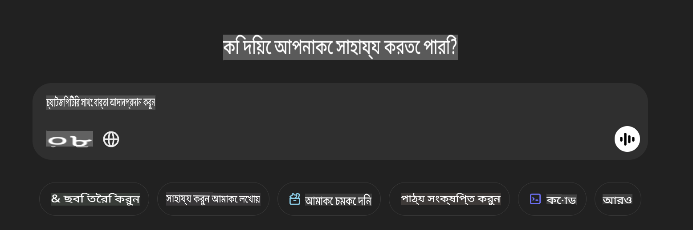

## **Phi-4-multimodal ব্যবহার করে ছবি পড়া এবং কোড তৈরি করা**

Phi-4-multimodal-এর শক্তিশালী ছবি পড়ার ক্ষমতা রয়েছে। চলুন পাইথন ব্যবহার করে নিম্নলিখিত ফাংশনগুলো বাস্তবায়ন করি। ছবিটি একটি ChatGPT পৃষ্ঠা। 



### **নমুনা কোড**


```python

import requests
import torch
from PIL import Image
import soundfile
from transformers import AutoModelForCausalLM, AutoProcessor, GenerationConfig,pipeline,AutoTokenizer

model_path = 'Your Phi-4-multimodal location'

kwargs = {}
kwargs['torch_dtype'] = torch.bfloat16

processor = AutoProcessor.from_pretrained(model_path, trust_remote_code=True)

model = AutoModelForCausalLM.from_pretrained(
    model_path,
    trust_remote_code=True,
    torch_dtype='auto',
    _attn_implementation='flash_attention_2',
).cuda()

generation_config = GenerationConfig.from_pretrained(model_path, 'generation_config.json')

user_prompt = '<|user|>'
assistant_prompt = '<|assistant|>'
prompt_suffix = '<|end|>'

prompt = f'{user_prompt}Can you generate HTML + JS code about this image <|image_1|> ? Please step by step {prompt_suffix}{assistant_prompt}'

image = Image.open("./demo.png")

inputs = processor(text=prompt, images=[image], return_tensors='pt').to('cuda:0')

generate_ids = model.generate(
    **inputs,
    max_new_tokens=4096,
    generation_config=generation_config,
)

generate_ids = generate_ids[:, inputs['input_ids'].shape[1] :]

response = processor.batch_decode(
    generate_ids, skip_special_tokens=True, clean_up_tokenization_spaces=False
)[0]

print(response)

```

**অস্বীকৃতি**:  
এই নথিটি মেশিন-ভিত্তিক এআই অনুবাদ পরিষেবা ব্যবহার করে অনুবাদ করা হয়েছে। আমরা যথাসাধ্য সঠিকতার জন্য চেষ্টা করি, তবে অনুগ্রহ করে মনে রাখবেন যে স্বয়ংক্রিয় অনুবাদে ত্রুটি বা অসঙ্গতি থাকতে পারে। নথিটির মূল ভাষায় থাকা আসল সংস্করণটিকে প্রামাণিক উৎস হিসেবে বিবেচনা করা উচিত। গুরুত্বপূর্ণ তথ্যের জন্য, পেশাদার মানব অনুবাদ সুপারিশ করা হয়। এই অনুবাদ ব্যবহারের ফলে সৃষ্ট কোনো ভুল বোঝাবুঝি বা ভুল ব্যাখ্যার জন্য আমরা দায়ী নই।