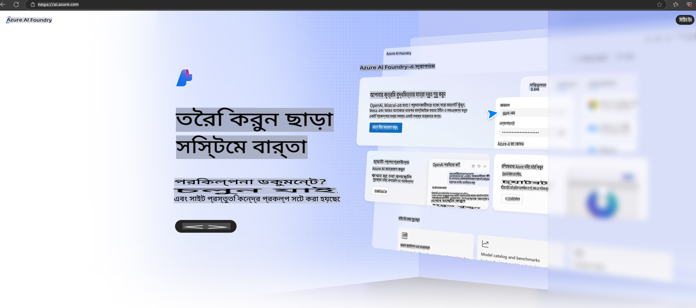

# **Azure AI Foundry-তে Phi-3 ব্যবহার করা**

জেনারেটিভ এআই-এর উন্নয়নের সাথে সাথে আমরা একটি統 platform ব্যবহার করতে চাই যা বিভিন্ন LLM এবং SLM, এন্টারপ্রাইজ ডেটা ইন্টিগ্রেশন, ফাইন-টিউনিং/RAG অপারেশন এবং LLM এবং SLM একত্রিত করার পরে বিভিন্ন এন্টারপ্রাইজ ব্যবসার মূল্যায়ন ইত্যাদি পরিচালনা করতে সক্ষম করে। এতে করে জেনারেটিভ এআই-ভিত্তিক স্মার্ট অ্যাপ্লিকেশনগুলি আরও কার্যকরভাবে বাস্তবায়িত হয়। [Azure AI Foundry](https://ai.azure.com) একটি এন্টারপ্রাইজ-লেভেলের জেনারেটিভ এআই অ্যাপ্লিকেশন প্ল্যাটফর্ম।

Azure AI Foundry-এর মাধ্যমে আপনি বড় ভাষার মডেলের (LLM) প্রতিক্রিয়াগুলির মূল্যায়ন করতে পারেন এবং প্রম্পট ফ্লো ব্যবহার করে প্রম্পট অ্যাপ্লিকেশন উপাদানগুলিকে সমন্বিত করতে পারেন, যাতে আরও ভালো পারফরম্যান্স নিশ্চিত হয়। এই প্ল্যাটফর্মটি প্রুফ অফ কনসেপ্ট থেকে পূর্ণাঙ্গ প্রোডাকশনে রূপান্তরের জন্য স্কেলিং সহজতর করে। ধারাবাহিক পর্যবেক্ষণ এবং পরিমার্জন দীর্ঘমেয়াদী সাফল্যকে সমর্থন করে।

আমরা সহজ কিছু ধাপ অনুসরণ করে Azure AI Foundry-তে Phi-3 মডেল দ্রুত ডিপ্লয় করতে পারি এবং তারপর Azure AI Foundry ব্যবহার করে Phi-3 সম্পর্কিত Playground/Chat, ফাইন-টিউনিং, মূল্যায়ন এবং অন্যান্য কাজ সম্পন্ন করতে পারি।

## **১. প্রস্তুতি**

যদি আপনার মেশিনে ইতিমধ্যে [Azure Developer CLI](https://learn.microsoft.com/azure/developer/azure-developer-cli/overview?WT.mc_id=aiml-138114-kinfeylo) ইনস্টল করা থাকে, তবে নতুন ডিরেক্টরিতে এই কমান্ডটি চালানো খুব সহজেই এই টেমপ্লেট ব্যবহার করা সম্ভব।

## ম্যানুয়াল ক্রিয়েশন

Microsoft Azure AI Foundry প্রকল্প এবং হাব তৈরি করা আপনার এআই কাজগুলো সংগঠিত এবং পরিচালনা করার একটি চমৎকার উপায়। শুরু করার জন্য নিচের ধাপে ধাপে নির্দেশনাগুলি অনুসরণ করুন:

### Azure AI Foundry-তে একটি প্রকল্প তৈরি করা

1. **Azure AI Foundry-তে যান**: Azure AI Foundry পোর্টালে সাইন ইন করুন।
2. **একটি প্রকল্প তৈরি করুন**:
   - যদি আপনি কোনো প্রকল্পে থাকেন, তাহলে পৃষ্ঠার উপরের বাম কোণে "Azure AI Foundry" নির্বাচন করে হোম পৃষ্ঠায় যান।
   - "+ Create project" নির্বাচন করুন।
   - প্রকল্পটির জন্য একটি নাম লিখুন।
   - যদি আপনার একটি হাব থাকে, এটি ডিফল্ট হিসেবে নির্বাচিত হবে। যদি আপনার একাধিক হাবে অ্যাক্সেস থাকে, আপনি ড্রপডাউন থেকে অন্যটি নির্বাচন করতে পারেন। যদি আপনি একটি নতুন হাব তৈরি করতে চান, "Create new hub" নির্বাচন করুন এবং একটি নাম সরবরাহ করুন।
   - "Create" নির্বাচন করুন।

### Azure AI Foundry-তে একটি হাব তৈরি করা

1. **Azure AI Foundry-তে যান**: আপনার Azure অ্যাকাউন্ট দিয়ে সাইন ইন করুন।
2. **একটি হাব তৈরি করুন**:
   - বাম মেনু থেকে ম্যানেজমেন্ট সেন্টার নির্বাচন করুন।
   - "All resources" নির্বাচন করুন, তারপর "+ New project"-এর পাশে ডাউন অ্যারো নির্বাচন করুন এবং "+ New hub" নির্বাচন করুন।
   - "Create a new hub" ডায়ালগে আপনার হাবের জন্য একটি নাম লিখুন (যেমন contoso-hub) এবং অন্যান্য ক্ষেত্রগুলি প্রয়োজনমতো পরিবর্তন করুন।
   - "Next" নির্বাচন করুন, তথ্য পর্যালোচনা করুন, এবং তারপর "Create" নির্বাচন করুন।

বিস্তারিত নির্দেশনার জন্য, আপনি অফিসিয়াল [Microsoft ডকুমেন্টেশন](https://learn.microsoft.com/azure/ai-studio/how-to/create-projects) দেখতে পারেন।

সফলভাবে তৈরি হওয়ার পর, আপনি [ai.azure.com](https://ai.azure.com/) এর মাধ্যমে আপনার তৈরি স্টুডিওতে অ্যাক্সেস করতে পারেন।

একটি AI Foundry-তে একাধিক প্রকল্প থাকতে পারে। AI Foundry-তে একটি প্রকল্প তৈরি করুন প্রস্তুতির জন্য।

Azure AI Foundry [QuickStarts](https://learn.microsoft.com/azure/ai-studio/quickstarts/get-started-code) তৈরি করুন।

## **২. Azure AI Foundry-তে Phi মডেল ডিপ্লয় করুন**

প্রকল্পের Explore অপশন ক্লিক করুন, Model Catalog-এ প্রবেশ করুন এবং Phi-3 নির্বাচন করুন।

Phi-3-mini-4k-instruct নির্বাচন করুন।

Phi-3-mini-4k-instruct মডেলটি ডিপ্লয় করতে 'Deploy' ক্লিক করুন।

> [!NOTE]
>
> ডিপ্লয় করার সময় আপনি কম্পিউটিং ক্ষমতা নির্বাচন করতে পারবেন।

## **৩. Azure AI Foundry-তে Playground Chat Phi**

ডিপ্লয়মেন্ট পৃষ্ঠায় যান, Playground নির্বাচন করুন এবং Azure AI Foundry-এর Phi-3 এর সাথে চ্যাট করুন।

## **৪. Azure AI Foundry থেকে মডেল ডিপ্লয় করা**

Azure Model Catalog থেকে একটি মডেল ডিপ্লয় করতে, আপনি নিচের ধাপগুলি অনুসরণ করতে পারেন:

- Azure AI Foundry-তে সাইন ইন করুন।
- Azure AI Foundry মডেল ক্যাটালগ থেকে আপনি যে মডেলটি ডিপ্লয় করতে চান তা নির্বাচন করুন।
- মডেলের Details পৃষ্ঠায়, Deploy নির্বাচন করুন এবং তারপর Azure AI Content Safety সহ Serverless API নির্বাচন করুন।
- আপনি যে প্রকল্পে মডেল ডিপ্লয় করতে চান তা নির্বাচন করুন। Serverless API অফারটি ব্যবহার করতে, আপনার ওয়ার্কস্পেসটি East US 2 বা Sweden Central অঞ্চলে থাকতে হবে। আপনি ডিপ্লয়মেন্টের নাম কাস্টমাইজ করতে পারেন।
- ডিপ্লয়মেন্ট উইজার্ডে, Pricing and terms নির্বাচন করুন এবং ব্যবহারের শর্তাবলী ও মূল্য সম্পর্কে জানুন।
- Deploy নির্বাচন করুন। ডিপ্লয়মেন্ট প্রস্তুত হওয়া পর্যন্ত অপেক্ষা করুন এবং আপনি ডিপ্লয়মেন্ট পৃষ্ঠায় পুনঃনির্দেশিত হবেন।
- মডেলের সাথে ইন্টারঅ্যাক্ট করার জন্য Open in playground নির্বাচন করুন।
- আপনি ডিপ্লয়মেন্ট পৃষ্ঠায় ফিরে যেতে পারেন, ডিপ্লয়মেন্ট নির্বাচন করুন এবং ডিপ্লয়মেন্টের Target URL এবং Secret Key নোট করুন, যা আপনি ডিপ্লয়মেন্ট কল করতে এবং রেসপন্স জেনারেট করতে ব্যবহার করতে পারেন।
- আপনি সবসময় endpoint-এর বিস্তারিত, URL এবং অ্যাক্সেস কী Build ট্যাবে গিয়ে এবং Components সেকশনের Deployments নির্বাচন করে খুঁজে পেতে পারেন।

> [!NOTE]
> দয়া করে মনে রাখবেন, এই ধাপগুলি সম্পাদন করতে আপনার অ্যাকাউন্টে Resource Group-এর উপর Azure AI Developer ভূমিকার অনুমতি থাকতে হবে।

## **৫. Azure AI Foundry-তে Phi API ব্যবহার করা**

আপনি Postman GET ব্যবহার করে https://{Your project name}.region.inference.ml.azure.com/swagger.json অ্যাক্সেস করতে পারেন এবং Key এর সাথে এটি মিলিয়ে প্রদত্ত ইন্টারফেসগুলি সম্পর্কে জানতে পারেন।

আপনি খুব সহজেই রিকোয়েস্ট প্যারামিটার এবং রেসপন্স প্যারামিটার পেতে পারেন।

**অস্বীকৃতি**:  
এই নথিটি মেশিন-ভিত্তিক এআই অনুবাদ সেবার মাধ্যমে অনুবাদ করা হয়েছে। আমরা যথাসাধ্য সঠিকতার জন্য চেষ্টা করি, তবে দয়া করে মনে রাখবেন যে স্বয়ংক্রিয় অনুবাদে ত্রুটি বা অসঙ্গতি থাকতে পারে। মূল ভাষায় থাকা নথিটিকে প্রামাণিক উৎস হিসেবে বিবেচনা করা উচিত। গুরুত্বপূর্ণ তথ্যের জন্য, পেশাদার মানব অনুবাদ গ্রহণ করার পরামর্শ দেওয়া হয়। এই অনুবাদের ব্যবহারের ফলে কোনো ভুল বোঝাবুঝি বা ভুল ব্যাখ্যা হলে আমরা দায়ী থাকব না।