# Azure AI Foundry ব্যবহার করে Phi-3 ফাইন-টিউনিং

আসুন Microsoft-এর Phi-3 Mini ভাষা মডেল Azure AI Foundry ব্যবহার করে কীভাবে ফাইন-টিউন করা যায় তা অন্বেষণ করি। ফাইন-টিউনিং Phi-3 Mini-কে নির্দিষ্ট কাজের জন্য অভিযোজিত করতে সাহায্য করে, যা এটিকে আরও শক্তিশালী এবং প্রসঙ্গ সচেতন করে তোলে।

## বিবেচনাগুলো

- **ক্ষমতা:** কোন মডেলগুলো ফাইন-টিউন করা যায়? বেস মডেল কী কী কাজের জন্য ফাইন-টিউন করা যেতে পারে?
- **খরচ:** ফাইন-টিউনিং-এর জন্য মূল্য নির্ধারণের মডেল কী?
- **কাস্টমাইজযোগ্যতা:** বেস মডেল কতটা এবং কীভাবে পরিবর্তন করা যাবে?
- **সুবিধা:** ফাইন-টিউনিং কীভাবে ঘটে – কি আমাকে কাস্টম কোড লিখতে হবে? নিজস্ব কম্পিউট আনতে হবে?
- **নিরাপত্তা:** ফাইন-টিউন করা মডেলগুলোর নিরাপত্তা ঝুঁকি থাকে – অনিচ্ছাকৃত ক্ষতি প্রতিরোধে কি কোনও সুরক্ষা ব্যবস্থা আছে?

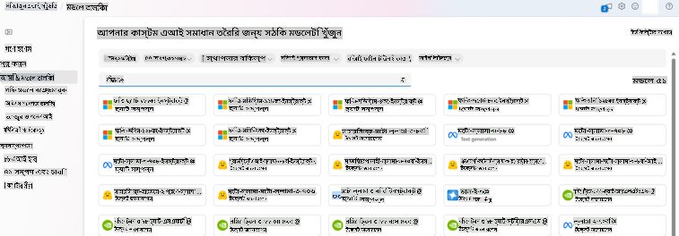

## ফাইন-টিউনিং-এর প্রস্তুতি

### প্রয়োজনীয় শর্তাবলী

> [!NOTE]
> Phi-3 পরিবারের মডেলের জন্য, পে-অ্যাজ-ইউ-গো মডেলের ফাইন-টিউন পরিষেবা শুধুমাত্র **East US 2** অঞ্চলে তৈরি হাবগুলোর জন্য উপলব্ধ।

- একটি Azure সাবস্ক্রিপশন। যদি আপনার কাছে Azure সাবস্ক্রিপশন না থাকে, তাহলে [পেইড Azure অ্যাকাউন্ট](https://azure.microsoft.com/pricing/purchase-options/pay-as-you-go) তৈরি করুন।

- একটি [AI Foundry প্রজেক্ট](https://ai.azure.com?WT.mc_id=aiml-138114-kinfeylo)।
- Azure রোল-বেসড অ্যাক্সেস কন্ট্রোলস (Azure RBAC) ব্যবহার করে Azure AI Foundry-তে অপারেশনের জন্য অ্যাক্সেস প্রদান করা হয়। এই নিবন্ধের ধাপগুলো সম্পাদন করতে, আপনার ব্যবহারকারী অ্যাকাউন্টে **Azure AI Developer role** অ্যাসাইন করা থাকতে হবে।

### সাবস্ক্রিপশন প্রোভাইডার নিবন্ধন

সাবস্ক্রিপশনটি `Microsoft.Network` রিসোর্স প্রোভাইডারের জন্য নিবন্ধিত কিনা তা নিশ্চিত করুন।

1. [Azure পোর্টাল](https://portal.azure.com)-এ সাইন ইন করুন।
1. বাম মেনু থেকে **Subscriptions** নির্বাচন করুন।
1. আপনি যে সাবস্ক্রিপশনটি ব্যবহার করতে চান তা নির্বাচন করুন।
1. বাম মেনু থেকে **AI project settings** > **Resource providers** নির্বাচন করুন।
1. নিশ্চিত করুন যে **Microsoft.Network** রিসোর্স প্রোভাইডার তালিকায় আছে। না থাকলে এটি যোগ করুন।

### ডেটা প্রস্তুতি

আপনার মডেল ফাইন-টিউন করার জন্য ট্রেনিং এবং ভ্যালিডেশন ডেটা প্রস্তুত করুন। আপনার ট্রেনিং এবং ভ্যালিডেশন ডেটাসেট ইনপুট এবং আউটপুট উদাহরণ নিয়ে গঠিত যা আপনি চান মডেলটি কীভাবে কাজ করবে।

নিশ্চিত করুন যে সমস্ত ট্রেনিং উদাহরণ ইনফারেন্সের প্রত্যাশিত ফরম্যাট অনুসরণ করে। মডেলগুলো কার্যকরভাবে ফাইন-টিউন করতে, একটি ভারসাম্যপূর্ণ এবং বৈচিত্র্যময় ডেটাসেট নিশ্চিত করুন।

এটি ডেটার ভারসাম্য বজায় রাখা, বিভিন্ন পরিস্থিতি অন্তর্ভুক্ত করা, এবং সময়ে সময়ে বাস্তব-বিশ্বের প্রত্যাশার সাথে সঙ্গতিপূর্ণ করতে ডেটা পরিমার্জন করার মাধ্যমে সম্পন্ন হয়, যা শেষ পর্যন্ত আরও সঠিক এবং ভারসাম্যপূর্ণ মডেল প্রতিক্রিয়ার দিকে পরিচালিত করে।

বিভিন্ন মডেল টাইপের জন্য ট্রেনিং ডেটার ভিন্ন ফরম্যাট প্রয়োজন।

### চ্যাট কমপ্লিশন

আপনার ট্রেনিং এবং ভ্যালিডেশন ডেটা অবশ্যই JSON Lines (JSONL) ডকুমেন্ট হিসেবে ফরম্যাট করা **প্রয়োজন**। `Phi-3-mini-128k-instruct` ফাইন-টিউনিং ডেটাসেট চ্যাট কমপ্লিশন API দ্বারা ব্যবহৃত কথোপকথনের ফরম্যাটে ফরম্যাট করা থাকতে হবে।

### উদাহরণ ফাইল ফরম্যাট

```json
    {"messages": [{"role": "system", "content": "You are an Xbox customer support agent whose primary goal is to help users with issues they are experiencing with their Xbox devices. You are friendly and concise. You only provide factual answers to queries, and do not provide answers that are not related to Xbox."}, {"role": "user", "content": "Is Xbox better than PlayStation?"}, {"role": "assistant", "content": "I apologize, but I cannot provide personal opinions. My primary job is to assist you with any issues related to your Xbox device. Do you have any Xbox-related issues that need addressing?"}]}
    {"messages": [{"role": "system", "content": "You are an Xbox customer support agent whose primary goal is to help users with issues they are experiencing with their Xbox devices. You are friendly and concise. You only provide factual answers to queries, and do not provide answers that are not related to Xbox."}, {"role": "user", "content": "Can I play PC games on my Xbox?"}, {"role": "assistant", "content": "While Xbox consoles don't natively support PC games, they can play an array of Xbox games, many of which are also available on PC. Can I assist you with finding games compatible with your Xbox device?"}]}
    {"messages": [{"role": "system", "content": "You are an Xbox customer support agent whose primary goal is to help users with issues they are experiencing with their Xbox devices. You are friendly and concise. You only provide factual answers to queries, and do not provide answers that are not related to Xbox."}, {"role": "user", "content": "I'm having trouble connecting my Xbox to the Wi-Fi."}, {"role": "assistant", "content": "No worries, let's go through the network settings on your Xbox. Can you please tell me what happens when you try to connect it to the Wi-Fi?"}]}
```

সমর্থিত ফাইল টাইপ হলো JSON Lines। ফাইলগুলো ডিফল্ট ডেটাস্টোরে আপলোড করা হয় এবং আপনার প্রজেক্টে উপলব্ধ করা হয়।

## Azure AI Foundry ব্যবহার করে Phi-3 ফাইন-টিউনিং

Azure AI Foundry বড় ভাষা মডেলগুলোকে ফাইন-টিউনিং প্রক্রিয়ার মাধ্যমে ব্যক্তিগত ডেটাসেটের সাথে মানিয়ে নিতে দেয়। ফাইন-টিউনিং নির্দিষ্ট কাজ এবং অ্যাপ্লিকেশনের জন্য কাস্টমাইজেশন এবং অপ্টিমাইজেশনের মাধ্যমে উল্লেখযোগ্য মূল্য প্রদান করে। এটি উন্নত কর্মক্ষমতা, খরচ দক্ষতা, কম লেটেন্সি এবং কাস্টমাইজড আউটপুট প্রদান করে।

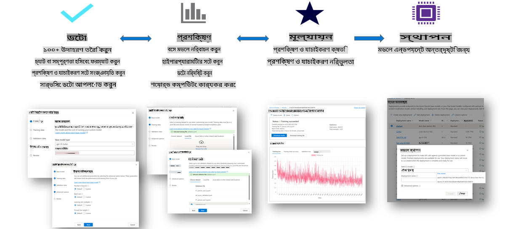

### নতুন প্রজেক্ট তৈরি করুন

1. [Azure AI Foundry](https://ai.azure.com)-এ সাইন ইন করুন।

1. **+New project** নির্বাচন করে Azure AI Foundry-তে একটি নতুন প্রজেক্ট তৈরি করুন।

    

1. নিম্নলিখিত কাজগুলো সম্পাদন করুন:

    - প্রজেক্টের **Hub name**। এটি একটি ইউনিক মান হতে হবে।
    - ব্যবহারের জন্য **Hub** নির্বাচন করুন (প্রয়োজনে একটি নতুন তৈরি করুন)।

    

1. একটি নতুন হাব তৈরি করতে নিম্নলিখিত কাজগুলো সম্পাদন করুন:

    - **Hub name** লিখুন। এটি একটি ইউনিক মান হতে হবে।
    - আপনার Azure **Subscription** নির্বাচন করুন।
    - ব্যবহারের জন্য **Resource group** নির্বাচন করুন (প্রয়োজনে একটি নতুন তৈরি করুন)।
    - আপনার পছন্দের **Location** নির্বাচন করুন।
    - ব্যবহারের জন্য **Connect Azure AI Services** নির্বাচন করুন (প্রয়োজনে একটি নতুন তৈরি করুন)।
    - **Connect Azure AI Search**-এ **Skip connecting** নির্বাচন করুন।

    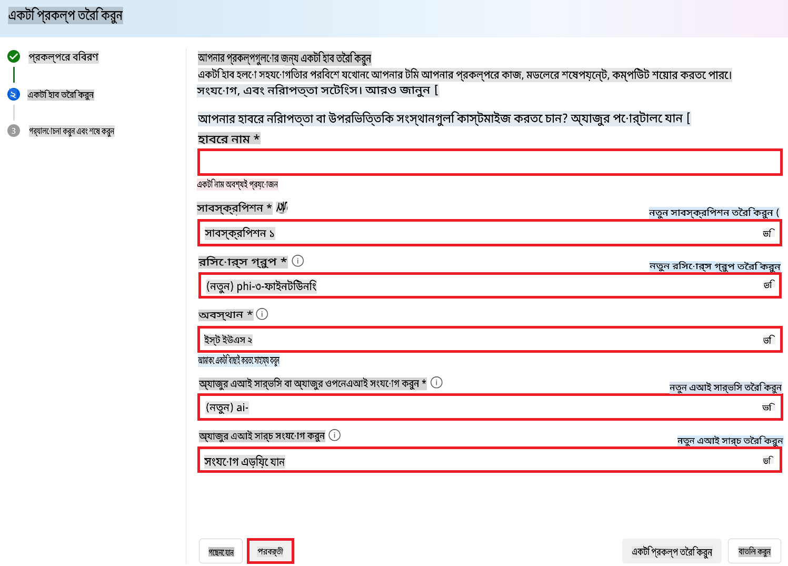

1. **Next** নির্বাচন করুন।
1. **Create a project** নির্বাচন করুন।

### ডেটা প্রস্তুতি

ফাইন-টিউনিংয়ের আগে আপনার কাজের সাথে সম্পর্কিত একটি ডেটাসেট সংগ্রহ বা তৈরি করুন, যেমন চ্যাট নির্দেশনা, প্রশ্নোত্তর জোড়া, বা অন্য কোনো প্রাসঙ্গিক টেক্সট ডেটা। এই ডেটা পরিষ্কার এবং প্রি-প্রসেস করুন, যেমন শব্দের অপ্রয়োজনীয় অংশ সরানো, মিসিং ভ্যালু হ্যান্ডেল করা এবং টোকেনাইজ করা।

### Azure AI Foundry-তে Phi-3 মডেল ফাইন-টিউন করুন

> [!NOTE]
> Phi-3 মডেলের ফাইন-টিউনিং বর্তমানে শুধুমাত্র East US 2-এ অবস্থিত প্রজেক্টগুলোর জন্য সমর্থিত।

1. বাম পাশের ট্যাব থেকে **Model catalog** নির্বাচন করুন।

1. **search bar**-এ *phi-3* টাইপ করুন এবং আপনার ব্যবহারের জন্য phi-3 মডেল নির্বাচন করুন।

    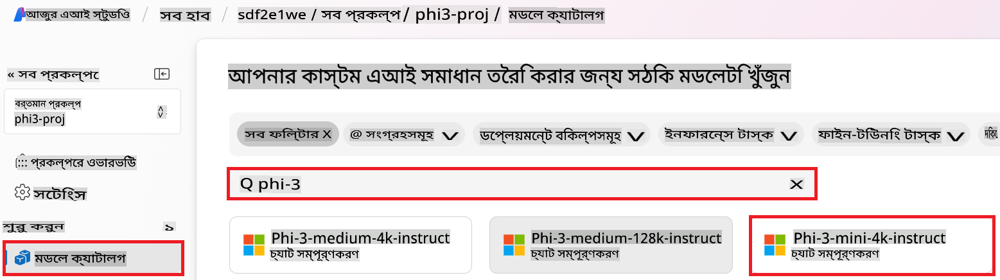

1. **Fine-tune** নির্বাচন করুন।

    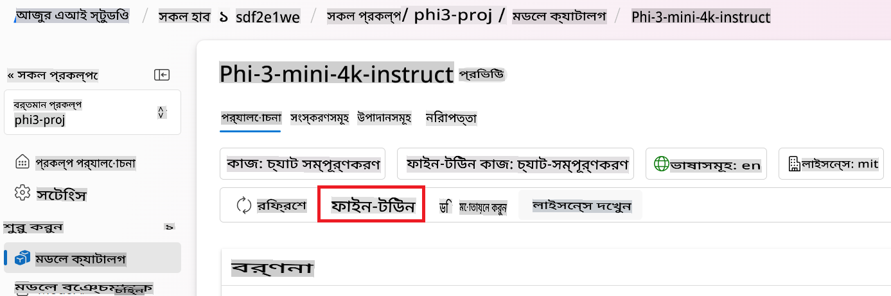

1. **Fine-tuned model name** লিখুন।

    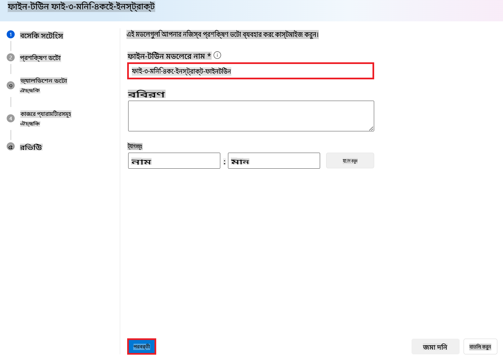

1. **Next** নির্বাচন করুন।

1. নিম্নলিখিত কাজগুলো সম্পাদন করুন:

    - **task type**-এ **Chat completion** নির্বাচন করুন।
    - আপনার ব্যবহারের জন্য **Training data** নির্বাচন করুন। এটি Azure AI Foundry-এর ডেটার মাধ্যমে বা আপনার স্থানীয় পরিবেশ থেকে আপলোড করতে পারেন।

    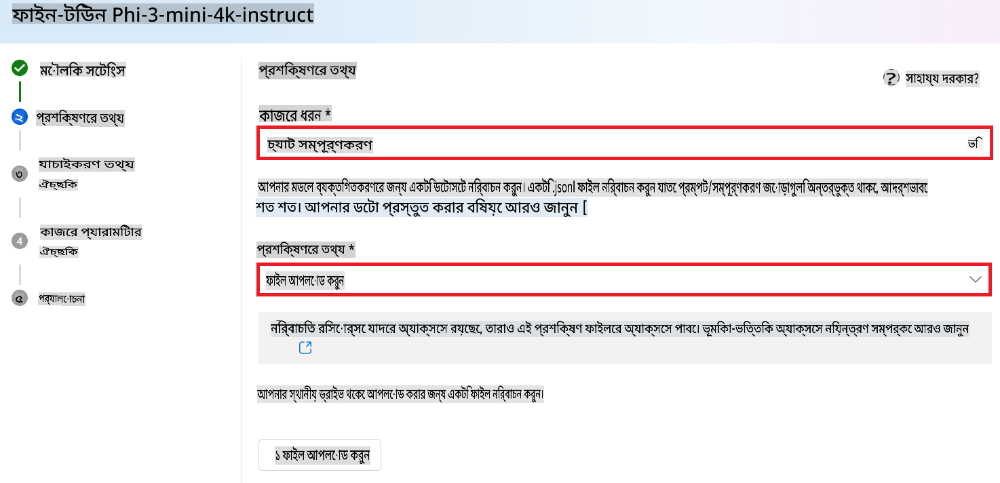

1. **Next** নির্বাচন করুন।

1. ব্যবহারের জন্য **Validation data** আপলোড করুন অথবা **Automatic split of training data** নির্বাচন করুন।

    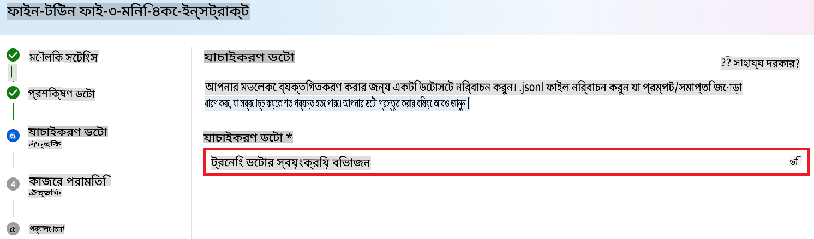

1. **Next** নির্বাচন করুন।

1. নিম্নলিখিত কাজগুলো সম্পাদন করুন:

    - **Batch size multiplier** নির্বাচন করুন।
    - **Learning rate** নির্বাচন করুন।
    - **Epochs** নির্বাচন করুন।

    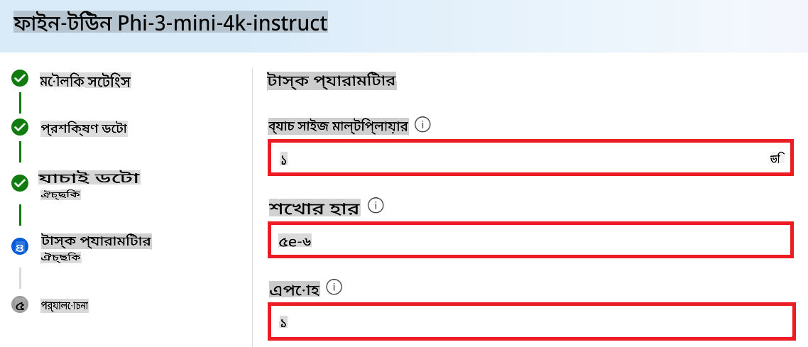

1. ফাইন-টিউনিং প্রক্রিয়া শুরু করতে **Submit** নির্বাচন করুন।

    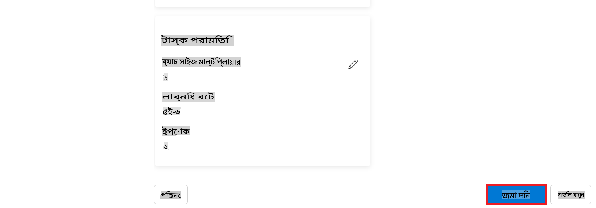

1. একবার আপনার মডেল ফাইন-টিউন হয়ে গেলে, স্ট্যাটাস **Completed** হিসেবে প্রদর্শিত হবে, যেমনটি নিচের ছবিতে দেখানো হয়েছে। এখন আপনি মডেলটি ডেপ্লয় করতে পারেন এবং এটি আপনার নিজস্ব অ্যাপ্লিকেশনে, প্লেগ্রাউন্ডে, অথবা প্রম্পট ফ্লোতে ব্যবহার করতে পারেন। আরও তথ্যের জন্য, [Azure AI Foundry দিয়ে Phi-3 পরিবারের ছোট ভাষা মডেল ডেপ্লয় করার পদ্ধতি](https://learn.microsoft.com/azure/ai-studio/how-to/deploy-models-phi-3?tabs=phi-3-5&pivots=programming-language-python) দেখুন।

    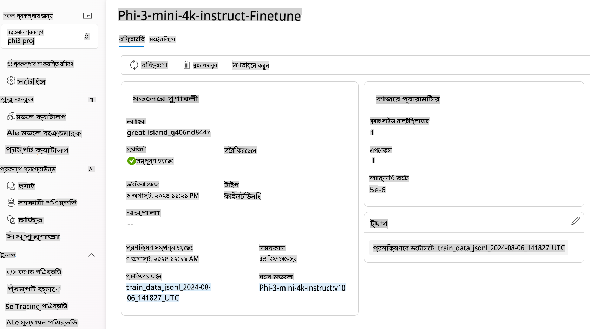

> [!NOTE]
> Phi-3 ফাইন-টিউনিং সম্পর্কে আরও বিস্তারিত তথ্যের জন্য, [Azure AI Foundry-তে Phi-3 মডেল ফাইন-টিউনিং](https://learn.microsoft.com/azure/ai-studio/how-to/fine-tune-phi-3?tabs=phi-3-mini) দেখুন।

## আপনার ফাইন-টিউন করা মডেল পরিষ্কার করা

আপনার ফাইন-টিউন করা মডেল [Azure AI Foundry](https://ai.azure.com) থেকে ফাইন-টিউনিং মডেল তালিকা বা মডেলের বিস্তারিত পৃষ্ঠায় মুছে ফেলতে পারেন। ফাইন-টিউনিং পৃষ্ঠা থেকে মুছে ফেলতে চান এমন মডেল নির্বাচন করুন এবং তারপর ডিলিট বোতাম নির্বাচন করুন।

> [!NOTE]
> যদি কোনও কাস্টম মডেলের বিদ্যমান ডেপ্লয়মেন্ট থাকে, তাহলে আপনি সেটি মুছতে পারবেন না। আপনাকে প্রথমে আপনার মডেল ডেপ্লয়মেন্ট মুছে ফেলতে হবে, তারপর আপনার কাস্টম মডেল মুছতে পারবেন।

## খরচ এবং কোটাসমূহ

### Phi-3 মডেলগুলোর জন্য ফাইন-টিউনিং সংক্রান্ত খরচ এবং কোটার বিবেচনা

Phi মডেলগুলোকে ফাইন-টিউনিং পরিষেবা হিসেবে Microsoft দ্বারা প্রস্তাব করা হয় এবং Azure AI Foundry-তে ব্যবহারের জন্য ইন্টিগ্রেট করা হয়েছে। আপনি মডেলগুলো ডেপ্লয় বা ফাইন-টিউন করার সময় ডেপ্লয়মেন্ট উইজার্ডের Pricing and terms ট্যাবে মূল্য দেখতে পাবেন।

## কনটেন্ট ফিল্টারিং

পে-অ্যাজ-ইউ-গো হিসেবে পরিষেবায় ডেপ্লয় করা মডেলগুলো Azure AI কনটেন্ট সেফটির দ্বারা সুরক্ষিত। রিয়েল-টাইম এন্ডপয়েন্টে ডেপ্লয় করার সময় আপনি এই ক্ষমতা থেকে বেরিয়ে যেতে পারেন। Azure AI কনটেন্ট সেফটি সক্ষম থাকলে, প্রম্পট এবং কমপ্লিশন উভয়ই ক্ষতিকারক কনটেন্ট সনাক্ত এবং প্রতিরোধ করার জন্য একটি ক্লাসিফিকেশন মডেলের মাধ্যমে যায়। ইনপুট প্রম্পট এবং আউটপুট কমপ্লিশনের উভয় ক্ষেত্রেই সম্ভাব্য ক্ষতিকারক কনটেন্ট সনাক্ত এবং প্রতিরোধে কনটেন্ট ফিল্টারিং সিস্টেম ব্যবস্থা গ্রহণ করে। আরও জানুন [Azure AI কনটেন্ট সেফটি](https://learn.microsoft.com/azure/ai-studio/concepts/content-filtering) সম্পর্কে।

**ফাইন-টিউনিং কনফিগারেশন**

হাইপারপ্যারামিটার: লার্নিং রেট, ব্যাচ সাইজ, এবং ট্রেনিং এপোকসের মতো হাইপারপ্যারামিটার নির্ধারণ করুন।

**লস ফাংশন**

আপনার কাজের জন্য উপযুক্ত লস ফাংশন (যেমন, ক্রস-এন্ট্রপি) নির্বাচন করুন।

**অপটিমাইজার**

ট্রেনিং চলাকালীন গ্রেডিয়েন্ট আপডেটের জন্য একটি অপটিমাইজার (যেমন, Adam) নির্বাচন করুন।

**ফাইন-টিউনিং প্রক্রিয়া**

- প্রি-ট্রেইন্ড মডেল লোড করুন: Phi-3 Mini চেকপয়েন্ট লোড করুন।
- কাস্টম লেয়ার যোগ করুন: কাজ-নির্দিষ্ট লেয়ার (যেমন, চ্যাট নির্দেশনার জন্য ক্লাসিফিকেশন হেড) যোগ করুন।

**মডেল ট্রেন করুন**
আপনার প্রস্তুত ডেটাসেট ব্যবহার করে মডেলটি ফাইন-টিউন করুন। ট্রেনিং অগ্রগতি পর্যবেক্ষণ করুন এবং প্রয়োজন অনুযায়ী হাইপারপ্যারামিটার সামঞ্জস্য করুন।

**মূল্যায়ন এবং যাচাই**

ভ্যালিডেশন সেট: আপনার ডেটাকে ট্রেনিং এবং ভ্যালিডেশন সেটে ভাগ করুন।

**পারফরম্যান্স মূল্যায়ন করুন**

সঠিকতা, F1-স্কোর, বা পারপ্লেক্সিটির মতো মেট্রিক ব্যবহার করে মডেলের পারফরম্যান্স মূল্যায়ন করুন।

## ফাইন-টিউন করা মডেল সংরক্ষণ

**চেকপয়েন্ট**
ভবিষ্যতে ব্যবহারের জন্য ফাইন-টিউন করা মডেলের চেকপয়েন্ট সংরক্ষণ করুন।

## ডেপ্লয়মেন্ট

- ওয়েব সার্ভিস হিসেবে ডেপ্লয় করুন: Azure AI Foundry-তে আপনার ফাইন-টিউন করা মডেল একটি ওয়েব সার্ভিস হিসেবে ডেপ্লয় করুন।
- এন্ডপয়েন্ট পরীক্ষা করুন: ডেপ্লয় করা এন্ডপয়েন্টে টেস্ট কোয়েরি পাঠিয়ে এর কার্যকারিতা যাচাই করুন।

## পুনরাবৃত্তি এবং উন্নতি

পুনরাবৃত্তি: যদি পারফরম্যান্স সন্তোষজনক না হয়, তবে হাইপারপ্যারামিটার সামঞ্জস্য, আরও ডেটা যোগ, বা অতিরিক্ত এপোকসের জন্য ফাইন-টিউনিং করে পুনরাবৃত্তি করুন।

## পর্যবেক্ষণ এবং পরিমার্জন

মডেলের আচরণ নিয়মিত পর্যবেক্ষণ করুন এবং প্রয়োজন অনুযায়ী পরিমার্জন করুন।

## কাস্টমাইজ এবং সম্প্রসারণ

কাস্টম কাজ: Phi-3 Mini চ্যাট নির্দেশনার বাইরেও বিভিন্ন কাজের জন্য ফাইন-টিউন করা যেতে পারে। অন্যান্য ব্যবহার ক্ষেত্র অন্বেষণ করুন!
পরীক্ষা: পারফরম্যান্স উন্নত করতে বিভিন্ন আর্কিটেকচার, লেয়ার কম্বিনেশন এবং কৌশল চেষ্টা করুন।

> [!NOTE]
> ফাইন-টিউনিং একটি পুনরাবৃত্তিমূলক প্রক্রিয়া। পরীক্ষা করুন, শিখুন, এবং আপনার নির্দিষ্ট কাজের জন্য সেরা ফলাফল অর্জনে মডেলটি মানিয়ে নিন!

**অস্বীকৃতি**:  
এই নথিটি মেশিন-ভিত্তিক এআই অনুবাদ পরিষেবা ব্যবহার করে অনুবাদ করা হয়েছে। আমরা যথাসাধ্য সঠিকতা বজায় রাখার চেষ্টা করি, তবে অনুগ্রহ করে জেনে রাখুন যে স্বয়ংক্রিয় অনুবাদে ভুল বা অসঙ্গতি থাকতে পারে। মূল ভাষায় থাকা নথিটিকে নির্ভরযোগ্য উৎস হিসেবে বিবেচনা করা উচিত। গুরুত্বপূর্ণ তথ্যের জন্য পেশাদার মানব অনুবাদ ব্যবহার করার পরামর্শ দেওয়া হয়। এই অনুবাদ ব্যবহারের ফলে কোনো ভুল বোঝাবুঝি বা ভুল ব্যাখ্যার জন্য আমরা দায়ী নই। 