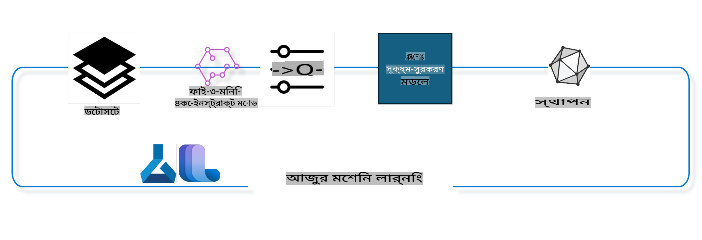

## কীভাবে Azure ML সিস্টেম রেজিস্ট্রির চ্যাট-কমপ্লিশন কম্পোনেন্ট ব্যবহার করে একটি মডেল ফাইন টিউন করবেন

এই উদাহরণে আমরা Phi-3-mini-4k-instruct মডেলটি ফাইন টিউন করব যাতে এটি ultrachat_200k ডেটাসেট ব্যবহার করে দুটি ব্যক্তির মধ্যে একটি কথোপকথন সম্পূর্ণ করতে পারে।



এই উদাহরণটি আপনাকে দেখাবে কীভাবে Azure ML SDK এবং Python ব্যবহার করে ফাইন টিউন করতে হয় এবং তারপর ফাইন টিউন করা মডেলটি একটি অনলাইন এন্ডপয়েন্টে রিয়েল টাইম ইনফারেন্সের জন্য ডিপ্লয় করতে হয়।

### ট্রেনিং ডেটা

আমরা ultrachat_200k ডেটাসেট ব্যবহার করব। এটি UltraChat ডেটাসেটের একটি ভালোভাবে ফিল্টার করা সংস্করণ এবং এটি Zephyr-7B-β, একটি অত্যাধুনিক 7b চ্যাট মডেল, ট্রেন করার জন্য ব্যবহৃত হয়েছিল।

### মডেল

আমরা Phi-3-mini-4k-instruct মডেলটি ব্যবহার করব যাতে ব্যবহারকারী চ্যাট-কমপ্লিশন কাজের জন্য মডেলটি ফাইন টিউন করতে পারেন। আপনি যদি নির্দিষ্ট একটি মডেল কার্ড থেকে এই নোটবুকটি খুলে থাকেন, তাহলে সেই মডেলের নাম প্রতিস্থাপন করতে ভুলবেন না।

### কাজগুলো

- ফাইন টিউনের জন্য একটি মডেল নির্বাচন করুন।
- ট্রেনিং ডেটা নির্বাচন এবং এক্সপ্লোর করুন।
- ফাইন টিউন জব কনফিগার করুন।
- ফাইন টিউন জব চালান।
- ট্রেনিং এবং ইভালুয়েশন মেট্রিকস পর্যালোচনা করুন।
- ফাইন টিউন করা মডেল রেজিস্টার করুন।
- রিয়েল টাইম ইনফারেন্সের জন্য মডেল ডিপ্লয় করুন।
- রিসোর্স ক্লিন আপ করুন।

## ১. প্রি-রেকুইজিটস সেটআপ

- ডিপেন্ডেন্সি ইনস্টল করুন।
- AzureML Workspace-এ কানেক্ট করুন। SDK authentication সেট আপ সম্পর্কে আরও জানুন। নিচের <WORKSPACE_NAME>, <RESOURCE_GROUP>, এবং <SUBSCRIPTION_ID> প্রতিস্থাপন করুন।
- AzureML সিস্টেম রেজিস্ট্রিতে কানেক্ট করুন।
- একটি ঐচ্ছিক এক্সপেরিমেন্ট নাম সেট করুন।
- কম্পিউট চেক করুন বা তৈরি করুন।

> [!NOTE]
> একটি সিঙ্গেল GPU নোডে একাধিক GPU কার্ড থাকতে পারে। উদাহরণস্বরূপ, Standard_NC24rs_v3 এর একটি নোডে ৪টি NVIDIA V100 GPU থাকে, যেখানে Standard_NC12s_v3 এ ২টি NVIDIA V100 GPU থাকে। এই তথ্যের জন্য ডকুমেন্টেশন দেখুন। নোড প্রতি GPU কার্ডের সংখ্যা নিচের gpus_per_node প্যারামিটারে সেট করা হয়েছে। এই মানটি সঠিকভাবে সেট করা হলে নোডের সব GPU সম্পূর্ণরূপে ব্যবহার করা যাবে। প্রস্তাবিত GPU কম্পিউট SKUs এখানে এবং এখানে পাওয়া যাবে।

### পাইথন লাইব্রেরি

নিচের সেল চালিয়ে ডিপেন্ডেন্সি ইনস্টল করুন। নতুন পরিবেশে চালানোর ক্ষেত্রে এটি একটি আবশ্যক ধাপ।

```bash
pip install azure-ai-ml
pip install azure-identity
pip install datasets==2.9.0
pip install mlflow
pip install azureml-mlflow
```

### Azure ML এর সাথে ইন্টারঅ্যাক্ট করা

১. এই পাইথন স্ক্রিপ্টটি Azure Machine Learning (Azure ML) সার্ভিসের সাথে ইন্টারঅ্যাক্ট করতে ব্যবহৃত হয়। এটি কী করে তার একটি বিশ্লেষণ:

    - এটি azure.ai.ml, azure.identity, এবং azure.ai.ml.entities প্যাকেজ থেকে প্রয়োজনীয় মডিউল ইম্পোর্ট করে। এটি time মডিউলও ইম্পোর্ট করে।

    - এটি DefaultAzureCredential() ব্যবহার করে প্রমাণীকরণের চেষ্টা করে, যা Azure ক্লাউডে দ্রুত ডেভেলপমেন্ট শুরু করার জন্য একটি সহজ প্রমাণীকরণ অভিজ্ঞতা প্রদান করে। এটি ব্যর্থ হলে, এটি InteractiveBrowserCredential() এ ফিরে যায়, যা একটি ইন্টারঅ্যাক্টিভ লগইন প্রম্পট প্রদান করে।

    - এটি from_config মেথড ব্যবহার করে একটি MLClient ইনস্ট্যান্স তৈরি করার চেষ্টা করে, যা ডিফল্ট কনফিগ ফাইল (config.json) থেকে কনফিগারেশন পড়ে। এটি ব্যর্থ হলে, এটি subscription_id, resource_group_name, এবং workspace_name ম্যানুয়ালি প্রদান করে একটি MLClient ইনস্ট্যান্স তৈরি করে।

    - এটি "azureml" নামে Azure ML রেজিস্ট্রির জন্য আরেকটি MLClient ইনস্ট্যান্স তৈরি করে। এই রেজিস্ট্রিতে মডেল, ফাইন টিউন পাইপলাইন এবং এনভায়রনমেন্ট সংরক্ষণ করা হয়।

    - এটি experiment_name কে "chat_completion_Phi-3-mini-4k-instruct" সেট করে।

    - এটি একটি ইউনিক টাইমস্ট্যাম্প তৈরি করে যা বর্তমান সময়কে (সেকেন্ডে) একটি ইন্টিজার এবং তারপর একটি স্ট্রিং এ রূপান্তর করে। এই টাইমস্ট্যাম্প ইউনিক নাম এবং ভার্সন তৈরির জন্য ব্যবহার করা যেতে পারে।

    ```python
    # Import necessary modules from Azure ML and Azure Identity
    from azure.ai.ml import MLClient
    from azure.identity import (
        DefaultAzureCredential,
        InteractiveBrowserCredential,
    )
    from azure.ai.ml.entities import AmlCompute
    import time  # Import time module
    
    # Try to authenticate using DefaultAzureCredential
    try:
        credential = DefaultAzureCredential()
        credential.get_token("https://management.azure.com/.default")
    except Exception as ex:  # If DefaultAzureCredential fails, use InteractiveBrowserCredential
        credential = InteractiveBrowserCredential()
    
    # Try to create an MLClient instance using the default config file
    try:
        workspace_ml_client = MLClient.from_config(credential=credential)
    except:  # If that fails, create an MLClient instance by manually providing the details
        workspace_ml_client = MLClient(
            credential,
            subscription_id="<SUBSCRIPTION_ID>",
            resource_group_name="<RESOURCE_GROUP>",
            workspace_name="<WORKSPACE_NAME>",
        )
    
    # Create another MLClient instance for the Azure ML registry named "azureml"
    # This registry is where models, fine-tuning pipelines, and environments are stored
    registry_ml_client = MLClient(credential, registry_name="azureml")
    
    # Set the experiment name
    experiment_name = "chat_completion_Phi-3-mini-4k-instruct"
    
    # Generate a unique timestamp that can be used for names and versions that need to be unique
    timestamp = str(int(time.time()))
    ```

## ২. ফাউন্ডেশন মডেল নির্বাচন করুন ফাইন টিউনের জন্য

১. Phi-3-mini-4k-instruct একটি ৩.৮B প্যারামিটার, হালকা ওজনের, অত্যাধুনিক ওপেন মডেল যা Phi-2 এর জন্য ব্যবহৃত ডেটাসেটের উপর ভিত্তি করে তৈরি। মডেলটি Phi-3 মডেল পরিবারের অন্তর্ভুক্ত, এবং Mini সংস্করণটি ৪K এবং ১২৮K এই দুটি ভ্যারিয়েন্টে আসে যা এটি কনটেক্সট লেন্থ (টোকেনে) সাপোর্ট করতে পারে। আমাদের নির্দিষ্ট উদ্দেশ্যে মডেলটি ব্যবহার করতে হলে এটি ফাইন টিউন করতে হবে। আপনি AzureML Studio-র Model Catalog-এ চ্যাট-কমপ্লিশন কাজের জন্য ফিল্টার করে এই মডেলগুলো ব্রাউজ করতে পারেন। এই উদাহরণে আমরা Phi-3-mini-4k-instruct মডেলটি ব্যবহার করেছি। যদি আপনি অন্য কোনো মডেলের জন্য এই নোটবুক খুলে থাকেন, তাহলে মডেলের নাম এবং ভার্সন অনুযায়ী প্রতিস্থাপন করুন।

    > [!NOTE]
    > মডেলের id প্রপার্টি। এটি ফাইন টিউন জবের ইনপুট হিসেবে পাস করা হবে। এটি AzureML Studio Model Catalog-এর মডেল ডিটেইল পেজের Asset ID ফিল্ড হিসেবেও উপলব্ধ।

২. এই পাইথন স্ক্রিপ্টটি Azure Machine Learning (Azure ML) সার্ভিসের সাথে ইন্টারঅ্যাক্ট করছে। এটি কী করে তার একটি বিশ্লেষণ:

    - এটি model_name কে "Phi-3-mini-4k-instruct" সেট করে।

    - এটি registry_ml_client অবজেক্টের models প্রপার্টির get মেথড ব্যবহার করে নির্দিষ্ট নামের মডেলের সর্বশেষ ভার্সনটি Azure ML রেজিস্ট্রি থেকে রিট্রিভ করে। get মেথডটি দুটি আর্গুমেন্ট সহ ডাকা হয়: মডেলের নাম এবং একটি লেবেল যা নির্দেশ করে যে মডেলের সর্বশেষ ভার্সনটি রিট্রিভ করা উচিত।

    - এটি কনসোলে একটি বার্তা প্রিন্ট করে যা নির্দেশ করে যে ফাইন টিউনের জন্য মডেলের নাম, ভার্সন এবং id কী হবে। স্ট্রিং-এর format মেথডটি মডেলের নাম, ভার্সন, এবং id বার্তায় অন্তর্ভুক্ত করতে ব্যবহার করা হয়। মডেলের নাম, ভার্সন, এবং id foundation_model অবজেক্টের প্রপার্টি হিসেবে অ্যাক্সেস করা হয়।

    ```python
    # Set the model name
    model_name = "Phi-3-mini-4k-instruct"
    
    # Get the latest version of the model from the Azure ML registry
    foundation_model = registry_ml_client.models.get(model_name, label="latest")
    
    # Print the model name, version, and id
    # This information is useful for tracking and debugging
    print(
        "\n\nUsing model name: {0}, version: {1}, id: {2} for fine tuning".format(
            foundation_model.name, foundation_model.version, foundation_model.id
        )
    )
    ```

## ৩. জবের জন্য ব্যবহৃত কম্পিউট তৈরি করুন

ফাইন টিউন জব শুধুমাত্র GPU কম্পিউটের সাথে কাজ করে। মডেলের আকারের উপর ভিত্তি করে কম্পিউটের সাইজ নির্ধারণ করা হয় এবং বেশিরভাগ ক্ষেত্রে সঠিক কম্পিউট শনাক্ত করা কঠিন হয়ে পড়ে। এই সেলে, আমরা ব্যবহারকারীকে সঠিক কম্পিউট নির্বাচন করতে গাইড করব।

> [!NOTE]
> নিচে তালিকাভুক্ত কম্পিউটগুলো সর্বাধিক অপ্টিমাইজড কনফিগারেশনের সাথে কাজ করে। কনফিগারেশনে কোনো পরিবর্তন করলে Cuda Out Of Memory এরর হতে পারে। এমন ক্ষেত্রে, বড় কম্পিউট সাইজে আপগ্রেড করার চেষ্টা করুন।

> [!NOTE]
> নিচে compute_cluster_size নির্বাচন করার সময় নিশ্চিত করুন যে কম্পিউটটি আপনার রিসোর্স গ্রুপে উপলব্ধ। যদি কোনো নির্দিষ্ট কম্পিউট উপলব্ধ না থাকে, আপনি কম্পিউট রিসোর্স অ্যাক্সেসের জন্য অনুরোধ করতে পারেন।

### ফাইন টিউন সাপোর্টের জন্য মডেল চেক করা

১. এই পাইথন স্ক্রিপ্টটি একটি Azure Machine Learning (Azure ML) মডেলের সাথে ইন্টারঅ্যাক্ট করছে। এটি কী করে তার একটি বিশ্লেষণ:

    - এটি ast মডিউল ইম্পোর্ট করে, যা পাইথনের abstract syntax grammar প্রসেস করার জন্য ফাংশন সরবরাহ করে।

    - এটি চেক করে যে foundation_model অবজেক্টে (যা Azure ML-এর একটি মডেল উপস্থাপন করে) finetune_compute_allow_list নামের একটি ট্যাগ আছে কি না। Azure ML-এ ট্যাগ হলো কী-ভ্যালু জোড়া যা আপনি মডেল ফিল্টার এবং সাজানোর জন্য তৈরি এবং ব্যবহার করতে পারেন।

    - যদি finetune_compute_allow_list ট্যাগ উপস্থিত থাকে, এটি ast.literal_eval ফাংশন ব্যবহার করে ট্যাগের ভ্যালুকে (একটি স্ট্রিং) একটি পাইথন লিস্টে নিরাপদে পার্স করে। তারপর এটি computes_allow_list ভ্যারিয়েবলে অ্যাসাইন করে। এটি একটি বার্তা প্রিন্ট করে যা নির্দেশ করে যে লিস্ট থেকে একটি কম্পিউট তৈরি করা উচিত।

    - যদি finetune_compute_allow_list ট্যাগ উপস্থিত না থাকে, এটি computes_allow_list কে None সেট করে এবং একটি বার্তা প্রিন্ট করে যা নির্দেশ করে যে finetune_compute_allow_list ট্যাগ মডেলের ট্যাগের অংশ নয়।

    - সংক্ষেপে, এই স্ক্রিপ্টটি মডেলের মেটাডেটাতে একটি নির্দিষ্ট ট্যাগের জন্য চেক করছে, ট্যাগের ভ্যালুকে একটি লিস্টে রূপান্তর করছে যদি এটি থাকে, এবং সেই অনুযায়ী ব্যবহারকারীকে ফিডব্যাক প্রদান করছে।

    ```python
    # Import the ast module, which provides functions to process trees of the Python abstract syntax grammar
    import ast
    
    # Check if the 'finetune_compute_allow_list' tag is present in the model's tags
    if "finetune_compute_allow_list" in foundation_model.tags:
        # If the tag is present, use ast.literal_eval to safely parse the tag's value (a string) into a Python list
        computes_allow_list = ast.literal_eval(
            foundation_model.tags["finetune_compute_allow_list"]
        )  # convert string to python list
        # Print a message indicating that a compute should be created from the list
        print(f"Please create a compute from the above list - {computes_allow_list}")
    else:
        # If the tag is not present, set computes_allow_list to None
        computes_allow_list = None
        # Print a message indicating that the 'finetune_compute_allow_list' tag is not part of the model's tags
        print("`finetune_compute_allow_list` is not part of model tags")
    ```

### কম্পিউট ইনস্ট্যান্স চেক করা

১. এই পাইথন স্ক্রিপ্টটি Azure Machine Learning (Azure ML) সার্ভিসের সাথে ইন্টারঅ্যাক্ট করছে এবং একটি কম্পিউট ইনস্ট্যান্সে বিভিন্ন চেক সম্পন্ন করছে। এটি কী করে তার একটি বিশ্লেষণ:

    - এটি compute_cluster নামের ভ্যারিয়েবলে থাকা নামের কম্পিউট ইনস্ট্যান্সটি Azure ML ওয়ার্কস্পেস থেকে রিট্রিভ করার চেষ্টা করে। যদি কম্পিউট ইনস্ট্যান্সের provisioning state "failed" হয়, এটি একটি ValueError রেইজ করে।

    - এটি চেক করে যে computes_allow_list None নয়। যদি না হয়, এটি লিস্টের সব কম্পিউট সাইজকে লোয়ারকেসে রূপান্তর করে এবং বর্তমান কম্পিউট ইনস্ট্যান্সের সাইজ লিস্টে আছে কিনা তা চেক করে। যদি না থাকে, এটি একটি ValueError রেইজ করে।

    - যদি computes_allow_list None হয়, এটি চেক করে যে কম্পিউট ইনস্ট্যান্সের সাইজ একটি unsupported GPU VM সাইজের লিস্টে আছে কিনা। যদি থাকে, এটি একটি ValueError রেইজ করে।

    - এটি ওয়ার্কস্পেসে থাকা সব উপলব্ধ কম্পিউট সাইজের একটি লিস্ট রিট্রিভ করে। তারপর এটি এই লিস্টের উপর ইটারেট করে এবং প্রতিটি কম্পিউট সাইজের জন্য চেক করে যে এর নাম বর্তমান কম্পিউট ইনস্ট্যান্সের সাইজের সাথে মেলে কিনা। যদি মেলে, এটি সেই কম্পিউট সাইজের GPU সংখ্যা রিট্রিভ করে এবং gpu_count_found কে True সেট করে।

    - যদি gpu_count_found True হয়, এটি কম্পিউট ইনস্ট্যান্সের GPU সংখ্যা প্রিন্ট করে। যদি gpu_count_found False হয়, এটি একটি ValueError রেইজ করে।

    - সংক্ষেপে, এই স্ক্রিপ্টটি একটি Azure ML ওয়ার্কস্পেসের একটি কম্পিউট ইনস্ট্যান্সে বিভিন্ন চেক সম্পন্ন করছে, যার মধ্যে এর provisioning state, এর সাইজ allow list বা deny list-এর সাথে মেলানো, এবং এর GPU সংখ্যা অন্তর্ভুক্ত। 

    ```python
    # Print the exception message
    print(e)
    # Raise a ValueError if the compute size is not available in the workspace
    raise ValueError(
        f"WARNING! Compute size {compute_cluster_size} not available in workspace"
    )
    
    # Retrieve the compute instance from the Azure ML workspace
    compute = workspace_ml_client.compute.get(compute_cluster)
    # Check if the provisioning state of the compute instance is "failed"
    if compute.provisioning_state.lower() == "failed":
        # Raise a ValueError if the provisioning state is "failed"
        raise ValueError(
            f"Provisioning failed, Compute '{compute_cluster}' is in failed state. "
            f"please try creating a different compute"
        )
    
    # Check if computes_allow_list is not None
    if computes_allow_list is not None:
        # Convert all compute sizes in computes_allow_list to lowercase
        computes_allow_list_lower_case = [x.lower() for x in computes_allow_list]
        # Check if the size of the compute instance is in computes_allow_list_lower_case
        if compute.size.lower() not in computes_allow_list_lower_case:
            # Raise a ValueError if the size of the compute instance is not in computes_allow_list_lower_case
            raise ValueError(
                f"VM size {compute.size} is not in the allow-listed computes for finetuning"
            )
    else:
        # Define a list of unsupported GPU VM sizes
        unsupported_gpu_vm_list = [
            "standard_nc6",
            "standard_nc12",
            "standard_nc24",
            "standard_nc24r",
        ]
        # Check if the size of the compute instance is in unsupported_gpu_vm_list
        if compute.size.lower() in unsupported_gpu_vm_list:
            # Raise a ValueError if the size of the compute instance is in unsupported_gpu_vm_list
            raise ValueError(
                f"VM size {compute.size} is currently not supported for finetuning"
            )
    
    # Initialize a flag to check if the number of GPUs in the compute instance has been found
    gpu_count_found = False
    # Retrieve a list of all available compute sizes in the workspace
    workspace_compute_sku_list = workspace_ml_client.compute.list_sizes()
    available_sku_sizes = []
    # Iterate over the list of available compute sizes
    for compute_sku in workspace_compute_sku_list:
        available_sku_sizes.append(compute_sku.name)
        # Check if the name of the compute size matches the size of the compute instance
        if compute_sku.name.lower() == compute.size.lower():
            # If it does, retrieve the number of GPUs for that compute size and set gpu_count_found to True
            gpus_per_node = compute_sku.gpus
            gpu_count_found = True
    # If gpu_count_found is True, print the number of GPUs in the compute instance
    if gpu_count_found:
        print(f"Number of GPU's in compute {compute.size}: {gpus_per_node}")
    else:
        # If gpu_count_found is False, raise a ValueError
        raise ValueError(
            f"Number of GPU's in compute {compute.size} not found. Available skus are: {available_sku_sizes}."
            f"This should not happen. Please check the selected compute cluster: {compute_cluster} and try again."
        )
    ```

## ৪. ফাইন টিউনের জন্য ডেটাসেট নির্বাচন করুন

১. আমরা ultrachat_200k ডেটাসেট ব্যবহার করি। ডেটাসেটে চারটি স্প্লিট রয়েছে, যা Supervised fine-tuning (sft) এবং Generation ranking (gen)-এর জন্য উপযুক্ত। প্রতিটি স্প্লিটে উদাহরণের সংখ্যা নিচের মতো:

    ```bash
    train_sft test_sft  train_gen  test_gen
    207865  23110  256032  28304
    ```

১. পরবর্তী কয়েকটি সেলে ফাইন টিউনের জন্য বেসিক ডেটা প্রস্তুতি দেখানো হয়েছে:

### কিছু ডেটা রো ভিজুয়ালাইজ করুন

আমরা চাই এই স্যাম্পলটি দ্রুত রান করুক, তাই train_sft, test_sft ফাইলগুলো সংরক্ষণ করি যা আগে থেকেই ট্রিম করা রো-এর ৫% ধারণ করে। এর মানে ফাইন টিউন করা মডেলের সঠিকতা কম হবে, তাই এটি বাস্তব ব্যবহারের জন্য উপযুক্ত নয়।  
download-dataset.py স্ক্রিপ্টটি ultrachat_200k ডেটাসেট ডাউনলোড করতে এবং ডেটাসেটকে ফাইন টিউন পাইপলাইন কম্পোনেন্টে ব্যবহারযোগ্য ফরম্যাটে রূপান্তর করতে ব্যবহৃত হয়। ডেটাসেটটি বড় হওয়ায় এখানে এর কেবল অংশ ব্যবহার করা হয়েছে।

১. নিচের স্ক্রিপ্টটি চালালে কেবল ৫% ডেটা ডাউনলোড হয়। dataset_split_pc প্যারামিটারটি পছন্দসই শতাংশে পরিবর্তন করে এটি বাড়ানো যেতে পারে।

    > [!NOTE]
    > কিছু ভাষার মডেলের ভিন্ন ভাষা কোড থাকে এবং তাই ডেটাসেটে কলাম নামও সেভাবেই প্রতিফলিত হওয়া উচিত।

১. ডেটা কীভাবে দেখতে হবে তার একটি উদাহরণ এখানে দেওয়া হলো।  
চ্যাট-কমপ্লিশন ডেটাসেটটি পারকেট ফরম্যাটে সংরক্ষিত, যেখানে প্রতিটি এন্ট্রি নিম্নলিখিত স্কিমা ব্যবহার করে:

    - এটি একটি JSON (JavaScript Object Notation) ডকুমেন্ট, যা একটি জনপ্রিয় ডেটা বিনিময় ফরম্যাট। এটি কার্যকর কোড নয়, তবে ডেটা সংরক্ষণ এবং পরিবহনের একটি উপায়। এর কাঠামোর বিশ্লেষণ এখানে:

    - "prompt": এটি একটি স্ট্রিং ভ্যালু ধারণ করে যা AI অ্যাসিস্ট্যান্টের কাছে একটি কাজ বা প্রশ্ন উপস্থাপন করে।

    - "messages": এটি অবজেক্টের একটি অ্যারে ধারণ করে। প্রতিটি অবজেক্ট একটি ব্যবহারকারী এবং AI অ্যাসিস্ট্যান্টের মধ্যে কথোপকথনের একটি বার্তা উপস্থাপন করে। প্রতিটি মেসেজ অবজেক্টের দুটি কী থাকে:

    - "content": এটি একটি স্ট্রিং ভ্যালু ধারণ করে যা বার্তার বিষয়বস্তু উপস্থাপন করে।  
    - "role": এটি একটি স্ট্রিং ভ্যালু ধারণ করে যা বার্তা পাঠানোর সত্তার ভূমিকা উপস্থাপন করে। এটি "user" বা "assistant" হতে পারে।  
    - "prompt_id": এটি একটি স্ট্রিং ভ্যালু ধারণ করে যা প্রম্পটের জন্য একটি ইউনিক আইডেন্টিফায়ার উপস্থাপন করে।  

১. এই নির্দিষ্ট JSON ডকুমেন্টে একটি কথোপকথন উপস্থাপন করা হয়েছে যেখানে একজন ব্যবহারকারী AI অ্যাসিস্ট্যান্টকে একটি ডিস্টোপিয়ান গল্পের জন্য একটি প্রধান চরিত্র তৈরি করতে বলেছেন। অ্যাসিস্ট্যান্ট উত্তর দেন, এবং তারপর ব্যবহারকারী আরও বিস্তারিত চান। অ্যাসিস্ট্যান্ট আরও বিস্তারিত দিতে সম্মত হন। পুরো কথোপকথনটি একটি নির্দিষ্ট প্রম্পট আইডির সাথে সম্পর্কিত।

    ```python
    {
        // The task or question posed to an AI assistant
        "prompt": "Create a fully-developed protagonist who is challenged to survive within a dystopian society under the rule of a tyrant. ...",
        
        // An array of objects, each representing a message in a conversation between a user and an AI assistant
        "messages":[
            {
                // The content of the user's message
                "content": "Create a fully-developed protagonist who is challenged to survive within a dystopian society under the rule of a tyrant. ...",
                // The role of the entity that sent the message
                "role": "user"
            },
            {
                // The content of the assistant's message
                "content": "Name: Ava\n\n Ava was just 16 years old when the world as she knew it came crashing down. The government had collapsed, leaving behind a chaotic and lawless society. ...",
                // The role of the entity that sent the message
                "role": "assistant"
            },
            {
                // The content of the user's message
                "content": "Wow, Ava's story is so intense and inspiring! Can you provide me with more details.  ...",
                // The role of the entity that sent the message
                "role": "user"
            }, 
            {
                // The content of the assistant's message
                "content": "Certainly! ....",
                // The role of the entity that sent the message
                "role": "assistant"
            }
        ],
        
        // A unique identifier for the prompt
        "prompt_id": "d938b65dfe31f05f80eb8572964c6673eddbd68eff3db6bd234d7f1e3b86c2af"
    }
    ```

### ডেটা ডাউনলোড

১. এই পাইথন স্ক্রিপ্টটি একটি হেল্পার স্ক্রিপ্ট download-dataset.py ব্যবহার করে একটি ডেটাসেট ডাউনলোড করতে ব্যবহৃত হয়। এটি কী করে তার একটি বিশ্লেষণ:

    - এটি os মডিউল ইম্পোর্ট করে, যা অপারেটিং সিস্টেম-নির্ভর কার্যকারিতা ব্যবহারের একটি পোর্টেবল উপায় প্রদান করে।

    - এটি os.system ফাংশন ব্যবহার করে ডাউনলোড-dataset.py স্ক্রিপ্টটি নির্দিষ্ট কমান্ড-লাইন আর্গুমেন্ট সহ শেলে চালায়। আর্গুমেন্টগুলো ডেটাসেটটি ডাউনলোড করতে (HuggingFaceH4/ultrachat_200k), এটি কোথায় ডাউনলোড করতে হবে (ultrachat_200k_dataset), এবং ডেটাসেটটির বিভক্তির শতাংশ (৫) নির্ধারণ করে। os.system ফাংশনটি এটি চালানো কমান্ডটির এক্সিট স্ট্যাটাস রিটার্ন করে; এই স্ট্যাটাসটি exit_status ভ্যারিয়েবলে সংরক্ষিত হয়।

    - এটি চেক করে যে exit_status 0 নয়। ইউনিক্স-সদৃশ অপারেটিং সিস্টেমে, এক্সিট স্ট্যাটাস 0 সাধারণত নির্দেশ করে যে একটি কমান্ড সফল হয়েছে, যেখানে অন্য কোনো সংখ্যা একটি ত্রুটি নির্দেশ করে। যদি exit_status 0 না হয়, এটি একটি Exception রেইজ করে একটি বার্তার সাথে যা নির্দেশ করে যে ডেটাসেট ডাউনলোড করতে সমস্যা হয়েছে।

    - সংক্ষেপে, এই স্ক্রিপ্টটি একটি হেল্পার স্ক্রিপ্ট ব্যবহার করে একটি ডেটাসেট ডাউনলোড করতে একটি কমান্ড চালাচ্ছে এবং কমান্ডটি ব্যর্থ হলে একটি
### পাইপলাইনের নামকরণ

বিভিন্ন প্যারামিটারের উপর ভিত্তি করে ট্রেনিং পাইপলাইনের নাম প্রদর্শন করা হচ্ছে এবং তারপর সেই নাম প্রিন্ট করা হচ্ছে। ```python
    # Define a function to generate a display name for the training pipeline
    def get_pipeline_display_name():
        # Calculate the total batch size by multiplying the per-device batch size, the number of gradient accumulation steps, the number of GPUs per node, and the number of nodes used for fine-tuning
        batch_size = (
            int(finetune_parameters.get("per_device_train_batch_size", 1))
            * int(finetune_parameters.get("gradient_accumulation_steps", 1))
            * int(gpus_per_node)
            * int(finetune_parameters.get("num_nodes_finetune", 1))
        )
        # Retrieve the learning rate scheduler type
        scheduler = finetune_parameters.get("lr_scheduler_type", "linear")
        # Retrieve whether DeepSpeed is applied
        deepspeed = finetune_parameters.get("apply_deepspeed", "false")
        # Retrieve the DeepSpeed stage
        ds_stage = finetune_parameters.get("deepspeed_stage", "2")
        # If DeepSpeed is applied, include "ds" followed by the DeepSpeed stage in the display name; if not, include "nods"
        if deepspeed == "true":
            ds_string = f"ds{ds_stage}"
        else:
            ds_string = "nods"
        # Retrieve whether Layer-wise Relevance Propagation (LoRa) is applied
        lora = finetune_parameters.get("apply_lora", "false")
        # If LoRa is applied, include "lora" in the display name; if not, include "nolora"
        if lora == "true":
            lora_string = "lora"
        else:
            lora_string = "nolora"
        # Retrieve the limit on the number of model checkpoints to keep
        save_limit = finetune_parameters.get("save_total_limit", -1)
        # Retrieve the maximum sequence length
        seq_len = finetune_parameters.get("max_seq_length", -1)
        # Construct the display name by concatenating all these parameters, separated by hyphens
        return (
            model_name
            + "-"
            + "ultrachat"
            + "-"
            + f"bs{batch_size}"
            + "-"
            + f"{scheduler}"
            + "-"
            + ds_string
            + "-"
            + lora_string
            + f"-save_limit{save_limit}"
            + f"-seqlen{seq_len}"
        )
    
    # Call the function to generate the display name
    pipeline_display_name = get_pipeline_display_name()
    # Print the display name
    print(f"Display name used for the run: {pipeline_display_name}")
    ```

### পাইপলাইন কনফিগার করা

এই পাইথন স্ক্রিপ্টটি Azure Machine Learning SDK ব্যবহার করে একটি মেশিন লার্নিং পাইপলাইন ডিফাইন এবং কনফিগার করছে। এর কার্যক্রমের সারাংশ নিচে দেওয়া হলো:

1. এটি Azure AI ML SDK থেকে প্রয়োজনীয় মডিউল ইমপোর্ট করছে।  
2. এটি রেজিস্ট্রি থেকে "chat_completion_pipeline" নামের একটি পাইপলাইন কম্পোনেন্ট ফেচ করছে।  
3. এটি একটি পাইপলাইন জব ডিফাইন করছে, যেখানে `@pipeline` decorator and the function `create_pipeline`. The name of the pipeline is set to `pipeline_display_name`.

1. Inside the `create_pipeline` function, it initializes the fetched pipeline component with various parameters, including the model path, compute clusters for different stages, dataset splits for training and testing, the number of GPUs to use for fine-tuning, and other fine-tuning parameters.

1. It maps the output of the fine-tuning job to the output of the pipeline job. This is done so that the fine-tuned model can be easily registered, which is required to deploy the model to an online or batch endpoint.

1. It creates an instance of the pipeline by calling the `create_pipeline` function.

1. It sets the `force_rerun` setting of the pipeline to `True`, meaning that cached results from previous jobs will not be used.

1. It sets the `continue_on_step_failure` setting of the pipeline to `False` উল্লেখ করা হয়েছে, অর্থাৎ কোনো ধাপ ব্যর্থ হলে পাইপলাইন থেমে যাবে।  
4. সংক্ষেপে, এই স্ক্রিপ্টটি Azure Machine Learning SDK ব্যবহার করে একটি চ্যাট কমপ্লিশন টাস্কের জন্য মেশিন লার্নিং পাইপলাইন ডিফাইন এবং কনফিগার করছে।  

```python
    # Import necessary modules from the Azure AI ML SDK
    from azure.ai.ml.dsl import pipeline
    from azure.ai.ml import Input
    
    # Fetch the pipeline component named "chat_completion_pipeline" from the registry
    pipeline_component_func = registry_ml_client.components.get(
        name="chat_completion_pipeline", label="latest"
    )
    
    # Define the pipeline job using the @pipeline decorator and the function create_pipeline
    # The name of the pipeline is set to pipeline_display_name
    @pipeline(name=pipeline_display_name)
    def create_pipeline():
        # Initialize the fetched pipeline component with various parameters
        # These include the model path, compute clusters for different stages, dataset splits for training and testing, the number of GPUs to use for fine-tuning, and other fine-tuning parameters
        chat_completion_pipeline = pipeline_component_func(
            mlflow_model_path=foundation_model.id,
            compute_model_import=compute_cluster,
            compute_preprocess=compute_cluster,
            compute_finetune=compute_cluster,
            compute_model_evaluation=compute_cluster,
            # Map the dataset splits to parameters
            train_file_path=Input(
                type="uri_file", path="./ultrachat_200k_dataset/train_sft.jsonl"
            ),
            test_file_path=Input(
                type="uri_file", path="./ultrachat_200k_dataset/test_sft.jsonl"
            ),
            # Training settings
            number_of_gpu_to_use_finetuning=gpus_per_node,  # Set to the number of GPUs available in the compute
            **finetune_parameters
        )
        return {
            # Map the output of the fine tuning job to the output of pipeline job
            # This is done so that we can easily register the fine tuned model
            # Registering the model is required to deploy the model to an online or batch endpoint
            "trained_model": chat_completion_pipeline.outputs.mlflow_model_folder
        }
    
    # Create an instance of the pipeline by calling the create_pipeline function
    pipeline_object = create_pipeline()
    
    # Don't use cached results from previous jobs
    pipeline_object.settings.force_rerun = True
    
    # Set continue on step failure to False
    # This means that the pipeline will stop if any step fails
    pipeline_object.settings.continue_on_step_failure = False
    ```

### জব সাবমিট করা

1. এই পাইথন স্ক্রিপ্টটি একটি মেশিন লার্নিং পাইপলাইন জব Azure Machine Learning ওয়ার্কস্পেসে সাবমিট করছে এবং জবটি শেষ হওয়ার জন্য অপেক্ষা করছে। কার্যক্রমের সারাংশ:  

   - এটি `workspace_ml_client`-এর `jobs` অবজেক্টের `create_or_update` মেথড কল করে পাইপলাইন জব সাবমিট করছে। এখানে চালানোর জন্য নির্ধারিত পাইপলাইন `pipeline_object` দ্বারা নির্দিষ্ট করা হয়েছে এবং এক্সপেরিমেন্টের নাম `experiment_name` দ্বারা উল্লেখ করা হয়েছে।  
   - এরপর এটি `workspace_ml_client`-এর `jobs` অবজেক্টের `stream` মেথড কল করে পাইপলাইন জবটি শেষ হওয়া পর্যন্ত অপেক্ষা করছে। এখানে অপেক্ষা করার জন্য নির্দিষ্ট জব `pipeline_job` অবজেক্টের `name` অ্যাট্রিবিউট দ্বারা চিহ্নিত।  
   - সংক্ষেপে, এই স্ক্রিপ্টটি Azure Machine Learning ওয়ার্কস্পেসে একটি মেশিন লার্নিং পাইপলাইন জব সাবমিট করছে এবং সেটি শেষ হওয়ার জন্য অপেক্ষা করছে।  

```python
    # Submit the pipeline job to the Azure Machine Learning workspace
    # The pipeline to be run is specified by pipeline_object
    # The experiment under which the job is run is specified by experiment_name
    pipeline_job = workspace_ml_client.jobs.create_or_update(
        pipeline_object, experiment_name=experiment_name
    )
    
    # Wait for the pipeline job to complete
    # The job to wait for is specified by the name attribute of the pipeline_job object
    workspace_ml_client.jobs.stream(pipeline_job.name)
    ```

## 6. ফাইন-টিউনড মডেল ওয়ার্কস্পেসে রেজিস্টার করা

আমরা ফাইন-টিউনিং জবের আউটপুট থেকে মডেলটি রেজিস্টার করব। এটি ফাইন-টিউনড মডেল এবং ফাইন-টিউনিং জবের মধ্যে লিনিয়েজ ট্র্যাক করবে। ফাইন-টিউনিং জবটি মূল মডেল, ডেটা এবং ট্রেনিং কোডের সাথে লিনিয়েজ ট্র্যাক করবে।  

### মেশিন লার্নিং মডেল রেজিস্টার করা

1. এই পাইথন স্ক্রিপ্টটি Azure Machine Learning পাইপলাইনে ট্রেনিং করা একটি মেশিন লার্নিং মডেল রেজিস্টার করছে। কার্যক্রমের সারাংশ:  

   - এটি Azure AI ML SDK থেকে প্রয়োজনীয় মডিউল ইমপোর্ট করছে।  
   - এটি `workspace_ml_client`-এর `jobs` অবজেক্টের `get` মেথড কল করে পাইপলাইন জব থেকে `trained_model` আউটপুটটি আছে কিনা তা যাচাই করছে।  
   - এটি একটি স্ট্রিং ফরম্যাট করে ট্রেনিং মডেলের পথ তৈরি করছে, যেখানে পাইপলাইন জবের নাম এবং আউটপুটের নাম ("trained_model") ব্যবহার করা হয়েছে।  
   - এটি মূল মডেলের নামের সাথে "-ultrachat-200k" যোগ করে একটি ফাইন-টিউনড মডেলের নাম ডিফাইন করছে এবং কোনো স্ল্যাশ থাকলে তা হাইফেনে রূপান্তর করছে।  
   - এটি একটি Model অবজেক্ট তৈরি করছে, যেখানে মডেলের পথ, টাইপ (MLflow মডেল), নাম, ভার্সন এবং বিবরণ উল্লেখ করা হয়েছে।  
   - এটি `workspace_ml_client`-এর `models` অবজেক্টের `create_or_update` মেথড কল করে মডেলটি রেজিস্টার করছে।  
   - এটি রেজিস্টার করা মডেলটি প্রিন্ট করছে।  

   - সংক্ষেপে, এই স্ক্রিপ্টটি Azure Machine Learning পাইপলাইনে ট্রেনিং করা একটি মেশিন লার্নিং মডেল রেজিস্টার করছে।  

```python
    # Import necessary modules from the Azure AI ML SDK
    from azure.ai.ml.entities import Model
    from azure.ai.ml.constants import AssetTypes
    
    # Check if the `trained_model` output is available from the pipeline job
    print("pipeline job outputs: ", workspace_ml_client.jobs.get(pipeline_job.name).outputs)
    
    # Construct a path to the trained model by formatting a string with the name of the pipeline job and the name of the output ("trained_model")
    model_path_from_job = "azureml://jobs/{0}/outputs/{1}".format(
        pipeline_job.name, "trained_model"
    )
    
    # Define a name for the fine-tuned model by appending "-ultrachat-200k" to the original model name and replacing any slashes with hyphens
    finetuned_model_name = model_name + "-ultrachat-200k"
    finetuned_model_name = finetuned_model_name.replace("/", "-")
    
    print("path to register model: ", model_path_from_job)
    
    # Prepare to register the model by creating a Model object with various parameters
    # These include the path to the model, the type of the model (MLflow model), the name and version of the model, and a description of the model
    prepare_to_register_model = Model(
        path=model_path_from_job,
        type=AssetTypes.MLFLOW_MODEL,
        name=finetuned_model_name,
        version=timestamp,  # Use timestamp as version to avoid version conflict
        description=model_name + " fine tuned model for ultrachat 200k chat-completion",
    )
    
    print("prepare to register model: \n", prepare_to_register_model)
    
    # Register the model by calling the create_or_update method of the models object in the workspace_ml_client with the Model object as the argument
    registered_model = workspace_ml_client.models.create_or_update(
        prepare_to_register_model
    )
    
    # Print the registered model
    print("registered model: \n", registered_model)
    ```

## 7. ফাইন-টিউনড মডেল একটি অনলাইন এন্ডপয়েন্টে ডিপ্লয় করা

অনলাইন এন্ডপয়েন্ট একটি স্থায়ী REST API প্রদান করে, যা অ্যাপ্লিকেশনগুলোর সাথে ইন্টিগ্রেট হতে পারে এবং মডেলটি ব্যবহার করতে পারে।  

### এন্ডপয়েন্ট ম্যানেজ করা

1. এই পাইথন স্ক্রিপ্টটি Azure Machine Learning-এ একটি রেজিস্টার করা মডেলের জন্য একটি ম্যানেজড অনলাইন এন্ডপয়েন্ট তৈরি করছে। কার্যক্রমের সারাংশ:  

   - এটি Azure AI ML SDK থেকে প্রয়োজনীয় মডিউল ইমপোর্ট করছে।  
   - এটি একটি ইউনিক এন্ডপয়েন্ট নাম ডিফাইন করছে, যেখানে "ultrachat-completion-" স্ট্রিংয়ের সাথে একটি টাইমস্ট্যাম্প যোগ করা হয়েছে।  
   - এটি একটি ManagedOnlineEndpoint অবজেক্ট তৈরি করছে, যেখানে এন্ডপয়েন্টের নাম, বিবরণ এবং অথেন্টিকেশন মোড ("key") উল্লেখ করা হয়েছে।  
   - এটি `workspace_ml_client`-এর `begin_create_or_update` মেথড কল করে অনলাইন এন্ডপয়েন্ট তৈরি করছে এবং `wait` মেথড কল করে অপারেশনটি শেষ হওয়ার জন্য অপেক্ষা করছে।  

   - সংক্ষেপে, এই স্ক্রিপ্টটি Azure Machine Learning-এ একটি রেজিস্টার করা মডেলের জন্য একটি ম্যানেজড অনলাইন এন্ডপয়েন্ট তৈরি করছে।  

```python
    # Import necessary modules from the Azure AI ML SDK
    from azure.ai.ml.entities import (
        ManagedOnlineEndpoint,
        ManagedOnlineDeployment,
        ProbeSettings,
        OnlineRequestSettings,
    )
    
    # Define a unique name for the online endpoint by appending a timestamp to the string "ultrachat-completion-"
    online_endpoint_name = "ultrachat-completion-" + timestamp
    
    # Prepare to create the online endpoint by creating a ManagedOnlineEndpoint object with various parameters
    # These include the name of the endpoint, a description of the endpoint, and the authentication mode ("key")
    endpoint = ManagedOnlineEndpoint(
        name=online_endpoint_name,
        description="Online endpoint for "
        + registered_model.name
        + ", fine tuned model for ultrachat-200k-chat-completion",
        auth_mode="key",
    )
    
    # Create the online endpoint by calling the begin_create_or_update method of the workspace_ml_client with the ManagedOnlineEndpoint object as the argument
    # Then wait for the creation operation to complete by calling the wait method
    workspace_ml_client.begin_create_or_update(endpoint).wait()
    ```  

> [!NOTE]  
> ডিপ্লয়মেন্টের জন্য সমর্থিত SKU-র তালিকা এখানে পাওয়া যাবে - [Managed online endpoints SKU list](https://learn.microsoft.com/azure/machine-learning/reference-managed-online-endpoints-vm-sku-list)  

### মেশিন লার্নিং মডেল ডিপ্লয় করা

1. এই পাইথন স্ক্রিপ্টটি Azure Machine Learning-এ একটি রেজিস্টার করা মেশিন লার্নিং মডেল একটি ম্যানেজড অনলাইন এন্ডপয়েন্টে ডিপ্লয় করছে। কার্যক্রমের সারাংশ:  

   - এটি `ast` মডিউল ইমপোর্ট করছে, যা পাইথন অ্যাবস্ট্রাক্ট সিনট্যাক্স ট্রি প্রসেস করার ফাংশন প্রদান করে।  
   - এটি ডিপ্লয়মেন্টের জন্য ইনস্ট্যান্স টাইপ "Standard_NC6s_v3" সেট করছে।  
   - এটি যাচাই করছে যে ইনফারেন্স কম্পিউট অ্যালাউ লিস্ট ট্যাগটি ফাউন্ডেশন মডেলে আছে কিনা। যদি থাকে, এটি ট্যাগের মানকে একটি পাইথন লিস্টে রূপান্তর করছে এবং সেটি `inference_computes_allow_list`-এ সংরক্ষণ করছে। যদি না থাকে, এটি `inference_computes_allow_list`-কে None সেট করছে।  
   - এটি যাচাই করছে যে নির্দিষ্ট ইনস্ট্যান্স টাইপটি অ্যালাউ লিস্টে আছে কিনা। যদি না থাকে, এটি একটি বার্তা প্রিন্ট করছে যাতে ব্যবহারকারীকে অ্যালাউ লিস্ট থেকে একটি ইনস্ট্যান্স টাইপ বাছাই করতে বলা হয়।  
   - এটি একটি ManagedOnlineDeployment অবজেক্ট তৈরি করছে, যেখানে ডিপ্লয়মেন্টের নাম, এন্ডপয়েন্টের নাম, মডেলের আইডি, ইনস্ট্যান্স টাইপ এবং সংখ্যা, লাইভনেস প্রোব সেটিংস এবং রিকোয়েস্ট সেটিংস উল্লেখ করা হয়েছে।  
   - এটি `workspace_ml_client`-এর `begin_create_or_update` মেথড কল করে ডিপ্লয়মেন্ট তৈরি করছে এবং `wait` মেথড কল করে অপারেশনটি শেষ হওয়ার জন্য অপেক্ষা করছে।  
   - এটি এন্ডপয়েন্টের ট্রাফিক ১০০% "demo" ডিপ্লয়মেন্টে নির্দেশিত করছে।  
   - এটি `workspace_ml_client`-এর `begin_create_or_update` মেথড কল করে এন্ডপয়েন্ট আপডেট করছে এবং `result` মেথড কল করে অপারেশনটি শেষ হওয়ার জন্য অপেক্ষা করছে।  

   - সংক্ষেপে, এই স্ক্রিপ্টটি Azure Machine Learning-এ একটি রেজিস্টার করা মডেল একটি ম্যানেজড অনলাইন এন্ডপয়েন্টে ডিপ্লয় করছে।  

```python
    # Import the ast module, which provides functions to process trees of the Python abstract syntax grammar
    import ast
    
    # Set the instance type for the deployment
    instance_type = "Standard_NC6s_v3"
    
    # Check if the `inference_compute_allow_list` tag is present in the foundation model
    if "inference_compute_allow_list" in foundation_model.tags:
        # If it is, convert the tag value from a string to a Python list and assign it to `inference_computes_allow_list`
        inference_computes_allow_list = ast.literal_eval(
            foundation_model.tags["inference_compute_allow_list"]
        )
        print(f"Please create a compute from the above list - {computes_allow_list}")
    else:
        # If it's not, set `inference_computes_allow_list` to `None`
        inference_computes_allow_list = None
        print("`inference_compute_allow_list` is not part of model tags")
    
    # Check if the specified instance type is in the allow list
    if (
        inference_computes_allow_list is not None
        and instance_type not in inference_computes_allow_list
    ):
        print(
            f"`instance_type` is not in the allow listed compute. Please select a value from {inference_computes_allow_list}"
        )
    
    # Prepare to create the deployment by creating a `ManagedOnlineDeployment` object with various parameters
    demo_deployment = ManagedOnlineDeployment(
        name="demo",
        endpoint_name=online_endpoint_name,
        model=registered_model.id,
        instance_type=instance_type,
        instance_count=1,
        liveness_probe=ProbeSettings(initial_delay=600),
        request_settings=OnlineRequestSettings(request_timeout_ms=90000),
    )
    
    # Create the deployment by calling the `begin_create_or_update` method of the `workspace_ml_client` with the `ManagedOnlineDeployment` object as the argument
    # Then wait for the creation operation to complete by calling the `wait` method
    workspace_ml_client.online_deployments.begin_create_or_update(demo_deployment).wait()
    
    # Set the traffic of the endpoint to direct 100% of the traffic to the "demo" deployment
    endpoint.traffic = {"demo": 100}
    
    # Update the endpoint by calling the `begin_create_or_update` method of the `workspace_ml_client` with the `endpoint` object as the argument
    # Then wait for the update operation to complete by calling the `result` method
    workspace_ml_client.begin_create_or_update(endpoint).result()
    ```  

## 8. স্যাম্পল ডেটা দিয়ে এন্ডপয়েন্ট পরীক্ষা করা  

আমরা টেস্ট ডেটাসেট থেকে কিছু স্যাম্পল ডেটা আনব এবং অনলাইন এন্ডপয়েন্টে ইনফারেন্সের জন্য সাবমিট করব। এরপর স্কোর করা লেবেলগুলো গ্রাউন্ড ট্রুথ লেবেলের পাশে প্রদর্শন করব।  

### ফলাফল পড়া  

1. এই পাইথন স্ক্রিপ্টটি একটি JSON Lines ফাইল pandas DataFrame-এ পড়ছে, একটি র‍্যান্ডম স্যাম্পল নিচ্ছে এবং ইনডেক্স রিসেট করছে। কার্যক্রমের সারাংশ:  

   - এটি `./ultrachat_200k_dataset/test_gen.jsonl` ফাইলটি pandas DataFrame-এ পড়ছে। ফাইলটি JSON Lines ফরম্যাটে হওয়ায় `read_json` ফাংশন `lines=True` আর্গুমেন্টসহ ব্যবহার করা হয়েছে।  
   - এটি DataFrame থেকে ১টি র‍্যান্ডম রো স্যাম্পল নিচ্ছে। `sample` ফাংশন `n=1` আর্গুমেন্টসহ ব্যবহার করা হয়েছে।  
   - এটি DataFrame-এর ইনডেক্স রিসেট করছে। `reset_index` ফাংশন `drop=True` আর্গুমেন্টসহ ব্যবহার করা হয়েছে।  
   - এটি DataFrame-এর প্রথম ২টি রো `head` ফাংশন দিয়ে দেখাচ্ছে। তবে স্যাম্পলিংয়ের পর DataFrame-এ কেবল ১টি রো থাকবে, তাই কেবল সেই রোটি প্রদর্শিত হবে।  

   - সংক্ষেপে, এই স্ক্রিপ্টটি একটি JSON Lines ফাইল pandas DataFrame-এ পড়ছে, ১টি র‍্যান্ডম স্যাম্পল নিচ্ছে, ইনডেক্স রিসেট করছে এবং প্রথম রোটি প্রদর্শন করছে।  

```python
    # Import pandas library
    import pandas as pd
    
    # Read the JSON Lines file './ultrachat_200k_dataset/test_gen.jsonl' into a pandas DataFrame
    # The 'lines=True' argument indicates that the file is in JSON Lines format, where each line is a separate JSON object
    test_df = pd.read_json("./ultrachat_200k_dataset/test_gen.jsonl", lines=True)
    
    # Take a random sample of 1 row from the DataFrame
    # The 'n=1' argument specifies the number of random rows to select
    test_df = test_df.sample(n=1)
    
    # Reset the index of the DataFrame
    # The 'drop=True' argument indicates that the original index should be dropped and replaced with a new index of default integer values
    # The 'inplace=True' argument indicates that the DataFrame should be modified in place (without creating a new object)
    test_df.reset_index(drop=True, inplace=True)
    
    # Display the first 2 rows of the DataFrame
    # However, since the DataFrame only contains one row after the sampling, this will only display that one row
    test_df.head(2)
    ```  

### JSON অবজেক্ট তৈরি করা  

1. এই পাইথন স্ক্রিপ্টটি নির্দিষ্ট প্যারামিটারসহ একটি JSON অবজেক্ট তৈরি করছে এবং সেটি একটি ফাইলে সংরক্ষণ করছে। কার্যক্রমের সারাংশ:  

   - এটি `json` মডিউল ইমপোর্ট করছে, যা JSON ডেটার সাথে কাজ করার ফাংশন প্রদান করে।  
   - এটি `parameters` নামের একটি ডিকশনারি তৈরি করছে, যেখানে "temperature", "top_p", "do_sample", এবং "max_new_tokens" প্যারামিটারগুলোর মান যথাক্রমে ০.৬, ০.৯, True এবং ২০০।  
   - এটি `test_json` নামে আরেকটি ডিকশনারি তৈরি করছে, যেখানে "input_data" এবং "params" নামে দুটি কী রয়েছে। "input_data"-এর মান একটি ডিকশনারি, যাতে "input_string" এবং "parameters" কী রয়েছে। "input_string"-এর মান test_df DataFrame থেকে প্রথম মেসেজের একটি লিস্ট এবং "parameters"-এর মান হলো পূর্বে তৈরি `parameters` ডিকশনারি। "params"-এর মান একটি খালি ডিকশনারি।  
   - এটি `sample_score.json` নামে একটি ফাইল খুলছে।  

```python
    # Import the json module, which provides functions to work with JSON data
    import json
    
    # Create a dictionary `parameters` with keys and values that represent parameters for a machine learning model
    # The keys are "temperature", "top_p", "do_sample", and "max_new_tokens", and their corresponding values are 0.6, 0.9, True, and 200 respectively
    parameters = {
        "temperature": 0.6,
        "top_p": 0.9,
        "do_sample": True,
        "max_new_tokens": 200,
    }
    
    # Create another dictionary `test_json` with two keys: "input_data" and "params"
    # The value of "input_data" is another dictionary with keys "input_string" and "parameters"
    # The value of "input_string" is a list containing the first message from the `test_df` DataFrame
    # The value of "parameters" is the `parameters` dictionary created earlier
    # The value of "params" is an empty dictionary
    test_json = {
        "input_data": {
            "input_string": [test_df["messages"][0]],
            "parameters": parameters,
        },
        "params": {},
    }
    
    # Open a file named `sample_score.json` in the `./ultrachat_200k_dataset` directory in write mode
    with open("./ultrachat_200k_dataset/sample_score.json", "w") as f:
        # Write the `test_json` dictionary to the file in JSON format using the `json.dump` function
        json.dump(test_json, f)
    ```  

### এন্ডপয়েন্ট ইনভোক করা  

1. এই পাইথন স্ক্রিপ্টটি Azure Machine Learning-এ একটি অনলাইন এন্ডপয়েন্ট ইনভোক করে একটি JSON ফাইল স্কোর করছে। কার্যক্রমের সারাংশ:  

   - এটি `workspace_ml_client` অবজেক্টের `online_endpoints` প্রপার্টির `invoke` মেথড কল করছে। এই মেথডটি একটি অনলাইন এন্ডপয়েন্টে রিকোয়েস্ট পাঠায় এবং রেসপন্স পায়।  
   - এটি এন্ডপয়েন্টের নাম এবং ডিপ্লয়মেন্ট নির্ধারণ করছে `endpoint_name` এবং `deployment_name` আর্গুমেন্ট দিয়ে। এখানে এন্ডপয়েন্টের নাম `online_endpoint_name` ভেরিয়েবলে সংরক্ষিত এবং ডিপ্লয়মেন্টের নাম হলো "demo"।  
   - এটি স্কোর করার জন্য JSON ফাইলের পথ নির্ধারণ করছে `request_file` আর্গুমেন্ট দিয়ে। এখানে ফাইলটি `./ultrachat_200k_dataset/sample_score.json`।  
   - এটি এন্ডপয়েন্ট থেকে পাওয়া রেসপন্স `response` ভেরিয়েবলে সংরক্ষণ করছে।  
   - এটি রেসপন্সটি প্রিন্ট করছে।  

   - সংক্ষেপে, এই স্ক্রিপ্টটি Azure Machine Learning-এ একটি অনলাইন এন্ডপয়েন্ট ইনভোক করে একটি JSON ফাইল স্কোর করছে এবং রেসপন্স প্রিন্ট করছে।  

```python
    # Invoke the online endpoint in Azure Machine Learning to score the `sample_score.json` file
    # The `invoke` method of the `online_endpoints` property of the `workspace_ml_client` object is used to send a request to an online endpoint and get a response
    # The `endpoint_name` argument specifies the name of the endpoint, which is stored in the `online_endpoint_name` variable
    # The `deployment_name` argument specifies the name of the deployment, which is "demo"
    # The `request_file` argument specifies the path to the JSON file to be scored, which is `./ultrachat_200k_dataset/sample_score.json`
    response = workspace_ml_client.online_endpoints.invoke(
        endpoint_name=online_endpoint_name,
        deployment_name="demo",
        request_file="./ultrachat_200k_dataset/sample_score.json",
    )
    
    # Print the raw response from the endpoint
    print("raw response: \n", response, "\n")
    ```  

## 9. অনলাইন এন্ডপয়েন্ট ডিলিট করা  

1. অনলাইন এন্ডপয়েন্ট ডিলিট করতে ভুলবেন না, নাহলে এন্ডপয়েন্টে ব্যবহৃত কম্পিউটের বিলিং মিটার চালু থাকবে। এই পাইথন কোডটি Azure Machine Learning-এ একটি অনলাইন এন্ডপয়েন্ট ডিলিট করছে। কার্যক্রমের সারাংশ:  

   - এটি `workspace_ml_client` অবজেক্টের `online_endpoints` প্রপার্টির `begin_delete` মেথড কল করছে। এই মেথডটি একটি অনলাইন এন্ডপয়েন্ট ডিলিট করার প্রক্রিয়া শুরু করে।  
   - এটি ডিলিট করার জন্য এন্ডপয়েন্টের নাম নির্ধারণ করছে `name` আর্গুমেন্ট দিয়ে। এখানে এন্ডপয়েন্টের নাম `online_endpoint_name` ভেরিয়েবলে সংরক্ষিত।  
   - এটি `wait` মেথড কল করে ডিলিট প্রক্রিয়া শেষ হওয়ার জন্য অপেক্ষা করছে। এটি একটি ব্লকিং অপারেশন, অর্থাৎ ডিলিট শেষ না হওয়া পর্যন্ত স্ক্রিপ্টটি চলবে না।  

   - সংক্ষেপে, এই কোডটি Azure Machine Learning-এ একটি অনলাইন এন্ডপয়েন্ট ডিলিট শুরু করছে এবং প্রক্রিয়া শেষ হওয়ার জন্য অপেক্ষা করছে।  

```python
    # Delete the online endpoint in Azure Machine Learning
    # The `begin_delete` method of the `online_endpoints` property of the `workspace_ml_client` object is used to start the deletion of an online endpoint
    # The `name` argument specifies the name of the endpoint to be deleted, which is stored in the `online_endpoint_name` variable
    # The `wait` method is called to wait for the deletion operation to complete. This is a blocking operation, meaning that it will prevent the script from continuing until the deletion is finished
    workspace_ml_client.online_endpoints.begin_delete(name=online_endpoint_name).wait()
    ```  

**অস্বীকৃতি**:  
এই নথিটি মেশিন-ভিত্তিক এআই অনুবাদ পরিষেবা ব্যবহার করে অনুবাদ করা হয়েছে। আমরা যথাসম্ভব সঠিক অনুবাদের চেষ্টা করি, তবে অনুগ্রহ করে মনে রাখবেন যে স্বয়ংক্রিয় অনুবাদে ত্রুটি বা অসঙ্গতি থাকতে পারে। মূল ভাষায় থাকা নথিটিকে প্রামাণিক উৎস হিসাবে বিবেচনা করা উচিত। গুরুত্বপূর্ণ তথ্যের জন্য পেশাদার মানব অনুবাদ ব্যবহার করার পরামর্শ দেওয়া হচ্ছে। এই অনুবাদ ব্যবহারের ফলে সৃষ্ট কোনো ভুল বোঝাবুঝি বা ভুল ব্যাখ্যার জন্য আমরা দায়ী থাকব না।