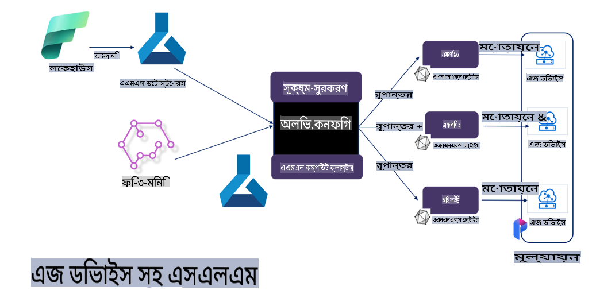

# **Microsoft Olive দিয়ে Phi-3 ফাইন-টিউনিং**

[Olive](https://github.com/microsoft/OLive?WT.mc_id=aiml-138114-kinfeylo) একটি সহজে ব্যবহারযোগ্য হার্ডওয়্যার-সচেতন মডেল অপটিমাইজেশন টুল, যা মডেল কম্প্রেশন, অপটিমাইজেশন এবং কম্পাইলেশনের জন্য শিল্পে শীর্ষস্থানীয় পদ্ধতিগুলো একত্রিত করে।

এটি মেশিন লার্নিং মডেলগুলোর অপটিমাইজেশন প্রক্রিয়াকে সহজ করার জন্য ডিজাইন করা হয়েছে, যাতে নির্দিষ্ট হার্ডওয়্যার আর্কিটেকচারগুলো সর্বোচ্চ কার্যকারিতা পায়।

আপনি ক্লাউড-ভিত্তিক অ্যাপ্লিকেশন বা এজ ডিভাইসে কাজ করলেও, Olive আপনার মডেলগুলো সহজেই এবং কার্যকরভাবে অপটিমাইজ করতে সক্ষম।

## প্রধান বৈশিষ্ট্যসমূহ:
- Olive নির্দিষ্ট হার্ডওয়্যার টার্গেটের জন্য অপটিমাইজেশন পদ্ধতিগুলো একত্রিত এবং স্বয়ংক্রিয় করে।
- একক কোনো অপটিমাইজেশন পদ্ধতি সব পরিস্থিতির জন্য উপযুক্ত নয়, তাই Olive বিশেষজ্ঞদের নতুন অপটিমাইজেশন উদ্ভাবন যুক্ত করার সুযোগ দেয়।

## প্রকৌশল প্রচেষ্টা হ্রাস করুন:
- ডেভেলপারদের প্রায়ই বিভিন্ন হার্ডওয়্যার বিক্রেতার নির্দিষ্ট টুলচেইন শিখতে এবং ব্যবহার করতে হয়, প্রশিক্ষিত মডেলগুলো ডেপ্লয়মেন্টের জন্য প্রস্তুত ও অপটিমাইজ করতে।
- Olive এই অভিজ্ঞতাকে সরল করে, পছন্দসই হার্ডওয়্যারের জন্য অপটিমাইজেশন পদ্ধতিগুলো স্বয়ংক্রিয় করে।

## প্রস্তুত-ব্যবহারযোগ্য E2E অপটিমাইজেশন সমাধান:

সমন্বিত পদ্ধতিগুলোকে গঠন ও টিউন করে, Olive একটি একীভূত সমাধান প্রদান করে সম্পূর্ণ প্রক্রিয়ার অপটিমাইজেশনের জন্য। এটি নির্ভুলতা ও লেটেন্সির মতো সীমাবদ্ধতাগুলোকে বিবেচনায় নিয়ে মডেল অপটিমাইজ করে।

## Microsoft Olive ব্যবহার করে ফাইন-টিউনিং

Microsoft Olive একটি অত্যন্ত সহজে ব্যবহারযোগ্য ওপেন সোর্স মডেল অপটিমাইজেশন টুল, যা জেনারেটিভ আর্টিফিশিয়াল ইন্টেলিজেন্সের ক্ষেত্রে ফাইন-টিউনিং এবং রেফারেন্স উভয়ই কভার করতে পারে। এটি শুধুমাত্র সহজ কনফিগারেশন প্রয়োজন, এবং ওপেন সোর্স ছোট ভাষার মডেল এবং সংশ্লিষ্ট রানটাইম পরিবেশ (AzureML / স্থানীয় GPU, CPU, DirectML) ব্যবহার করে, আপনি স্বয়ংক্রিয় অপটিমাইজেশনের মাধ্যমে মডেলের ফাইন-টিউনিং বা রেফারেন্স সম্পন্ন করতে পারেন এবং ক্লাউড বা এজ ডিভাইসে ডেপ্লয় করার জন্য সেরা মডেল খুঁজে পেতে পারেন। এটি এন্টারপ্রাইজগুলোকে তাদের নিজস্ব শিল্প ভার্টিক্যাল মডেল তৈরি করতে দেয় অন-প্রিমাইস এবং ক্লাউডে।


## Microsoft Olive দিয়ে Phi-3 ফাইন-টিউনিং



## Phi-3 Olive নমুনা কোড এবং উদাহরণ
এই উদাহরণে আপনি Olive ব্যবহার করবেন:

- LoRA অ্যাডাপ্টার ফাইন-টিউন করতে, যা Sad, Joy, Fear, Surprise-এ বাক্যাংশগুলো শ্রেণীবদ্ধ করবে।
- অ্যাডাপ্টারের ওজনগুলো বেস মডেলের সঙ্গে মার্জ করতে।
- মডেলটিকে অপটিমাইজ এবং INT4-এ কোয়ান্টাইজ করতে।

[নমুনা কোড](../../code/03.Finetuning/olive-ort-example/README.md)

### Microsoft Olive সেটআপ

Microsoft Olive ইনস্টলেশন খুবই সহজ, এবং এটি CPU, GPU, DirectML এবং Azure ML-এর জন্য ইনস্টল করা যায়।

```bash
pip install olive-ai
```

যদি আপনি CPU-তে ONNX মডেল চালাতে চান, আপনি ব্যবহার করতে পারেন:

```bash
pip install olive-ai[cpu]
```

যদি আপনি GPU-তে ONNX মডেল চালাতে চান, আপনি ব্যবহার করতে পারেন:

```python
pip install olive-ai[gpu]
```

যদি আপনি Azure ML ব্যবহার করতে চান, তাহলে ব্যবহার করুন:

```python
pip install git+https://github.com/microsoft/Olive#egg=olive-ai[azureml]
```

**দ্রষ্টব্য**  
OS প্রয়োজনীয়তা: Ubuntu 20.04 / 22.04  

### **Microsoft Olive-এর Config.json**

ইনস্টলেশনের পরে, আপনি কনফিগ ফাইলের মাধ্যমে বিভিন্ন মডেল-নির্দিষ্ট সেটিংস কনফিগার করতে পারেন, যার মধ্যে রয়েছে ডেটা, কম্পিউটিং, ট্রেনিং, ডেপ্লয়মেন্ট এবং মডেল জেনারেশন।

**1. ডেটা**

Microsoft Olive-এ স্থানীয় ডেটা এবং ক্লাউড ডেটায় ট্রেনিং সমর্থিত, এবং সেটিংসে এটি কনফিগার করা যায়।

*স্থানীয় ডেটা সেটিংস*

আপনি সহজেই সেই ডেটাসেট সেটআপ করতে পারেন, যা ফাইন-টিউনিংয়ের জন্য ট্রেনিং করতে হবে। সাধারণত এটি json ফরম্যাটে থাকে এবং ডেটা টেমপ্লেটের সঙ্গে মানিয়ে নিতে হয়। এটি মডেলের প্রয়োজন অনুযায়ী সামঞ্জস্য করতে হবে (যেমন Microsoft Phi-3-mini-এর প্রয়োজনীয় ফরম্যাটে মানিয়ে নেওয়া। অন্য মডেল থাকলে, তাদের প্রয়োজনীয় ফাইন-টিউনিং ফরম্যাট অনুযায়ী প্রক্রিয়া করুন।)

```json

    "data_configs": [
        {
            "name": "dataset_default_train",
            "type": "HuggingfaceContainer",
            "load_dataset_config": {
                "params": {
                    "data_name": "json", 
                    "data_files":"dataset/dataset-classification.json",
                    "split": "train"
                }
            },
            "pre_process_data_config": {
                "params": {
                    "dataset_type": "corpus",
                    "text_cols": [
                            "phrase",
                            "tone"
                    ],
                    "text_template": "### Text: {phrase}\n### The tone is:\n{tone}",
                    "corpus_strategy": "join",
                    "source_max_len": 2048,
                    "pad_to_max_len": false,
                    "use_attention_mask": false
                }
            }
        }
    ],
```

**ক্লাউড ডেটা সোর্স সেটিংস**

Azure AI Studio/Azure Machine Learning Service-এর ডেটাস্টোরের সঙ্গে লিঙ্ক করে ক্লাউডের ডেটা যুক্ত করুন। Microsoft Fabric এবং Azure Data-এর মাধ্যমে বিভিন্ন ডেটা সোর্স Azure AI Studio/Azure Machine Learning Service-এ নিয়ে আসা যায়, যা ফাইন-টিউনিংয়ের ডেটার জন্য সমর্থন প্রদান করে।

```json

    "data_configs": [
        {
            "name": "dataset_default_train",
            "type": "HuggingfaceContainer",
            "load_dataset_config": {
                "params": {
                    "data_name": "json", 
                    "data_files": {
                        "type": "azureml_datastore",
                        "config": {
                            "azureml_client": {
                                "subscription_id": "Your Azure Subscrition ID",
                                "resource_group": "Your Azure Resource Group",
                                "workspace_name": "Your Azure ML Workspaces name"
                            },
                            "datastore_name": "workspaceblobstore",
                            "relative_path": "Your train_data.json Azure ML Location"
                        }
                    },
                    "split": "train"
                }
            },
            "pre_process_data_config": {
                "params": {
                    "dataset_type": "corpus",
                    "text_cols": [
                            "Question",
                            "Best Answer"
                    ],
                    "text_template": "<|user|>\n{Question}<|end|>\n<|assistant|>\n{Best Answer}\n<|end|>",
                    "corpus_strategy": "join",
                    "source_max_len": 2048,
                    "pad_to_max_len": false,
                    "use_attention_mask": false
                }
            }
        }
    ],
    
```

**2. কম্পিউটিং কনফিগারেশন**

যদি স্থানীয়ভাবে প্রয়োজন হয়, তবে আপনি সরাসরি স্থানীয় ডেটা রিসোর্স ব্যবহার করতে পারেন। যদি Azure AI Studio/Azure Machine Learning Service-এর রিসোর্স ব্যবহার করতে হয়, তবে সংশ্লিষ্ট Azure প্যারামিটার, কম্পিউটিং ক্ষমতার নাম ইত্যাদি কনফিগার করতে হবে।

```json

    "systems": {
        "aml": {
            "type": "AzureML",
            "config": {
                "accelerators": ["gpu"],
                "hf_token": true,
                "aml_compute": "Your Azure AI Studio / Azure Machine Learning Service Compute Name",
                "aml_docker_config": {
                    "base_image": "Your Azure AI Studio / Azure Machine Learning Service docker",
                    "conda_file_path": "conda.yaml"
                }
            }
        },
        "azure_arc": {
            "type": "AzureML",
            "config": {
                "accelerators": ["gpu"],
                "aml_compute": "Your Azure AI Studio / Azure Machine Learning Service Compute Name",
                "aml_docker_config": {
                    "base_image": "Your Azure AI Studio / Azure Machine Learning Service docker",
                    "conda_file_path": "conda.yaml"
                }
            }
        }
    },
```

***দ্রষ্টব্য***  

কারণ এটি Azure AI Studio/Azure Machine Learning Service-এ একটি কন্টেইনারের মাধ্যমে চালানো হয়, প্রয়োজনীয় পরিবেশ কনফিগার করতে হবে। এটি conda.yaml পরিবেশে কনফিগার করা হয়।

```yaml

name: project_environment
channels:
  - defaults
dependencies:
  - python=3.8.13
  - pip=22.3.1
  - pip:
      - einops
      - accelerate
      - azure-keyvault-secrets
      - azure-identity
      - bitsandbytes
      - datasets
      - huggingface_hub
      - peft
      - scipy
      - sentencepiece
      - torch>=2.2.0
      - transformers
      - git+https://github.com/microsoft/Olive@jiapli/mlflow_loading_fix#egg=olive-ai[gpu]
      - --extra-index-url https://aiinfra.pkgs.visualstudio.com/PublicPackages/_packaging/ORT-Nightly/pypi/simple/ 
      - ort-nightly-gpu==1.18.0.dev20240307004
      - --extra-index-url https://aiinfra.pkgs.visualstudio.com/PublicPackages/_packaging/onnxruntime-genai/pypi/simple/
      - onnxruntime-genai-cuda

    

```

**3. আপনার SLM বাছাই করুন**

আপনি সরাসরি Hugging Face থেকে মডেল ব্যবহার করতে পারেন, অথবা Azure AI Studio / Azure Machine Learning-এর Model Catalog-এর সঙ্গে একত্রিত করে মডেল নির্বাচন করতে পারেন। নিচের কোড উদাহরণে Microsoft Phi-3-mini মডেলটি ব্যবহার করা হবে।

যদি আপনার মডেল স্থানীয়ভাবে থাকে, তাহলে এই পদ্ধতি ব্যবহার করুন:

```json

    "input_model":{
        "type": "PyTorchModel",
        "config": {
            "hf_config": {
                "model_name": "model-cache/microsoft/phi-3-mini",
                "task": "text-generation",
                "model_loading_args": {
                    "trust_remote_code": true
                }
            }
        }
    },
```

যদি আপনি Azure AI Studio / Azure Machine Learning Service থেকে মডেল ব্যবহার করতে চান, তাহলে এই পদ্ধতি ব্যবহার করুন:

```json

    "input_model":{
        "type": "PyTorchModel",
        "config": {
            "model_path": {
                "type": "azureml_registry_model",
                "config": {
                    "name": "microsoft/Phi-3-mini-4k-instruct",
                    "registry_name": "azureml-msr",
                    "version": "11"
                }
            },
             "model_file_format": "PyTorch.MLflow",
             "hf_config": {
                "model_name": "microsoft/Phi-3-mini-4k-instruct",
                "task": "text-generation",
                "from_pretrained_args": {
                    "trust_remote_code": true
                }
            }
        }
    },
```

**দ্রষ্টব্য:**  
আমাদের Azure AI Studio / Azure Machine Learning Service-এর সঙ্গে ইন্টিগ্রেট করতে হবে, তাই মডেল সেটআপ করার সময় সংস্করণ নম্বর এবং সংশ্লিষ্ট নামকরণ অনুসরণ করুন।  

Azure-এর সব মডেল PyTorch.MLflow-এ সেট করা প্রয়োজন।  

আপনার একটি Hugging Face অ্যাকাউন্ট থাকতে হবে এবং সেটি Azure AI Studio / Azure Machine Learning-এর Key value-তে সংযুক্ত করতে হবে।  

**4. অ্যালগরিদম**

Microsoft Olive Lora এবং QLora ফাইন-টিউনিং অ্যালগরিদমগুলো খুব ভালোভাবে এনক্যাপসুলেট করেছে। আপনাকে কেবল কিছু প্রাসঙ্গিক প্যারামিটার কনফিগার করতে হবে। এখানে QLora-এর উদাহরণ দেওয়া হলো:

```json
        "lora": {
            "type": "LoRA",
            "config": {
                "target_modules": [
                    "o_proj",
                    "qkv_proj"
                ],
                "double_quant": true,
                "lora_r": 64,
                "lora_alpha": 64,
                "lora_dropout": 0.1,
                "train_data_config": "dataset_default_train",
                "eval_dataset_size": 0.3,
                "training_args": {
                    "seed": 0,
                    "data_seed": 42,
                    "per_device_train_batch_size": 1,
                    "per_device_eval_batch_size": 1,
                    "gradient_accumulation_steps": 4,
                    "gradient_checkpointing": false,
                    "learning_rate": 0.0001,
                    "num_train_epochs": 3,
                    "max_steps": 10,
                    "logging_steps": 10,
                    "evaluation_strategy": "steps",
                    "eval_steps": 187,
                    "group_by_length": true,
                    "adam_beta2": 0.999,
                    "max_grad_norm": 0.3
                }
            }
        },
```

যদি আপনি কোয়ান্টাইজেশন কনভার্সন করতে চান, Microsoft Olive-এর প্রধান শাখা ইতিমধ্যে onnxruntime-genai পদ্ধতিকে সমর্থন করে। আপনার প্রয়োজন অনুযায়ী এটি সেট করতে পারেন:

1. অ্যাডাপ্টারের ওজনগুলো বেস মডেলের সঙ্গে মার্জ করা।  
2. ModelBuilder-এর মাধ্যমে মডেলটিকে প্রয়োজনীয় নির্ভুলতায় onnx মডেলে রূপান্তর করা।  

যেমন INT4-এ কোয়ান্টাইজ করা:

```json

        "merge_adapter_weights": {
            "type": "MergeAdapterWeights"
        },
        "builder": {
            "type": "ModelBuilder",
            "config": {
                "precision": "int4"
            }
        }
```

**দ্রষ্টব্য**  
- যদি আপনি QLoRA ব্যবহার করেন, তবে ONNXRuntime-genai-এর কোয়ান্টাইজেশন কনভার্সন বর্তমানে সমর্থিত নয়।  

- এখানে উল্লেখ করা উচিত যে আপনি উপরের ধাপগুলো আপনার প্রয়োজন অনুযায়ী সেট করতে পারেন। সম্পূর্ণভাবে উপরের প্রতিটি ধাপ কনফিগার করা আবশ্যক নয়। আপনার প্রয়োজন অনুযায়ী শুধুমাত্র অ্যালগরিদমের ধাপগুলো ব্যবহার করতে পারেন। ফাইন-টিউনিং না করেও কাজ করা সম্ভব। অবশেষে আপনাকে প্রাসঙ্গিক ইঞ্জিন কনফিগার করতে হবে।  

```json

    "engine": {
        "log_severity_level": 0,
        "host": "aml",
        "target": "aml",
        "search_strategy": false,
        "execution_providers": ["CUDAExecutionProvider"],
        "cache_dir": "../model-cache/models/phi3-finetuned/cache",
        "output_dir" : "../model-cache/models/phi3-finetuned"
    }
```

**5. ফাইন-টিউনিং সম্পন্ন**

কমান্ড লাইনে, olive-config.json ডিরেক্টরিতে নিচের কমান্ডটি চালান:

```bash
olive run --config olive-config.json  
```

**অস্বীকৃতি**:  
এই নথিটি মেশিন-ভিত্তিক কৃত্রিম বুদ্ধিমত্তা অনুবাদ সেবা ব্যবহার করে অনুবাদ করা হয়েছে। আমরা যথাসাধ্য নির্ভুলতার জন্য চেষ্টা করি, তবে অনুগ্রহ করে জানবেন যে স্বয়ংক্রিয় অনুবাদে ভুল বা অসঙ্গতি থাকতে পারে। নথিটির মূল ভাষায় রচিত সংস্করণটিকে প্রামাণিক উৎস হিসেবে বিবেচনা করা উচিত। গুরুত্বপূর্ণ তথ্যের জন্য পেশাদার মানব অনুবাদের পরামর্শ দেওয়া হয়। এই অনুবাদ ব্যবহার থেকে উদ্ভূত কোনো ভুল বোঝাবুঝি বা ভুল ব্যাখ্যার জন্য আমরা দায়ী নই।