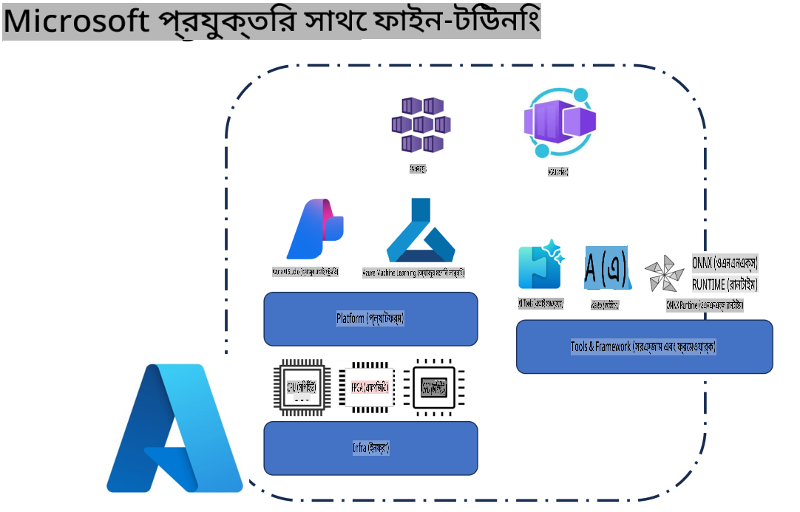
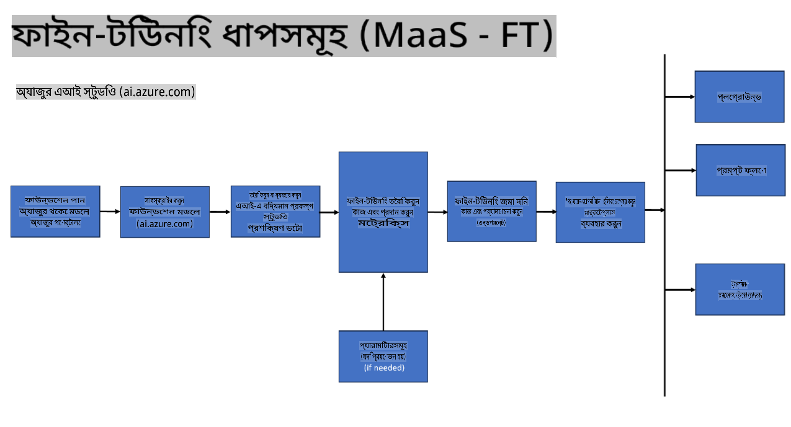
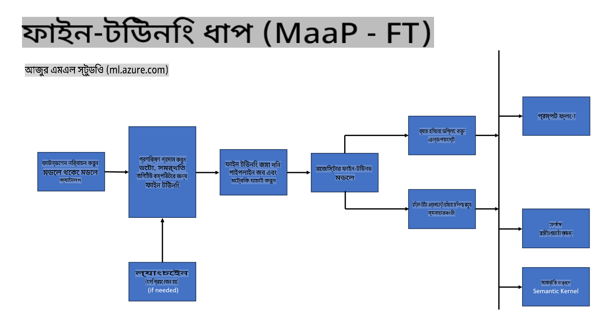
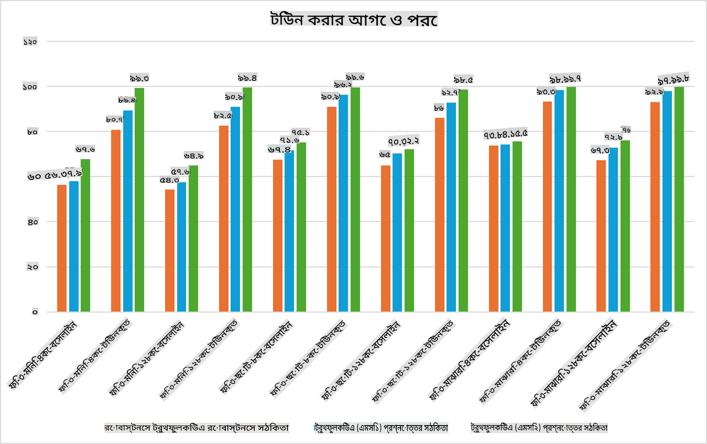

## ফাইন টিউনিং পরিস্থিতি

**প্ল্যাটফর্ম** এতে Azure AI Foundry, Azure Machine Learning, AI Tools, Kaito এবং ONNX Runtime এর মতো বিভিন্ন প্রযুক্তি অন্তর্ভুক্ত। 

**ইনফ্রাস্ট্রাকচার** এতে CPU এবং FPGA অন্তর্ভুক্ত, যা ফাইন টিউনিং প্রক্রিয়ার জন্য অত্যন্ত গুরুত্বপূর্ণ। আমি প্রতিটি প্রযুক্তির আইকন দেখাই।

**টুলস ও ফ্রেমওয়ার্ক** এতে ONNX Runtime এবং ONNX Runtime অন্তর্ভুক্ত। আমি প্রতিটি প্রযুক্তির আইকন দেখাই।
[ONNX Runtime এবং ONNX Runtime এর জন্য আইকন যুক্ত করুন]

Microsoft প্রযুক্তি ব্যবহার করে ফাইন টিউনিং প্রক্রিয়ায় বিভিন্ন উপাদান এবং টুলস অন্তর্ভুক্ত থাকে। এই প্রযুক্তিগুলি বুঝে এবং ব্যবহার করে, আমরা আমাদের অ্যাপ্লিকেশনগুলো কার্যকরভাবে ফাইন টিউন করতে পারি এবং উন্নত সমাধান তৈরি করতে পারি। 

## মডেল অ্যাজ সার্ভিস

হোস্টেড ফাইন টিউনিং ব্যবহার করে মডেল ফাইন টিউন করুন, কম্পিউট তৈরি এবং পরিচালনা করার প্রয়োজন ছাড়াই।

Phi-3-mini এবং Phi-3-medium মডেলের জন্য সার্ভারলেস ফাইন টিউনিং উপলব্ধ, যা ডেভেলপারদের ক্লাউড এবং এজ পরিস্থিতিতে দ্রুত এবং সহজেই মডেল কাস্টমাইজ করার সুযোগ দেয়, কম্পিউট ব্যবস্থা করার প্রয়োজন ছাড়াই। আমরা ঘোষণা করেছি যে Phi-3-small এখন আমাদের Models-as-a-Service অফারিং এর মাধ্যমে উপলব্ধ, যা ডেভেলপারদের এআই ডেভেলপমেন্ট শুরু করতে এবং প্রয়োজনীয় অবকাঠামো পরিচালনা ছাড়াই সহজ করে তোলে। 

## মডেল অ্যাজ প্ল্যাটফর্ম

ব্যবহারকারীরা তাদের নিজস্ব কম্পিউট পরিচালনা করেন তাদের মডেল ফাইন টিউন করার জন্য।

[ফাইন টিউনিং নমুনা](https://github.com/Azure/azureml-examples/blob/main/sdk/python/foundation-models/system/finetune/chat-completion/chat-completion.ipynb)

## ফাইন টিউনিং পরিস্থিতি

| | | | | | | |
|-|-|-|-|-|-|-|
|পরিস্থিতি|LoRA|QLoRA|PEFT|DeepSpeed|ZeRO|DORA|
|পূর্ব-প্রশিক্ষিত LLMs কে নির্দিষ্ট কাজ বা ডোমেইনের সাথে মানিয়ে নেওয়া|হ্যাঁ|হ্যাঁ|হ্যাঁ|হ্যাঁ|হ্যাঁ|হ্যাঁ|
|টেক্সট ক্লাসিফিকেশন, নামযুক্ত সত্তা সনাক্তকরণ, এবং মেশিন অনুবাদের মতো NLP কাজের জন্য ফাইন টিউনিং|হ্যাঁ|হ্যাঁ|হ্যাঁ|হ্যাঁ|হ্যাঁ|হ্যাঁ|
|QA কাজের জন্য ফাইন টিউনিং|হ্যাঁ|হ্যাঁ|হ্যাঁ|হ্যাঁ|হ্যাঁ|হ্যাঁ|
|চ্যাটবটের জন্য মানবসদৃশ প্রতিক্রিয়া তৈরি করতে ফাইন টিউনিং|হ্যাঁ|হ্যাঁ|হ্যাঁ|হ্যাঁ|হ্যাঁ|হ্যাঁ|
|সংগীত, শিল্প, বা অন্যান্য সৃজনশীলতার ফর্ম তৈরি করতে ফাইন টিউনিং|হ্যাঁ|হ্যাঁ|হ্যাঁ|হ্যাঁ|হ্যাঁ|হ্যাঁ|
|গণনা এবং আর্থিক খরচ কমানো|হ্যাঁ|হ্যাঁ|না|হ্যাঁ|হ্যাঁ|না|
|মেমরি ব্যবহারের পরিমাণ কমানো|না|হ্যাঁ|না|হ্যাঁ|হ্যাঁ|হ্যাঁ|
|কার্যকর ফাইন টিউনিং এর জন্য কম প্যারামিটার ব্যবহার করা|না|হ্যাঁ|হ্যাঁ|না|না|হ্যাঁ|
|ডেটা প্যারালেলিজমের একটি মেমরি-কার্যকর ফর্ম যা সমস্ত উপলব্ধ GPU ডিভাইসের সম্মিলিত GPU মেমরির অ্যাক্সেস দেয়|না|না|না|হ্যাঁ|হ্যাঁ|হ্যাঁ|

## ফাইন টিউনিং পারফরম্যান্স উদাহরণ

**অস্বীকৃতি**:  
এই নথিটি মেশিন-ভিত্তিক এআই অনুবাদ পরিষেবা ব্যবহার করে অনুবাদ করা হয়েছে। আমরা যথাসম্ভব সঠিক অনুবাদের চেষ্টা করি, তবে দয়া করে মনে রাখবেন যে স্বয়ংক্রিয় অনুবাদে ভুল বা অসঙ্গতি থাকতে পারে। নথিটির মূল ভাষায় থাকা আসল সংস্করণটিকেই নির্ভরযোগ্য উৎস হিসেবে বিবেচনা করা উচিত। গুরুত্বপূর্ণ তথ্যের জন্য, পেশাদার মানব অনুবাদ সুপারিশ করা হয়। এই অনুবাদ ব্যবহার থেকে উদ্ভূত যেকোনো ভুল বোঝাবুঝি বা ভুল ব্যাখ্যার জন্য আমরা দায়ী নই।