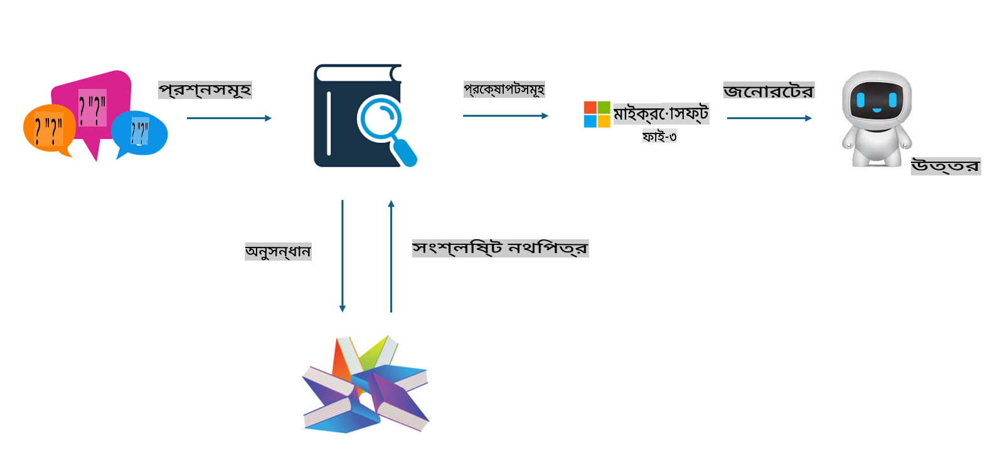

## ফাইনটিউনিং বনাম RAG

## রিট্রিভাল অগমেন্টেড জেনারেশন

RAG হল ডেটা রিট্রিভাল + টেক্সট জেনারেশন। এন্টারপ্রাইজের কাঠামোবদ্ধ এবং অ-কাঠামোবদ্ধ ডেটা ভেক্টর ডেটাবেসে সংরক্ষিত থাকে। যখন প্রাসঙ্গিক কন্টেন্ট অনুসন্ধান করা হয়, তখন প্রাসঙ্গিক সারাংশ এবং কন্টেন্ট খুঁজে একটি প্রসঙ্গ তৈরি করা হয়, এবং LLM/SLM-এর টেক্সট সম্পূর্ণ করার ক্ষমতার সাথে মিলিয়ে কন্টেন্ট তৈরি করা হয়।

## RAG প্রক্রিয়া

## ফাইনটিউনিং
ফাইনটিউনিং একটি নির্দিষ্ট মডেলের উন্নতির উপর ভিত্তি করে। এটি মডেল অ্যালগরিদম থেকে শুরু করার প্রয়োজন হয় না, তবে ডেটা ক্রমাগত সংগ্রহ করতে হয়। যদি আপনি শিল্প ক্ষেত্রে আরও সুনির্দিষ্ট পরিভাষা এবং ভাষার প্রকাশ চান, তবে ফাইনটিউনিং আপনার জন্য ভালো বিকল্প। তবে যদি আপনার ডেটা প্রায়ই পরিবর্তিত হয়, তাহলে ফাইনটিউনিং জটিল হয়ে যেতে পারে।

## কীভাবে নির্বাচন করবেন
যদি আমাদের উত্তরের জন্য বাহ্যিক ডেটার প্রয়োজন হয়, তবে RAG সবচেয়ে ভালো বিকল্প।

যদি আপনাকে স্থিতিশীল এবং সুনির্দিষ্ট শিল্প জ্ঞান আউটপুট করতে হয়, তবে ফাইনটিউনিং একটি ভালো বিকল্প হবে। RAG প্রাসঙ্গিক কন্টেন্ট টানতে অগ্রাধিকার দেয়, তবে এটি সব সময় বিশেষায়িত সূক্ষ্ম বিষয়গুলো ধরতে পারে না।

ফাইনটিউনিং-এর জন্য একটি উচ্চ-গুণমানের ডেটা সেট প্রয়োজন, এবং যদি এটি শুধুমাত্র একটি ছোট ডেটার পরিসর হয়, তবে এটি খুব বেশি পার্থক্য আনবে না। RAG আরও নমনীয়।  
ফাইনটিউনিং একটি ব্ল্যাক বক্স, একটি মেটাফিজিক্স, এবং এর অভ্যন্তরীণ প্রক্রিয়া বোঝা কঠিন। কিন্তু RAG ডেটার উৎস খুঁজে বের করা সহজ করে তুলতে পারে, এর ফলে বিভ্রান্তি বা কন্টেন্ট ত্রুটি কার্যকরভাবে সমন্বয় করা যায় এবং আরও ভালো স্বচ্ছতা প্রদান করা যায়।

**অস্বীকৃতি**:  
এই নথিটি মেশিন-ভিত্তিক এআই অনুবাদ পরিষেবার মাধ্যমে অনুবাদ করা হয়েছে। আমরা যথাসম্ভব সঠিক অনুবাদের চেষ্টা করি, তবে অনুগ্রহ করে মনে রাখবেন যে স্বয়ংক্রিয় অনুবাদে ত্রুটি বা অসঙ্গতি থাকতে পারে। এর মূল ভাষায় থাকা আসল নথিটিকেই প্রামাণিক উৎস হিসেবে বিবেচনা করা উচিত। গুরুত্বপূর্ণ তথ্যের জন্য পেশাদার মানব অনুবাদ ব্যবহার করার পরামর্শ দেওয়া হচ্ছে। এই অনুবাদ ব্যবহারের ফলে কোনো ভুল বোঝাবুঝি বা ভুল ব্যাখ্যা হলে আমরা তার জন্য দায়ী থাকব না।