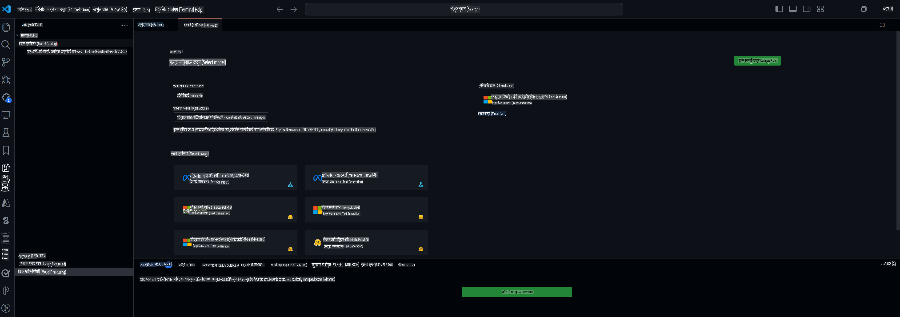

## VS Code এর জন্য AI টুলকিটে স্বাগতম

[VS Code এর জন্য AI টুলকিট](https://github.com/microsoft/vscode-ai-toolkit/tree/main) Azure AI Studio ক্যাটালগ এবং Hugging Face এর মতো অন্যান্য ক্যাটালগের বিভিন্ন মডেল একত্রিত করে। এই টুলকিটটি জেনারেটিভ AI টুল এবং মডেল ব্যবহার করে AI অ্যাপ তৈরির জন্য সাধারণ ডেভেলপমেন্ট কাজগুলোকে সহজ করে তোলে:
- মডেল আবিষ্কার এবং প্লেগ্রাউন্ড দিয়ে শুরু করুন।
- স্থানীয় কম্পিউটিং রিসোর্স ব্যবহার করে মডেল ফাইন-টিউনিং এবং ইনফারেন্স।
- Azure রিসোর্স ব্যবহার করে রিমোট ফাইন-টিউনিং এবং ইনফারেন্স।

[VS Code এর জন্য AI টুলকিট ইনস্টল করুন](https://marketplace.visualstudio.com/items?itemName=ms-windows-ai-studio.windows-ai-studio)



**[Private Preview]** ক্লাউডে মডেল ফাইন-টিউনিং এবং ইনফারেন্স চালানোর জন্য Azure Container Apps-এর জন্য এক-ক্লিক প্রভিশনিং।

এখন চলুন আপনার AI অ্যাপ ডেভেলপমেন্ট শুরু করা যাক:

- [VS Code এর জন্য AI টুলকিটে স্বাগতম](../../../../md/03.FineTuning)
- [স্থানীয় ডেভেলপমেন্ট](../../../../md/03.FineTuning)
  - [প্রস্তুতি](../../../../md/03.FineTuning)
  - [কন্ডা অ্যাক্টিভেট করুন](../../../../md/03.FineTuning)
  - [শুধু বেস মডেল ফাইন-টিউনিং](../../../../md/03.FineTuning)
  - [মডেল ফাইন-টিউনিং এবং ইনফারেন্সিং](../../../../md/03.FineTuning)
  - [মডেল ফাইন-টিউনিং](../../../../md/03.FineTuning)
  - [Microsoft Olive](../../../../md/03.FineTuning)
  - [ফাইন-টিউনিং নমুনা এবং রিসোর্স](../../../../md/03.FineTuning)
- [**\[Private Preview\]** রিমোট ডেভেলপমেন্ট](../../../../md/03.FineTuning)
  - [প্রয়োজনীয়তা](../../../../md/03.FineTuning)
  - [একটি রিমোট ডেভেলপমেন্ট প্রকল্প সেটআপ করা](../../../../md/03.FineTuning)
  - [Azure রিসোর্স প্রভিশন](../../../../md/03.FineTuning)
  - [\[ঐচ্ছিক\] Azure Container App Secret-এ Huggingface টোকেন যোগ করুন](../../../../md/03.FineTuning)
  - [ফাইন-টিউনিং চালান](../../../../md/03.FineTuning)
  - [ইনফারেন্স এন্ডপয়েন্ট প্রভিশন](../../../../md/03.FineTuning)
  - [ইনফারেন্স এন্ডপয়েন্ট ডিপ্লয় করুন](../../../../md/03.FineTuning)
  - [উন্নত ব্যবহার](../../../../md/03.FineTuning)

## স্থানীয় ডেভেলপমেন্ট
### প্রস্তুতি

1. নিশ্চিত করুন যে NVIDIA ড্রাইভার হোস্টে ইনস্টল করা আছে।  
2. যদি আপনি ডেটাসেট ব্যবহার করার জন্য HF ব্যবহার করেন, তবে `huggingface-cli login` চালান।  
3. `Olive` কী সেটিংস মেমরি ব্যবহারে পরিবর্তন আনার জন্য ব্যাখ্যা করুন।  

### কন্ডা অ্যাক্টিভেট করুন
আমরা যেহেতু WSL পরিবেশ ব্যবহার করছি এবং এটি শেয়ার করা, আপনাকে ম্যানুয়ালি কন্ডা পরিবেশ অ্যাক্টিভেট করতে হবে। এই ধাপের পরে আপনি ফাইন-টিউনিং বা ইনফারেন্স চালাতে পারবেন।

```bash
conda activate [conda-env-name] 
```

### শুধু বেস মডেল ফাইন-টিউনিং
শুধুমাত্র বেস মডেল পরীক্ষা করতে চাইলে কন্ডা অ্যাক্টিভেট করার পরে এই কমান্ডটি চালাতে পারেন।

```bash
cd inference

# Web browser interface allows to adjust a few parameters like max new token length, temperature and so on.
# User has to manually open the link (e.g. http://0.0.0.0:7860) in a browser after gradio initiates the connections.
python gradio_chat.py --baseonly
```

### মডেল ফাইন-টিউনিং এবং ইনফারেন্সিং

যখন ওয়ার্কস্পেস একটি ডেভ কন্টেইনারে খোলা হয়, তখন একটি টার্মিনাল খুলুন (ডিফল্ট পাথ প্রজেক্ট রুট), তারপর নির্বাচিত ডেটাসেটে একটি LLM ফাইন-টিউন করার জন্য নিচের কমান্ডটি চালান।

```bash
python finetuning/invoke_olive.py 
```

চেকপয়েন্ট এবং ফাইনাল মডেল `models` folder.

Next run inferencing with the fune-tuned model through chats in a `console`, `web browser` or `prompt flow`-এ সংরক্ষিত হবে।

```bash
cd inference

# Console interface.
python console_chat.py

# Web browser interface allows to adjust a few parameters like max new token length, temperature and so on.
# User has to manually open the link (e.g. http://127.0.0.1:7860) in a browser after gradio initiates the connections.
python gradio_chat.py
```

`prompt flow` in VS Code, please refer to this [Quick Start](https://microsoft.github.io/promptflow/how-to-guides/quick-start.html).

### Model Fine-tuning

Next, download the following model depending on the availability of a GPU on your device.

To initiate the local fine-tuning session using QLoRA, select a model you want to fine-tune from our catalog.
| Platform(s) | GPU available | Model name | Size (GB) |
|---------|---------|--------|--------|
| Windows | Yes | Phi-3-mini-4k-**directml**-int4-awq-block-128-onnx | 2.13GB |
| Linux | Yes | Phi-3-mini-4k-**cuda**-int4-onnx | 2.30GB |
| Windows<br>Linux | No | Phi-3-mini-4k-**cpu**-int4-rtn-block-32-acc-level-4-onnx | 2.72GB |

**_Note_** You do not need an Azure Account to download the models

The Phi3-mini (int4) model is approximately 2GB-3GB in size. Depending on your network speed, it could take a few minutes to download.

Start by selecting a project name and location.
Next, select a model from the model catalog. You will be prompted to download the project template. You can then click "Configure Project" to adjust various settings.

### Microsoft Olive 

We use [Olive](https://microsoft.github.io/Olive/why-olive.html) to run QLoRA fine-tuning on a PyTorch model from our catalog. All of the settings are preset with the default values to optimize to run the fine-tuning process locally with optimized use of memory, but it can be adjusted for your scenario.

### Fine Tuning Samples and Resoures

- [Fine tuning Getting Started Guide](https://learn.microsoft.com/windows/ai/toolkit/toolkit-fine-tune)
- [Fine tuning with a HuggingFace Dataset](https://github.com/microsoft/vscode-ai-toolkit/blob/main/archive/walkthrough-hf-dataset.md)
- [Fine tuning with Simple DataSet](https://github.com/microsoft/vscode-ai-toolkit/blob/main/archive/walkthrough-simple-dataset.md)

## **[Private Preview]** Remote Development

### Prerequisites

1. To run the model fine-tuning in your remote Azure Container App Environment, make sure your subscription has enough GPU capacity. Submit a [support ticket](https://azure.microsoft.com/support/create-ticket/) to request the required capacity for your application. [Get More Info about GPU capacity](https://learn.microsoft.com/azure/container-apps/workload-profiles-overview)
2. If you are using private dataset on HuggingFace, make sure you have a [HuggingFace account](https://huggingface.co/?WT.mc_id=aiml-137032-kinfeylo) and [generate an access token](https://huggingface.co/docs/hub/security-tokens?WT.mc_id=aiml-137032-kinfeylo)
3. Enable Remote Fine-tuning and Inference feature flag in the AI Toolkit for VS Code
   1. Open the VS Code Settings by selecting *File -> Preferences -> Settings*.
   2. Navigate to *Extensions* and select *AI Toolkit*.
   3. Select the *"Enable Remote Fine-tuning And Inference"* option.
   4. Reload VS Code to take effect.

- [Remote Fine tuning](https://github.com/microsoft/vscode-ai-toolkit/blob/main/archive/remote-finetuning.md)

### Setting Up a Remote Development Project
1. Execute the command palette `AI Toolkit: Focus on Resource View`.
2. Navigate to *Model Fine-tuning* to access the model catalog. Assign a name to your project and select its location on your machine. Then, hit the *"Configure Project"* button.
3. Project Configuration
    1. Avoid enabling the *"Fine-tune locally"* option.
    2. The Olive configuration settings will appear with pre-set default values. Please adjust and fill in these configurations as required.
    3. Move on to *Generate Project*. This stage leverages WSL and involves setting up a new Conda environment, preparing for future updates that include Dev Containers.
4. Click on *"Relaunch Window In Workspace"* to open your remote development project.

> **Note:** The project currently works either locally or remotely within the AI Toolkit for VS Code. If you choose *"Fine-tune locally"* during project creation, it will operate exclusively in WSL without remote development capabilities. On the other hand, if you forego enabling *"Fine-tune locally"*, the project will be restricted to the remote Azure Container App environment.

### Provision Azure Resources
To get started, you need to provision the Azure Resource for remote fine-tuning. Do this by running the `AI Toolkit: Provision Azure Container Apps job for fine-tuning` from the command palette.

Monitor the progress of the provision through the link displayed in the output channel.

### [Optional] Add Huggingface Token to the Azure Container App Secret
If you're using private HuggingFace dataset, set your HuggingFace token as an environment variable to avoid the need for manual login on the Hugging Face Hub.
You can do this using the `AI Toolkit: Add Azure Container Apps Job secret for fine-tuning command`. With this command, you can set the secret name as [`HF_TOKEN`](https://huggingface.co/docs/huggingface_hub/package_reference/environment_variables#hftoken) and use your Hugging Face token as the secret value.

### Run Fine-tuning
To start the remote fine-tuning job, execute the `AI Toolkit: Run fine-tuning` command.

To view the system and console logs, you can visit the Azure portal using the link in the output panel (more steps at [View and Query Logs on Azure](https://aka.ms/ai-toolkit/remote-provision#view-and-query-logs-on-azure)). Or, you can view the console logs directly in the VSCode output panel by running the command `AI Toolkit: Show the running fine-tuning job streaming logs`. 
> **Note:** The job might be queued due to insufficient resources. If the log is not displayed, execute the `AI Toolkit: Show the running fine-tuning job streaming logs` command, wait for a while and then execute the command again to re-connect to the streaming log.

During this process, QLoRA will be used for fine-tuning, and will create LoRA adapters for the model to use during inference.
The results of the fine-tuning will be stored in the Azure Files.

### Provision Inference Endpoint
After the adapters are trained in the remote environment, use a simple Gradio application to interact with the model.
Similar to the fine-tuning process, you need to set up the Azure Resources for remote inference by executing the `AI Toolkit: Provision Azure Container Apps for inference` from the command palette.

By default, the subscription and the resource group for inference should match those used for fine-tuning. The inference will use the same Azure Container App Environment and access the model and model adapter stored in Azure Files, which were generated during the fine-tuning step. 


### Deploy the Inference Endpoint
If you wish to revise the inference code or reload the inference model, please execute the `AI Toolkit: Deploy for inference` command. This will synchronize your latest code with Azure Container App and restart the replica.  

Once deployment is successfully completed, you can access the inference API by clicking on the "*Go to Inference Endpoint*" button displayed in the VSCode notification. Or, the web API endpoint can be found under `ACA_APP_ENDPOINT` in `./infra/inference.config.json` এবং আউটপুট প্যানেলে দেখা যাবে। আপনি এখন এই এন্ডপয়েন্ট ব্যবহার করে মডেলটি মূল্যায়ন করতে প্রস্তুত।

### উন্নত ব্যবহার
AI টুলকিট ব্যবহার করে রিমোট ডেভেলপমেন্টের বিষয়ে আরও জানতে, [রিমোটভাবে মডেল ফাইন-টিউনিং](https://aka.ms/ai-toolkit/remote-provision) এবং [ফাইন-টিউন করা মডেলের সাথে ইনফারেন্সিং](https://aka.ms/ai-toolkit/remote-inference) ডকুমেন্টেশনটি দেখুন।

**অস্বীকৃতি**:  
এই নথিটি মেশিন-ভিত্তিক এআই অনুবাদ পরিষেবা ব্যবহার করে অনুবাদ করা হয়েছে। আমরা যথাসাধ্য সঠিক অনুবাদের চেষ্টা করি, তবে অনুগ্রহ করে মনে রাখবেন যে স্বয়ংক্রিয় অনুবাদে ভুল বা অসঙ্গতি থাকতে পারে। নথিটির মূল ভাষায় রচিত সংস্করণটিকেই প্রামাণিক উৎস হিসেবে বিবেচনা করা উচিত। গুরুত্বপূর্ণ তথ্যের জন্য, পেশাদার মানব অনুবাদের পরামর্শ দেওয়া হয়। এই অনুবাদ ব্যবহার থেকে উদ্ভূত যেকোনো ভুল বোঝাবুঝি বা ভুল ব্যাখ্যার জন্য আমরা দায়ী থাকব না।